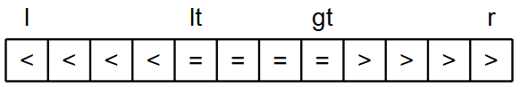

# 排序

## 定义

给定一个数据表 datalist，每个元素有一个属性域用于排序（即排序码 key），如果将数据表的元素按照排序码的非递减/非递增关系修改得到新的序列，称该操作为排序，对应的算法实现为排序算法

考虑数据表中两个元素 `a`, `b`，排序前 `a` 在 `b` 前面，且 `a`, `b` 排序码相等，如果排序后依旧能保证 `a` 在 `b` 前面，则排序算法稳定

排序算法的性能主要考虑数据比较次数 KCN 与数据移动次数 RMN

## 算法实现

给出一些常见的排序算法

### 插入排序

#### 直接插入排序

从 `data[1]` 元素开始，对于第 `i` 轮操作，取出 `data[i]`，在已排序部分 `data[0]` ~ `data[i-1]` 中从右向左遍历找出应该插入的位置，进行插入，此时 `data[0]` ~ `data[i]` 有序。进行 `n-1` 轮插入操作可以使数组有序

```c++ title="Insert Sort"
void insertSort(vector<int>& data, int l, int r){
    // 指定排序区间为 [l, r]
    for(int i = l + 1; i <= r; i++){
        if(data[i] < data[i-1]){
            // 暂存待插入的值
            int temp = data[i];
            j = i-1;
            // 逐个右移前面的有序部分，直到找到插入位置
            do{
                data[j+1] = data[j]; j--;
            } while(j >= l && temp < data[j]);
            // 插入
            data[j+1] = temp;
        }
    }
}
```

直接插入排序是**稳定**的，这是因为插入过程在搜索插入位置时停止在相同元素的右侧

考虑**最坏**情形，原数组完全逆序时，每次插入操作都需要对前面所有的元素进行比较，每次插入到最左端，此时有

$$
KCN = \sum _{i=1}^{n-1} i = \dfrac{n(n-1)}{2} \\\\
RMN = \sum _{i=1}^{n-1} (i+2) = \dfrac{(n+4)(n-1)}{2}
$$

> 解释：RMN 每轮累加 $i+2$ 是因为每次插入会将 `data[i]` 插入到最左端，涉及 `data[0]` ~ `data[i]` 与 `temp` 这 $i+2$ 个元素的移动

直接插入排序的平均时间复杂度是 $O(n^2)$ 

<br>

#### 折半插入排序

在直接插入排序的基础上，将 `data[i]` 插入到 `data[0]` ~ `data[i-1]` 时，不进行遍历搜索，而是进行二分查找。折半插入排序依旧是**稳定**的

```c++ title="Binary Insert Sort"
void binaryInsertSort(vector<int>& data, int l, int r) {
    for (int i = l + 1; i <= r; i++) {
        if (data[i] < data[i-1]) {
            // 暂存待插入的值
            int temp = data[i];

            // 这里修改为二分模板
            int left = l, right = i - 1;
            while (left <= right) {
                int mid = left + (right - left) / 2;
                // 这里 > 意味着排序是稳定的
                if (data[mid] > temp) {
                    right = mid - 1;
                } else {
                    left = mid + 1;
                }
            }

            // 将 left 到 i-1 的元素后移
            for (int j = i - 1; j >= left; j--) {
                data[j + 1] = data[j];
            }

            // 插入元素
            data[left] = temp;
        }
    }
}
```

此时 KCN 与待排序元素序列的初始值排列无关，仅依赖于元素个数，有：
$$
KCN = \sum_{i=1}^{n-1} \left(\lfloor  \log_2 i \rfloor + 1 \right) = O (n \log_2 n)
$$
RMN 和直接插入排序一样，最坏情况下依旧为 $RMN = \sum _{i=1}^{n-1} (i+2)$ 

注意折半插入排序的平均时间复杂度依旧是 $O(n^2)$，因为 RMN 没有变化，对 KCN 的优化并没有改变时间复杂度。在**比较操作的开销较大**时，才会带来较为明显的优化 

<br>

#### 希尔排序

希尔排序基于直接插入排序，为了避免完全逆序等情况下，每个元素移动幅度过大的问题，我们设计一个 gap 值（$gap < n$），将元素分为 gap 个子序列，所有距离为 gap 的元素放在同一个子序列中，然后对每一个子序列进行直接插入排序，然后逐渐减小 gap 值，直到最后 gap 等于 1，实现完全排序

开始时 gap 的值较大，子序列中的元素较少，排序速度较快；随着排序进展，gap 值逐渐变小，子序列中元素个数逐渐变多，但是由于前面工作的基础，大多数元素已基本有序，所以排序速度仍然很快

gap 减小的方式有很多种，比如从 $n$ 开始取 $gap = \lfloor gap /2 \rfloor$，或者平均更优的 $gap = \lfloor gap/3 \rfloor +1$

```c++ title="Shell Sort"
void shellSort(vector<int>& data, int l, int r) {
    int gap = r - l + 1;
    do {
        gap /= 2;	// gap = gap / 3 + 1
        // 和直接插入排序的区别是 1 变成了 gap
        for(int i = l + gap; i <= r; i++){
            if(data[i] < data[i-gap]){
                int temp = data[i];
                j = i - gap;
                // 逐个右移前面的有序部分，直到找到插入位置
                do{
                    data[j+gap] = data[j]; j -= gap;
                } while(j >= l && temp < data[j]);
                // 插入
                data[j+gap] = temp;
            }
        }
    } while (gap > 1);
}
```

希尔排序是**不稳定**的，因为涉及不同间隔 gap 间的比较交换操作

KCN 和 RMN 分析难度大；希尔排序的时间复杂度受到希尔增量序列的影响，并且目前没有完全证明确切的时间复杂度

<br>

### 交换排序

#### 冒泡排序

考虑将较小的元素向左冒泡的版本：长度为 2 的滑动窗口从数组末端开始向左滑动，每次对窗口内的两个元素比较大小，并对严格逆序情况进行 swap 操作。当滑动窗口向左抵达终点时，可以保证最小的元素被移到了最左边

进行 `n-1` 轮冒泡操作，第 i 轮对 `data[i-1]` ~ `data[n-1]` 进行处理，每次确认一个第 `i` 小的元素。可以维护一个 `swapped` 布尔变量，如果某轮冒泡操作没有进行一次交换操作，说明数组已有序，提前终止操作（不影响平均时间复杂度）

```c++ title="Bubble Sort"
void bubbleSort(vector<int>& data, int l, int r){
    // 指定排序区间为 [l, r]
    for(int i = l; i < r; i++){
        bool swapped = false;
        for(int j = r; j > i; j--){
            // 向左冒泡
            if(data[j] < data[j-1]){
                swap(data[j], data[j-1]);
                swapped = true;
            }
        }
        // 剪枝操作
        if(!swapped) break;
    }
}
```

冒泡排序是**稳定**的，这是因为交换操作仅在严格逆序下进行

考虑**最坏**情形，原数组完全逆序时，每次比较操作都需要进行 swap 操作，此时有

$$
KCN = \sum _{i=1}^{n-1} (n-i) = \dfrac{1}{2}n(n-1) \\\\
RMN = 3 \sum _{i=1}^{n-1} (n-i) = \dfrac{3}{2}n(n-1)
$$

> 解释：RMN = 3 × KCN 考虑单次 swap 操作中涉及 `a`, `b`, `temp` **三个**元素的对换操作，总共 swap $n-i$ 次

冒泡排序的平均时间复杂度是 $O(n^2)$ 

<br>

#### 快速排序

核心是分治思想：对于一个序列，选取一个元素作为基准值 `pivot`，将整个序列划分为 “`≤ pivot`” 和 “`> pivot`” 两部分（`pivot` 处于中间，也是最终排序结束后应该处于的位置），然后对这两部分子序列进行递归操作，最后将所有子序列合并，得到完全排序后的序列

```c++
void quickSort(vector<int>& data, int l, int r){
    if(l < r){
        int pivot_pos = partition(data, l, r);
        quickSort(data, l, pivot_pos);		// pivot 左半部分
        quickSort(data, pivot_pos+1, r);	// pivot 右半部分
    }
}
```

对于具体的划分操作，我们需要选定一个 `pivot`，然后一轮遍历找到 `pivot` 元素所在的排序后位置，其左侧值都不大于 `pivot`，其右侧值都大于 `pivot`

以下是 Hoare 分区方案，其选取中间元素作为 `pivot`

```c++
int partition(vector<int>& data, int l, int r) {
    // 选择中间元素作为pivot
    int pivot = data[(l + r) / 2];
    // 根据 do-while 语句设置边界
    int i = l - 1;
    int j = r + 1;

    // 每次找出一对 data[i] >= pivot >= data[j]
    // 对 data[i] 和 data[j] 进行交换
    while (true) {
        do {i++;} while (data[i] < pivot);
        do {j--;} while (data[j] > pivot);

        // 指针相遇或交叉
        // 后移动的 j 就是 pivot 的正确位置
        if (i >= j) return j;

        swap(data[i], data[j]);
    }
}
```

我们记上面的快速排序为双路快排，实际上，对于重复元素较多的序列，我们会采用三路快排，它将数组分为三部分：小于 `pivot`、等于 `pivot`、大于 `pivot`：



分区操作需要同时返回 `lt` 和 `gt` 的值，递归分治直接跳过 `[lt, gt]` 的部分：

```c++ title="Quick Sort"
pair<int, int> partition(vector<int>& data, int l, int r){
    int pivot = data[(l + r) / 2];
    int i = l;						// 遍历指针
    int lt = l, gt = r;				// == pivot 的左右边界 
    
    while (i <= gt){
        if(data[i] < pivot){
            swap(data[i], data[lt]);
            lt++; i++;
        } else if (data[i] > pivot){
            swap(data[i], data[gt]);
            gt--;
        } else{
            i++;
        }
    }
    return {lt, gt};
}

void quickSort(vector<int>& data, int l, int r){
    if(l < r){
        auto [lt, gt] = partition(data, l, r);
        quickSort(data, l, lt-1);
        quickSort(data, gt+1, r);
    }
}
```

快速排序是**不稳定**的，因为在 `partition` 中的交换操作仅通过比较 `pivot` 的方式判断是否交换，交换操作可能会破坏原序关系

快速排序的时间复杂度取决于递归树的深度，类似于二叉搜索树的插入操作，平均时间复杂度 $O(n \log n)$，最坏时间复杂度 $O(n^2)$ 

### 选择排序

#### 直接选择排序

从 `data[0]` 元素开始，对于第 `i` 轮操作，遍历 `data[i-1]` ~ `data[n-1]` 找出最小，进行插入，此时 `data[0]` ~ `data[i]` 有序。进行 `n-1` 轮插入操作可以使数组有序