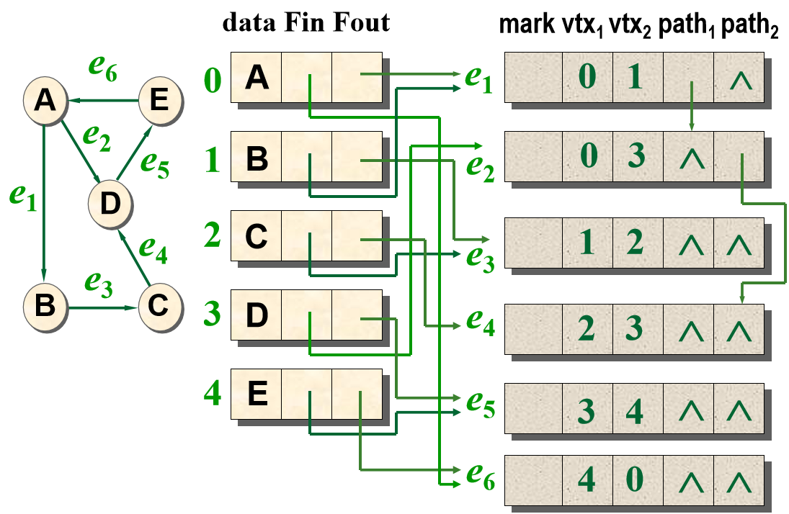

# 图基础

## 定义

图是由顶点集合 $V$ 及顶点间的关系集合（边集合 $E$）组成的一种数据结构 $G(V,E)$

## 概念

- 根据顶点对是否有序（边是否有方向）可以分为无向图和有向图

- 可以为每条边设计权值，此时图为带权图

- 如果从任一顶点可以一次（只通过一条边）到达其他任意顶点，那么这个图是完全图。 $n$ 个顶点的完全无向图有 $\dfrac{n(n-1)}{2}$ 条边；$n$ 个顶点的完全有向图有 $n(n-1)$ 条边

- 对于 $G(V,E)$ 与 $G'(V',E')$，如果 $V' \subseteq V$ 且 $G' \subseteq G$，则 $G'$ 是 $G$ 的子图

- 对于无向图，顶点的度是与它相关联的边的条数；对于有向图，顶点的入度是以该点为终点的有向边的条数，顶点的出度是以该点为起点的有向边的条数，顶点的度等于该顶点的入度与出度之和。度可以记为 $TD(v)$，入度和出度可以分别记为 $ID(v)$ 和 $OD(v)$

- 从图 $G(V,E)$ 的某一个顶点到达另一个顶点，期间经过若干条属于 $G$ 的边，记这一过程经过的顶点序列为路径，路径长度为边的个数（或者带权图的权值和）。如果顶点序列不重复，则路径为简单路径；如果首尾顶点相同，则路径为回路 / 环

- 在无向图中，如果任意一对顶点都是连通（有限步可达）的，则称此图是连通图。非连通图的极大连通子图叫做连通分量（孤立点也是一个连通分量）。

- 在有向图中，若对于每一对顶点 $v_i$ 和 $v_j$，都存在一条从 $v_i$ 到 $v_j$ 和从 $v_j$ 到 $v_i$ 的路径，则称此图是强连通图。非强连通图的极大强连通子图叫做强连通分量 SCC（孤立点也是一个强连通分量）。

由此得出两个推论：

--> **任意无向图的连通分量的并集（顶点与边）是原图本身，非连通无向图的连通分量的交集是空集；**

--> **任意有向图的强连通分量的并集（顶点与边）<u>不一定是原图本身（顶点符合，但是会丢失跨 SCC 的单向边）</u>，非强连通有向图的强连通分量的交集为空**

???+ question "一个最简单的，对“任意有向图的强连通分量的边集的并集不一定是原图本身”成立的例子"

    ```mermaid
    flowchart LR
    A((a)) --> B((b))
    ```
    
    图中的两个强连通分量分别是 $(\lbrace{a}\rbrace, \empty)$ 和 $(\lbrace{b}\rbrace, \empty)$，不包含跨 SCC 的边

- 一个连通图的极小连通子图是有一棵 $n-1$ 个顶点的树，记为生成树

## 图的构建

### 邻接矩阵

对 $n$ 个顶点的图建立 $n\times n$ 的矩阵 $M$，如果存在 $v_i$ 到 $v_j$ 的直达边，则 $M[v_i][v_j] = 1$，否则为 $0$。

对于带权图，如果存在 $v_i$ 到 $v_j$ 的直达边，则 $M[v_i][v_j] = \text{weight}$，否则记为 $+\infty$ （额外的，不考虑自环现象，则 $M[i][i] = 0$ 而不是 $+\infty$）

无向图的邻接矩阵是对称的；有向图的邻接矩阵可能是不对称的。

邻接矩阵相比邻接表具有数组 $O(1)$ 随机访问的优点；对有向图分别统计第 $i$ 行与第 $i$ 列的非零元素个数可以得到某个点的出度与入度；对无向图统计第 $i$ 行或第 $i$ 列的非零元素个数可以得到某个点的度

```c++ title="template"
struct Graph {
    int vertices[MAX_VERTICES][MAX_VERTICES];
    int vertices_cnt;
    int edges_cnt;
    bool directed;
    bool weighted;
};

void initGraph(Graph* graph, int n, bool directed = false, bool weighted = false) {
    graph->vertices_cnt = n;
    graph->edges_cnt = 0;
    graph->directed = directed;
    graph->weighted = weighted;

    for (int i = 0; i < n; i++) {
        for (int j = 0; j < n; j++) {
            if(weighted && i != j) graph->vertices[i][j] = INT_MAX;
            else graph->vertices[i][j] = 0;
        }
    }
}

void addEdge(Graph* graph, int src, int dest, int weight = 1) {
    if (src < 0 || src >= graph->vertices_cnt || dest < 0 || dest >= graph->vertices_cnt){
        return;
    }
    graph->vertices[src][dest] = weight;
    if (!graph->directed) {
        graph->vertices[dest][src] = weight;
    }
    
    graph->edges_cnt++;
}

// ......
```

### 邻接表

当图较为稀疏时，我们可以使用链表替代邻接矩阵的第二维，根据点的出边个数灵活分配节点个数

虽然失去了 $O(1)$ 随机访问的特性，但是均摊空间复杂度降低，对于非稠密图有较好的空间开销（如果图足够稠密，比如 $E \approx V^2$，此时用邻接矩阵更方便）

```c++ title="template"
struct AdjNode {
    int dest;
    int weight;
    AdjNode* next;

    AdjNode(int d, int w) : dest(d), weight(w), next(nullptr) {}
};

struct Graph {
    AdjNode** headers;
    int vertices_cnt;
    int edges_cnt;
    bool directed;
    bool weighted;
};

void initGraph(Graph* graph, int n, bool directed = false, bool weighted = false) {
    graph->vertices_cnt = n;
    graph->edges_cnt = 0;
    graph->directed = directed;
    graph->weighted = weighted;
    graph->headers = new AdjNode*[n];
    for (int i = 0; i < n; i++)
        graph->headers[i] = nullptr;
}

void addEdge(Graph* graph, int src, int dest, int weight = 1) {
    if (src < 0 || src >= graph->vertices_cnt || dest < 0 || dest >= graph->vertices_cnt) {
        return;
    }
    AdjNode* newNode = new AdjNode(dest, weight);
    newNode->next = graph->headers[src];
    graph->headers[src] = newNode;

    if (!graph->directed && src != dest) {
        AdjNode* reverseNode = new AdjNode(src, weight);
        reverseNode->next = graph->headers[dest];
        graph->headers[dest] = reverseNode;
    }

    graph->edges_cnt++;
}

// ......
```

邻接表的节点存储出边。如果想要像邻接矩阵一样快速查询 “有哪些边的 dst 为某一个节点”，我们还需要一个逆邻接表（节点存储入边），结构与上述相同

### 邻接多重表

邻接表以点为存储核心，如果考虑存储完善的图信息（包括邻接表与逆邻接表），每条边会被存储两次。

因此有了邻接多重表，采用边节点而不是点节点：

| mark | vertex1 | vertex2 | path1 | path2 | (weight) |
| ---- | ------- | ------- | ----- | ----- | -------- |

其中 `mark` 用于在各种算法中作为某条边是否访问过的标记；`vertex1` 和 `vertex2` 分别为边的起点与终点；`path1` 和 `path2` 分别为指向下一条依附于 `vertex1` / `vertex2` 的边的指针；`weight` 记录边的权值

对于顶点结点需要存储 `data`（与该顶点相关的信息）和 `Firstout`（以该顶点为始顶点的出边表的第一条边），对于有向图还需要 `Firstin`（以该顶点为终顶点的入边表的第一条边）

??? quote "An example"

    

## 图的搜索

基础的图的搜索包含深度优先搜索 DFS 和广度优先搜索 BFS

### DFS

最简单的方式是使用递归，会写树的前序遍历就会写这个了

邻接表版本：

```c++
// DFS(graph, 0, vis);

void DFS(Graph* graph, int v, bool vis[]) {
    vis[v] = true;
    
	/* some other func here */
    
    AdjNode* cur = graph->headers[v];
    while (cur != nullptr) {
        if (!vis[cur->dest]) {
            DFS(graph, cur->dest, vis);
        }
        cur = cur->next;
    }
}
```

邻接矩阵版本：

```c++
// DFS(graph, 0, vis);

void DFS(Graph* graph, int v, bool vis[]) {
    vis[v] = true;

    /* some other func here */

    for (int i = 0; i < graph->vertices_cnt; i++) {
        if (graph->vertices[v][i] != 0 && 
            (graph->weighted ? graph->vertices[v][i] != INT_MAX : true)) {
            if (!vis[i]) {
                DFS(graph, i, vis);
            }
        }
    }
}
```

如果图本身是非连通图，需要遍历所有的连通分量

```c++
void DFS_all(Graph* graph) {
    bool visited[graph->vertices_cnt] = {false};
    
    for (int i = 0; i < graph->vertices_cnt; i++) {
        if (!visited[i]) {
            DFS(graph, i, visited);
        }
    }
}
```

### BFS

队列实现，会写树的层序遍历就会写这个了

邻接表版本：

```c++
// BFS(graph, 0, vis);

void BFS(Graph* graph, int v, bool vis[]) {
    queue<int> q;
    vis[v] = true;
    q.push(v);
    
    while (!q.empty()) {
        int curr = q.front();
        q.pop();
        
        /* some other func here */
        
        AdjNode* cur = graph->headers[curr];
        while (cur != nullptr) {
            if (!vis[cur->dest]) {
                vis[cur->dest] = true;
                q.push(cur->dest);
            }
            cur = cur->next;
        }
    }
}
```

邻接矩阵版本：

```c++
// BFS(graph, 0, vis);

void BFS(Graph* graph, int v, bool vis[]) {
    queue<int> q;
    vis[v] = true;
    q.push(v);
    
    while (!q.empty()) {
        int curr = q.front();
        q.pop();
        
        /* some other func here */
        
        for (int i = 0; i < graph->vertices_cnt; i++) {
            if (graph->vertices[curr][i] != 0 && 
                (graph->weighted ? graph->vertices[curr][i] != INT_MAX : true)) {
                if (!vis[i]) {
                    vis[i] = true;
                    q.push(i);
                }
            }
        }
    }
}
```

如果图本身是非连通图，需要遍历所有的连通分量

```c++
void BFS_all(Graph* graph) {
    bool visited[graph->vertices_cnt] = {false};
    
    for (int i = 0; i < graph->vertices_cnt; i++) {
        if (!visited[i]) {
            BFS(graph, i, visited);
        }
    }
}
```

### 使用场景

-> DFS 的魅力在于：

- 递归特性（回溯的便捷性）
- 基于递归栈的搜索路径存储

因此当遇到下面的情境时，通常使用 DFS：

- 只需要找到一个解 / 探索所有解而不需要找最短解
- 检测环或拓扑排序（BFS 无法较好的体现 “路径”）

-> BFS 的魅力在于：

- 分层遍历与最大化扩散
- 不需要递归栈，不会出现爆栈

因此当遇到下面的情境时，通常使用 BFS：

- 探索最短解
- 体现 “扩散性”
- 使用 DFS 和 BFS 都能较好地完成问题，同时题目卡最坏情况时

（比如 Floodfill 问题，DFS 更好些但是可能爆栈）
