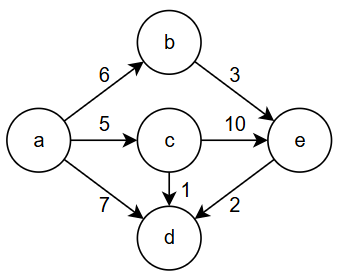

# 最短路

最短路指从 `u` 到 `v` 的边权和最小的路径，最短路问题一定不考虑负权环，但是会考虑负权值，正权环等特殊情况。不同的算法有不同的限制条件

在给出最短路算法前，先提出一个概念：松弛

## 松弛

考虑 `dis(s->v)` 为从某个起点 `s` 到 `v` 的距离，假设我们在求 `dis(s->v)` 的最小值过程中，发现存在另一个节点 `u`，有 `dis(s->u) + dis(u->v) < dis(s->v)`，我们找到了一条从 `s` 到 `v` 更近的路线，此时我们更新 `dis(s->v) = dis(s->u) + dis(u->v)`，而原来的约束 `dis(v)_old` 不再是最紧的约束，因此得到了“松弛”

（一种很物理的想法：思考一张起点为 `s`，终点 `v` 的弹性绳网，拉住 `s`，`v` 往两侧拉伸，最短路对应的绳会紧绷住，而其他的绳都是相对松弛的。现在我找到了一条更短的路径，在添加“路径对应的绳”后，原来紧绷的绳也会松弛，这就是一次“松弛化”操作）

---

接下来给出几种求最短的算法：

## Floyd 算法

一种求全源最短路径的算法（能够得到任意两点的最短路），采用的是动态规划的思想：

我们初始一个二元数组 `f[n][n]`：对于每对节点 `(x,y)`，记 `f[x][y]` 从 `x` 到 `y` 最短路径长度。

首先，没有图信息，我们初始化每个节点到自己的距离为 `0`，到其他节点的距离为 `INF`

```c++
const int INF = INT_MAX;
int f[n][n];
for(int x = 0; x < n; x++){
    for(int y = 0; y < n; y++){
        if(x == y) f[x][y] = 0;		// 自己到自己的路径长为 0
        else f[x][y] = INF;			// 否则不可达
    }
}
```

现在我们加入图的基础边信息，而 `f[x][y]` 更新为从 `x` 到 `y` **最多一步抵达**的最短路径长度：

```c++
for (int i = 0; i < m; i++) {
    int u, v, w;
    cin >> u >> v >> w;
    f[u][v] = min(f[u][v], w);	// 这里考虑到了重边，取最小边
    // 如果是无向图：f[v][u] = min(f[v][u], w);
}
```

此时我们只考虑了每个节点到达自己的情况，以及一步可达的情况，现在我们对每两个点进行“松弛”操作，不妨从节点 `0` 开始：

```c++
for (int x = 0; x < n; x++) {
    for (int y = 0; y < n; y++) {
        f[x][y] = min(f[x][y], f[x][0] + f[0][y]);
    }
}
```

上面的程序的意思是：对所有的 `(x,y)`，如果从 `x` 到 `y` 的路径可以通过节点 `0` 松弛化，那么我们就更新更短的路径。

进一步地，我们依次加入其他节点，从节点 `0` 到节点 `n-1` 依次松弛化，就有了：

```c++
for (int k = 0, k < n, k++){
    for (int x = 0; x < n; x++) {
        for (int y = 0; y < n; y++) {
            f[x][y] = min(f[x][y], f[x][k] + f[k][y]);
        }
    }
}
```

这就是 Floyd 算法的核心逻辑，可以在 $O(V^3)$ 的时间内得到全源最短路径，对应的空间复杂度 $O(V^2)$。但是注意到：Floyd 算法在遇到负环（环的权重和为负）时，其会不断在循环中降低权值，而不会主动发现负权环（相比之下，一些其他算法可以发现负权环的存在）

附 Luogu 模板题：[B3647 【模板】Floyd - 洛谷](https://www.luogu.com.cn/problem/B3647)

### Floyd 变种

如果一个全源问题可以被表达为 
$$
f[x][y] = f[x][y]\odot(f[x][k] \oplus f[k][y])
$$
并且具有最优子结构的性质，就可以用 Floyd 的方式解决

这里另外提一句：DAG 的最长路径问题不能用这种方式解决

#### 传递闭包

对于 a->b && b->c，我们容易根据传递性得到 a->c

对于图上任意两点 `u` `v`，我们需要知道是否存在一条 `u->v` 的路径，此时就可以参考 Floyd 算法的思想，得到下面的程序：

```c++
for(int x = 0; x < n; x++){
    for(int y = 0; y < n; y++){
        if(x == y) f[x][y] = 1;
        else f[x][y] = 0;
    }
}

for (int i = 0; i < m; i++) {
    int u, v;
    cin >> u >> v;
    f[u][v] = 1;
}

for (int k = 0, k < n, k++){
    for (int x = 0; x < n; x++) {
        for (int y = 0; y < n; y++)
            // f[x][k] & f[k][y] 表示存在 x->k->y 的路径
            f[x][y] |= f[x][k] & f[k][y];
```

边权统一为 0/1，取最小值修改为取或运算，就能得到传递闭包。这个算法又叫 Floyd-Warshall 算法。

可以用 bitset 进行优化，也可以对每个点做一次搜索（$O(n(n+m))$ ，更适合稀疏图）

附 Luogu 模板题：[B3611 【模板】传递闭包 - 洛谷](https://www.luogu.com.cn/problem/B3611)

#### 最小瓶颈路径/最宽路径

分别指的是最大边权最小化和最小边权最大化，只要修改状态方程即可：

```c++
f[x][y] = min(f[x][y], max(f[x][k], f[k][y]));
f[x][y] = max(f[x][y], min(f[x][k], f[k][y]));
```

注意这不是最优解，有借助最小生成树实现的更快做法

---

## Dijkstra 算法

一种求**非负权图**的单源最短路径的算法，我们先来看一个例子：



考虑以 $a$ 为起点的单源最短路径，不难发现从 $a$ 能到达的最近的节点是 $c$

|  b   |   c    |  d   |  e   |
| :--: | :----: | :--: | :--: |
|  6   | 5[MIN] |  7   | INF  |

不难意识到，**因为没有负权，我们只要继续沿着路线走下去，经过路径的权值和只会变得更大（或不变）**，而我们目前能够到达的最近节点就是点 $c$，因此 $a\to c$ 的最短路就为 $5$，我们完成了 $a\to c$ 最短路的计算

不妨从目前最近的 $c$ 出发，其能够到达的点为 $d$ 和 $e$，我们继续更新目前的路径：

|   b    |        c        |  d   |  e   |
| :----: | :-------------: | :--: | :--: |
| 6[MIN] | 5[Start Vertex] |  6   |  15  |

我们发现 $a\to b$ 和 $a\to d$ 的路径是最短的，我们任意取一个（$a\to b$），同理可得 $a\to b$ 的最短路就为 6（确定的结果）

继续上述的操作：选择当前的最近节点，延伸路线，取最近的尚未确定最短路的节点，得到其最短路，循环。

这里给出完整的流程表：

|        b        |        c        |        d        |      e      |
| :-------------: | :-------------: | :-------------: | :---------: |
|        6        |     5[MIN]      |        7        |     INF     |
|     6[MIN]      | 5[Start Vertex] |        6        |     15      |
| 6[Start Vertex] |        /        |     6[MIN]      |      9      |
|        /        |        /        | 7[Start Vertex] |   9[MIN]    |
|        /        |        /        |        /        | 9[FINISHED] |

我们发现，每次由最近节点进行延伸和松弛操作，都可以确认一个点的最短路径长度；经过 $n-1$ 次操作，我们就能得到单源最短路径（因此这个算法很稳定）

??? tips "一个还算显然的特征"

    Dijkstra 算法按照距离递增的顺序确定所有节点的最短路径，比如上面的例子中，依次确定的最短路大小为 5 < 6 <= 6 < 9
    
    可以这样理解：Dijkstra 每次只确定最紧的路线作为一条最短路（也就是已经实现松弛操作最大化的路径）

这就是 Dijkstra 算法的核心所在：

!!! abstract ""

    -> while (没有处理完所有的顶点)
    
    --> 选择当前距离起点最短且尚未处理的节点 $u$
    
    --> 从这个节点出发对每个邻居 $v_i$ 进行松弛操作
    
    --> 标记 $u$ 为已访问

??? question "证明？"

    考虑反证法：
    
    假设我们选择了当前距离最小的节点 $u$，但存S在另一条真正最短路径 $s → ... → v → u$，此时我们有 $dis[v] < dis[u]$
    
    但是我们在选择节点时，$dis[u]$ 已经是未处理节点中最小的，因此 $v$ 已经被处理过了，不应该再有 $dis[v] < dis[u]$
    
    换句话说：选择当前距离最小的节点 $u$，这一点和反设中 $dis[v] < dis[u]$ 本身是矛盾的
    
    因此 Dijkstra 的正确性得证

这里给出具体的代码实现，注意取最短路使用了二叉堆优化，时间复杂度 $O((V+E) \log V)$：

```c++
const INF = INT_MAX;

struct edge {
    int v; int w;
};

// 邻接表读入边信息
vector<vector<edge>> edges(n);
for(int i = 0; i < m; i++){
    int u,v,w; cin>>u>>v>>w;
    edges[u].push_back({v,w});
}

// 记起始点为 s
vector<int> dis(n, INF); dis[s] = 0;
vector<bool> vis(n, false);
// 优先队列，权值放在前面方便排序
priority_queue<pair<int, int>, vector<pair<int, int>>, greater<pair<int, int>>> pq;
pq.push({0,s});

// 松弛操作
while(!pq.empty()){
    int u = (pq.top()).second;
    pq.pop();
    if(vis[u]) continue;
    vis[u] = true;
    
    for(auto& edge: edges[u]){
        if(dis[u] + edge.w < dis[edge.v]){
            dis[edge.v] = dis[u] + edge.w;
            pq.push({dis[edge.v], edge.v});
        }
    }
}
```

附 Luogu 模板题：[P4779 【模板】单源最短路径（标准版） - 洛谷](https://www.luogu.com.cn/problem/P4779)

---

## Bellman–Ford 算法

和 Dijkstra 一样，都是求单源最短路径的算法。其优势在于允许负权边且能检测负环

朴素 Bellman–Ford 的核心依旧是松弛操作：具体地说，由于 $n$ 个顶点的图任意两点之间的最短路一定不超过 $n-1$ 条边，因此对所有的边进行 $n-1$ 轮松弛操作，一定能得到单源最短路径，时间复杂度 $O(VE)$

这种算法的好处在于松弛次数固定，如果在进行了 $n-1$ 轮松弛后还能继续松弛，则说明图中存在负环

!!! abstract ""

    -> 循环 n-1 次
    
    --> 对每条边进行松弛
    
    -> if (依旧存在可以松弛的点)
    
    --> 图中存在负环

因为我们是对每条边进行松弛，因此使用边列表而不是邻接表存图

```c++
const int INF = INT_MAX;

struct edge{
    int u; int v; int w;
}

// 边列表读入边信息
vector<edge> edges(m);
for(int i = 0; i < m; i++){
    int u,v,w; cin>>u>>v>>w;
    edges.push_back({u, v, w});
}

// 记起始点为 s
vector<int> dis(n, INF); dis[s] = 0;

// n-1 轮松弛操作
for(int i = 0; i < n-1; i++){
    for(auto& e : edges){
        int u = e.u, v = e.v, w = e.w;
        if(dis[u] != INF && dis[u] + w < dis[v]){
            dis[v] = dis[u] + w;
        }
    }
}

// 如果经过了 n-1 次松弛操作后，还能实现松弛
// 说明路径存在负环，这就实现了负环检测
for(auto& e : edges){
    int u = e.u, v = e.v, w = e.w;
    if(dis[u] != INF && dis[u] + w < dis[v]){
        cout << "-1";		// 存在负权环
    }
}
```

### Bellman-Ford 的一个拓展性质

第 $i$ 轮松弛可以得到从原点出发，最多经过 $i$ 条边到达其他顶点的最短路，前提是每轮松弛操作只使用上一轮的 `dis[u]`，而不能用在本轮更新过的 `dis[u]`

### SPFA 优化

朴素 Bellman–Ford 算法对所有边进行 $n-1$ 次松弛，我们发现，在通常情况下，大多数的边都不可能被松弛却尝试了松弛，这其中的很多次松弛操作是浪费的

我们发现：只有当某个顶点的最短距离被松弛更新时，从该顶点出发的边才可能会对其他顶点产生影响。因此我们可以使用一个队列，存储那些待处理的顶点，这就是 SPFA (Shortest Path Faster Algorithm) 的思想

!!! abstract ""

    -> 初始化队列，将起点入队并标记在队列中
    
    -> whlie (队列非空)
    
    --> 取出队首节点，并标记为不在队列中
    
    --> 对该节点的所有出边进行松弛
    
    --> 若松弛成功且目标节点不在队列中，则将其入队并标记
    
    --> if (某个节点入队次数 ≥ n)
    
    ---> 图中存在负环

因为我们需要获取从某个顶点出发的边，所以用邻接表而不是边列表

额外需要注意的是，因为我们不再对每条边进行 $n-1$ 次松弛操作，因此判负环的逻辑需要修改：建立数组 $cnt[n]$ 记录每个节点的入队次数，如果某个节点入队达到 $n$ 次，说明这个节点在某条最短路中是负环的一部分

```c++
const int INF = INT_MAX;

struct edge{
    int u; int v; int w;
}

// 邻接表读入边信息
vector<vector<edge>> edges(n);
for(int i = 0; i < m; i++){
    int u,v,w; cin>>u>>v>>w;
    edges[u].push_back({v,w});
}

// 记起始点为 s
vector<int> dis(n, INF); dis[s] = 0;
vector<int> cnt(n, 0);				// 记录节点入队次数
vector<bool> in_queue(n, false);	// 防止节点在出队前重复入队

queue<int> q;

// 起点初始化
q.push(s); in_queue[s] = true; cnt[s]++;

// 基于队列的松弛优化
while(!q.empty()){
    int u = q.front(); q.pop();
    in_queue[u] = false;

    // 遍历所有出边
    for(auto& e : edges[u]){
        int v = e.v;
        int w = e.w;

        // 松弛操作
        if(dis[u] != INF && dis[u] + w < dis[v]){
            dis[v] = dis[u] + w;

            // 如果目标节点不在队列中，则入队
            if(!in_queue[v]){
                q.push(v);
                in_queue[v] = true;
                cnt[v]++;

                // 检测负环
                if(cnt[v] >= n){
                    cout << "-1";		// 存在负权环
                }
            }
        }
    }
}
```

#### Why "SPFA is dead"?

对于 SPFA 算法，我们通过“只有当某个顶点的最短距离被松弛更新时，从该顶点出发的边才可能会对其他顶点产生影响”这一约束，来避免对每个边进行重复的松弛操作

数学上可以证明：SPFA 对随机图的优化确实非常强大，其理想时间复杂度可以简单写作 $O(kE)$，$k$ 是一个通常比较小的常数，其优于朴素的 Bellman-Ford 算法，甚至能吊打 Dijkstra 的 $O((V+E) \log V)$

> 查了一下发现 $O(kE)$ 的写法似乎是错的，不管了

但是问题在于：Dijkstra 的 $O((V+E) \log V)$ 对最坏情况也成立，算法稳定；而对于 SPFA，$O(kE)$ 的期望时间复杂度的常数 $k$ 是受具体图构造的影响的（也就是说不稳定）。SPFA 的优化本质上是为了减少每个点的松弛次数，在多数情况下，这种减少是显著的，期望时间复杂度的 $k$ 值都是一个比较小的常数

从理论上来说，减少松弛次数完全的不影响算法的时间**上界**，并且从具体的构造上说，我们确实可以人为构造一些<del>神秘</del>图，让 $k$ 值退化到 $V$ 的级别，使得最差时间复杂度为 $O(VE)$，和朴素实现相同

SPFA 在每次发现更短的路径时，都会将节点入队。如果我们可以让节点反复发现更短一点（但不多）的路径，就可以让这个节点反复入队，达到接近 $n-1$ 次的量级

具体的卡法也不少，链套菊花加上网格图能使 SPFA 以及其他的绝大多数变种全部卡出最坏时间复杂度

对策也不少，一般是对队列进行随机化，对出边随机顺序访问，但最终似乎总能被卡

因此**除非图包含负权边，务必使用 Dijkstra 而不是 SPFA**