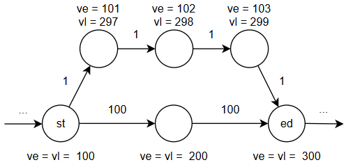

# 拓扑排序 && 关键路径

内容渐进分为两个部分：

## AOV 网络 && 拓扑排序

我们考虑一种有向无环图，顶点表示事件，有向边表示依赖关系。对于边 $(u,v)$，我们指出：事件 $v$ 必须在事件 $u$ 之后才能进行。

我们将若干事件和对应的依赖关系组合成一张有向无环图（DAG），称这种有向图为顶点活动网络，即 AOV 网络 (Activity On Vertex Network)。

现在我们需要解决两个问题：

1- 如何得到事件之间的依赖顺序

2- 如何判断 AOV 网络是否存在循环依赖（即存在环），此时这个有向图不能被称为 AOV 网络

由此我们引入拓扑排序。拓扑排序将 AOV 网络络中所有的顶点排序，保证对于任意的 $(u \to v)$，$u$ 一定在 $v$ 之前出现在序列中。拓扑序不唯一。

实现拓扑排序的一种常见算法为 Kahn 算法（本质上是个 BFS），其基于点的入度进行排序，思路非常简单，正确性不难证明；Kahn 对每条边和每个顶点进行一次处理，因此时间复杂度 $O(V + E)$

附 Luogu 模板题：[P1347 排序 - 洛谷](https://www.luogu.com.cn/problem/P1347)

!!! abstract ""

    -> while (存在入度为 0 的顶点)
    
    --> 任意选择一个入度为 0 的顶点 s
    
    --> 将该顶点加入拓扑序列，删除该顶点及其所有的出边
    
    -> if (存在未删除的顶点)
    
    --> 剩下的图中存在环，不是一个合法的 AOV 网络

给出代码实现：

```c++
// 邻接表读入边信息，入度数组方便找出入度为 0 的节点
vector<vector<int>> edges(n);
vector<int> indeg(n, 0);
for(int i = 0; i < m; i++){
    int u, v; cin >> u >> v;
    edges[u].push_back(v);
    indeg[v]++;
}

// 第一轮初始化
int cnt = 0;
queue<int> q;
for(int i = 0; i < n; i++){
    if(indeg[i] == 0) q.push(i);
}

while (!q.empty()){
    int u = q.front(); q.pop();
    
    /* 这里可以对 u 进行额外操作，比如输出或存入结果数组 */
    
    cnt++;
    for(int &v: edges[u]){
        if(--indeg[v] == 0) q.push(v);
    }
}

if(cnt != n) {
    cout << "-1";		// 说明有环
}
```

---

## AOE 网络 && 关键路径

现在我们进一步构建信息更丰富的有向无环图：

我们考虑一种带权 DAG，顶点表示事件，有向边表示活动，其有向性表示事件的先后顺序，权值表示活动的持续时间。为了保证整个网络的一致性，我们约定入度为 0 和出度为 0 的节点有且仅有一个，分别作为起点事件（源点）和终点事件（汇点）。称上述 DAG 为边活动网络，即 AOE 网络 (Activity On Edge Network)。

我们规定：**任何的活动都需要其前驱事件被触发后才能开始；任何的事件都需要在其所有的前驱活动全部完成后才能被触发**

??? quote "让 GPT-5 生成了一个具体生活情景下的 AOE 网络"

    ```mermaid
    graph LR
      e1((准备生日派对)) -->|A: 决定派对主题 / 1天| e2((主题已确定))
      e1 -->|B: 列宾客名单 / 1天| e3((名单已完成))
    
      e2 -->|C: 订蛋糕 / 2天| e4((蛋糕已订))
      e2 -->|D: 买装饰品 / 2天| e5((装饰品已到位))
    
      e5 -->|E: 布置场地 / 1天| e6((场地布置完成))
    
      e3 -->|F: 准备食物饮料 / 2天| e7((食物饮料就绪))
    
      e4 --> e8((准备就绪))
      e6 --> e8
      e7 --> e8
    ```

在顶点表示事件，有向边表示活动的基础上，为了描述 AOE 网络，我们引入下面的四个时间描述：

- 事件 $v_i$ 的最早发生时间 $ve(i)$，即：从触发起点事件开始，如果所有的活动在前驱事件被触发后立即开始，事件 $v_i$ 在 $ve(i)$ 后会被触发

计算 $ve(i)$ 的本质是递推：我们假设以 $v_i$ 为终点的边有 $\lbrace v_{j_1}, v_i, w_{j_1}\rbrace,\cdots,\lbrace v_{j_m}, v_i, w_{j_m}\rbrace$ ，那么有：

$$
ve(i) = \max_{p = 1,\cdots,m} \lbrace ve(j_p) + w_{j_p} \rbrace
$$

更直观地说，$ve(i)$ **就是从起点 $v_0$ 到 $v_i$ 的最长路径**

!!! abstract ""

    因为 $ve(i)$ 需要满足所有前驱活动的约束，所以最后一个完成的前驱活动决定了 $ve(i)$ 的值，向上倒推即可发现这就是最长路
    
    也正是因为晚发生的事件的 $ve$ 计算依赖早发生的事件的 $ve$，我们**必须按照拓扑序来完成上面的递推操作**，这也正是为什么要先介绍拓扑排序
    
    “求最长路” 一般只考虑 DAG 图，否则是 NP-Hard 问题

<br>

- 事件 $v_i$ 的最迟发生时间 $vl(i)$，即：在终点事件的触发不会被延迟的前提下，事件 $v_i$ 最晚要在 $vl(i)$ 时被触发

由对 $ve(i)$ 的分析可知，对于终点 $v_n$，$ve(n)$ 的值为从起点到终点的最长路径，也就是最紧约束。我们称这条路径为**关键路径**，关键路径上的所有事件 $v_k$ 一旦被前驱活动触发就必须立即进行后继活动，满足 $ve(k) = vl(k)$（否则就会延迟终点事件的触发）；

而对于非关键路径上的事件，不难意识到，我们可以在关键路径上找到两个事件点 $v_{st},\;v_{ed}$，从 $v_{st}$ 向非关键路径分支，通过 $v_{ed}$ 回到关键路径的总体。非关键路径上的活动可以进行一定的延迟进行，但是不能影响到 $v_{ed}$ 的触发，也就是说 $v_{ed}$ 的非关键路径上的前驱活动不能晚于关键路径上的前驱活动完成进行



（当然，计算 $vl(i)$ 并不需要关心事件/活动是否处于关键路径）

计算 $vl(i)$ 的本质依旧是递推，不过这一次是从后往前推（因为事件的最迟发生时间的约束体现在其后继事件的 $vl$，而不是前驱事件）：我们假设以 $v_i$ 为起点的边有 $\lbrace v_i, v_{j_1}, w_{j_1}\rbrace,\cdots,\lbrace v_i, v_{j_m}, w_{j_m}\rbrace$ ，那么有：
$$
vl(i) = \min_{p = 1,\cdots,m} \lbrace vl(j_p) - w_{j_p} \rbrace
$$

<br>

- 活动 $a_k$ 的最早开始时间 $e(k)$，或者记为 $e(u,v)$

容易得到 $e(k) = ve(u)$

<br>

- 活动 $a_k$ 的最迟开始时间 $l(k)$，或者记为 $l(u,v)$

容易得到 $l(k) = vl(v) - w_{a_k}$ 

!!! abstract "概括"

    最早发生时间按照拓扑序从前往后递推；最早发生时间按照拓扑序从后往前递推

在理解了以上的概念后，我们可以找出 AOE 网络的关键路径：

我们记关键路径上的活动为关键活动，找出关键路径就是找出关键活动。定义活动 $a_k$ 的时间余量 $d(k) = l(k) - e(k)$，时间余量为 $0$ 的活动就是关键活动。

因此求关键路径的步骤也就是求上述四个时间描述的内容：

1- 求 AOE 网络的拓扑序

2- 根据（逆）拓扑序计算每个事件的最早发生时间和最迟发生时间

3- 根据（逆）拓扑序计算每个活动的最早开始时间和最迟开始时间

4- 计算每个活动的时间余量，确定关键活动

关键路径不唯一，但是关键路径长度是确定的
