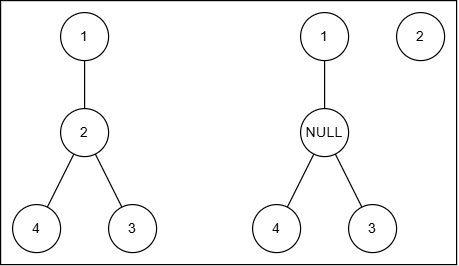

# 并查集

一个管理元素所属集合的数据结构，通常实现为一个森林，每一个集合实现为一棵树。并查集的应用不体现其树形结构的特性，更倾向于连通性，所以不分类到 Tree（或许应该分类到图论）

## 定义

并查集初始状态下，每个元素都位于一个单独的集合，表示为一棵只有根节点的树。我们需要维护一个 `parent` 数组记录每个元素所在树的祖先节点，不需要维护子节点信息

并查集有两种操作：

1- “并”，将两个元素所在的树合并为一棵树，表示处于同一集合

2- “查”，返回某一元素的 `parent` 值，可以通过判断两个元素的 `parent` 值是否相等来判断两个元素是否处于同一集合

## 实现

### 初始化

因为我们只需要维护每个节点的 `parent` 信息，所以一个一维数组就可以存储整个并查集

```c
int n;
int *dsu = new int[n];
for(int i = 0; i < n; i++) dsu[i] = i;	// parent 初始化为自己，表示根节点
```

### 查操作

查找一个节点所在树的根节点，因为每个节点都知道自己的某个祖先，所以利用 parent 链进行递归传递，最终能够获得根节点

```c
int find(int x){
    // x 的祖先节点如果是自己，那就是根节点
    // 否则 x 对应的根节点是其祖先节点的根节点
	return (dsu[x] == x ? x : find(dsu[x]) );
}
```

#### 路径压缩

不难发现在向上寻找根节点的过程中，路径上每个节点对应的根节点都是最终找到的那一个

并查集只依赖树形结构的连通性，因此我们将路径上所有的节点的根节点都一并更新，作扁平化处理

```c
int find(int x){
    // 这里 dsu[x] = find(dsu[x]) 同时设置了 dsu[x] 对应的根节点
    // 这里借助一个特性：赋值表达式的返回值是 '=' 右侧的值
    // 因此 x 对应的根节点也被设置，实现了路径压缩
	return (dsu[x] == x ? x : (dsu[x] = find(dsu[x])) );
}
```

在路径压缩的优化下，并查集的查操作从最坏 $O(n)$ 优化到了 $O(\alpha(n))$ 的（几乎是）常数时间复杂度（$\alpha(n)$ 是反 Ackerman 函数，看不懂）

### 并操作

先找到两个节点的根节点，然后将 `src` 节点的根节点连接到 `dst` 节点的根节点，（尤其是搭配路径压缩）可以减少树的深度，降低均摊复杂度

```c
void unite(int src, int dst) {
    dsu[find(src)] = find(dst);
}
```

#### 启发式合并

实际上，因为我们只考虑树形结构的连通性，正确性上并不需要区分哪个节点作为根节点 `dst`，但是为了降低并操作后树的深度，我们可以选择节点较少或深度较小的树作为 `src` 

下面的两种方法中，按大小合并更常用一些

#####按大小合并 (Union by Size)

我们需要额外记录一个 `size` 信息：每棵树的节点个数 / 集合的大小

初始化时额外记录一个 `sz` 数组，记录集合大小：

```C
int n;
int *dsu = new int[n];
int *sz = new int[n];
for(int i = 0; i < n; i++) {
    dsu[i] = i;
    sz[i] = 1;
}
```

合并时需要比较大小进行合并

```c
void unite(int x, int y){
    // 找到根节点
    x = find(x);
    y = find(y);
    // 如果两节点在同一集合，直接返回，否则会加倍 size 值
    if (x == y) return;
    
    if(sz[x] < sz[y]){
        dsu[x] = y;
        sz[y] += sz[x]; 
    } else{
        dsu[y] = x;
        sz[x] += sz[y]; 
    }
}
```

#####按秩合并 (Union by Rank)

我们需要额外记录一个 `rank` 信息：每棵树的高度**上界**（不是高度本身）

初始化时额外记录一个 `rank` 数组：

```C
int n;
int *dsu = new int[n];
int *rank = new int[n];
for(int i = 0; i < n; i++) {
    dsu[i] = i;
    rank[i] = 1;
}
```

合并时需要比较秩进行合并，因为 `rank` 指的是每棵树的高度上界，只有两棵树的秩相等时，并操作之后才会增加树的秩

```c
void unite(int x, int y){
    // 找到根节点
    x = find(x);
    y = find(y);
    // 如果两节点在同一集合，直接返回
    if (x == y) return;
    
    if(rank[x] < rank[y]){
        dsu[x] = y;
    } else if(rank[x] > rank[y]){
        dsu[y] = x;
    } else{
		dsu[x] = y;
        // 秩相等时，合并会使树的高度上界 + 1
        rank[y]++;
    }
}
```

??? question "同时使用路径压缩和按秩合并的启发式搜索，前者是否对后者有影响？"

    虽然路径压缩会减小树的高度，但是秩记录的是树的高度的上界而不是树高度本身。路径压缩不会增大树的高度，也就不会改变秩
    
    我们只是通过树的相对大小启发式合并，因此不会有影响

## Extras

### 单点删除

如果直接将一个点删除并重建整个树，时间复杂度上升到 $O(n)$，因此考虑懒删除法：

节点在树上不会被删除，这个节点变成了虚节点，其不再具有实际结点的意义，但是维系了整个集合的连通性



如何实现呢？我们首先需要为虚节点单独开辟额外的空间，然后建立一个映射表，指示每个节点实际上处于的位置

（比如总共有 1000 个节点，节点 2 被删除以后映射到 1001，原来的节点 2 只用来维系原来的树的连通性）

```c
int n;
int cnt = 1;		// 这个是删除节点时，f 映射的下标偏移
int *dsu = new int[2*n];
int *f = new int[2*n];
for(int i = 0; i < n; i++) {
    dsu[i] = i;
    f[i] = i;		// 一开始的映射和普通的并查集一样
}
```

然后添加删除操作：

```c
void delete(int x, int& cnt){
    // 初始化新映射节点的祖先为自己
    dsu[n + cnt] = n + cnt;
    // 建立映射，原节点成为虚节点
    f[x] = n + cnt;
    cnt++;
}
```

查操作需要相应的修改，先将节点进行一次映射

```c
int find(int x){
    x = f[x];	// 根据映射函数找到实际的位置
    // 非虚节点递归向上找根节点的过程中，遇到了虚节点也能正常寻找祖先
	return (dsu[x] == x ? x : (dsu[x] = find(dsu[x])) );
}
// tip: 即使最终找到的根节点是虚节点，也不会破坏集合的连通性
// 所以不需要特判
```

对于普通的并操作也是多一次映射，这在 find 操作中已经包含

```c
void unite(int src, int dst) {
    // 因为 find 操作中已经取了一次映射，所以这里不需要取映射了
    dsu[find(src)] = find(dst);
}
```

对于启发式合并，只需要多一步 `x = f[x]` 的操作即可

??? question "这种懒删除法在删除操作较多时会增大空间开销，是否会降低查找速率"

    坏消息是：这种方法在删除操作频繁时确实会提高空间复杂度，dsu 数组的大小可能需要动态调整，这取决于删除操作的次数
    
    好消息是：因为路径压缩的优化，单次查找的时间复杂度依旧是 $O(\alpha(n))$

正确性没有验证