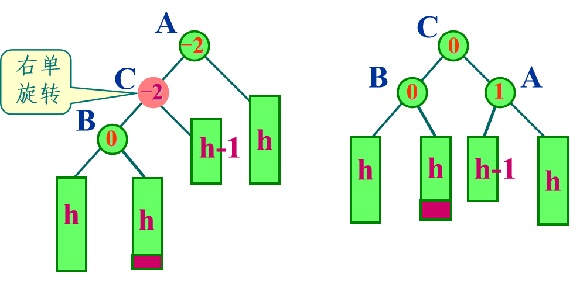
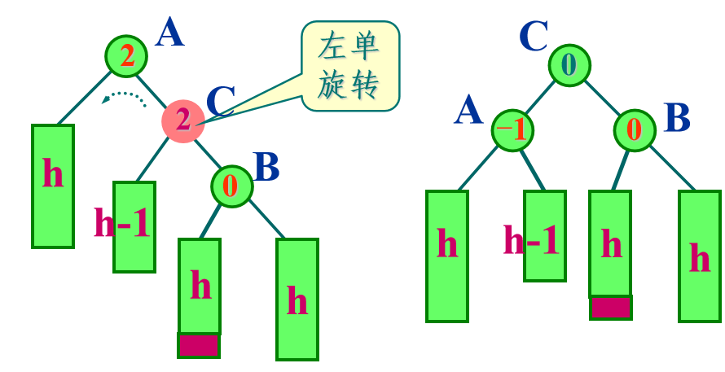

# AVL 树

AVL 树是最常见的一种二叉平衡搜索树，其在二叉搜索树的基础上额外递归定义为：

- 空二叉树是 AVL 树
- 以 root 为根的树是 AVL 树，则 root 的左子树高度和右子树高度差不超过 $1$，因此子树也是 AVL 树

AVL 树对平衡的要求非常严格，其保证树高一定为 $O(\log n)$（否则树不平衡），有一点偏差就会通过旋转操作调整

我们对每个节点附加一个平衡因子，值为右子树高度减去左子树高度；对于 AVL 树，其值只能为 $-1,0,1$，否则就需要进行旋转调整

```c++
struct treeNode{
    int val;
    int size;
    int count;
    int bf;
    treeNode *leftChild, *rightChild;
    treeNode ()
        { val = 0; bf = 0; size = 1; count = 1; leftChild = nullptr; rightChild = nullptr; }
    treeNode (int x, treeNode *l = nullptr, treeNode *r = nullptr)
        { val = x; bf = 0; size = 1; count = 1; leftChild = l; rightChild = r; }
};
```

## 失衡与自平衡

AVL 一旦遇到不平衡就会进行调整，失衡的情况总共可以概括为四种，分为两类。我们假定 $A$ 为自底向上回溯的路径中第一个失衡的节点，路径向下分别为节点 $B$ $C$：

- 这三个节点在一条直线上

对 $A,B$ 进行单次的左旋 && 右旋操作即可，如何操作在之前已经说明，平衡因子的更新也比较简单

> 1- RR 情况


```c++
treeNode* rotateRR(treeNode* A) {
    treeNode* B = A->rightChild;
    A->rightChild = B->leftChild;
    B->leftChild = A;

    // 平衡因子更新
    if (B->bf == 0) {		// 这个情形会在删除操作中出现
        A->bf = 1;
        B->bf = -1;
    } else {				// 对于插入操作和大多数删除场景都是 B->bf == 1
        A->bf = 0;
        B->bf = 0;
    }
    // size 更新
    updateSize(A);
    updateSize(B);
    return B;
}
```

> 2- LL 情况


```c++
treeNode* rotateLL(treeNode* A) {
    treeNode* B = A->leftChild;
    A->leftChild = B->rightChild;
    B->rightChild = A;

    // 平衡因子更新
    if (B->bf == 0) {        // 这个情形会在之后提到的删除操作中出现
        A->bf = -1;
        B->bf = 1;
    } else {                 // 对于插入操作和大多数删除场景都是 B->bf == -1
        A->bf = 0;
        B->bf = 0;
    }

    // size 更新
    updateSize(A);
    updateSize(B);
    return B;
}
```

- 这三个节点不在一条直线上（折线）

也分两种情况：

> 3- LR 情况

此时需要操作三个节点 $A,B,C$，需要先对下层两个顶点进行一次左旋操作回到上一类状态，然后对上层两个顶点进行右旋操作

注意平衡因子的更新情况取决于 $C$ 的旧 bf 值，而不能像上一种情况一样直接设为 0




```c++
treeNode* rotateLR(treeNode* A) {
    treeNode* B = A->leftChild;
    treeNode* C = B->rightChild;

    // 左旋 B-C
    B->rightChild = C->leftChild;
    C->leftChild = B;

    // 右旋 A-C
    A->leftChild = C->rightChild;
    C->rightChild = A;

    // 根据新节点的插入情况更新平衡因子
    if (C->bf == 0) {
        // C 是插入的新节点
        A->bf = 0;
        B->bf = 0;
    } else if (C->bf == 1) {
        // 新节点插入在 C 的右子树
        A->bf = 0;
        B->bf = -1;
    } else {
        // 新节点插入在 C 的左子树
        A->bf = 1;
        B->bf = 0;
    }
    C->bf = 0;
    
    // 根节点 C 最后更新 size
    updateSize(A);
    updateSize(B);
    updateSize(C);
    
    return C;  // C 成为新的根
}
```

> 4- RL 情况

需要先对下层两个顶点进行一次右旋操作回到上一类状态，然后对上层两个顶点进行左旋操作

注意平衡因子的更新情况取决于 $C$ 的旧 bf 值




```c++
treeNode* rotateRL(treeNode* A) {
    treeNode* B = A->rightChild;
    treeNode* C = B->leftChild;

    B->leftChild = C->rightChild;
    C->rightChild = B;

    A->rightChild = C->leftChild;
    C->leftChild = A;

    if (C->bf == 0) {
        A->bf = 0;
        B->bf = 0;
    } else if (C->bf == 1) {
        A->bf = -1;
        B->bf = 0;
    } else {
        A->bf = 0;
        B->bf = 1;
    }
    C->bf = 0;
    
    // 根节点 C 最后更新 size
    updateSize(A);
    updateSize(B);
    updateSize(C);
    return C;
}
```

## 插入操作

插入操作的前半部分和二叉搜索树的插入差别不大，关键在于插入后更新沿路的平衡因子，利用栈记录沿途路径；在插入新节点后回溯路径，并进行可能需要的旋转操作来修正不平衡

递归实现比显式栈实现更简单，具体体现在递归栈的自然回溯上，否则需要显式维护一个栈用于存储插入操作时的向下搜索的路径，并且需要手动回溯

为了判断“子树高度是否增加”，我们需要一个全局性的 `taller` 变量，具体的逻辑参考代码注释

```c++
treeNode* insertAVL(treeNode* root, int key, bool& taller) {
    // 1. 抵达空节点位置，执行插入操作
    // 为上一层递归（父节点）设置 taller = true，父节点子树一定出现了高度增加
    if (root == nullptr) {
        taller = true;
        return new treeNode(key);	// 初始化 size = count = 1
    }

    // 2. key < rootval
    if (key < root->val) {
        // 递归插入到左子树，继续向下搜索插入位置
        root->leftChild = insertAVL(root->leftChild, key, taller);
        // 递归栈回到这里时，如果左子树的高度确实增加了
        if (taller) {
            // 如果原本是右子树比左子树高 1
            if (root->bf == 1) {
                // bf 平衡，没有影响树高度 (root_h + h+1)
                //     bf=1           bf=0
                //    /    \   -->   /    \
                //   h     h+1     h+1    h+1
                root->bf = 0;
                taller = false;
            }
            // 如果原本是左子树和右子树等高
            else if (root->bf == 0) {
                // bf 左偏，导致树变高 (root_h + h -> root_h + h + 1)
                //     bf=0           bf=-1
                //    /    \   -->   /     \
                //   h      h      h+1      h
                root->bf = -1;
                taller = true;
            }
            // 如果原本是左子树比右子树高 1，更新后 bf = -2，失衡
            // L_ 型
            else {								// 结合下一个节点判断旋转类型
                if (root->leftChild->bf <= 0)	// LL 型
                    root = rotateLL(root);
                else							// LR 型
                    root = rotateLR(root);
				// 旋转后重置 taller 状态
                taller = false;
            }
        }
    }

	// 3. key > rootval
    else if (key > root->val) {
        // 递归插入到右子树，继续向下搜索插入位置
        root->rightChild = insertAVL(root->rightChild, key, taller);
		// 递归栈回到这里时，如果右子树的高度确实增加了
        if (taller) {
            // 如果原本是左子树比右子树高 1
            if (root->bf == -1) {
                // bf 平衡，没有影响树高度 (root_h + h+1)
                root->bf = 0;
                taller = false;
            }
            // 如果原本是左子树和右子树等高
            else if (root->bf == 0) {
                // bf 右偏，导致树变高 (root_h + h -> root_h + h + 1)
                root->bf = 1;
                taller = true;
            }
            // 如果原本是右子树比左子树高 1，更新后 bf = 2，失衡
            // R_ 型
            else {								// 结合下一个节点判断旋转类型
                if (root->rightChild->bf >= 0)	// RR 型
                    root = rotateRR(root);
                else							// RL 型
                    root = rotateRL(root);

                taller = false;
            }
        }
    }
    
    // 重复节点处理
    else {
        root->count++;       // 只增加 count
        taller = false;      // 重复节点不会导致高度增加
    }
    
    // 更新根节点 size
	updateSize(root);
    return root;
}

treeNode* insertAVL(treeNode* root, int key){
    bool taller = false;
    return insertAVL(root, key, taller);
}
```

## 删除操作

结合朴素 BST 的删除操作，以及 AVL 的插入操作中更新 bf 和调整树高的操作，可以得到下面的函数

为了判断“子树高度是否减小”，我们需要一个全局性的 `shorter` 变量，具体的逻辑参考代码注释

```c++
treeNode* deleteAVL(treeNode* root, int key, bool& shorter) {
    // 1. 没有找到 key 节点，不删除节点，返回
    if (root == nullptr) {
        shorter = false;
        return nullptr;
    }

    // 2. key < rootval
    if (key < root->val) {
        // 递归搜索到左子树，继续向下搜索删除位置
        root->leftChild = deleteAVL(root->leftChild, key, shorter);
        // 递归栈回到这里时，如果左子树的高度确实减小了
        if (shorter) {
            // 如果原本是左子树比右子树高 1
            if (root->bf == -1) {
                // bf 平衡，导致树变矮 (root_h + h+1 -> root_h + h)
                //	 bf=-1           bf=0
                //	/	  \   -->   /	 \
                // h+1	   h       h      h
                root->bf = 0;
                shorter = true;
            }
            // 如果原本是左子树和右子树等高
            else if (root->bf == 0) {
                // bf 右偏，没有影响树高度 (root_h + h)
                //	 bf=0           bf=1
                //	/	 \   -->   /	\
                // h      h      h-1     h
                root->bf = 1;
                shorter = false;
            } 
            // 如果原本是右子树比左子树高 1，更新后 bf = 2，失衡
            // R_ 型
            else {
                // 结合下一个节点判断旋转类型
                treeNode* r = root->rightChild;
                if (r->bf >= 0) {				// RR 型
                    root = rotateRR(root);
                    shorter = (r->bf == 0);
                } else {						// RL 型
                    root = rotateRL(root);
                    shorter = true;				// 树一定是变矮的
                }
            }
        }
    }

    // 3. key > rootval
    else if (key > root->val) {
        // 递归搜索到右子树，继续向下搜索删除位置
        root->rightChild = deleteAVL(root->rightChild, key, shorter);
        // 递归栈回到这里时，如果右子树的高度确实减小了
        if (shorter) {
            // 如果原本是右子树比左子树高 1
            if (root->bf == 1) {
                // bf 平衡，导致树变矮 (root_h + h+1 -> root_h + h)
                root->bf = 0;
                shorter = true;
            }
            // 如果原本是左子树和右子树等高
            else if (root->bf == 0) {
                // bf 左偏，没有影响树高度 (root_h + h)
                root->bf = -1;
                shorter = false;
            } 
            // 如果原本是左子树比右子树高 1，更新后 bf = -2，失衡
            // L_ 型
            else {
                // 结合下一个节点判断旋转类型
                treeNode* l = root->leftChild;
                if (l->bf <= 0) {				// LL 型
                    root = rotateLL(root);
                    shorter = (l->bf == 0);
                } else {						// LR 型
                    root = rotateLR(root);
                    shorter = true;				// 树一定是变矮的
                }
            }
        }
    }

    // 4. 找到了待删除节点，重复出现
    else if(root->count > 1){
        root->count--;
        shorter = false;
    }
    // 5. 找到了待删除结点，需要实际删除
    else{
        // 如果待删除节点只有最多一个子结点
        // 非优化版本参考朴素 BST 树的删除操作
        if (root->leftChild == nullptr) {
            treeNode* r = root->rightChild;
            delete root;
            root = r;
            shorter = true;
        }
        else if (root->rightChild == nullptr) {
            treeNode* l = root->leftChild;
            delete root;
            root = l;
            shorter = true;
        }

        // 有两个子节点
        else {
            // 以找右子树的最小节点（中序后继）为例
            treeNode* minParent = root;
            treeNode* minNode = root->rightChild;

            // 找到最小节点
            while (minNode->leftChild != nullptr) {
                minParent = minNode;
                minNode = minNode->leftChild;
            }

            // 用最小节点的值替换当前节点的值，同时更新 count 值
            // 设置 minNode->count = 1 是因为它将要被删掉了
            root->val = minNode->val;
            root->count = minNode->count;
            minNode->count = 1;
			// 递归删除后继节点
            root->rightChild = deleteAVL(root->rightChild, minNode->val, shorter);

            if (shorter) {	
                if (root->bf == 1) {
                    root->bf = 0;
                    shorter = true;
                }
                else if (root->bf == 0) {
                    root->bf = -1;
                    shorter = false;
                }
                else {
                    treeNode* l = root->leftChild;

                    if (l->bf <= 0) {			// LL
                        root = rotateLL(root);
                        shorter = (l->bf == 0);
                    } else {					// LR
                        root = rotateLR(root);
                        shorter = true;
                    }
                }
            }
        }
    }

    updateSize(root);
    return root;
}
```

## 模板实现

附 Luogu 模板题：[P3369 【模板】普通平衡树 - 洛谷](https://www.luogu.com.cn/problem/P3369) 和 [P6136 【模板】普通平衡树（数据加强版） - 洛谷](https://www.luogu.com.cn/problem/P6136)

??? quote "一个可以通过 P3369 评测的参考实现，删去了之前的所有注释"

    改一下输入也能过 P6136（
    
    ```c++
    #include <bits/stdc++.h>
    
    using namespace std;
    using ll = long long;
    
    struct treeNode{
        int val;
        int size;
        int count;
        int bf;
        treeNode *leftChild, *rightChild;
        treeNode ()
            { val = 0; bf = 0; size = 1; count = 1; leftChild = nullptr; rightChild = nullptr; }
        treeNode (int x, treeNode *l = nullptr, treeNode *r = nullptr)
            { val = x; bf = 0; size = 1; count = 1; leftChild = l; rightChild = r; }
    };
    
    treeNode* getPre(treeNode* root, int key) {
        treeNode* pre = nullptr;
        while (root) {
            if (key > root->val) {
                pre = root;
                root = root->rightChild;
            } else {
                root = root->leftChild;
            }
        }
        return pre;
    }
    
    treeNode* getSuc(treeNode* root, int key) {
        treeNode* suc = nullptr;
        while (root) {
            if (key < root->val) {
                suc = root;
                root = root->leftChild;
            } else {
                root = root->rightChild;
            }
        }
        return suc;
    }
    
    int getRankFromKey(treeNode* root, int key) {
        if (root == nullptr) return 1;
        if (root->val > key) return getRankFromKey(root->leftChild, key);
        if (root->val < key) return getRankFromKey(root->rightChild, key) + (root->leftChild ? root->leftChild->size : 0) + root->count;
        return (root->leftChild ? root->leftChild->size : 0) + 1;	
    }
    
    int getKeyFromRank(treeNode* root, int rank) {
        if (root == nullptr) return -1;
        int leftSize = root->leftChild ? root->leftChild->size : 0;
        if (rank <= leftSize) {
            return getKeyFromRank(root->leftChild, rank);
        }
        else if (rank <= leftSize + root->count) {
            return root->val;
        } 
        else {
            return getKeyFromRank(root->rightChild, rank - (leftSize + root->count) );
        }
    }
    
    inline void updateSize(treeNode* root){
        if (root) root->size = (root->leftChild ? root->leftChild->size : 0) +
                (root->rightChild ? root->rightChild->size : 0) +
                (root->count);
    }
    
    treeNode* rotateRR(treeNode* A) {
        treeNode* B = A->rightChild;
        A->rightChild = B->leftChild;
        B->leftChild = A;
    
        if (B->bf == 0) {
            A->bf = 1;
            B->bf = -1;
        } else {
            A->bf = 0;
            B->bf = 0;
        }
        updateSize(A);
        updateSize(B);
        return B;
    }
    
    treeNode* rotateLL(treeNode* A) {
        treeNode* B = A->leftChild;
        A->leftChild = B->rightChild;
        B->rightChild = A;
    
        if (B->bf == 0) {
            A->bf = -1;
            B->bf = 1;
        } else {
            A->bf = 0;
            B->bf = 0;
        }
    
        updateSize(A);
        updateSize(B);
        return B;
    }
    treeNode* rotateLR(treeNode* A) {
        treeNode* B = A->leftChild;
        treeNode* C = B->rightChild;
    
        B->rightChild = C->leftChild;
        C->leftChild = B;
    
        A->leftChild = C->rightChild;
        C->rightChild = A;
    
        if (C->bf == 0) {
            A->bf = 0;
            B->bf = 0;
        } else if (C->bf == 1) {
            A->bf = 0;
            B->bf = -1;
        } else {
            A->bf = 1;
            B->bf = 0;
        }
        C->bf = 0;
    
        updateSize(A);
        updateSize(B);
        updateSize(C);
    
        return C;
    }
    
    treeNode* rotateRL(treeNode* A) {
        treeNode* B = A->rightChild;
        treeNode* C = B->leftChild;
    
        B->leftChild = C->rightChild;
        C->rightChild = B;
    
        A->rightChild = C->leftChild;
        C->leftChild = A;
    
        if (C->bf == 0) {
            A->bf = 0;
            B->bf = 0;
        } else if (C->bf == 1) {
            A->bf = -1;
            B->bf = 0;
        } else {
            A->bf = 0;
            B->bf = 1;
        }
        C->bf = 0;
    
        updateSize(A);
        updateSize(B);
        updateSize(C);
        return C;
    }
    
    treeNode* insertAVL(treeNode* root, int key, bool& taller) {
        if (root == nullptr) {
            taller = true;
            return new treeNode(key);
        }
    
        if (key < root->val) {
            root->leftChild = insertAVL(root->leftChild, key, taller);
            if (taller) {
                if (root->bf == 1) {
                    root->bf = 0;
                    taller = false;
                }
                else if (root->bf == 0) {
                    root->bf = -1;
                    taller = true;
                }
                else {
                    if (root->leftChild->bf <= 0)
                        root = rotateLL(root);
                    else
                        root = rotateLR(root);
                    taller = false;
                }
            }
        }
    
        else if (key > root->val) {
            root->rightChild = insertAVL(root->rightChild, key, taller);
            if (taller) {
                if (root->bf == -1) {
                    root->bf = 0;
                    taller = false;
                }
                else if (root->bf == 0) {
                    root->bf = 1;
                    taller = true;
                }
                else {
                    if (root->rightChild->bf >= 0)
                        root = rotateRR(root);
                    else
                        root = rotateRL(root);
    
                    taller = false;
                }
            }
        }
    
        else {
            root->count++;
            taller = false;
        }
    
        updateSize(root);
        return root;
    }
    
    treeNode* insertAVL(treeNode* root, int key){
        bool taller = false;
        return insertAVL(root, key, taller);
    }
    
    treeNode* deleteAVL(treeNode* root, int key, bool& shorter) {
        if (root == nullptr) {
            shorter = false;
            return nullptr;
        }
    
        if (key < root->val) {
            root->leftChild = deleteAVL(root->leftChild, key, shorter);
            if (shorter) {
                if (root->bf == -1) {
                    root->bf = 0;
                    shorter = true;
                }
                else if (root->bf == 0) {
                    root->bf = 1;
                    shorter = false;
                } 
                else {
                    treeNode* r = root->rightChild;
                    if (r->bf >= 0) {
                        root = rotateRR(root);
                        shorter = (r->bf == 0);
                    } else {
                        root = rotateRL(root);
                        shorter = true;
                    }
                }
            }
        }
    
        else if (key > root->val) {
            root->rightChild = deleteAVL(root->rightChild, key, shorter);
            if (shorter) {
                if (root->bf == 1) {
                    root->bf = 0;
                    shorter = true;
                }
                else if (root->bf == 0) {
                    root->bf = -1;
                    shorter = false;
                }
                else {
                    treeNode* l = root->leftChild;
                    if (l->bf <= 0) {
                        root = rotateLL(root);
                        shorter = (l->bf == 0);
                    } else {
                        root = rotateLR(root);
                        shorter = true;
                    }
                }
            }
        }
    
        else if(root->count > 1){
            root->count--;
            shorter = false;
        }
        else{
            if (root->leftChild == nullptr) {
                treeNode* r = root->rightChild;
                delete root;
                root = r;
                shorter = true;
            }
            else if (root->rightChild == nullptr) {
                treeNode* l = root->leftChild;
                delete root;
                root = l;
                shorter = true;
            }
    
            else {
                treeNode* minParent = root;
                treeNode* minNode = root->rightChild;
    
                while (minNode->leftChild != nullptr) {
                    minParent = minNode;
                    minNode = minNode->leftChild;
                }
    
                root->val = minNode->val;
                root->count = minNode->count;
                minNode->count = 1;
    
                root->rightChild = deleteAVL(root->rightChild, minNode->val, shorter);
    
                if (shorter) {	
                    if (root->bf == 1) {
                        root->bf = 0;
                        shorter = true;
                    }
                    else if (root->bf == 0) {
                        root->bf = -1;
                        shorter = false;
                    }
                    else {
                        treeNode* l = root->leftChild;
    
                        if (l->bf <= 0) {
                            root = rotateLL(root);
                            shorter = (l->bf == 0);
                        } else {
                            root = rotateLR(root);
                            shorter = true;
                        }
                    }
                }
            }
        }
    
        updateSize(root);
        return root;
    }
    
    treeNode* deleteAVL(treeNode* root, int key) {
        bool shorter = false;
        return deleteAVL(root, key, shorter);
    }
    
    treeNode* root = nullptr;
    
    void solve(){
    	int n; cin >> n;
    	while(n--){
            int opt, x; cin >> opt >> x;
            switch (opt){
                case 1:
                    root = insertAVL(root, x);
                    break;
                case 2:
                    root = deleteAVL(root, x);
                    break;
                case 3:
                    cout << getRankFromKey(root, x) << "\n";
                    break;
                case 4:
                    cout << getKeyFromRank(root, x) << "\n";
                    break;
                case 5:
                {
                    treeNode* pre = getPre(root, x);
                    if (pre != nullptr)
                        cout << pre->val << "\n";
                    break;
                }
                case 6:
                {
                    treeNode* suc = getSuc(root, x);
                    if (suc != nullptr)
                        cout << suc->val << "\n";
                    break;
                }
            }
        }
    }
    
    signed main(){
        ios::sync_with_stdio(false);
        cin.tie(0); cout.tie(0);
    
        int t; 
        // cin >> t;
        t = 1;
    
        while (t--){
            solve();
        }
        return 0;
    }
    
    ```

