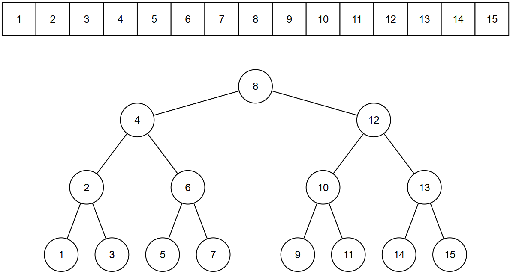
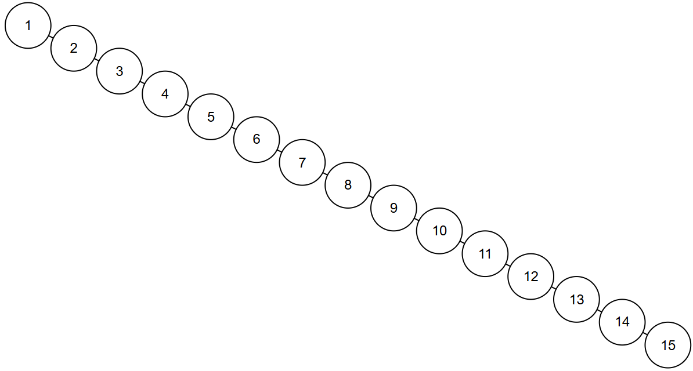
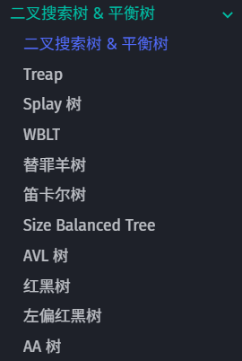
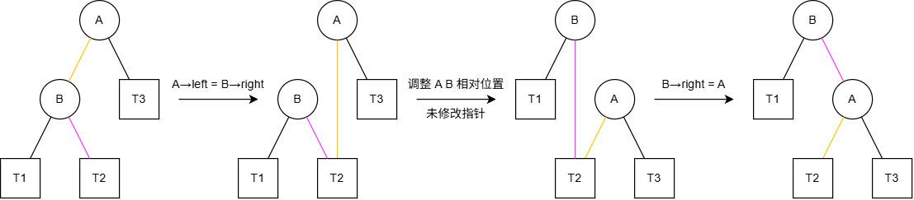

# 平衡树

依旧以这张图为例：



如果用二分建树的方法，建立的二叉搜索树是平衡树，插入操作是稳定的 $O(\log n)$；但是如果我们采用之前的插入操作，从 $1$ 到 $15$ 依次插入，我们会得到这样的结果：



树退化成了一条链，插入操作完全退化为了 $O(n)$

因此我们需要让二叉树实现自平衡，以确保时间复杂度基于树的高度的算法不会因为树的退化而达到最坏时间复杂度

??? abstract "[OI Wiki](https://oi-wiki.org/ds/bst/) 上介绍了很多种自平衡的实现方案"

    

在理解不同自平衡方案之前，我们需要了解两种最基本的树上操作：

### 左旋 && 右旋

图中 $T1 \sim T3$ 都是子树，$A,B$ 是进行左/右旋操作的关键节点（以右旋操作为例，$A$ 是失衡待调整的节点，$B$ 是调整后新的根节点）

这里以右旋为例给出具体的操作，关键的两个指针修改用不同颜色的线表示：



```c++
treeNode* rotateRight(treeNode* A) {
    treeNode* B = A->leftChild;		// B 为新的根节点
    A->leftChild = B->rightChild;	// 对应图中的 T2 从 B 的左子树迁移到 A 的右子树
    B->rightChild = A;				// 对应图中的 A B 身份交换
    update(A); update(B);			// 更新 A B 两节点的平衡因子等信息
    return B;						// 返回新的根节点 B
}
```

不难发现右旋和左旋的操作是完全反向的（右旋的示意图从右往左看就是左旋过程）

```c++
treeNode* rotateLeft(treeNode* A) {
    treeNode* B = A->rightChild;
    A->rightChild = B->leftChild;
    B->leftChild = A;
    update(A); update(B);
    return B;
}
```

多数自平衡树的调整方案就基于上述的旋转操作