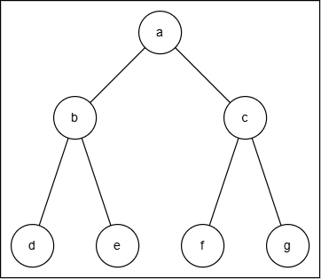
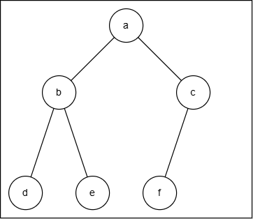
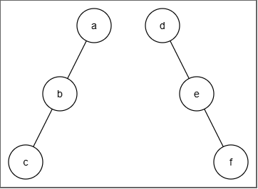
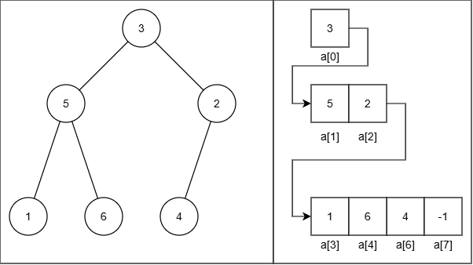
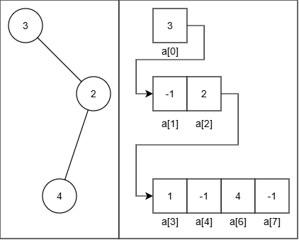

# 二叉树基础

## 定义

二叉树是一类有序树，要求每个节点的子节点个数不超过 2，因此其结构形态共有五种：空树、无子树的根、只有左子树、只有右子树、有左右子树

递归定义：二叉树 = (一个空树) or (一个根节点 + 两个不相交的二叉树)

!!! note "为什么要提到递归定义？"

    因为很多二叉树操作可以自然地用递归实现，这基于二叉树（及其相关子概念）的递归定义

## 结构特殊的二叉树

这里只会介绍最常见普遍的结构特殊的树，有关搜索树、平衡树等内容会单列板块

### 满二叉树

如果一个高度为 $k$ 的树有 $2^k-1$ 个节点，那么它是一个满二叉树

换句话说，满二叉树的任意层 $i$ 的节点个数都达到了最大值 $2^{i-1}$，所有的叶子节点都在最底层，除此以外的所有非叶子节点度数都为 2



### 完全二叉树

相比满二叉树，允许最后一层的节点数不达到最大值，但是最后一层的所有节点必须从左向右排列

如果采用顺序存储存完全二叉树，需要在存储最后一个节点之前没有空节点的填充



### 斜树

分为左斜树与右斜树，斜树的所有节点都只有单一方向的子节点（所有节点都只有单一方向的子树）

斜树可以简化为线型数据结构，比如链表



## 性质

- 二叉树的节点数比边数多 1，每条边都是割边

- 二叉树的第 $i$ 层最多有 $2^{i-1}$ 个节点（1-index）
- 深度为 $k$ 的二叉树最少有 $k$ 个节点（斜树），最多有 $2^k-1$ 个节点（满二叉树）
- 二叉树的叶节点个数比度为 2 的节点个数始终多 1
- 节点数为 $n$ 的完全二叉树的深度为 $\lceil \log_2(n+1) \rceil$（深度 $k$ 满足 $2^{n-1}-1 \leq k \leq 2^{n}-1$）

## 存储

二叉树有两种存储方法：更易实现的**顺序存储**；更加直观常用的**链式存储**

### 顺序存储

使用一个数组记录二叉树的节点，按照层次遍历（从上往下、从左往右）的顺序将节点值存入数组，通过数组下标计算体现节点之间的父子关系

先以完全平衡树为例：



（如果想同时存储节点标签和节点值，就用 `pair` 或 `struct`）

（**节点标签通常不存储，只在建二叉树时使用**，当然很多题目的节点编号可以作为节点值）

不难发现，一个节点的下标为 `i`，那么其父节点的下标为 `(i-1)//2`，左右子节点的下标分别为 `2i + 1` `2i + 2` （如果存在）

这种数据结构尤其适用于完全二叉树，因为其充分利用了数组空间；如果不是完全二叉树，在顺序存储时，我们要对空节点采用 `-1` 标签占位（树的结尾也用 `-1` 终止）

于是我们发现了顺序存储的两个不足之处：

1- OJ 输入数据时通常使用层次遍历，但是层次遍历在上一层遇到空节点后，遍历到这一层对应的数据时直接跳过，而不是用 `-1` 占位

比如下面的图采用层次遍历输入时，序列为 `3 -1 2 4 -1`，而不是 `3 -1 2 1 -1 4 -1`，需要手动处理这样的输入（其实也有应对的方法：在遍历输入时，先检查其父节点是否为 `-1`，如果是则向数组插入两个 `-1`，再插入接下来的数据）



2- 内存浪费严重。我们发现，如果存储的树不是完全二叉树，就会插入大量的 `-1` 空节点，使得深度为 $k$ 的二叉树一定会完整占用 $2^k-1$ 大小的内存，非常容易 MLE

因此我们不会用顺序存储方式像上面的方法完整的存储一个二叉树，而是只记录一些在具体情境中需要的部分：

#### 存储父节点

因为任意节点的父节点唯一，所以用一维数组即可储存，只适用于自底向上的遍历

```c++
// 下标表示节点的标签，存储的值为父节点标签
vector<int> parent(n);
```

在涉及树的自底向上递推 / DP 等操作，以及并查集构造中，这一存储方式简单实用

#### 存储子节点

因为任意节点的子节点不唯一，所以用二维数组储存，只适用于自顶向下的遍历

```c++
// 下标表示节点的标签，存储的子向量为所有子节点标签
vector<vector<int>> adj(n);
```

通常来说，将二维数组 `adj` 和一维数组 `parent` 结合使用，就可以较好地存储一张有向树

考虑到二叉树的子节点数量不超过 2，可以直接分配 `adj[n][2]` 减少动态分配内存开销

### 链式存储

构造一个链表节点

```c
struct BinTreeNode{
	int val;
    // int index;		// 如果需要使用节点序号的话
    // 如果需要自顶向下的遍历
	BinTreeNode* left;
	BinTreeNode* right;
    // 如果需要自底向上的遍历
    BinTreeNode* parent;	// 考虑指针维护难度，必要时再使用
};
```

这个节点存储了一个节点的完整信息，其维护方式可参考维护链表（如果加上 `parent` 指针就是双向链表）

## 类封装 && 函数实现

### 二叉树节点类

使用链式存储构造二叉树，我们先进行二叉树节点的类定义：

```c++
template <class T> 
struct BinTreeNode {
    T data;
    BinTreeNode<T> *leftChild, *rightChild;
    // 不含初始化的构造函数
    BinTreeNode ()
        { leftChild = NULL;  rightChild = NULL; }
    // 含初始化的构造函数
    BinTreeNode (T x, BinTreeNode<T> *l = NULL, BinTreeNode<T> *r = NULL)
        { data = x;  leftChild = l;  rightChild = r; }
};
```

接下来是各种函数的实现

### 二叉树类

在实现了二叉树节点类之后，我们实现一个管理二叉树的二叉树类：

考虑到二叉树的很多函数是递归实现，为了隐藏一些递归细节，简化调用逻辑，（包括数据结构课给的类模板）采用 Public 域定义接口，Protected 域内部实现的方式设计二叉树类

!!! question "什么是“隐藏递归细节”？"

    举个例子：获取树高度的函数在 Public 的定义是 `#!c int Height() { return Height(root); }`，如果不隐藏递归细节的话，你在每次获取树的高度时，都必须写 `Height(root)`；单独在 Public 定义接口之后写 `Height()` 即可
    
    简单来说：递归函数需要引入额外的中间参数，这对于接口层没有必要
    
    （除非你真的需要求子树的高度）

!!! question "如何设计不同的函数的实现方式？"

    对于非常简单的函数，直接在 Public 域中实现即可，比如判断二叉树是否为空
    
    对于涉及递归操作的简单函数，我们在 Public 域内定义接口，在 Protected 域递归实现
    
    对于复杂的函数，我们在 Public 域内定义接口，类外实现（把大段复杂代码写在 `binatree.h` 而不是 `binatree.c` 是坏的）

我们先给出 Public 域的接口：

```c++
template <class T> 
class BinaryTree {
public:
    // 构造函数
    BinaryTree() : root(NULL) { }
    
    // 析构函数
    ~BinaryTree() { Destroy(root); }
    
    // 判断二叉树是否为空（直接实现）
    bool IsEmpty() { return root == NULL; }
    
    // 获取树高 / 树大小（Protected 实现）
    int Height() { return Height(root); }
    int Size() { return Size(root); }
    
    // 获取父节点 / 左右子节点
    // 获取父节点在 Protected 实现，获取左右子节点直接实现
    // 使用三指针节点（包含 *parentNode）可以简化 Parent 函数逻辑
    // 但是会复杂化插入与删除函数逻辑
    BinTreeNode<T>* Parent(BinTreeNode<T> *t) { 
        return (root == NULL || root == t) ? NULL : Parent(root, t); 
    }
    
    BinTreeNode<T>* LeftChild(BinTreeNode<T> *t) { 
        return (t != NULL) ? t->leftChild : NULL; 
    }
    
    BinTreeNode<T>* RightChild(BinTreeNode<T> *t) { 
        return (t != NULL) ? t->rightChild : NULL; 
    }
    
    // 获取根节点（直接实现）
    BinTreeNode<T>* GetRoot() const { return root; }
    
    // 前/中/后/层序遍历
    // 前/中/后序遍历在 Protected 实现，层序遍历在类外实现
    // 需要传入一个函数作为参数，比如下面的打印函数 printNode
    // 作为遍历时输出数据的方式
    void PreOrder(void (*visit)(BinTreeNode<T> *t)) { 
        PreOrder(root, visit); 
    }
    
    void InOrder(void (*visit)(BinTreeNode<T> *t)) { 
        InOrder(root, visit); 
    }
    
    void PostOrder(void (*visit)(BinTreeNode<T> *t)) { 
        PostOrder(root, visit); 
    }
    
    void LevelOrder(void (*visit)(BinTreeNode<T> *t));
    
    // 最常用的输出函数，搭配遍历函数使用（直接实现）
    void printNode(BinTreeNode<int>* node) {
    	if (node != NULL) {
    	    cout << node->data << " ";
    	}
	}
    
    // 查找函数，在类外实现
    BinTreeNode<T>* Find(T item) const {
    	return Find(root, item);
	}
    
    // 常规的插入节点函数
    // 对于普通二叉树，基于层序遍历插入该节点
    // 在类外实现
    void Insert (T item);
    
    // 各种不同的建二叉树函数，基于不同的遍历方式
    // 这里的前序遍历 && 后序遍历都包含了空节点信息（null 表示空节点标识）
    // 层序遍历建树在类外实现，其他的在 Protected 实现
    void CreateBinTreeFromLevel(const vector<T>& data, T Null);
    
    void CreateBinTreeFromPre(const vector<T>& data, T Null){
        int index = 0;
    	root = CreateBinTreeFromPre(data, Null, index);
    }
    
    // 只通过中序遍历加空节点标记无法确认唯一二叉树
    // void CreateBinTreeFromIn(const vector<T>& data, T Null)
    
    void CreateBinTreeFromPost(const vector<T>& data, T Null) {
    	int index = data.size() - 1;
    	root = CreateBinTreeFromPost(data, Null, index);
	}
    
    // 删除指定节点的函数
    // 在类外实现
    bool Delete(T item) {
    	if (root == NULL) return false;
    	return Delete(root, item);
	}
    
    // 摧毁一个节点及其子树（Protected 实现）
    void Destroy(BinTreeNode<T>* subTree);
    
protected:
    // ...
private:
    // 根节点
    BinTreeNode<T>* root;
};
```

然后给出 Protected 中简单递归函数的实现：

```c++
template <class T> 
class BinaryTree {
public:
	// ...
protected:
    // 理解这里的函数大多需要先了解一些概念的递归定义
    
    // 递归求树高度
    // 回顾递归定义：空树的高度为 0，否则树的高度为 max(左,右子树高度值) + 1
    // 这是后序遍历的体现
    int Height(BinTreeNode<T> *subTree) {
        if (subTree == NULL) return 0;
        int leftHeight = Height(subTree->leftChild);
        int rightHeight = Height(subTree->rightChild);
        return (leftHeight > rightHeight) ? leftHeight + 1 : rightHeight + 1;
    }
    
    // 递归求树大小（总结点数）
    // 回顾递归定义：空树的大小为 0，否则树的大小为 左,右子树大小 + 1
    // 这是后序遍历的体现
    int Size(BinTreeNode<T> *subTree) {
        if (subTree == NULL) return 0;
        return 1 + Size(subTree->leftChild) + Size(subTree->rightChild);
    }
    
    // 自顶向下搜索父节点的方式
    // 没有定义 parent 指针的写法
    BinTreeNode<T>* Parent(BinTreeNode<T>* subTree, BinTreeNode<T>* t) {
        if (subTree == NULL) return NULL;
        if (subTree->leftChild == t || subTree->rightChild == t) {
            return subTree;
        }
        BinTreeNode<T>* p;
        if ((p = Parent(subTree->leftChild, t)) != NULL) return p;
        return Parent(subTree->rightChild, t);
    }
    
    // 三种遍历方式的递归实现
    // 根据 visit 的位置就能看出来对应了什么遍历
    // 出乎意料的简洁
    void PreOrder(BinTreeNode<T>* subTree, void (*visit)(BinTreeNode<T>* t)) {
        if (subTree != NULL) {
            visit(subTree);
            PreOrder(subTree->leftChild, visit);
            PreOrder(subTree->rightChild, visit);
        }
    }
    
    void InOrder(BinTreeNode<T>* subTree, void (*visit)(BinTreeNode<T>* t)) {
        if (subTree != NULL) {
            InOrder(subTree->leftChild, visit);
            visit(subTree);
            InOrder(subTree->rightChild, visit);
        }
    }
    
    void PostOrder(BinTreeNode<T>* subTree, void (*visit)(BinTreeNode<T>* t)) {
        if (subTree != NULL) {
            PostOrder(subTree->leftChild, visit);
            PostOrder(subTree->rightChild, visit);
            visit(subTree);
        }
    }
    
    // 带空节点标记的前序遍历 / 后序遍历建二叉树
    BinTreeNode<T>* CreateBinTreeFromPre(const vector<T>& data, T Null, int& index) {
	if (index >= data.size())
        return NULL;
        
    if (data[index] == Null) {
        index++;
        return NULL;
    }

    BinTreeNode<T>* root = new BinTreeNode<T>(data[index]);
    index++;

    root->leftChild = CreateBinTreeFromPre(data, Null, index);
    root->rightChild = CreateBinTreeFromPre(data, Null, index);
    
    return root;
}
    
    BinTreeNode<T>* CreateBinTreeFromPost(const vector<T>& data, T Null, int& index) {
	if (index < 0)
        return NULL;
    if (data[index] == Null) {
        index--;
        return NULL;
    }

    // 构建顺序：根节点 ← 右子树 ← 左子树
    
    BinTreeNode<T>* root = new BinTreeNode<T>(data[index]);
    index--;

    // （反向）先构建右子树，再构建左子树
    root->rightChild = CreateBinTreeFromPost(data, Null, index);
    root->leftChild = CreateBinTreeFromPost(data, Null, index);
    
    return root;
}
    
    // 摧毁一个节点及其子树
	void Destroy(BinTreeNode<T>* subTree) {
    	if (subTree == NULL) return;
    	Destroy(subTree->leftChild);
    	Destroy(subTree->rightChild);
    	delete subTree;
	}

};
```

??? abstract "非递归版的前/中/后序遍历实现"

    ```c++
    /* 前序遍历 */
    // 根节点 --> 左子树 --> 右子树
    // 从根节点开始一路沿左子树向下遍历
    // 期间直接 visit 沿路节点（确保根节点最先被 visit），栈存储沿路节点的右子节点
    // 每次抵达尽头时，取出栈顶，转移到右子节点重复左子树遍历的过程
    void PreOrder(BinTreeNode<T>* root, void (*visit)(BinTreeNode<T>* t)) {
        if (root == NULL) return;
    
        stack<BinTreeNode<T>*> s;	// 存的是待处理的右子树节点
        BinTreeNode<T>* p = root;	// p 是遍历指针，初始化为 root
    
        while (p != NULL || !s.empty()) {
            // DFS 遍历左子树
            // PreOrder(subTree->leftChild, visit);
            while (p != NULL) {
                // 从根节点开始深入访问
                visit(p);
                // 右节点入栈
                // 因为栈先进后出的特性，最后进栈（递归最深）的右节点会最先出栈处理
                if (p->rightChild)
                    s.push(p->rightChild);
                // 向左子树深入
                p = p->leftChild;
            }
            // 左节点遍历结束后，取栈顶元素（最近的右节点）
            // PreOrder(subTree->rightChild, visit);
            if (!s.empty()) {
                p = s.top();
                s.pop();
            }
        }
    }
    
    /* 中序遍历 */
    // 左子树 --> 根节点 --> 右子树
    // 从根节点开始一路沿左子树向下遍历
    // 期间存储所有的沿路节点（子树的根节点）
    // 每次抵达尽头时，弹出栈顶的根节点 visit，然后转向该结点的右子树重复左子树遍历
    void InOrder(BinTreeNode<T>* root, void (*visit)(BinTreeNode<T>* t)) {
        if (root == NULL) return;
    
        stack<BinTreeNode<T>*> s;  // 存的是沿途的根节点路径
        BinTreeNode<T>* p = root;  // 遍历指针
    
        while (p != NULL || !s.empty()) {
            // DFS 遍历到最左节点，沿途压入所有节点
            // InOrder(subTree->leftChild, visit);
            while (p != NULL) {
                s.push(p);          // 为了在访问左子树后访问根节点，将 p 入栈
                p = p->leftChild;   // 继续向左深入
            }
            
            // 到达最左端，开始回溯访问
            if (!s.empty()) {
                p = s.top();        // 取出栈顶节点
                s.pop();
                visit(p);           // 中序遍历：在左子树之后访问根节点
                
                // 转向右子树继续中序遍历
                // InOrder(subTree->rightChild, visit);
                p = p->rightChild;
            }
        }
    }
    
    /* 后序遍历 */
    // 左子树 --> 右子树 --> 根节点
    // 从根节点开始一路沿左子树向下遍历
    // 期间存储所有的沿路节点（子树的根节点）
    // 每次抵达尽头时，查看栈顶节点，根据 lastVisited 判断这个节点的右子树情况
    // 如果右子树还未被访问，先转移到栈顶节点的右子树重复过程
    // 如果右子树上一次被 visited 了或者没有右子树，visit 该节点并弹出
    void PostOrder(BinTreeNode<T>* root, void (*visit)(BinTreeNode<T>* t)) {
        if (root == NULL) return;
    
        stack<BinTreeNode<T>*> s;  // 暂存待处理的节点
        BinTreeNode<T>* p = root;  // 当前遍历指针
        BinTreeNode<T>* lastVisited = NULL; 	// 需要记录上次访问的节点
        										// 为了判断某一个右子树是否已被遍历
    
        while (p != NULL || !s.empty()) {
            // 深度优先遍历到最左节点，沿途压入所有节点
            // PostOrder(subTree->leftChild, visit);
            while (p != NULL) {
                s.push(p);          // 当前节点入栈
                p = p->leftChild;   // 继续向左深入
            }
            
            // 查看栈顶节点（不立即弹出，因为接下来要转向右子树）
            if (!s.empty()) {
                p = s.top();
                
                // 如果右子树存在且未被访问，先处理右子树
                // PostOrder(subTree->rightChild, visit);
                if (p->rightChild != NULL && p->rightChild != lastVisited) {
                    p = p->rightChild;  // 转向右子树
                } else {
                    // 右子树已处理或不存在，可以访问当前节点
                    visit(p);           // 后序遍历：在左右子树之后访问根节点
                    s.pop();
                    lastVisited = p;    // 记录上次访问的节点
                    p = NULL;           // 重置p，强制从栈中取下一个节点
                }
            }
        }
    }
    ```

??? abstract "更加直观地，直接对输入流进行前序遍历建树"

    （后序遍历建树需要反向读取输入，所以不能这么写）
    
    ```c++
    template<class T>
    void CreateBinTreeFromPre(istream& in, BinTreeNode<T>*& subTree, T Null)     {
        T item;
        if (!(in >> item)) return;
    
        if (item == Null) {
            subTree = nullptr;
            return;
        }
    
        subTree = new BinTreeNode<T>(item);
        CreateBinTree(in, subTree->leftChild, Null);
        CreateBinTree(in, subTree->rightChild, Null);
    }
    ```

最后是实现复杂的函数，我们在类外单独实现：

--> 层序遍历函数 `LevelOrder`

基本原理是广度优先搜索，利用队列的先进先出特性实现：

根节点入队 --> while(队列非空) {出队一个节点 --> visit 该节点 --> 左右子节点先后入队}

```c++
template <class T>
void BinaryTree<T>::LevelOrder(void (*visit)(BinTreeNode<T>* t)) {
    // 如果树为空，直接返回
    if (root == NULL) return;
    
    // 使用队列进行层次遍历
    queue<BinTreeNode<T>*> q;
    q.push(root);  // 根节点入队
    
    while (!q.empty()) {
        // 取出队首节点
        BinTreeNode<T>* current = q.front();
        q.pop();
        
        // 访问当前节点
        visit(current);
        
        // 将左孩子入队（如果存在）
        if (current->leftChild != NULL) {
            q.push(current->leftChild);
        }
        
        // 将右孩子入队（如果存在）
        if (current->rightChild != NULL) {
            q.push(current->rightChild);
        }
    }
}
```

--> 查找函数 `Find`

查找指定元素，返回其节点

基于 DFS 的递归实现

```c++
template <class T>
BinTreeNode<T>* BinaryTree<T>::Find(BinTreeNode<T>* subTree, T item) const {
    // 空子树 --> 终止搜索
    if (subTree == NULL) return NULL;
    // 匹配 --> 返回节点
    if (subTree->data == item) return subTree;
    // 先递归检查左子树
    BinTreeNode<T>* leftResult = Find(subTree->leftChild, item);
    if (leftResult != NULL) return leftResult;
    // 如果左子树没找到，再递归到右子树
    return Find(subTree->rightChild, item);
}
```

--> 插入函数 `Insert`

这里是根据层序遍历判断插入位置的插入函数，原理是栈实现 BFS

注释参考 `CreateBinTreeFromLevel` 函数

```c++
template <class T>
void BinaryTree<T>::Insert(T item) {
    if (root == NULL) {
        root = new BinTreeNode<T>(item);
        return;
    }
    queue<BinTreeNode<T>*> q;
    q.push(root);
    while (!q.empty()) {
        BinTreeNode<T>* current = q.front();
        q.pop();
        if (current->leftChild == NULL) {
            current->leftChild = new BinTreeNode<T>(item);
            return;
        } else {
            q.push(current->leftChild);
        }
        if (current->rightChild == NULL) {
            current->rightChild = new BinTreeNode<T>(item);
            return;
        } else {
            q.push(current->rightChild);
        }
    }
}
```

--> 层序遍历建树函数 `CreateBinTreeFromLevel`

为基于层序遍历得到的二叉树节点数据进行一次性建树的函数，`T null` 是空节点标记

是 `Insert` 函数的修改版

核心的层序遍历流程还是一样的：

根节点入队 --> while(队列非空) {出队一个节点 --> 处理该节点 --> 左右子节点先后入队}

```c++
template <class T>
void BinaryTree<T>::CreateBinTreeFromLevel(const vector<T>& data, T null) {
    // 非预期输入
    if (data.empty() || data[0] == null) {
        return;
    }
    
    // 创建根节点
    root = new BinTreeNode<T>(data[0]);
    queue<BinTreeNode<T>*> q;				// 广度优先栈
    q.push(root);
    
    // 处理子节点
    int index = 1;
    int n = data.size();
    
    while (!q.empty() && index < n) {
        // 取数
        BinTreeNode<T>* current = q.front();
        q.pop();
        
        // 处理左子节点
        if (index < n && data[index] != null) {
            current->leftChild = new BinTreeNode<T>(data[index]);
            q.push(current->leftChild);
        }
        
        index++;
        
        // 处理右子节点
        if (index < n && data[index] != null) {
            current->rightChild = new BinTreeNode<T>(data[index]);
            q.push(current->rightChild);
        }
        
        index++;
    }
}
```

??? quote "一个比较简洁的，不使用 STL 容器，直接在函数内获取输入而不是传入数组，同时返回有效节点个数的版本"

    （写 OJ 时使用的版本）
    
    ```c++
    int tree::create(int n, int Null) {
        int rootval; cin >> rootval;
        root = new treeNode(rootval);
    
        treeNode** queue = new treeNode*[n+1];
        int front = 0, rear = 0;
    
        queue[rear++] = root;
    
        int index = 1, data, nodeCounter = 1;
    
        while(front < rear && index < n) {
            treeNode* cur = queue[front++];
    
            if(index < n) {
                cin >> data;
                if(data != Null) {
                    cur->leftChild = new treeNode(data);
                    queue[rear++] = cur->leftChild;
                    nodeCounter++;
                }
                index++;
            }
    
            if(index < n) {
                cin >> data;
                if(data != Null) {
                    cur->rightChild = new treeNode(data);
                    queue[rear++] = cur->rightChild;
                    nodeCounter++;
                }
                index++;
            }
        }
        delete[] queue;
        return nodeCounter;
    }
    ```

--> 删除函数 `Delete`

递归写法，比较显然

```c++
template <class T>
bool BinaryTree<T>::Delete(BinTreeNode<T>*& subTree, T item) {
    if (subTree == NULL) return false;
    if (subTree->data == item) {
        // 找到节点，删除
        Destory(subTree);
        subTree = NULL;
        return true;
    }
    // 这里用到了 || 截断特性
    if (Delete(subTree->leftChild, item) || Delete(subTree->rightChild, item)) {
        return true;
    }
    return false;
}
```

## 例题

直接把《数据结构》课上的课后作业搬过来了，三道题都是 LeetCode 原题

> **原题来自 LeetCode 2477. 到达首都的最少油耗**（输入、输出不同）
>
> 给定一个根节点为 $1$ 的 $n$ 节点二叉树，表示 $n$ 个城市的地图路线，每个节点 $i$ 有 $a_i$ 个人。现在所有人要乘坐大巴车（每个城市都有足够多辆）前往城市 $1$（根节点），大巴车的座位数为 $k$，相邻城市过路费为 $1$ / 辆。求所有人抵达城市 $1$ 的最小花费
>
> 输入：第一行一个数字，表示二叉树层序表示的数组长度。 第二行为树的 层序表示 数组，其中非空节点为不重复的正整数，空节点使用 `-1` 表示。

核心就是利用后序遍历的 “先访问子节点，再访问根节点” 的 DFS 特性，自底向上进行贪心

```c++
// 定义树节点
struct treeNode{
    int val;
    treeNode *leftChild, *rightChild;
    treeNode ()
        { val = 0; leftChild = NULL;  rightChild = NULL; }
    treeNode (int x, treeNode *l = NULL, treeNode *r = NULL)
        { val = x;  leftChild = l;  rightChild = r; }

};

// 最小化函数声明
class tree{
public:
    void create(int n, int Null);
    // 其实把所有的题目用到的函数直接放在 Class 外实现更方便一些
    void postSum(int& cost, vi& b, treeNode* node, int& k);
    treeNode* root;
};

// 根据层序遍历建树
void tree::create(int n, int Null){
    int rootval; cin >> rootval;
    root = new treeNode(rootval);

    queue<treeNode*> q;
    // treeNode** q = new treeNode*[n+1];
    q.push(root);

    int index = 1, data;

    while(!q.empty() && index < n){
        treeNode* cur = q.front();
        q.pop();
		if(index < n){
			cin >> data;
        	if(index < n && data != Null){
        	    cur->leftChild = new treeNode(data);
        	    q.push(cur->leftChild);
        	}
        	index++;
		}
        if(index < n){
			cin >> data;
        	if(index < n && data != Null){
        	    cur->rightChild = new treeNode(data);
        	    q.push(cur->rightChild);
        	}
        	index++;
		}
    }
    // delete[] q;
}

// 后序遍历函数，在遍历的同时贪心向上累加
void tree::postSum(int& cost, vi& b, treeNode* node, int& k){
    if (node == NULL) return;

    postSum(cost, b, node->leftChild, k);
    postSum(cost, b, node->rightChild, k);
    
    // visit(node);

    if(node->leftChild){
        int val = b[node->leftChild->val];
        cost += ((val + k - 1) / k);
        b[node->val] += val;

    }

    if(node->rightChild){
        int val = b[node->rightChild->val];
        cost += ((val + k - 1) / k);
        b[node->val] += val;
    }
}

// 主函数
void solve(){
	int n, k; cin >> n >> k;

    tree T;
    T.create(2*n+1,-1);

    vi b(n+1); for(int i = 1; i <=n; i++) cin >> b[i];

    int cost = 0;

    T.postSum(cost, b, T.root, k);

    cout << cost;
}
```

> **原题来自 LeetCode 987. 二叉树的垂序遍历**（输入、输出不同）
>
> 给定一棵二叉树，请你设计算法计算二叉树的 **垂序遍历** 序列。
>
> 对位于 `(row, col)` 的每个结点而言，其左右子结点分别位于 `(row + 1, col - 1)` 和 `(row + 1, col + 1)` 。树的根结点位于 `(0, 0)` 。
>
> 二叉树的 **垂序遍历** 从最左边的列开始直到最右边的列结束，按列索引每一列上的所有结点，形成一个按出现位置从上到下排序的有序列表。如果同行同列上有多个结点，则按结点的值从小到大进行排序。
>
> 返回二叉树的 **垂序遍历** 序列。
>
> 输入：第一行一个数字，表示二叉树层序表示的数组长度。 第二行为树的 层序表示 数组，其中非空节点为不重复的正整数，空节点使用 `-1` 表示。
>
> 输出：二叉树的垂序遍历序列，采用 “同一列表中的数字用' '隔开，两个有序列表间用' | '隔开” 的方案。

对树进行 DFS，记录节点的坐标值与编号，在进行 “列升序 --> 行升序 --> 值升序” 的排序后从左到右取出编号

```c++
// 节点信息结构体
struct nodeInfo{
    int row, col, val;
};

// DFS
void dfs(treeNode *node, int row, int col, nodeInfo* nodes, int& index){
    if(node == NULL) return;
    nodes[index++] = {row, col, node->val};
    dfs(node->leftChild, row + 1, col - 1, nodes, index);
    dfs(node->rightChild, row + 1, col + 1, nodes, index);
}

// 排序函数
bool cmp(nodeInfo node_a, nodeInfo node_b){
    if (node_a.col != node_b.col) return node_a.col < node_b.col;
    if (node_a.row != node_b.row) return node_a.row < node_b.row;
    return node_a.val < node_b.val;
}

// 输出方式
// nodeCounter 是在 create 函数中增加了有效节点个数的统计，得到的返回值
for(int i = 0; i < nodeCounter; i++){
    cout << nodes[i].val << " ";
    if(i != nodeCounter-1 && nodes[i].col != nodes[i+1].col){
        cout << "| ";
    }
}
```

> **原题来自 LeetCode 366. 寻找二叉树的叶子节点**（输入、输出不同）
>
> 给定一棵二叉树，请按照以下方式收集树的节点：
>
> - 从左往右收集所有的叶子节点。
> - 移除所有的叶子节点。
> - 重复以上步骤，直到树为空。
>
> 给出摘除叶子的正确顺序。
>
> 输入：第一行一个数字，表示二叉树层序表示的数组长度。 第二行为树的 层序表示 数组，其中非空节点为不重复的正整数，空节点使用 `-1` 表示。
>
> 输出：二叉树的叶片摘除顺序（数字间用空格分开）

两种思路：

1- 建树时记录每个节点的 parent，准备一个队列，然后进行一轮后序遍历，（恰好是从左到右）取出叶节点并输出，期间如果遇到了非叶节点在摘除叶节点后变成了叶结点的情况，就将这些节点插入队列，在一轮叶节点摘除以后取出队列中的节点继续摘除，期间入队新的叶节点，直到根节点被摘除

时间复杂度 $O(n)$，空间复杂度 $O(n)$


2- 依旧是后序遍历，准备一个二维的 `height` 数组，后序遍历时计算每个节点的 “最大高度” `h`（到所有可到达的叶节点的简单路径中的最长路径长度），并将该节点存入 `height[h][]` 中，最后按照 `height` 从小到大的顺序依次输出数组元素

??? tip "递归计算高度：当前节点高度 = max (左子节点高度, 右子节点高度) + 1"

    ```c++
    int tree::postOrder(treeNode* node, nodeInfo* a){
        if (node == NULL) return -1;
    
        int leftHeight = postOrder(node->leftChild, a);
        int rightHeight = postOrder(node->rightChild, a);
    
        int curHeight = 0;
        if(leftHeight == -1 && rightHeight == -1) curHeight = 0;
        else if(leftHeight == -1) curHeight = rightHeight + 1;
        else if(rightHeight == -1) curHeight = leftHeight + 1;
        else curHeight = max(leftHeight, rightHeight) + 1;
    
        height[curheight].push_back(node->val);
    
        return curHeight;
    }
    ```

时间复杂度 $O(n)$，纯数组实现 `height` 需要 $O(n^2)$ 的空间复杂度，链表数组实现空间复杂度 $O(n)$，常数不如解法 1

