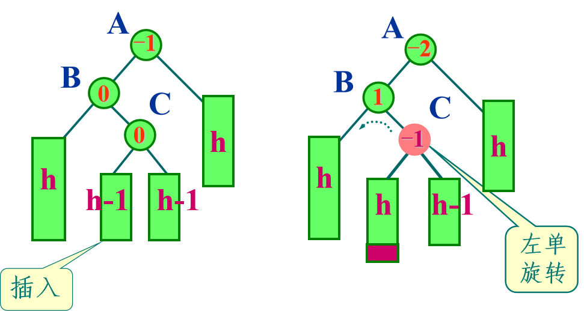

# 二叉搜索树 && 平衡树

## 定义

二叉搜索树满足定义：

- 空树是二叉搜索树

- 非空树的根节点的值大于左子节点的值（或者左子节点为空），小于右子节点的值（或者右子节点为空），并且整棵树的节点值通常各不相同

- 任意节点的左子树和右子树也是二叉搜索树

（即：任意节点左子树的所有节点值 < 该节点值 < 右子树的所有节点值；空树自动满足条件）

平衡树要求树的节点满足一种均衡关系（目的是使 $h ≈ \log n$），确保树不会退化。AVL 树对平衡性的定义是：对于树的每一个节点，满足左右子树的高度差不超过 1

## 性质

二叉搜索树任意节点左子树的所有节点值 < 该节点值 < 右子树的所有节点值，因此如果中序遍历二叉搜索树，得到的序列是单调递增的

???+ tip "一种理想的二叉搜索树构造，二叉树的中序遍历序列如数组所示"

    
    
    同时根据上面的图你会发现，对升序数组中的某个数字的二分查找过程，就是对相应的二叉搜索树自顶向下搜索的过程。二叉搜索树将搜索过程具象化了

## 建立

### 节点定义

在基础的二叉树基础上，选择性的加上一些维护信息，方便一些基于 BST 的操作

```c++
struct treeNode{
    int val;
    int size;		// 以当前节点为根的子树的大小
    int count;		// 当前节点 val 的重复数量（针对于可重 BST）
    treeNode *leftChild, *rightChild;
    treeNode ()
        { val = 0; size = 1; count = 1; leftChild = nullptr; rightChild = nullptr; }
    treeNode (int x, treeNode *l = nullptr, treeNode *r = nullptr)
        { val = x; size = 1; count = 1; leftChild = l; rightChild = r; }
};
```

### 非动态建树

我们先从一个特例开始：对一个有序数组建立二叉搜索树

正如前面的图像所描述，我们像二分查找那样，二分建树即可：

```c++
treeNode* createBST(const vector<int>& nums, int left, int right) {
    if (left > right) {
        return nullptr;
    }
    
    int mid = left + (right - left) / 2;
    
    treeNode* root = new treeNode(nums[mid]);
    root->leftChild = createBST(nums, left, mid - 1);
    root->rightChild = createBST(nums, mid + 1, right);
    
    return root;
}
```

这样的建树方式非常直观，并且由于二分建树的特性，这棵树同时也是平衡树

假如给定的数组是无序的，我们经过一次排序操作，然后二分建树，时间复杂度 $O(n\log n)$，建成的树还是平衡树，效率也很高

但是如果我们需要动态建树（插入/删除单个顶点），仅靠上面的操作是完全不够的

### 动态建树

#### 插入一个元素

我们希望动态插入节点的过程不至于每次都大幅度修改原来的 BST 树，因此我们将新的节点统一插入为树的叶节点，不修改已建立的二叉树，采用和二分建树相似的逻辑：

```c++
// updateSize() 函数之后将多次用到，因此我们独立出该函数，象征性用 inline
inline void updateSize(treeNode* root){
    // size = 左子树 size + 右子树 size + count
    if (root) root->size = (root->leftChild ? root->leftChild->size : 0) +
              (root->rightChild ? root->rightChild->size : 0) +
              (root->count);
}

treeNode* insertBST(treeNode* root, int key) {
    if (root == nullptr) {
        return new treeNode(key);
    }

    if (key < root->val) {
        root->leftChild = insertBST(root->leftChild, key);
    } else if (key > root->val) {
        root->rightChild = insertBST(root->rightChild, key);
    } else {
        root->count++;				// 针对可重集，记录重复出现次数
    }
	
    // 更新节点大小
    updateSize(root);

    return root;
}
```

其时间复杂度为 $O(h)$，根据树的实际构造情况在 $O(\log n) \sim O(n)$ 浮动

#### 删除一个元素

删除一个元素需要考虑的内容多一些：

1- 如果待删除的元素是叶节点，那么直接删除即可

2- 如果待删除的节点只存在单侧子树，那么我们要用这个子树的根节点去代替待删除节点

3- 如果待删除的节点同时存在左右子树，那么我们需要用合适的节点去代替待删除节点，根据中序遍历的结果，选择待删除节点左右相邻的节点之一进行位置的替代，这样能保持 BST 的性质

下面的函数中，返回值是用于替代被删除位置的节点的指针，可能是 `nullptr`，也可能是用于位置替代的节点指针

```c++
treeNode* deleteBST(treeNode* root, int key) {
    if (root == nullptr) {
        return nullptr;
    }

    // 先递归找到节点
    if (key < root->val) {
        root->leftChild = deleteBST(root->leftChild, key);
    } else if (key > root->val) {
        root->rightChild = deleteBST(root->rightChild, key);
    } else if (root->count > 1){		// 节点的重复次数大于 1
        root->count--;
    }
    // 需要实际删除该节点
    else {
        // 有 0/1 个子节点
        if (root->leftChild == nullptr) {
            treeNode* temp = root->rightChild;
            delete root;
            return temp;
        }
        if (root->rightChild == nullptr) {
            treeNode* temp = root->leftChild;
            delete root;
            return temp;
        }

        // 有两个子节点
        else {
            // 以找右子树的最小节点（中序后继）为例
            treeNode* minNode = root->rightChild;

            // 找最小节点
            while (minNode->leftChild != nullptr) {
                minNode = minNode->leftChild;
            }

            // 用最小节点的 val 与 count 替换当前节点的 val 与 count
            root->val = minNode->val;
            root->count = minNode->count;
            // 设置 minNode->count = 1 是因为它将要被删掉了
            // 递归删除方便更新 count 等信息
            minNode->count = 1;
			root->rightChild = deleteBST(root->rightChild, minNode->val);
        }
    }

    // 更新节点大小
    updateSize(root);
    
    return root;
}
```

其时间复杂度为 $O(h)$，根据树的实际构造情况在 $O(\log n) \sim O(n)$ 浮动

### 查询操作

#### 查询指定元素位置

其操作在删除操作中已经体现，这里给出非递归版本

```c++
// 非递归查找，返回节点指针，未找到返回 nullptr
treeNode* search(treeNode* root, int key) {
    treeNode* cur = root;
    while (cur) {
        if (key == cur->val) {
            return cur;
        } else if (key < cur->val) {
            cur = cur->leftChild;
        } else {
            cur = cur->rightChild;
        }
    }
    
    return nullptr;
}
```

#### 查询指定元素的前驱/后继

自顶向下搜索，以查询前驱为例，如果节点值小于当前值，则当前值可能就是前驱，去更大的右子树中寻找可能的更大节点，否则前驱在其左子树中，去左子树。

```c++
treeNode* getPre(treeNode* root, int key) {
    treeNode* pre = nullptr;
    while (root) {
        if (key > root->val) {
            pre = root;
            root = root->rightChild;
        } else {
            root = root->leftChild;
        }
    }
    return pre;
}

treeNode* getSuc(treeNode* root, int key) {
    treeNode* suc = nullptr;
    while (root) {
        if (key < root->val) {
            suc = root;
            root = root->leftChild;
        } else {
            root = root->rightChild;
        }
    }
    return suc;
}
```

#### 查询指定元素的排名

取出 BST 对应的可重集的元素进行升序排序，对于在 BST 树上的待查询元素 `key` 返回小于 key 的元素个数然后加上 1（排名）；对于不在 BST 树上的 `key` 返回小于 key 的元素个数

向下搜索指定元素的过程中，如果向右子树搜索，答案累加当前节点的 `size` 和 `count`（左子树 + 当前节点元素个数）；如果向左子树搜素，不累加答案；找到指定元素时，答案累加当前节点的 `size` 再加 1（对于不在 BST 树上的 `key` 不会有这一步）

```c++
int getRankFromKey(treeNode* root, int key) {
    // 到达叶子节点
    if (root == nullptr) return 1;
    
    // 指定元素在左子树
    if (root->val > key) return getRankFromKey(root->leftChild, key);
    // 指定元素在右子树
    if (root->val < key) return getRankFromKey(root->rightChild, key) + (root->leftChild ? root->leftChild->size : 0) + root->count;
	// 找到了指定元素
    return (root->leftChild ? root->leftChild->size : 0) + 1;    
}
```

#### 查询指定排名的元素

对左子树大小进行三分：

1- $rank \leq leftSize$，元素在左子树中

2- $rank \in (leftSize, leftSize+count]$，元素为当前节点

3- $rank > leftSize+count$，元素在右子树中

```c++
int getKeyFromRank(treeNode* root, int rank) {
    // 排名超限
    if (root == nullptr) {
        return -1;
    }

    // 计算左子树的节点数
    int leftSize = root->leftChild ? root->leftChild->size : 0;

    // 目标 rank 在左子树中
    if (rank <= leftSize) {
        return getKeyFromRank(root->leftChild, rank);
    }
    // 找到了 rank 对应的节点范围
    else if (rank <= leftSize + root->count) {
        return root->val;
    } 
    // 目标 rank 在右子树中
    else {
        // rank 减去左子树 + 当前节点元素个数的偏移，也就是已经跳过的元素个数
        return getKeyFromRank(root->rightChild, rank - (leftSize + root->count) );
    }
}
```

---

## 平衡树

依旧以这张图为例：


如果用二分建树的方法，建立的二叉搜索树是平衡树，插入操作是稳定的 $O(\log n)$；但是如果我们采用之前的插入操作，从 $1$ 到 $15$ 依次插入，我们会得到这样的结果：


树退化成了一条链，插入操作完全退化为了 $O(n)$

因此我们需要让二叉树实现自平衡，以确保时间复杂度基于树的高度的算法不会因为树的退化而达到最坏时间复杂度

??? abstract "[OI Wiki](https://oi-wiki.org/ds/bst/) 上介绍了很多种自平衡的实现方案"

    

在理解不同自平衡方案之前，我们需要了解两种最基本的树上操作：

### 左旋 && 右旋

这里直接借用 [OI Wiki](https://oi-wiki.org/ds/bst/) 的图


图中 $T1 \sim T3$ 都是子树，$A,B$ 是进行左/右旋操作的关键节点（以右旋操作为例，$A$ 是失衡待调整的节点，$B$ 是调整后新的根节点）

这里以右旋为例给出具体的操作，关键的两个指针修改用不同颜色的线表示：


```c++
treeNode* rotateRight(treeNode* A) {
    treeNode* B = A->leftChild;		// B 为新的根节点
    A->leftChild = B->rightChild;	// 对应图中的 T2 从 B 的左子树迁移到 A 的右子树
    B->rightChild = A;				// 对应图中的 A B 身份交换
    update(A); update(B);			// A B 两节点的平衡因子需要更新
    return B;						// 返回新的根节点 B
}
```

不难发现右旋和左旋的操作是完全反向的（右旋的示意图从右往左看就是左旋过程）

```c++
treeNode* rotateLeft(treeNode* A) {
    treeNode* B = A->rightChild;
    A->rightChild = B->leftChild;
    B->leftChild = A;
    update(A); update(B);
    return B;
}
```

多数自平衡树的调整方案就基于上述的旋转操作

### AVL 树

AVL 树是最常见的一种二叉平衡搜索树，其在二叉搜索树的基础上额外递归定义为：

- 空二叉树是 AVL 树
- 以 root 为根的树是 AVL 树，则 root 的左子树高度和右子树高度差不超过 $1$，因此子树也是 AVL 树

AVL 树对平衡的要求非常严格，其保证树高一定为 $O(\log n)$（否则树不平衡），有一点偏差就会通过旋转操作调整

我们对每个节点附加一个平衡因子，值为右子树高度减去左子树高度；对于 AVL 树，其值只能为 $-1,0,1$，否则就需要进行旋转调整

```c++
struct treeNode{
    int val;
    int size;
    int count;
    int bf;
    treeNode *leftChild, *rightChild;
    treeNode ()
        { val = 0; bf = 0; size = 1; count = 1; leftChild = nullptr; rightChild = nullptr; }
    treeNode (int x, treeNode *l = nullptr, treeNode *r = nullptr)
        { val = x; bf = 0; size = 1; count = 1; leftChild = l; rightChild = r; }
};
```

#### 失衡与自平衡

AVL 一旦遇到不平衡就会进行调整，失衡的情况总共可以概括为四种，分为两类。我们假定 $A$ 为自底向上回溯的路径中第一个失衡的节点，路径向下分别为节点 $B$ $C$：

- 这三个节点在一条直线上

对 $A,B$ 进行单次的左旋 && 右旋操作即可，如何操作在之前已经说明，平衡因子的更新也比较简单

> 1- RR 情况


```c++
treeNode* rotateRR(treeNode* A) {
    treeNode* B = A->rightChild;
    A->rightChild = B->leftChild;
    B->leftChild = A;
    // 平衡因子更新
    A->bf = 0; B->bf = 0;
    // size 更新
    updateSize(A);
    updateSize(B);
    return B;
}
```

> 2- LL 情况


```c++
treeNode* rotateLL(treeNode* A) {
    treeNode* B = A->leftChild;
    A->leftChild = B->rightChild;
    B->rightChild = A;
    // 平衡因子更新
    A->bf = 0; B->bf = 0;
    // size 更新
    updateSize(A);
    updateSize(B);
    return B;
}
```

- 这三个节点不在一条直线上（折线）

也分两种情况：

> 3- LR 情况

此时需要操作三个节点 $A,B,C$，需要先对下层两个顶点进行一次左旋操作回到上一类状态，然后对上层两个顶点进行右旋操作

注意平衡因子的更新情况取决于 $C$ 的旧 bf 值，而不能像上一种情况一样直接设为 0




```c++
treeNode* rotateLR(treeNode* A) {
    treeNode* B = A->leftChild;
    treeNode* C = B->rightChild;

    // 左旋 B-C
    B->rightChild = C->leftChild;
    C->leftChild = B;

    // 右旋 A-C
    A->leftChild = C->rightChild;
    C->rightChild = A;

    // 根据新节点的插入情况更新平衡因子
    if (C->bf == 0) {
        // C 是插入的新节点
        A->bf = 0;
        B->bf = 0;
    } else if (C->bf == 1) {
        // 新节点插入在 C 的右子树
        A->bf = 0;
        B->bf = -1;
    } else {
        // 新节点插入在 C 的左子树
        A->bf = 1;
        B->bf = 0;
    }
    C->bf = 0;
    
    // 根节点 C 最后更新 size
    updateSize(A);
    updateSize(B);
    updateSize(C);
    
    return C;  // C 成为新的根
}
```

> 4- RL 情况

需要先对下层两个顶点进行一次右旋操作回到上一类状态，然后对上层两个顶点进行左旋操作

注意平衡因子的更新情况取决于 $C$ 的旧 bf 值


```c++
treeNode* rotateRL(treeNode* A) {
    treeNode* B = A->rightChild;
    treeNode* C = B->leftChild;

    B->leftChild = C->rightChild;
    C->rightChild = B;

    A->rightChild = C->leftChild;
    C->leftChild = A;

    if (C->bf == 0) {
        A->bf = 0;
        B->bf = 0;
    } else if (C->bf == 1) {
        A->bf = -1;
        B->bf = 0;
    } else {
        A->bf = 0;
        B->bf = 1;
    }
    C->bf = 0;
    
    // 根节点 C 最后更新 size
    updateSize(A);
    updateSize(B);
    updateSize(C);
    return C;
}
```

#### 插入操作

插入操作的前半部分和二叉搜索树的插入差别不大，关键在于插入后更新沿路的平衡因子，利用栈记录沿途路径；在插入新节点后回溯路径，并进行可能需要的旋转操作来修正不平衡

递归实现比显式栈实现更简单，具体体现在递归栈的自然回溯上，否则需要显式维护一个栈用于存储插入操作时的向下搜索的路径，并且需要手动回溯

为了判断“子树高度是否增加”，我们需要一个全局性的 `taller` 变量，具体的逻辑参考代码注释

```c++
treeNode* insertAVL(treeNode* root, int key, bool& taller) {
    // 1. 抵达空节点位置，执行插入操作
    // 为上一层递归（父节点）设置 taller = true，父节点子树一定出现了高度增加
    if (root == nullptr) {
        taller = true;
        return new treeNode(key);	// 初始化 size = count = 1
    }

    // 2. key < rootval
    if (key < root->val) {
        // 递归插入到左子树，继续向下搜索插入位置
        root->leftChild = insertAVL(root->leftChild, key, taller);
        // 递归栈回到这里时，如果左子树的高度确实增加了
        if (taller) {
            // 如果原本是右子树比左子树高 1
            if (root->bf == 1) {
                // bf 平衡，没有影响树高度 (root_h + h+1)
                //     bf=1           bf=0
                //    /    \   -->   /    \
                //   h     h+1     h+1    h+1
                root->bf = 0;
                taller = false;
            }
            // 如果原本是左子树和右子树等高
            else if (root->bf == 0) {
                // bf 左偏，导致树变高 (root_h + h -> root_h + h + 1)
                //     bf=0           bf=-1
                //    /    \   -->   /     \
                //   h      h      h+1      h
                root->bf = -1;
                taller = true;
            }
            // 如果原本是左子树比右子树高 1，更新后 bf = -2，失衡
            // L_ 型
            else {								// 结合下一个节点判断旋转类型
                if (root->leftChild->bf <= 0)	// LL 型
                    root = rotateLL(root);
                else							// LR 型
                    root = rotateLR(root);
				// 旋转后重置 taller 状态
                taller = false;
            }
        }
    }

	// 3. key > rootval
    else if (key > root->val) {
        // 递归插入到右子树，继续向下搜索插入位置
        root->rightChild = insertAVL(root->rightChild, key, taller);
		// 递归栈回到这里时，如果右子树的高度确实增加了
        if (taller) {
            // 如果原本是左子树比右子树高 1
            if (root->bf == -1) {
                // bf 平衡，没有影响树高度 (root_h + h+1)
                root->bf = 0;
                taller = false;
            }
            // 如果原本是左子树和右子树等高
            else if (root->bf == 0) {
                // bf 右偏，导致树变高 (root_h + h -> root_h + h + 1)
                root->bf = 1;
                taller = true;
            }
            // 如果原本是右子树比左子树高 1，更新后 bf = 2，失衡
            // R_ 型
            else {								// 结合下一个节点判断旋转类型
                if (root->rightChild->bf >= 0)	// RR 型
                    root = rotateRR(root);
                else							// RL 型
                    root = rotateRL(root);

                taller = false;
            }
        }
    }
    
    // 重复节点处理
    else {
        root->count++;       // 只增加 count
        taller = false;      // 重复节点不会导致高度增加
    }
    
    // 更新根节点 size
	updateSize(root);
    return root;
}

treeNode* insertAVL(treeNode* root, int key){
    bool taller = false;
    return insertAVL(root, key, taller);
}
```

#### 删除操作

结合朴素 BST 的删除操作，以及 AVL 的插入操作中更新 bf 和调整树高的操作，可以得到下面的函数

为了判断“子树高度是否减小”，我们需要一个全局性的 `shorter` 变量，具体的逻辑参考代码注释

```c++
treeNode* deleteAVL(treeNode* root, int key, bool& shorter) {
    // 1. 没有找到 key 节点，不删除节点，返回
    if (root == nullptr) {
        shorter = false;
        return nullptr;
    }

    // 2. key < rootval
    if (key < root->val) {
        // 递归搜索到左子树，继续向下搜索删除位置
        root->leftChild = deleteAVL(root->leftChild, key, shorter);
        // 递归栈回到这里时，如果左子树的高度确实减小了
        if (shorter) {
            // 如果原本是左子树比右子树高 1
            if (root->bf == -1) {
                // bf 平衡，导致树变矮 (root_h + h+1 -> root_h + h)
                //	 bf=-1		   bf=0
                //	/	 \   -->   /	\
                //  h+1	  h	   h	  h
                root->bf = 0;
                shorter = true;
            }
            // 如果原本是左子树和右子树等高
            else if (root->bf == 0) {
                // bf 右偏，没有影响树高度 (root_h + h)
                //	 bf=0			bf=1
                //	/	 \   -->   /	\
                //   h	   h	  h-1	 h
                root->bf = 1;
                shorter = false;
            } 
            // 如果原本是右子树比左子树高 1，更新后 bf = 2，失衡
            // R_ 型
            else {
                // 结合下一个节点判断旋转类型
                treeNode* r = root->rightChild;
                if (r->bf >= 0) {				// RR 型
                    root = rotateRR(root);
                    shorter = (r->bf == 0);
                } else {						// RL 型
                    root = rotateRL(root);
                    shorter = true;				// 树一定是变矮的
                }
            }
        }
    }

    // 3. key > rootval
    else if (key > root->val) {
        // 递归搜索到右子树，继续向下搜索删除位置
        root->rightChild = deleteAVL(root->rightChild, key, shorter);
        // 递归栈回到这里时，如果右子树的高度确实减小了
        if (shorter) {
            // 如果原本是右子树比左子树高 1
            if (root->bf == 1) {
                // bf 平衡，导致树变矮 (root_h + h+1 -> root_h + h)
                root->bf = 0;
                shorter = true;
            }
            // 如果原本是左子树和右子树等高
            else if (root->bf == 0) {
                // bf 左偏，没有影响树高度 (root_h + h)
                root->bf = -1;
                shorter = false;
            } 
            // 如果原本是左子树比右子树高 1，更新后 bf = -2，失衡
            // L_ 型
            else {
                // 结合下一个节点判断旋转类型
                treeNode* l = root->leftChild;
                if (l->bf <= 0) {				// LL 型
                    root = rotateLL(root);
                    shorter = (l->bf == 0);
                } else {						// LR 型
                    root = rotateLR(root);
                    shorter = true;				// 树一定是变矮的
                }
            }
        }
    }

    // 4. 找到了待删除节点，重复出现
    else if(root->count > 1){
        root->count--;
        shorter = false;
    }
    // 5. 找到了待删除结点，需要实际删除
    else{
        // 如果待删除节点只有最多一个子结点
        // 非优化版本参考朴素 BST 树的删除操作
        if (root->leftChild == nullptr) {
            treeNode* r = root->rightChild;
            delete root;
            root = r;
            shorter = true;
        }
        else if (root->rightChild == nullptr) {
            treeNode* l = root->leftChild;
            delete root;
            root = l;
            shorter = true;
        }

        // 有两个子节点
        else {
            // 以找右子树的最小节点（中序后继）为例
            treeNode* minParent = root;
            treeNode* minNode = root->rightChild;

            // 找到最小节点
            while (minNode->leftChild != nullptr) {
                minParent = minNode;
                minNode = minNode->leftChild;
            }

            // 用最小节点的值替换当前节点的值，同时更新 count 值
            // 设置 minNode->count = 1 是因为它将要被删掉了
            root->val = minNode->val;
            root->count = minNode->count;
            minNode->count = 1;
			// 递归删除后继节点
            root->rightChild = deleteAVL(root->rightChild, minNode->val, shorter);

            if (shorter) {	
                if (root->bf == 1) {
                    root->bf = 0;
                    shorter = true;
                }
                else if (root->bf == 0) {
                    root->bf = -1;
                    shorter = false;
                }
                else {
                    treeNode* l = root->leftChild;

                    if (l->bf <= 0) {			// LL
                        root = rotateLL(root);
                        shorter = (l->bf == 0);
                    } else {					// LR
                        root = rotateLR(root);
                        shorter = true;
                    }
                }
            }
        }
    }

    updateSize(root);
    return root;
}
```

---

附 Luogu 模板题：[P3369 【模板】普通平衡树 - 洛谷](https://www.luogu.com.cn/problem/P3369)

??? quote "一个可以通过评测的参考实现，删去了之前的所有注释"

    ```c++
    #include <bits/stdc++.h>
    
    using namespace std;
    using ll = long long;
    
    struct treeNode{
        int val;
        int size;
        int count;
        int bf;
        treeNode *leftChild, *rightChild;
        treeNode ()
            { val = 0; bf = 0; size = 1; count = 1; leftChild = nullptr; rightChild = nullptr; }
        treeNode (int x, treeNode *l = nullptr, treeNode *r = nullptr)
            { val = x; bf = 0; size = 1; count = 1; leftChild = l; rightChild = r; }
    };
    
    treeNode* getPre(treeNode* root, int key) {
        treeNode* pre = nullptr;
        while (root) {
            if (key > root->val) {
                pre = root;
                root = root->rightChild;
            } else {
                root = root->leftChild;
            }
        }
        return pre;
    }
    
    treeNode* getSuc(treeNode* root, int key) {
        treeNode* suc = nullptr;
        while (root) {
            if (key < root->val) {
                suc = root;
                root = root->leftChild;
            } else {
                root = root->rightChild;
            }
        }
        return suc;
    }
    
    int getRankFromKey(treeNode* root, int key) {
        if (root == nullptr) return 1;
        if (root->val > key) return getRankFromKey(root->leftChild, key);
        if (root->val < key) return getRankFromKey(root->rightChild, key) + (root->leftChild ? root->leftChild->size : 0) + root->count;
        return (root->leftChild ? root->leftChild->size : 0) + 1;	
    }
    
    int getKeyFromRank(treeNode* root, int rank) {
        if (root == nullptr) return -1;
        int leftSize = root->leftChild ? root->leftChild->size : 0;
        if (rank <= leftSize) {
            return getKeyFromRank(root->leftChild, rank);
        }
        else if (rank <= leftSize + root->count) {
            return root->val;
        } 
        else {
            return getKeyFromRank(root->rightChild, rank - (leftSize + root->count) );
        }
    }
    
    inline void updateSize(treeNode* root){
        if (root) root->size = (root->leftChild ? root->leftChild->size : 0) +
                (root->rightChild ? root->rightChild->size : 0) +
                (root->count);
    }
    
    treeNode* rotateRR(treeNode* A) {
        treeNode* B = A->rightChild;
        A->rightChild = B->leftChild;
        B->leftChild = A;
        A->bf = 0; B->bf = 0;
        updateSize(A);
        updateSize(B);
        return B;
    }
    
    treeNode* rotateLL(treeNode* A) {
        treeNode* B = A->leftChild;
        A->leftChild = B->rightChild;
        B->rightChild = A;
        A->bf = 0; B->bf = 0;
        updateSize(A);
        updateSize(B);
        return B;
    }
    
    treeNode* rotateLR(treeNode* A) {
        treeNode* B = A->leftChild;
        treeNode* C = B->rightChild;
    
        B->rightChild = C->leftChild;
        C->leftChild = B;
    
        A->leftChild = C->rightChild;
        C->rightChild = A;
    
        if (C->bf == 0) {
            A->bf = 0;
            B->bf = 0;
        } else if (C->bf == 1) {
            A->bf = 0;
            B->bf = -1;
        } else {
            A->bf = 1;
            B->bf = 0;
        }
        C->bf = 0;
    
        updateSize(A);
        updateSize(B);
        updateSize(C);
    
        return C;
    }
    
    treeNode* rotateRL(treeNode* A) {
        treeNode* B = A->rightChild;
        treeNode* C = B->leftChild;
    
        B->leftChild = C->rightChild;
        C->rightChild = B;
    
        A->rightChild = C->leftChild;
        C->leftChild = A;
    
        if (C->bf == 0) {
            A->bf = 0;
            B->bf = 0;
        } else if (C->bf == 1) {
            A->bf = -1;
            B->bf = 0;
        } else {
            A->bf = 0;
            B->bf = 1;
        }
        C->bf = 0;
    
        updateSize(A);
        updateSize(B);
        updateSize(C);
        return C;
    }
    
    treeNode* insertAVL(treeNode* root, int key, bool& taller) {
        if (root == nullptr) {
            taller = true;
            return new treeNode(key);
        }
    
        if (key < root->val) {
            root->leftChild = insertAVL(root->leftChild, key, taller);
            if (taller) {
                if (root->bf == 1) {
                    root->bf = 0;
                    taller = false;
                }
                else if (root->bf == 0) {
                    root->bf = -1;
                    taller = true;
                }
                else {
                    if (root->leftChild->bf <= 0)
                        root = rotateLL(root);
                    else
                        root = rotateLR(root);
                    taller = false;
                }
            }
        }
    
        // 3. key > rootval
        else if (key > root->val) {
            root->rightChild = insertAVL(root->rightChild, key, taller);
            if (taller) {
                if (root->bf == -1) {
                    root->bf = 0;
                    taller = false;
                }
                else if (root->bf == 0) {
                    root->bf = 1;
                    taller = true;
                }
                else {
                    if (root->rightChild->bf >= 0)
                        root = rotateRR(root);
                    else
                        root = rotateRL(root);
    
                    taller = false;
                }
            }
        }
    
        else {
            root->count++;
            taller = false;
        }
    
        updateSize(root);
        return root;
    }
    
    treeNode* insertAVL(treeNode* root, int key){
        bool taller = false;
        return insertAVL(root, key, taller);
    }
    
    treeNode* deleteAVL(treeNode* root, int key, bool& shorter) {
        if (root == nullptr) {
            shorter = false;
            return nullptr;
        }
    
        if (key < root->val) {
            root->leftChild = deleteAVL(root->leftChild, key, shorter);
            if (shorter) {
                if (root->bf == -1) {
                    root->bf = 0;
                    shorter = true;
                }
                else if (root->bf == 0) {
                    root->bf = 1;
                    shorter = false;
                } 
                else {
                    treeNode* r = root->rightChild;
                    if (r->bf >= 0) {
                        root = rotateRR(root);
                        shorter = (r->bf == 0);
                    } else {
                        root = rotateRL(root);
                        shorter = true;
                    }
                }
            }
        }
    
        else if (key > root->val) {
            root->rightChild = deleteAVL(root->rightChild, key, shorter);
            if (shorter) {
                if (root->bf == 1) {
                    root->bf = 0;
                    shorter = true;
                }
                else if (root->bf == 0) {
                    root->bf = -1;
                    shorter = false;
                }
                else {
                    treeNode* l = root->leftChild;
                    if (l->bf <= 0) {
                        root = rotateLL(root);
                        shorter = (l->bf == 0);
                    } else {
                        root = rotateLR(root);
                        shorter = true;
                    }
                }
            }
        }
    
        else if(root->count > 1){
            root->count--;
            shorter = false;
        }
        else{
            if (root->leftChild == nullptr) {
                treeNode* r = root->rightChild;
                delete root;
                root = r;
                shorter = true;
            }
            else if (root->rightChild == nullptr) {
                treeNode* l = root->leftChild;
                delete root;
                root = l;
                shorter = true;
            }
    
            else {
                treeNode* minParent = root;
                treeNode* minNode = root->rightChild;
    
                while (minNode->leftChild != nullptr) {
                    minParent = minNode;
                    minNode = minNode->leftChild;
                }
    
                root->val = minNode->val;
                root->count = minNode->count;
                minNode->count = 1;
    
                root->rightChild = deleteAVL(root->rightChild, minNode->val, shorter);
    
                if (shorter) {	
                    if (root->bf == 1) {
                        root->bf = 0;
                        shorter = true;
                    }
                    else if (root->bf == 0) {
                        root->bf = -1;
                        shorter = false;
                    }
                    else {
                        treeNode* l = root->leftChild;
    
                        if (l->bf <= 0) {
                            root = rotateLL(root);
                            shorter = (l->bf == 0);
                        } else {
                            root = rotateLR(root);
                            shorter = true;
                        }
                    }
                }
            }
        }
    
        updateSize(root);
        return root;
    }
    
    treeNode* deleteAVL(treeNode* root, int key) {
        bool shorter = false;
        return deleteAVL(root, key, shorter);
    }
    
    treeNode* root = nullptr;
    
    void solve(){
    	int n; cin >> n;
    	while(n--){
            int opt, x; cin >> opt >> x;
            switch (opt){
                case 1:
                    root = insertAVL(root, x);
                    break;
                case 2:
                    root = deleteAVL(root, x);
                    break;
                case 3:
                    cout << getRankFromKey(root, x) << "\n";
                    break;
                case 4:
                    cout << getKeyFromRank(root, x) << "\n";
                    break;
                case 5:
                {
                    treeNode* pre = getPre(root, x);
                    if (pre != nullptr)
                        cout << pre->val << "\n";
                    break;
                }
                case 6:
                {
                    treeNode* suc = getSuc(root, x);
                    if (suc != nullptr)
                        cout << suc->val << "\n";
                    break;
                }
            }
        }
    }
    
    signed main(){
        ios::sync_with_stdio(false);
        cin.tie(0); cout.tie(0);
    
        int t; 
        // cin >> t;
        t = 1;
    
        while (t--){
            solve();
        }
        return 0;
    }
    
    ```

