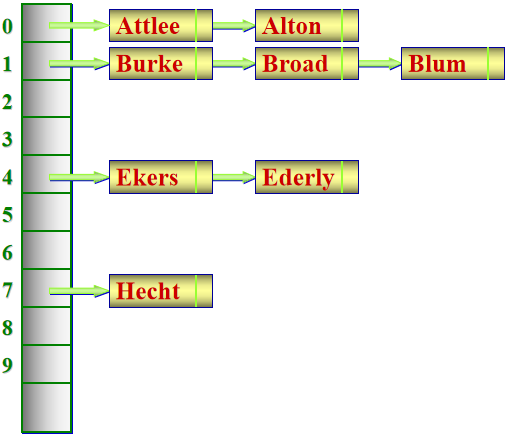

# 散列表/哈希表

一种理想情况下能够实现 $O(1)$ 复杂度的键 -> 值查询、插入、删除的数据结构

简单来说（不考虑哈希冲突）就是实现这样的过程：$key \to array[f(key)] \to value$，或者说，我希望查询键 $key$ 对应的值，根据 $O(1)$ 哈希计算我可以定位到存储值的内存地址

## 哈希函数

最简单的 hash 函数：对于任意的 $key$ 为正整数，哈希函数 $f(key) =key$，索引 $a[f(key)] = value$，这其实就是一个普通数组，并且这个函数是线性的，没有进行压缩

假设键值是非常大的整数，直接对 $array$ 取大下标不可取，此时选择一个较大质数 $N$，哈希函数 $f(key) = key \bmod N$，这个函数是压缩式的

为了实现对任意的数据类型都能达到像普通数组一样的效果，需要将不同类型的 $key$ 通过哈希函数映射到内存对应位置（也就是 $array[f(key)]$）

比如 $key$ 为字符串 $s$，我们有若干种哈希函数的构造方案：

1 -  $f(key) =(𝑠_0 ⋅127^0 +𝑠_1 ⋅127^1 +𝑠_2 ⋅127^2 +⋯ +𝑠_𝑛 ⋅127^𝑛) \bmod 2^{64}$ 

2 - 先对单个字符进行映射，每个字符映射到一个不同的小质数：$g[char] = N_{char}$

​	$f(key) = (s_0 \cdot N_0 \cdot s_1 \cdot N_1 \cdot s_2 \cdot N_2 \cdot \cdots \cdot s_n \cdot N_n) \bmod 2^{64}$ 

... ...

## 哈希冲突

因为哈希函数通常是压缩实现，不同的 $key$ 有可能映射到相同的 $f(key)$ 

比如 $f(key) = (s_0 \cdot N_0 \cdot s_1 \cdot N_1 \cdot s_2 \cdot N_2 \cdot \cdots \cdot s_n \cdot N_n) \bmod 2^{64}$ 的字符串哈希函数，容易发现函数对同一组异位词（比如 listen 与 silent）都返回相同的哈希值，此时会出现哈希冲突

处理冲突的方法分为闭散列方法和开散列方法

### 闭散列：线性探查法

所有元素都存储在哈希表数组本身中，当发生冲突时，按照某种探测方法在数组中寻找下一个空位置。

对于线性探查法，当遇到哈希冲突时，依次向后寻找不冲突的位置进行存放

> 例：$\{ 47,7,29,11,16,92,22,8 \}$ 按照 $f(key) = key \bmod {11}$ 的规则存储到长为 $11$ 的哈希表：
>
> | 0    | 1      | 2    | 3    | 4    | 5    | 6    | 7    | 8      | 9     | 10   |
> | ---- | ------ | ---- | ---- | ---- | ---- | ---- | ---- | ------ | ----- | ---- |
> | 11   | **22** |      | 47   | 92   | 16   |      | 7    | **29** | **8** |      |
>
> 不难发现有些元素（**加粗**的数值）被 “挤到后面去了”，所以在哈希表查询时，我需要在定位到这个元素的 index 之后，（如果没有直接匹配到）继续往下搜索，直到遇到 NULL（哈希表中无此元素）或者找到元素
>
> 这里给出一个更完整的表格，记录了对于每个 `index`，查表成功与查找失败的情况下的查找长度（从定位到 index 到找到实际值总共需要遍历的元素个数）：
>
> | index                | 0    | 1    | 2    | 3    | 4    | 5    | 6    | 7    | 8    | 9    | 10   |
> | -------------------- | ---- | ---- | ---- | ---- | ---- | ---- | ---- | ---- | ---- | ---- | ---- |
> | val                  | 11   | 22   |      | 47   | 92   | 16   |      | 7    | 29   | 8    |      |
> | 搜索成功时的搜索长度 | 1    | 2    |      | 1    | 1    | 1    |      | 1    | 2    | 2    |      |
> | 搜索失败时的搜索长度 | 3    | 2    | 1    | 4    | 3    | 2    | 1    | 4    | 3    | 2    | 1    |
>
> 闭散列最大的问题是散列表的大小固定，我们记装载因子 $\alpha = n / table\_size$ 
>
> 当 $\alpha$ 接近 $1$ 时，哈希表的查找速率和线性表 $O(n)$ 差异很小
>
> $\alpha$ 不能 $\geq 1$，因为闭散列容量固定且有限
>
> 只有 $\alpha$ 较小时闭散列才适合使用，比如 $\alpha < 0.7$ 

### 开散列：拉链法

$array[f(key)]$ 不存储单个值，而是存储 $[key, value, next]$ 链表（或者其他链式容器），在构造哈希表时，对于相同的哈希值采用插入链表节点的方式储存值（注意键和值都要插入），在搜索时，遇到哈希冲突的情况就可以在链表中遍历搜索（埋下伏笔）

（也就是说，拉链法的哈希桶存储的是链表指针，而不是 $value$）

> 这里给出一张来自课件的示意图
>
> 

## STL `unordered_map` 库

`unordered_map` 是哈希表的实现，相对于 `map`，其不保证元素有序，但是理想查询速度为 $O(1)$ 

在应对哈希冲突的时候采用拉链法：

```c++
// 创建
unordered_map<A, B> hashmap;	// A,B 是两种数据类型

// 插入
// 重复插入不会覆盖先前的值
hashmap.insert({A,B});
hashmap[A] = B;
hashmap.insert(make_pair(A,B));

// 删除
hashmap.erase(A);

// 查找
int val = hashmap[A];	// 如果 A 从未插入，会自动创建 {A,0} 的键值对
// 更安全的查找
auto it = hashmap.find(A);
if(it != hashmap.end()) int val = it->second;

// 遍历
// 类似于 vector，这里采用 range 写法
// 也可以结构化绑定
for (const auto& pair : hashmap) {
    cout << pair.first << "->" << pair.second << endl;
}
```

`unordered_map` 的缺点在于其常数因子高（建立哈希表开销），某些情况下效率不如 `map`

## 哈希爆破

注意到对于一个哈希函数，如果人为构造一系列哈希冲突，就会在哈希表的同一个点生成一条很长的链表，在链表上的查询最坏退化到 $O(n)$ 

`[某一个哈希值] -> key1 -> key2 -> key3 -> ... -> keyBIG` 

!!! tip "[这个很著名的 blog](https://codeforces.com/blog/entry/62393) 解释了为什么不要直接使用 `unordered` 容器"

一种好的解决方法是：如果数据不是很大，使用 `<map>`，用法和 `<unordered_map>` 是一样的

还有一种方式是使用 gnu 编译器的 pbds 库：

## `pb_ds` 库的哈希表

```c++
#include <ext/pb_ds/hash_policy.hpp>
// 部分环境中可以引用 #include<bits/extc++.h> 万能头 for pb_ds
using namespace __gnu_pbds;

cc_hash_table<A,B> h;		// 拉链法的哈希表
gp_hash_table<A,B> h;		// 探查法的哈希表，首选
```

赛场上通常更倾向于使用 `gp_hash_table`，其性能比原生 `unordered_map` 更优，也更难被爆破

追求极限可以以时间戳作为随机化参数：（引用：[C++ pb_ds 食用教程 - 洛谷专栏](https://www.luogu.com.cn/article/tk8rh0c9)）

```c++
#include <ext/pb_ds/hash_policy.hpp>
#include <chrono>
const int RANDOM = time(NULL);
// const int RANDOM = std::chrono::steady_clock::now().time_since_epoch().count();
struct MyHash {
	int operator() (int x) const {return x ^ RANDOM;}
};

__gnu_pbds::gp_hash_table <int, int, MyHash> Table;
```
