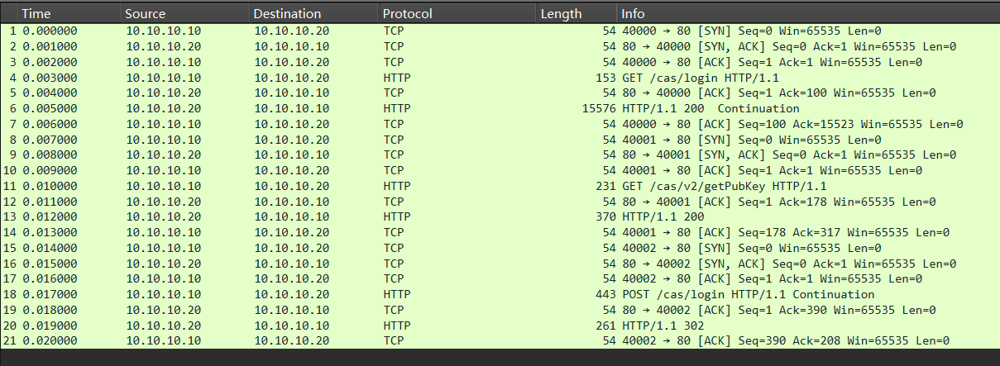
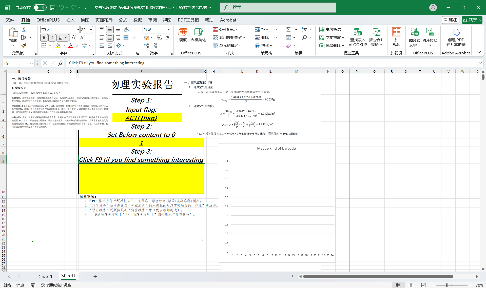
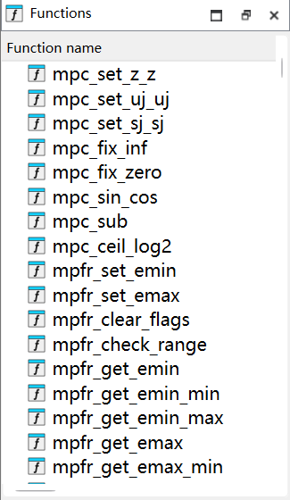
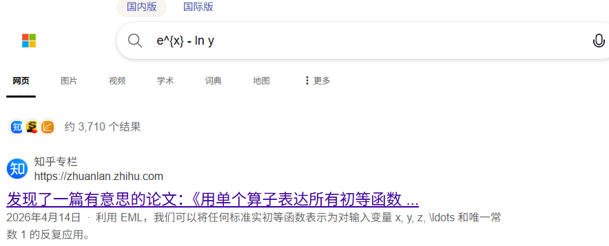

# ACTF 2026 Writeup

压根没打，考完期中后看看题

按照解题数排序找点水题写写

<!-- more -->

赛后没办法验 Flag 了所以还得找题解确认，部分题目的线上环境还关闭了没法做 😭

---

## 🧩 MISC

### special day

> Today is ACTF, and it is also Mother’s Day in China.
>
> The competition matters, but don’t forget to send your mom a simple blessing.
> Even one short sentence is enough.
>
> Use _ to join the words, remove punctuation, and wrap it with ACTF{}.

给了一个 txt 文件，内容是

```
SGFwcHkgTW90aGVyJ3MgRGF5LCBNb20h
```

Base64 得

```
Happy Mother's Day, Mom!
```

包装为 Flag

```
ACTF{Happy_Mothers_Day_Mom}
```

---

### ZJUAM Just Uses Awful Math

> 有黑调的迪克把我的浙江大学统一身份认证登录过程抓包了，黑调的迪克怎么这么坏啊

题目描述不像人类，下发一个 `zjuam.pcap`



直接 `strings` 扫一遍，发现神秘字符串：

```
{"modulus":"90011418f37a7a075aead75a9829d38eb2d750fd17bb24e5861b89d7658a88c3","exponent":"10001"}

username=player&password=590948ad2f7a3c0b1a2a5e5f470f4297db3b90623251132be2c5e5395cd12563&execution=[redacted]&_eventId=submit&rememberMe=true
```

RSA 暗示？我们提取十六进制内容：

```python
n = 0x90011418f37a7a075aead75a9829d38eb2d750fd17bb24e5861b89d7658a88c3
e = 0x10001
c = 0x590948ad2f7a3c0b1a2a5e5f470f4297db3b90623251132be2c5e5395cd12563
```

其中 n 在 factordb 上可以被分解

```
6513495575...67<77> = 202555251191383333988748320354737959551<39> · 321566364572398185024295275472079273917<39>
```

得到的相关参数进行 RSA 解密

```python
n = 0x90011418f37a7a075aead75a9829d38eb2d750fd17bb24e5861b89d7658a88c3
e = 0x10001
c = 0x590948ad2f7a3c0b1a2a5e5f470f4297db3b90623251132be2c5e5395cd12563
p = 202555251191383333988748320354737959551
q = 321566364572398185024295275472079273917

phi = (p - 1) * (q - 1)
d = pow(e, -1, phi)

m = pow(c, d, n)

msg = m.to_bytes((m.bit_length() + 7) // 8, 'big').decode()
print(msg)
```

得到 Flag

```
ACTF{TLS_s@ves_THE_w0RLd}
```

## 🔍 RE

### ？！计算机系统贯通实验！？

> 我好像一不小心把我 **普通物理学实验 II(H)** 的实验报告交到了 **计算机系统 I** 实验报告提交处……要不就将错就错吧。

！？Excel 逆向题？！



C 列藏了一堆 excel 运算，提取出所有 C 列公式，是这个画风，丢给 LLMs 说是 RISC-V 指令集模拟器：

```python
单元格地址	公式内容

# 取指与译码 (C4-C14)
$C$4	=IF(B2=1, 0, C110)
$C$5	=C4/4 + 2

# 需要注意这一步，每条指令需要经过这个式子重计算得到真正的 opcode
$C$6	=HEX2DEC(INDEX(I:I, C5)) - 11462713 * C4/4 - 918823512
$C$7	=IF(C6<0, C6+4294967296, C6)

# 提取出 RISC-V 各个字段
$C$8	=BITAND(C7, 127)
$C$9	=BITAND(BITRSHIFT(C7, 7), 31)
$C$10	=BITAND(BITRSHIFT(C7, 12), 7)
$C$11	=BITAND(BITRSHIFT(C7, 15), 31)
$C$12	=BITAND(BITRSHIFT(C7, 20), 31)
$C$13	=BITAND(BITRSHIFT(C7, 25), 127)
$C$14	=BITRSHIFT(C7, 31)

# 指令映射 (C15-C23)
# 和原始 RISC-V 指令集差不多，但是有些不太一样
$C$15	=(C8= 14   )				# 14		# Load
$C$16	=(C8= Q16   )				# 65		# ALU-imm calc
$C$17	=(C8= 1    )				# 1			# auipc
$C$18	=(C8= SUM(R22:S23)   )		# 32		# Save
$C$19	=(C8= SUM(T20:U24)-3   )	# 23		# ALU calc
$C$20	=(C8= 59   )				# 59		# lui
$C$21	=(C8= SUM(Q16:Q19)   )		# 98		# branch-if
$C$22	=(C8= SUM(Q19:Q21)   )		# 37		# jalr
$C$23	=(C8= SUM(R18:S29)  )		# 101		# jal

# 操作数获取 (C24-C27)
$C$24	=CHOOSE(C11+1, J$2, J$3, J$4, J$5, J$6, J$7, J$8, J$9, J$10, J$11, J$12, J$13, J$14, J$15, J$16, J$17, J$18, J$19, J$20, J$21, J$22, J$23, J$24, J$25, J$26, J$27, J$28, J$29, J$30, J$31, J$32, J$33)
$C$25	=CHOOSE(C12+1, J$2, J$3, J$4, J$5, J$6, J$7, J$8, J$9, J$10, J$11, J$12, J$13, J$14, J$15, J$16, J$17, J$18, J$19, J$20, J$21, J$22, J$23, J$24, J$25, J$26, J$27, J$28, J$29, J$30, J$31, J$32, J$33)
$C$26	=IF(C24<0, C24+4294967296, C24)
$C$27	=IF(C25<0, C25+4294967296, C25)

# 立即数与分支地址计算 (C28-C44)
$C$28	=BITRSHIFT(C7, 20)
$C$29	=IF(C14, C28 - 4096, C28)
$C$30	=BITOR(BITLSHIFT(C13, 5), C9)
$C$31	=IF(C14, C30 - 4096, C30)
$C$32	=BITAND(BITRSHIFT(C7, 7), 1)
$C$33	=BITAND(BITRSHIFT(C7, 25), 63)
$C$34	=BITAND(BITRSHIFT(C7, 8), 15)
$C$35	=BITLSHIFT(C14, 12) + BITLSHIFT(C32, 11) + BITLSHIFT(C33, 5) + BITLSHIFT(C34, 1)
$C$36	=IF(C14, C35 - 8192, C35)
$C$37	=BITLSHIFT(BITRSHIFT(C7, 12), 12)
$C$38	=IF(C14, C37 - 4294967296, C37)
$C$39	=BITAND(BITRSHIFT(C7, 12), 255)
$C$40	=BITAND(BITRSHIFT(C7, 20), 1)
$C$41	=BITAND(BITRSHIFT(C7, 21), 1023)
$C$42	=BITLSHIFT(C14, 20) + BITLSHIFT(C39, 12) + BITLSHIFT(C40, 11) + BITLSHIFT(C41, 1)
$C$43	=IF(C14, C42 - 2097152, C42)
$C$44	=IFS(C16, C29, C15, C29, C22, C29, C18, C31, C21, C36, C20, C38, C17, C38, C23, C43, TRUE, 0)

# 执行与 ALU (C45-C62, C70)
$C$45	=IFS(OR(C17, C23), C4, C20, 0, TRUE, C24)
$C$46	=IFS(OR(C19, C21), C25, TRUE, C44)
$C$47	=IF(C45<0, C45+4294967296, C45)
$C$48	=IF(C46<0, C46+4294967296, C46)
$C$49	=AND(C19, C10=0, BITAND(C13, 32)>0)
$C$50	=AND(OR(C19, C16), C10=5, BITAND(C13, 32)>0)
$C$51	=IFS(OR(C15, C18, C17, C20, C23, C22), 0, C49, 123459, C50, 908811, C10=0, 0, C10=1, 865911, C10=2, 119900, C10=3, 353216, C10=4, 996612, C10=5, 771662, C10=6, 987651, C10=7, 901383, TRUE, 0)
$C$52	=MOD(C47 + C48, 4294967296)
$C$53	=MOD(C47 - C48 + 4294967296, 4294967296)
$C$54	=BITAND(C47, C48)
$C$55	=BITOR(C47, C48)
$C$56	=BITXOR(C47, C48)
$C$57	=MOD(BITLSHIFT(C47, BITAND(C48, 31)), 4294967296)
$C$58	=BITRSHIFT(C47, BITAND(C48, 31))
$C$59	=IF(C45<0, C58 + (4294967296 - POWER(2, 32 - BITAND(C48, 31))), C58)
$C$60	=IF(C45 < C46, 1, 0)
$C$61	=IF(C47 < C48, 1, 0)
$C$62	=SWITCH(C51, 0, C52, 123459, C53, 901383, C54, 987651, C55, 996612, C56, 865911, C57, 771662, C58, 908811, C59, 119900, C60, 353216, C61, 0)
$C$63	=IF(C62>=2147483648, C62-4294967296, C62)
$C$64	=IF(C24 = C25, 1, 0)
$C$65	=IF(C24 <> C25, 1, 0)
$C$66	=IF(C45 < C46,1,0)
$C$67	=IF(C45 >= C46,1,0)
$C$68	=IF(C47 < C48,1,0)
$C$69	=IF(C47 >= C48,1,0)
$C$70	=SWITCH(C10, 0, C64, 1, C65, 4, C66, 5, C67, 6, C68, 7, C69, 0)

# 访存操作 (C71-C110)
$C$71	=AND(C21, C70=1)
$C$72	=C63
$C$73	=FLOOR(C72 / 4, 1) + 2
$C$74	=(C72 = 268435456)
$C$75	=IF(C74, 0, INDEX(L:L, C73))
$C$76	=IF(C75<0, C75+4294967296, C75)
$C$77	=MOD(C72, 4)
$C$78	=C77 * 8
$C$79	=BITRSHIFT(C76, C78)
$C$80	=BITAND(C79, 255)
$C$81	=IF(C80 >= 128, C80 - 256, C80)
$C$82	=BITAND(C79, 65535)
$C$83	=IF(C82 >= 32768, C82 - 65536, C82)
$C$84	=(C10 = 0)
$C$85	=(C10 = 1)
$C$86	=(C10 = 2)
$C$87	=(C10 = 4)
$C$88	=(C10 = 5)
$C$89	=IFS(C84, C81, C85, C83, C86, C75, C87, C80, C88, C82, TRUE, 0)
$C$90	=(C10 = 0)
$C$91	=(C10 = 1)
$C$92	=(C10 = 2)
$C$93	=BITAND(C27, 255)
$C$94	=BITAND(C27, 65535)
$C$95	=BITLSHIFT(C93, C78)
$C$96	=BITLSHIFT(C94, C78)
$C$97	=C27
$C$98	=IFS(C90, C95, C91, C96, C92, C97, TRUE, 0)
$C$99	=IFS(C90, BITLSHIFT(255, C78), C91, BITLSHIFT(65535, C78), C92, 4294967295, TRUE, 0)
$C$100	=C18
$C$101	=C4 + 4
$C$102	=C4 + C36
$C$103	=C4 + C43
$C$104	=(C24 + C29) - MOD(C24 + C29, 2)
$C$105	=IFS(C15, C89, OR(C23, C22), C101, TRUE, C63)
$C$106	=AND(OR(C19, C16, C15, C20, C17, C23, C22), C9 <> 0)
$C$107	=C9
$C$108	=AND(C100, C74)
$C$109	=IF(AND(C108,C27<>0),CHAR(BITAND(C27,255)),"")
$C$110	=IFS(C71, C102, C23, C103, C22, C104, TRUE, C101)

# 把 Input flag 填写的字符串拆分成 4 字节一组，并转换成十六进制存储到 K 列的内存中
# 之后的内容都是这样
$K$4135	=IFERROR(DEC2HEX(CODE(MID($F$4,(ROW()-4135)*4+4,1)),2),"00") & IFERROR(DEC2HEX(CODE(MID($F$4,(ROW()-4135)*4+3,1)),2),"00") & IFERROR(DEC2HEX(CODE(MID($F$4,(ROW()-4135)*4+2,1)),2),"00") & IFERROR(DEC2HEX(CODE(MID($F$4,(ROW()-4135)*4+1,1)),2),"00")
$K$4136	=IFERROR(DEC2HEX(CODE(MID($F$4,(ROW()-4135)*4+4,1)),2),"00") & IFERROR(DEC2HEX(CODE(MID($F$4,(ROW()-4135)*4+3,1)),2),"00") & IFERROR(DEC2HEX(CODE(MID($F$4,(ROW()-4135)*4+2,1)),2),"00") & IFERROR(DEC2HEX(CODE(MID($F$4,(ROW()-4135)*4+1,1)),2),"00")
```

将所有的白色字体修改为黑色，在 K 列第 4098 行开始可以看到下面的数据：

```
# 4098 行
49484733
4d4c4b4a

...

616C667B
00007D67

# K4135 ~ K4160 是输入的数据段

# 4161 行
46544341
6968547b

...

76757473
7a797877
```

Python 小端序解码一下是这样的内容：

```
3GHIJKLMNOPQ RSTUb=cd efghijkl mnopWXYZ/12+406789Va qrstuvwx yzABCDEF5 JJY+ndsV ry-wWNA9 MJYc g5Y0WSIw Wi8Ir+rO G-== begi n in it
Chec king fla g Wron g ACTF fla{ g }

ACTF{This-is-a-flag} ABCDEFGH IJKL MNOP QRST UVWX YZab cdef ghij klmn opqr stuv wxyz
```

（那个 `ACTF{This-is-a-flag}` 是 decoy flag）

总结一下，对于这个 RISC-V in Excel，K 列是一堆初始数据，L 列似乎是 Runtime 内存，J 列是寄存器的值

而 I 列存放的是所有的指令，先提取一下：

```python title="extract_op.py"
import openpyxl

wb = openpyxl.load_workbook('risc-cpu.xlsx', data_only=False)
ws = wb['Sheet1']

# C6 = HEX2DEC(INDEX(I:I, C5)) - 11462713 * C4/4 - 918823512
def decode(row, encoded):
    return (encoded - 11462713 * (row - 2) - 918823512) & 0xFFFFFFFF

program = {}
for row in range(1, 9080):
    cell = ws.cell(row=row, column=9)
    if cell.value is not None:
        addr = (row - 2) * 4
        program[addr] = decode(row, int(str(cell.value), 16))
```

K 列数据也读取一下

```python title="extract_data.py"
data_memory = {}
for row in range(34, 9080):
    cell = ws.cell(row=row, column=11)
    if cell.value is not None and not str(cell.value).startswith('='):
        addr = (row - 2) * 4
        data_memory[addr] = int(str(cell.value), 16)
```

结合起来让 LLM 写一个简化的仿真器（在 Excel 上跑的速度太慢了），代码就略了

导出的 I 列全部汇编指令重写为 C 程序（或者重写为可执行程序让 IDA Pro 重新反编译，总之大模型太伟大了）

```c title="decompiled.c"
#include <stdint.h>
#include <string.h>
#include <stdio.h>

/* IO 输出地址: 向此地址写字节触发终端输出 */
#define IO_OUTPUT_ADDR  0x10000000

#define FLAG_INPUT_ADDR 0x4094
#define FLAG_MAX_LEN    101

static const char alphabet[66] =
    "ABCDEFGHIJKLMNOPQRSTUVWXYZ"
    "abcdefghijklmnopqrstuvwxyz"
    "0123456789+-/=";

// 以下内容的具体数值略

/* 自定义 AES S-box（256 字节，位于原 Excel 0x4570） */
static const uint8_t aes_sbox[256]

    /* FNV 哈希验证预期值（19 项，位于 0x416C） */
    static const uint32_t fnv_expected[19]

    /* XOR+47 编码预期值（35 字节，位于 0x454C） */
    static const uint8_t xor47_expected[35]

    /* Base64 预期值（40 字符，位于 0x4044） */
    static const char base64_expected[] = "JJY+ndsVry-wWNA9MJYcg5Y0WSIwWi8Ir+rOG-==";

/* AES 预期密文（16 字节，位于 0x41B8） */
static const uint8_t aes_expected[16];

// 一些辅助函数

static void io_putchar(char c) {
    putchar(c);
}

static void puts_(const char *s) {
    while (*s) io_putchar(*s++);
    io_putchar('\n');
}

static void memcpy_(void *dst, const void *src, uint32_t n) {
    uint8_t *d = (uint8_t *)dst;
    const uint8_t *s = (const uint8_t *)src;
    for (uint32_t i = 0; i < n; i++) d[i] = s[i];
}

static int memcmp_(const void *a, const void *b, uint32_t n) {
    const uint8_t *pa = (const uint8_t *)a;
    const uint8_t *pb = (const uint8_t *)b;
    for (uint32_t i = 0; i < n; i++) {
        if (pa[i] != pb[i]) return (int)pa[i] - (int)pb[i];
    }
    return 0;
}

static int32_t divmod(int32_t a, int32_t b) {
    if (b == 0) return 0;
    return a / b;
}

static int32_t mod_(int32_t a, int32_t b) {
    if (b == 0) return 0;
    return a % b;
}

/* ---- Standard CRC-32 ---- */
static uint32_t crc32(const uint8_t *data, uint32_t len) {
    uint32_t crc = 0xFFFFFFFF;
    for (uint32_t i = 0; i < len; i++) {
        crc ^= data[i];
        for (int j = 0; j < 8; j++) {
            if (crc & 1)
                crc = (crc >> 1) ^ 0xEDB88320;
            else
                crc = (crc >> 1);
        }
    }
    return crc ^ 0xFFFFFFFF;
}

static uint32_t fnv_hash(const uint8_t *data) {
    uint32_t h = 0x811C9DC5;
    while (*data) {
        h = (h ^ *data++) & 0xFFFFFFFF;
        h = ((h >> 25) + (h << 7)) & 0xFFFFFFFF;
        h = (h + (h << 13)) & 0xFFFFFFFF;
        h = h ^ (h >> 5);
    }
    return h;
}

// AES-128
#define AES_POLY 0x1D

static uint8_t gf_mul(uint8_t a, uint8_t b) {
    uint8_t p = 0;
    for (int i = 0; i < 8; i++) {
        if (b & 1) p ^= a;
        uint8_t hi = a & 0x80;
        a = (a << 1);
        if (hi) a ^= AES_POLY;
        b >>= 1;
    }
    return p;
}

static void aes_sub_bytes(uint8_t state[16]) {
    for (int i = 0; i < 16; i++)
        state[i] = aes_sbox[state[i]];
}

static void aes_inv_sub_bytes(uint8_t state[16]) {
    static uint8_t inv_sbox[256];
    static int built = 0;
    if (!built) {
        for (int i = 0; i < 256; i++) inv_sbox[aes_sbox[i]] = i;
        built = 1;
    }
    for (int i = 0; i < 16; i++)
        state[i] = inv_sbox[state[i]];
}

static void aes_shift_rows(uint8_t state[16]) {
    uint8_t t;
    t = state[1]; state[1] = state[5];
    state[5] = state[9]; state[9] = state[13]; state[13] = t;
    t = state[2]; state[2] = state[10];
    state[10] = t;
    t = state[6]; state[6] = state[14];
    state[14] = t;
    t = state[15]; state[15] = state[11];
    state[11] = state[7]; state[7] = state[3]; state[3] = t;
}

static void aes_inv_shift_rows(uint8_t state[16]) {
    uint8_t t;
    t = state[13]; state[13] = state[9];
    state[9] = state[5]; state[5] = state[1]; state[1] = t;
    t = state[2]; state[2] = state[10]; state[10] = t;
    t = state[6]; state[6] = state[14]; state[14] = t;
    t = state[3]; state[3] = state[7];
    state[7] = state[11]; state[11] = state[15]; state[15] = t;
}

static void aes_mix_columns(uint8_t state[16]) {
    for (int c = 0; c < 4; c++) {
        uint8_t *s = state + c * 4;
        uint8_t a = s[0], b = s[1], c0 = s[2], d = s[3];
        s[0] = gf_mul(2,a) ^ gf_mul(3,b) ^ c0 ^ d;
        s[1] = a ^ gf_mul(2,b) ^ gf_mul(3,c0) ^ d;
        s[2] = a ^ b ^ gf_mul(2,c0) ^ gf_mul(3,d);
        s[3] = gf_mul(3,a) ^ b ^ c0 ^ gf_mul(2,d);
    }
}

static void aes_inv_mix_columns(uint8_t state[16]) {
    for (int c = 0; c < 4; c++) {
        uint8_t *s = state + c * 4;
        uint8_t a = s[0], b = s[1], c0 = s[2], d = s[3];
        s[0] = gf_mul(0xE,a) ^ gf_mul(0xB,b) ^ gf_mul(0xD,c0) ^ gf_mul(0x9,d);
        s[1] = gf_mul(0x9,a) ^ gf_mul(0xE,b) ^ gf_mul(0xB,c0) ^ gf_mul(0xD,d);
        s[2] = gf_mul(0xD,a) ^ gf_mul(0x9,b) ^ gf_mul(0xE,c0) ^ gf_mul(0xB,d);
        s[3] = gf_mul(0xB,a) ^ gf_mul(0xD,b) ^ gf_mul(0x9,c0) ^ gf_mul(0xE,d);
    }
}

static void aes_derive_round_key(uint8_t rk[16], const uint8_t base_key[16],
                                 int round) {
    int shift = (round & 3) + 3;           /* 3,4,5,6,3,4,5 */
    uint8_t rcon = (1 << (round % 10)) & 0xFF; /* 1,2,4,8,16,32,64 */
    uint8_t extra = (round > 7) ? 27 : 0;

    for (int i = 0; i < 16; i++) {
        rk[i] = ((base_key[i] << shift) & 0xFF) ^ rcon ^ extra;
    }
}

static void aes_encrypt(uint8_t output[16],
                        const uint8_t plaintext[16],
                        const uint8_t base_key[16]) {
    uint8_t state[16];
    memcpy_(state, plaintext, 16);

    for (int round = 0; round < 7; round++) {
        uint8_t rk[16];
        aes_derive_round_key(rk, base_key, round);

        aes_sub_bytes(state);
        aes_shift_rows(state);
        if (round < 6)
            aes_mix_columns(state);
        for (int i = 0; i < 16; i++)
            state[i] ^= rk[i];
    }

    memcpy_(output, state, 16);
}

static void aes_decrypt(uint8_t output[16],
                        const uint8_t ciphertext[16],
                        const uint8_t base_key[16]) {
    uint8_t state[16];
    memcpy_(state, ciphertext, 16);

    for (int round = 6; round >= 0; round--) {
        uint8_t rk[16];
        aes_derive_round_key(rk, base_key, round);

        for (int i = 0; i < 16; i++)
            state[i] ^= rk[i];
        if (round < 6)
            aes_inv_mix_columns(state);
        aes_inv_shift_rows(state);
        aes_inv_sub_bytes(state);
    }

    memcpy_(output, state, 16);
}

static void build_permuted_alphabet(char palpha[65]) {
    for (int i = 0; i < 64; i++) {
        int j = (37 * i + 47) % 64;
        palpha[i] = alphabet[j];
    }
    palpha[64] = '=';
}

static int base64_encode_permuted(char *output,
                                  const uint8_t *input, int len,
                                  const char *palpha) {
    int out_pos = 0;
    for (int i = 0; i < len; i += 3) {
        int remaining = len - i;
        uint32_t acc = 0;
        acc  = (uint32_t)input[i] << 16;
        if (remaining > 1) acc |= (uint32_t)input[i+1] << 8;
        if (remaining > 2) acc |= (uint32_t)input[i+2];

        for (int j = 0; j < 4; j++) {
            if (j <= remaining) {
                int shift = 18 - 6 * j;
                int idx = (acc >> shift) & 0x3F;
                output[out_pos++] = palpha[idx];
            } else {
                output[out_pos++] = '=';
            }
        }
    }
    output[out_pos] = '\0';
    return out_pos;
}

int main(void) {
    uint8_t flag[101];
    fgets((char *)flag, sizeof(flag), stdin);
    int flag_len = strlen((char *)flag);
    if (flag_len > 0 && flag[flag_len-1] == '\n')
        flag[--flag_len] = '\0';

    puts_("Hi");
    puts_("begin init");
    puts_("Checking flag");

    /* ============================================================
     * Check 1 (原版第 2 层): 置换 Base64 验证 flag[35:63]
     * ============================================================ */
    {
        char palpha[65];
        build_permuted_alphabet(palpha);

        char encoded[64];
        int elen = base64_encode_permuted(encoded, &flag[35], 28, palpha);

        if (memcmp_(encoded, base64_expected, 38) != 0) {
            goto wrong_flag;
        }
    }

    /* ============================================================
     * Check 2 (原版第 1 层): XOR+47 编码验证 flag[0:35]
     * ============================================================ */
    {
        uint8_t encoded[35];

        /* 前 31 字节: 编码 = ((byte ^ 0x37) + 47) & 0xFF */
        for (int i = 0; i < 31; i++) {
            encoded[i] = ((flag[i] ^ 0x37) + 47) & 0xFF;
        }
        /* 后 4 字节: 原样 */
        for (int i = 31; i < 35; i++) {
            encoded[i] = flag[i];
        }

        if (memcmp_(encoded, xor47_expected, 35) != 0) {
            goto wrong_flag;
        }
    }

    /* ============================================================
     * Check 3 (原版第 3 层): FNV 哈希链验证 flag[63:83]
     * ============================================================ */
    {
        uint8_t buf[20];
        memcpy_(buf, "expand 32-byte k", 17);

        for (int idx = 63; idx <= 81; idx++) {
            buf[idx % 6] = (uint8_t)idx;

            buf[12] = flag[idx];
            buf[13] = flag[idx + 1];

            uint32_t hash = fnv_hash(buf);

            if (hash != fnv_expected[idx - 63]) {
                goto wrong_flag;
            }
        }
    }

    /* ============================================================
     * Check 4 (原版第 4 层): 自定义 AES 验证 flag[83:99]
     * ============================================================ */
    {
        uint8_t aes_key[16];
        aes_key[0] = 78;   /* 'N' */
        aes_key[1] = 79;   /* 'O' */
        aes_key[2] = 80;   /* 'P' */
        aes_key[3] = 81;   /* 'Q' */
        aes_key[4] = 76;   /* 'L' */
        aes_key[5] = 77;   /* 'M' */
        memcpy_(aes_key + 6, " 32-by", 6);
        aes_key[12] = flag[81];
        aes_key[13] = flag[82];
        aes_key[14] = ' ';
        aes_key[15] = 'k';

        uint8_t plaintext[16];
        for (int i = 0; i < 16; i++) {
            plaintext[i] = flag[83 + i] ^ flag[i] ^ aes_key[i];
        }

        uint8_t ciphertext[16];
        aes_encrypt(ciphertext, plaintext, aes_key);

        if (memcmp_(ciphertext, aes_expected, 16) != 0) {
            goto wrong_flag;
        }
    }

    puts_("OK fine, nice you to get the flag");
    return 0;

    wrong_flag:
    puts_("I hate General Physics, but sys make me fun."
          " Anyway, you got a WRONG flag.");
    return 1;
}
```

以上为原程序的还原，可以看出程序将输入分成四个部分，对四个部分进行四种不同算法的验证，全部通过后判定为 Flag。其中最后一个 AES 加密是非常规的

对应的给出 `exp.py`

```python title="exp.py"
import base64
import openpyxl

AES_POLY = 0x1D

def gf_mul(a, b):
    p = 0
    for _ in range(8):
        if b & 1:
            p ^= a
        hi = a & 0x80
        a = (a << 1) & 0xFF
        if hi:
            a ^= AES_POLY
        b >>= 1
    return p

def aes_shift_rows(s):
    return bytes([s[0], s[5], s[10], s[15], s[4], s[9], s[14], s[3],
                  s[8], s[13], s[2], s[7], s[12], s[1], s[6], s[11]])

def aes_inv_shift_rows(s):
    return bytes([s[0], s[13], s[10], s[7], s[4], s[1], s[14], s[11],
                  s[8], s[5], s[2], s[15], s[12], s[9], s[6], s[3]])

def aes_mix_columns(s):
    r = bytearray(16)
    for c in range(4):
        x = s[c*4:c*4+4]
        r[c*4]   = gf_mul(2,x[0]) ^ gf_mul(3,x[1]) ^ x[2] ^ x[3]
        r[c*4+1] = x[0] ^ gf_mul(2,x[1]) ^ gf_mul(3,x[2]) ^ x[3]
        r[c*4+2] = x[0] ^ x[1] ^ gf_mul(2,x[2]) ^ gf_mul(3,x[3])
        r[c*4+3] = gf_mul(3,x[0]) ^ x[1] ^ x[2] ^ gf_mul(2,x[3])
    return bytes(r)

def aes_inv_mix_columns(s):
    r = bytearray(16)
    for c in range(4):
        x = s[c*4:c*4+4]
        r[c*4]   = gf_mul(0xE,x[0]) ^ gf_mul(0xB,x[1]) ^ gf_mul(0xD,x[2]) ^ gf_mul(0x9,x[3])
        r[c*4+1] = gf_mul(0x9,x[0]) ^ gf_mul(0xE,x[1]) ^ gf_mul(0xB,x[2]) ^ gf_mul(0xD,x[3])
        r[c*4+2] = gf_mul(0xD,x[0]) ^ gf_mul(0x9,x[1]) ^ gf_mul(0xE,x[2]) ^ gf_mul(0xB,x[3])
        r[c*4+3] = gf_mul(0xB,x[0]) ^ gf_mul(0xD,x[1]) ^ gf_mul(0x9,x[2]) ^ gf_mul(0xE,x[3])
    return bytes(r)

def aes_derive_round_key(base_key, rnd):
    shift = (rnd & 3) + 3
    rcon = (1 << (rnd % 10)) & 0xFF
    return bytes([((b << shift) & 0xFF) ^ rcon for b in base_key])

def fnv_hash(data):
    h = 0x811C9DC5
    for b in data:
        if b == 0:
            break
        h = (h ^ b) & 0xFFFFFFFF
        h = ((h >> 25) + (h << 7)) & 0xFFFFFFFF
        h = (h + (h << 13)) & 0xFFFFFFFF
        h ^= (h >> 5)
    return h

def load_excel_data(path="risc-cpu.xlsx"):
    wb = openpyxl.load_workbook(path, data_only=False)
    ws = wb['Sheet1']

    def word(addr):
        cell = ws.cell(row=addr//4+2, column=11)
        if cell.value is None:
            return 0
        v = str(cell.value)
        return 0 if v.startswith('=') else int(v, 16)

    def read_bytes(addr, n):
        res = []
        for i in range(n):
            w = word((addr + i) & ~3)
            res.append((w >> ((addr + i) & 3) * 8) & 0xFF)
        return bytes(res)

    data = {
        'xor47_expected': read_bytes(0x454C, 35),
        'base64_expected': read_bytes(0x4044, 40),
        'fnv_expected': [word(a) for a in range(0x416C, 0x41B8, 4)],
        'aes_expected': read_bytes(0x41B8, 16),
        'sbox': read_bytes(0x4570, 256),
    }
    assert len(set(data['sbox'])) == 256 and len(data['fnv_expected']) == 19
    return data

def layer1_xor47(raw):
    flag = bytearray(35)
    for i in range(31):
        flag[i] = ((raw[i] - 47) ^ 0x37) & 0xFF
    flag[31:] = raw[31:]
    return bytes(flag)

def layer2_base64(raw):
    BASE_ALPH = "ABCDEFGHIJKLMNOPQRSTUVWXYZabcdefghijklmnopqrstuvwxyz0123456789+-"
    permuted = ''.join(BASE_ALPH[(37 * i + 47) % 64] for i in range(64)) + '='
    rev = {c: i for i, c in enumerate(permuted)}

    s = raw.decode('ascii').rstrip('\0')
    STD_B64 = "ABCDEFGHIJKLMNOPQRSTUVWXYZabcdefghijklmnopqrstuvwxyz0123456789+/="
    std_str = ''.join(STD_B64[rev[c]] for c in s)
    return base64.b64decode(std_str)

def layer3_fnv_chain(expected):
    flag = bytearray(20)
    buf = bytearray(b'expand 32-byte k\x00')
    for idx in range(63, 82):
        rem = idx % 6
        buf[rem] = idx & 0xFF
        target = expected[idx - 63]
        for b1 in range(32, 127):
            for b2 in range(32, 127):
                test = bytearray(buf)
                test[12] = b1
                test[13] = b2
                null = test.find(0)
                h = fnv_hash(bytes(test[:null if null >= 0 else len(test)]))
                if h == target:
                    flag[idx - 63] = b1
                    flag[idx + 1 - 63] = b2
                    break
            else:
                continue
            break
        else:
            raise ValueError(f"No match idx={idx} hash=0x{target:08X}")
    return bytes(flag)

def layer4_aes_decrypt(ct, sbox, flag_prefix, flag81, flag82):
    inv_sbox = bytearray(256)
    for i, v in enumerate(sbox):
        inv_sbox[v] = i

    key = bytearray(16)
    key[0:6]  = b'NOPQLM'
    key[6:12] = b' 32-by'
    key[12]   = flag81
    key[13]   = flag82
    key[14]   = 0x20
    key[15]   = 0x6B

    rkeys = [aes_derive_round_key(key, r) for r in range(7)]
    state = bytearray(ct)
    for r in range(6, -1, -1):
        for i in range(16):
            state[i] ^= rkeys[r][i]
        if r < 6:
            state = bytearray(aes_inv_mix_columns(state))
        state = bytearray(aes_inv_shift_rows(state))
        state = bytearray(inv_sbox[b] for b in state)

    plain = bytes(state)
    return bytes(plain[i] ^ flag_prefix[i] ^ key[i] for i in range(16))

def solve(path="risc-cpu.xlsx"):
    d = load_excel_data(path)
    p1 = layer1_xor47(d['xor47_expected'])
    p2 = layer2_base64(d['base64_expected'])
    p3 = layer3_fnv_chain(d['fnv_expected'])
    p4 = layer4_aes_decrypt(d['aes_expected'], d['sbox'], p1[:16], p3[18], p3[19])

    flag = p1.decode() + p2.decode() + p3.decode() + p4.decode() + '}'
    assert flag.startswith("ACTF{") and flag.endswith("}")
    return flag

if __name__ == '__main__':
    import sys
    print(solve(sys.argv[1] if len(sys.argv) > 1 else 'risc-cpu.xlsx'))
```

跑一遍给出 Flag

```
ACTF{do-u-love-General-Physics-(H)?I-cann0t-love-it-anymore233-15c077f9-631f-44d8-b826-af6c60f15e4f}
```

---

### calc my point

> Teacher, Please don't let me fail இ௰இ
>
> Please wrap your school id with `ACTF{}` and submit.
>
> P.S. If you find multiple answers, please contact the admin.

一个 ELF 程序，看上去用 C 语言编写，但是 IDA Pro 打开后发现一股 Rust 味

main 函数只是对 `calc_my_point::main` Rust 程序的包装，从函数名看核心逻辑完全在这个函数内。此外注意到程序引用了高精度数值计算库 GMP



核心函数没什么混淆，不过比较长，大概整理一下逻辑：

- 输入为一个非负整数 $x \in [0, 700000000]$
- 初始化一个复数 $z = x + 0i$
- 维护一个栈，执行一个包含几千条指令的后缀表达式程序：
    - $op = 1$：栈上压入 $1+0i$
        - 事实上对于正整数 $op$，$op = n$ 对应栈上压入 $n+0i$，但是只出现了 $1$
    - $op = 0$：栈上压入 $z = x + 0i$
    - $op = -1$：栈上弹出两个元素 $z_1,z_2$，高精度计算后压入 $e^{z_1} - \ln z_2$
- 完成运算后，栈上预期只剩下一个元素（取栈顶为计算结果）。如果计算结果为 $100+0i$（实部和虚部误差都不超过 $2^{-144}$），则 $x$ 就是题干中的 `school id`，包裹 `ACTF{}` 就是 Flag

其中指令的顺序从 `0x0A200` 开始，到 `0x1B367` 结束

一开始的想法是加一个始终输出计算结果，进行迭代法的尝试

```rust title="check.rs"
mod program_table;	// 指令表

use rug::{Complex, Float};
use std::io::{self, Write};
use program_table::ENTRIES;

const PREC: u32 = 512;

fn compute(z_val: u32, program: &[i64]) -> Complex {
    let mut stack: Vec<Complex> = Vec::new();
    let z = Complex::with_val(PREC, z_val);
    
    for &token in program {
        match token {
            -1 => {
                let y = stack.pop().expect("Stack underflow");
                let x = stack.pop().expect("Stack underflow");
                // eml(a, b) = exp(a) - log(b)
                stack.push(x.exp() - y.ln());
            }
            0 => stack.push(z.clone()),
            n => stack.push(Complex::with_val(PREC, n)),
        }
    }
    
    stack.pop().expect("Stack is empty after computation")
}

fn main() {
    print!("Check your input: ");
    io::stdout().flush().unwrap();
    
    let mut input = String::new();
    io::stdin().read_line(&mut input).unwrap();
    let z: u32 = input.trim().parse().unwrap();
    
    if z > 700000000 {
        return;
    }
    
    let program: &[i64] = ENTRIES;
    let result = compute(z, program);

    println!("Result: real = {:.50}, imag = {:.50}", 
             result.real().to_f64(), result.imag().to_f64());
    
    let eps = Float::with_val(PREC, 1u32) >> 144u32;
    
    if (Float::with_val(PREC, 100u32) - result.real().clone()).abs() < eps && result.imag().clone().abs() < eps {
        println!("Success");
    } else {
        println!("Fail");
    }
}
```

结果发现这个程序对于大的输入太慢了，即使是 Rust 写的也需要一分钟测试一个点，并且对于实数与虚数两个部分不好进行二分法迭代

不过可以发现一个结论：实部的值从整体上是震荡递增的，并且 $y = 100$ 的取值应该非常多，因此整数点只有一个（基本上否决了迭代的可能性）

反向推算出原始输入很复杂，只不过 $e^{z_1} - \ln z_2$ 这个式子看上去很有趣，要不要搜一下这是否对应什么结论



我们称 $\operatorname{eml}(x, y) = \exp(x) - \ln(y)$ 为 EML 算子，论文 [[2603.21852v2\] All elementary functions from a single binary operator](https://arxiv.org/abs/2603.21852v2) 证明这个二元运算加上常数 $1$ 可以构造出所有初等函数

