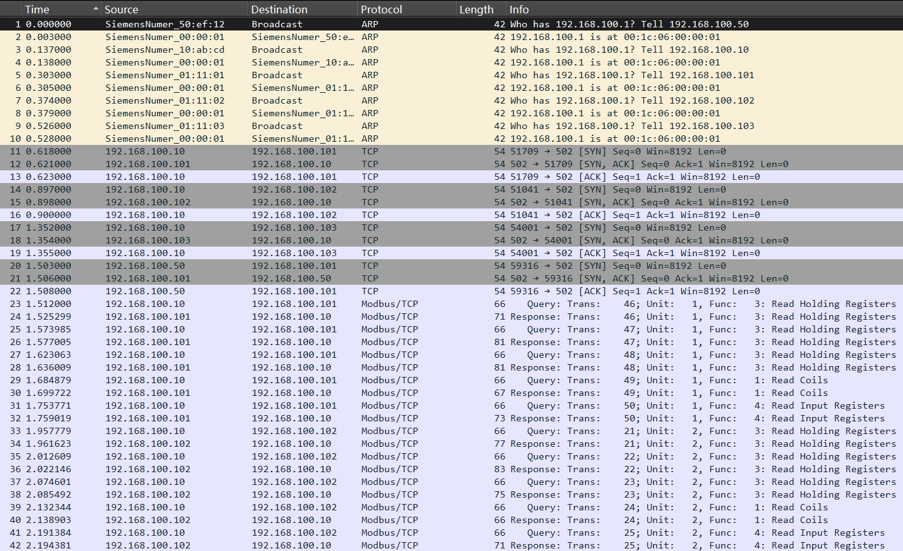
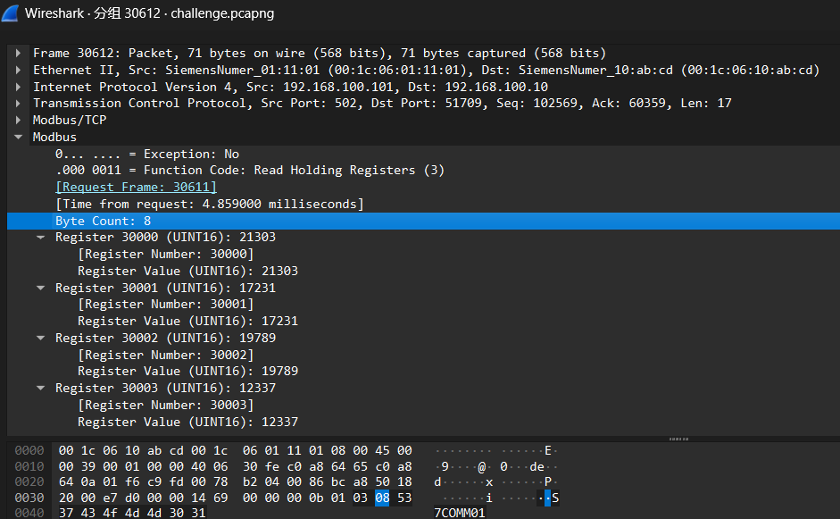
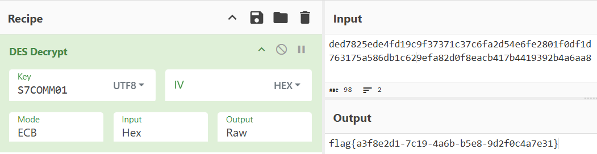
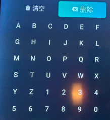
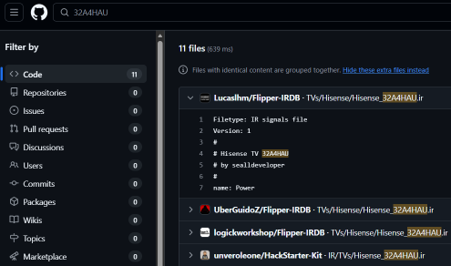
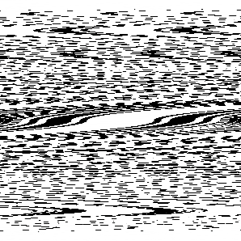
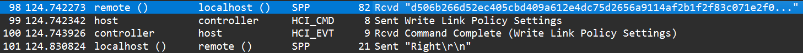
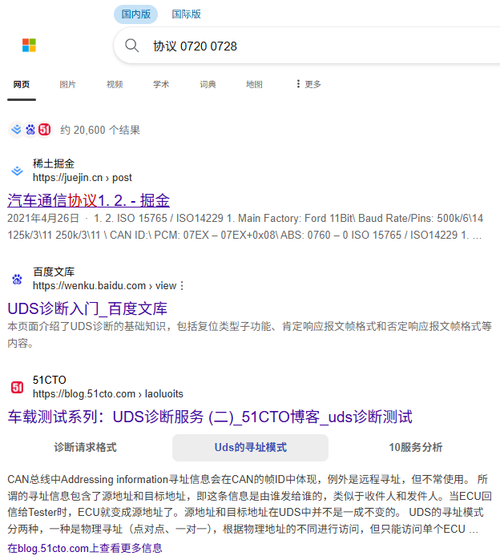
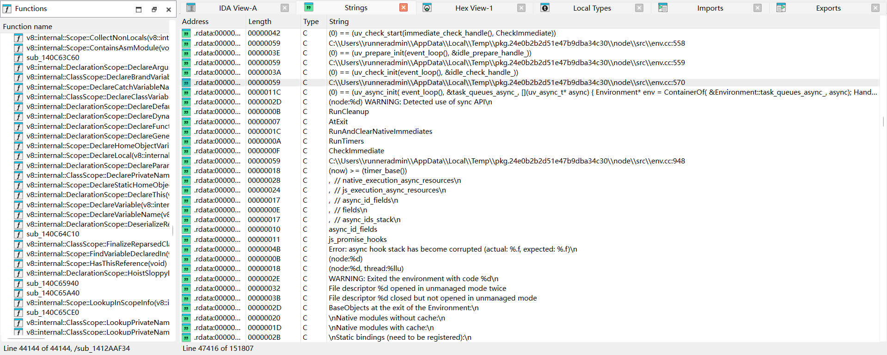
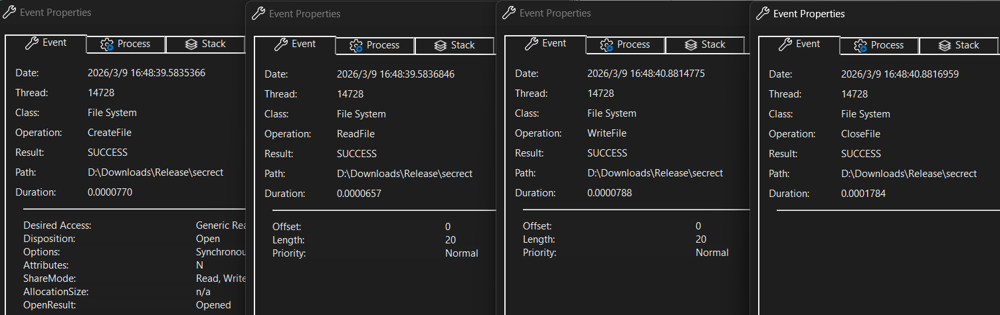

# DesCTF 2026 Writeup

周末不想学习于是自己报了个名，好玩捏

冲刺了一下 MISC 和 RE 题，都是 5 题解出 4 题，别的都没动（其实是不会）

<!-- more -->

题目大多数是赛后补的，赛时 8h 时间没办法解这么多题。下面的题目按照解出队伍数排序

忍住不用 Agent

---

## 🧩 MISC

### Neural Secrets

> 一位神秘的AI研究员在失踪前留下了一个模型检查点文件。情报显示，他一直在利用神经网络模型作为"死信箱"来传递机密信息。
>
> 我们成功获取了他最后的一个模型文件，你能找到其中隐藏的秘密吗？

下发了一个 `model.pth`，PyTorch 模型文件，于是在 Python 里面打开

```python
import torch
import numpy as np

# 加载 .pth 文件
data = torch.load('model.pth', map_location='cpu')
print(type(data))

# 输出：<class 'dict'>
```

经过深入调查（指让 LLM 写脚本把能输出的都输出一遍），Flag 被编码在了缓存矩阵 `cache` 中，大小为 `[39,64]`，每个 64 维向量可存储一个字符

具体地说：`embedding` 存储了每个字符的特征向量，而 `cache` 中的每个向量被设置为接近某个特定字符的特征

因此计算欧氏距离就可以把具体的字符求出，LLM 启动

```python title="exp.py"
import torch

# 加载模型文件
data = torch.load('model.pth', map_location='cpu')

# 获取嵌入层和缓存
embedding = data['model_state_dict']['embedding.weight']  # [95, 64]
cache = data['eval_cache']  # [39, 64]

# 创建字符映射
vocab = data['vocab']
idx_to_char = {idx: char for char, idx in vocab.items()}

# 对每个缓存向量找最接近的字符（使用欧氏距离）
decoded = []
for i in range(cache.shape[0]):
    distances = torch.norm(embedding - cache[i].unsqueeze(0), dim=1)
    char_idx = torch.argmin(distances).item()
    decoded.append(idx_to_char[char_idx])

# 输出flag
flag = ''.join(decoded)
print(flag)
```

得到 Flag：

```
DesCTF{n3ur4l_st3g0_1n_emb3dd1ng_sp4c3}
```

---

### wireshark

> Traffic revealed normal Modbus traffic plus "extra" communications—all protocol-compliant, evading firewall alerts. Attacker knows the protocol.

下发一个 `challenge.pcapng`，Wireshark 打开：



发现有大量的 Modbus/TCP 流量，STFW 了解其常用于工控协议数据。

> 插曲：如果对着流量文件直接 `strings`，会发现一个 `flag{this_is_fake_try_harder!}`
>
> 在 #30610 长度最大的 Modbus 包里也能看到这个
>
> ```bash
> ❯ strings challenge.pcapng | grep "flag"
> flag{this_is_fake_try_harder!}BB
> ```
>
> 还能发现另一个有趣的信息，很快就会提到

在分析到 Modbus/TCP 的 Func 8 诊断流量时，发现除了 `ECHO` `PING` `TEST` `LINK` 这四个测试单词以外，出现过下面四个非 ASCII 内容：

```
31213	de d7 82 5e de 4f d1 9c
31214	de d7 82 5e de 4f d1 9c
31215	9f 37 37 1c 37 c6 fa 2d
31216	9f 37 37 1c 37 c6 fa 2d
31217	54 e6 fe 28 01 f0 df 1d
31218	54 e6 fe 28 01 f0 df 1d
31219	76 31 75 a5 86 db 1c 62
31220	76 31 75 a5 86 db 1c 62
31221	9e fa 82 d0 f8 ea cb 41
31222	9e fa 82 d0 f8 ea cb 41
31223	7b 44 19 39 2b 4a 6a a8
31224	7b 44 19 39 2b 4a 6a a8
```

结合题干，可以推断这就是 "normal Modbus traffic plus "extra" communications" 的密文，那么如何解密呢？

经过深入挖掘，可以发现这个异常包：



其寄存器赋值恰好组成 `S7COMM01`，正好是 8 个字符，于是考虑这是一个 key

> 其实是在 `strings` 的时候看到这个神秘 key 的，这个 key 是紧跟在 `flag{this_is_fake_try_harder!}` 后面的，所以还比较容易发现

最后在 Cyberchef 上不断尝试，发现以下组合可以得到 Flag

> DesCTF 不试试 DES 算法？



虽然云里雾里的但还是得到 Flag 了

```
flag{a3f8e2d1-7c19-4a6b-b5e8-9d2f0c4a7e31}
```

---

### infrared_code

> 小卓意外捕获了一段来自智能电视遥控器的红外指令数据。经过初步分析，他发现这些看似正常的遥控操作中似乎隐藏着某种特殊的暗号信息。数据中混杂着大量操作，你能帮助小卓分析出电视中究竟留下了什么秘密暗号吗？
> 
> 提示：flag格式为flag{xxx}，flag中出现的字母均为小写。

下发了很多文件：

- 上面的题目描述 `题目描述.png`
- 一个具体的电视型号的手册 `manual-32A4HAU-Spec.pdf`
- 一个红外信号指令数据 `ir_challenge.txt`

```
protocol: NECext
type: parsed

address: 00 BF 00 00
command: 17 E8 00 00
address: 00 BF 00 00
command: 53 AC 00 00
address: 00 BF 00 00
command: CA 35 00 00
address: 00 BF 00 00
command: 55 AA 00 00
address: 00 BF 00 00
...
```

- 一张截图 `1.png`，我手动裁剪了一下，将关键要素放在这里：



其实拿到这道题，思路已经很明显了（这句话写出来怎么像 ChatGPT）：

- 将红外信号转化为具体的按键操作
- 在上面的键盘中模拟执行

第一步，由于提供了电视的具体型号，可以以 `32A4HAU` 为关键词在网上搜索。最后居然是在 Github 上找到的信号表



有了信号表就可以模拟键盘按下了。这里引出了这道题最难绷的点：上面那张图中的“清空”键和“删除”键是需要考虑的，否则得到的按键序列是有问题的（其实也有暗示了，图中的按钮起点在删除键，而不是自以为的左上角的 `A`）

写了个有点缺陷的脚本，应该是因为有边界回环机制，我没写，手动处理一下就好

```python title="exp.py"
import re

kb = "abcdefghijklmnopqrstuvwxyz1234567890"

moves = {
    "16 E9 00 00": (-1, 0), 	# Up
    "17 E8 00 00": ( 1, 0),  	# Down
    "19 E6 00 00": (0, -1), 	# Left
    "18 E7 00 00": (0,  1),   	# Right
}
ok_op = "15 EA 00 00"

def solve():
    # 起点在“删除键”按钮处
    r, c, res = -1, 3, ""
    with open("ir_challenge.txt", "r") as f:
        data = f.read()
        ops = re.findall(r"address: 00 BF 00 00\s+command: ([\dA-F ]+)", data)
        for op in ops:
            op = op.strip()
            if op == ok_op:
                if r == -1:
                    if 0 <= c <= 2:
                        res = ""
                    else:
                        res = res[:-1]
                else:
                    res += kb[r * 6 + c]
            elif op in moves:
                dr, dc = moves[op]
                r = max(-1, min(5, r + dr))
                c = max(0, min(5, c + dc))
                
    print(res)

if __name__ == "__main__":
    solve()
    
# 输出为 ekag1nfr4r3disfun，忽视最开头四个字母就好，应该是 flag
```

得到 Flag（Infrared is fun）

```
flag{1nfr4r3disfun}
```

---

### Real sign in?

> The picture for pixls, Please find the secret and send it to the WeChat official account background to get the flag!!

下发一个 `challenge.zip`，内容为 `challenge.png`。发现 `challenge.png` 进行了 ZipCrypto Store 加密，使用 `bkcrack` 进行已知明文攻击：

```
D:\CTFTools\MISC\bkcrack-1.8.1-win64>bkcrack.exe -C chal.zip -c challenge.png -p png_header.bin
bkcrack 1.8.1 - 2025-10-25
[23:55:43] Z reduction using 9 bytes of known plaintext
100.0 % (9 / 9)
[23:55:43] Attack on 712831 Z values at index 6
Keys: 5eb34ede c49019bf 815834b9
42.5 % (302681 / 712831)
Found a solution. Stopping.
You may resume the attack with the option: --continue-attack 302681
[23:59:30] Keys
5eb34ede c49019bf 815834b9

D:\CTFTools\MISC\bkcrack-1.8.1-win64>bkcrack.exe -C chal.zip -c challenge.png -k 5eb34ede c49019bf 815834b9 -d chal.png
bkcrack 1.8.1 - 2025-10-25
[00:44:43] Writing deciphered data chal.png
Wrote deciphered data (not compressed).
```

得到 `chal.png` 文件，binwalk 一下居然非常单纯：

```
❯ binwalk chal.png

DECIMAL       HEXADECIMAL     DESCRIPTION
--------------------------------------------------------------------------------
0             0x0             PNG image, 298 x 298, 8-bit/color RGB, non-interlaced
```

各种常见的隐写都没有收获（Zsteg 一把梭什么的），仔细观察一下图像，应该是一个二维码经过了某种置乱算法的处理（中间扭曲的部分像一个 QR Code 定位图案）



难道真的一点提示都没有吗？不妨回到最开始的 `challenge.zip` 文件 `binwalk` 一下：

```
❯ binwalk challenge.zip

DECIMAL       HEXADECIMAL     DESCRIPTION
--------------------------------------------------------------------------------
0             0x0             Zip archive data, encrypted at least v2.0 to extract, compressed size: 45939, uncompressed size: 45927, name: challenge.png
46077         0xB3FD          End of Zip archive, footer length: 22
46099         0xB413          7-zip archive data, version 0.3

❯ dd if=challenge.zip of=another.7z bs=1 skip=46099
258+0 records in
258+0 records out
258 bytes copied, 0.104523 s, 2.5 kB/s
```

嗯？还有个 7z 压缩包？提取出来，发现里面有一个 `tip.md`，内容是：

```title="tip.md"
R[37 116  72  99]                                [[37 116 236 107]
 [236   8 131 218]            -->                 [8  72  99 131]
 [107 219  75 254]                                [ 219 128 180  75]
 [128 180  75 230]]                               [218 254  75 230]]
```

提示表示的是一种方阵置换，具体地说，这是一种之字形变换：

```
37  → 116   72  → 99  
    ↙    ↗    ↙
236    8    131   218
 ↓  ↗    ↙    ↗  ↓
107   219   75    254
    ↙    ↗    ↙
128 → 180   75  → 230
```

这种置换方式叫做 Zigzag 置换，有了置换方式就好办了，如果见过 Zigzag 置换的话，其实 `challenge.png` 的置换特征挺明显的

写一个反向复原的脚本：

```python title="exp.py"
import numpy as np
from PIL import Image

def get_zigzag_coords(size):
    """生成 Zigzag 扫描的坐标序列"""
    coords = []
    for s in range(2 * size - 1):
        if s % 2 == 0:
            r, c = min(s, size - 1), s - min(s, size - 1)
            while r >= 0 and c < size:
                coords.append((r, c))
                r, c = r - 1, c + 1
        else:
            c, r = min(s, size - 1), s - min(s, size - 1)
            while c >= 0 and r < size:
                coords.append((r, c))
                r, c = r + 1, c - 1
    return coords

img = Image.open('chal.png').convert('L')
size = min(img.size)
img_array = np.array(img)[:size, :size]

flat_data = img_array.flatten()
restored = np.zeros((size, size), dtype=np.uint8)
coords = get_zigzag_coords(size)

for i, (r, c) in enumerate(coords):
    restored[r, c] = flat_data[i]

Image.fromarray(restored).save('chal_decrypted.png')
```


扫描结果为 `I_love_DesCTF`，发给比赛公众号得到 Flag：

```
DesCTF{Have fun and enjoy the challenges ahead!!!}
```

---

最后那个*张三的秘密*让我用百度网盘下 10GB 的数据，第一步就挑战失败了，因此取证题碰都没碰，倒是从题干能看出来是 Shamir 秘密分享，这个某选修课才学的

## 🔍 RE

### VINe

> 车厂推出的 Android 诊断 APK 会在用户输入 车架号 (VIN) 后与车机通过蓝牙交互。你拿到了：
>
> 1. 抓包文件 flow.pcapng
> 2. 对应的 APK 安装包 AutoDiag.apk 逆向分析 APK 与流量包，找出应用校验 VIN 时隐藏的密钥逻辑，解出正确的 VIN 提交格式：flag{VIN}

首先 Jadx 翻安装包，发现 `com.example.verifyVIN` 下有 `VinInputActivity` 关键函数：

```c#
// ...
System.loadLibrary("native-lib");
// ...

private void handleSubmit() {
    String strTrim = this.vinEditText.getText().toString().trim();
    if (strTrim.length() != 17) {
        Toast.makeText(this, "请输入17位VIN码", 0).show();
    } else if (!isBluetoothConnected()) {
        new AlertDialog.Builder(this).setTitle("蓝牙未连接").setMessage("请先连接蓝牙设备后再发送VIN码").setPositiveButton("连接蓝牙", new DialogInterface.OnClickListener() { // from class: com.example.verifyVIN.VinInputActivity$$ExternalSyntheticLambda12
            @Override // android.content.DialogInterface.OnClickListener
            public final void onClick(DialogInterface dialogInterface, int i) {
                this.f$0.m115lambda$handleSubmit$3$comexampleverifyVINVinInputActivity(dialogInterface, i);
            }
        }).setNegativeButton("取消", (DialogInterface.OnClickListener) null).show();
    } else {
        encryptAndSendVin(strTrim);
    }
}
```

考虑 VIN 经过加密后在 `flow.pcapng` 中有出现，于是 Wireshark 找到下面的内容：



获得加密后十六进制信息：`d506b266d52ec405cbd409a612e4dc75d2656a9114af2b1f2f83c071e2f0e2dd79dd`

接下来需要考虑加密逻辑，我们发现程序加载了 `native-lib` 共享库，因此 `apktool` 解包 APK 文件，用 IDA Pro 打开 `lib/arm64-v8a/libnative-lib.so`，发现几个常规内容以外的函数：

??? quote "`Java_com_example_verifyVIN_VinInputActivity_encrypt()`"

    ```c title="Java_com_example_verifyVIN_VinInputActivity_encrypt()"
    __int64 __fastcall Java_com_example_verifyVIN_VinInputActivity_encrypt(__int64 a1, __int64 a2, __int64 a3)
    {
        const char *v5; // x21
        size_t v6; // x0
        size_t v7; // x22
        char *v8; // x23
        __int64 v9; // x25
        unsigned __int64 v10; // x3
        _BYTE *v11; // x1
        __int64 v12; // x22
        unsigned __int8 v14; // [xsp+8h] [xbp-68h]
        _BYTE v15[15]; // [xsp+9h] [xbp-67h] BYREF
        void *v16; // [xsp+18h] [xbp-58h]
        unsigned __int8 v17[16]; // [xsp+20h] [xbp-50h] BYREF
        void *v18; // [xsp+30h] [xbp-40h]
        void *v19[3]; // [xsp+38h] [xbp-38h] BYREF
        _QWORD v20[2]; // [xsp+50h] [xbp-20h] BYREF
        void *v21; // [xsp+60h] [xbp-10h]
        __int64 v22; // [xsp+68h] [xbp-8h]
    
        v22 = *(_QWORD *)(_ReadStatusReg(TPIDR_EL0) + 40);
        v5 = (const char *)(*(__int64 (__fastcall **)(__int64, __int64, _QWORD))(*(_QWORD *)a1 + 1352LL))(a1, a3, 0);
        v6 = strlen(v5);
        if ( v6 >= 0xFFFFFFFFFFFFFFF0LL )
            sub_636A8(v20);
        v7 = v6;
        if ( v6 >= 0x17 )
        {
            v9 = v6 | 0xF;
            v8 = (char *)operator new((v6 | 0xF) + 1);
            v20[1] = v7;
            v21 = v8;
            v20[0] = v9 + 2;
            goto LABEL_6;
        }
        v8 = (char *)v20 + 1;
        LOBYTE(v20[0]) = 2 * v6;
        if ( v6 )
            LABEL_6:
        memmove(v8, v5, v7);
        v8[v7] = 0;
        __android_log_print(4, "NativeLib", "Encrypting input: %s", v5);
        strcpy((char *)v19, "\"MySecretKey123!@#");						// 这里硬编码了密钥 MySecretKey123!@#
        enhancedEncrypt((__int64)v20, (unsigned __int8 *)v19, v17);		// 这里调用了 enhancedEncrypt() 实际加密函数
        bytesToHex(v17);													// 转 Hex 输出
        if ( (v14 & 1) != 0 )
            v10 = *(_QWORD *)&v15[7];
        else
            v10 = (unsigned __int64)v14 >> 1;
        __android_log_print(4, "NativeLib", "Encryption successful, output length: %zu", v10);
        (*(void (__fastcall **)(__int64, __int64, const char *))(*(_QWORD *)a1 + 1360LL))(a1, a3, v5);
        if ( (v14 & 1) != 0 )
            v11 = v16;
        else
            v11 = v15;
        v12 = (*(__int64 (__fastcall **)(__int64, _BYTE *))(*(_QWORD *)a1 + 1336LL))(a1, v11);
        if ( (v14 & 1) != 0 )
            operator delete(v16);
        if ( (v17[0] & 1) != 0 )
            operator delete(v18);
        if ( ((__int64)v19[0] & 1) != 0 )
            operator delete(v19[2]);
        if ( (v20[0] & 1) != 0 )
            operator delete(v21);
        return v12;
    }
    ```

??? quote "`enhancedEncrypt()`"

    ```c title="enhancedEncrypt()"
    void __usercall enhancedEncrypt(__int64 a1@<X0>, unsigned __int8 *a2@<X1>, unsigned __int8 *a3@<X8>)
    {
        char *v6; // x8
        unsigned __int64 v7; // x8
        __int64 v8; // x1
        size_t v9; // x2
        void *v10; // x8
        unsigned __int64 v11; // x11
        __int64 v12; // x10
        bool v13; // w12
        unsigned __int64 v14; // x13
        unsigned __int64 v15; // x11
        unsigned __int8 *v16; // x13
        bool v17; // zf
        unsigned __int64 v18; // x12
        char *v19; // x10
        unsigned __int64 v20; // x13
        unsigned __int64 v21; // x14
        __int64 v22; // x13
        bool v23; // w12
        unsigned __int64 v24; // x11
        unsigned __int8 *v25; // x13
        unsigned __int64 v26; // x12
        char *v27; // x10
        unsigned __int64 v28; // x13
        unsigned __int64 v29; // x14
        __int64 v30; // x12
        bool v31; // w11
        unsigned __int64 v32; // x10
        unsigned __int8 *v33; // x13
        unsigned __int64 v34; // x11
        char *v35; // x12
        unsigned __int64 v36; // x11
        unsigned __int64 v37; // x12
        unsigned __int64 v38; // x13
        __int128 v39; // [xsp+0h] [xbp-50h] BYREF
        void *v40; // [xsp+10h] [xbp-40h]
        void *v41[3]; // [xsp+18h] [xbp-38h] BYREF
        __int128 v42; // [xsp+30h] [xbp-20h] BYREF
        char *v43; // [xsp+40h] [xbp-10h]
        __int64 v44; // [xsp+48h] [xbp-8h]
    
        v44 = *(_QWORD *)(_ReadStatusReg(TPIDR_EL0) + 40);
        if ( (*a2 & 1) != 0 )
        {
            sub_63638(&v42, *((_QWORD *)a2 + 2), *((_QWORD *)a2 + 1));
        }
        else
        {
            v6 = (char *)*((_QWORD *)a2 + 2);
            v42 = *(_OWORD *)a2;
            v43 = v6;
        }
        // 终止条件是长度超过 0xFF
        while ( (v42 & 1) == 0 || *((_QWORD *)&v42 + 1) <= 0xFFu )
        {
            v7 = *a2;
            if ( (v7 & 1) != 0 )
                v8 = *((_QWORD *)a2 + 2);
            else
                LODWORD(v8) = (_DWORD)a2 + 1;
            if ( (v7 & 1) != 0 )
                v9 = *((_QWORD *)a2 + 1);
            else
                v9 = v7 >> 1;
            // 这里在对原始密钥 MySecretKey123!@# 作自我拼接，确保长度足够之后的异或行为
            // 结果是 MySecretKey123!@#MySecretKey123!@#...，直到总长度超过 0xFF
            std::string::append((int)&v42, v8, v9);
        }
        strcpy((char *)v41, "\"AndroidNative2024");						// 这里将原始 VIN 前加上了 AndroidNative2024 盐值
        sub_630AC(&v39, v41, a1);
        if ( (v39 & 1) != 0 )
        {
            sub_63638(a3, v40, *((_QWORD *)&v39 + 1));
        }
        else
        {
            v10 = v40;
            *(_OWORD *)a3 = v39;
            *((_QWORD *)a3 + 2) = v10;
        }
        v11 = *a3;
        v12 = *((_QWORD *)a3 + 1);
        v13 = (v11 & 1) == 0;
        if ( (v11 & 1) != 0 )
            v14 = *((_QWORD *)a3 + 1);
        else
            v14 = v11 >> 1;
    
        // 接下来进行了三轮计算，不妨丢给 LLM 阅读
    
        // first
        if ( v14 )
        {
            v15 = 0;
            do
            {
                v16 = (unsigned __int8 *)*((_QWORD *)a3 + 2);
                v17 = !v13;
                v18 = (unsigned __int64)(unsigned __int8)v42 >> 1;
                if ( !v17 )
                    v16 = a3 + 1;
                v19 = v43;
                if ( (v42 & 1) != 0 )
                    v18 = *((_QWORD *)&v42 + 1);
                else
                    v19 = (char *)&v42 + 1;
                v16[v15] = (v19[v15 % v18] + v16[v15]) ^ (2 * v19[v15 % v18]);
                ++v15;
                v20 = *a3;
                v12 = *((_QWORD *)a3 + 1);
                if ( (v20 & 1) != 0 )
                    v21 = *((_QWORD *)a3 + 1);
                else
                    v21 = v20 >> 1;
                v13 = (v20 & 1) == 0;
            }
            while ( v15 < v21 );
            LODWORD(v11) = *a3;
        }
        if ( (v11 & 1) != 0 )
            v22 = v12;
        else
            v22 = (unsigned int)v11 >> 1;
        v23 = (v11 & 1) == 0;
    
        // second
        if ( v22 )
        {
            v24 = 0;
            do
            {
                v25 = (unsigned __int8 *)*((_QWORD *)a3 + 2);
                v17 = !v23;
                v26 = (unsigned __int64)(unsigned __int8)v42 >> 1;
                if ( !v17 )
                    v25 = a3 + 1;
                v27 = v43;
                if ( (v42 & 1) != 0 )
                    v26 = *((_QWORD *)&v42 + 1);
                else
                    v27 = (char *)&v42 + 1;
                v25[v24] = ((v27[v24 % v26] + v25[v24]) ^ (2 * v27[v24 % v26])) + 1;
                ++v24;
                v28 = *a3;
                v12 = *((_QWORD *)a3 + 1);
                if ( (v28 & 1) != 0 )
                    v29 = *((_QWORD *)a3 + 1);
                else
                    v29 = v28 >> 1;
                v23 = (v28 & 1) == 0;
            }
            while ( v24 < v29 );
            LODWORD(v11) = *a3;
        }
        v30 = (unsigned int)v11 >> 1;
        v31 = (v11 & 1) == 0;
        if ( v31 )
            v12 = v30;
    
        // third
        if ( v12 )
        {
            v32 = 0;
            do
            {
                v33 = (unsigned __int8 *)*((_QWORD *)a3 + 2);
                v17 = !v31;
                v34 = (unsigned __int64)(unsigned __int8)v42 >> 1;
                if ( !v17 )
                    v33 = a3 + 1;
                v35 = v43;
                if ( (v42 & 1) != 0 )
                    v34 = *((_QWORD *)&v42 + 1);
                else
                    v35 = (char *)&v42 + 1;
                v33[v32] = ((v35[v32 % v34] + v33[v32]) ^ (2 * v35[v32 % v34])) + 2;
                ++v32;
                v36 = *a3;
                v37 = *((_QWORD *)a3 + 1);
                v38 = v36 >> 1;
                v31 = (v36 & 1) == 0;
                if ( v31 )
                    v37 = v38;
            }
            while ( v32 < v37 );
        }
        if ( (v39 & 1) != 0 )
        {
            operator delete(v40);
            if ( ((__int64)v41[0] & 1) == 0 )
            {
                LABEL_60:
                if ( (v42 & 1) == 0 )
                    return;
                goto LABEL_61;
            }
        }
        else if ( ((__int64)v41[0] & 1) == 0 )
        {
            goto LABEL_60;
        }
        operator delete(v41[2]);
        if ( (v42 & 1) == 0 )
            return;
        LABEL_61:
        operator delete(v43);
    }
    ```

完整的加密逻辑：

1. 对 `MySecretKey123!@#` 原始密钥进行自我拼接，直到长度超过 0xFF
2. 对原始 VIN 添加前缀 `AndroidNative2024`，作为明文参加后续计算
3. 设 `P[i]` 为索引 `i` 处的明文字符，`K[i]` 为索引 `i` 处的扩展后密钥字符，进行三轮计算：
    1. `P[i] = (K[i] + P[i]) ^ (2 * K[i])`
    2. `P[i] = (K[i] + P[i]) ^ (2 * K[i]) + 1`
    3. `P[i] = (K[i] + P[i]) ^ (2 * K[i]) + 2`

异或操作是可逆的，因此这里给出解密脚本：

```python title="exp.py"
key = b"MySecretKey123!@#"
cipher = bytes.fromhex("d506b266d52ec405cbd409a612e4dc75d2656a9114af2b1f2f83c071e2f0e2dd79dd")
plain = []

for i, byte in enumerate(cipher):
    k = key[i % len(key)]
    v = ((byte - 2) ^ (2 * k)) - k
    v = (((v & 0xFF) - 1) ^ (2 * k)) - k
    v = ((v & 0xFF) ^ (2 * k)) - k
    plain.append(v & 0xFF)

print("".join(map(chr, plain)))

# AndroidNative202412345678901234567
```

删掉前缀，加上 `flag{}`，获得 Flag：

```
 flag{12345678901234567}
```

---

### ez_can

> 小🐯在做汽车黑客的时候突然收到了群友小m发来的不知名程序，并告诉他：“小🐯，快看看这段报文，看看能不能解开！”

下发一个 AARCH64 架构的 ELF 文件（明摆着不想让我动态运行），采用 UPX (4.22) 打包，以及一个 `tr.log` 文件：

```asm title="tr.log"
;          ID (hex)
;          |     Data Length
;          |     |   Data Bytes (hex) ...
;          |     |   |
;	   ----+---  +  -+ -- -- -- -- -- -- --
Rx         0720  8  02 10 03 55 55 55 55 55 
Rx         0728  8  06 50 03 00 32 01 F4 AA 
Rx         0720  8  02 27 07 55 55 55 55 55 
Rx         0728  8  10 12 67 07 54 42 0f a5 
Rx         0720  8  30 00 05 55 55 55 55 55
Rx         0728  8  21 58 c8 b7 a6 cc 8c 8c
Rx         0728  8  22 dc 8f 56 6e 69 AA AA
```

STFW 一下发现是汽车通信协议相关日志（UDS），代入 ISO-TP 多帧传输协议，可以提取出实际的十六字节密文：

```
54 42 0F A5 58 C8 B7 A6 CC 8C 8C DC 8F 56 6E 69
```

??? quote "确实挺好搜的"

    

先记下这部分密文，继续探索 ELF 文件：

首先 `upx -d ctst` 脱壳，发现程序是 C 程序编写。用 IDA Pro 打开，一顿分析，发现是标准 AES-256 加密，并且加密密钥硬编码：

```asm
xmmword_25E0 = 4A F1 09 B2 7C 3D E8 15 99 22 6F AA 03 D4 8B 5E
xmmword_25F0 = C7 10 55 3A FE 91 2C 68 0B DF 84 73 1E A5 46 90
# 拼接后得到 key
```

考虑 `tr.log` 里传输的就是密文，给出解密脚本

```python title="exp.py"
from Crypto.Cipher import AES

key = bytes.fromhex('4AF109B27C3DE81599226FAA03D48B5EC710553AFE912C680BDF84731EA54690')

ciphertext = bytes.fromhex('54420FA558C8B7A6CC8C8CDC8F566E69')

cipher = AES.new(key, AES.MODE_ECB)

flag = cipher.decrypt(ciphertext)

print(f'flag{{{flag.decode("ascii", errors="ignore")}}}')
```

得到一个看上去完全不像 Flag 的 Flag：

```
flag{7b9m2x8p4k1n5a3c}
```

---

### nbyte

> *没有备注*

下发一个 `nbyte.exe`，程序要求输入一个 Flag（`Please input flag:`），如果 Flag 正确返回 `success!`，否则返回 `fail!`

首先 IDA Pro 启动，搜索字符串 `Please input flag:` 发现找不到，继续探索发现毫无头绪。字符串里能看到很多文本内容，可以肯定是一个 JavaScript 程序打包，而且打包了一堆用不到的 package



仔细一看，这是将 JavaScript 程序进行 V8 Bytecode 转化为二进制程序，最后用 `pkg` 打包上传得到的 .exe 文件（DIE 也给出了结果）

```
打包工具: pkg
格式: JavaScript Compiled/Bytenode (.JSC)
```

于是用 `pkg-unpacker` 进行解包得到 `a_en.js`，然后用 `View8` 尝试反编译为高级语言代码，注意必须手动指定 `10.2.154.26.exe`

```cmd
D:\CTFTools\RE\pkg-unpacker> npm start -- -i "D:\Downloads\nbyte\nbyte.exe" -o "D:\Downloads\nbyte\nbyte.unpacked"

> pkg-unpacker@2.1.0 start
> node dist/main.js -i D:\Downloads\nbyte\nbyte.exe -o D:\Downloads\nbyte\nbyte.unpacked

Detected compression: NONE
Detected entrypoint: C:\\snapshot\\nodejsc\\a_en.js
Unpacking your binary, 3 elements to go...
Binary unpacked to D:\Downloads\nbyte\nbyte.unpacked!

D:\CTFTools\RE\View8> python view8.py a_en.js b.js -p "D:\CTFTools\RE\View8\Bin\10.2.154.26.exe"
Executing disassembler binary: D:\CTFTools\RE\View8\Bin\10.2.154.26.exe.
Disassembly completed successfully.
Parsing disassembled file.
Parsing completed successfully.
Decompiling 11 functions.
Exporting to file b.js.
Done.
```

然后就可以看到一个依旧非常逆天但至少可读的程序了：

??? abstract "折叠一下"

    ```javascript
    function func_unknown()
    {
        r0 = func_unknown_000001C7C175DD69
        return func_unknown_000001C7C175DD69
    }
    function func_unknown_000001C7C175DD69(a0, a1, a2, a3, a4)
    {
        r1 = Scope[0]
        Scope[1][2] = null
        Scope[1][3] = null
        Scope[1][4] = null
        Scope[1][5] = func__0x27903a_000001C7C175E0F1
        Scope[1][6] = func__0x3ecf0b_000001C7C175ECC9
        Scope[1][7] = null
        Scope[1][8] = func__0x548347_000001C7C175F249
        Scope[1][9] = null
        Scope[1][2] = new ["join", "createCipheriv", "update", "question", "final", "e53a995f2fa2411cba177945910ffbb9a92e7d4854ebf7a2b1d8ef8837be6d3e528696970fe3fac834f4bb8e690f8e005fff9e126dfdccb1c6a966a2dd9bf768", "repeat", "fail!", "substr", "createInterface", "log", "aes-256-cbc", "readline", "stdin", "utf8", "success!", "fromCharCode", "\nerror:", "replace", "stdout", "toString", "push", "close", "Zl1TP8Kq8UB7a8Ej", "from", "charCodeAt", "crypto", "alloc", "Please input flag:", "length", "qLUOF+GnQzlMmIq4JpLaQOTgp5oxYwZ4"]
        ACCU = func_unknown_000001C7C175E8A1(Scope[1][2], 424)
        Scope[1][3] = func__0x5270_000001C7C175EBA1
        r3 = Scope[1][3]("0x5")
        Scope[1][4] = a1(r3)
        Scope[1][7] = Scope[1][3]("0xf")
        r4 = Scope[1][3]("0x16")
        r3 = a1(r4)
        r2 = r3[Scope[1][3]("0x13")]
        r4 = new {"input": null, "output": null}
        r4["input"] = "process"[Scope[1][3]("0x17")]
        r4["output"] = "process"[Scope[1][3]("0x1d")]
        Scope[1][9] = r2(r4)
        ACCU = func__0x39d571_000001C7C175F5F1()
        return undefined
    }
    function func__0x5270_000001C7C175EBA1(a0, a1)
    {
        a0 = (a0 - 0)
        r0 = Scope[1][2][a0]
        return Scope[1][2][a0]
    }
    function func_unknown_000001C7C175E8A1(a0, a1)
    {
        r1 = Scope[1]
        Scope[2][2] = a0
        a1 = (a1 + 1)
        ACCU = func__0x527044_000001C7C175E9D1(a1)
        return undefined
    }
    function func__0x527044_000001C7C175E9D1(a0)
    {
        while (true)
        {
            ACCU = (a0 - 1)
            a0 = (a0 - 1)
            if (!ACCU) break
            r2 = Scope[2][2]["shift"]()
            ACCU = Scope[2][2]["push"](r2)
        }
        return undefined
    }
    function func__0x39d571_000001C7C175F5F1()
    {
        r0 = Scope[1][9][Scope[1][3]("0xd")]
        r2 = Scope[1][3]("0x7")
        ACCU = r0(r2, func_unknown_000001C7C175F6F9)
        return undefined
    }
    function func_unknown_00000z1C7C175F6F9(a0)
    {
        ACCU = Scope[1][8](a0)
        r0 = Scope[1][9][Scope[1][3]("0x1")]
        ACCU = r0()
        return undefined
    }
    function func__0x548347_000001C7C175F249(a0)
    {
        r4 = <context>
        try
        {
            r0 = Scope[1][3]("0x2")
            r1 = Scope[1][5](r0, a0)
            r2 = Scope[1][3]("0x9")
            r3 = Scope[1][6](r2, r1)
            if (r3 === Scope[1][7])
            {
                r7 = Scope[1][3]("0x19")
                ACCU = "console"["log"](r7)
                return !(!Boolean([]))
            }
            r5 = "console"[Scope[1][3]("0x14")]
            r7 = Scope[1][3]("0x11")
            ACCU = r5(r7)
            return !Boolean([])
        }
        catch {}
        r5 = ACCU
        ACCU = null
        r5 = Scope[1]
        r6 = "console"[Scope[1][3]("0x14")]
        r8 = Scope[1][3]("0x1b")
        ACCU = r6(r8, Scope[3][2]["message"])
        return !Boolean([])
    }
    function func__0x3ecf0b_000001C7C175ECC9(a0, a1)
    {
        if (!a1)
        {
            return ""
        }
        r0 = (4 - (a1[Scope[1][3]("0x8")] % 4))
        if (r0 < 4)
        {
            r9 = "String"[Scope[1][3]("0x1a")]
            r9 = r9(r0)
            r8 = r9[Scope[1][3]("0x10")]
            r7 = a1
            a1 = (a1 + r8(r0))
        }
        r1 = []
        r6 = 0
        while (true)
        {
            if (!r6 < a1[Scope[1][3]("0x8")]) break
            r7 = r1[Scope[1][3]("0x0")]
            r9 = a1[Scope[1][3]("0x12")]
            r9 = r9(r6, 4)
            ACCU = r7(r9)
            r6 = (r6 + 4)
        }
        ACCU = r1["reverse"]()
        r7 = r1[Scope[1][3]("0xa")]
        a1 = r7("")
        r7 = "Buffer"[Scope[1][3]("0x6")]
        r2 = r7(32)
        r8 = "Buffer"["from"](a0)
        ACCU = r8["copy"](r2)
        r7 = Scope[1][4][Scope[1][3]("0xb")]
        r9 = Scope[1][3]("0x15")
        r10 = r2
        r4 = r7(r9, r10, "0000000000000000")
        r7 = r4[Scope[1][3]("0xc")]
        r10 = Scope[1][3]("0x18")
        r8 = r4
        r9 = a1
        r5 = r7(r9, r10, "hex")
        r8 = r4[Scope[1][3]("0xe")]
        ACCU = (r5 + r8("hex"))
        r7 = r5
        r5 = (r5 + r8("hex"))
        return ACCU
    }
    function func__0x27903a_000001C7C175E0F1(a0, a1)
    {
        r0 = []
        r7 = 0
        while (true)
        {
            if (!r7 < 256) break
            r0[r7] = r7
            r7 = (r7 + 1)
        }
        r1 = 0
        r6 = 0
        while (true)
        {
            if (!r6 < 256) break
            r8 = (r1 + r0[r6])
            r12 = "0x4"
            r9 = a0[Scope[1][3]("0x4")]
            r13 = Scope[1][3]
            r11 = (r6 % a0[Scope[1][3]("0x8")])
            r1 = ((r8 + r9(r11)) % 256)
            r9 = new [0, 0]
            r9[0] = r0[r1]
            r9[1] = r0[r6]
            r8 = r9
            r10 = GetIterator(r9)
            ACCU = false
            r11 = false
            r14 = <context>
            try
            {
                r16 = r0
                r17 = r6
                if (!false)
                r11 = true
                r15 = r10["next"]()
                ACCU = r15["done"]
                    && (!r15["done"])
                {
                    r11 = false
                    ACCU = r15["value"]
                }
                else
                {
                    r16[r17] = undefined
                    r18 = r0
                    r19 = r1
                    if (!r11)
                    r11 = true
                    r15 = r10["next"]()
                        && (!r15["done"])
                    {
                        r11 = false
                        ACCU = r15["value"]
                    }
                    else
                    {
                        r18[r19] = undefined
                        r13 = -1
                        r12 = -1
                    }
                }
            }
            catch
            {
                r13 = ACCU
                r12 = 0
            }
            if (!r11)
            {
                r20 = <context>
                try
                {
                    if (!r10["return"] == undefined)
                    {
                        ACCU = r10["return"]()
                    }
                    catch {}
                }
            }
            ACCU = null
            if (!r12 === 0) continue
            ACCU = r13
            r6 = (r6 + 1)
        }
        r2 = 0
        r1 = 0
        r3 = ""
        r4 = 0
        while (true)
        {
            if (!r4 < a1[Scope[1][3]("0x8")]) break
            r2 = ((r2 + 1) % 256)
            r1 = ((r1 + r0[r2]) % 256)
            r9 = new [0, 0]
            r9[0] = r0[r1]
            r9[1] = r0[r2]
            r8 = r9
            r10 = GetIterator(r9)
            ACCU = false
            r11 = false
            r14 = <context>
            try
            {
                r16 = r0
                r17 = r2
                if (!false)
                r11 = true
                r15 = r10["next"]()
                ACCU = r15["done"]
                    && (!r15["done"])
                {
                    r11 = false
                    ACCU = r15["value"]
                }
                else
                {
                    r16[r17] = undefined
                    r18 = r0
                    r19 = r1
                    if (!r11)
                    r11 = true
                    r15 = r10["next"]()
                        && (!r15["done"])
                    {
                        r11 = false
                        ACCU = r15["value"]
                    }
                    else
                    {
                        r18[r19] = undefined
                        r13 = -1
                        r12 = -1
                    }
                }
            }
            catch
            {
                r13 = ACCU
                r12 = 0
            }
            if (!r11)
            {
                r20 = <context>
                try
                {
                    if (!r10["return"] == undefined)
                    {
                        ACCU = r10["return"]()
                    }
                    catch {}
                }
            }
            ACCU = null
            if (r12 === 0)
            {
                ACCU = r13
            }
            r8 = r0[r2]
            r5 = ((r8 + r0[r1]) % 256)
            r9 = "String"[Scope[1][3]("0x1a")]
            r11 = a1[Scope[1][3]("0x4")]
            r11 = r11(r4)
            r11 = (r11 ^ r0[r5])
            r8 = r3
            r3 = (r3 + r9(r11))
            r4 = (r4 + 1)
        }
        r8 = r3[Scope[1][3]("0x1c")]
        r10 = \"[a-zA-Z]"\
        return r8(r10, func_unknown_000001C7C175E5A9)
    }
    function func_unknown_000001C7C175E5A9(a0)
    {
        ACCU = a0 <= "Z"
        if (a0 <= "Z")
        {
            ACCU = 65
        }
        else
        {
            ACCU = 97
        }
        r0 = ACCU
        r3 = a0[Scope[1][3]("0x4")]
        r3 = r3(0)
        r3 = (((r3 - r0) + 15) % 26)
        r3 = (r3 + r0)
        return "String"["fromCharCode"](r3)
    }
    ```

又是字符串池打乱又是寄存器级操作的，直接丢给 LLM 抽奖，然后得到逻辑：

1. 对输入进行 RC4 加密，`key = "Zl1TP8Kq8UB7a8Ej"`
2. 对上一步原始字节流中的大小写字母凯撒移位，`offset = +15`
3. 对上述字符串进行 4 Bytes padding，然后每 4 字符一组，整体反转分组顺序：
```python
let len = s.length
let pad = 4 - (len % 4)  # 计算需要填充的字节数
if (pad < 4) {
    # 填充 pad 个 ASCII 码为 pad 的字符
    s += String.fromCharCode(pad).repeat(pad)
}

let groups = []
for (let i = 0; i < s.length; i += 4) {
    groups.push(s.substr(i, 4))
}
groups.reverse()
let grouped = groups.join('')
```

4. 进行 AES-256-CBC 加密，`aes_key = "qLUOF+GnQzlMmIq4JpLaQOTgp5oxYwZ4"`，`iv = "0000000000000000"`

5. 以 Hex 方式输出，与 `e = e53a995f2fa2411cba177945910ffbb9a92e7d4854ebf7a2b1d8ef8837be6d3e528696970fe3fac834f4bb8e690f8e005fff9e126dfdccb1c6a966a2dd9bf768` 进行比对，如果比对一致返回 `success!`

相对应的能够给出逆向解密脚本：

```python title="exp.py"
import binascii
from Crypto.Cipher import AES, ARC4

def caesar_reverse(s, shift=15):
    return ''.join(
        chr((ord(c)-65-shift)%26+65) if 'A'<=c<='Z' else
        chr((ord(c)-97-shift)%26+97) if 'a'<=c<='z' else c
        for c in s
    )

hex_cipher = "e53a995f2fa2411cba177945910ffbb9a92e7d4854ebf7a2b1d8ef8837be6d3e528696970fe3fac834f4bb8e690f8e005fff9e126dfdccb1c6a966a2dd9bf768"

# AES-256-CBC 解密
ciphertext = binascii.unhexlify(hex_cipher)
aes_key = b"qLUOF+GnQzlMmIq4JpLaQOTgp5oxYwZ4"
iv = b'0'*16
data = AES.new(aes_key, AES.MODE_CBC, iv).decrypt(ciphertext)

# 去除 PKCS#7 填充
data = data[:-data[-1]]

# 反转 4 字符分组
s3 = data.decode('utf-8')
s2 = ''.join([s3[i:i+4] for i in range(0, len(s3), 4)][::-1])

# 去除 pad 填充
pad = ord(s2[-1])
if 1 <= pad <= 3 and s2.endswith(s2[-1]*pad):
    s2 = s2[:-pad]

# 凯撒逆变换
s1 = caesar_reverse(s2)

# RC4 解密
rc4_key = b"Zl1TP8Kq8UB7a8Ej"
flag_bytes = ARC4.new(rc4_key).decrypt(s1.encode('latin-1'))

# 输出 flag
flag = flag_bytes.decode('utf-8')
print(flag)
```

执行 `exp.py` 得到 Flag

```
flag{nodejs_pkg_v8bytecode_challenge}
```

---

### Easy_Ransom

> 某企业突然遭受到了勒索组织的攻击，其中最重要的 secrect 密钥文件被黑客进行了加密，你能帮他解开嘛？

下发文件 `babyre1.exe` 和 `secrect.enc`，核心逻辑应该是逆向 exe 文件的加密过程用 `secrect.enc` 作为密文解密

先 DIE 看一下 exe 程序：

```
PE64
    操作系统: Windows(Vista)[AMD64, 64 位, 控制台]
    链接程序: Microsoft Linker(14.29.30154)
    编译器: Microsoft Visual C/C++(19.29.30154)[LTCG/C]
    语言: C
    库: Microsoft C/C++ Runtime[dynamic]
    工具: Visual Studio(2019, v16.11)
    保护器: Themida/Winlicense(3.XX)
    (Heur)保护: Generic[Strange sections]
    (Heur)打包工具: Compressed or packed data[Last section EP + Sections like Themida (v3.X) + Section names repeating + High entropy + Section 0 ("        ") compressed]
```

Themida 壳，要么脱壳，要么 ScyllaHide 附加动态调试。后者发现依旧能被检测到 Debugger 而退出。用 unlicense 将源程序提取出来，绕过对 Debugger 和 Monitor 的检测

脱壳后的程序双击运行后立刻退出，没有交互，考虑需要手动提供输入（文件输入？命令行参数？），静态分析和动态调试程序并没有发现程序需要什么输入才能有对应的输出（太菜了），搜字符串能看到 `fopen` `fread` 等函数标签，于是猜测是同级文件夹内的文件读写

突发奇想，用 Process Monitor 对进程监控，有了收获（下图是创建了随机文本文件 `secrect` 的结果，否则在第一步 `NAME_NOT_FOUND`）：



程序检测同级文件夹下是否存在 `secrect` 文件，并且是否有内容，如果有就执行加密算法对内容加密，重命名为 `secrect.enc` 输出；手动文件输入和命令行参数都没有作用

在 string 搜索时还注意到，存在硬编码字符串：

```
________:00007FF763471280	00000020	C	expand 32-byte kexpand 16-byte k
```

这直接指代了 Salsa20 / ChaCha 流加密算法（上面的硬编码字符串是该加密算法中的一个固定常量），对该算法加密的密文解密需要 `key` `nonce` `Counter`，但是脱壳后的程序依旧由于惊人的混淆体量导致短时间内无法分离主逻辑。

注意到 Salsa20 / ChaCha 流加密算法是完全的对称算法，使用相同的 `key` `nonce` `Counter` 输入明文得到密文，输入密文会重新得到明文，而 RE 题不可能会对这些必要的加密参数随机化，于是大胆猜测：将题目中下发的 `secrect.enc` 密文重命名为 `secrect`，运行一遍 `babyre1.exe` 程序，就能重新解密为原文

经尝试发现猜测真的是对的（那我翻源代码翻那么长时间是为了什么），得到解密后内容：

```
ZmxhZ3tiMDU0YmRkZDI0OTA0ZWYyOGU1OGFjNGZhZTk5MjlkM30=
```

Base64 一下得到 Flag：

```
flag{b054bddd24904ef28e58ac4fae9929d3}
```

!!! quote ""

    也就是说理论上不对 exe 文件进行任何处理就能解出这道题，0mg
    
    其实还是要分析一下的，不然不知道程序如何进行输入
    
    如果这题的可执行程序换个冷门架构难度会大不少

---

最后一个 Devil 看不懂，题目核心应该是白盒魔改 AES 加密，不会，遂放弃

## Appendix

比上次 DASCTF 的解题成果强 10 倍甚至 9 倍
