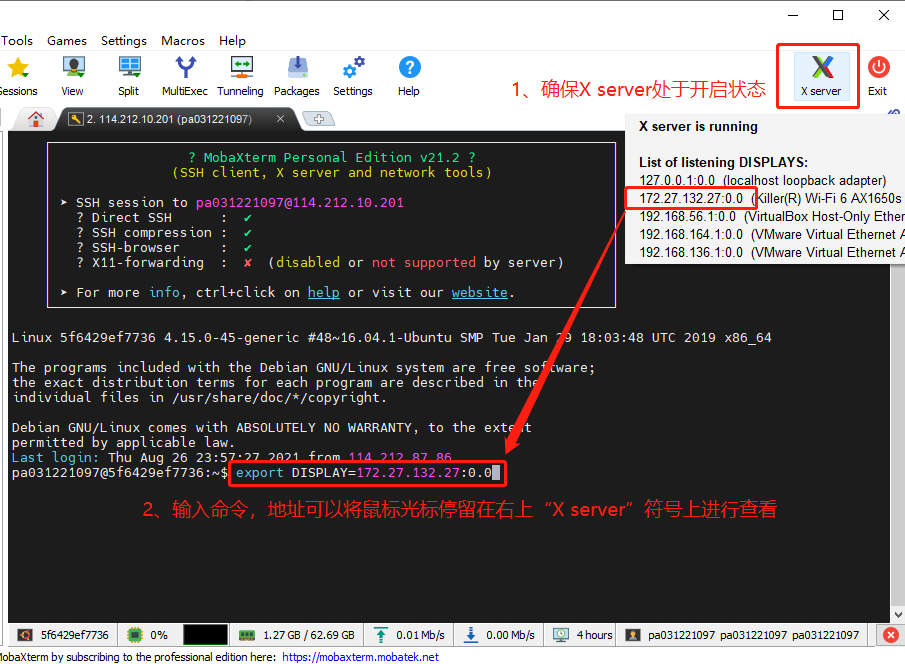
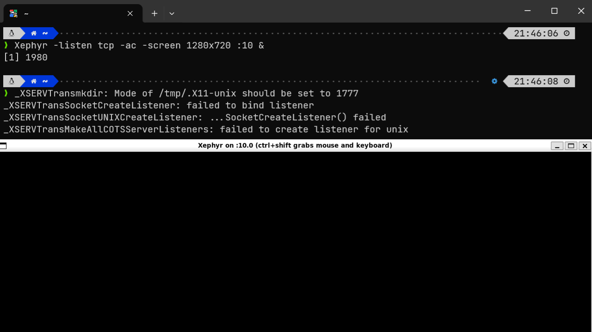
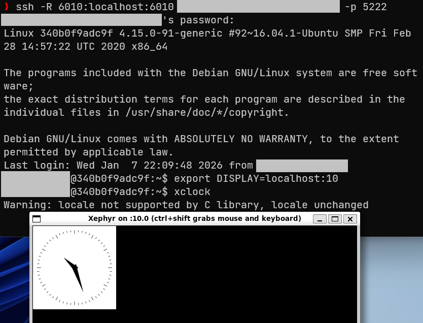
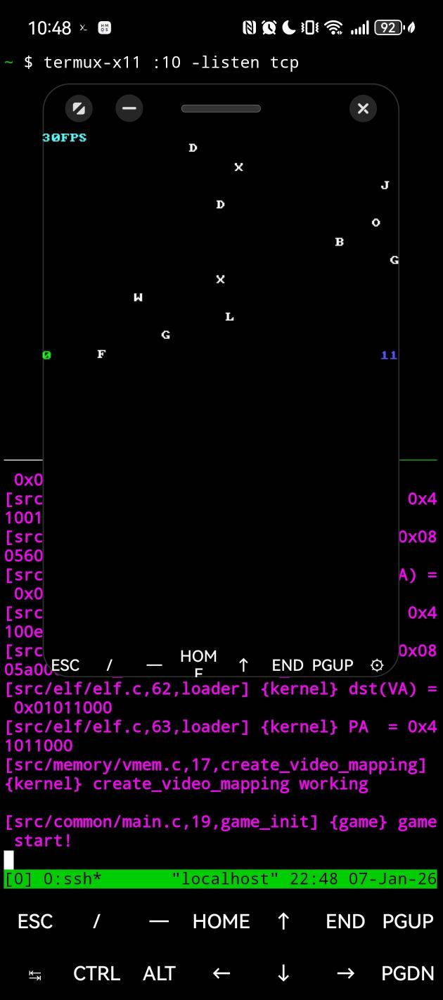

# 使用本地 X server 实现 Docker 下的远程 X11 图形界面转发

起因是某课程大作业提供的远程服务器不能使用 ssh -X 进行 X11-Forwarding，而课程手册给出的解决方案是使用 Windows 端的 MobaXterm，于是便有了下面的 Linux 端解决方案

<!-- more -->

## Intro

这里先给出课程大作业手册中提到的转发图形界面的方案：

> 通过 MobaXterm SSH 连接远程服务器，勾选 X11-Forwarding，连接到远程服务器后设置 DISPLAY 变量，命令行输入 `xclock` 测试转发效果（图源手册）



手册中还提到：*目前我们只能通过Windows客户端的测试，如果是Linux客户端，还需要摸索一下。*这就很神秘了，并且事实说明，在 Linux 端使用 ssh -X 进行连接，确实无法实现 X11 转发

```bash title="Using Kali-Linux (WSL2)" hl_lines="3 4"
❯ ssh -X -p xxxx paxxxxxxxxx@xxx.xxx.xx.xxx
paxxxxxxxxx@xxx.xxx.xx.xxx's password:
Warning: No xauth data; using fake authentication data for X11 forwarding.
X11 forwarding request failed on channel 0
Linux 340b0f9adc9f 4.15.0-91-generic #92~16.04.1-Ubuntu SMP Fri Feb 28 14:57:22 UTC 2020 x86_64

The programs included with the Debian GNU/Linux system are free software;
the exact distribution terms for each program are described in the
individual files in /usr/share/doc/*/copyright.

Debian GNU/Linux comes with ABSOLUTELY NO WARRANTY, to the extent
permitted by applicable law.
Last login: Wed Jan  7 19:40:20 2026 from xxx.xx.xxx.xxx
paxxxxxxxxx@340b0f9adc9f:~$ echo $DISPLAY
# empty
paxxxxxxxxx@340b0f9adc9f:~$
```

如果自己搭建一个完整的 X11 服务，并且在 `sshd_config` 中设置 X11 相关服务为 `True`，那么 `DISPLAY` 的值应该是自动设置好的，而不是像上面的输出一样，`DISPLAY` 为空，这就和常规的 X11 服务不一样了

对于以上的 X11 转发配置问题，先从服务器的配置开始分析


## Search

我们没有远程服务器的多数权限（无法 `sudo`；无法操作 ~ 根目录）

先 `#!bash cat /etc/ssh/sshd_config` 一下看看 ssh 服务端的配置是怎样的：

```title="sshd_config"
X11Forwarding yes
X11DisplayOffset 10
X11UseLocalhost yes
```

非常正常，然而使用 `ssh -X`（以及 `ssh -Y`）的结果依旧是：

```
Warning: No xauth data; using fake authentication data for X11 forwarding.
X11 forwarding request failed on channel 0
```

---

注意到警告信息是 `No xauth data`，发现 xauth 在服务器中存在，但是在 `ssh` 连接期间并没有被使用过

```title="xauth check"
paxxxxxxxxx@340b0f9adc9f:~$ which xauth
/usr/bin/xauth
paxxxxxxxxx@340b0f9adc9f:~$ xauth list
xauth:  timeout in locking authority file /home/paxxxxxxxxx/.Xauthority
```

因此可以简单推测：`sshd` 因为 xauth 的相关问题无法建立 X11 连接

---

另外注意到：`340b0f9adc9f` 这个主机名字非常的 Docker，验证一下

```bash
paxxxxxxxxx@340b0f9adc9f:~$ grep docker /proc/1/cgroup
12:memory:/docker/340b0f9adc9ff6e1d9e279ea2f12b262209f7882d0919590aadfb2dc606750e0
# ... ...
```

可以确定 PA 提供的环境是 Docker

---

### Reason for "X11-forwarding failed"

!!! warning "下面的推测仅供参考，我没有那个实力（以及容器权限）去深入分析更加正确的原因"

由于 Docker 的容器隔离， `xauth` 无法访问管理 X server cookie 文件（体现在 `.Xauthority` 文件不存在），导致 SSHD 即使配置正确也无法生成 X11 的验证数据，因此 `using fake authentication data for X11 forwarding.`，并最终导致 `X11 forwarding request failed on channel 0`

（我也觉得我看不懂上面的内容，为什么我还没学计算机网络就想写这种东西）


## Solution

对于服务端，我们没有大多数操作权限，因此 SSH 配置文件，Docker 配置我们都改不了。因此从 `ssh -X` 走 X11-Forwarding 似乎不是可行的路线

除了 SSH-X11-Forwarding，我们还可以通过直连本地 X server 的方式实现 X11 反向转发。此处以 Kali-Linux (WSL2) 为例，在实机 Ubuntu 22.04 上也进行了可行性验证：

1- **使用 [Xephyr](https://wiki.archlinuxcn.org/wiki/Xephyr)（嵌套 X server）建立本地的 X server，用来接收之后远程服务器的图形化界面**

```bash
# -listen tcp 是必须有的，因为默认 X11 不采用 TCP 连接
# 以及屏幕号不应该设置 :0 / :1 等已被使用的屏幕号，通常从 :10 开始设置，建议不超过 :64
Xephyr -listen tcp -ac :10 &
```



> X server 会启用两种监听：Unix 域套接字（默认）和 TCP 套接字（需要加 `-listen tcp`）。我们只需要后者，因此图中的报错可以不管，或者加上 `-nolisten unix` 关闭 Unix 域套接字的监听

建立本地 X server 后，可以用 `ss` 指令查看 X server 的端口，默认为 *6000+编号*。建立 X server 时我们指定的编号是 `:10`，因此这里就是 `0.0.0.0:6010`

```bash
ss -tlnp | grep :60
LISTEN 0      4096          0.0.0.0:6010      0.0.0.0:*    users:(("Xephyr",pid=2055,fd=9))
LISTEN 0      4096             [::]:6010         [::]:*    users:(("Xephyr",pid=2055,fd=8))
```

2- **建立 SSH 反向隧道，采用 `-R` 参数建立远程端口到本地端口的转发**

```bash
ssh -p xxxx -R 6010:localhost:6010 paxxxxxxxxx@xxx.xxx.xx.xxx
# ssh -p xxxx paxxxxxxxxx@xxx.xxx.xx.xxx 然后 export DISPLAY=LOCAL_IP:10 不起作用，这在 MobaXterm 上是可行的（为什么呢）
```

3- **设置显示变量 DISPLAY 为服务器 localhost 的 `:10` 屏幕，通过上一步的设置转发到本地 localhost 的 `:10` 屏幕**

```bash
export DISPLAY=localhost:10
```

可以实现 X11 图形页面的转发，在 VPN 连接下也有效

（加了点码）




## Why it works

If MobaXterm works, so will this (I guess).

虽然 MobaXterm 的原理大抵和上文不太一样（比如 MobaXterm 没有使用流量转发），但基本上都是搭建了本地的 X server 然后 TCP 直连。（应该吧）

采用流量转发（`ssh -R`）还有一个比较好的地方就是不用针对 VPN 环境进行额外操作


## Potential problems?

wobuqingchu.

已知现象是：多台设备连接同一个 X11 服务器，如果使用相同的屏幕号，只有最先连接的屏幕可以接收图形化页面，后建立连接的设备启动图形化页面，也会转发到第一个连接的屏幕上（其实 MobaXterm 也是这样的，你可以试一试）


## Extra

利用上述方法，你甚至可以在手机上借助 Termux 实现远程 X11 图形界面转发

（虽然炫技成分大于可用性，但是我觉得挺酷的）

??? quote "这是一张截图，展示了通过 `termux-x11` 进行图形化转发的操作"

    

