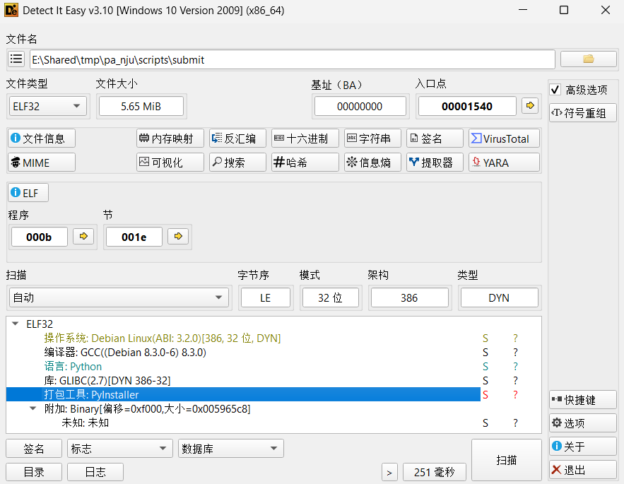
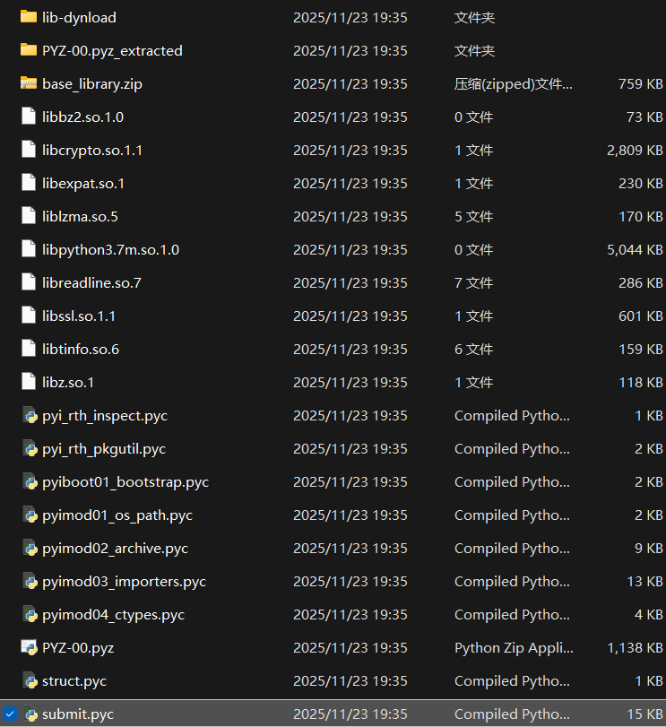

# 对 ICSPA 提交程序 submit 的逆向分析

这篇 Blog 记录的是本人在完成 ICSPA 1 之后，出于对提交流程的好奇，而进行的一次逆向分析

<!-- more -->

## Intro

第一次提交 ICSPA 的阶段性作业时，使用的是

```
make submit_pa-1
```

之后会进行一系列提交流程，然后得到一个被加密的压缩包

于是我在思考：压缩包的密码是如何生成的？完整的提交流程是怎样实现的？先从 make 操作开始分析：

在 `pa_nju/Makefile` 和 `pa_nju/Makefile.git` 有对应的 `make` 操作

```makefile
### From pa_nju/Makefile.git ###

STU_ID = 123456789
# DO NOT modify the following code!!!
GITFLAGS = -q --author='tracer-pa-public <tracer@njuics.org>' --no-verify --allow-empty

# prototype: git_commit(msg)
define git_commit
	-@git add . -A --ignore-errors
	-@while (test -e .git/index.lock); do sleep 0.1; done
	-@(echo ">$(1)" &&
	   echo "> id" $(STU_ID) &&
	   echo -n "> user "; id -un &&
	   echo -n "> uname "; uname -a &&
	   echo -n "> uptime"; uptime &&
	   echo "> unitime" $(2) &&
	   echo -n "> "; (head -c 20 /dev/urandom | hexdump -v -e '"%02x"') &&
	   echo) | git commit -F - $(GITFLAGS)
	-@sync
endef

### From pa_nju/Makefile ###

include Makefile.git

Submit_Script = scripts/submit

submit_pa-1: 
	$(call git_commit, "submit_pa-1", $(TIME_MAKE))
	$(Submit_Script) pa-1 $(STU_ID)
```

`submit_pa-1` 完成了两件事：

1- 进行一次 git commit，首先 `git add .` 强制添加所有文件，等待 git 锁解锁，然后进行提交，提交信息包含提交的阶段名，学号，环境用户名，系统内核信息，运行时间，随机字符串等等（确保环境正确）

2- 执行提交脚本，两个入口参数分别是 PA 阶段名和学号，脚本位于 `scripts/submit`，是一个二进制文件

现在需要做的就是尝试分析 `submit` 文件的信息

## Detect it

用 Detect It Easy 进行文件类型分析，发现文件是用 Pyinstaller 打包的，其本质是一个 Python 程序



好消息是：用 Pyinstaller 打包的文件是可以复原出 py 源文件的，于是使用 pyinstxtractor 进行 pyc 文件的提取

```
> python3 pyinstxtractor.py submit
[+] Processing submit
[+] Pyinstaller version: 2.1+
[+] Python version: 3.7
[+] Length of package: 5861039 bytes
[+] Found 35 files in CArchive
[+] Beginning extraction...please standby
[+] Possible entry point: pyiboot01_bootstrap.pyc
[+] Possible entry point: pyi_rth_pkgutil.pyc
[+] Possible entry point: pyi_rth_inspect.pyc
[+] Possible entry point: submit.pyc
[!] Warning: This script is running in a different Python version than the one used to build the executable.
[!] Please run this script in Python 3.7 to prevent extraction errors during unmarshalling
[!] Skipping pyz extraction
[+] Successfully extracted pyinstaller archive: submit

You can now use a python decompiler on the pyc files within the extracted directory
```



最核心的显然是 `submit.pyc`，有很多方法可以进行对 `pyc` 进行反编译，这里不给出具体操作了

## Explore it

反编译的**源代码不会在这里完整呈现**，这里会大致解释 `submit` 的流程（有些涉及学术诚信的内容不会在这里写出）

这里给出 main 函数的实现，一些子函数的作用在注释里进行了解释：

（由于反编译的限制，存在一些错误的代码，但是不会影响分析）

```python title="submit.py"
if __name__ == '__main__':
    # 首先判断传参个数是否正确
    if len(sys.argv) != 3:
        print('Argc error')
        sys.exit(-1)

    # pa 阶段名为第一个入口参数
    pa_stage = str(sys.argv[1])
    # 学生学号为第二个入口参数
    stu_id = str(sys.argv[2])
    # 如果 pa 阶段名不正确，输出 'Stage fault' 并异常退出
    if not pa_stage == 'pa-1' and pa_stage == 'pa-2-1' and pa_stage == 'pa-2-2' and pa_stage == 'pa-2-3' and pa_stage == 'pa-3-1' and pa_stage == 'pa-3-2' and pa_stage == 'pa-3-3' and pa_stage == 'pa-4-1' and pa_stage == 'pa-4-2' and pa_stage == 'pa-4-3':
        print('Stage fault')
        sys.exit(-1)

    # 1. 确认提交信息
    print('(1/5) Confirm Submission', '', **('end',))
    # 输出 Terms，如果用户输入不是 'yes' 'y' 或空白就异常退出
    if not confirm_pa_stage(pa_stage, stu_id):
        print('Submission failed')
        sys.exit(-1)
    # 时间戳检查
    timestamp = int(time.time())
    if timestamp == '0':
        print('Submission failed')
        sys.exit(-1)
        
    # 这个函数配置接下来几个阶段的全局变量：
    # 检查 'Integrity' 用到的 md5 列表
    # 测试用例文件的根目录
    # 测试用例的文件夹名称
    set_testcase_root(pa_stage)
    
    # 2. 检查 'Integrity' （有没有修改不应该修改的文件）
    print('(2/5) ', '', **('end',))
    if not check_testcase_integrity(pa_stage):
        print('Submission failed')
        sys.exit(-1)
        
    # 3. 进行一次 build
    print('(3/5) ', '', **('end',))
    if not build_pa(pa_stage):
        print('Submission failed')
        sys.exit(-1)
        
    # 4. 进行一次 make test
    print('(4/5) ', '', **('end',))
    if not execute_testcases(pa_stage, str(timestamp), stu_id):
        print('Submission failed')
        sys.exit(-1)
        
    # 5. 将整个项目打包
    print('(5/5) ', '', **('end',))
    if not pack_project(pa_stage, str(timestamp), stu_id):
        print('Submission failed')
        sys.exit(-1)

    # 任务完成
    print('Submission sequence completed, you may proceed to:')
    print('\t1. Submit your report to CSLabCMS if required')
    print('\t2. Attend our survey if you would like to')
    sys.exit(0)
```

对于 `check_testcase_integrity` 函数，分析：

```python title="check_testcase_integrity()"
def check_testcase_integrity(pa_stage):
    print('Check for Integrity ...\t\t', '', **('end',))
    sys.stdout.flush()
    integrity = True
    # 如果为 pa-1 和 pa2-3 的提交，不需要进行检查，直接跳过
    if pa_stage == 'pa-1' or pa_stage == 'pa-2-3':
        integrity = True
    # 如果是 pa4-3 的提交，需要额外校验 game 文件的 md5 值是否和原始文件不一致
    elif pa_stage == 'pa-4-3':
        testfile = open('./scripts/score_testcases/game', 'rb')
        testcase_md5 = hashlib.md5(testfile.read()).hexdigest()
        testfile.close()
        if md5_game_score != testcase_md5:
            integrity = False
        else:
            # 所有的测试用例的 md5 校验
            idx = 0
            for testcase in testlist:
                file_path = testcase_root + testcase
                if pa_stage == 'pa-2-1':
                    file_path = file_path + '.img'
                if not os.path.exists(file_path):
                    integrity = False
                    break
                testfile = open(file_path, 'rb')
                testcase_md5 = hashlib.md5(testfile.read()).hexdigest()
                testfile.close()
                if md5_list[idx] != testcase_md5:
                    integrity = False
                    break
                idx = idx + 1
    # 接下来是一些特定文件的 md5 校验
    testfile = open('./nemu/src/cpu/instr/nemu_trap.c', 'rb')
    testcase_md5 = hashlib.md5(testfile.read()).hexdigest()
    testfile.close()
    if md5_nemu_trap != testcase_md5:
        integrity = False
    testfile = open('./nemu/src/main.c', 'rb')
    testcase_md5 = hashlib.md5(testfile.read()).hexdigest()
    testfile.close()
    if md5_main != testcase_md5:
        integrity = False
    testfile = open('./nemu/src/parse_args.c', 'rb')
    testcase_md5 = hashlib.md5(testfile.read()).hexdigest()
    testfile.close()
    if md5_parse_args != testcase_md5:
        integrity = False
    testfile = open('./libs/nemu-ref/lib-nemu-ref.a', 'rb')
    testcase_md5 = hashlib.md5(testfile.read()).hexdigest()
    testfile.close()
    if md5_lib_nemu_ref != testcase_md5:
        integrity = False
    if integrity:
        print('%1b[32mPass%1b[0m')
        sys.stdout.flush()
    else:
        print('%1b[31mFail%1b[0m')
        print('Please restore the original copies of the following items:')
        print("\teverything in 'scripts/score_testcases/'")
        print('\tnemu/src/main.c')
        print('\tnemu/src/parse_args.c')
        print('\tnemu/src/cpu/instr/nemu_trap.c')
        print('\tlibs/nemu-ref/lib-nemu-ref.a')
        sys.stdout.flush()
    return integrity
```

对于 `execute_testcases` 函数，其流程和 `make test` 的流程差不多，但是会输出一份测试报告，用 Base64 编码后存入 `pa_nju/scripts/.scores` 文件夹（可以解码后根据内容判断 submit 时的样例测试正确性）

```python title="get_message_result()"
def get_message_result(message):
    return str(base64.urlsafe_b64encode(message.encode('utf-8')), 'utf-8')
```

最后是 `pack_project` 操作，这里涉及了压缩包的构建与加密

```python title="pack_project()"
def pack_project(pa_stage, timestamp, stu_id):
    # 这里定义了文件夹的名字
    folder_name = stu_id + '_' + pa_stage + '_' + timestamp
    print('Pack Project ...\t\t\t', '', **('end',))
    sys.stdout.flush()
    # 删除一些不需要被打包进去的文件
    os.system('make clean > ../temp/.tomute 2>&1')
    os.system('cp -r `pwd` ../submit/' + folder_name)
    os.system('rm -r -f ../submit/' + folder_name + '/game/data/')
    os.system('rm -r -f ../submit/' + folder_name + '/game/src/nemu-pal/include/')
    os.system('rm -f ../submit/' + folder_name + '/scripts/submit')
    os.system('rm -r -f ../submit/' + folder_name + '/libs/')
    os.system('rm -f ../submit/' + folder_name + '/testcase/objdump4nemu-i386')
    os.system('rm -r -f ../submit/' + folder_name + '/scripts/score_testcases/')
    # tar 压缩，采用 openssl des3 -salt 撒盐加密，密码的构造是一系列信息的组合
    # 密码包含 pa_stage  pack_password  timestamp  stu_id 等信息的拼接
    # （pack_password 是全局常量，这里不给出了）
    # 毕竟解密了压缩包也没有任何好处，里面没有好东西
    os.system('tar -cj ../submit/' + folder_name + ' 2> ../temp/.tomute | openssl des3 -salt -k ' + pack_password + pa_stage + pack_password + timestamp + stu_id + pack_password + ' -out ../submit/' + folder_name + '.tar.bz2 > ../temp/.tomute 2>&1')
    os.system('rm -r -f ../submit/' + folder_name)
    if os.path.exists('../temp/.tomute'):
        os.remove('../temp/.tomute')
    if not os.path.exists('../submit/' + folder_name + '.tar.bz2'):
        print('%1b[31mFail%1b[0m')
        return False
    None('%1b[32mPass%1b[0m')
    return True
```

以上完成了一次 `submit` 操作，发现：

1- `submit` 完全是基于本地的操作

2- `submit` 的学术诚信检查包含实验环境的检查与对特定文件的 md5 检验

3- `submit` 会将 test 的结果编码后存入特定的文件夹

4- `submit` 得到的压缩包只是对整个 PA 环境删去几个文件后的带密码压缩，密码的构造比较纯粹，解密了也没有好处

## Outro

没什么意思。