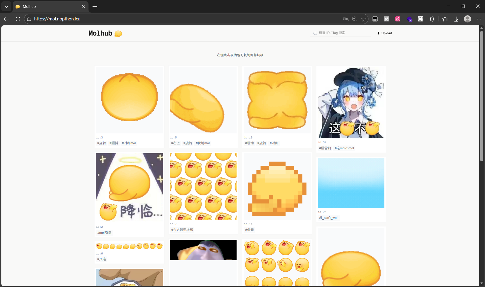
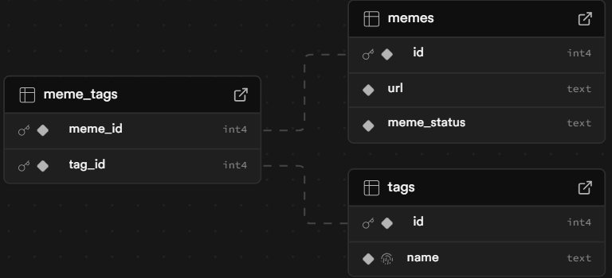
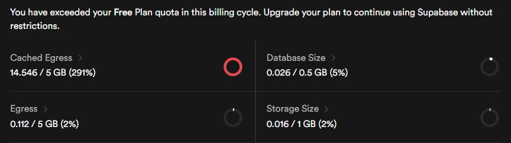

#【赤石科技】Molhub

水群的时候看到了致史量的拜谢表情包，憋不住了所以让 LLM 搓个了 Molhub

【Update】这网站已经似了

<!-- more -->

---

<del>因为我没有钱，所以</del>选择 Next.js 搭建，Vercel 部署，Supabase 存数据库和表情包文件，最后呈现的效果只能用悲剧形容



后面的内容不用看了，我瞎写的

## 前端

React 库是一个开源 JS 库，通过声明式语言构建 UI，非常有名（<del>包括但不限于 [React2Shell (CVE-2025-55182)](https://react2shell.com/)</del>）也非常好用。而 Next.js 是一个基于 React 的框架，开箱即用，省去了路由、服务端渲染、打包配置等操作，并且可以直接在 Vercel 上部署（毕竟是一家的）

React 使用 JSX / TSX（JavaScript / TypeScript XML），第一眼给我的感觉是在 Javascript 里允许直接写 HTML 语句：

```react
const greeting = <h1>Hello World!</h1>;
// 经过编译器转换后，其等价为
const greeting = React.createElement("h1", null, " Hello, world");
```

JSX 使得编写 React 语句（尤其是页面组件等）更加直观，从感觉上来说 React 是“用 JavaScript 去写 HTML”，但是 React 的组件功能使得写 React 相比写“JavaScript+HTML”更加逻辑紧凑

```react
// 定义一个 JavaScript 函数并调用
function Greet_inner(name){
	return `Hello, ${name}`;
}
console.log(Greet_inner('World'));

// 在 test.jsx 中定义一个可以导出使用的 React 组件
export default function Greet({ name }) {
  return <h1>Hello, {name}</h1>;
}

// 在其他文件中导入使用 React 组件，用于更方便的渲染 UI
import Greet from './test';
const App = () => {
  return (
    <div> <Greet name="World" /></div>
  );
};
```

之前写过 TypeScript 的小组件，所以对 React 的这种前端写法有种熟悉感。给出一个页面框架，让 LLM 速通代码实现

```react
// 定义一些状态
STATE {
    memes: Meme[]				// 查询到的 mol 图数据
    filtered: Meme[]			// 过滤器
    searchQuery: string			// 搜索词
    currentPage: number			// 当前页码数
    isLoading: boolean			// 页面没加载好时贴个 Loading
    isUploadModalOpen: boolean	// 蹦出上传弹窗
}

// 页面载入时
ON_MOUNT {
    从 Supabase 数据库获取标签为 approved 的表情包
    存入 memes[]，随机排序存入 filtered
}

// 查询时
ON_SEARCH_CHANGE(query) {
    按照空格分隔标签，以 OR 逻辑搜索内容
}

// ========== 交互 ==========
ON_COPY_IMAGE(url) {
    请求图片并写入剪贴板
}

ON_TAG_CLICK(tag) {
    点击标签时，将标签加到搜索序列中
}

ON_UPLOAD_SUCCESS() {
    关闭弹窗，更新 memes[]
}

// meme 卡片小组件
COMPONENT MemeCard {
    PROPS: { url, id, tags, onCopy, onTagClick }
    RENDER {
		// ...
    }
}

// 和 Supabase 数据库进行 api 交互
API supabase {
    GET /memes?status=approved {
    SELECT id, url, meme_tags(tags(name))
    RETURN memes[]
}
```

具体的代码实现交给 Gemini 了，LLM 真好用

## 后端

Supabase 是一个后端即服务（BaaS）平台，省去了写数据处理后端的步骤，通过前端调用 API 进行后端调用

Supabase 使用 PostgreSQL 进行数据库管理，建立下面的表项

```sql
CREATE TABLE memes (
  id SERIAL PRIMARY KEY,
  url TEXT NOT NULL,
  meme_status TEXT NOT NULL DEFAULT 'pending'
    CHECK (meme_status IN ('pending', 'approved', 'rejected'))
);

CREATE TABLE tags (
  id SERIAL PRIMARY KEY,
  name TEXT UNIQUE NOT NULL
);

CREATE TABLE meme_tags (
  meme_id INT REFERENCES memes(id) ON DELETE CASCADE,
  tag_id INT REFERENCES tags(id) ON DELETE CASCADE,
  PRIMARY KEY (meme_id, tag_id)
);
```

对应的可视化如下，其中 id 用于唯一指定表情包的标签，tag 便于搜索



与此同时建立一个 Bucket 用于存储表情包本体，在项目目录中新开一个 `Upload.tsx` 专门用于处理上传图片相关的操作：

```react
// 上传图片
const { error: uploadError } = await supabase.storage
    .from("molmeme")
    .upload(randomFileName, file);	// uuid 随机文件名

// 获取 URL
const { data: { publicUrl } } = supabase.storage
    .from("molmeme")
    .getPublicUrl(randomFileName);

// 插入 memes 表
const { data: memeData, error: dbError } = await supabase
    .from("memes")
    .insert([{ 
        url: publicUrl,
        meme_status: "pending"
    }])
    .select()
    .returns<MemeInsertResponse[]>()
    .single();

// 插入 tags 表
const { data: tagData } = await supabase
    .from("tags")
    .upsert(
        { name },
        { onConflict: "name" }
    )
    .select()
    .returns<TagUpsertResponse[]>()
    .single();

// 同时为了方便查询，建立关联表
await supabase.from("meme_tags").insert({
    meme_id: memeData.id,  // 表情包 ID
    tag_id: tagData.id,    // 标签 Tag
});
```

## 部署

Next.js 和 Vercel 是同一家公司的产品。把 Next.js 的项目传到 Github，在 Vercel 上直接部署，挂上自己的域名，就可以看看成果了

---

只过了两天 Cached Egress（缓存出站流量）就爆了，果然免费服务什么的还是比较拮据



过几天闭站跑路吧。
