# SCTF 2026 Writeup

期末考试把几个比赛全错过了，sad

只写了两个 MISC，别的题一题都不会写😰

<!-- more -->

---

## 🧩 MISC

### Let's dance together!

> 来来让我们蹦蹦跳跳
> 天天唱歌跳舞乐逍遥
> 让我们一起来玩耍

下发五张 jpg 文件，以及一个 Zipcrypto Deflate 加密的压缩包，其中有一段视频

五张 jpg 文件的内容都是使用神秘字体的文本。不过可以初步推断部分字体是替换密码，所以或许可以用 quipquip 进行爆破（？）

---

第一个 jpg 的内容：

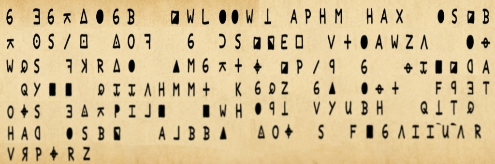

在 [List of Symbols Cipher - Online Decoder, Translator, Identifier](https://www.dcode.fr/symbols-ciphers) 上一个个确认，发现字符集符合 ZODIAC KILLER CIPHER 的内容

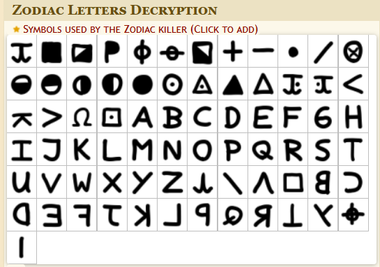

变种选择 Z408 (First cryptogram)，可以还原：

```
A CAPITAL LETTER WITH TWO TALL PEAKS AND A VALLEY BETWEEN THEM
A DIGIT SHAPED LIKE A HOLLOW FULL MOON
A DIGIT SHAPED LIKE A HOLLOW FULL MOON
A CAPITAL LETTER BUILT FROM TWO TALL WALLS AND A SLANTING BRIDGE
```

似乎是在暗示 `M00N`（因为我先解码的第五个 jpg，了解到常规情况下答案如果是字母则是大写字母）

---

第二个 jpg 的内容：

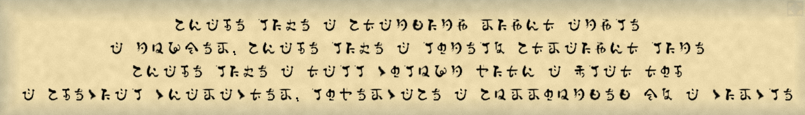

完全没见过，但是可以推测是单表替换（比如第二行第一个字符应该是 `A`）

于是我将每一个字符对应了 a~z 的映射，使用 quipquip 爆破出来了

```title="手敲的，累"
abcde fghe c aicjkgjl mglbi cjlfe
c jnopem abcde fghe c fqjefr aimcglbi fgje
abcde fghe c icff sqfnoj tgib c ufci iqd
c adesgcf sbcmcsiem fqtemscae c anmmqnjkek pr c sgmsfe

# clue: c=a (I guess)
```

```title="quipquip result"
shape like a standing right angle
a number shape like a lonely straight line
shape like a tall column with a flat top
a special character lowercase a surrounded by a circle
```

推测是 `L1T@`

---

第三个 jpg 的内容：

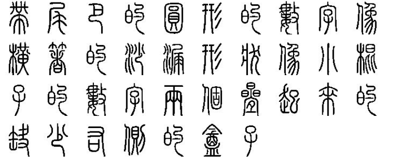

这不是小篆吗？肉眼判断大部分，剩下的丢给转换器逐个确认：

```
带尾巴的圆形的数字
像横着的沙漏型状
像小棍子的数字
两个叠起来的缺少右侧的盒子
```

第一个数字可能是 `6` / `9`；第二个字符呃呃，要不我猜个 `∞`？；第三个数字 `1`；第四个推测是字母 `E`

---

第四个 jpg 的内容：

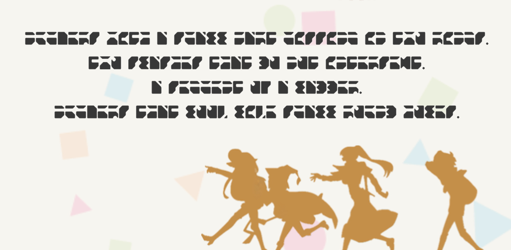

一眼和第二张图一样是单表替换

```title="还是手敲的，累"
abcdefg hijk l gclmm nlfj ciggiao ia jhp fiaog.
jhp gmlgkeg jklj qp apj iajefgerj.
l geoceaj ps l mlqqef.
abcdefg jklj mppt mite gclmm fpbaq kpmeg.

# clue: l=a (I guess)
```

```title="quipquip result"
numbers with a small part missing in two rings.
two slashes that do not intersect.
a segment of a ladder.
numbers that look like small round holes.
```

推测是 `3VH0`

---

第五个 jpg 的内容：

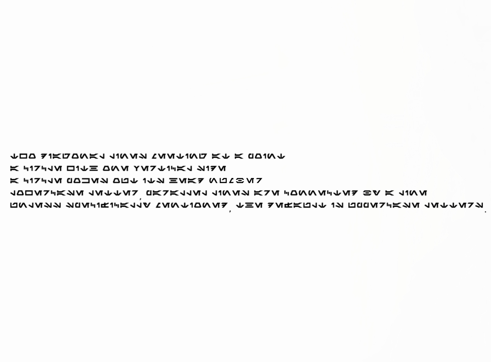

依旧在 [List of Symbols Cipher - Online Decoder, Translator, Identifier](https://www.dcode.fr/symbols-ciphers) 上一个个确认，发现字符集符合 Aurebesh 字体

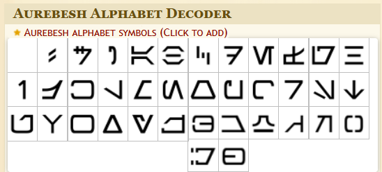

还原一下

```
TWO DIAGONAL LINES MEETING AT A POINT
A CIRCLE WITH ONE VERTICAL SIDE
A CIRCLE POKES OUT ITS HEAD
LOWERCASE LETTER, PARALLEL LINES ARE CONNECTED BY A LINE
UNLESS SPECIFICALLY MENTIONED, THE DEFAULT IS UPPERCASE LETTERS.
```

前四条应该还在描述字符的特征，第一个字符大概率是 `X`，或许是 `K`，第二个字符大概率 `Q`，也可能是 `D`，第三个字符可能是 `6`，第四个字符可能是 `z`

最后一句话提示字母默认是大写的

---

总结一下候选密码：

```
M00NL1T@6_1E3VH0XQ6z
        9       KD
```

直接丢 ARCHPR 爆破

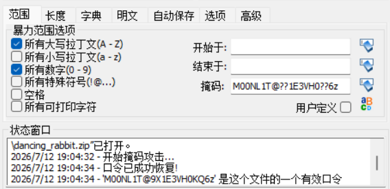

得到密码 `M00NL1T@9X1E3VH0KQ6z`

---

解压压缩包后得到一个 mp4 文件，binwalk 发现附带一个加密的压缩包（内容为 `flag.txt`）。视频本身内容是兔子跳舞，推测是基于舞蹈动作的加密（Dancing Men Chiper）

结合视频提示，可以提取出这几个关键图

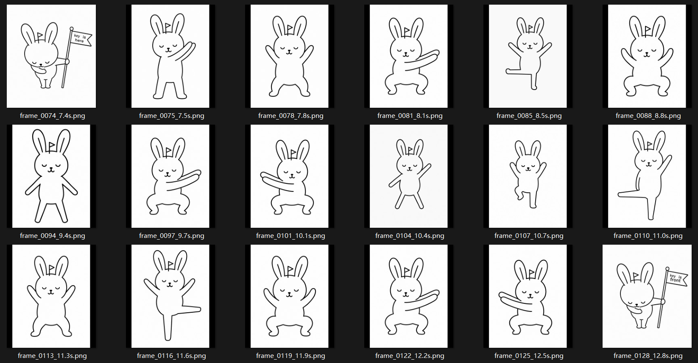

对照着拼可以得出结果

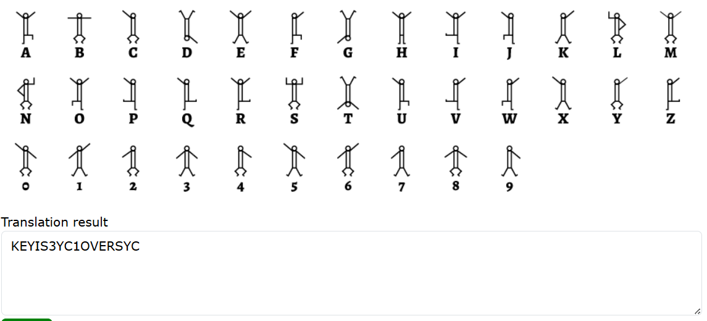

用 `3YC1OVERSYC` 打开压缩包，得到 Flag

```
SCTF{You_can_solve_this? Really? I_dont_believe}
```

**（这题目出的难评）**

---

### SYC4113

> 深陷兔子洞中……
>
> 那个夏天蝉声四起
>
> 你知道这一切不过都是幻梦一场，
> 但愿永远永远不要醒来。

就给了这么一张图：


上次看到这样的图还是在 CICADA3301，大概率是个致敬题

根据 CICADA3301 那个图片的解法，图片末尾用凯撒加密附了一段数据，这里的处理差不多

```
JLHZHYZH`ZAo{{wzA66ptn5jku85}pw6p6=h9hj:>>=@==8f8>?88?>;;>5qwn
```

考虑到出现了神秘的字符集，使用 ROT47 进行爆破

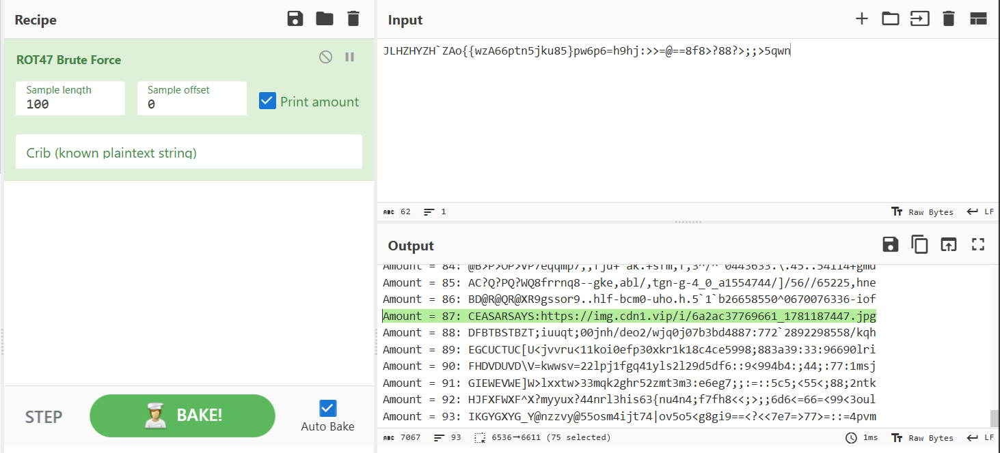

得到下一个图片的网站：`https://img.cdn1.vip/i/6a2ac37769661_1781187447.jpg`，下载

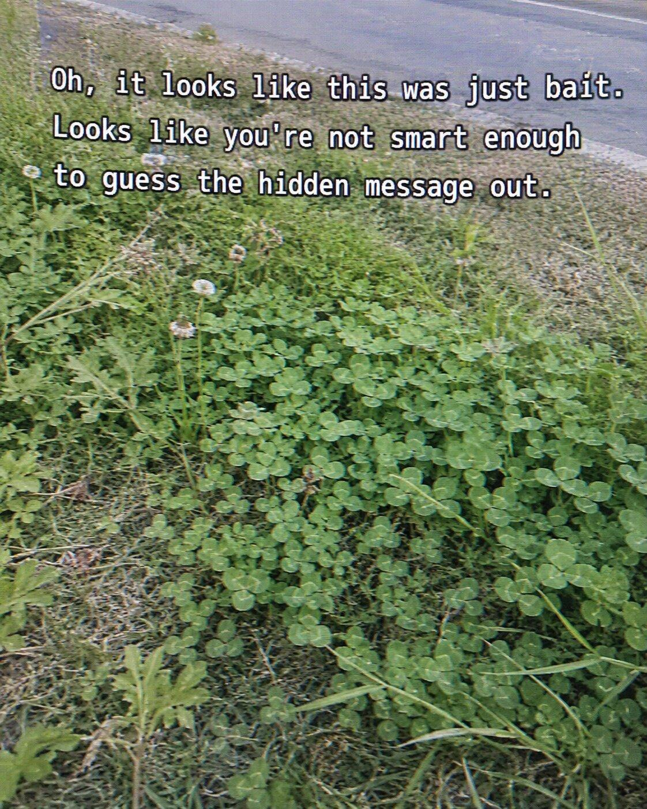

一模一样的，用 outguess 提取内容：

```
❯ outguess -r 6a2ac37769661_1781187447.jpg output.txt
Reading 6a2ac37769661_1781187447.jpg....
Extracting usable bits:   411183 bits
Steg retrieve: seed: 172, len: 303
```

得到经典内容

```
URL:https://www.iplant.cn/foc/pdf/Fabaceae.pdf
VHJpZm9saXVtIHJlcGVucw==550							# Base64: Trifolium repens
2:4:2:1
2:7:8:4
2:9:7:2
2:10:6:1
3:1:2:7
3:2:1:6
4:1:1:9
4:2:6:1
4:4:8:3
5:1:4:9
6:1:1:5
7:1:1:4
7:7:2:1
7:9:1:6
9:1:3:6
9:1:4:2
9:3:5:1
9:3:10:2
9:5:2:8
9:11:2:4
11:1:6:6
11:2:5:6
11:3:1:4
11:4:4:2
11:5:4:6
12:1:1:9
12:1:4:3
```

第一行给出一个论文形式的 PDF，第二行指出了 550 页的 Trifolium repens

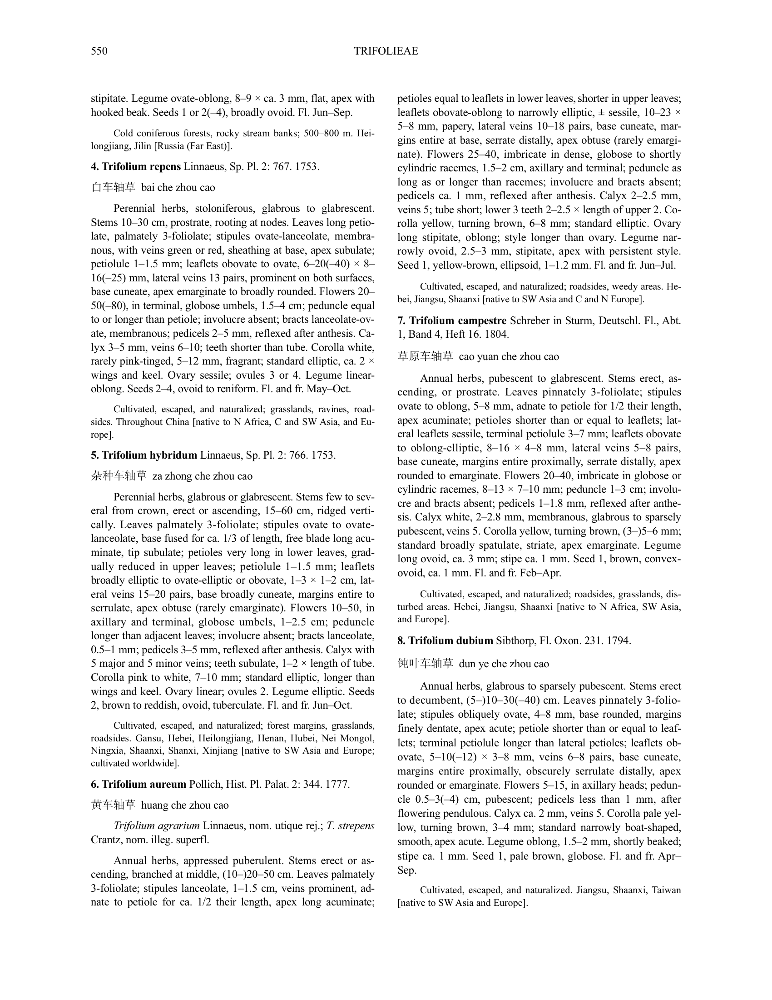

接下来的 `a:b:c:d` 分成四个部分。注意到 `a` 的范围从 2 ~ 12，最大值恰好对应上图中所有满足首行缩进的段落的段落个数

因此可以推测 `a:b:c:d` 的划分为（括号内的内容是经过验证的结论）

```
a: 段落数
b: 行数
c: 单词数（由连字符后半部分组成的单词视为一个单词，2–5 这样的属于一个单词）
d: 字符数（由连字符后半部分组成的单词只考虑当前行的部分，考虑标点符号）
```

对着填一下

```
2:4:2:1     w
2:7:8:4     w
2:9:7:2     b
2:10:6:1    r
3:1:2:7     d
3:2:1:6     .
4:1:1:9     l
4:2:6:1     a
4:4:8:3     n
5:1:4:9     z
6:1:1:5     o
7:1:1:4     u
7:7:2:1     m
7:9:1:6     .
9:1:3:6     c
9:1:4:2     o
9:3:5:1     m
9:3:10:2    /
9:5:2:8     s
9:11:2:4    y
11:1:6:6    c
11:2:5:6    s
11:3:1:4    e
11:4:4:2    c
11:5:4:6    r
12:1:1:9    e
12:1:4:3    t
```

得到网址

```
wwbrd.lanzoum.com/sycsecret
```

蓝奏云链接，下载得到一个 `secret.zip`，内含两个文件：`hint.wav` 和 `morse.mp3`

前者 `hint.wav` 依旧是仿隔壁 3301 的，内容是：

```
 Well done! Now you need to find three prime numbers, one of which is 523. Good luck!
```

也就是 图片宽×高×523 = 631×661×523 = 218138593

后者 `morse.mp3` 在 [Morse Code Adaptive Audio Decoder | Morse Code World](https://morsecode.world/international/decoder/audio-decoder-adaptive.html) 网站解码一下得到：

```
CONTACT US USING SYC FOLLOWED BY THE PRODUCT OF THREE PRIME NUMBERS AND A 163 EMAIL ADDRESS.
```

因此给 SYC218138593@163.com 发个邮件，自动回复得到

```title="其实赛后这个邮箱的自动回复关闭了，翻官方题解仓库翻到的回复原文"
Transmission accepted.

The image lied.
The flower indexed the path.
The signal named the ritual.
The primes opened the mailbox.
You are not early.
But you are worth it:SCTF{A_voice_from_a_high_place_naturally_carries_far-it_is_not_relying_on_the_autumn_wind}

4113
```

得到 Flag

```
SCTF{A_voice_from_a_high_place_naturally_carries_far-it_is_not_relying_on_the_autumn_wind}
```

---
