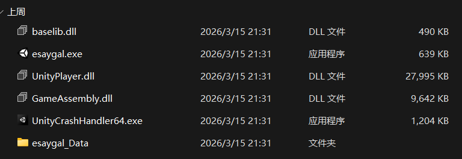
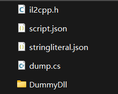
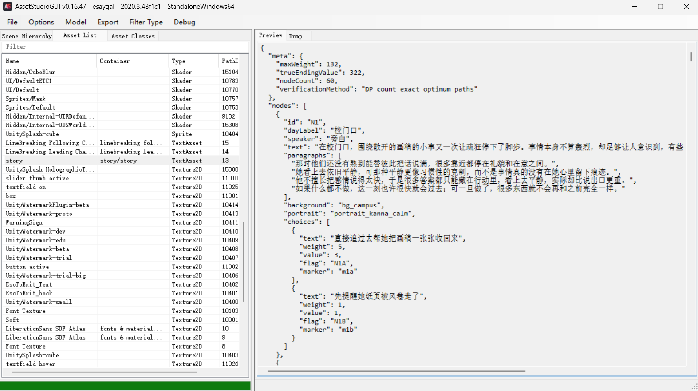
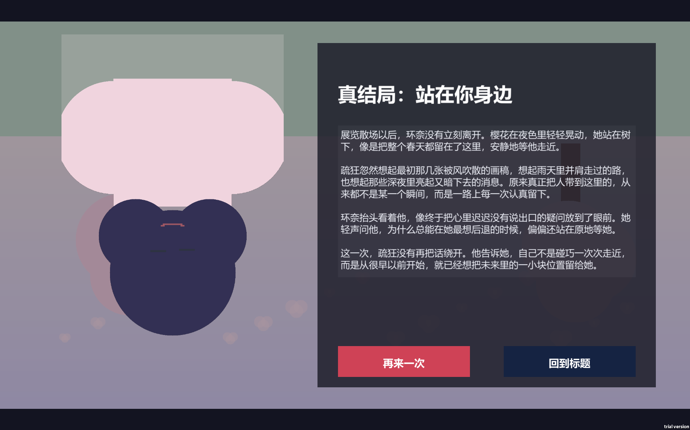
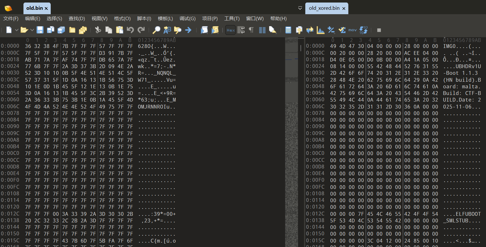
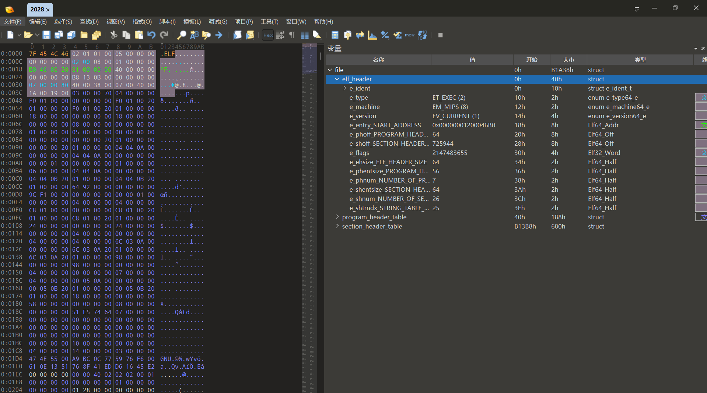

# SUCTF 2026 Writeup

第一次参加 XCTF 分赛，难度确实大不少，赛时只解出一道 RE，全队最划水的无疑了😭

以下包含赛后补的题，事实上大多数题我还是看不懂，虽然是这样还是得记一下

<!-- more -->

---

## 🔍 RE

### SU_easygal

> 疏狂在上学期间，遇见了总把情绪藏得很深的艺术系学生环奈。
> 
> 从校门口被风吹散的画稿开始，到毕业展结束后的樱花树下，这段关系会在一连串看似普通的选择里慢慢推进
> 
> 你需要在 60 个剧情节点中不断做出选择
> 
> 每个选项都会悄悄改变故事最后的走向，而真正的结局，只会留给那条唯一正确的路
> 
> 当你终于走到她面前，也许你会得到一句迟来的回答
> 
> 也许，你只会看着春天结束

下载附件发现真是个用 Unity 做的旮旯给木，玩一遍，发现有 60 个二选一选择题，猜测如果序列完全正确会触发真结局，并给出 Flag



给了个 `GameAssembly.dll`，说明这个游戏是 IL2CPP 的打包方式，如果直接 IDA 打开会丢失类名、方法名等信息。使用 Il2CppDumper 可以从 `global-metadata.dat` 中重新恢复元数据



其中对于 IDA 分析来说，最重要的是 `script.json`，可以结合 Il2CppDumper 附带的 python 脚本，将反汇编结果中的函数地址替换为原始名称（就不需要一个个 sub 函数找了）

以及 DummyDll 中包含所有伪造的 DLL 文件，可以拖到 dnSpy 中看类和方法的名称、结构，但是看不到具体实现

接下来 IDA 启动，翻来翻去找出这几个核心函数

```c title="GameManager__OnChoiceSelected"
void GameManager__OnChoiceSelected(GameManager_o *this, StoryChoiceData_o *choice, const MethodInfo *method)
{
    GameManager_o *v4; // rbx
    __int64 v5; // rdx
    __int64 v6; // rdx
    __int64 v7; // rdx
    int32_t currentValue; // ebp
    int32_t currentWeight; // esi
    System_Collections_Generic_IEnumerable_string__o *flags; // r14
    System_Collections_Generic_IEnumerable_string__o *markers; // r15
    int v12; // edi
    struct StoryDatabase_o *storyData; // rax
    struct System_Collections_Generic_List_StoryNodeData__o *nodes; // rax

    v4 = this;
    if ( !byte_1808EEAB2 )
    {
        sub_180124EB0(&GameStateStore_TypeInfo, choice);
        sub_180124EB0(&Method_System_Collections_Generic_HashSet_string__Add__, v5);
        sub_180124EB0(&Method_System_Collections_Generic_List_string__Add__, v6);
        sub_180124EB0(&Method_System_Collections_Generic_List_StoryNodeData__get_Count__, v7);
        byte_1808EEAB2 = 1;
    }
    if ( !choice )
        goto LABEL_20;

    // 看这里，在每道题回答后，会同时累加每道题的 Weight 和 Value 两个参数
    v4->fields.currentWeight += choice->fields.weight;
    v4->fields.currentValue += choice->fields.value;


    if ( !System_String__IsNullOrWhiteSpace(choice->fields.flag, 0) )
    {
        this = (GameManager_o *)v4->fields.flags;
        if ( !this )
            goto LABEL_20;
        System_Collections_Generic_HashSet_uint___Add(
            (System_Collections_Generic_HashSet_uint__o *)this,
            (uint32_t)choice->fields.flag,
            Method_System_Collections_Generic_HashSet_string__Add__);
    }
    if ( !System_String__IsNullOrWhiteSpace(choice->fields.marker, 0) )
    {
        this = (GameManager_o *)v4->fields.markers;
        if ( !this )
            goto LABEL_20;
        System_Collections_Generic_List_TimeZoneInfo_AdjustmentRule___Add(
            (System_Collections_Generic_List_TimeZoneInfo_AdjustmentRule__o *)this,
            (System_TimeZoneInfo_AdjustmentRule_o *)choice->fields.marker,
            Method_System_Collections_Generic_List_string__Add__);
    }


    // 这里，会将每一步做出的选择对应的 flag 和 marker 字段储存，最后参与生成 Flag
    // 其中 flags 没有作用，markers 直接参与 Flag 的构成
    currentValue = v4->fields.currentValue;
    currentWeight = v4->fields.currentWeight;
    flags = (System_Collections_Generic_IEnumerable_string__o *)v4->fields.flags;
    markers = (System_Collections_Generic_IEnumerable_string__o *)v4->fields.markers;
    if ( (GameStateStore_TypeInfo->_2.bitflags2 & 4) != 0 && !GameStateStore_TypeInfo->_2.cctor_finished )
        il2cpp_runtime_class_init(GameStateStore_TypeInfo);
    v12 = 0;
    GameStateStore__SetProgress(currentWeight, currentValue, flags, markers, 0);
    storyData = v4->fields.storyData;
    this = (GameManager_o *)(unsigned int)(v4->fields.currentNodeIndex + 1);
    v4->fields.currentNodeIndex = (int)this;
    if ( !storyData || (nodes = storyData->fields.nodes) == 0 )
        LABEL_20:
    sub_180124FF0(this, choice, method);

    if ( (int)this >= nodes->fields._size )
    {
        // 这里说明 60 道题目答完了，结算游戏
        // 如果 60 道题的总 weight > maxWeight，进入失败结局
        if ( v4->fields.currentWeight > v4->fields.maxWeight )
        {
            GameManager__FinishGame(v4, 3, 0);
        }
        else
        // 否则会进一步计算
        // 如果 60 道题的总 value == trueEndingValue，进入真结局
        {
            LOBYTE(v12) = v4->fields.currentValue != v4->fields.trueEndingValue;
            GameManager__FinishGame(v4, v12 + 1, 0);
        }
    }

    else
    {
        GameManager__ShowCurrentNode(v4, 0);
    }
}
```

这里我们得到结论：每道二选一题目的选项分别附带 `weight` 和 `value` 两个判定参数，60 道题目答完之后会检验：如果 `totalWeight <= maxWeight` 且 `totalValue == trueEndingValue` 则进入真结局获得 Flag

继续跟踪到初始化函数：

```c title="GameManager__Start" hl_lines="96 102"
void GameManager__Start(GameManager_o *this, const MethodInfo *method)
{
    __int64 v3; // rdx
    __int64 v4; // rdx
    __int64 v5; // rdx
    __int64 v6; // rdx
    __int64 v7; // rdx
    __int64 v8; // rdx
    __int64 v9; // rdx
    __int64 v10; // rdx
    __int64 v11; // rdx
	
    // 这里导入了一个 Unity TextAsset 文件，怀疑记录了每个题目的相关数据
    UnityEngine_TextAsset_o *TextAsset; // rdi
    __int64 v13; // rdx
    struct System_Collections_Generic_List_StoryNodeData__o *nodes; // rcx
    __int64 v15; // r8
    System_String_o *v16; // rax
    struct StoryDatabase_o *v17; // rax
    struct StoryDatabase_o **p_storyData; // rdi
    struct StoryDatabase_o *v19; // rax
    struct StoryMetaData_o *meta; // rcx
    int32_t maxWeight; // ecx
    struct StoryMetaData_o *v22; // rax
    int32_t trueEndingValue; // eax

    if ( !byte_1808EEAAF )
    {
        sub_180124EB0(&GameStateStore_TypeInfo, method);
        sub_180124EB0(&Method_System_Collections_Generic_List_StoryNodeData__get_Count__, v3);
        sub_180124EB0(&StringLiteral_3002, v4);
        byte_1808EEAAF = 1;
    }
    if ( (GameStateStore_TypeInfo->_2.bitflags2 & 4) != 0 && !GameStateStore_TypeInfo->_2.cctor_finished )
        il2cpp_runtime_class_init(GameStateStore_TypeInfo);
    GameStateStore__ResetRun(0);
    if ( !byte_1808EEAB0 )
    {
        sub_180124EB0(&UnityEngine_Debug_TypeInfo, v5);
        sub_180124EB0(&Method_UnityEngine_JsonUtility_FromJson_StoryDatabase___, v6);
        sub_180124EB0(&UnityEngine_Object_TypeInfo, v7);
        sub_180124EB0(&Method_UnityEngine_Resources_Load_TextAsset___, v8);
        sub_180124EB0(&StringLiteral_3003, v9);
        sub_180124EB0(&StringLiteral_1697, v10);
        sub_180124EB0(&StringLiteral_2574, v11);
        byte_1808EEAB0 = 1;
    }
    
    // 这里加载了刚刚提到的 Unity TextAsset 文件
    // 并且进行了相关元素的解析，或许是个 json 文件
    TextAsset = UnityEngine_Resources__Load_TextAsset_(StringLiteral_3003, Method_UnityEngine_Resources_Load_TextAsset___);
    if ( (UnityEngine_Object_TypeInfo->_2.bitflags2 & 4) != 0 && !UnityEngine_Object_TypeInfo->_2.cctor_finished )
        il2cpp_runtime_class_init(UnityEngine_Object_TypeInfo);
    if ( UnityEngine_Object__op_Equality((UnityEngine_Object_o *)TextAsset, 0, 0) )
    {
        if ( (UnityEngine_Debug_TypeInfo->_2.bitflags2 & 4) != 0 && !UnityEngine_Debug_TypeInfo->_2.cctor_finished )
            il2cpp_runtime_class_init(UnityEngine_Debug_TypeInfo);
        UnityEngine_Debug__LogError(StringLiteral_2574, 0);
        p_storyData = &this->fields.storyData;
    }
    else
    {
        if ( !TextAsset )
            goto LABEL_33;
        v16 = UnityEngine_TextAsset__ToString(TextAsset, 0);
        v17 = UnityEngine_JsonUtility__FromJson_StoryDatabase_(
            v16,
            Method_UnityEngine_JsonUtility_FromJson_StoryDatabase___);
        p_storyData = &this->fields.storyData;
        this->fields.storyData = v17;
        sub_180124A40(&this->fields.storyData, v17);
        if ( !this->fields.storyData )
        {
            if ( (UnityEngine_Debug_TypeInfo->_2.bitflags2 & 4) != 0 && !UnityEngine_Debug_TypeInfo->_2.cctor_finished )
                il2cpp_runtime_class_init(UnityEngine_Debug_TypeInfo);
            UnityEngine_Debug__LogError(StringLiteral_1697, 0);
        }
    }
    v19 = *p_storyData;
    if ( !*p_storyData )
    {
        LABEL_32:
        GameManager__ShowError(this, StringLiteral_3002, 0);
        return;
    }
    nodes = v19->fields.nodes;
    if ( !nodes )
        LABEL_33:
    sub_180124FF0(nodes, v13, v15);
    if ( !nodes->fields._size )
        goto LABEL_32;
    meta = v19->fields.meta;
    
    // maxWeight = 132 初始化
    if ( !meta || (maxWeight = meta->fields.maxWeight, maxWeight <= 0) )
        maxWeight = 132;
    this->fields.maxWeight = maxWeight;
    v22 = v19->fields.meta;
    
    // trueEndingValue = 322 初始化
    if ( !v22 || (trueEndingValue = v22->fields.trueEndingValue, trueEndingValue <= 0) )
        trueEndingValue = 322;
    this->fields.trueEndingValue = trueEndingValue;
    GameManager__ShowCurrentNode(this, 0);
}
```

得到了 `maxWeight = 132` 和 `trueEndingValue = 322` 的初始化信息，并且发现故事节点数据存储在外部

用 AssetStudio 搜索资源文件，找到了下面的内容：



发现这里存储了完整的信息，包含 `weight` `value` `marker` 这几个关键参数，同时 `meta` 段中还贴心附赠了之前已经得到的信息，甚至还给出了验证方法的提示（用背包 DP 解答这个约束问题）

给出 exp，跑一下

```python title="exp.py"
import json
import hashlib

with open('story.txt', encoding='utf-8') as f:
    story = json.load(f)

nodes = story['nodes']
meta = story['meta']
max_weight = meta['maxWeight']
target_value = meta['trueEndingValue']

dp = {(0, 0): ("", [])}

for node_idx, node in enumerate(nodes):
    new_dp = {}
    for (w, v), (markers, choices) in dp.items():
        for i, choice in enumerate(node['choices']):
            new_w = w + choice['weight']
            new_v = v + choice['value']
            if new_w <= max_weight:
                key = (new_w, new_v)
                new_markers = markers + choice['marker']
                new_choices = choices + [{
                    'node_id': node['id'],
                    'option': 'A' if i == 0 else 'B',
                    'weight': choice['weight'],
                    'value': choice['value'],
                    'marker': choice['marker']
                }]
                if key not in new_dp or len(new_markers) < len(new_dp[key][0]) or (
                        len(new_markers) == len(new_dp[key][0]) and new_markers < new_dp[key][0]):
                    new_dp[key] = (new_markers, new_choices)
    dp = new_dp

best = min(((w, v, markers, choices) for (w, v), (markers, choices) in dp.items()
            if v == target_value and w <= max_weight),
           key=lambda x: (x[0], x[2]), default=None)

if best:
    _, _, markers, choices = best
    print(''.join(c['option'] for c in choices))
else:
    print("Not found!")
```

得到完整的 60 题的答案：

```
BBABAABAAAAAAABBABAAAABBBBABBBBBBBBAAABAAABABAAABBBABBBBAAAB
```

此时可以考虑继续跟踪 Flag 生成函数直接手推出 Flag 的生成方式（拼接所有的 markers，md5 加密为 Flag 值），或者很有成就感地手动操作一遍，发现真的出了真结局也不会给 Flag（不应该罢），还是得看一遍生成函数



Flag 的构造函数在 `FlagUtility__BuildTrueEndingFlag` 函数中，操作是对 markers 序列 MD5 计算后转十六进制小写

得到 Flag：

```
SUCTF{92d1c2c3f6e55fabbc3a6ffde57c7341}
```

---

### SU_old_bin

> old firmware
> 
> the flag format flag{xxxxx}

下发神秘文件 `old.bin`，010 Editor 打开看到一堆 `0x7F`

于是对文件按照 `key=0x7F` 进行异或解密，豁然开朗，原来是个 IMG 镜像文件



这个 `IMG0` 大概率是个自定义文件头，进行一番 QEMU 操作没法运行这个镜像，于是考虑静态分析。用 binwalk 看一眼文件结构

```
❯ binwalk old_xored.bin

DECIMAL       HEXADECIMAL     DESCRIPTION
--------------------------------------------------------------------------------
0             0x0             IMG0 (VxWorks) header, size: 67108864
47            0x2F            U-Boot version string, "U-Boot 1.1.3 (HN build)"
8232          0x2028          xz compressed data
331476        0x50ED4         xz compressed data
334500        0x51AA4         xz compressed data
```

发现可能是个文件系统，`binwalk` 分离出来

打开第一个文件 `2028`，发现文件头缺失，但是有很多关键 string：

```
❯ strings -n 10 2028
/proc/self/status
TracerPid:
LD_PRELOAD
9VALIDATION_SUCCESS
VALIDATION_FAILURE
Fatal glibc error: Cannot allocate TLS block
cxa_atexit.c
func != NULL
__new_exitfn
__internal_atexit
Fatal error: glibc detected an invalid stdio handle
fcts.towc_nsteps == 1
fcts.tomb_nsteps == 1
_IO_new_file_fopen
offset >= oldend
enlarge_userbuf
The futex facility returned an unexpected error code.
# 省略更多
```

推测是 C/C++ 编写的程序，筛选信息时还能看到 `/usr/lib/mips64el-linux-gnuabi64/gconv` 的字符串，可以确定是 MIPS 64 位小端序程序，这个架构比较古老，对应了 old firmware 的题干

突发奇想把开头看不出文件头的 4 Bytes 换成了 ELF 文件的魔数，用 010 Editor 的 ELF 模板套一下发现可以匹配：



接下来的主要任务就是分析这个 ELF 文件，可以肯定的是 GOT 等 section 都被污染了，所以只能硬着头皮静态分析。Ghidra 有很多地方不太能反汇编，因此只能使用 IDA

为了保持一定的手动分析，同时不至于大海捞针（连真入口函数都找不到），让 Trae 接 MCP 初步分析一下（我估计要是 GPT 5.4 直接解了，Trae 还是只能看个大概）：

首先注意到这个函数：

```c title="sub_120009B7C"
_BYTE *__fastcall sub_120009B7C(int a1, _QWORD *a2)
{
    /* 省略变量定义 */

    v15 = a2;
    v14 = a1;
    // 这个函数相当于 memset
    sub_12001D320(v12, 0, 64);
    v2 = v15[1];
    v3 = v15[2];
    v4 = v15[3];
    v13[0] = *v15;
    v13[1] = v2;
    v13[2] = v3;
    v13[3] = v4;
    if ( !sub_1200084F4(v14, v13) )
    {
        v11 = sub_120022AC0(v14, v12, 64, 256);
        // 确保输入为 64 Byte
        if ( v11 <= 0x40 )
        {	
            // 主验证逻辑函数应该是 sub_120008658
            if ( sub_120008658(v15, (__int64)v12, v11, v5, v6, v7, v8, v9, v11) )
				// 发送 VALIDATION_SUCCESS
                // 甚至需要手动算偏移才能确认打印内容，直接 'X' 是找不到引用的
                sub_120022C20(v14, qword_1200B7F48 - 5240, 18, 0x4000);
            else
                // 发送 VALIDATION_FAILURE
                sub_120022C20(v14, qword_1200B7F48 - 5264, 18, 0x4000);
        }
    }
    return sub_120004860(v12, (_BYTE *)0x40);
}
```

一个还算明显的主框架，现在我们关注 `sub_120008658` 函数，这里包含了所有的输入加密、验证逻辑：

```c title="sub_120008658"
__int64 __fastcall sub_120008658(_QWORD *a1, __int64 a2, unsigned __int64 a3, __int64 a4, __int64 a5, __int64 a6, __int64 a7, __int64 a8, char a9) {

    /* 省略变量定义 */

    v43 = a1;
    v44 = a2;
    v45 = a3;
    v46 = &a9;
    v42 = &a9;
    memset(v21, 0, 64);

    // Part 1
    // 对 64 Bytes 的输入进行处理
    for ( i = 0; i < 0x40; ++i )
    {
        // 如果输入不足 64 Byte，则用 17*index 填充
        if ( i >= v45 )
            v9 = 17 * i;
        else
            v9 = *(_BYTE *)(v44 + i);
        // 每一位与 arr4[(7*i) & 0x3f] + j 异或
        // arr4 由 v43[4] 指向，怀疑 v43 专门存储各个固定数组的地址
        v21[i] = v9 ^ (*(_BYTE *)(v43[4] + ((7 * (_BYTE)i) & 0x3F)) + i);
    }

    // 一些常量的加载
    v10 = v43[1];
    v11 = v43[2];
    v12 = v43[3];
    v22[0] = *v43;
    v22[1] = v10;
    v22[2] = v11;
    v22[3] = v12;

    // Part 2
    // 进行第一次的块加密
    sub_120007E28(v21, 64, v22);

    // Part 3
    // S-Box 替换和置换
    v16 = 0;
    for ( j = 0; j < 0x40; ++j )
        v23[j] = *(_BYTE *)((unsigned __int8)(v21[*(_BYTE *)(v43[5] + j) & 0x3F] ^ *(_BYTE *)(v43[6] + j % 0x30))
                            + qword_1200B7F48
                            - 6464)
        ^ *(_BYTE *)(v43[4] + j);
    v13 = *(_QWORD *)(qword_1200B7F48 - 5848);
    v25 = *(_QWORD *)(qword_1200B7F48 - 5856);
    v26 = v13;

    // Part 4
    // 矩阵变换
    v27[0] = sub_1200085FC((unsigned __int8)v25, BYTE1(v25), BYTE2(v25), BYTE3(v25));
    v27[1] = sub_1200085FC(BYTE4(v25), BYTE5(v25), BYTE6(v25), HIBYTE(v25));
    v27[2] = sub_1200085FC((unsigned __int8)v26, BYTE1(v26), BYTE2(v26), BYTE3(v26));
    v27[3] = sub_1200085FC(BYTE4(v26), BYTE5(v26), BYTE6(v26), HIBYTE(v26));
    for ( k = 0; k < 4LL; ++k )
    {
        v20 = 16 * k;
        v28[0] = sub_1200085FC(
            (unsigned __int8)v23[16 * k],
            (unsigned __int8)v23[16 * k + 1],
            (unsigned __int8)v23[16 * k + 2],
            (unsigned __int8)v23[16 * k + 3]);
        v28[1] = sub_1200085FC(
            (unsigned __int8)v23[v20 + 4],
            (unsigned __int8)v23[v20 + 5],
            (unsigned __int8)v23[v20 + 6],
            (unsigned __int8)v23[v20 + 7]);
        v28[2] = sub_1200085FC(
            (unsigned __int8)v23[v20 + 8],
            (unsigned __int8)v23[v20 + 9],
            (unsigned __int8)v23[v20 + 10],
            (unsigned __int8)v23[v20 + 11]);
        v28[3] = sub_1200085FC(
            (unsigned __int8)v23[v20 + 12],
            (unsigned __int8)v23[v20 + 13],
            (unsigned __int8)v23[v20 + 14],
            (unsigned __int8)v23[v20 + 15]);
        sub_120009938(v28, v27);
        v24[v20] = v32;
        v24[v20 + 1] = v31;
        v24[v20 + 2] = v30;
        v24[v20 + 3] = v29;
        v24[v20 + 4] = v36;
        v24[v20 + 5] = v35;
        v24[v20 + 6] = v34;
        v24[v20 + 7] = v33;
        v24[v20 + 8] = v40;
        v24[v20 + 9] = v39;
        v24[v20 + 10] = v38;
        v24[v20 + 11] = v37;
        v24[v20 + 12] = v41[3];
        v24[v20 + 13] = v41[2];
        v24[v20 + 14] = v41[1];
        v24[v20 + 15] = v41[0];
    }

    // 验证阶段
    // 这里 v16 很明显用于校验，只要计算结果和 qword_1200B7F48 - 6208 指向的
    // 任意 Byte 不同，v16 不为 0，返回值非零
    for ( m = 0; m < 0x40; ++m )
        v16 |= (unsigned __int8)(v24[m] ^ *(_BYTE *)(qword_1200B7F48 - 6208 + m));
    sub_120004860(v21, (_BYTE *)0x40);
    sub_120004860(v23, (_BYTE *)0x40);
    sub_120004860(v24, (_BYTE *)0x40);
    if ( v16 )
        return -1;
    else
        return 0;
}
```

划分好了不同的加密阶段，对每个部分进行分析。

首先是 Part 1 中 `v43` 的初始化，一直向上溯源，找到上游的 `sub_120007FF8` 函数：

```c title="sub_120007FF8"
__int64 __fastcall sub_120007FF8(_QWORD *a1)	// a1 就是 Part 1 中的 v43
{
    char v2; // $v0
    unsigned __int64 i; // [sp+0h] [+0h]
    unsigned __int64 j; // [sp+8h] [+8h]
    unsigned __int64 v5; // [sp+10h] [+10h]
    char v6; // [sp+18h] [+18h]
    char v7; // [sp+18h] [+18h]
    unsigned __int64 v8; // [sp+20h] [+20h]
    _QWORD v9[5]; // [sp+28h] [+28h] BYREF
    _QWORD *v10; // [sp+50h] [+50h]

    v10 = a1;
    memset(v9, 0, 32);
    
    // 这个函数初始化一个 QWORD v9[4] 数组
    sub_120007740(v9);
    
    // 这个函数进行变换，为最终的 v10[0..3] 赋值
    sub_120007344(v10, v9);
    
    // 应该是 calloc 分配并清零内存
    v10[4] = sub_12001B1E8(64, 1);
    v10[5] = sub_12001B1E8(64, 1);
    v10[6] = sub_12001B1E8(48, 1);
    if ( !v10[4] || !v10[5] || !v10[6] )
        return -1;
    
    // 接下来是对 v10 的后三个关键缓冲区赋值
    for ( i = 0; i < 0x40; ++i )
    {
        // v10[5] 初始化为 [0, 1, ..., 63]
        *(_BYTE *)(v10[5] + i) = i;
        // 又是一个置换函数
        v8 = sub_1200074A0(v10);
        // 对 v10[4] 赋值
        *(_BYTE *)(v10[4] + i) = v8 ^ (v8 >> 11) ^ (i - 91);
    }
    // 对
    sub_120007D30(v10[5], 64, v10);
    sub_12000C9F0(*(_QWORD *)qword_1200B7F60);
    for ( j = 0; j < 0x30; ++j )
    {
        v5 = sub_1200074A0(v10);
        v6 = *(_BYTE *)((unsigned __int8)((v5 ^ (v5 >> 23) ^ (7 * j + 61)) + *(_BYTE *)(v10[4] + (j & 0x3F)))
                        + qword_1200B7F48
                        - 6464);
        v2 = sub_1200074A0(v10);
        v7 = sub_120007230((unsigned __int8)(v2 ^ v6), (unsigned __int8)(j % 7) + 1);
        *(_BYTE *)(v10[6] + j) = v7;
    }
    return 0;
}
```

