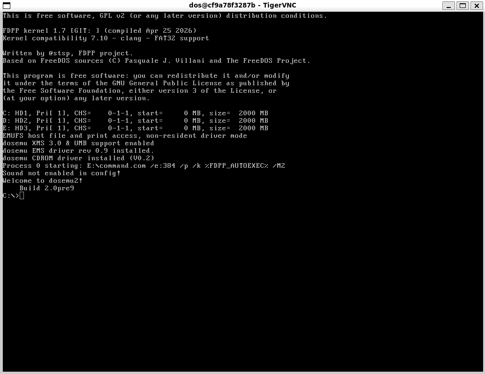
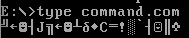
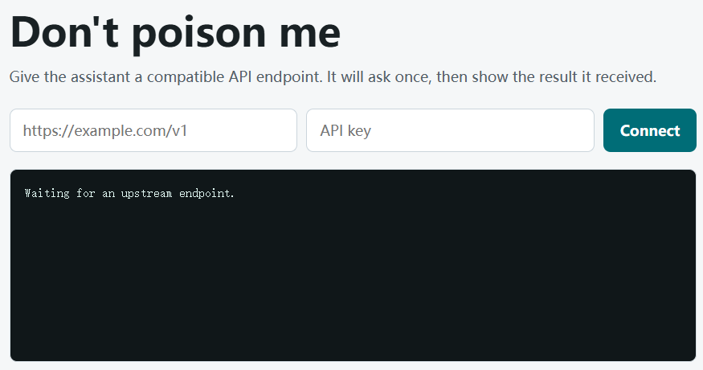
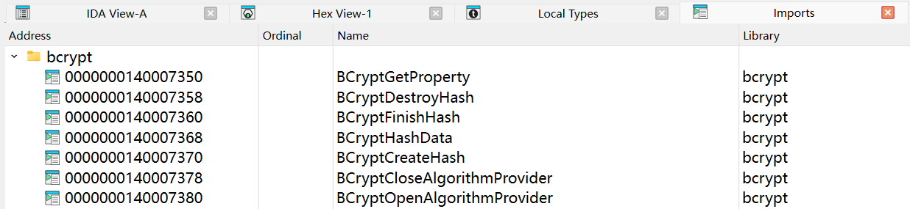

# This is a test

aaa

<!-- more -->

bbb


---

> 恶魔阿萨谢尔守护着通往flag的key，你可以解出吗？

下发文件只有一个 `Devil.exe`，先正常运行一遍：

```hl_lines="1"
"Keh keh keh... Finally, some fresh air! Who dares summon the Great Demon of Lust, Azazel Atsushi?!"
"...Wait a second. You aren't Akutabe, are you? Phew, thank the dark lord."
"Alright, listen up, human! You want a piece of my immense, terrifying, totally-not-a-mascot demonic power? Fine."
"First, I need to know whose soul I'm dealing with. Tell me your pathetic human name."
[?] Enter Player Name: Akutabe
```

随后程序退出。首先用 DIE 看看 exe 信息

```hl_lines="7"
PE32
操作系统: Windows(Vista)[I386, 32 位, 控制台]
链接程序: Microsoft Linker(14.36.35215)
编译器: Microsoft Visual C/C++(19.36.35215)[C++]
语言: C++
工具: Visual Studio(2022, v17.6)
(Heur)打包工具: Compressed or packed data[High entropy + Section 2 (".data") compressed]
```

看上去程序加壳了，但是用 IDA Pro 打开一遍发现没什么加壳迹象。直接开始分析

首先搜索 String 定位主程序逻辑，看到这里：


这里如果输入 Player Name 为 `Azazel`，可以进入后续的逻辑

接下来又是两处分支：


发现程序经过这两次跳转，可以尝试获得 Flag

一开始我认为 Flag 是通过程序内计算生成的，于是我对两次跳转进行了 Patch 操作，发现输出是这样的：

```
"Keh keh keh... Finally, some fresh air! Who dares summon the Great Demon of Lust, Azazel Atsushi?!"
"...Wait a second. You aren't Akutabe, are you? Phew, thank the dark lord."
"Alright, listen up, human! You want a piece of my immense, terrifying, totally-not-a-mascot demonic power? Fine."
"First, I need to know whose soul I'm dealing with. Tell me your pathetic human name."

[?] Enter Player Name: Azazel

"Seriously? That's your name? Man, mortals are so lame these days."
"Whatever. Now for the real deal. Hand over the secret password. And it better be as good as premium braised pig trotters!"

[?] Enter Password: 114514

...
"O-Oh! Oh my... this is the good stuff! Premium grade! Heh heh..."
"Alright, human, you've got yourself a deal. Welcome to the demonic pact..."

This is your flag: flag{114514}
```

发现 Password 就是最终的 Flag，因此还是需要深入程序细节

> 经过一番探索后发现 Ghidra 对这道题的程序的反编译效果更好，体现在 IDA Pro 会拆分出更多的子函数调用（比如一个 printf 操作能嵌套五六层函数），而 Ghidra 就能展开一些短函数
>
> 举个例子，以下是询问名称部分，Ghidra 的反编译结果：
>
> ```
> iVar4 = _strcmp(local_e4,"Azazel");
>   if (iVar4 == 0) { CORRECT BRANCH }
> ```
>
> 以下是 IDA Pro 给出的：
>
> ```
> sub_40C5B0(v27, 128, 0);
> if ( sub_417B70(v27, "Azazel") ) { WRONG BRANCH }
> ```
>
> 后面这个写法是个 AI 都会直接认为玩家名不能为 Azazel，但是 Ghidra 的写法就很明确（玩家名必须为 Azazel）

现在我们整理一下 `FUN_0040d290` 函数的逻辑（上面提到的主函数）

---

## 


### 故障机器人

> 正在启动.... 修复故障机器人以获得flag
>
> *TIP: flag为全小写*

本体是一个小游戏，看截图应该能够看出玩法。从程序来看，完成 256 关小游戏可以拿到 Flag


不妨用 Cheat Engine 改通过关卡数，发现最终的显示内容是【DATA CORRUPTED】以及下面的小字 "The layout stream failed validation."。这暗示程序解出 Flag 依赖中间的过关状态，这很棘手。赛场上应该是没有时间玩完这 256 关的，于是逆向启动（顺便先脱个 UPX 的壳），发现符号表全保留，很不错

跟着 `DATA CORRUPTED` 字符串搜索到 `RenderCompletionOverlay` 函数，推测 `Replay stream rebuilt successfully.` 时，输出的回放记录就是 Flag。从调用的 `RenderLayoutReplay` 函数来看，Flag 似乎是以字符画的形式逐个出现的

```c
if ( v33 )
{
    v7 = v15;
    v8 = v16;
    RenderLayoutReplay(a1, v36, &v7);
    v4 = (__m128i)*(unsigned int *)(a3 + 6216);
    *(float *)v4.m128i_i32 = *(float *)v4.m128i_i32 * 24.0;
    v35 = (int)floorf(COERCE_FLOAT(_mm_cvtsi128_si32(v4)));
    if ( v35 > *(unsigned __int8 *)(v36 + 2) )
        v35 = *(unsigned __int8 *)(v36 + 2);
    _mingw_sprintf(buf, "[replaying layout stream] %d/%d blocks", v35, *(unsigned __int8 *)(v36 + 2));
    v23 = MeasureText(buf, 16);
    DrawText((unsigned int)buf, (int)(float)(575.0 - (float)(v23 / 2)), (int)(float)(v29 + 360.0), 16, -16725761);
}
```

先 patch 通关逻辑试试，我们将：

```c title="CheckWinCondition"
__int64 __fastcall CheckWinCondition(__int64 a1)
{
    _DWORD v2[8]; // [rsp+20h] [rbp-50h] BYREF
    _DWORD v3[11]; // [rsp+40h] [rbp-30h] BYREF
    int i; // [rsp+6Ch] [rbp-4h]

    CalculateCurrentFills(a1, v3, v2);
    for ( i = 0; i <= 7; ++i )
    {
        if ( v3[i] != *(_DWORD *)(a1 + 4 * (i + 64LL)) )
            return 0;
        if ( v2[i] != *(_DWORD *)(a1 + 4 * (i + 72LL)) )
            return 0;
    }
    return 1;
}
```

打 patch 为：（我似乎很喜欢打 patch）

```c title="patched CheckWinCondition"
for ( i = 0; i <= 7; ++i )
{
    *(_DWORD *)(a1 + 4 * (i + 64LL)) = v3[i];
    *(_DWORD *)(a1 + 4 * (i + 72LL)) = v2[i];
}
return 1;
```

顺带将通关后的两秒钟延迟改一下


测试一下，发现依旧不通过（没有加速）


看来需要更加深入的分析。追踪那几个 Capsule 相关的函数，可以总结出：

- `InitCapsuleRuntime` 函数从 `CAPSULE_SEED` (`0x1400a8040`) 处复制内容到 `CapsuleRuntime`，同时还记录了每个关卡的数据偏移 `CAPSULE_LEVEL_OFFSETS`
- 总共只有不超过 16 关，在 `GeneratePuzzleFromPattern` 中有 `& 0xF` 的操作
    - `v44 = (char *)&_data_start__ + 256 * (unsigned __int64)(a2 & 0xF);`
    - 这说明写个视觉脚本把 256 关刷完也是可以的
- `HandleBoardChanged` → `CapsuleSyncLevel` 时，计算当前 8x8 grid 的 board mask，通过 XOR 检测变化，调用 `ApplyBoardDelta` 更新胶囊数据中对应关卡的棋盘状态
- `CapsulePrepareReveal` 进行打印回放数据前的验证，调用 `LayoutLoad` 从胶囊数据偏移 0x648 加载布局流，验证 CRC16，如果验证通过则说明打印流正确，可以输出 Flag 图像了


### Farthest2026

> As if we were back in the 1986s......
>
> (Notice: use any VNC clients to connect)

给了一个需要 VNC 连接的 Shell，连接后如图所示，是个古老的 DOS？



C 盘下有 Dockerfile，截图 + 多模态 LLM 得到下面的完整内容：

```dockerfile
FROM ubuntu:26.04

ENV DEBIAN_FRONTEND=noninteractive
ENV GEOMETRY=1024x768
ENV DEPTH=24
ENV RFBPORT=5901
ENV DISPLAY=:1

RUN set -ex; \
    apt-get update; \
    apt-get install -y --no-install-recommends \
        ca-certificates gnupg \
        software-properties-common; \
    add-apt-repository -y ppa:dosemu2/ppa; \
    apt-get update; \
    apt-get install -y --no-install-recommends \
        dosemu2 \
        comcom64 \
        tigerVNC-standalone-server \
        xauth \
        x11-utils x11-xserver-utils \
        xterm \
        xfonts-base; \
    rm -rf /var/lib/apt/lists/*

RUN useradd -m -s /bin/bash dos

RUN install -d -o dos -g dos -m 700 /home/dos/.dosemu \
    && install -d -o dos -g dos -m 700 /home/dos/.dosemu/drive_c \
    && install -d -o dos -g dos -m 700 /home/dos/.dosemu/tmp \
    && cat > /home/dos/.dosemu/dosemurc << 'EOF'
$_layout = "us"
$_cpu_vm = "emulated"
$_cpu_vm_dpmi = "emulated"
$_X_mitshm = (off)
$_sound = (off)
$_speaker = ""
$_midi = ""
$_joy_device = ""
EOF

RUN chown -R dos:dos /home/dos/.dosemu

RUN cat > /usr/local/bin/start-unc-dosemu << 'EOF'
#!/bin/sh
set -eu
rm -f /tmp/.X1-lock /tmp/.X11-unix/X1 2>/dev/null || true
Xtigervnc :1 \
    -geometry "${GEOMETRY:-1024x768}" \
    -depth "${DEPTH:-24}" \
    -rfbport "${RFBPORT:-5901}" \
    -SecurityTypes "None" \
    -localhost no \
    -AlwaysShared=1 &
vnc_pid=$!
trap 'kill "$vnc_pid" 2>/dev/null || true' INT TERM EXIT
export DISPLAY=:1
for i in $(seq 1 100); do
    [ -S /tmp/.X11-unix/X1 ] && break
    sleep 0.1
done
cd "$HOME"
xsetroot -solid black 2>/dev/null || true
set _NET_WM_STATE _NET_WM_STATE_FULLSCREEN
exec dosemu -p -X
EOF

RUN chmod +x /usr/local/bin/start-unc-dosemu

RUN cat > /start.sh << 'EOF'
#!/bin/sh
set -e
rm -f /start.sh
chmod u+s `which cat`
chown root:root /flag
chmod 0600 /flag
unset FLAG
install -d -m 1777 /tmp/.X11-unix
chmod 1777 /tmp
rm -f /tmp/.X1-lock /tmp/.X11-unix/X1 2>/dev/null || true
cd /home/dos
exec runuser -u dos -- /usr/local/bin/start-unc-dosemu
EOF

COPY flag /flag
COPY Dockerfile /home/dos/.dosemu/drive_c/Dockerfile

RUN chmod +x /start.sh

EXPOSE 5901

ENTRYPOINT ["/start.sh"]
```

因此实际上是在 Ubuntu 里起了一个 dosemu2，给了 `cat` 指令 SUID 位，`/flag` 设置为 root 可读，最后以普通用户 `dos` 的身份启动了一个 DOS 模拟器

DOS 内能使用的指令包括

```
attrib - set file attributes                break - set Break handling
call - call batch file                      cd - change directory
chdir - change directory                    choice - choice prompt sets ERRORLEVEL
clip - clipboard operations                 cls - clear screen
copy - copy file                            cty - change tty
date - display date                         del - delete file
deltree - delete directory recursively      erase - delete file
dir - directory listing                     echo. - terminal output
echo - terminal output                      elfexec - execute elf file
elfload - load host's elf file              elfload2 - load host's elf file
exit - exit from interpreter                for - FOR loop
goto - move to label                        help - display this help
lh - load program to UMB                    license - show copyright information
loadfix - fix "packed file is corrupt"      loadhigh - load program to UMB
md - create directory                       mkdir - create directory
move - move file                            more - scroll-pause long output
mouseopt - mouse options                    path - set search path
pause - wait for a keypress                 pop - pop dir from stack and cd
prompt - customize prompt string            pushd - push cwd to stack and cd
r200fix - runtime error 200 fix             diuzfix - division by zero fix
rd - remove directory                       rmdir - remove directory
rename - rename with wildcards              ren - rename with wildcards
set - set/unset environment variables       shift - shift arguments
time - display time                         timeout - pause execution
truename - path resolution                  type - display file content
ver [/r] - display version                  xcopy - copy large file
```

E 盘中有一个 `command.com` 文件，内容为



用 Code page 437 转码为：

```
BC 1B 02 B4 4A BB 1B 02 C1 EB 04 43 CD 21 B0 60 B4 01 BA 05
```

---

### Don't poison me

> 来来来，某大厂自研漏挖Agent来了，大家自己配置api就能挖到数不清的漏洞了

提供离线环境与在线环境测试，先看离线环境

整体环境是一个 Python Web 服务，是一个 Codex 程序的包装服务

Dockerfile 中值得注意的是给一个 `readflag` 二进制程序设置了 SUID 位，属于 root，可以提权来读取 `/flag` 中的 flag。所以目标就是调用这个二进制程序

```c title="readflag.c"
#include <fcntl.h>
#include <stdio.h>
#include <stdlib.h>
#include <sys/types.h>
#include <unistd.h>

int main(void) {
    char buf[256];
    ssize_t n;
    int fd;

    setgid(0);
    setuid(0);

    fd = open("/flag", O_RDONLY);
    if (fd < 0) {
        perror("open");
        return 1;
    }

    while ((n = read(fd, buf, sizeof(buf))) > 0) {
        if (write(STDOUT_FILENO, buf, (size_t)n) != n) {
            close(fd);
            return 1;
        }
    }

    close(fd);
    return n < 0 ? 1 : 0;
}
```

现在来看看项目部分：总共三个 .py 文件：`server.py` `sandbox_mcp.py` `sandbox_eval.py`

`server.py` 提供 Web 页面，用户在提交一个 API endpoint URL 和 API key 后，Codex 以 `ctf` 用户身份运行。值得注意的是 Codex 存在 MCP Server，并且包含 `sandbox_eval` 工具。后者就是攻击入口

```python title="sandbox_eval.py"
#!/usr/bin/env python3
import sys

# 接收不超过 60 字节的 eval 输入，并且限定字符集
# 数字，括号，引号都不能使用
ALLOWED = "abcdefghijklmnopqrstuvwxyz:_.[]"
MAX_INPUT = 60


def main() -> None:
    try:
        raw = input("> ")
    except EOFError:
        print("no input")
        return

    if len(raw) > MAX_INPUT:
        print("input too long")
        return

    code = "".join(ch for ch in raw if ch in ALLOWED)
    try:
        # eval 函数进行逃逸，注意到 __builtins__ 被保留
        result = eval(code, {"__builtins__": __builtins__}, {})
    except Exception as exc:
        print(f"{type(exc).__name__}: {exc}")
        return

    if result is not None:
        print("ok")


if __name__ == "__main__":
    sys.path.insert(0, ".")
    main()
```

所以这是个 API 响应投毒问题（题目名也在暗示），需要搭建一个模拟 OpenAI Responses API 的 HTTP 服务器，构造 API 响应，<u>引导 Codex agent 使用 sandbox_eval 工具并引入载荷</u>，完成沙箱逃逸，执行 `readflag` 程序得到 Flag

在线环境赛后开不了，本地开一个 docker 复现，从官方仓库中复制了 Flag 文件，然后开始尝试



---

## 🔍 RE

### babel_furnace

> 好奇怪，这里站不下这么多人

一个 exe 文件，IDA Pro 启动，看一眼 import 发现了 bcrypt 哈希加密库 



继续翻字符串内容发现有显著的 Python C API 调用特征，比如

```
PyInit_bridge
_validate_hash_pyc	# 验证 .pyc 文件完整性
```

怀疑这个程序的核心是嵌入的 Python 字节码，先从 main 函数看起

```c++ hl_lines="15"
// Hidden C++ exception states: #wind=4 #try_helpers=1
int __fastcall main(int argc, const char **argv, const char **envp)
{
    sub_140002E30(Src);
    memset(v21, 0, sizeof(v21));
    v22 = 0;
    v24 = 0;
    
    // 第一次检查
    if ( !(unsigned __int8)sub_140002110(v21) )
    {
        // 这三行内容可以理解为失败分支
        v3 = sub_140001000(std::cout, "Nope.");
        std::ostream::operator<<(v3, sub_140001270);
        cleanup();		// 一些内存清理行为，这里是简化后的
    }
    
    // Python 解析器？
    v18[0] = &babel_furnace::runtime::DynamicPyHostImportResolver::`vftable';
        v18[1] = v21;
    v18[2] = &babel_furnace::memory_mapper::SystemImportResolver::`vftable';

	// 似乎是一些加密数据
    v36.m128i_i64[0] = 0x7E72ED5A96448A89LL;
    v36.m128i_i64[1] = 0x71FE2674B952C9B1LL;
    v37 = 1433707821;
    v38 = 1206256093;
    v39 = 956260445;
    v40 = -736167772;
    
    // 似乎是对 v36 进行一些操作
    sub_140003950(Block, (__int64)&unk_140008BC0, 0x140u, 0x4Bu, &v36);
    v19[0] = Block[0];
    v19[1] = (char *)Block[1] - (char *)Block[0];
    sub_140005000(v20, v19, v18, 257);
    
    // 获取函数
    v6 = (unsigned __int8 (__fastcall *)(_DWORD *))sub_140004CB0(v20, "BridgeBindHost", v18);
    v7 = sub_140004CB0(v20, "PyInit_bridge", v18);
    
    // 检查函数是否存在
    if ( !v7 || !v6 )
    {
        v13 = sub_140001000(std::cout, "Nope.");
        std::ostream::operator<<(v13, sub_140001270);
        cleanup();
    }
    
    // 准备了一些参数
    v25[0] = 2;
    v25[1] = -785908147;
    
    // 准备了一些函数指针，其中第一个函数比较核心
    v28 = sub_140001560;	// 封装，调用 sub_140003950 进行解密
    v29 = sub_140001500;	// 释放堆内存
    v30 = sub_140001430;	// return dword_140007420[input];
    v31 = sub_1400014B0;	// 按索引复制 unk_140008960 的数据块
    v32 = sub_1400014E0;	// return qword_140008B90[input];
    v33 = sub_140001490;	// return qword_140008B60[input];
    v34 = sub_1400016C0;	// 内存清零 memset(ptr, 0, size)
    v35 = sub_140001450;	// 按索引复制 unk_140008960 的数据块
    
    // 准备了其他的数据
    v26 = xmmword_1400A8BC0;	// 0B97F8E6C84413528AF7D9EDCD3C27D3Ch
    v27 = xmmword_1400A8BD0;	// 0A7D9C5C8BF669F47AD3A9412A56F6B06h
    
    // 或许是核心的验证逻辑
    if ( v6(v25) )
    {
        if ( !sub_140002FB0(Src, v7, (__int64)v21) )
        {
            v11 = sub_140001000(std::cout, "Nope.");
            std::ostream::operator<<(v11, sub_140001270);
        }
        cleanup();
    }
    
    v8 = sub_140001000(std::cout, "Nope.");
    std::ostream::operator<<(v8, sub_140001270);
    cleanup();
    return 0;
}
```

需要关注的函数包含 `sub_140003950` `sub_140005000`  `v6` `sub_140002FB0`


