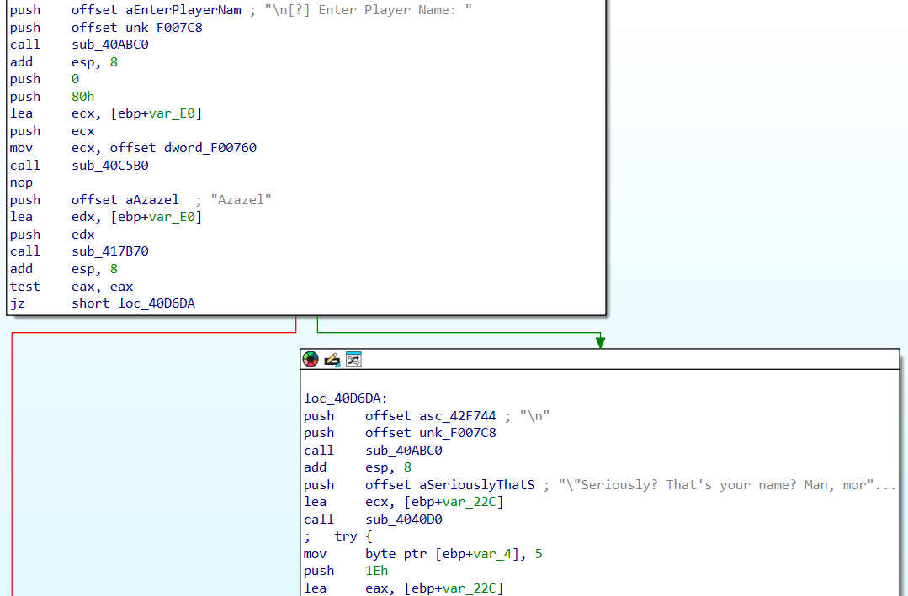
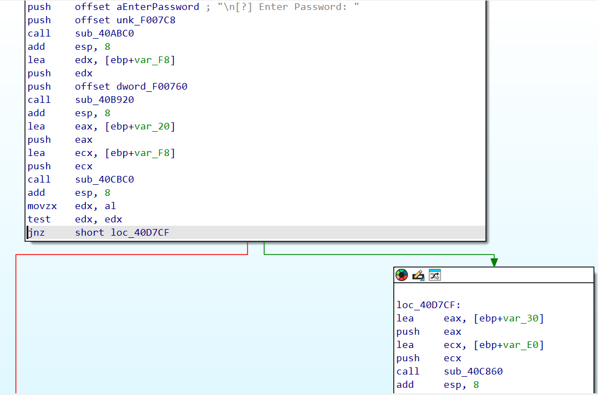
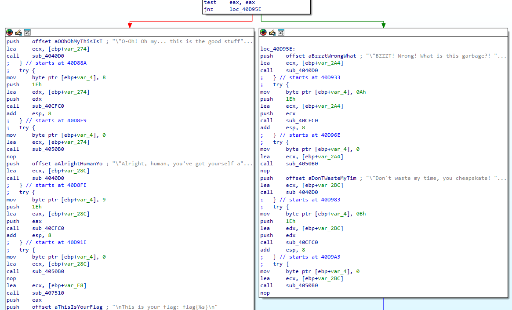
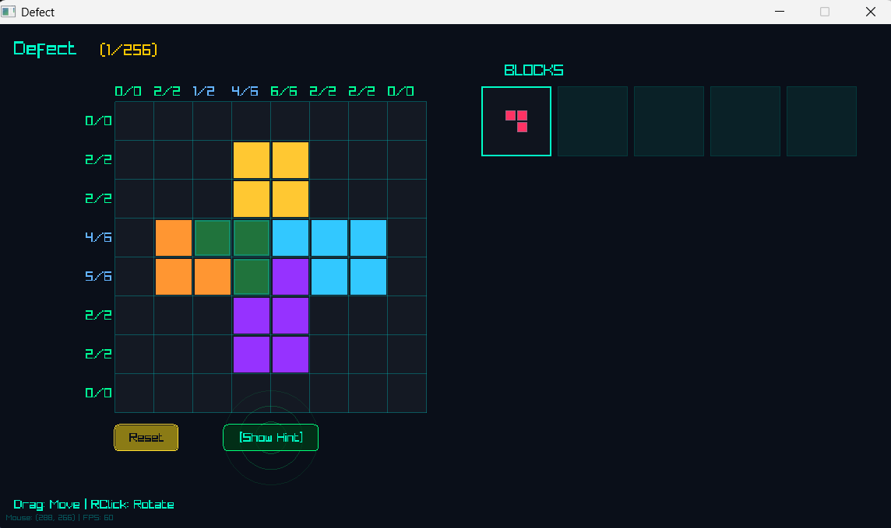
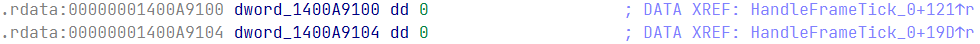
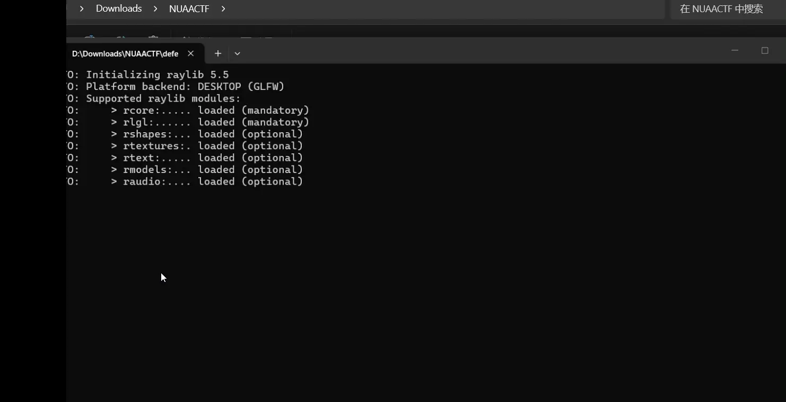

# This is a test

aaa

<!-- more -->

bbb


---

> 恶魔阿萨谢尔守护着通往flag的key，你可以解出吗？

下发文件只有一个 `Devil.exe`，先正常运行一遍：

```hl_lines="1"
"Keh keh keh... Finally, some fresh air! Who dares summon the Great Demon of Lust, Azazel Atsushi?!"
"...Wait a second. You aren't Akutabe, are you? Phew, thank the dark lord."
"Alright, listen up, human! You want a piece of my immense, terrifying, totally-not-a-mascot demonic power? Fine."
"First, I need to know whose soul I'm dealing with. Tell me your pathetic human name."
[?] Enter Player Name: Akutabe
```

随后程序退出。首先用 DIE 看看 exe 信息

```hl_lines="7"
PE32
操作系统: Windows(Vista)[I386, 32 位, 控制台]
链接程序: Microsoft Linker(14.36.35215)
编译器: Microsoft Visual C/C++(19.36.35215)[C++]
语言: C++
工具: Visual Studio(2022, v17.6)
(Heur)打包工具: Compressed or packed data[High entropy + Section 2 (".data") compressed]
```

看上去程序加壳了，但是用 IDA Pro 打开一遍发现没什么加壳迹象。直接开始分析

首先搜索 String 定位主程序逻辑，看到这里：



这里如果输入 Player Name 为 `Azazel`，可以进入后续的逻辑

接下来又是两处分支：





发现程序经过这两次跳转，可以尝试获得 Flag

一开始我认为 Flag 是通过程序内计算生成的，于是我对两次跳转进行了 Patch 操作，发现输出是这样的：

```
"Keh keh keh... Finally, some fresh air! Who dares summon the Great Demon of Lust, Azazel Atsushi?!"
"...Wait a second. You aren't Akutabe, are you? Phew, thank the dark lord."
"Alright, listen up, human! You want a piece of my immense, terrifying, totally-not-a-mascot demonic power? Fine."
"First, I need to know whose soul I'm dealing with. Tell me your pathetic human name."

[?] Enter Player Name: Azazel

"Seriously? That's your name? Man, mortals are so lame these days."
"Whatever. Now for the real deal. Hand over the secret password. And it better be as good as premium braised pig trotters!"

[?] Enter Password: 114514

...
"O-Oh! Oh my... this is the good stuff! Premium grade! Heh heh..."
"Alright, human, you've got yourself a deal. Welcome to the demonic pact..."

This is your flag: flag{114514}
```

发现 Password 就是最终的 Flag，因此还是需要深入程序细节

> 经过一番探索后发现 Ghidra 对这道题的程序的反编译效果更好，体现在 IDA Pro 会拆分出更多的子函数调用（比如一个 printf 操作能嵌套五六层函数），而 Ghidra 就能展开一些短函数
>
> 举个例子，以下是询问名称部分，Ghidra 的反编译结果：
>
> ```
> iVar4 = _strcmp(local_e4,"Azazel");
>   if (iVar4 == 0) { CORRECT BRANCH }
> ```
>
> 以下是 IDA Pro 给出的：
>
> ```
> sub_40C5B0(v27, 128, 0);
> if ( sub_417B70(v27, "Azazel") ) { WRONG BRANCH }
> ```
>
> 后面这个写法是个 AI 都会直接认为玩家名不能为 Azazel，但是 Ghidra 的写法就很明确（玩家名必须为 Azazel）

现在我们整理一下 `FUN_0040d290` 函数的逻辑（上面提到的主函数）

---

## 


### 故障机器人

> 正在启动.... 修复故障机器人以获得flag
>
> *TIP: flag为全小写*

本体是一个小游戏，看截图应该能够看出玩法。从程序来看，完成 256 关小游戏可以拿到 Flag



不妨用 Cheat Engine 改通过关卡数，发现最终的显示内容是【DATA CORRUPTED】以及下面的小字 "The layout stream failed validation."。这暗示程序解出 Flag 依赖中间的过关状态，这很棘手。赛场上应该是没有时间玩完这 256 关的，于是逆向启动（顺便先脱个 UPX 的壳），发现符号表全保留，很不错

跟着 `DATA CORRUPTED` 字符串搜索到 `RenderCompletionOverlay` 函数，推测 `Replay stream rebuilt successfully.` 时，输出的回放记录就是 Flag。从调用的 `RenderLayoutReplay` 函数来看，Flag 似乎是以字符画的形式逐个出现的

```c
if ( v33 )
{
    v7 = v15;
    v8 = v16;
    RenderLayoutReplay(a1, v36, &v7);
    v4 = (__m128i)*(unsigned int *)(a3 + 6216);
    *(float *)v4.m128i_i32 = *(float *)v4.m128i_i32 * 24.0;
    v35 = (int)floorf(COERCE_FLOAT(_mm_cvtsi128_si32(v4)));
    if ( v35 > *(unsigned __int8 *)(v36 + 2) )
        v35 = *(unsigned __int8 *)(v36 + 2);
    _mingw_sprintf(buf, "[replaying layout stream] %d/%d blocks", v35, *(unsigned __int8 *)(v36 + 2));
    v23 = MeasureText(buf, 16);
    DrawText((unsigned int)buf, (int)(float)(575.0 - (float)(v23 / 2)), (int)(float)(v29 + 360.0), 16, -16725761);
}
```

先 patch 通关逻辑试试，我们将：

```c title="CheckWinCondition"
__int64 __fastcall CheckWinCondition(__int64 a1)
{
    _DWORD v2[8]; // [rsp+20h] [rbp-50h] BYREF
    _DWORD v3[11]; // [rsp+40h] [rbp-30h] BYREF
    int i; // [rsp+6Ch] [rbp-4h]

    CalculateCurrentFills(a1, v3, v2);
    for ( i = 0; i <= 7; ++i )
    {
        if ( v3[i] != *(_DWORD *)(a1 + 4 * (i + 64LL)) )
            return 0;
        if ( v2[i] != *(_DWORD *)(a1 + 4 * (i + 72LL)) )
            return 0;
    }
    return 1;
}
```

打 patch 为：（我似乎很喜欢打 patch）

```c title="patched CheckWinCondition"
for ( i = 0; i <= 7; ++i )
{
    *(_DWORD *)(a1 + 4 * (i + 64LL)) = v3[i];
    *(_DWORD *)(a1 + 4 * (i + 72LL)) = v2[i];
}
return 1;
```

顺带将通关后的两秒钟延迟改一下



测试一下，发现依旧不通过（没有加速）



看来需要更加深入的分析。追踪那几个 Capsule 相关的函数，可以总结出：

- `InitCapsuleRuntime` 函数从 `CAPSULE_SEED` (`0x1400a8040`) 处复制内容到 `CapsuleRuntime`，同时还记录了每个关卡的数据偏移 `CAPSULE_LEVEL_OFFSETS`
- 总共只有不超过 16 关，在 `GeneratePuzzleFromPattern` 中有 `& 0xF` 的操作
    - `v44 = (char *)&_data_start__ + 256 * (unsigned __int64)(a2 & 0xF);`
    - 这说明写个视觉脚本把 256 关刷完也是可以的
- `HandleBoardChanged` → `CapsuleSyncLevel` 时，计算当前 8x8 grid 的 board mask，通过 XOR 检测变化，调用 `ApplyBoardDelta` 更新胶囊数据中对应关卡的棋盘状态
- `CapsulePrepareReveal` 进行打印回放数据前的验证，调用 `LayoutLoad` 从胶囊数据偏移 0x648 加载布局流，验证 CRC16，如果验证通过则说明打印流正确，可以输出 Flag 图像了

