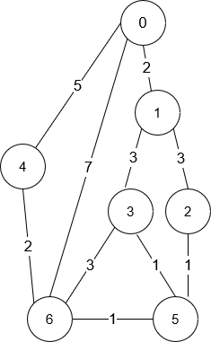

## A. 小蓝鲸破环路

--> 题目背景

小蓝鲸们居住不同的地点，其中某些地点之间有直接相连的道路，道路共有 $n$ 条。这些地点之间可以实现互通（不一定有直接的道路相连，只要互相间接通过道路可达即可）。现在已知存在冗余的道路，使得道路中存在一条环路。现在小蓝鲸们希望能找出一条道路，删除这条路，即可破掉这个环路。

--> 输入格式

第一行一个数字 $n$，表示道路的条数。接下来 $n$ 行每行两个整数 $u$ 和 $v$，表示小蓝鲸居住的地点 $u$ 和地点 $v$ 之间有一条直接相连的道路。

--> 输出格式

输出两个整数。表示删去后可以破坏掉环路的道路。有多个答案，则返回输入中最后出现的边。

--> 输入示例

```
5
5 2
2 3
3 4
5 4
5 6
```

--> 输出示例

```
5 4
```

> 解释：生成的图为
>
> ```
> 2----5-----6
> |    |
> |    |
> 3----4
> ```
>
> 5->2, 2->3, 3->4, 5->4 都可以破坏环路，但是 5->4 最后出现，所以输出 `5 4`

--> 数据规模与约定

$1 \leq u,v \leq 20000$

$1 \leq n \leq 2000$

时间限制：1s

空间限制：128MB

### Solution

对一个无向无环图持续加边，在不考虑重边的情况下，当新增的边 $(u,v)$ 的两个端点已经处于同一连通分量，说明第一次形成了环，我们输出这条导致成环的边即可（不需要再考虑之后的边）

使用并查集维护连通分量信息

```c++ title="Solution"
#include <iostream>
#define MAX_SIZE 20001
using namespace std;

int dsu[MAX_SIZE];
int find(int x){
	return (dsu[x] == x ? x : (dsu[x] = find(dsu[x])) );
}
void unite(int src, int dst) {
    dsu[find(src)] = find(dst);
}

void solve(){
	int n; cin >> n;
	for(int i = 0; i < MAX_SIZE; i++) dsu[i] = i;

	for(int i = 0; i < n; i++){
		int u, v; cin >> u >> v;
		if(find(u) != find(v)){
			unite(u,v);
		}
		else {
			cout << u << " " << v;
			return;
		}
	}
}


signed main(){
	ios::sync_with_stdio(false);
	cin.tie(0); cout.tie(0);
	
	int t; 
	// cin >> t;			// multi testcases
	t = 1;				// single testcase
	
	while (t--){
		solve();
	}
	return 0;
}

```

---

## B. 小蓝鲸坐飞机

--> 题目描述

小蓝鲸由于工作原因时常需要在 $n$ 个城市间周转（城市编号从为$0,1,...,n-1$），频繁的坐飞机让他感到疲惫不堪，因此他希望能找到最快从出发点到终点的飞机路线，每个航线由一个三元组描述$[from, to, time]$，其中 $from$ 代表出发点，$to$ 代表终点，而 $time$ 代表飞机所需要的时间。现在请你帮他规划一下吧！

给定出发城市 $src$ 和目的地 $dst$，现在需要你寻找出一条**最多**经过 $k$ 次中转的耗时最短的路线，输出所花费的总时间，如果不存在这样的路线，则返回 $-1$ 。 (本次不需要考虑等待时间，飞机起飞、降落时间等，你可以认为小蓝鲸到达一个地点后可以直接乘下一个飞机)

--> 输入格式

第一行三个正整数 $src$、$dst$、$k$，分别代表出发点、终点、中转次数限制。

第二行两个正整数 $n$、$m$ 分别代表城市个数和航线的个数。

接下来 $m$ 行每行三个正整数，分别代表出发点、终点、耗时。

--> 输出格式

一个数字，代表飞行的最短时间。

--> 样例数据

**input**

```
0 2 1
3 3
0 1 100
1 2 100
0 2 500
```

**output**

```
200
```

> 解释：
> 
> ```
>         0
>        / \
>    (100) (500)
>      /     \
>     1-(100)-2
> ```
> 
> 耗时最短到路线为 $0-1-2$，中转一次, 总时间为 $200$。

**input**

```
0 1 1
2 1
1 0 5
```

**output**

```
-1
```

> 解释：
> 
> ```
>     1 --(5)-- 0
> ```
> 
> 航线是单向的，因此没有从 $0$ 到 $1$ 的航线，输出 $-1$ 。

--> 数据规模与约定

$1 \leq n \leq 100$

$0 \leq m \leq (n * (n - 1)) / 2$

$0 \leq from, to \leq n-1$

$0 \leq src, dst, k\leq n-1$

航线没有重复，且不存在自环

时间限制：$1s$

空间限制：$128MB$

### Solution

<del>可以动态规划，但是我不会</del>

考虑 Bellman-Ford 算法，如果我们每一轮松弛只使用上一轮松弛得到的 `dis[u]`，那么 Bellman-Ford 算法有一个比较显然的性质：第 `i` 轮松弛可以得到最多使用 `i` 条边的最短路

以下是 Bellman-Ford 模板，改动的地方参考注释

```c++ title="Solution"
#include <iostream>
#include <cstring>
#include <queue>
#define MAX_VERTICES 101
#define INF 0x3f3f3f3f
using namespace std;

struct Edge{
	int u;
	int v;
	int w;
};

void solve(){
	int src, dst, k, n, m, ans = INF;
	cin >> src >> dst >> k >> n >> m;

	Edge* edges = new Edge[m];
	int* dis = new int[n];
	int* predis = new int[n];

	for(int i = 0; i < n; i++){
		dis[i] = predis[i] = INF;
	}

	dis[src] = 0;
	predis[src] = 0;
	
	for(int i = 0; i < m; i++){
		int u, v, w ; cin >> u >> v >> w;
		edges[i].u = u; edges[i].v = v; edges[i].w = w;
	}
	
    // k 次中转对应 k+1 条边 
	for(int i = 0; i <= k; i++){
        // 这里我们先备份上一轮的 dis[]，记为 predis[]
		memcpy(predis, dis, n * sizeof(int));
		for(int j = 0; j < m; j++){
			int u = edges[j].u, v = edges[j].v, w = edges[j].w;
            // 这里采用 predis[u]，确保用于本轮松弛的所有最短路数据全部基于上一轮松弛
            // 否则后更新的 dis[v] 如果采用本轮先更新过的 dis[u]，
            // 对应的路径的边数会多于 i 条
			if(predis[u] != INF && predis[u] + w < dis[v]){
				dis[v] = predis[u] + w;
				if(v == dst) ans = min(ans, dis[v]);
			}
		}
	}
	cout << (ans == INF ? -1 : ans);

	delete[] edges;
	delete[] predis;
	delete[] dis;
}


signed main(){
	ios::sync_with_stdio(false);
	cin.tie(0); cout.tie(0);
	
	int t; 
	// cin >> t;			// multi testcases
	t = 1;				// single testcase
	
	while (t--){
		solve();
	}
	return 0;
}

```

---

## C. 小蓝鲸返乡

--> 题目描述

小蓝鲸接到了学校的通知，准备启程回家，小蓝鲸研究了一下从学校到家的路线，画了一张交通地图。图中有 $n$ 个城市，城市的编号为 $0$ 到 $n - 1$，学校为编号 $0$ 的节点，家所在的城市编号为 $n-1$。城市之间均为**双向**道路。这份交通图保证可以从任意城市出发到达其他任意城市，且任意两个城市之间最多有一条路。

给你一个整数 $n$ 和二维整数数组 $roads$，其中 $roads[i] = [u_i, v_i, time_i]$ 表示在城市 $u_i$ 和 $v_i$ 之间有一条需要花费 $time_i$ 时间才能通过的道路。你想知道花费**最少时间**从学校 $0$ 出发到达家 $n - 1$ 的方案数。

请返回花费最少时间到达目的地的路径数目。由于答案可能很大，将结果对 $10^9 + 7$ 取余后返回。

--> 输入格式

第一行两个数字 $n$, $m$ , 分别表示城市的数量和道路的条数。

接下来 $m$ 行每行三个整数 $u,v,time$，表示城市 $u$ 和城市 $v$ 之间有一条通行时间为 $time$ 的道路。

--> 输出格式

输出一个整数，表示花费最短时间的路径有多少条。

--> 样例数据

**input 1**

```
7 10
0 6 7
0 1 2
1 2 3
1 3 3
6 3 3
3 5 1
6 5 1
2 5 1
0 4 5
4 6 2
```

**output 2**

```
4
```

> **解释**:
>
> ```
> n = 7, m = 10,
> roads = [[0,6,7],[0,1,2],[1,2,3],[1,3,3],[6,3,3],[3,5,1],[6,5,1],[2,5,1],[0,4,5],[4,6,2]]
> ```
>
> 对应的图如下：
>
>  
>
> 从节点 0 出发到 6 花费的最少时间是 7 分钟。 四条花费 7 分钟的路径分别为：
>
> - 0 ➝ 6
> - 0 ➝ 4 ➝ 6
> - 0 ➝ 1 ➝ 2 ➝ 5 ➝ 6
> - 0 ➝ 1 ➝ 3 ➝ 5 ➝ 6

**input 2**

```
2 1
1 0 10
```

**output 2**

```
1
```

> **解释**：只有一条从 0 到 1 的路，花费 10 分钟。

--> 数据规模及限制

- $1 \leq n \leq 200$
- $n - 1 \leq roads.length \leq n \times (n - 1) / 2$
- $roads[i].length == 3$
- $0 \leq u_i, v_i \leq n - 1$
- $1 \leq time_i \leq 10^9$
- $u_i \neq v_i$
- 时间: 1s
- 空间: 128MB

### Solution

首先给出一个结论：最短路的子路径也是最短路

假设有 $x_1,\cdots,x_n$ 这 $n$ 个节点可以一步抵达 $dst$，并且都满足 $dis(src \to x_i) + w(x_i \to dst)$ 是 $src \to dst$ 的最短路，那么 $dst$ 的最短路条数等于 $\sum x_i$ 的最短路条数。对每一个点都如此处理，就可以递推得到正确答案

因为 Dijkstra 是对点扩张的，每次确认一个顶点的最短路，这非常符合我们的思路。考虑对 Dijkstra 算法进行改造，每次往外扩张节点时维护起点到每个点的最短路径数 `way[n]` 

（除了添加了 `way[]` 的更新逻辑，其他地方和原版 Dijkstra 没区别）

```c++ title="Solution"
#include <iostream>
#define MAX_VERTICES (201)
#define INF (0x7fffffff)
#define MOD (1000000007)

using namespace std;

int graph[MAX_VERTICES][MAX_VERTICES] = {0};

void solve(){
	int n,m; cin >> n >> m;
	
	for(int i = 0; i < m; i++){
		int u,v,w; cin >> u >> v >> w;
		graph[u][v] = graph[v][u] = w;
	}

	int* dis = new int[n];
	int* way = new int[n];
	bool* vis = new bool[n];
	for(int i = 0; i < n; i++){
		dis[i] = INF;
		way[i] = 0;
		vis[i] = false;
	}
	dis[0] = 0; way[0] = 1;

	for(int i = 0; i < n; i++){
		int u = -1;
        // 不想堆优化了
		for(int j = 0; j < n; j++){
			if(!vis[j] && (u == -1 || dis[j] < dis[u])) u = j;
		}

		if (u == -1 || dis[u] == INF) break;

		vis[u] = true;

		for(int v = 0; v < n; v++){
			if(graph[u][v] != 0){
				if(!vis[v] && dis[u] + graph[u][v] < dis[v]){
					dis[v] = dis[u] + graph[u][v];
                    // 更新最短路时也重置最短路个数
					way[v] = way[u];
				}
                // u 是已经确认最短路的点
                // u->v 的距离加上 dis[u] 恰好为 dis[v]
                // 最短路个数增加（题目要求取模）
				else if(dis[u] + graph[u][v] == dis[v]){
					way[v] = (way[v] + way[u]) % MOD;
				}
			}
		}
	}
	cout << way[n-1];
}


signed main(){
	ios::sync_with_stdio(false);
	cin.tie(0); cout.tie(0);
	
	int t; 
	// cin >> t;			// multi testcases
	t = 1;				// single testcase
	
	while (t--){
		solve();
	}
	return 0;
}
```
