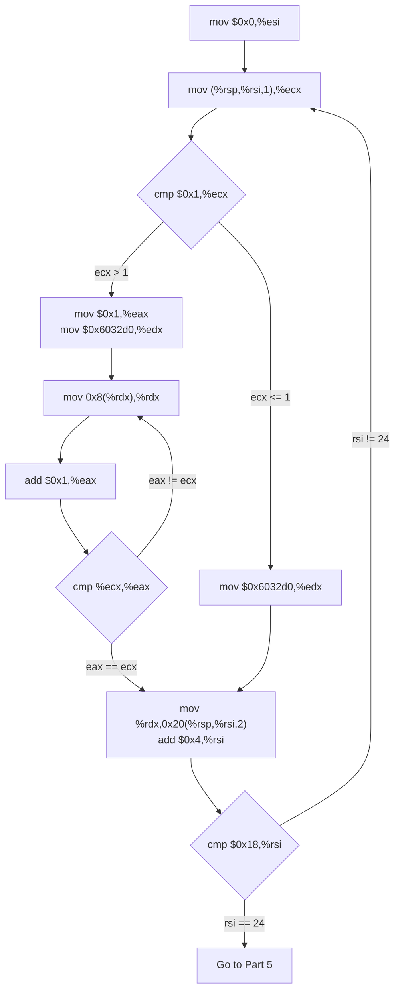
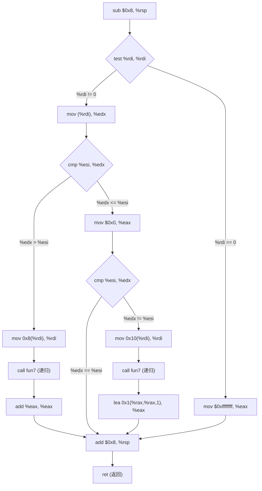
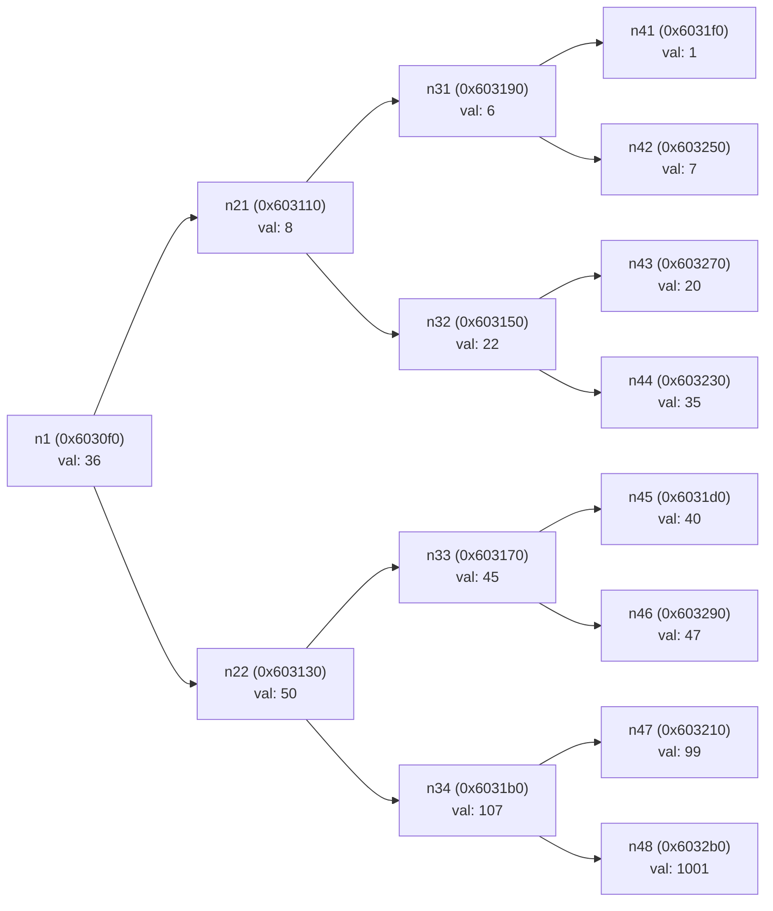

# CSAPP Bomblab Solution

二进制炸弹 `Bomb` 是一个由多个阶段组成的程序，每个阶段会要求用户在 `stdin` 输入特定字符串。若输入正确，该阶段即被拆除并进入下一阶段；否则程序将输出"BOOM! ! ! "后终止（即炸弹爆炸）。只有当所有阶段均被拆除后，炸弹才算彻底解除。

!!! quote "随笔"

    暑假写 Bomblab 的时候我只接触过 RISC-V 的汇编语言，没有 i386 汇编的阅读经验。因此这篇题解的语言比较细碎，并且对于 “寄存器存储值” 与 “寄存器存储地址指向值” 的概念有些区分不清（希望不会过度影响理解）
    
    相比之下，Binalab 的题解显得更加熟练

---

## Solution

为了锻炼个人阅读 x86-64 汇编代码的能力，我采用的拆弹方案是直接分析反汇编代码，因此下面的操作将很少使用 gdb 工具

在进行对 `bomb` 的反编译之前，可以看一看旁边的 `bomb.c` 文件（这是一个提示作用的文件，展示了原程序 `<main>` 函数的流程），这个C程序告诉我们 `bomb` 的运行方式，比如：

```C
input = read_line();				/* Get input                   */
phase_1(input);						/* Run the phase               */
phase_defused();					/* Drat!  They figured it out!
									 * Let me know how they did it. */
printf("Phase 1 defused. How about the next one?\n");
```

另外最后的注释说明也暗示了总共不只有六个 bomb 需要拆除：

```c
/* Wow, they got it!  But isn't something... missing?  Perhaps
 * something they overlooked?  Mua ha ha ha ha! */
```

`❯ objdump bomb -d -j .text` 开始拆弹（反编译代码段），可以看到很多标记点，而我们目前需要关注的只有 `<main>` 部分和 `<phase>` 部分。其中 `main` 部分从 `bomb.c` 文件中就能理解意思（初始化炸弹，检测输入判断炸弹是否爆炸等等），所以直接看六个阶段的汇编代码即可：

（有趣的是有一个 `<secret_phase>` 标记点，这对应了 `bomb.c` 中暗示的隐藏炸弹）

---

### Phase 1

```asm
000000000400ee0 <phase_1>:
  400ee0:	48 83 ec 08          	sub    $0x8,%rsp					# 栈上分配 8byte 的空间（起对齐作用）
  400ee4:	be 00 24 40 00       	mov    $0x402400,%esi				# 将 0x402400 这个地址加载到 %esi 中
  400ee9:	e8 4a 04 00 00       	call   401338 <strings_not_equal>	# 调用执行 strings_not_equal 函数
  400eee:	85 c0                	test   %eax,%eax					# 计算 %eax & %eax，不保存结果，目的是改变标志位
  400ef0:	74 05                	je     400ef7 <phase_1+0x17>		# 当标志位 ZF==1 时跳转到 400ef7 （表示拆弹成功）
  400ef2:	e8 43 05 00 00       	call   40143a <explode_bomb>		# BOOM!!!
  400ef7:	48 83 c4 08          	add    $0x8,%rsp					# 释放栈空间
  400efb:	c3                   	ret									# 结束子程序
  
0000000000401338 <strings_not_equal>: # 比较 %rdi 与 %rsi 指向的字符串是否不相等，不相等则返回 1，反之返回 0，此处反编译代码略
```

`strings_not_equal` 比较的是输入 `%rdi` 和 `%rsi` 指向的字符串是否不相同，而两个相同的输入可以触发 `je` 的跳转避免炸弹爆炸

（标志位就是条件码）

`400ee4` 处 `%esi` 被赋值为 `$0x402400` 的字符串，在gdb环境中对这个地址查看存储的字符串内容：

```bash
❯ gdb ./bomb
GNU gdb (Ubuntu 12.1-0ubuntu1~22.04.2) 12.1
(gdb) x/s 0x402400
0x402400:	"Border relations with Canada have never been better."
```

得到了第一个答案：`Border relations with Canada have never been better.`

!!! tip "gdb 的 `x` 命令（e**X**amine memory）用于查看内存中的数据"

    ```bash
    x/[N][F][U] <address>
    ```
    
    **`N`**：显示的单位数量（可选，默认为1）。
    
    **`F`**：显示格式（如十六进制、十进制、字符串等）。
    
    **`U`**：单位大小（如字节、字、双字等）。
    
    **`<address>`**：内存地址（可以是寄存器、变量名或直接地址）。

### Phase 2

```asm
0000000000400efc <phase_2>:
  400efc:	55                   	push   %rbp
  400efd:	53                   	push   %rbx							# 被调用者保存寄存器
  400efe:	48 83 ec 28          	sub    $0x28,%rsp					# 开辟栈空间
  400f02:	48 89 e6             	mov    %rsp,%rsi
  400f05:	e8 52 05 00 00       	call   40145c <read_six_numbers>	# 表明密码是六个（整）数
  400f0a:	83 3c 24 01          	cmpl   $0x1,(%rsp) 					# 根据 (%rsp) - 1 改变标志位
  400f0e:	74 20                	je     400f30 <phase_2+0x34> 		# 如果相等就跳转，否则下一步 BOOM!
  400f10:	e8 25 05 00 00       	call   40143a <explode_bomb>		# BOOM!
  400f15:	eb 19                	jmp    400f30 <phase_2+0x34>		# 无条件跳转
  400f17:	8b 43 fc             	mov    -0x4(%rbx),%eax				# 从 400f3a 跳转；将 (%rbx-4) 处数据存入 %eax
  400f1a:	01 c0                	add    %eax,%eax					# %eax *= 2
  400f1c:	39 03                	cmp    %eax,(%rbx)					# 根据(%rbx) - %eax 设置标志位
  400f1e:	74 05                	je     400f25 <phase_2+0x29>		# 如果相等就跳转，否则下一步 BOOM!
  400f20:	e8 15 05 00 00       	call   40143a <explode_bomb> 		# BOOM!
  400f25:	48 83 c3 04          	add    $0x4,%rbx					# 从 400f1e 跳转；%rbx+=4
  400f29:	48 39 eb             	cmp    %rbp,%rbx					# 根据 %rbx - %rbp 改变标志位
  400f2c:	75 e9                	jne    400f17 <phase_2+0x1b>		# 如果不相等就跳转回上一次跳转点（一次循环）
  400f2e:	eb 0c                	jmp    400f3c <phase_2+0x40>		# 无条件跳转，表示拆弹成功
  400f30:	48 8d 5c 24 04       	lea    0x4(%rsp),%rbx				# 从 400f0e 跳转；%rbx = %rsp+4
  400f35:	48 8d 6c 24 18       	lea    0x18(%rsp),%rbp				# %rbp = %rsp + 0x18
  400f3a:	eb db                	jmp    400f17 <phase_2+0x1b>		# 无条件跳转
  400f3c:	48 83 c4 28          	add    $0x28,%rsp
  400f40:	5b                   	pop    %rbx
  400f41:	5d                   	pop    %rbp
  400f42:	c3                   	ret

000000000040145c <read_six_numbers>: # 读取六个数
... ...
  401480:	be c3 25 40 00       	mov    $0x4025c3,%esi
... ...
# (gdb) x/s 0x4025c3
# 0x4025c3:	"%d %d %d %d %d %d"
# 说明读取的是整数，数字之间用空格分隔
```

首先看最开始的这一部分：

```asm
  400f0a:	83 3c 24 01          	cmpl   $0x1,(%rsp) 					# 根据 (%rsp) - 1 改变标志位
  400f0e:	74 20                	je     400f30 <phase_2+0x34> 		# 如果相等就跳转，否则下一步 BOOM!
  400f10:	e8 25 05 00 00       	call   40143a <explode_bomb>		# BOOM!
```

很明显，第一个数字要输入 `1` ，否则炸弹爆炸

然后看这一部分

```asm
  400f30:	48 8d 5c 24 04       	lea    0x4(%rsp),%rbx				# 从 400f0e 跳转；%rbx = %rsp+4
  400f35:	48 8d 6c 24 18       	lea    0x18(%rsp),%rbp				# %rbp = %rsp + 0x18
  400f3a:	eb db                	jmp    400f17 <phase_2+0x1b>		# 无条件跳转
```

这里程序设定了 `%rbx` 存储第二个数字**的地址**，`%rbp` 为第六个数字之后**的地址**（`0x18` = 24 = 6 int），接着跳转到一个循环部分

结合后面的程序可以看得出来，这段代码可以类比 `for (int i = 1; i < 6; i++)` 的前两个参数设置

接着是这一部分，看上去是个有限循环

```asm
  400f17:	8b 43 fc             	mov    -0x4(%rbx),%eax				# 从 400f3a 跳转；将 (%rbx-4) 处数据存入 %eax
  400f1a:	01 c0                	add    %eax,%eax					# %eax *= 2
  400f1c:	39 03                	cmp    %eax,(%rbx)					# 根据(%rbx) - %eax 设置标志位
  400f1e:	74 05                	je     400f25 <phase_2+0x29>		# 如果相等就跳转，否则下一步 BOOM!
  400f20:	e8 15 05 00 00       	call   40143a <explode_bomb> 		# BOOM!
  400f25:	48 83 c3 04          	add    $0x4,%rbx					# 从 400f1e 跳转；%rbx+=4
  400f29:	48 39 eb             	cmp    %rbp,%rbx					# 根据 %rbx - %rbp 改变标志位
  400f2c:	75 e9                	jne    400f17 <phase_2+0x1b>		# 如果不相等就跳转回上一次跳转点（一次循环）
  400f2e:	eb 0c                	jmp    400f3c <phase_2+0x40>		# 无条件跳转，表示拆弹成功
```

这里直接写出对应的 C 语言代码了，其中规定 `%rsp` 开始的六个数字组成数组 `stack[6]` ，`%rbx + 4` 表示 `i++` 

```C
for (int i = 1; i < 6; i++){
	int EAX = stack[i-1];												// EAX 为 “上一个数字”
	EAX *= 2;															// EAX 为 “上一个数字” 的两倍
	if(stack[i] - EAX == 0){											// ZF == 1 ?
	continue;															// 跳过引爆炸弹的函数
    }
    explode_bomb();
}
```

由此可见，接下来的五个数字都要求每个数字是上一个数字的两倍，因此第二个答案是 `1 2 4 8 16 32` 

### Phase 3

```asm
0000000000400f43 <phase_3>:
  400f43:	48 83 ec 18          	sub    $0x18,%rsp					# 开辟栈空间
  400f47:	48 8d 4c 24 0c       	lea    0xc(%rsp),%rcx				# %rcx = %rsp + 12（地址计算）
  400f4c:	48 8d 54 24 08       	lea    0x8(%rsp),%rdx				# %rdx = %rsp + 8（地址计算）
  400f51:	be cf 25 40 00       	mov    $0x4025cf,%esi				# (gdb) x/s 0x4025cf: "%d %d", 赋值给 %esi
  400f56:	b8 00 00 00 00       	mov    $0x0,%eax					# %eax = 0
  400f5b:	e8 90 fc ff ff       	call   400bf0 <__isoc99_sscanf@plt>	# 调用标准库函数 sscanf，读取的内容参见 0x4025cf
  400f60:	83 f8 01             	cmp    $0x1,%eax					# 比较 %eax ~ 1
  400f63:	7f 05                	jg     400f6a <phase_3+0x27>		# 有符号 “大于” 成立则跳过引爆代码，否则 BOOM!
  400f65:	e8 d0 04 00 00       	call   40143a <explode_bomb>		# BOOM!
  400f6a:	83 7c 24 08 07       	cmpl   $0x7,0x8(%rsp)				# 比较 (%rsp + 8) ~ 7
  400f6f:	77 3c                	ja     400fad <phase_3+0x6a>		# 无符号 “大于” 成立则跳转至引爆代码，否则继续向下运行
  
  400f71:	8b 44 24 08          	mov    0x8(%rsp),%eax				# %eax = %rsp + 8
  400f75:	ff 24 c5 70 24 40 00 	jmp    *0x402470(,%rax,8)			# 这里是间接跳转中的跳转表跳转，是 switch 语句的实现
  400f7c:	b8 cf 00 00 00       	mov    $0xcf,%eax					# %eax = 207
  400f81:	eb 3b                	jmp    400fbe <phase_3+0x7b>
  400f83:	b8 c3 02 00 00       	mov    $0x2c3,%eax					# %eax = 707
  400f88:	eb 34                	jmp    400fbe <phase_3+0x7b>
  400f8a:	b8 00 01 00 00       	mov    $0x100,%eax					# %eax = 256
  400f8f:	eb 2d                	jmp    400fbe <phase_3+0x7b>
  400f91:	b8 85 01 00 00       	mov    $0x185,%eax					# %eax = 389
  400f96:	eb 26                	jmp    400fbe <phase_3+0x7b>
  400f98:	b8 ce 00 00 00       	mov    $0xce,%eax					# %eax = 206
  400f9d:	eb 1f                	jmp    400fbe <phase_3+0x7b>
  400f9f:	b8 aa 02 00 00       	mov    $0x2aa,%eax					# %eax = 682
  400fa4:	eb 18                	jmp    400fbe <phase_3+0x7b>
  400fa6:	b8 47 01 00 00       	mov    $0x147,%eax					# %eax = 327
  400fab:	eb 11                	jmp    400fbe <phase_3+0x7b>
  400fad:	e8 88 04 00 00       	call   40143a <explode_bomb>		# BOOM!
  400fb2:	b8 00 00 00 00       	mov    $0x0,%eax					# %eax = 0
  400fb7:	eb 05                	jmp    400fbe <phase_3+0x7b>
  400fb9:	b8 37 01 00 00       	mov    $0x137,%eax					# %eax = 311
  
  400fbe:	3b 44 24 0c          	cmp    0xc(%rsp),%eax				# 比较 %eax ~ (%rsp + 12)
  400fc2:	74 05                	je     400fc9 <phase_3+0x86>		# 若 “相等” 成立则成功拆弹
  400fc4:	e8 71 04 00 00       	call   40143a <explode_bomb>		# BOOM!
  400fc9:	48 83 c4 18          	add    $0x18,%rsp
  400fcd:	c3                   	ret    
```

先看第一部分：

```asm
  400f43:	48 83 ec 18          	sub    $0x18,%rsp					# 开辟栈空间
  400f47:	48 8d 4c 24 0c       	lea    0xc(%rsp),%rcx				# %rcx = %rsp + 12
  400f4c:	48 8d 54 24 08       	lea    0x8(%rsp),%rdx				# %rdx = %rsp + 8
  400f51:	be cf 25 40 00       	mov    $0x4025cf,%esi				# (gdb) x/s 0x4025cf: "%d %d", 赋值给 %esi
  400f56:	b8 00 00 00 00       	mov    $0x0,%eax					# %eax = 0
  400f5b:	e8 90 fc ff ff       	call   400bf0 <__isoc99_sscanf@plt>	# 调用标准库函数 sscanf，读取的内容参见 0x4025cf
  400f60:	83 f8 01             	cmp    $0x1,%eax					# 比较 %eax ~ 1
  400f63:	7f 05                	jg     400f6a <phase_3+0x27>		# 有符号 “大于” 成立则跳过引爆代码，否则 BOOM!
  400f65:	e8 d0 04 00 00       	call   40143a <explode_bomb>		# BOOM!
  400f6a:	83 7c 24 08 07       	cmpl   $0x7,0x8(%rsp)				# 比较 (%rsp + 8) ~ 7
  400f6f:	77 3c                	ja     400fad <phase_3+0x6a>		# 无符号 “大于” 成立则跳转至引爆代码，否则继续向下运行
```

`mov $0x4025cf,%esi`  这一句可以知道需要读取的是两个整数

!!! tip "About `sscanf`"
    
    `sscanf` 的函数原型中，第一个参数 `%rdi` 是输入字符串的指针，第二个参数是格式字符串的指针，这里也就是 `0x4025cf` 的内容； `%rdx` 与 `%rcx` 分别存储第一个、第二个结果的地址（之后的参数依次 `r8` 和 `r9` 存储，接着会使用栈传递）
    
    因此两个 `lea` 语句看似没有作用，实则表示了两个整数的地址

`%eax` 根据约定被设定为 `sscanf` 的返回值，`400f60 ~ 400f65` 的判断跳转说明 “如果 `%eax` 的值，也就是输入的整数个数没达到 2 个，直接引爆炸弹”

接下来 `cmpl $0x7,0x8(%rsp)` 及其后面的跳转表明：第一个数（也就是 `0x8(%rsp)` , 也就是 `%rdx` 的对应值）必须 `<= 7` ，否则炸弹爆炸（因为是无符号比较，所以负数输入都不正确）

总结：需要输入两个数；第一个数不能超过 `7` 

再看第二部分：

```asm
  400f71:	8b 44 24 08          	mov    0x8(%rsp),%eax				# %eax = %rsp + 8
  400f75:	ff 24 c5 70 24 40 00 	jmp    *0x402470(,%rax,8)			# 这里是间接跳转中的跳转表跳转，是 switch 语句的实现
  400f7c:	b8 cf 00 00 00       	mov    $0xcf,%eax					# %eax = 207
  400f81:	eb 3b                	jmp    400fbe <phase_3+0x7b>
  400f83:	b8 c3 02 00 00       	mov    $0x2c3,%eax					# %eax = 707
  400f88:	eb 34                	jmp    400fbe <phase_3+0x7b>
  400f8a:	b8 00 01 00 00       	mov    $0x100,%eax					# %eax = 256
  400f8f:	eb 2d                	jmp    400fbe <phase_3+0x7b>
  400f91:	b8 85 01 00 00       	mov    $0x185,%eax					# %eax = 389
  400f96:	eb 26                	jmp    400fbe <phase_3+0x7b>
  400f98:	b8 ce 00 00 00       	mov    $0xce,%eax					# %eax = 206
  400f9d:	eb 1f                	jmp    400fbe <phase_3+0x7b>
  400f9f:	b8 aa 02 00 00       	mov    $0x2aa,%eax					# %eax = 682
  400fa4:	eb 18                	jmp    400fbe <phase_3+0x7b>
  400fa6:	b8 47 01 00 00       	mov    $0x147,%eax					# %eax = 327
  400fab:	eb 11                	jmp    400fbe <phase_3+0x7b>
  400fad:	e8 88 04 00 00       	call   40143a <explode_bomb>		# BOOM!
  400fb2:	b8 00 00 00 00       	mov    $0x0,%eax					# %eax = 0
  400fb7:	eb 05                	jmp    400fbe <phase_3+0x7b>
  400fb9:	b8 37 01 00 00       	mov    $0x137,%eax					# %eax = 311
```

第一步 `mov 0x8(%rsp),%eax` 把第一个输入的数字复制到了 `%eax` 

接下来关键的一步 `jmp *0x402470(,%rax,8)` 是跳转表跳转。使用 `gdb x` 查看跳转表内容

```bash
(gdb) x/8gx 0x402470	# 以双字为单位，显示 8 个连续的十六进制数值（考虑到 %rdx 值 <= 7，显示 8 个值足够）
0x402470:	0x0000000000400f7c	0x0000000000400fb9
0x402480:	0x0000000000400f83	0x0000000000400f8a
0x402490:	0x0000000000400f91	0x0000000000400f98
0x4024a0:	0x0000000000400f9f	0x0000000000400fa6
```

`*0x402470(,%rax,8)` 表示内存间接寻址，可以理解为以 `0x402470` 为基址，加上 `%rax` 个 `64bit` 的偏移量，比如 `%rax` 为 `1` 时，就跳转到 `400fb9` 

不妨就以输入的第一个数字为 `1` 为例，此时 `%eax` 被赋值为 `311` 

最后看第三部分：

```asm
  400fbe:	3b 44 24 0c          	cmp    0xc(%rsp),%eax				# 比较 %eax ~ (%rsp + 12)
  400fc2:	74 05                	je     400fc9 <phase_3+0x86>		# 若 “相等” 成立则成功拆弹
  400fc4:	e8 71 04 00 00       	call   40143a <explode_bomb>		# BOOM!
  400fc9:	48 83 c4 18          	add    $0x18,%rsp
  400fcd:	c3                   	ret    
```

简单来说就是：如果上一部分设定的 `%eax` 与第二个输入相等就解除炸弹，否则引爆。比如 `%rdx` 值为 `1` 时，必须有 `%rcx` 值为 `311` 。也就是说跳转表决定了共计 8 个 `%rdx` 输入对应的唯一的 `%rcx` ：

<table>
    <tr>
        <td>%rdx</td>
        <td>0</td>
        <td>1</td>
        <td>2</td>
        <td>3</td>
        <td>4</td>
        <td>5</td>
        <td>6</td>
        <td>7</td>
    </tr>
    <tr>
        <td>%rcx</td>
        <td>207</td>
        <td>311</td>
        <td>707</td>
        <td>256</td>
        <td>389</td>
        <td>206</td>
        <td>682</td>
        <td>327</td>
    </tr>
</table>

在上面的组合中随意选择一项作为答案就可以拆除第三个炸弹，比如 `2 707` 

### Phase 4

（减少了注释量）

```asm
000000000040100c <phase_4>:
  40100c:	48 83 ec 18          	sub    $0x18,%rsp
  401010:	48 8d 4c 24 0c       	lea    0xc(%rsp),%rcx
  401015:	48 8d 54 24 08       	lea    0x8(%rsp),%rdx
  40101a:	be cf 25 40 00       	mov    $0x4025cf,%esi
  40101f:	b8 00 00 00 00       	mov    $0x0,%eax
  401024:	e8 c7 fb ff ff       	call   400bf0 <__isoc99_sscanf@plt>
  401029:	83 f8 02             	cmp    $0x2,%eax
  40102c:	75 07                	jne    401035 <phase_4+0x29>
  40102e:	83 7c 24 08 0e       	cmpl   $0xe,0x8(%rsp)
  401033:	76 05                	jbe    40103a <phase_4+0x2e>
  401035:	e8 00 04 00 00       	call   40143a <explode_bomb>
  
  40103a:	ba 0e 00 00 00       	mov    $0xe,%edx
  40103f:	be 00 00 00 00       	mov    $0x0,%esi
  401044:	8b 7c 24 08          	mov    0x8(%rsp),%edi
  401048:	e8 81 ff ff ff       	call   400fce <func4>
  40104d:	85 c0                	test   %eax,%eax
  40104f:	75 07                	jne    401058 <phase_4+0x4c>
  401051:	83 7c 24 0c 00       	cmpl   $0x0,0xc(%rsp)
  401056:	74 05                	je     40105d <phase_4+0x51>
  401058:	e8 dd 03 00 00       	call   40143a <explode_bomb>
  40105d:	48 83 c4 18          	add    $0x18,%rsp
  401061:	c3                   	ret    
```

先看这部分：

```asm
  40100c:	48 83 ec 18          	sub    $0x18,%rsp
  401010:	48 8d 4c 24 0c       	lea    0xc(%rsp),%rcx
  401015:	48 8d 54 24 08       	lea    0x8(%rsp),%rdx
  40101a:	be cf 25 40 00       	mov    $0x4025cf,%esi				# (gdb) x/s 0x4025cf: "%d %d", 赋值给 %esi
  40101f:	b8 00 00 00 00       	mov    $0x0,%eax
  401024:	e8 c7 fb ff ff       	call   400bf0 <__isoc99_sscanf@plt>
  401029:	83 f8 02             	cmp    $0x2,%eax
  40102c:	75 07                	jne    401035 <phase_4+0x29>
  40102e:	83 7c 24 08 0e       	cmpl   $0xe,0x8(%rsp)
  401033:	76 05                	jbe    40103a <phase_4+0x2e>
  401035:	e8 00 04 00 00       	call   40143a <explode_bomb>
```

这一部分和上一阶段几乎一样：读取两个整数；如果输入的整数个数不为 `2` 则爆炸，否则让第一个数字与 `14` 比较，如果第一个数字 `<= 14` 则跳转至下一部分（因为是无符号比较，所以负数输入都不正确），否则炸弹爆炸

于是我们知道了答案是两个数字，并且第一个数字是不超过 `14` 的非负数 

再看另一部分：

```asm
  40103a:	ba 0e 00 00 00       	mov    $0xe,%edx
  40103f:	be 00 00 00 00       	mov    $0x0,%esi
  401044:	8b 7c 24 08          	mov    0x8(%rsp),%edi
  401048:	e8 81 ff ff ff       	call   400fce <func4>			# 调用一个神秘函数
  40104d:	85 c0                	test   %eax,%eax				# 只有返回值 %eax == 0 时使 ZF 置 1，和下一条指令结合使用
  40104f:	75 07                	jne    401058 <phase_4+0x4c>	# ZF == 0 时跳转爆炸，也就是说 func4 的返回值必须是 0
  401051:	83 7c 24 0c 00       	cmpl   $0x0,0xc(%rsp)			# 第二个数与 0 比较
  401056:	74 05                	je     40105d <phase_4+0x51>	# 第二个数如果等于 0 ，则解除炸弹，否则引爆
  401058:	e8 dd 03 00 00       	call   40143a <explode_bomb>
  40105d:	48 83 c4 18          	add    $0x18,%rsp
  401061:	c3                   	ret  
```

将 `%esi` 与 `%edx` 分别设置为 `0` 和 `14`，`%edi` 设置为第一个输入，然后调用 `func4` 函数，当且仅当返回值为 `0` 并且第二个输入的数为 `0` 时解除炸弹

现在来看 `func4` ：（`%rdx` 与 `%rcx` 分别储存了两个输入的数的地址而不是值；`%edi` 储存了第一个数的值）

```asm
0000000000400fce <func4>:
  400fce:	48 83 ec 08          	sub    $0x8,%rsp				# 开辟了一个 int 大小的栈空间
  400fd2:	89 d0                	mov    %edx,%eax				# %eax = %edx
  400fd4:	29 f0                	sub    %esi,%eax				# %eax -= %esi 
  400fd6:	89 c1                	mov    %eax,%ecx				# %ecx = %eax
  400fd8:	c1 e9 1f             	shr    $0x1f,%ecx				# %ecx 逻辑右移 31 位，也就是取符号位
  400fdb:	01 c8                	add    %ecx,%eax				# %eax += %ecx
  400fdd:	d1 f8                	sar    %eax						# %eax 算术右移 1 位，也就是 %eax // 2
  400fdf:	8d 0c 30             	lea    (%rax,%rsi,1),%ecx		# %ecx = %rax + %rsi （地址计算）
  
  400fe2:	39 f9                	cmp    %edi,%ecx				# 比较 %ecx ~ %edi
  400fe4:	7e 0c                	jle    400ff2 <func4+0x24>		# 如果 <= 成立就跳转至 400ff2，否则继续
  # 在 %ecx > %edi （值比较）情况下
  400fe6:	8d 51 ff             	lea    -0x1(%rcx),%edx			# %edx = %rcx - 1（地址计算）
  400fe9:	e8 e0 ff ff ff       	call   400fce <func4>			# 递归调用自身！
  400fee:	01 c0                	add    %eax,%eax				# %eax *= 2，也就是返回值乘以 2
  400ff0:	eb 15                	jmp    401007 <func4+0x39>		# 跳转结束函数调用
  # 在 %ecx <= %edi 情况下：
  400ff2:	b8 00 00 00 00       	mov    $0x0,%eax				# %eax = 0
  400ff7:	39 f9                	cmp    %edi,%ecx				# 比较 %ecx ~ %edi
  400ff9:	7d 0c                	jge    401007 <func4+0x39>		# 如果 >= 成立跳转结束函数调用
  # 在 %ecx < %edi 情况下：
  400ffb:	8d 71 01             	lea    0x1(%rcx),%esi			# %esi = %rcx + 1（地址计算）
  400ffe:	e8 cb ff ff ff       	call   400fce <func4>			# 递归调用自身！
  401003:	8d 44 00 01          	lea    0x1(%rax,%rax,1),%eax	# %eax = 2 * %rax + 1 （地址计算）
  401007:	48 83 c4 08          	add    $0x8,%rsp				# 释放栈空间
  40100b:	c3                   	ret    							# 退出函数，返回值是 %eax
```

这是一个递归函数，我们尝试用 C 语言去描述上面的行为：

```C
// scanf("%d %d",&x,&y); 
// 前面的一些操作可以理解为 edx = &x; ecx = &y; edi = x;
int func4(int edi, int esi, int edx){								// 更加易读的：func4(int target, int left, int right)
	eax = edi - esi; ecx = eax;
    if(ecx < 0) eax++;												// 原代码是通过获取符号位的方式进行负数的二分中点值调整
    ecx = (eax >> 1) + esi;
    	// 到这里的操作可以总结成：mid = l + (r - l) // 2，也就是二分查找计算中点值 
    if(ecx <= edi){													// 400fe4: jle 400ff2 <func4+0x24>
        if (ecx >= edi) return 0;									// 400ff9: jge 401007 <func4+0x39>
        return 2 * func4(edi, ecx+1, edx) + 1;
    }
    return 2 * func4(edi, esi, ecx-1);
}
```

一个典型的二分查找，只有找到这个目标值 `edi = x` 才会返回 `0` 值（另外那个负数偏移调整没有必要，因为输入的整数已经限制为了非负数）

所以我的第一个输入必须可以直接在二分查找的时候被精准定位：

`14 // 2 = 7` `7 // 2 = 3` `3 // 2 = 1` `1 // 2 = 0` 这四次二分查找时出现的中间值 `mid` 就是所有成立的第一个输入

也就是说 `7 0` `3 0` `1 0` `0 0` 都是正确答案

### Phase 5

```asm
0000000000401062 <phase_5>:
  # Part 1
  401062:	53                   	push   %rbx
  401063:	48 83 ec 20          	sub    $0x20,%rsp
  401067:	48 89 fb             	mov    %rdi,%rbx
  40106a:	64 48 8b 04 25 28 00 	mov    %fs:0x28,%rax
  401071:	00 00 
  401073:	48 89 44 24 18       	mov    %rax,0x18(%rsp)			# 将 %rax 的值存入栈地址 %rsp + 24 处
  401078:	31 c0                	xor    %eax,%eax				# 利用异或操作清零 %eax
  40107a:	e8 9c 02 00 00       	call   40131b <string_length>	# 返回字符串的长度
  40107f:	83 f8 06             	cmp    $0x6,%eax				# 返回值与 6 比较
  401082:	74 4e                	je     4010d2 <phase_5+0x70>	# 如果相等则跳转，否则爆炸
  401084:	e8 b1 03 00 00       	call   40143a <explode_bomb>	# BOOM! 
  401089:	eb 47                	jmp    4010d2 <phase_5+0x70>
  # Part 2
  40108b:	0f b6 0c 03          	movzbl (%rbx,%rax,1),%ecx		# %ecx = ((%rbx + %rax 处的 1byte 值) 零扩展至 32 位)
  40108f:	88 0c 24             	mov    %cl,(%rsp)				# %rcx 的低八位 存入 %rsp 指向的地址
  401092:	48 8b 14 24          	mov    (%rsp),%rdx				# %rsp 地址处的内容传入 %rdx
  401096:	83 e2 0f             	and    $0xf,%edx				# %edx 与 0b1111 按位与，结果存入 %edx（也就是保留低四位值）
  401099:	0f b6 92 b0 24 40 00 	movzbl 0x4024b0(%rdx),%edx		# %edx = ((0x4024b0 + %rdx 处的 1byte 值) 零扩展至 32 位)
  4010a0:	88 54 04 10          	mov    %dl,0x10(%rsp,%rax,1)	# %rdx 的低八位 存入地址 %rsp + %rax + 0x10 处
  4010a4:	48 83 c0 01          	add    $0x1,%rax				# %rax++
  4010a8:	48 83 f8 06          	cmp    $0x6,%rax				# %rax 与 6 比较
  4010ac:	75 dd                	jne    40108b <phase_5+0x29>	# 如果不相等，回到 40108b
  # Part 3
  4010ae:	c6 44 24 16 00       	movb   $0x0,0x16(%rsp)			# *(%rsp+22) = 0x00，更直观的来说：rsp[22] = 0;
  4010b3:	be 5e 24 40 00       	mov    $0x40245e,%esi			# (gdb) x/s 0x40245e: "flyers"
  4010b8:	48 8d 7c 24 10       	lea    0x10(%rsp),%rdi			# %rdi = %rsp + 16（地址计算）
  4010bd:	e8 76 02 00 00       	call   401338 <strings_not_equal>	# 比较两个字符串 %rdi 与 %rsi 是否不相等，不相等返回 1
  4010c2:	85 c0                	test   %eax,%eax				# 这一部分和 Phase 1 相同的操作
  4010c4:	74 13                	je     4010d9 <phase_5+0x77>	# 两个字符串相等才会跳转，否则炸弹爆炸
  4010c6:	e8 6f 03 00 00       	call   40143a <explode_bomb>	# BOOM!
  4010cb:	0f 1f 44 00 00       	nopl   0x0(%rax,%rax,1)			# 5 字节长度的 NOP 操作
  4010d0:	eb 07                	jmp    4010d9 <phase_5+0x77>	# 跳转
  4010d2:	b8 00 00 00 00       	mov    $0x0,%eax				# 我也不知道这两行有什么用
  4010d7:	eb b2                	jmp    40108b <phase_5+0x29>	# 0_0
  # Part 4
  4010d9:	48 8b 44 24 18       	mov    0x18(%rsp),%rax
  4010de:	64 48 33 04 25 28 00 	xor    %fs:0x28,%rax
  4010e5:	00 00 
  4010e7:	74 05                	je     4010ee <phase_5+0x8c>
  4010e9:	e8 42 fa ff ff       	call   400b30 <__stack_chk_fail@plt>
  4010ee:	48 83 c4 20          	add    $0x20,%rsp
  4010f2:	5b                   	pop    %rbx
  4010f3:	c3                   	ret    

```

程序中有两处 `00 00` 有分隔作用，只要考虑 `401073 ~ 4010de` 的内容即可，其他的部分是 Canary 栈保护机制的体现，防攻击用的，无需深挖

先看这一部分：

```asm
  # Part 1
  401073:	48 89 44 24 18       	mov    %rax,0x18(%rsp)			# 将 %rax 的值存入栈地址 %rsp + 24 处
  401078:	31 c0                	xor    %eax,%eax				# 利用异或操作清零 %eax
  40107a:	e8 9c 02 00 00       	call   40131b <string_length>	# 返回字符串的长度
  40107f:	83 f8 06             	cmp    $0x6,%eax				# 返回值与 6 比较
  401082:	74 4e                	je     4010d2 <phase_5+0x70>	# 如果相等则跳转，否则爆炸
  401084:	e8 b1 03 00 00       	call   40143a <explode_bomb>	# BOOM! 
  401089:	eb 47                	jmp    4010d2 <phase_5+0x70>
```

要求是输入一个长度为 `6` 的字符串，否则炸弹爆炸

接下来的一段可能不是很好理解，我们不妨先往后看：

```asm
  # Part 3
  4010ae:	c6 44 24 16 00       	movb   $0x0,0x16(%rsp)			# *(%rsp+22) = 0x00，更直观的来说：rsp[22] = 0;
  4010b3:	be 5e 24 40 00       	mov    $0x40245e,%esi			# (gdb) x/s 0x40245e: "flyers"
  4010b8:	48 8d 7c 24 10       	lea    0x10(%rsp),%rdi			# %rdi = %rsp + 16（地址计算）
  4010bd:	e8 76 02 00 00       	call   401338 <strings_not_equal>	# 比较两个字符串 %rdi 与 %rsi 是否不相等，不相等返回 1
  4010c2:	85 c0                	test   %eax,%eax				# 这一部分和 Phase 1 相同的操作
  4010c4:	74 13                	je     4010d9 <phase_5+0x77>	# 两个字符串相等才会跳转，否则炸弹爆炸
  4010c6:	e8 6f 03 00 00       	call   40143a <explode_bomb>	# BOOM!
  4010cb:	0f 1f 44 00 00       	nopl   0x0(%rax,%rax,1)			# 5 字节长度的 NOP 操作
  4010d0:	eb 07                	jmp    4010d9 <phase_5+0x77>	# 跳转
  4010d2:	b8 00 00 00 00       	mov    $0x0,%eax				# 我也不知道这两行有什么用
  4010d7:	eb b2                	jmp    40108b <phase_5+0x29>	# 0_0
```

有了 Phase 1 的经验我们可以看出来，这部分代码是将 `%rdi` 设置为输入的六位字符串的起始位置（`4010b8`，结合前面的 `movb` 指令可以看得出来），为字符串添加一个 `\0` （`4010ae`），然后将这个字符串和 `0x40245e` 存储的字符串 `flyers` 进行比较，如果相同则拆弹成功。似乎和 Phase 1 没有区别

回头看之前的部分，这一部分大概率会对原始输入的字符串进行修改（否则就和 Phase 1 一模一样了）

（注释部分进行了更加明显的修改，没错我用 AI 修正了一下）

```asm
  # Part 2
  40108b:	0f b6 0c 03          	movzbl (%rbx,%rax,1),%ecx		# 从 %rbx + %rax 地址读取 1byte，零扩展至 32 位存入 %ecx
  40108f:	88 0c 24             	mov    %cl,(%rsp)				# 将 %cl（%ecx 的低 8 位）存入栈顶 %rsp
  401092:	48 8b 14 24          	mov    (%rsp),%rdx				# 从栈顶 %rsp 读取 8byte 到 %rdx，实际只用到低 1byte
  401096:	83 e2 0f             	and    $0xf,%edx				# 保留 %edx 的低 4 位，其余清零
  401099:	0f b6 92 b0 24 40 00 	movzbl 0x4024b0(%rdx),%edx		# 从地址 0x4024b0 + %rdx 读取 1byte，零扩展至 32 位
  4010a0:	88 54 04 10          	mov    %dl,0x10(%rsp,%rax,1)	# 将 %dl（%edx 的低 8 位）存入 %rsp + %rax + 16
  4010a4:	48 83 c0 01          	add    $0x1,%rax				# %rax += 1（循环计数器递增）
  4010a8:	48 83 f8 06          	cmp    $0x6,%rax				# 比较 %rax ~ 6（检查是否循环 6 次）
  4010ac:	75 dd                	jne    40108b <phase_5+0x29>	# 若未完成 6 次循环，跳回 40108b
```

最后三行可以看得出来这部分内容进行了 6 次循环操作，对应了长度为 6 的输入字符串，大概率是对每一个字符进行了某种映射变换

不妨看一看 `0x4024b0` 处存储了什么内容：

```bash
(gdb) x 0x4024b0
0x4024b0 <array.3449>:	"maduiersnfotvbylSo you think you can stop the bomb with ctrl-c, do you?"
```

后面那一串应该不用管，关键是前面的 `maduiersnfotvbyl` ，这样一串无序的字符串很像是一种映射表（`flyers` 这几个字母在这里都能找到）

也就是说，正确的输入（六位字符串）在经过映射之后会转化为 `flyers` ，或许会有一种很简单的假设：

| input              | a    | b    | c    | d    | e    | f    | g    | h    | i    | j    | k    | l    | m    | n    | o    | p    |
| ------------------ | ---- | ---- | ---- | ---- | ---- | ---- | ---- | ---- | ---- | ---- | ---- | ---- | ---- | ---- | ---- | ---- |
| **(wrong)** output | m    | a    | d    | u    | i    | e    | r    | s    | n    | f    | o    | t    | v    | b    | y    | l    |

当然事实不是这样，我们发现：

```asm
  40108b:	0f b6 0c 03          	movzbl (%rbx,%rax,1),%ecx		# 从 %rbx + %rax 地址读取 1byte，零扩展至 32 位存入 %ecx
  40108f:	88 0c 24             	mov    %cl,(%rsp)				# 将 %cl（%ecx 的低 8 位）存入栈顶 %rsp
  401092:	48 8b 14 24          	mov    (%rsp),%rdx				# 从栈顶 %rsp 读取 8byte 到 %rdx，实际只用到低 1byte
  401096:	83 e2 0f             	and    $0xf,%edx				# 保留 %edx 的低 4 位，其余清零
```

每个字符（作为 ASCII 形式）最终仅仅读取了最低的四位，也就是说只有最后四位是有用的

```asm
  401099:	0f b6 92 b0 24 40 00 	movzbl 0x4024b0(%rdx),%edx		# 从地址 0x4024b0 + %rdx 读取 1byte，零扩展至 32 位
  4010a0:	88 54 04 10          	mov    %dl,0x10(%rsp,%rax,1)	# 将 %dl（%edx 的低 8 位）存入 %rsp + %rax + 16
```

接下来这四位二进制内容 `%rdx` 作为偏移值加在了 `0x402400` 的地址处，新的 `%rdx` 又被转移到了 `%rsp + %rax + 16` （这个位置在之后用于检验字符串相等）

也就是说：字符串的每个字符对应的 ASCII 值的最低四位作为索引 `%edx` 映射 `maduiersnfotvbyl` （恰好是 16 位）的内容

| input  | 0000 | 0001 | 0010 | 0011 | 0100 | 0101 | 0110 | 0111 | 1000 | 1001 | 1010 | 1011 | 1100 | 1101 | 1110 | 1111 |
| ------ | ---- | ---- | ---- | ---- | ---- | ---- | ---- | ---- | ---- | ---- | ---- | ---- | ---- | ---- | ---- | ---- |
| output | m    | a    | d    | u    | i    | e    | r    | s    | n    | f    | o    | t    | v    | b    | y    | l    |

所以正确答案的六个字符的 ASCII 码低四位应该依次为 `1001` `1111` `1110` `0101` `0110` `0111` ，比如 `ionefg` `yonuvw` 

### Phase 6

```asm
00000000004010f4 <phase_6>:
  # Part 1
  4010f4:	41 56                	push   %r14
  4010f6:	41 55                	push   %r13
  4010f8:	41 54                	push   %r12
  4010fa:	55                   	push   %rbp
  4010fb:	53                   	push   %rbx
  4010fc:	48 83 ec 50          	sub    $0x50,%rsp
  401100:	49 89 e5             	mov    %rsp,%r13
  401103:	48 89 e6             	mov    %rsp,%rsi
  401106:	e8 51 03 00 00       	call   40145c <read_six_numbers>
  40110b:	49 89 e6             	mov    %rsp,%r14
  40110e:	41 bc 00 00 00 00    	mov    $0x0,%r12d
  # Part 2
  401114:	4c 89 ed             	mov    %r13,%rbp
  401117:	41 8b 45 00          	mov    0x0(%r13),%eax
  40111b:	83 e8 01             	sub    $0x1,%eax
  40111e:	83 f8 05             	cmp    $0x5,%eax
  401121:	76 05                	jbe    401128 <phase_6+0x34>
  401123:	e8 12 03 00 00       	call   40143a <explode_bomb>
  401128:	41 83 c4 01          	add    $0x1,%r12d
  40112c:	41 83 fc 06          	cmp    $0x6,%r12d
  401130:	74 21                	je     401153 <phase_6+0x5f>
  401132:	44 89 e3             	mov    %r12d,%ebx
  401135:	48 63 c3             	movslq %ebx,%rax
  401138:	8b 04 84             	mov    (%rsp,%rax,4),%eax
  40113b:	39 45 00             	cmp    %eax,0x0(%rbp)
  40113e:	75 05                	jne    401145 <phase_6+0x51>
  401140:	e8 f5 02 00 00       	call   40143a <explode_bomb>
  401145:	83 c3 01             	add    $0x1,%ebx
  401148:	83 fb 05             	cmp    $0x5,%ebx
  40114b:	7e e8                	jle    401135 <phase_6+0x41>
  40114d:	49 83 c5 04          	add    $0x4,%r13
  401151:	eb c1                	jmp    401114 <phase_6+0x20>
  # Part 3
  401153:	48 8d 74 24 18       	lea    0x18(%rsp),%rsi
  401158:	4c 89 f0             	mov    %r14,%rax
  40115b:	b9 07 00 00 00       	mov    $0x7,%ecx
  401160:	89 ca                	mov    %ecx,%edx
  401162:	2b 10                	sub    (%rax),%edx
  401164:	89 10                	mov    %edx,(%rax)
  401166:	48 83 c0 04          	add    $0x4,%rax
  40116a:	48 39 f0             	cmp    %rsi,%rax
  40116d:	75 f1                	jne    401160 <phase_6+0x6c>
  # Part 4
  40116f:	be 00 00 00 00       	mov    $0x0,%esi
  401174:	eb 21                	jmp    401197 <phase_6+0xa3>
  401176:	48 8b 52 08          	mov    0x8(%rdx),%rdx
  40117a:	83 c0 01             	add    $0x1,%eax
  40117d:	39 c8                	cmp    %ecx,%eax
  40117f:	75 f5                	jne    401176 <phase_6+0x82>
  401181:	eb 05                	jmp    401188 <phase_6+0x94>
  401183:	ba d0 32 60 00       	mov    $0x6032d0,%edx
  401188:	48 89 54 74 20       	mov    %rdx,0x20(%rsp,%rsi,2)
  40118d:	48 83 c6 04          	add    $0x4,%rsi
  401191:	48 83 fe 18          	cmp    $0x18,%rsi
  401195:	74 14                	je     4011ab <phase_6+0xb7>
  401197:	8b 0c 34             	mov    (%rsp,%rsi,1),%ecx
  40119a:	83 f9 01             	cmp    $0x1,%ecx
  40119d:	7e e4                	jle    401183 <phase_6+0x8f>
  40119f:	b8 01 00 00 00       	mov    $0x1,%eax
  4011a4:	ba d0 32 60 00       	mov    $0x6032d0,%edx
  4011a9:	eb cb                	jmp    401176 <phase_6+0x82>
  # Part 5
  4011ab:	48 8b 5c 24 20       	mov    0x20(%rsp),%rbx
  4011b0:	48 8d 44 24 28       	lea    0x28(%rsp),%rax
  4011b5:	48 8d 74 24 50       	lea    0x50(%rsp),%rsi
  4011ba:	48 89 d9             	mov    %rbx,%rcx
  4011bd:	48 8b 10             	mov    (%rax),%rdx
  4011c0:	48 89 51 08          	mov    %rdx,0x8(%rcx)
  4011c4:	48 83 c0 08          	add    $0x8,%rax
  4011c8:	48 39 f0             	cmp    %rsi,%rax
  4011cb:	74 05                	je     4011d2 <phase_6+0xde>
  4011cd:	48 89 d1             	mov    %rdx,%rcx
  4011d0:	eb eb                	jmp    4011bd <phase_6+0xc9>
  4011d2:	48 c7 42 08 00 00 00 	movq   $0x0,0x8(%rdx)
  4011d9:	00 
  # Part 6
  4011da:	bd 05 00 00 00       	mov    $0x5,%ebp
  4011df:	48 8b 43 08          	mov    0x8(%rbx),%rax
  4011e3:	8b 00                	mov    (%rax),%eax
  4011e5:	39 03                	cmp    %eax,(%rbx)
  4011e7:	7d 05                	jge    4011ee <phase_6+0xfa>
  4011e9:	e8 4c 02 00 00       	call   40143a <explode_bomb>
  4011ee:	48 8b 5b 08          	mov    0x8(%rbx),%rbx
  4011f2:	83 ed 01             	sub    $0x1,%ebp
  4011f5:	75 e8                	jne    4011df <phase_6+0xeb>
  # Part 7
  4011f7:	48 83 c4 50          	add    $0x50,%rsp
  4011fb:	5b                   	pop    %rbx
  4011fc:	5d                   	pop    %rbp
  4011fd:	41 5c                	pop    %r12
  4011ff:	41 5d                	pop    %r13
  401201:	41 5e                	pop    %r14
  401203:	c3                   	ret 
```

太长了，我们一点一点的分析：

!!! tip "一些对较长的原程序的阶段划分方法"

    `call <explode_bomb>` 可以帮助拆分一个程序的不同部分，虽然它不一定表示一个部分的结束
    
    在之前的 `Phase` 遇到的相似代码也可以帮助拆分程序，让程序看上去更加有熟悉感
    
    `j` 类型指令也有一定的参考作用


```asm
00000000004010f4 <phase_6>:
  # Part 1
  4010f4:	41 56                	push   %r14						# 一些压栈操作，这些寄存器都是 “被调用者保存寄存器”
  4010f6:	41 55                	push   %r13
  4010f8:	41 54                	push   %r12
  4010fa:	55                   	push   %rbp
  4010fb:	53                   	push   %rbx
  4010fc:	48 83 ec 50          	sub    $0x50,%rsp
  401100:	49 89 e5             	mov    %rsp,%r13
  401103:	48 89 e6             	mov    %rsp,%rsi
  401106:	e8 51 03 00 00       	call   40145c <read_six_numbers>
  40110b:	49 89 e6             	mov    %rsp,%r14
  40110e:	41 bc 00 00 00 00    	mov    $0x0,%r12d
```

读取六个数字分别位于 `%rsp` ~ `%rsp+0x14` 处，`%r13` `%r14` `%rsi` 都设置为 `%rsp` （也就是指向 `num1`），`%r12d` 设置为 `0` 


```asm
  # Part 2
  401114:	4c 89 ed             	mov    %r13,%rbp
  401117:	41 8b 45 00          	mov    0x0(%r13),%eax
  40111b:	83 e8 01             	sub    $0x1,%eax
  40111e:	83 f8 05             	cmp    $0x5,%eax
  401121:	76 05                	jbe    401128 <phase_6+0x34>
  401123:	e8 12 03 00 00       	call   40143a <explode_bomb>
  401128:	41 83 c4 01          	add    $0x1,%r12d
  40112c:	41 83 fc 06          	cmp    $0x6,%r12d
  401130:	74 21                	je     401153 <phase_6+0x5f>
  401132:	44 89 e3             	mov    %r12d,%ebx
  401135:	48 63 c3             	movslq %ebx,%rax
  401138:	8b 04 84             	mov    (%rsp,%rax,4),%eax
  40113b:	39 45 00             	cmp    %eax,0x0(%rbp)
  40113e:	75 05                	jne    401145 <phase_6+0x51>
  401140:	e8 f5 02 00 00       	call   40143a <explode_bomb>
  401145:	83 c3 01             	add    $0x1,%ebx
  401148:	83 fb 05             	cmp    $0x5,%ebx
  40114b:	7e e8                	jle    401135 <phase_6+0x41> 
  40114d:	49 83 c5 04          	add    $0x4,%r13
  401151:	eb c1                	jmp    401114 <phase_6+0x20>
```

将 `%rbp` 设置为 `%r13`， `%eax` 设置为 `(%r13)` ，也就是 `num1`的值，然后将其减去 `1` 和 `5` 进行无符号比较，如果 `<=` 成立就跳转，否则炸弹爆炸，这里说明第一个数字必须 `<= 6` （注意到是无符号比较并且有减一操作，因此这个数也必须 `>= 1`）。

接下来将 `%r12d` （此时为 `0`）自增并与 `6` 比较，如果相等就跳转到 `401153` 处（跳离上面的代码阶段）。这里是一个循环计数器的体现，循环六次。

否则将自增后的 `%r12d` （此时为 `1`）赋值给 `%ebx`，这个值经过符号扩展后传递给 `%rax`，接下来 `%eax` = `(%rsp + 4 * %rax)` ，这一部分的操作逻辑很像数组索引的计算，事实上 `%eax` 被赋值为 “下一个数字”

接下来比较 `%rbp` 指向的值与 `%eax` 内容是否相等，如果相等就爆炸，注意到 `%rbp` 是第一个数，因此以上的一轮操作是为了确保 “输入的前两个数不相等”

而接下来的三行指令（从 `401145` 开始）将 `%ebx` 自增并与 `5` 比较，如果 `<=` 成立就回到 `401135` 重新进行 “再下一个数字” 与第一个数字的比较，可见 “第一个数应该与它后面的所有数都不一样”

最后是对 `%r13` 增加 `4` （一个数字的长度，也就是移动到下一个元素），进行以上所有操作的循环

这些内容可以总结为下面的 C 语言函数表示：**检测输入的六个数是否可以组成 `1 2 3 4 5 6` 的某种无重复排列**（比如 `2 5 1 4 6 3`）

```C
void check_1_to_6_permutation(int nums[6]) {	// 是否满足 1~6 的排列
    // 检查每个数字是否在 1-6 范围内
    for (int i = 0; i < 6; i++) {
        if (nums[i] < 1 || nums[i] > 6) explode_bomb();
        // 检查当前数字是否与后续数字重复
        for (int j = i + 1; j < 6; j++)
            if (nums[i] == nums[j]) explode_bomb();
    }
}
```

在了解了输入内容要求后继续分析下面的部分：


```asm
  # Part 3
  401153:	48 8d 74 24 18       	lea    0x18(%rsp),%rsi
  401158:	4c 89 f0             	mov    %r14,%rax
  40115b:	b9 07 00 00 00       	mov    $0x7,%ecx
  401160:	89 ca                	mov    %ecx,%edx
  401162:	2b 10                	sub    (%rax),%edx
  401164:	89 10                	mov    %edx,(%rax)
  401166:	48 83 c0 04          	add    $0x4,%rax
  40116a:	48 39 f0             	cmp    %rsi,%rax
  40116d:	75 f1                	jne    401160 <phase_6+0x6c>
```

`%rsi` 的地址修改为 `%rsp + 0x18` ，`%rax` 被赋值为 `%r14` （`%r14` 在之前指向了 `num1` ），`%ecx` 设置为常数 `7` 

将 `%edx` 设置为了 `7 - num1` （`%rcx` - `(%rax)`），然后将 `%rax` 指向的内容修改为了 `%edx` ，接着将 `%rax` 增加四（从而指向下一个数字），判断 `%rax` 和 `%rsi` 是否相同，不相同则跳转到赋值 `%edx` 的循环（循环计数器）

上面这一阶段的作用是将**每一个数字 `num` 修改为 `7 - num`**


```asm
  # Part 4
  40116f:	be 00 00 00 00       	mov    $0x0,%esi
  401174:	eb 21                	jmp    401197 <phase_6+0xa3>
  401176:	48 8b 52 08          	mov    0x8(%rdx),%rdx
  40117a:	83 c0 01             	add    $0x1,%eax
  40117d:	39 c8                	cmp    %ecx,%eax
  40117f:	75 f5                	jne    401176 <phase_6+0x82>
  401181:	eb 05                	jmp    401188 <phase_6+0x94>
  401183:	ba d0 32 60 00       	mov    $0x6032d0,%edx
  401188:	48 89 54 74 20       	mov    %rdx,0x20(%rsp,%rsi,2)
  40118d:	48 83 c6 04          	add    $0x4,%rsi
  401191:	48 83 fe 18          	cmp    $0x18,%rsi
  401195:	74 14                	je     4011ab <phase_6+0xb7>
  401197:	8b 0c 34             	mov    (%rsp,%rsi,1),%ecx
  40119a:	83 f9 01             	cmp    $0x1,%ecx
  40119d:	7e e4                	jle    401183 <phase_6+0x8f>
  40119f:	b8 01 00 00 00       	mov    $0x1,%eax
  4011a4:	ba d0 32 60 00       	mov    $0x6032d0,%edx
  4011a9:	eb cb                	jmp    401176 <phase_6+0x82>
```

这一段开始出现了很多的跳转操作，我们尝试模拟一遍程序运行的流程。这里有一个 Mermaid 图表可供流程参考：



看不懂也不要紧，我们不妨先看一下 `0x6032d0` 的内容：

```asm
(gdb) x/24 0x6032d0
0x6032d0 <node1>:	0x0000014c		0x00000001		0x006032e0		0x00000000
0x6032e0 <node2>:	0x000000a8		0x00000002		0x006032f0		0x00000000
0x6032f0 <node3>:	0x0000039c		0x00000003		0x00603300		0x00000000
0x603300 <node4>:	0x000002b3		0x00000004		0x00603310		0x00000000
0x603310 <node5>:	0x000001dd		0x00000005		0x00603320		0x00000000
0x603320 <node6>:	0x000001bb		0x00000006		0x00000000		0x00000000
# 注释			   # 一个int数      # 一个序号	      # 指向的地址，恰好是 node1 -> node2 -> ... -> node6
```

从 `<node>` 这个标签来看， `0x6032d0` 开始的地址存储了一个链表，用 C 语言可以这么描述：

```c
struct node{
	int value;				// 当前节点的值
    int label;				// 节点序号
    struct node* next;		// 指向的下一节点地址
}
```

现在再结合 Mermaid 流程图看一遍这段程序：

`%rsi` 作为最外部的循环计数器，初始化为 `0` ，每次加 `4` （`40118d`），加到 `24` 就停止循环，也就是 `for(int i = 0; i < 6; i++)` 

循环内，`mov (%rsp,%rsi,1),%ecx` 这一步可以看作 `int ECX = a[i]` ，其中 `a` 是存储了六个数字的数组（之前的阶段也有类似的程序），`%rsi` 很明显是一个偏移值，用来遍历整个数组

在 `%ecx` 被更新赋值以后，其与 `1` 进行比较：

	如果这个数 `<= 1`（结合实际情况也就是判断是否为 `1`），就把 `%edx` 设置为 `0x6032d0` （也就是头节点 `node1` 的地址）
	
	否则 `%ecx > 1` ，此时将 `%eax` 设置为 `1` ，`%edx` 设置为 `0x6032d0` ，接下来将 `%rdx` 设置为 (`%rdx + 8`) （也就是下一个地址 `node->next`），将 `%rax` 加上一，重复操作直到 `%rcx == %rax` 

（也就是说： `%edx` 被设置为了第 `%ecx` 个节点的地址） 

接下来 `mov %rdx,0x20(%rsp,%rsi,2)` 将 `%rdx` 复制到了 `(%rsp + 0x20 + 2 * %rsi)` 指向的地址处，这个操作将根据最外部的循环计数器遍历整个数组

总结：此阶段**将输入的六个数作为节点序号，依次对应六个节点地址按顺序存储到从 `%rsp+20` 开始的栈空间处**（构造一个地址数组）


```asm
  # Part 5
  4011ab:	48 8b 5c 24 20       	mov    0x20(%rsp),%rbx			# 将上一个 Part 得到的地址数组的第一个地址存入 %rbx
  4011b0:	48 8d 44 24 28       	lea    0x28(%rsp),%rax			# %rax = %rsp + 40（第二个元素的地址）
  4011b5:	48 8d 74 24 50       	lea    0x50(%rsp),%rsi			# %rsi = %rsp + 32 + 6*8（地址数组末尾后的地址，也就是arr.end()）
  4011ba:	48 89 d9             	mov    %rbx,%rcx				# %rcx = %rbx
  4011bd:	48 8b 10             	mov    (%rax),%rdx				# %rdx = (%rax)
  4011c0:	48 89 51 08          	mov    %rdx,0x8(%rcx)			# %rdx 值复制到 (%rcx+8) 地址
  4011c4:	48 83 c0 08          	add    $0x8,%rax				# %rax +=8
  4011c8:	48 39 f0             	cmp    %rsi,%rax				# 比较 %rax ~ %rsi
  4011cb:	74 05                	je     4011d2 <phase_6+0xde>	# 如果相等就跳转至 4011d2
  4011cd:	48 89 d1             	mov    %rdx,%rcx				# 否则 %rcx = %rdx
  4011d0:	eb eb                	jmp    4011bd <phase_6+0xc9>	# 并且跳回到 4011bd
  4011d2:	48 c7 42 08 00 00 00 	movq   $0x0,0x8(%rdx)			# %rax == %rsi 时，将 0 存储到内存地址为 %rdx + 8 的位置
  4011d9:	00 
```

不妨记上一个 Part 构造的地址数组为 `addr[6]`， 用 C++ 重写程序

```C++
Node* Part5(Node* addr[]) {
    Node* first = addr[0];							// %rbx = addr[0]
    Node* current = first;							// %rcx = %rbx
    // 从第二个元素开始遍历地址数组
    for (int i = 1; i < 6; i++) {					// for (%rax = &addr[1], %rax < addr.end(), %rax++) 
        current->next = addr[i];  					// 当前节点的下一节点由 addr[i] 决定
        current = current->next;        			// 移动到下一个节点 
    }
    
    current->next = nullptr;      					// 对应 movq $0x0,0x8(%rdx)，作用是终止链表
    return first;									// 得到一个
}
```

 `0x6032d0` 处的原始链表记为 `node1 -> ... -> node6`，这一部分程序**根据输入的六个数字顺序重新链接了链表**


```asm
  # Part 6
  4011da:	bd 05 00 00 00       	mov    $0x5,%ebp
  4011df:	48 8b 43 08          	mov    0x8(%rbx),%rax
  4011e3:	8b 00                	mov    (%rax),%eax
  4011e5:	39 03                	cmp    %eax,(%rbx)
  4011e7:	7d 05                	jge    4011ee <phase_6+0xfa>
  4011e9:	e8 4c 02 00 00       	call   40143a <explode_bomb>
  4011ee:	48 8b 5b 08          	mov    0x8(%rbx),%rbx
  4011f2:	83 ed 01             	sub    $0x1,%ebp
  4011f5:	75 e8                	jne    4011df <phase_6+0xeb>
```

这一部分程序的内容十分明显了：重新链接后的链表的存储的值必须降序，否则引爆炸弹。正确的链表连接方式是 `3 -> 4 -> 5 -> 6 -> 1 -> 2`

考虑到 Part 3 将每一个数 `num` 改写为 `7 - num` ，所以整个 Phase 最终的答案就是 `4 3 2 1 6 5` 


```asm
  # Part 7
  4011f7:	48 83 c4 50          	add    $0x50,%rsp
  4011fb:	5b                   	pop    %rbx
  4011fc:	5d                   	pop    %rbp
  4011fd:	41 5c                	pop    %r12
  4011ff:	41 5d                	pop    %r13
  401201:	41 5e                	pop    %r14
  401203:	c3                   	ret 
```

清理栈帧并恢复被调用者保存的寄存器，不需要多分析

### Secret Phase

结束六个常规的 Phase 后并没有发现任何触发 Secret Phase 的代码段，这里采用了一个比较投机的操作：搜索出现了 `401242` 地址的函数

函数 `<phase_defused>` 的使用场景是：在 main 函数中，在每一个炸弹被拆除时被调用，而 `401630` 地址处出现了跳转至隐藏阶段的跳转函数，对这个函数的相关部分进行分析：

```asm
  4015e1:	4c 8d 44 24 10       	lea    0x10(%rsp),%r8
  4015e6:	48 8d 4c 24 0c       	lea    0xc(%rsp),%rcx
  4015eb:	48 8d 54 24 08       	lea    0x8(%rsp),%rdx
  4015f0:	be 19 26 40 00       	mov    $0x402619,%esi					# (gdb) x/s 0x402619: "%d %d %s"
  4015f5:	bf 70 38 60 00       	mov    $0x603870,%edi					# 0x603870 <input_strings+240>:	""
  4015fa:	e8 f1 f5 ff ff       	call   400bf0 <__isoc99_sscanf@plt>
  4015ff:	83 f8 03             	cmp    $0x3,%eax
  401602:	75 31                	jne    401635 <phase_defused+0x71>
  401604:	be 22 26 40 00       	mov    $0x402622,%esi					# 0x402622:	"DrEvil"
  401609:	48 8d 7c 24 10       	lea    0x10(%rsp),%rdi
  40160e:	e8 25 fd ff ff       	call   401338 <strings_not_equal>
  401613:	85 c0                	test   %eax,%eax
  401615:	75 1e                	jne    401635 <phase_defused+0x71>
  401617:	bf f8 24 40 00       	mov    $0x4024f8,%edi
  40161c:	e8 ef f4 ff ff       	call   400b10 <puts@plt>
  401621:	bf 20 25 40 00       	mov    $0x402520,%edi
  401626:	e8 e5 f4 ff ff       	call   400b10 <puts@plt>
  40162b:	b8 00 00 00 00       	mov    $0x0,%eax
  401630:	e8 0d fc ff ff       	call   401242 <secret_phase>
```

很明显这个特殊的密码是 `DrEvil` ，而正确输入密码的方式是在某个阶段的输入中输入两个整数 + 字符串（即 `DrEvil`）。

（具体一点来说：将 `0x402619` 作为输入格式，将 `0x603870` 作为输入（一定是之前某一个阶段的输入），提取出 `%s` 判断是否为 `DrEvil`）

我们知道 Phase 3 和 Phase 4 需要输入的都是两个数字，所以哪一个阶段应该多一个输入呢？我们不妨使用gdb调试，在 Phase 5 开始的时候打一个断点，然后检查 `0x603870` 的内容

```gdb
(gdb) break *0x401062
Breakpoint 1 at 0x401062
(gdb) r
Starting program: /home/nopthon/Desktop/bomb/bomb 
[Thread debugging using libthread_db enabled]
Using host libthread_db library "/lib/x86_64-linux-gnu/libthread_db.so.1".
Welcome to my fiendish little bomb. You have 6 phases with
which to blow yourself up. Have a nice day!
Border relations with Canada have never been better.
Phase 1 defused. How about the next one?
1 2 4 8 16 32
That's number 2.  Keep going!
2 707																				# Phase 3 的输入
Halfway there!
1 0																					# Phase 4 的输入
So you got that one.  Try this one.
^_^(a breakpoint here)

Breakpoint 1, 0x0000000000401062 in phase_5 ()
(gdb) x/s 0x603870
0x603870 <input_strings+240>:	"1 0"												# Phase 4 的输入
```

我们发现 `0x603870` 存储的是第四阶段的输入，因此在第四阶段的输入中多输入一个字符串 `DrEvil` 就可以进入隐藏阶段（比如 `1 0 DrEvil`）

下面是隐藏阶段的代码：

```asm
0000000000401242 <secret_phase>:
  401242:	53                   	push   %rbx								# 被调用者保存寄存器
  401243:	e8 56 02 00 00       	call   40149e <read_line>				# 读取一行内容，返回值 %rax
  401248:	ba 0a 00 00 00       	mov    $0xa,%edx						# %edx = 10
  40124d:	be 00 00 00 00       	mov    $0x0,%esi						# %esi = 0
  401252:	48 89 c7             	mov    %rax,%rdi						# %rdi = %rax
  401255:	e8 76 f9 ff ff       	call   400bd0 <strtol@plt>				# 调用 C 语言函数 strtol() ，字符串转化为 long 整数
  40125a:	48 89 c3             	mov    %rax,%rbx						# 返回值（整数） %rax 存入 %rbx
  40125d:	8d 40 ff             	lea    -0x1(%rax),%eax					# %rax = %rax - 1 （地址计算）
  401260:	3d e8 03 00 00       	cmp    $0x3e8,%eax						# %eax 与 1000 比较
  401265:	76 05                	jbe    40126c <secret_phase+0x2a>		# %eax <= 1000 则跳转
  401267:	e8 ce 01 00 00       	call   40143a <explode_bomb>			# 否则 BOOM! 
  40126c:	89 de                	mov    %ebx,%esi						# %esi = %ebx （也就是之前的返回值）
  40126e:	bf f0 30 60 00       	mov    $0x6030f0,%edi
  401273:	e8 8c ff ff ff       	call   401204 <fun7>					# 调用 fun7 函数
  401278:	83 f8 02             	cmp    $0x2,%eax						# 返回值 %eax 与 2 比较
  40127b:	74 05                	je     401282 <secret_phase+0x40>		# 如果相等就跳转（代表拆弹成功）
  40127d:	e8 b8 01 00 00       	call   40143a <explode_bomb>			# 否则 BOOM!
  401282:	bf 38 24 40 00       	mov    $0x402438,%edi					# 这里存的是拆弹成功的祝贺语 :)
  401287:	e8 84 f8 ff ff       	call   400b10 <puts@plt>
  40128c:	e8 33 03 00 00       	call   4015c4 <phase_defused>
  401291:	5b                   	pop    %rbx
  401292:	c3                   	ret    
  401293:	90                   	nop
  ... ... # 很多的 nop
  40129f:	90                   	nop

0000000000401204 <fun7>:
  401204:	48 83 ec 08          	sub    $0x8,%rsp						# 分配栈空间
  401208:	48 85 ff             	test   %rdi,%rdi
  40120b:	74 2b                	je     401238 <fun7+0x34>
  40120d:	8b 17                	mov    (%rdi),%edx
  40120f:	39 f2                	cmp    %esi,%edx
  401211:	7e 0d                	jle    401220 <fun7+0x1c>
  401213:	48 8b 7f 08          	mov    0x8(%rdi),%rdi
  401217:	e8 e8 ff ff ff       	call   401204 <fun7>
  40121c:	01 c0                	add    %eax,%eax
  40121e:	eb 1d                	jmp    40123d <fun7+0x39>
  401220:	b8 00 00 00 00       	mov    $0x0,%eax
  401225:	39 f2                	cmp    %esi,%edx
  401227:	74 14                	je     40123d <fun7+0x39>
  401229:	48 8b 7f 10          	mov    0x10(%rdi),%rdi
  40122d:	e8 d2 ff ff ff       	call   401204 <fun7>
  401232:	8d 44 00 01          	lea    0x1(%rax,%rax,1),%eax
  401236:	eb 05                	jmp    40123d <fun7+0x39>
  401238:	b8 ff ff ff ff       	mov    $0xffffffff,%eax
  40123d:	48 83 c4 08          	add    $0x8,%rsp
  401241:	c3                   	ret 
```

主函数部分的程序很清晰，主要关注 `fun7` 函数的内容

为了方便理解绘制出 `fun7` 的 Mermaid 示意图：



存在递归，并且有搜索的模式，考虑是对一个树形数据结构的操作

在首次调用 `fun7` 前，被存入 `%edi` 的（`0x6030f0`）应该是一个数据结构的起点，可以用 gdb 进行访问

```asm
# 0x6030f0 处的内容，被存入 %edi 
0x6030f0 <n1>:		0x00000024	0x00000000	0x00603110	0x00000000	0x00603130	0x00000000	0x00000000	0x00000000
0x603110 <n21>:		0x00000008	0x00000000	0x00603190	0x00000000	0x00603150	0x00000000	0x00000000	0x00000000
0x603130 <n22>:		0x00000032	0x00000000	0x00603170	0x00000000	0x006031b0	0x00000000	0x00000000	0x00000000
0x603150 <n32>:		0x00000016	0x00000000	0x00603270	0x00000000	0x00603230	0x00000000	0x00000000	0x00000000
0x603170 <n33>:		0x0000002d	0x00000000	0x006031d0	0x00000000	0x00603290	0x00000000	0x00000000	0x00000000
0x603190 <n31>:		0x00000006	0x00000000	0x006031f0	0x00000000	0x00603250	0x00000000	0x00000000	0x00000000
0x6031b0 <n34>:		0x0000006b	0x00000000	0x00603210	0x00000000	0x006032b0	0x00000000	0x00000000	0x00000000
0x6031d0 <n45>:		0x00000028	0x00000000	0x00000000	0x00000000	0x00000000	0x00000000	0x00000000	0x00000000
0x6031f0 <n41>:		0x00000001	0x00000000	0x00000000	0x00000000	0x00000000	0x00000000	0x00000000	0x00000000
0x603210 <n47>:		0x00000063	0x00000000	0x00000000	0x00000000	0x00000000	0x00000000	0x00000000	0x00000000
0x603230 <n44>:		0x00000023	0x00000000	0x00000000	0x00000000	0x00000000	0x00000000	0x00000000	0x00000000
0x603250 <n42>:		0x00000007	0x00000000	0x00000000	0x00000000	0x00000000	0x00000000	0x00000000	0x00000000
0x603270 <n43>:		0x00000014	0x00000000	0x00000000	0x00000000	0x00000000	0x00000000	0x00000000	0x00000000
0x603290 <n46>:		0x0000002f	0x00000000	0x00000000	0x00000000	0x00000000	0x00000000	0x00000000	0x00000000
0x6032b0 <n48>:		0x000003e9	0x00000000	0x00000000	0x00000000	0x00000000	0x00000000	0x00000000	0x00000000
#					# 存储的值				 # 左分支节点地址			 # 右分支节点地址			# 填充对齐
```

从标签来看很像是一个二叉树结构，考虑每个节点分别存储的内容依次是：

```C
struct Node{
	int val;
	Node* left;
	Node* right;
}
```

据此绘制图像：



不难看出这是一个[二叉搜索树](https://oiwiki.org/ds/bst/)，而 `fun7` 的作用可以用 C 语言这样表示：（参见[搜索元素](https://oiwiki.org/ds/bst/#%E6%90%9C%E7%B4%A2%E5%85%83%E7%B4%A0)，代码非常相近）

```C
int fun7(Node *node, int value) {					// %esi 是一个被查找的值
    if (node == NULL) {
        return -1;									// %rdi == 0 时，返回值 0xffffffff
    }
    // %rdi != 0:
    int node_val = node->value;						// 40120d: mov (%rdi),%edx
    
    if (node_val <= value) {						// 401225: cmp %esi,%edx
        int res = 0;

        if (node_val == value)
            return res;								// node_val == value
       
        res = 2 * fun7(node->right, value) + 1;		// node_val < value
        return res;
    } else {
        res = 2 * fun7(node->left, value);			// node_val > value
        return res;
    }
}
```

 `<secret_phase>` 主程序要求 `fun7` 的最终返回值为 `2`，因此被查找的值应该要从内到外逆推递归，计算`2 * (2 * 0 + 1)` 作为返回值

比如以 `n32` 这个节点为例，被查找的值为 `22`，那么向上逆推递归回到根节点的时候，经历了这样的步骤：

```
// 第三层递归
return 0;			// 其实这里也可以是 2*0 的结果，对应节点 n43
// 第二层递归
return 2*fun7 + 1;	// 1
// 第一层递归
return 2*fun7;		// 2
```

所以该阶段的最终答案为 `20` 或 `22`   

---

## Final Ans

```ans
❯ ./bomb
Welcome to my fiendish little bomb. You have 6 phases with
which to blow yourself up. Have a nice day!
Border relations with Canada have never been better.			# Phase 1
Phase 1 defused. How about the next one?
1 2 4 8 16 32													# Phase 2
That's number 2.  Keep going!
2 707															# Phase 3
Halfway there!
1 0 DrEvil														# Phase 4
So you got that one.  Try this one.
yonuvw															# Phase 5
Good work!  On to the next...
4 3 2 1 6 5														# Phase 6
Curses, you've found the secret phase!
But finding it and solving it are quite different...
22																# Secret Phase
Wow! You've defused the secret stage!
Congratulations! You've defused the bomb!						# Congrats!
```