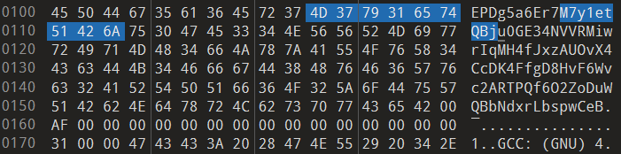
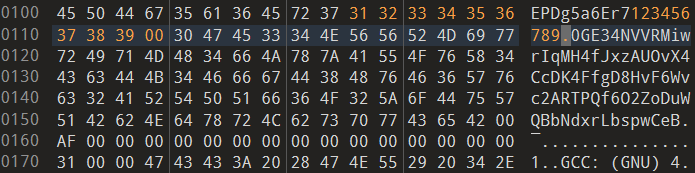
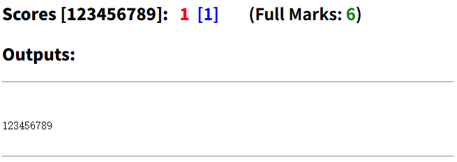
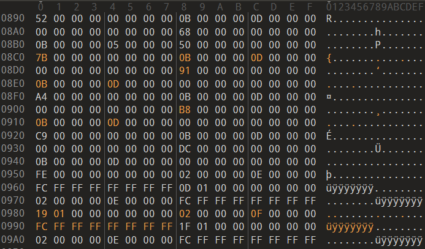
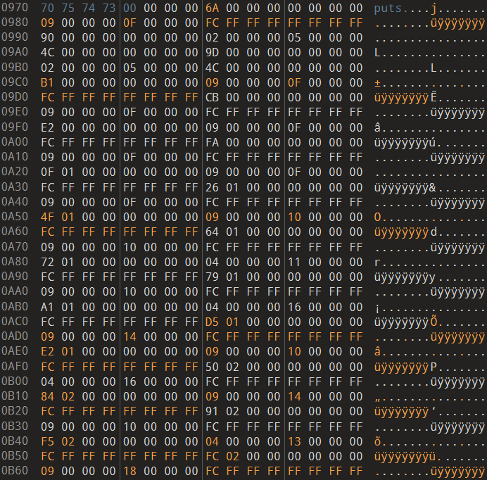

# ICS Linklab Solution

<del>CSAPP 里没有直接对应的 Lab，是原创，win</del>

我怎么感觉很多学校都有这个 Lab

每个阶段都对应一个文件 `phase[n].o`，任务是通过修改其指定部分内容，使程序运行时能够输出指定的内容

> 实验的每一阶段 n 中 ，按照阶段的目标要求修改二进制可重定位目标模块 phase[n].o
> 然后使用如下命令生成可执行程序 `linklab`：
>
> `#!bash gcc -no-pie -o linklab main.o phase[n].o`（个别阶段还需链接进其它模块）
>
> 并且，如下运行链接生成的可执行程序 `linklab` ，应输出符合该阶段目标的字符串。
>
> `./linklab`

我使用的十六进制编辑器为 010 Editor

---

## Solution

### Phase 1 数据与 ELF 数据节

???+ info "实验目的"

    1）理解ELF目标文件的基本组成与结构；
    
    2）熟悉程序中静态区数据的存储与访问机制。 

???+ abstract "实验任务"
    
    修改二进制可重定位目标文件 `phase1.o` 的 `.data` 节的内容（注意不允许修改其它节的内容），使其如下与 `main.o` 模块链接后运行时输出（且仅输出）学号：
    
    ```bash
    gcc -no-pie -o linklab main.o phase1.o
    ./linklab
    # your_stu_id\n
    ```

先不作修改地链接运行一次：

```cmd
❯ gcc -no-pie -o linklab main.o phase1.o
❯ ./linklab
M7y1etQBju0GE34NVVRMiwrIqMH4fJxzAUOvX4CcDK4FfgD8HvF6Wvc2ARTPQf6O2ZoDuWQBbNdxrLbspwCeB
```

这个程序应该是直接使用某个输出函数输出了 `.data` 段某一部分的内容

作为教程，这里给出多个级别的解法（<del>从“拉完了”到“夯”都有</del>）：

**1- 我管你这那的，直接对着这部分内容修改🤓**

记得加 `\0`，否则会 `error: phase1.o: file too short`





!!! bug "出于学习目的，这种操作不可取，虽然这确实是大多数方法最后一步应该做的事情"

**2- 选择 `objdump -d` 看看代码段**

```asm
Disassembly of section .text:

0000000000000000 <do_phase>:
   0:   55                      push   %rbp
   1:   48 89 e5                mov    %rsp,%rbp
   4:   bf 00 00 00 00          mov    $0x0,%edi
   9:   e8 00 00 00 00          call   e <do_phase+0xe>
   e:   5d                      pop    %rbp
   f:   c3                      ret
```

因为未链接，这里的 mov 源操作数，以及 call 指向的函数都是空占位符，所以你得不到相关的信息

这里我们有一种手段和一种方法：

**2-1- 使用更智能更强大的反编译器**，比如我尝试了 IDA Pro，它给出的汇编代码是这样的

```asm
# 函数部分
public do_phase
do_phase proc near
push    rbp
mov     rbp, rsp
mov     edi, (offset HAcrjJiG+4Ah) ; "123456789"	# if you have edited it
call    puts
pop     rbp
retn
do_phase endp

_text ends

# 汇编下的 .data 段
.data:0000000000000080 HAcrjJiG        db 'ckE1PmGimJDLLpGAqTJ1QLTWgFbvvzZzqSLLWNoLlArlBWNh8CZVnLIxLhbT117KE'
.data:00000000000000C1                 db 'PDg5a6Er7123456789',0
.data:00000000000000D4 a0ge34nvvrmiwri db '0GE34NVVRMiwrIqMH4fJxzAUOvX4CcDK4FfgD8HvF6Wvc2ARTPQf6O2ZoDuWQBbNd'
.data:0000000000000115                 db 'xrLbspwCeB',0
.data:0000000000000120 xrMziy          dq offset HAcrjJiG+2Fh  ; "h8CZVnLIxLhbT117KEPDg5a6Er7123456789"
```

贴心的 IDA 自动发现了空占位符处存在的重定位条目，完成重定位并返回处理后的代码段，甚至还能帮你建立交叉引用，现在你知道直接修改 `HAcrjJiG + 0x4A` 开始的 `.data` 内容就可以

!!! bug "对于学习阶段，这种方法也不可取"

**2-2- 使用 `objdump -d -r`**，此时的输出结果会显示重定位条目

```asm
Disassembly of section .text:

0000000000000000 <do_phase>:
   0:   55                      push   %rbp
   1:   48 89 e5                mov    %rsp,%rbp
   4:   bf 00 00 00 00          mov    $0x0,%edi
                        5: R_X86_64_32  .data+0xaa
   9:   e8 00 00 00 00          call   e <do_phase+0xe>
                        a: R_X86_64_PC32        puts-0x4
   e:   5d                      pop    %rbp
   f:   c3                      ret
```

我们发现多了两条重定义信息，以第一条为例：

```asm
    4:   bf 00 00 00 00          mov    $0x0,%edi
                        5: R_X86_64_32  .data+0xaa
```

`R_X86_64_32` 说明此处的重定位期望填充一个 32 位的地址

`5: R_X86_64_32  .data+0xaa` 的意思是希望在代码的第 5 个字节（`do_phase + 0x5`），将指向 `.data + 0xAA` 的 32 位地址值填入

第二条重定义信息很好理解，调用标准库的 `puts` 函数（extern，所以你在汇编内容中看不到）

于是我们可以 `objdump -s` 检查 `.data` 段的内容

``` asm hl_lines="18 19"
❯ objdump -s phase1.o

phase1.o:     file format elf64-x86-64

Contents of section .text:
 0000 554889e5 bf000000 00e80000 00005dc3  UH............].
Contents of section .data:
 0000 a75a853d 9c798803 af7bf5b3 3c2723e4  .Z.=.y...{..<'#.
 0010 add30376 8ef047c8 35de0827 b96b66b8  ...v..G.5..'.kf.
 0020 9a607457 80044582 304eed6c f3d08f1c  .`tW..E.0N.l....
 0030 d949f65a aa53458a 9c1f2ed3 d3b23197  .I.Z.SE.......1.
 0040 3843818d 46a58db6 00000000 00000000  8C..F...........
 0050 00000000 00000000 00000000 00000000  ................
 0060 636b4531 506d4769 6d4a444c 4c704741  ckE1PmGimJDLLpGA
 0070 71544a31 514c5457 67466276 767a5a7a  qTJ1QLTWgFbvvzZz
 0080 71534c4c 574e6f4c 6c41726c 42574e68  qSLLWNoLlArlBWNh
 0090 38435a56 6e4c4978 4c686254 3131374b  8CZVnLIxLhbT117K
 00a0 45504467 35613645 72373132 33343536  EPDg5a6Er7123456
 00b0 37383900 30474533 344e5656 524d6977  789.0GE34NVVRMiw
 00c0 7249714d 4834664a 787a4155 4f765834  rIqMH4fJxzAUOvX4
 00d0 4363444b 34466667 44384876 46365776  CcDK4FfgD8HvF6Wv
 00e0 63324152 54505166 364f325a 6f447557  c2ARTPQf6O2ZoDuW
 00f0 5142624e 6478724c 62737077 43654200  QBbNdxrLbspwCeB.
 0100 af000000 00000000 00000000 00000000  ................
```

需要修改的起点 `.data + 0xAA` 的内容已经被我修改为了 `123456789\0`，这就是 Phase 1 的解答过程

!!! success "这才是正确的解题流程"

??? quote "Test 一下确保这样做没有问题（学号 F12 改了）"

    

<br>

### Phase 2 指令与 ELF 代码节

???+ abstract "实验目的"

    1）理解ELF目标文件中指令代码的存储与访问；
    
    2）了解和熟悉机器指令的表示方式；
    
    3）巩固和掌握过程调用的机器级表示。

???+ info "实验任务"

    修改二进制可重定位目标文件 `phase2.o` 的 `.text` 节的内容（注意不允许修改其它节的内容），使其与 `main.o` 模块链接后运行时输出（且仅输出）学号

先 `objdump -d -r` 看看内容：

??? quote "折叠一下"

    ```asm
    Disassembly of section .text:
    
    0000000000000000 <FlMimUTgEx>:
       0:   55                      push   %rbp
       1:   48 89 e5                mov    %rsp,%rbp
       4:   48 83 ec 30             sub    $0x30,%rsp
       8:   89 7d dc                mov    %edi,-0x24(%rbp)
       b:   48 b8 68 76 20 54 30    movabs $0x3333773054207668,%rax
      12:   77 33 33
      15:   48 89 45 e0             mov    %rax,-0x20(%rbp)
      19:   48 b8 63 72 31 66 45    movabs $0x56464b4566317263,%rax
      20:   4b 46 56
      23:   48 89 45 e8             mov    %rax,-0x18(%rbp)
      27:   c7 45 f0 20 78 74 35    movl   $0x35747820,-0x10(%rbp)
      2e:   66 c7 45 f4 76 54       movw   $0x5476,-0xc(%rbp)
      34:   c6 45 f6 00             movb   $0x0,-0xa(%rbp)
      38:   48 8d 45 e0             lea    -0x20(%rbp),%rax
      3c:   48 89 c7                mov    %rax,%rdi
      3f:   e8 00 00 00 00          call   44 <FlMimUTgEx+0x44>
                            40: R_X86_64_PC32       strlen-0x4
      44:   89 45 fc                mov    %eax,-0x4(%rbp)
      47:   83 7d dc 00             cmpl   $0x0,-0x24(%rbp)
      4b:   78 14                   js     61 <FlMimUTgEx+0x61>
      4d:   8b 45 dc                mov    -0x24(%rbp),%eax
      50:   3b 45 fc                cmp    -0x4(%rbp),%eax
      53:   7d 0c                   jge    61 <FlMimUTgEx+0x61>
      55:   8b 45 dc                mov    -0x24(%rbp),%eax
      58:   48 98                   cltq
      5a:   0f b6 44 05 e0          movzbl -0x20(%rbp,%rax,1),%eax
      5f:   eb 05                   jmp    66 <FlMimUTgEx+0x66>
      61:   b8 00 00 00 00          mov    $0x0,%eax
      66:   c9                      leave
      67:   c3                      ret
    
    0000000000000068 <pgOGJoWU>:
      68:   55                      push   %rbp
      69:   48 89 e5                mov    %rsp,%rbp
      6c:   48 83 ec 10             sub    $0x10,%rsp
      70:   48 89 7d f8             mov    %rdi,-0x8(%rbp)
      74:   48 89 75 f0             mov    %rsi,-0x10(%rbp)
      78:   48 8b 45 f8             mov    -0x8(%rbp),%rax
      7c:   be 00 00 00 00          mov    $0x0,%esi
                            7d: R_X86_64_32 .rodata+0x2
      81:   48 89 c7                mov    %rax,%rdi
      84:   e8 00 00 00 00          call   89 <pgOGJoWU+0x21>
                            85: R_X86_64_PC32       strcmp-0x4
      89:   85 c0                   test   %eax,%eax
      8b:   74 02                   je     8f <pgOGJoWU+0x27>
      8d:   eb 0c                   jmp    9b <pgOGJoWU+0x33>
      8f:   48 8b 45 f0             mov    -0x10(%rbp),%rax
      93:   48 89 c7                mov    %rax,%rdi
      96:   e8 00 00 00 00          call   9b <pgOGJoWU+0x33>
                            97: R_X86_64_PC32       puts-0x4
      9b:   c9                      leave
      9c:   c3                      ret
    
    000000000000009d <do_phase>:
      9d:   55                      push   %rbp
      9e:   48 89 e5                mov    %rsp,%rbp
      a1:   90                      nop
      a2:   90                      nop
      a3:   90                      nop
    # 很长的 nop
      e0:   90                      nop
      e1:   5d                      pop    %rbp
      e2:   c3                      ret
    ```


我们发现 `do_phase` 函数在处理 callee reg 之后什么都不做，而 `.text` 段额外提供了两个函数 

对汇编程序本身进行分析的操作在 Binalab 已经完成的非常熟练了，这里直接给出两个函数的 C 语言版本：

```c
// 这里 i 是由 %edi 传入的
int FlMimUTgEx(int i){
    char s[] = "hv T0w33cr1fEKFV xt5vT";	// 硬编码后 strcopy
    int len = strlen(s);
    if(i < 0 || i >= len){			// check if 0 < edi < len 
        return 0;
    }
    else return s[i];
}

int pgOGJoWU(const char *s1, const char *s2)
{
  eax = strcmp(s1, "bznnYXw");			// str from .rodata + 0x2
  if (!eax) return puts(s2);
  return eax;
}
```

一开始容易有一个尝试，就是直接在 `do_phase` 中调用 `put` 输出字符串，但是问题在于这会修改 `.rel.text` 的内容，违反了“只能修改 `.text`”的规定。接下来发现上面的 `pgOGJoWU` 函数是有 `put` 函数接口的，所以我们要构造两个字符串：`s1 = bznnYXw` `s2 = STU_ID` 传入这个函数，就能解决问题

具体的操作是：利用立即数构建自己的学号，然后对 `pgOGJoWU` 函数直接打一个 patch，`if(!eax)` 修改为 `if(true)`

首先是 `do_phase` 函数

```asm
push	%rbp
mov		%rsp, %rbp

# 首先我们需要用栈存储九位长度的学号，这里是 123456789
sub		$0x30, %rsp
movabs	$0x3837363534333231, %rax
mov		%rax, -0x20(%rbp)
mov		$0x39, -0x18(%rbp)
mov		$0x0, -0x17(%rbp)
lea		-0x20(%rbp), %rsi	# 第二个参数

lea		-0x20(%rbp), %rdi	# 第一个参数直接抄第二个参数（反正用不上
call pgOGJoWU ; (0x100068)	# 注意这里需要手动计算 call 的偏移量

# 剩下的 nops 不要删

leave						# 这里把 pop %rbp 改成了 leave
ret
```

然后是 `pgOGJoWU` 函数，这一步改成无条件跳转

其实你再手动构造一个正确的字符串也可以，但没有打一个 patch 简易

```asm
8b:   74 02                   je     8f <pgOGJoWU+0x27>
# patch ↓
8b:   eb 02                   jmp     8f <pgOGJoWU+0x27>
```

测试发现输出正确

!!! warning "永远不要改动 ELF 文件的大小，必要时可以塞 `nop` 解决问题"

    当你改动了 ELF 的大小，各种段偏移，重定位表之类都会定位错误
    
    会喜获：
    
    ```
    /usr/bin/ld: error: phase2.o: file too short
    collect2: error: ld returned 1 exit status
    ```
    
    所以当你实现汇编代码时，应该**覆盖**题目中原有的 `nop`

??? abstract "不知道说出来合不合适的偷懒技巧"

    开源免费软件 Ghidra 的一个子功能是可以通过输入 Intel 语法的汇编语句自动转换为十六进制代码并 patch，期间会自动调整符号表等内容，甚至可以帮助计算 call 的偏移值
    
    这个工具一般用于静态逆向工程，CTFer 可能会熟悉一些(?)

<br>

### Phase 3 符号解析

???+ abstract "实验目的"

    1）了解程序链接过程中符号解析的作用；
    
    2）了解链接器对全局符号的解析规则。

???+ info "实验任务"

    针对给定的可重定位目标文件 `phase3.o` ，创建生成一个名为 `phase3_patch.o` 的二进制
    
    可重定位目标文件（注意不允许修改 `phase3.o` 模块），使其与 `main.o` 、 `phase3.o` 模块链接后运行时输出（且仅输出）学号

我们需要新建一个 `phase3_patch.o`，然后和 `phase3.o` 一起参与链接，输出学号

先看看 `phase3.o` 的内容：

??? quote "折叠一下"

    ```asm
    Disassembly of section .text:
    
    0000000000000000 <do_phase>:
       0:   55                      push   %rbp
       1:   48 89 e5                mov    %rsp,%rbp
       4:   48 83 ec 10             sub    $0x10,%rsp
       8:   48 b8 75 6c 71 61 64    movabs $0x7768766461716c75,%rax
       f:   76 68 77
      12:   48 89 45 f0             mov    %rax,-0x10(%rbp)
      16:   66 c7 45 f8 79 00       movw   $0x79,-0x8(%rbp)
      1c:   c7 45 fc 00 00 00 00    movl   $0x0,-0x4(%rbp)
      23:   eb 24                   jmp    49 <do_phase+0x49>
      25:   8b 45 fc                mov    -0x4(%rbp),%eax
      28:   48 98                   cltq
      2a:   0f b6 44 05 f0          movzbl -0x10(%rbp,%rax,1),%eax
      2f:   0f b6 c0                movzbl %al,%eax
      32:   48 98                   cltq
      34:   0f b6 80 00 00 00 00    movzbl 0x0(%rax),%eax
                            37: R_X86_64_32S        nPVhTXdbEc
      3b:   0f be c0                movsbl %al,%eax
      3e:   89 c7                   mov    %eax,%edi
      40:   e8 00 00 00 00          call   45 <do_phase+0x45>
                            41: R_X86_64_PC32       putchar-0x4
      45:   83 45 fc 01             addl   $0x1,-0x4(%rbp)
      49:   8b 45 fc                mov    -0x4(%rbp),%eax
      4c:   83 f8 08                cmp    $0x8,%eax
      4f:   76 d4                   jbe    25 <do_phase+0x25>
      51:   bf 0a 00 00 00          mov    $0xa,%edi
      56:   e8 00 00 00 00          call   5b <do_phase+0x5b>
                            57: R_X86_64_PC32       putchar-0x4
      5b:   c9                      leave
      5c:   c3                      ret
    ```

进行一番分析，不难得到下面的 C 等价代码：

```c
int do_phase() {
    char input[] = "ulqadvhwy";				// 恰好九位
    char output[10];

    for (int i = 0; i <= 8; i++) {
        output[i] = nPVhTXdbEc[input[i]];	// 映射表
    }
    output[9] = '\0';
    
    printf("%s\n", output);	// putchar 简化为了一次 printf
    return 0;
}
```

我们发现程序通过查表操作，对 `"ulqadvhwy"` 进行了映射，得到新的 ASCII 字符串。经过大搜索后发现 `phase3.o` 中完全没有 `nPVhTXdbEc` 这个映射表，所以我们的 patch 任务非常明确了：精心构造一个 `nPVhTXdbEc` 映射表，使得映射结果恰为学号

先用 `readelf phase3.o` 输出符号表条目，看看 `nPVhTXdbEc` 映射表的类型：

```asm hl_lines="15"
❯ readelf -s phase3.o

Symbol table '.symtab' contains 14 entries:
   Num:    Value          Size Type    Bind   Vis      Ndx Name
     0: 0000000000000000     0 NOTYPE  LOCAL  DEFAULT  UND
     1: 0000000000000000     0 FILE    LOCAL  DEFAULT  ABS phase3.c
     2: 0000000000000000     0 SECTION LOCAL  DEFAULT    1 .text
     3: 0000000000000000     0 SECTION LOCAL  DEFAULT    3 .data
     4: 0000000000000000     0 SECTION LOCAL  DEFAULT    5 .bss
     5: 0000000000000000     0 SECTION LOCAL  DEFAULT    6 .rodata
     6: 0000000000000000     0 SECTION LOCAL  DEFAULT    8 .note.GNU-stack
     7: 0000000000000000     0 SECTION LOCAL  DEFAULT    9 .eh_frame
     8: 0000000000000000     0 SECTION LOCAL  DEFAULT    7 .comment
     9: 0000000000000000     8 OBJECT  GLOBAL DEFAULT    3 phase_id
    10: 0000000000000020   256 OBJECT  GLOBAL DEFAULT  COM nPVhTXdbEc
    11: 0000000000000000    93 FUNC    GLOBAL DEFAULT    1 do_phase
    12: 0000000000000000     0 NOTYPE  GLOBAL DEFAULT  UND putchar
    13: 0000000000000008     8 OBJECT  GLOBAL DEFAULT    3 phase
```

每个字段的含义 STFW

`Size = 256` 表示占用的内存大小（Byte），`Type = OBJECT` 表示这是一个数据对象（而不是函数之类的），`Bind = GLOBAL` 说明这是一个<u>对其他文件可见，可以被链接</u>的全局符号，`Vis = DEFAULT` 说明可见性默认（类似于类中 `public` 这样的）

`Ndx = COM` （段索引）最关键，其说明这是一个<u>没有初始化</u>的全局符号，在上文的基础上，`Value = 0x20` 表示这个符号需要按照 `Value` 位内存对齐，在这里是 32 位对齐

我们可以写一个 C 语言 Patch:

```c
extern char nPVhTXdbEc[256];

// 强符号覆盖弱符号，根据待映射的 ulqadvhwy 进行构建
char nPVhTXdbEc[256] = {
    ['u'] = '1',
    ['l'] = '2',
    ['q'] = '3',
    ['a'] = '4',
    ['d'] = '5',
    ['v'] = '6',
    ['h'] = '7',
    ['w'] = '8',
    ['y'] = '9'
};
```

然后编译成 `.o` 文件，和其他文件一起链接，就能得到正确的输出：

```
❯ gcc -no-pie -c phase3_patch.c -o phase3_patch.o
❯ gcc -no-pie -o linklab main.o phase3.o phase3_patch.o
❯ ./linklab
123456789
```

<br>

### Phase 4 switch 语句与链接

???+ abstract "实验目的"

    1）理解 switch 语句的机器级表示及其相关链接处理；
    
    2）加深对符号引用和重定位基本概念的理解。 

???+ info "实验目的"

    修改二进制可重定位目标文件 `phase4.o` 中相关节的内容（注意不允许修改 `.text` 节的内容），使其与 `main.o` 链接后运行时输出（且仅输出）学号：

先看看 `phase4.o` 的 `.text` 节的内容：

??? quote "折叠一下"

    ```asm
    Disassembly of section .text:
    
    0000000000000000 <ONKavEKDee>:
       0:   55                      push   %rbp
       1:   48 89 e5                mov    %rsp,%rbp
       4:   90                      nop
       5:   90                      nop
       6:   90                      nop
       7:   90                      nop
       8:   90                      nop
       9:   90                      nop
       a:   90                      nop
       b:   90                      nop
       c:   90                      nop
       d:   90                      nop
       e:   90                      nop
       f:   90                      nop
      10:   90                      nop
      11:   90                      nop
      12:   90                      nop
      13:   90                      nop
      14:   90                      nop
      15:   90                      nop
      16:   90                      nop
      17:   90                      nop
      18:   90                      nop
      19:   90                      nop
      1a:   90                      nop
      1b:   90                      nop
      1c:   b8 ff ff ff ff          mov    $0xffffffff,%eax
      21:   5d                      pop    %rbp
      22:   c3                      ret
    
    0000000000000023 <do_phase>:
      23:   55                      push   %rbp
      24:   48 89 e5                mov    %rsp,%rbp
      27:   48 83 ec 30             sub    $0x30,%rsp
      2b:   48 b8 58 44 43 50 4e    movabs $0x4b56414e50434458,%rax
      32:   41 56 4b
      35:   48 89 45 e0             mov    %rax,-0x20(%rbp)
      39:   66 c7 45 e8 57 00       movw   $0x57,-0x18(%rbp)
      3f:   c7 45 f8 00 00 00 00    movl   $0x0,-0x8(%rbp)
      46:   e9 e1 00 00 00          jmp    12c <do_phase+0x109>
      4b:   8b 45 f8                mov    -0x8(%rbp),%eax
      4e:   48 98                   cltq
      50:   0f b6 44 05 e0          movzbl -0x20(%rbp,%rax,1),%eax
      55:   88 45 ff                mov    %al,-0x1(%rbp)
      58:   0f be 45 ff             movsbl -0x1(%rbp),%eax
      5c:   83 e8 41                sub    $0x41,%eax
      5f:   83 f8 19                cmp    $0x19,%eax
      62:   0f 87 b3 00 00 00       ja     11b <do_phase+0xf8>
      68:   89 c0                   mov    %eax,%eax
      6a:   48 8b 04 c5 00 00 00    mov    0x0(,%rax,8),%rax
      71:   00
                            6e: R_X86_64_32S        .rodata+0x8
      72:   ff e0                   jmp    *%rax
      74:   c6 45 ff 34             movb   $0x34,-0x1(%rbp)
      78:   e9 9e 00 00 00          jmp    11b <do_phase+0xf8>
      7d:   c6 45 ff 5b             movb   $0x5b,-0x1(%rbp)
      81:   e9 95 00 00 00          jmp    11b <do_phase+0xf8>
      86:   c6 45 ff 73             movb   $0x73,-0x1(%rbp)
      8a:   e9 8c 00 00 00          jmp    11b <do_phase+0xf8>
      8f:   c6 45 ff 69             movb   $0x69,-0x1(%rbp)
      93:   e9 83 00 00 00          jmp    11b <do_phase+0xf8>
      98:   c6 45 ff 40             movb   $0x40,-0x1(%rbp)
      9c:   eb 7d                   jmp    11b <do_phase+0xf8>
      9e:   c6 45 ff 32             movb   $0x32,-0x1(%rbp)
      a2:   eb 77                   jmp    11b <do_phase+0xf8>
      a4:   c6 45 ff 4d             movb   $0x4d,-0x1(%rbp)
      a8:   eb 71                   jmp    11b <do_phase+0xf8>
      aa:   c6 45 ff 39             movb   $0x39,-0x1(%rbp)
      ae:   eb 6b                   jmp    11b <do_phase+0xf8>
      b0:   c6 45 ff 4b             movb   $0x4b,-0x1(%rbp)
      b4:   eb 65                   jmp    11b <do_phase+0xf8>
      b6:   c6 45 ff 48             movb   $0x48,-0x1(%rbp)
      ba:   eb 5f                   jmp    11b <do_phase+0xf8>
      bc:   c6 45 ff 33             movb   $0x33,-0x1(%rbp)
      c0:   eb 59                   jmp    11b <do_phase+0xf8>
      c2:   c6 45 ff 36             movb   $0x36,-0x1(%rbp)
      c6:   eb 53                   jmp    11b <do_phase+0xf8>
      c8:   c6 45 ff 4a             movb   $0x4a,-0x1(%rbp)
      cc:   eb 4d                   jmp    11b <do_phase+0xf8>
      ce:   c6 45 ff 42             movb   $0x42,-0x1(%rbp)
      d2:   eb 47                   jmp    11b <do_phase+0xf8>
      d4:   c6 45 ff 35             movb   $0x35,-0x1(%rbp)
      d8:   eb 41                   jmp    11b <do_phase+0xf8>
      da:   c6 45 ff 37             movb   $0x37,-0x1(%rbp)
      de:   eb 3b                   jmp    11b <do_phase+0xf8>
      e0:   c6 45 ff 5f             movb   $0x5f,-0x1(%rbp)
      e4:   eb 35                   jmp    11b <do_phase+0xf8>
      e6:   c6 45 ff 38             movb   $0x38,-0x1(%rbp)
      ea:   eb 2f                   jmp    11b <do_phase+0xf8>
      ec:   c6 45 ff 30             movb   $0x30,-0x1(%rbp)
      f0:   eb 29                   jmp    11b <do_phase+0xf8>
      f2:   c6 45 ff 50             movb   $0x50,-0x1(%rbp)
      f6:   eb 23                   jmp    11b <do_phase+0xf8>
      f8:   c6 45 ff 31             movb   $0x31,-0x1(%rbp)
      fc:   eb 1d                   jmp    11b <do_phase+0xf8>
      fe:   c6 45 ff 7a             movb   $0x7a,-0x1(%rbp)
     102:   eb 17                   jmp    11b <do_phase+0xf8>
     104:   c6 45 ff 7c             movb   $0x7c,-0x1(%rbp)
     108:   eb 11                   jmp    11b <do_phase+0xf8>
     10a:   c6 45 ff 3c             movb   $0x3c,-0x1(%rbp)
     10e:   eb 0b                   jmp    11b <do_phase+0xf8>
     110:   c6 45 ff 64             movb   $0x64,-0x1(%rbp)
     114:   eb 05                   jmp    11b <do_phase+0xf8>
     116:   c6 45 ff 42             movb   $0x42,-0x1(%rbp)
     11a:   90                      nop
     11b:   8b 45 f8                mov    -0x8(%rbp),%eax
     11e:   48 98                   cltq
     120:   0f b6 55 ff             movzbl -0x1(%rbp),%edx
     124:   88 54 05 d0             mov    %dl,-0x30(%rbp,%rax,1)
     128:   83 45 f8 01             addl   $0x1,-0x8(%rbp)
     12c:   8b 45 f8                mov    -0x8(%rbp),%eax
     12f:   83 f8 08                cmp    $0x8,%eax
     132:   0f 86 13 ff ff ff       jbe    4b <do_phase+0x28>
     138:   8b 45 f8                mov    -0x8(%rbp),%eax
     13b:   48 98                   cltq
     13d:   c6 44 05 d0 00          movb   $0x0,-0x30(%rbp,%rax,1)
     142:   48 8d 45 d0             lea    -0x30(%rbp),%rax
     146:   48 89 c7                mov    %rax,%rdi
     149:   e8 00 00 00 00          call   14e <do_phase+0x12b>
                            14a: R_X86_64_PC32      puts-0x4
     14e:   c9                      leave
     14f:   c3                      ret
    ```

发现 `ONKavEKDee` 的作用是返回 `0xffffffff = -1` （何意味），而 `do_phase` 函数的作用用下面的 C 程序概括：

```c
int do_phase(){
    char ch;
    char s1[10];
    char s2[] = "XDCPNAVKW"	// 立即数 + strcpy 创建
        for (int i = 0; i <= 8; i++){
            ch = s2[i];
            // 有了 Binalab 的经验你应该能一眼看出这里是 switch 表
            // 显然 0-9 一定在映射结果中
            switch (ch){
                case 'A':
                    ch = 57;      // '9'
                    break;
                case 'B':
                    ch = 55;      // '7'
                    break;
                case 'C':
                    ch = 53;      // '5'
                    break;
                case 'D':
                    ch = 77;      // 'M'
                    break;
                case 'E':
                    ch = 124;     // '|'
                    break;
                case 'F':
                    ch = 51;      // '3'
                    break;
                case 'G':
                    ch = 48;      // '0'
                    break;
                case 'H':
                    ch = 91;      // '['
                    break;
                case 'I':
                    ch = 52;      // '4'
                    break;
                case 'J':
                    ch = 74;      // 'J'
                    break;
                case 'K':
                    ch = 56;      // '8'
                    break;
                case 'L':
                    ch = 50;      // '2'
                    break;
                case 'M':
                    ch = 75;      // 'K'
                    break;
                case 'N':
                    ch = 72;      // 'H'
                    break;
                case 'O':
                    ch = 95;      // '_'
                    break;
                case 'P':
                    ch = 80;      // 'P'
                    break;
                case 'Q':
                    ch = 105;     // 'i'
                    break;
                case 'R':
                    ch = 64;      // '@'
                    break;
                case 'S':
                    ch = 100;     // 'd'
                    break;
                case 'T':
                    ch = 66;      // 'B'
                    break;
                case 'U':
                    ch = 49;      // '1'
                    break;
                case 'V':
                    ch = 122;     // 'z'
                    break;
                case 'W':
                    ch = 66;      // 'B'
                    break;
                case 'X':
                    ch = 54;      // '6'
                    break;
                case 'Y':
                    ch = 60;      // '<'
                    break;
                case 'Z':
                    ch = 115;     // 's'
                    break;
                default:
                    break;
            }
            s1[i] = ch;
        }
    s1[9] = 0;		// '\0'
    return puts(s);
}
```

根据一个映射表关系，将 `s2 = XDCPNAVKW` 映射到另一个字符串 `s1` 中并输出 `s1 = 6M5PH9z8B` 

`.text` 字段的内容不可更改，看上去内容已经很固定了，但是我们看这里：

```asm
  6a:   48 8b 04 c5 00 00 00    mov    0x0(,%rax,8),%rax
  71:   00
                        6e: R_X86_64_32S        .rodata+0x8
```

跳转表在 `.rodata+0x8` 处定义，我们可以修改跳转表映射，也就是修改上面的 `switch case`

先用 `readelf` 看看 `.rela.rodata` 的内容（不是 `.rodata`）

```asm
Relocation section '.rela.rodata' at offset 0x5f0 contains 26 entries:
  Offset          Info           Type       Sym. Value    Sym. Name + Addend
000000000008  000200000001 R_X86_64_64   0000000000000000 .text + aa	#A
000000000010  000200000001 R_X86_64_64   0000000000000000 .text + da	#B
000000000018  000200000001 R_X86_64_64   0000000000000000 .text + d4	#C
000000000020  000200000001 R_X86_64_64   0000000000000000 .text + a4	#D
000000000028  000200000001 R_X86_64_64   0000000000000000 .text + 104	#E
000000000030  000200000001 R_X86_64_64   0000000000000000 .text + bc	#F
000000000038  000200000001 R_X86_64_64   0000000000000000 .text + ec	#G
000000000040  000200000001 R_X86_64_64   0000000000000000 .text + 7d	#H
000000000048  000200000001 R_X86_64_64   0000000000000000 .text + 74	#I
000000000050  000200000001 R_X86_64_64   0000000000000000 .text + c8	#J
000000000058  000200000001 R_X86_64_64   0000000000000000 .text + e6	#K
000000000060  000200000001 R_X86_64_64   0000000000000000 .text + 9e	#L
000000000068  000200000001 R_X86_64_64   0000000000000000 .text + b0	#M
000000000070  000200000001 R_X86_64_64   0000000000000000 .text + b6	#N
000000000078  000200000001 R_X86_64_64   0000000000000000 .text + e0	#O
000000000080  000200000001 R_X86_64_64   0000000000000000 .text + f2	#P
000000000088  000200000001 R_X86_64_64   0000000000000000 .text + 8f	#Q
000000000090  000200000001 R_X86_64_64   0000000000000000 .text + 98	#R
000000000098  000200000001 R_X86_64_64   0000000000000000 .text + 110	#S
0000000000a0  000200000001 R_X86_64_64   0000000000000000 .text + 116	#T
0000000000a8  000200000001 R_X86_64_64   0000000000000000 .text + f8	#U
0000000000b0  000200000001 R_X86_64_64   0000000000000000 .text + fe	#V
0000000000b8  000200000001 R_X86_64_64   0000000000000000 .text + ce	#W
0000000000c0  000200000001 R_X86_64_64   0000000000000000 .text + c2	#X
0000000000c8  000200000001 R_X86_64_64   0000000000000000 .text + 10a	#Y
0000000000d0  000200000001 R_X86_64_64   0000000000000000 .text + 86	#Z
```

这里就非常显然了，我们要做的就是修改上面的内容，使得 `XDCPNAVKW` 这几个字母被映射到

这是原映射关系：

```
A B C D E F G H I J K L M N O P Q R S T U V W X Y Z
9 7 5 M | 3 0 [ 4 J 8 2 K H _ P i @ d B 1 z B 6 < s
```

这是应该有的映射关系，以学号为 `123456789` 为例：

```
A B C D E F G H I J K L M N O P Q R S T U V W X Y Z
6 7 3 2 | 3 0 [ 4 J 8 2 K 5 _ 4 i @ d B 1 7 9 1 < s
X   F L             K     C   I           B A U		# 修改后的值原本对应什么键
```

所以只要将 A 对应的 `.text + aa` 修改为 X 对应的 `.text + c2`， C 对应的 `.text + d4` 修改为 F 对应的 `.text + bc`，以此类推，就能得到正确的映射，此处不再给出修改过程

??? bug "一个亲身经历的罕见的 bug"

    IDA 这样的强大的反编译器会自动对重定位信息进行处理，因此如果你在 IDA 上通过内置的十六进制编辑器进行 Patch 操作，会同时修改 .rela.rodata 段和 .rodata 段的内容
    
    这样会导致什么意料之外的结果呢？你在本地测试可以输出正确的学号，但是评测输出为空白（我怎么知道为什么😭）

<br>

### Phase 5 重定位

???+ abstract "实验目的"

    1）了解重定位的概念、作用与过程；
    
    2）了解常见的重定位类型；
    
    3）了解ELF目标文件中重定位信息的表示与存储。

???+ info "实验任务"

    修改二进制可重定位目标文件 `phase5.o`，恢复其中被人为清零的一些重定位记录 （分别对应于本模块中需要重定位的符号引用，注意不允许修改除重定位节以外的内容），使其与 `main.o` 链接后，运行所生成程序时输出对学号进行编码处理后得到的一个特定字符串
    
    Tip: 总共有 7 个重定位记录被随机置零，可能位于不同的重定位节中

先看看内容：

??? quote "折叠一下"

    ```asm
    Disassembly of section .text:
    
    0000000000000000 <FlMimUTgEx>:
       0:   55                      push   %rbp
                            0: R_X86_64_NONE        *ABS*
                            0: R_X86_64_NONE        *ABS*
                            0: R_X86_64_NONE        *ABS*
                            0: R_X86_64_NONE        *ABS*
                            0: R_X86_64_NONE        *ABS*
                            0: R_X86_64_NONE        *ABS*
       1:   48 89 e5                mov    %rsp,%rbp
       4:   89 7d ec                mov    %edi,-0x14(%rbp)
       7:   c7 45 f0 4a 76 6d 47    movl   $0x476d764a,-0x10(%rbp)
       e:   66 c7 45 f4 4f 45       movw   $0x454f,-0xc(%rbp)
      14:   c6 45 f6 00             movb   $0x0,-0xa(%rbp)
      18:   c7 45 fc 07 00 00 00    movl   $0x7,-0x4(%rbp)
      1f:   83 7d ec 00             cmpl   $0x0,-0x14(%rbp)
      23:   78 14                   js     39 <FlMimUTgEx+0x39>
      25:   8b 45 ec                mov    -0x14(%rbp),%eax
      28:   3b 45 fc                cmp    -0x4(%rbp),%eax
      2b:   7d 0c                   jge    39 <FlMimUTgEx+0x39>
      2d:   8b 45 ec                mov    -0x14(%rbp),%eax
      30:   48 98                   cltq
      32:   0f b6 44 05 f0          movzbl -0x10(%rbp,%rax,1),%eax
      37:   eb 05                   jmp    3e <FlMimUTgEx+0x3e>
      39:   b8 00 00 00 00          mov    $0x0,%eax
      3e:   5d                      pop    %rbp
      3f:   c3                      ret
    
    0000000000000040 <transform_code>:
      40:   55                      push   %rbp
      41:   48 89 e5                mov    %rsp,%rbp
      44:   89 7d fc                mov    %edi,-0x4(%rbp)
      47:   89 75 f8                mov    %esi,-0x8(%rbp)
      4a:   8b 45 f8                mov    -0x8(%rbp),%eax
      4d:   48 98                   cltq
      4f:   8b 04 85 00 00 00 00    mov    0x0(,%rax,4),%eax
                            52: R_X86_64_32S        YJbxwI
      56:   83 e0 07                and    $0x7,%eax
      59:   83 f8 07                cmp    $0x7,%eax
      5c:   0f 87 83 00 00 00       ja     e5 <transform_code+0xa5>
      62:   89 c0                   mov    %eax,%eax
      64:   48 8b 04 c5 00 00 00    mov    0x0(,%rax,8),%rax
      6b:   00
                            68: R_X86_64_32S        .rodata+0x50
      6c:   ff e0                   jmp    *%rax
      6e:   f7 55 fc                notl   -0x4(%rbp)
      71:   eb 76                   jmp    e9 <transform_code+0xa9>
      73:   8b 45 f8                mov    -0x8(%rbp),%eax
      76:   48 98                   cltq
      78:   8b 04 85 00 00 00 00    mov    0x0(,%rax,4),%eax
      7f:   83 e0 03                and    $0x3,%eax
      82:   89 c1                   mov    %eax,%ecx
      84:   d3 7d fc                sarl   %cl,-0x4(%rbp)
      87:   eb 60                   jmp    e9 <transform_code+0xa9>
      89:   8b 45 f8                mov    -0x8(%rbp),%eax
      8c:   48 98                   cltq
      8e:   8b 04 85 00 00 00 00    mov    0x0(,%rax,4),%eax
      95:   f7 d0                   not    %eax
      97:   21 45 fc                and    %eax,-0x4(%rbp)
      9a:   eb 4d                   jmp    e9 <transform_code+0xa9>
      9c:   8b 45 f8                mov    -0x8(%rbp),%eax
      9f:   48 98                   cltq
      a1:   8b 04 85 00 00 00 00    mov    0x0(,%rax,4),%eax
                            a4: R_X86_64_32S        YJbxwI
      a8:   c1 e0 08                shl    $0x8,%eax
      ab:   09 45 fc                or     %eax,-0x4(%rbp)
      ae:   eb 39                   jmp    e9 <transform_code+0xa9>
      b0:   8b 45 f8                mov    -0x8(%rbp),%eax
      b3:   48 98                   cltq
      b5:   8b 04 85 00 00 00 00    mov    0x0(,%rax,4),%eax
      bc:   31 45 fc                xor    %eax,-0x4(%rbp)
      bf:   eb 28                   jmp    e9 <transform_code+0xa9>
      c1:   8b 45 f8                mov    -0x8(%rbp),%eax
      c4:   48 98                   cltq
      c6:   8b 04 85 00 00 00 00    mov    0x0(,%rax,4),%eax
                            c9: R_X86_64_32S        YJbxwI
      cd:   f7 d0                   not    %eax
      cf:   09 45 fc                or     %eax,-0x4(%rbp)
      d2:   eb 15                   jmp    e9 <transform_code+0xa9>
      d4:   8b 45 f8                mov    -0x8(%rbp),%eax
      d7:   48 98                   cltq
      d9:   8b 04 85 00 00 00 00    mov    0x0(,%rax,4),%eax
                            dc: R_X86_64_32S        YJbxwI
      e0:   01 45 fc                add    %eax,-0x4(%rbp)
      e3:   eb 04                   jmp    e9 <transform_code+0xa9>
      e5:   f7 5d fc                negl   -0x4(%rbp)
      e8:   90                      nop
      e9:   8b 45 fc                mov    -0x4(%rbp),%eax
      ec:   5d                      pop    %rbp
      ed:   c3                      ret
    
    00000000000000ee <generate_code>:
      ee:   55                      push   %rbp
      ef:   48 89 e5                mov    %rsp,%rbp
      f2:   48 83 ec 18             sub    $0x18,%rsp
      f6:   89 7d ec                mov    %edi,-0x14(%rbp)
      f9:   8b 45 ec                mov    -0x14(%rbp),%eax
      fc:   89 05 00 00 00 00       mov    %eax,0x0(%rip)        # 102 <generate_code+0x14>
                            fe: R_X86_64_PC32       dHpWlp-0x4
     102:   c7 45 fc 00 00 00 00    movl   $0x0,-0x4(%rbp)
     109:   eb 1c                   jmp    127 <generate_code+0x39>
     10b:   8b 05 00 00 00 00       mov    0x0(%rip),%eax        # 111 <generate_code+0x23>
                            10d: R_X86_64_PC32      dHpWlp-0x4
     111:   8b 55 fc                mov    -0x4(%rbp),%edx
     114:   89 d6                   mov    %edx,%esi
     116:   89 c7                   mov    %eax,%edi
     118:   e8 00 00 00 00          call   11d <generate_code+0x2f>
     11d:   89 05 00 00 00 00       mov    %eax,0x0(%rip)        # 123 <generate_code+0x35>
                            11f: R_X86_64_PC32      dHpWlp-0x4
     123:   83 45 fc 01             addl   $0x1,-0x4(%rbp)
     127:   8b 45 fc                mov    -0x4(%rbp),%eax
     12a:   83 f8 0b                cmp    $0xb,%eax
     12d:   76 dc                   jbe    10b <generate_code+0x1d>
     12f:   c9                      leave
     130:   c3                      ret
    
    0000000000000131 <encode_1>:
     131:   55                      push   %rbp
     132:   48 89 e5                mov    %rsp,%rbp
     135:   48 83 ec 20             sub    $0x20,%rsp
     139:   48 89 7d e8             mov    %rdi,-0x18(%rbp)
     13d:   48 8b 45 e8             mov    -0x18(%rbp),%rax
     141:   48 89 c7                mov    %rax,%rdi
     144:   e8 00 00 00 00          call   149 <encode_1+0x18>
                            145: R_X86_64_PC32      strlen-0x4
     149:   89 45 f8                mov    %eax,-0x8(%rbp)
     14c:   c7 45 fc 00 00 00 00    movl   $0x0,-0x4(%rbp)
     153:   eb 72                   jmp    1c7 <encode_1+0x96>
     155:   8b 45 fc                mov    -0x4(%rbp),%eax
     158:   48 63 d0                movslq %eax,%rdx
     15b:   48 8b 45 e8             mov    -0x18(%rbp),%rax
     15f:   48 01 c2                add    %rax,%rdx
     162:   8b 45 fc                mov    -0x4(%rbp),%eax
     165:   48 63 c8                movslq %eax,%rcx
     168:   48 8b 45 e8             mov    -0x18(%rbp),%rax
     16c:   48 01 c8                add    %rcx,%rax
     16f:   0f b6 00                movzbl (%rax),%eax
     172:   0f be c0                movsbl %al,%eax
     175:   48 98                   cltq
     177:   0f b6 88 00 00 00 00    movzbl 0x0(%rax),%ecx
                            17a: R_X86_64_32S       SoSujd
     17e:   8b 05 00 00 00 00       mov    0x0(%rip),%eax        # 184 <encode_1+0x53>
                            180: R_X86_64_PC32      dHpWlp-0x4
     184:   31 c8                   xor    %ecx,%eax
     186:   83 e0 7f                and    $0x7f,%eax
     189:   88 02                   mov    %al,(%rdx)
     18b:   8b 45 fc                mov    -0x4(%rbp),%eax
     18e:   48 63 d0                movslq %eax,%rdx
     191:   48 8b 45 e8             mov    -0x18(%rbp),%rax
     195:   48 01 d0                add    %rdx,%rax
     198:   0f b6 00                movzbl (%rax),%eax
     19b:   3c 1f                   cmp    $0x1f,%al
     19d:   7e 14                   jle    1b3 <encode_1+0x82>
     19f:   8b 45 fc                mov    -0x4(%rbp),%eax
     1a2:   48 63 d0                movslq %eax,%rdx
     1a5:   48 8b 45 e8             mov    -0x18(%rbp),%rax
     1a9:   48 01 d0                add    %rdx,%rax
     1ac:   0f b6 00                movzbl (%rax),%eax
     1af:   3c 7f                   cmp    $0x7f,%al
     1b1:   75 10                   jne    1c3 <encode_1+0x92>
     1b3:   8b 45 fc                mov    -0x4(%rbp),%eax
     1b6:   48 63 d0                movslq %eax,%rdx
     1b9:   48 8b 45 e8             mov    -0x18(%rbp),%rax
     1bd:   48 01 d0                add    %rdx,%rax
     1c0:   c6 00 3f                movb   $0x3f,(%rax)
     1c3:   83 45 fc 01             addl   $0x1,-0x4(%rbp)
     1c7:   8b 45 fc                mov    -0x4(%rbp),%eax
     1ca:   3b 45 f8                cmp    -0x8(%rbp),%eax
     1cd:   7c 86                   jl     155 <encode_1+0x24>
     1cf:   8b 45 f8                mov    -0x8(%rbp),%eax
     1d2:   c9                      leave
     1d3:   c3                      ret
    
    00000000000001d4 <encode_2>:
     1d4:   55                      push   %rbp
     1d5:   48 89 e5                mov    %rsp,%rbp
     1d8:   48 83 ec 20             sub    $0x20,%rsp
     1dc:   48 89 7d e8             mov    %rdi,-0x18(%rbp)
     1e0:   48 8b 45 e8             mov    -0x18(%rbp),%rax
     1e4:   48 89 c7                mov    %rax,%rdi
     1e7:   e8 00 00 00 00          call   1ec <encode_2+0x18>
                            1e8: R_X86_64_PC32      strlen-0x4
     1ec:   89 45 f8                mov    %eax,-0x8(%rbp)
     1ef:   c7 45 fc 00 00 00 00    movl   $0x0,-0x4(%rbp)
     1f6:   eb 72                   jmp    26a <encode_2+0x96>
     1f8:   8b 45 fc                mov    -0x4(%rbp),%eax
     1fb:   48 63 d0                movslq %eax,%rdx
     1fe:   48 8b 45 e8             mov    -0x18(%rbp),%rax
     202:   48 01 c2                add    %rax,%rdx
     205:   8b 45 fc                mov    -0x4(%rbp),%eax
     208:   48 63 c8                movslq %eax,%rcx
     20b:   48 8b 45 e8             mov    -0x18(%rbp),%rax
     20f:   48 01 c8                add    %rcx,%rax
     212:   0f b6 00                movzbl (%rax),%eax
     215:   0f be c0                movsbl %al,%eax
     218:   48 98                   cltq
     21a:   0f b6 88 00 00 00 00    movzbl 0x0(%rax),%ecx
                            21d: R_X86_64_32S       SoSujd
     221:   8b 05 00 00 00 00       mov    0x0(%rip),%eax        # 227 <encode_2+0x53>
                            223: R_X86_64_PC32      dHpWlp-0x4
     227:   01 c8                   add    %ecx,%eax
     229:   83 e0 7f                and    $0x7f,%eax
     22c:   88 02                   mov    %al,(%rdx)
     22e:   8b 45 fc                mov    -0x4(%rbp),%eax
     231:   48 63 d0                movslq %eax,%rdx
     234:   48 8b 45 e8             mov    -0x18(%rbp),%rax
     238:   48 01 d0                add    %rdx,%rax
     23b:   0f b6 00                movzbl (%rax),%eax
     23e:   3c 1f                   cmp    $0x1f,%al
     240:   7e 14                   jle    256 <encode_2+0x82>
     242:   8b 45 fc                mov    -0x4(%rbp),%eax
     245:   48 63 d0                movslq %eax,%rdx
     248:   48 8b 45 e8             mov    -0x18(%rbp),%rax
     24c:   48 01 d0                add    %rdx,%rax
     24f:   0f b6 00                movzbl (%rax),%eax
     252:   3c 7f                   cmp    $0x7f,%al
     254:   75 10                   jne    266 <encode_2+0x92>
     256:   8b 45 fc                mov    -0x4(%rbp),%eax
     259:   48 63 d0                movslq %eax,%rdx
     25c:   48 8b 45 e8             mov    -0x18(%rbp),%rax
     260:   48 01 d0                add    %rdx,%rax
     263:   c6 00 2a                movb   $0x2a,(%rax)
     266:   83 45 fc 01             addl   $0x1,-0x4(%rbp)
     26a:   8b 45 fc                mov    -0x4(%rbp),%eax
     26d:   3b 45 f8                cmp    -0x8(%rbp),%eax
     270:   7c 86                   jl     1f8 <encode_2+0x24>
     272:   8b 45 f8                mov    -0x8(%rbp),%eax
     275:   c9                      leave
     276:   c3                      ret
    
    0000000000000277 <do_phase>:
     277:   55                      push   %rbp
     278:   48 89 e5                mov    %rsp,%rbp
     27b:   bf d0 00 00 00          mov    $0xd0,%edi
     280:   e8 00 00 00 00          call   285 <do_phase+0xe>
                            281: R_X86_64_PC32      generate_code-0x4
     285:   48 8b 05 00 00 00 00    mov    0x0(%rip),%rax        # 28c <do_phase+0x15>
     28c:   bf 00 00 00 00          mov    $0x0,%edi
                            28d: R_X86_64_32        HAcrjJiG	# 学号明文
     291:   ff d0                   call   *%rax
     293:   bf 00 00 00 00          mov    $0x0,%edi
                            # 你一眼就能看出来这里缺一个重定位信息
     298:   e8 00 00 00 00          call   29d <do_phase+0x26>
                            299: R_X86_64_PC32      puts-0x4
     29d:   5d                      pop    %rbp
     29e:   c3                      ret
    ```

!!! abstract "发现"

    这一次我们的学号信息是直接明文存储的（`strings` 直接搜一下就能发现），而这一阶段要求的输出结果从直接输出学号变成了“对学号编码处理后的特定字符串”
    
    不难发现上面的程序实现的就是一个加密过程，但是具体的内容比较复杂

这里先通过 `readelf` 获取重定位记录，很明显有 7 个被人为置空的记录，我们的最终目的是还原这七个记录：

??? quote "折叠一下"

    ```asm hl_lines="5 6 8 13 22 24 31"
    Relocation section '.rela.text' at offset 0x890 contains 23 entries:
      Offset          Info           Type           Sym. Value    Sym. Name + Addend
    000000000052  000d0000000b R_X86_64_32S      0000000000000020 YJbxwI + 0
    000000000068  00050000000b R_X86_64_32S      0000000000000000 .rodata + 50
    000000000000  000000000000 R_X86_64_NONE                        0
    000000000000  000000000000 R_X86_64_NONE                        0
    0000000000a4  000d0000000b R_X86_64_32S      0000000000000020 YJbxwI + 0
    000000000000  000000000000 R_X86_64_NONE                        0
    0000000000c9  000d0000000b R_X86_64_32S      0000000000000020 YJbxwI + 0
    0000000000dc  000d0000000b R_X86_64_32S      0000000000000020 YJbxwI + 0
    0000000000fe  000e00000002 R_X86_64_PC32     000000000000007c dHpWlp - 4
    00000000010d  000e00000002 R_X86_64_PC32     000000000000007c dHpWlp - 4
    000000000000  000000000000 R_X86_64_NONE                        0
    00000000011f  000e00000002 R_X86_64_PC32     000000000000007c dHpWlp - 4
    000000000145  001300000002 R_X86_64_PC32     0000000000000000 strlen - 4
    00000000017a  00110000000b R_X86_64_32S      00000000000000a0 SoSujd + 0
    000000000180  000e00000002 R_X86_64_PC32     000000000000007c dHpWlp - 4
    0000000001e8  001300000002 R_X86_64_PC32     0000000000000000 strlen - 4
    00000000021d  00110000000b R_X86_64_32S      00000000000000a0 SoSujd + 0
    000000000223  000e00000002 R_X86_64_PC32     000000000000007c dHpWlp - 4
    000000000281  001000000002 R_X86_64_PC32     00000000000000ee generate_code - 4
    000000000000  000000000000 R_X86_64_NONE                        0
    00000000028d  000c0000000a R_X86_64_32       0000000000000070 HAcrjJiG + 0
    000000000000  000000000000 R_X86_64_NONE                        0
    000000000299  001700000002 R_X86_64_PC32     0000000000000000 puts - 4
    
    Relocation section '.rela.data' at offset 0xab8 contains 4 entries:
      Offset          Info           Type           Sym. Value    Sym. Name + Addend
    000000000068  000500000001 R_X86_64_64       0000000000000000 .rodata + 0
    000000000080  001200000001 R_X86_64_64       0000000000000131 encode_1 + 0
    000000000000  000000000000 R_X86_64_NONE                        0
    000000000090  001600000001 R_X86_64_64       0000000000000277 do_phase + 0
    
    Relocation section '.rela.rodata' at offset 0xb18 contains 8 entries:
      Offset          Info           Type           Sym. Value    Sym. Name + Addend
    000000000050  000200000001 R_X86_64_64       0000000000000000 .text + 6e
    000000000058  000200000001 R_X86_64_64       0000000000000000 .text + 73
    000000000060  000200000001 R_X86_64_64       0000000000000000 .text + 89
    000000000068  000200000001 R_X86_64_64       0000000000000000 .text + e5
    000000000070  000200000001 R_X86_64_64       0000000000000000 .text + 9c
    000000000078  000200000001 R_X86_64_64       0000000000000000 .text + b0
    000000000080  000200000001 R_X86_64_64       0000000000000000 .text + c1
    000000000088  000200000001 R_X86_64_64       0000000000000000 .text + d4
    ```

!!! tip "其实这里已经给出了缺少重定位信息的 7 处位置的大致范围"

我们先分析每个函数：

> 其实你不具体分析每个函数，凭借“找规律”的智慧，你也能得到正确的结论，毕竟你只需要补齐重定位信息。
>
> 但是了解程序在做什么可以作为一种训练

--> `do_phase`

```asm
0000000000000277 <do_phase>:
 277:   55                      push   %rbp
 278:   48 89 e5                mov    %rsp,%rbp
 27b:   bf d0 00 00 00          mov    $0xd0,%edi
 280:   e8 00 00 00 00          call   285 <do_phase+0xe>
                        281: R_X86_64_PC32      generate_code-0x4
                        # generate_code(208);
 285:   48 8b 05 00 00 00 00    mov    0x0(%rip),%rax        # 28c <do_phase+0x15>
 						# 从某个内存中加载了函数指针
 						# 这里会不会也缺少重定位？
 28c:   bf 00 00 00 00          mov    $0x0,%edi
                        28d: R_X86_64_32        HAcrjJiG	# 学号明文
                        # 将学号作为入口参数
 291:   ff d0                   call   *%rax
 						# 调用指针指向的函数
 293:   bf 00 00 00 00          mov    $0x0,%edi
                        # 这里大概率少一条重定位信息
 298:   e8 00 00 00 00          call   29d <do_phase+0x26>
                        299: R_X86_64_PC32      puts-0x4
 29d:   5d                      pop    %rbp
 29e:   c3                      ret
```

对应的 C 程序大致如下：

```c
void do_phase(){
	generate_code(0xd0);	// 208
    unknown_func(stu_id);	// encode_1 or encode_2 ?
    						// 或许是二选一 encode 函数，但是缺少重定位信息
    puts(encoded_stu_id);	// 源程序是 puts(0)，很明显缺少重定位信息
}
```

---

--> `generate_code`

```asm
00000000000000ee <generate_code>:
  ee:   55                      push   %rbp
  ef:   48 89 e5                mov    %rsp,%rbp
  f2:   48 83 ec 18             sub    $0x18,%rsp
  
  f6:   89 7d ec                mov    %edi,-0x14(%rbp)
  f9:   8b 45 ec                mov    -0x14(%rbp),%eax
  fc:   89 05 00 00 00 00       mov    %eax,0x0(%rip)        # 102 <generate_code+0x14>
                        fe: R_X86_64_PC32       dHpWlp-0x4   # 0xffffffff
 102:   c7 45 fc 00 00 00 00    movl   $0x0,-0x4(%rbp)		 # 循环计数器 i = 0
 109:   eb 1c                   jmp    127 <generate_code+0x39>
 10b:   8b 05 00 00 00 00       mov    0x0(%rip),%eax        # 111 <generate_code+0x23>
                        10d: R_X86_64_PC32      dHpWlp-0x4
 111:   8b 55 fc                mov    -0x4(%rbp),%edx
 114:   89 d6                   mov    %edx,%esi
 116:   89 c7                   mov    %eax,%edi
 118:   e8 00 00 00 00          call   11d <generate_code+0x2f>
 						# 这里明显缺一个重定位信息，指向跳转的函数
 						# 我们猜测这个函数为 transform_code
 11d:   89 05 00 00 00 00       mov    %eax,0x0(%rip)        # 123 <generate_code+0x35>
                        11f: R_X86_64_PC32      dHpWlp-0x4
 123:   83 45 fc 01             addl   $0x1,-0x4(%rbp)
 127:   8b 45 fc                mov    -0x4(%rbp),%eax
 12a:   83 f8 0b                cmp    $0xb,%eax			# i <= 11 ? 
 12d:   76 dc                   jbe    10b <generate_code+0x1d>
 12f:   c9                      leave
 130:   c3                      ret
```

对应的 C 程序大致如下：

```c
void generate_code(int x){
    dHpWlp = x;		// dHpWlp 似乎是一个全局变量，在这一步之前初始化为 -1
    for(int i = 0; i <= 11; i++){
        dHpWlp = transform_code(dHpWlp, i);	// 这里的 transform_code 是猜测的
    }
}
```

---

--> `transform_code`

??? quote "折叠一下"

    ```asm
    0000000000000040 <transform_code>:
      40:   55                      push   %rbp
      41:   48 89 e5                mov    %rsp,%rbp
      44:   89 7d fc                mov    %edi,-0x4(%rbp)
      47:   89 75 f8                mov    %esi,-0x8(%rbp)
      4a:   8b 45 f8                mov    -0x8(%rbp),%eax
      4d:   48 98                   cltq
      4f:   8b 04 85 00 00 00 00    mov    0x0(,%rax,4),%eax
                            52: R_X86_64_32S        YJbxwI
      56:   83 e0 07                and    $0x7,%eax
      59:   83 f8 07                cmp    $0x7,%eax
      5c:   0f 87 83 00 00 00       ja     e5 <transform_code+0xa5>
      62:   89 c0                   mov    %eax,%eax
      64:   48 8b 04 c5 00 00 00    mov    0x0(,%rax,8),%rax
      6b:   00
                            68: R_X86_64_32S        .rodata+0x50
      6c:   ff e0                   jmp    *%rax
      6e:   f7 55 fc                notl   -0x4(%rbp)
      71:   eb 76                   jmp    e9 <transform_code+0xa9>
      73:   8b 45 f8                mov    -0x8(%rbp),%eax
      76:   48 98                   cltq
      78:   8b 04 85 00 00 00 00    mov    0x0(,%rax,4),%eax
                            # 很明显少了一条重定位记录
                            # 7b: R_X86_64_32S        YJbxwI
      7f:   83 e0 03                and    $0x3,%eax
      82:   89 c1                   mov    %eax,%ecx
      84:   d3 7d fc                sarl   %cl,-0x4(%rbp)
      87:   eb 60                   jmp    e9 <transform_code+0xa9>
      89:   8b 45 f8                mov    -0x8(%rbp),%eax
      8c:   48 98                   cltq
      8e:   8b 04 85 00 00 00 00    mov    0x0(,%rax,4),%eax
                            # 这里也是
                            # 91: R_X86_64_32S        YJbxwI
      95:   f7 d0                   not    %eax
      97:   21 45 fc                and    %eax,-0x4(%rbp)
      9a:   eb 4d                   jmp    e9 <transform_code+0xa9>
      9c:   8b 45 f8                mov    -0x8(%rbp),%eax
      9f:   48 98                   cltq
      a1:   8b 04 85 00 00 00 00    mov    0x0(,%rax,4),%eax
                            a4: R_X86_64_32S        YJbxwI
      a8:   c1 e0 08                shl    $0x8,%eax
      ab:   09 45 fc                or     %eax,-0x4(%rbp)
      ae:   eb 39                   jmp    e9 <transform_code+0xa9>
      b0:   8b 45 f8                mov    -0x8(%rbp),%eax
      b3:   48 98                   cltq
      b5:   8b 04 85 00 00 00 00    mov    0x0(,%rax,4),%eax
                            # 这里也是
                            # b8: R_X86_64_32S        YJbxwI
      bc:   31 45 fc                xor    %eax,-0x4(%rbp)
      bf:   eb 28                   jmp    e9 <transform_code+0xa9>
      c1:   8b 45 f8                mov    -0x8(%rbp),%eax
      c4:   48 98                   cltq
      c6:   8b 04 85 00 00 00 00    mov    0x0(,%rax,4),%eax
                            c9: R_X86_64_32S        YJbxwI
      cd:   f7 d0                   not    %eax
      cf:   09 45 fc                or     %eax,-0x4(%rbp)
      d2:   eb 15                   jmp    e9 <transform_code+0xa9>
      d4:   8b 45 f8                mov    -0x8(%rbp),%eax
      d7:   48 98                   cltq
      d9:   8b 04 85 00 00 00 00    mov    0x0(,%rax,4),%eax
                            dc: R_X86_64_32S        YJbxwI
      e0:   01 45 fc                add    %eax,-0x4(%rbp)
      e3:   eb 04                   jmp    e9 <transform_code+0xa9>
      e5:   f7 5d fc                negl   -0x4(%rbp)
      e8:   90                      nop
      e9:   8b 45 fc                mov    -0x4(%rbp),%eax
      ec:   5d                      pop    %rbp
      ed:   c3                      ret
    ```

不难看出核心是一个 switch 结构，对应的 C 程序大致如下：

```c
int trasform_code(int val, int i){
    int x = YJbxwI[i];			// YJbxwI[] 是全局数组
	switch (x & 0b111){
        case 0:
            return ~val;
        case 1:
            return val >> (x & 0b11);
        case 2:
            return val & (~x);
        case 4:
            return val | (x << 8);
        case 5:
            return val ^ x;
        case 6:
            return val | (~x);
        case 7:
            return val + x;
        default:	// case 3:
            return -val;
    }
}
```

---

然后是两种 encode 函数：

`encode_1`

??? quote "折叠一下"

    ```asm
    0000000000000131 <encode_1>:
     131:   55                      push   %rbp
     132:   48 89 e5                mov    %rsp,%rbp
     135:   48 83 ec 20             sub    $0x20,%rsp
     139:   48 89 7d e8             mov    %rdi,-0x18(%rbp)
     13d:   48 8b 45 e8             mov    -0x18(%rbp),%rax
     141:   48 89 c7                mov    %rax,%rdi
     144:   e8 00 00 00 00          call   149 <encode_1+0x18>
                            145: R_X86_64_PC32      strlen-0x4
     149:   89 45 f8                mov    %eax,-0x8(%rbp)
     14c:   c7 45 fc 00 00 00 00    movl   $0x0,-0x4(%rbp)
     153:   eb 72                   jmp    1c7 <encode_1+0x96>
     155:   8b 45 fc                mov    -0x4(%rbp),%eax
     158:   48 63 d0                movslq %eax,%rdx
     15b:   48 8b 45 e8             mov    -0x18(%rbp),%rax
     15f:   48 01 c2                add    %rax,%rdx
     162:   8b 45 fc                mov    -0x4(%rbp),%eax
     165:   48 63 c8                movslq %eax,%rcx
     168:   48 8b 45 e8             mov    -0x18(%rbp),%rax
     16c:   48 01 c8                add    %rcx,%rax
     16f:   0f b6 00                movzbl (%rax),%eax
     172:   0f be c0                movsbl %al,%eax
     175:   48 98                   cltq
     177:   0f b6 88 00 00 00 00    movzbl 0x0(%rax),%ecx
                            17a: R_X86_64_32S       SoSujd
     17e:   8b 05 00 00 00 00       mov    0x0(%rip),%eax        # 184 <encode_1+0x53>
                            180: R_X86_64_PC32      dHpWlp-0x4
     184:   31 c8                   xor    %ecx,%eax
     186:   83 e0 7f                and    $0x7f,%eax
     189:   88 02                   mov    %al,(%rdx)
     18b:   8b 45 fc                mov    -0x4(%rbp),%eax
     18e:   48 63 d0                movslq %eax,%rdx
     191:   48 8b 45 e8             mov    -0x18(%rbp),%rax
     195:   48 01 d0                add    %rdx,%rax
     198:   0f b6 00                movzbl (%rax),%eax
     19b:   3c 1f                   cmp    $0x1f,%al
     19d:   7e 14                   jle    1b3 <encode_1+0x82>
     19f:   8b 45 fc                mov    -0x4(%rbp),%eax
     1a2:   48 63 d0                movslq %eax,%rdx
     1a5:   48 8b 45 e8             mov    -0x18(%rbp),%rax
     1a9:   48 01 d0                add    %rdx,%rax
     1ac:   0f b6 00                movzbl (%rax),%eax
     1af:   3c 7f                   cmp    $0x7f,%al
     1b1:   75 10                   jne    1c3 <encode_1+0x92>
     1b3:   8b 45 fc                mov    -0x4(%rbp),%eax
     1b6:   48 63 d0                movslq %eax,%rdx
     1b9:   48 8b 45 e8             mov    -0x18(%rbp),%rax
     1bd:   48 01 d0                add    %rdx,%rax
     1c0:   c6 00 3f                movb   $0x3f,(%rax)
     1c3:   83 45 fc 01             addl   $0x1,-0x4(%rbp)
     1c7:   8b 45 fc                mov    -0x4(%rbp),%eax
     1ca:   3b 45 f8                cmp    -0x8(%rbp),%eax
     1cd:   7c 86                   jl     155 <encode_1+0x24>
     1cf:   8b 45 f8                mov    -0x8(%rbp),%eax
     1d2:   c9                      leave
     1d3:   c3                      ret
    ```

`encode_2`

??? quote "折叠一下"

    ```asm
    00000000000001d4 <encode_2>:
     1d4:   55                      push   %rbp
     1d5:   48 89 e5                mov    %rsp,%rbp
     1d8:   48 83 ec 20             sub    $0x20,%rsp
     1dc:   48 89 7d e8             mov    %rdi,-0x18(%rbp)
     1e0:   48 8b 45 e8             mov    -0x18(%rbp),%rax
     1e4:   48 89 c7                mov    %rax,%rdi
     1e7:   e8 00 00 00 00          call   1ec <encode_2+0x18>
                            1e8: R_X86_64_PC32      strlen-0x4
     1ec:   89 45 f8                mov    %eax,-0x8(%rbp)
     1ef:   c7 45 fc 00 00 00 00    movl   $0x0,-0x4(%rbp)
     1f6:   eb 72                   jmp    26a <encode_2+0x96>
     1f8:   8b 45 fc                mov    -0x4(%rbp),%eax
     1fb:   48 63 d0                movslq %eax,%rdx
     1fe:   48 8b 45 e8             mov    -0x18(%rbp),%rax
     202:   48 01 c2                add    %rax,%rdx
     205:   8b 45 fc                mov    -0x4(%rbp),%eax
     208:   48 63 c8                movslq %eax,%rcx
     20b:   48 8b 45 e8             mov    -0x18(%rbp),%rax
     20f:   48 01 c8                add    %rcx,%rax
     212:   0f b6 00                movzbl (%rax),%eax
     215:   0f be c0                movsbl %al,%eax
     218:   48 98                   cltq
     21a:   0f b6 88 00 00 00 00    movzbl 0x0(%rax),%ecx
                            21d: R_X86_64_32S       SoSujd
     221:   8b 05 00 00 00 00       mov    0x0(%rip),%eax        # 227 <encode_2+0x53>
                            223: R_X86_64_PC32      dHpWlp-0x4
     227:   01 c8                   add    %ecx,%eax
     229:   83 e0 7f                and    $0x7f,%eax
     22c:   88 02                   mov    %al,(%rdx)
     22e:   8b 45 fc                mov    -0x4(%rbp),%eax
     231:   48 63 d0                movslq %eax,%rdx
     234:   48 8b 45 e8             mov    -0x18(%rbp),%rax
     238:   48 01 d0                add    %rdx,%rax
     23b:   0f b6 00                movzbl (%rax),%eax
     23e:   3c 1f                   cmp    $0x1f,%al
     240:   7e 14                   jle    256 <encode_2+0x82>
     242:   8b 45 fc                mov    -0x4(%rbp),%eax
     245:   48 63 d0                movslq %eax,%rdx
     248:   48 8b 45 e8             mov    -0x18(%rbp),%rax
     24c:   48 01 d0                add    %rdx,%rax
     24f:   0f b6 00                movzbl (%rax),%eax
     252:   3c 7f                   cmp    $0x7f,%al
     254:   75 10                   jne    266 <encode_2+0x92>
     256:   8b 45 fc                mov    -0x4(%rbp),%eax
     259:   48 63 d0                movslq %eax,%rdx
     25c:   48 8b 45 e8             mov    -0x18(%rbp),%rax
     260:   48 01 d0                add    %rdx,%rax
     263:   c6 00 2a                movb   $0x2a,(%rax)
     266:   83 45 fc 01             addl   $0x1,-0x4(%rbp)
     26a:   8b 45 fc                mov    -0x4(%rbp),%eax
     26d:   3b 45 f8                cmp    -0x8(%rbp),%eax
     270:   7c 86                   jl     1f8 <encode_2+0x24>
     272:   8b 45 f8                mov    -0x8(%rbp),%eax
     275:   c9                      leave
     276:   c3                      ret
    ```

看上去都没有重定义信息的丢失，我们直接给出对应的 C 程序：

```c
int encode_1(char* str){
    for(int i = 0; i < strlen(str); i++){
        unsigned char encoded = (dHpWlp ^ SoSujd[str[i]]) & 0x7F;
        if(encoded <= 0x1f || encoded == 0x7f){
            str[i] = '?';
        }
        else str[i] = encoded;
    }
    return len;
}

int encode_2(char* str){
    for(int i = 0; i < strlen(str); i++){
        unsigned char encoded = (dHpWlp + SoSujd[str[i]]) & 0x7F;
        if(encoded <= 0x1f || encoded == 0x7f){
            str[i] = '*';
        }
        else str[i] = encoded;
    }
    return len;
}
```

除此以外还有一个神秘函数 `FlMimUTgEx`：

??? quote "折叠一下"

    ```asm
    0000000000000000 <FlMimUTgEx>:
       0:   55                      push   %rbp
                            0: R_X86_64_NONE        *ABS*
                            0: R_X86_64_NONE        *ABS*
                            0: R_X86_64_NONE        *ABS*
                            0: R_X86_64_NONE        *ABS*
                            0: R_X86_64_NONE        *ABS*
                            0: R_X86_64_NONE        *ABS*
                            # 看不出来这里缺少了什么重定位信息
       1:   48 89 e5                mov    %rsp,%rbp
       4:   89 7d ec                mov    %edi,-0x14(%rbp)
       7:   c7 45 f0 4a 76 6d 47    movl   $0x476d764a,-0x10(%rbp)
       e:   66 c7 45 f4 4f 45       movw   $0x454f,-0xc(%rbp)
      14:   c6 45 f6 00             movb   $0x0,-0xa(%rbp)
      18:   c7 45 fc 07 00 00 00    movl   $0x7,-0x4(%rbp)
      1f:   83 7d ec 00             cmpl   $0x0,-0x14(%rbp)
      23:   78 14                   js     39 <FlMimUTgEx+0x39>
      25:   8b 45 ec                mov    -0x14(%rbp),%eax
      28:   3b 45 fc                cmp    -0x4(%rbp),%eax
      2b:   7d 0c                   jge    39 <FlMimUTgEx+0x39>
      2d:   8b 45 ec                mov    -0x14(%rbp),%eax
      30:   48 98                   cltq
      32:   0f b6 44 05 f0          movzbl -0x10(%rbp,%rax,1),%eax
      37:   eb 05                   jmp    3e <FlMimUTgEx+0x3e>
      39:   b8 00 00 00 00          mov    $0x0,%eax
      3e:   5d                      pop    %rbp
      3f:   c3                      ret
    ```

对应的 C 程序大致如下：

```c
char FlMimUTgEx(int i){
    char s[7] = "JvmGOE";
    if(i < 0 || i >= 7) return 0;
    else return s[i];
}
```

不知道有什么用

---

??? success "现在我们得到了完整的程序逻辑"

    ```c hl_lines="60"
    char FlMimUTgEx(int i){
        char s[7] = "JvmGOE";
        if(i < 0 || i >= 7) return 0;
        else return s[i];
    }
    
    int trasform_code(int val, int i){
        int x = YJbxwI[i];			// YJbxwI[] 是全局数组
        switch (x & 0b111){
            case 0:
                return ~val;
            case 1:
                return val >> (x & 0b11);
            case 2:
                return val & (~x);
            case 4:
                return val | (x << 8);
            case 5:
                return val ^ x;
            case 6:
                return val | (~x);
            case 7:
                return val + x;
            default:	// case 3:
                return -val;
        }
    }
    
    void generate_code(int x){
        dHpWlp = x;		// dHpWlp 似乎是一个全局变量，在这一步之前初始化为 -1
        for(int i = 0; i <= 11; i++){
            dHpWlp = transform_code(dHpWlp, i);	// 这里的 transform_code 是猜测的
        }
    }
    
    int encode_1(char* str){
        for(int i = 0; i < strlen(str); i++){
            unsigned char encoded = (dHpWlp ^ SoSujd[str[i]]) & 0x7F;
            if(encoded <= 0x1f || encoded == 0x7f){
                str[i] = '?';
            }
            else str[i] = encoded;
        }
        return len;
    }
    
    int encode_2(char* str){
        for(int i = 0; i < strlen(str); i++){
            unsigned char encoded = (dHpWlp + SoSujd[str[i]]) & 0x7F;
            if(encoded <= 0x1f || encoded == 0x7f){
                str[i] = '*';
            }
            else str[i] = encoded;
        }
        return len;
    }
    
    void do_phase(){
        generate_code(0xd0);	// 208
        encode[?](stu_id);		// 现在可以大致判断这里应该是两个 encode 函数二选一
        puts(stu_id);			// encode 函数对 stu_id 原地修改
    }
    ```

接下来的流程比较顺畅了，先从最简单的步骤开始：

1- `transform_code` 的缺失重定位信息可以无脑补上（3 条）

2- `generate_code`  中缺失的 `transform_code` 重定位也补上（1 条）

3- 推测 `do_phase` 中的 `encode[?](stu_id);` 这一句对应的是哪个 `encode` 函数，补上对应的重定义信息；另外 `puts` 函数的入口参数也修正一下（2 条）

​	除了重定位信息都不能修改，说明两个 `encode` 函数总有一个是可以输出预期结果的

​	这里我的答案是 `encoder - 4` 表示 `encode_1` 函数，也有可能是 `encoder + 4` 表示 `encode_2` 函数

4- 还有一处缺失的重定位信息在 `.rela.data` 段，我们过一会再说

我们直接补上前三条步骤中缺失的重定位信息（补充的信息结尾加了 `·` 符号）：

??? abstract "填写 Info 字段时需要参考符号表"

    Info 的最高 4 位十六进制表示其在 `.symtab` 的 Num 值（比如 `generate_code - 4` 的 Info 值的最高 4 位 `0010` 对应在符号表中位于 Num = 16）；最低四位由 Type 决定
    
    Sym. Value 对于函数就是首地址，对于函数指针就是 `.rela.data` 中的 Offset
    
    ```asm
    Symbol table '.symtab' contains 25 entries:
       Num:    Value          Size Type    Bind   Vis      Ndx Name
         0: 0000000000000000     0 NOTYPE  LOCAL  DEFAULT  UND
         1: 0000000000000000     0 FILE    LOCAL  DEFAULT  ABS phase5.c
         2: 0000000000000000     0 SECTION LOCAL  DEFAULT    1 .text
         3: 0000000000000000     0 SECTION LOCAL  DEFAULT    3 .data
         4: 0000000000000000     0 SECTION LOCAL  DEFAULT    5 .bss
         5: 0000000000000000     0 SECTION LOCAL  DEFAULT    6 .rodata
         6: 0000000000000000     0 SECTION LOCAL  DEFAULT    9 .note.GNU-stack
         7: 0000000000000000     0 SECTION LOCAL  DEFAULT   10 .eh_frame
         8: 0000000000000000     0 SECTION LOCAL  DEFAULT    8 .comment
         9: 0000000000000000   100 OBJECT  GLOBAL DEFAULT    3 MLVFLi
        10: 0000000000000000    64 FUNC    GLOBAL DEFAULT    1 FlMimUTgEx
        11: 0000000000000068     8 OBJECT  GLOBAL DEFAULT    3 phase_id
        12: 0000000000000070    10 OBJECT  GLOBAL DEFAULT    3 HAcrjJiG
        13: 0000000000000020    48 OBJECT  GLOBAL DEFAULT    6 YJbxwI
        14: 000000000000007c     4 OBJECT  GLOBAL DEFAULT    3 dHpWlp
        15: 0000000000000040   174 FUNC    GLOBAL DEFAULT    1 transform_code
        16: 00000000000000ee    67 FUNC    GLOBAL DEFAULT    1 generate_code
        17: 00000000000000a0   128 OBJECT  GLOBAL DEFAULT    6 SoSujd
        18: 0000000000000131   163 FUNC    GLOBAL DEFAULT    1 encode_1
        19: 0000000000000000     0 NOTYPE  GLOBAL DEFAULT  UND strlen
        20: 00000000000001d4   163 FUNC    GLOBAL DEFAULT    1 encode_2
        21: 0000000000000080    16 OBJECT  GLOBAL DEFAULT    3 encoder
        22: 0000000000000277    40 FUNC    GLOBAL DEFAULT    1 do_phase
        23: 0000000000000000     0 NOTYPE  GLOBAL DEFAULT  UND puts
        24: 0000000000000090     8 OBJECT  GLOBAL DEFAULT    3 phase
    ```

```asm hl_lines="22"
Relocation section '.rela.text' at offset 0x890 contains 23 entries:
  Offset          Info           Type          Sym. Value    Sym. Name + Addend
000000000052  000d0000000b R_X86_64_32S     0000000000000020 YJbxwI + 0
000000000068  00050000000b R_X86_64_32S     0000000000000000 .rodata + 50
00000000007b  000d0000000b R_X86_64_32S     0000000000000020 YJbxwI + 0 ·
000000000091  000d0000000b R_X86_64_32S     0000000000000020 YJbxwI + 0 ·
0000000000a4  000d0000000b R_X86_64_32S     0000000000000020 YJbxwI + 0
0000000000b8  000d0000000b R_X86_64_32S     0000000000000020 YJbxwI + 0 ·
0000000000c9  000d0000000b R_X86_64_32S     0000000000000020 YJbxwI + 0
0000000000dc  000d0000000b R_X86_64_32S     0000000000000020 YJbxwI + 0
0000000000fe  000e00000002 R_X86_64_PC32    000000000000007c dHpWlp - 4
00000000010d  000e00000002 R_X86_64_PC32    000000000000007c dHpWlp - 4
000000000119  000f00000002 R_X86_64_PC32    0000000000000040 transform_code - 4 ·
00000000011f  000e00000002 R_X86_64_PC32    000000000000007c dHpWlp - 4
000000000145  001300000002 R_X86_64_PC32    0000000000000000 strlen - 4
00000000017a  00110000000b R_X86_64_32S     00000000000000a0 SoSujd + 0
000000000180  000e00000002 R_X86_64_PC32    000000000000007c dHpWlp - 4
0000000001e8  001300000002 R_X86_64_PC32    0000000000000000 strlen - 4
00000000021d  00110000000b R_X86_64_32S     00000000000000a0 SoSujd + 0
000000000223  000e00000002 R_X86_64_PC32    000000000000007c dHpWlp - 4
000000000281  001000000002 R_X86_64_PC32    00000000000000ee generate_code - 4
000000000288  001500000002 R_X86_64_PC32    0000000000000080 encoder -4 ·
00000000028d  000c0000000a R_X86_64_32      0000000000000070 HAcrjJiG + 0
000000000294  000c0000000a R_X86_64_32      0000000000000070 HAcrjJiG + 0 ·
000000000299  001700000002 R_X86_64_PC32    0000000000000000 puts - 4

Relocation section '.rela.data' at offset 0xab8 contains 4 entries:
  Offset          Info           Type           Sym. Value    Sym. Name + Addend
000000000068  000500000001 R_X86_64_64       0000000000000000 .rodata + 0
000000000080  001200000001 R_X86_64_64       0000000000000131 encode_1 + 0
000000000000  000000000000 R_X86_64_NONE                        0
000000000090  001600000001 R_X86_64_64       0000000000000277 do_phase + 0
```

需要特别关注的是 `Offset = 000000000288` 的这一条信息的填写，其作为代码段需要从数据段 `.rela.data` 中获取函数指针，而不是直接链接函数本身，因为在原汇编程序中就是如此

```asm hl_lines="2 3 4"
 285:   48 8b 05 00 00 00 00    mov    0x0(%rip),%rax        # 28c <do_phase+0x15>
 # 注意这里是相对地址引用，所以需要 encoder -4
 # 相比之下 mov 0x0(,%rax,4),%eax 这种写法就不需要 -4
 # 加不加 -4 的问题应该在你填写其他 .rela.data 信息时已经思考过了
 28c:   bf 00 00 00 00          mov    $0x0,%edi
 291:   ff d0                   call   *%rax
```

现在我们只剩下 `.rela.data` 的一处内容没有填充，不妨多想一想：

```asm
000000000080  001200000001 R_X86_64_64       0000000000000131 encode_1 + 0
000000000000  000000000000 R_X86_64_NONE                        0
```

你觉得这里缺少的会是什么函数指针呢？

```asm
000000000088  001400000001 R_X86_64_64       00000000000001d4 encode_2 + 0
```

为什么是这样？其实官方提示里有这样的构造，你翻符号表也能看出来

```c
typedef int (*CODER) (char*);
CODER encoder[2] = {encode_1, encode_2};
// ...
void do_phase(){
    generate_code (...);
    encoder[...]( BUFFER );		// here
    puts( BUFFER );
}
```

现在你已经明白了为什么这一步需要传函数指针而不是直接 `call` 相关函数，因为在原实现中是通过函数指针数组进行选择的，所以上述的一切都说得通了

具体的 HEX 修改方法就不给出了，你看到了就知道怎么改了，比如：



<br>

### Phase 6 位置无关代码 PIC

???+ abstract "实验目的"

    1）了解位置无关代码（PIC）的基本原理；
    
    2）了解PIC相关重定位类型及相应处理方式。 

???+ info "实验目的"

    修改二进制可重定位目标文件 `phase6.o`，恢复其中被人为清零的一些重定位记录 （分别对应于本模块中需要重定位的符号引用，注意不允许修改除重定位节以外的内容），使其与 `main.o` 链接后，运行所生成程序时输出对学号进行编码处理后得到的一个特定字符串
    
    **Phase6 采用了与 Phase5 基本相同的源代码（仅个别数据初始值有所变化）。Phase6 不同于 Phase5 的主要之处是：`phase6.o` 采用了 Position Independent Code (PIC) 的编译方式（即编译生成可重定位目标模块时使用了 GCC 的 `-fPIC` 选项），因此生成的指令代码和对数据、函数符号的引用形式发生了变化。**
    
    Tip: 总共有 8 个重定位记录被随机置零，可能位于不同的重定位节中

??? quote "折叠一下完整的 `.text` 段"

    ```asm
    Disassembly of section .text:
    
    0000000000000000 <FlMimUTgEx>:
       0:   55                      push   %rbp
                            0: R_X86_64_NONE        *ABS*
                            0: R_X86_64_NONE        *ABS*
                            0: R_X86_64_NONE        *ABS*
                            0: R_X86_64_NONE        *ABS*
                            0: R_X86_64_NONE        *ABS*
                            0: R_X86_64_NONE        *ABS*
                            0: R_X86_64_NONE        *ABS*
                            0: R_X86_64_NONE        *ABS*
       1:   48 89 e5                mov    %rsp,%rbp
       4:   89 7d dc                mov    %edi,-0x24(%rbp)
       7:   48 b8 62 71 70 66 56    movabs $0x666b505666707162,%rax
       e:   50 6b 66
      11:   48 89 45 e0             mov    %rax,-0x20(%rbp)
      15:   48 b8 51 54 66 47 6f    movabs $0x5075736f47665451,%rax
      1c:   73 75 50
      1f:   48 89 45 e8             mov    %rax,-0x18(%rbp)
      23:   48 b8 4a 71 43 4d 52    movabs $0x476e49524d43714a,%rax
      2a:   49 6e 47
      2d:   48 89 45 f0             mov    %rax,-0x10(%rbp)
      31:   c6 45 f8 00             movb   $0x0,-0x8(%rbp)
      35:   c7 45 fc 19 00 00 00    movl   $0x19,-0x4(%rbp)
      3c:   83 7d dc 00             cmpl   $0x0,-0x24(%rbp)
      40:   78 14                   js     56 <FlMimUTgEx+0x56>
      42:   8b 45 dc                mov    -0x24(%rbp),%eax
      45:   3b 45 fc                cmp    -0x4(%rbp),%eax
      48:   7d 0c                   jge    56 <FlMimUTgEx+0x56>
      4a:   8b 45 dc                mov    -0x24(%rbp),%eax
      4d:   48 98                   cltq
      4f:   0f b6 44 05 e0          movzbl -0x20(%rbp,%rax,1),%eax
      54:   eb 05                   jmp    5b <FlMimUTgEx+0x5b>
      56:   b8 00 00 00 00          mov    $0x0,%eax
      5b:   5d                      pop    %rbp
      5c:   c3                      ret
    
    000000000000005d <transform_code>:
      5d:   55                      push   %rbp
      5e:   48 89 e5                mov    %rsp,%rbp
      61:   89 7d fc                mov    %edi,-0x4(%rbp)
      64:   89 75 f8                mov    %esi,-0x8(%rbp)
      67:   48 8b 05 00 00 00 00    mov    0x0(%rip),%rax        # 6e <transform_code+0x11>
      6e:   8b 55 f8                mov    -0x8(%rbp),%edx
      71:   48 63 d2                movslq %edx,%rdx
      74:   8b 04 90                mov    (%rax,%rdx,4),%eax
      77:   83 e0 07                and    $0x7,%eax
      7a:   83 f8 07                cmp    $0x7,%eax
      7d:   0f 87 b5 00 00 00       ja     138 <transform_code+0xdb>
      83:   89 c0                   mov    %eax,%eax
      85:   48 8d 14 85 00 00 00    lea    0x0(,%rax,4),%rdx
      8c:   00
      8d:   48 8d 05 00 00 00 00    lea    0x0(%rip),%rax        # 94 <transform_code+0x37>
                            90: R_X86_64_PC32       .rodata+0x4c
      94:   8b 04 02                mov    (%rdx,%rax,1),%eax
      97:   48 63 d0                movslq %eax,%rdx
      9a:   48 8d 05 00 00 00 00    lea    0x0(%rip),%rax        # a1 <transform_code+0x44>
                            9d: R_X86_64_PC32       .rodata+0x4c
      a1:   48 01 d0                add    %rdx,%rax
      a4:   ff e0                   jmp    *%rax
      a6:   f7 55 fc                notl   -0x4(%rbp)
      a9:   e9 8e 00 00 00          jmp    13c <transform_code+0xdf>
      ae:   48 8b 05 00 00 00 00    mov    0x0(%rip),%rax        # b5 <transform_code+0x58>
      b5:   8b 55 f8                mov    -0x8(%rbp),%edx
      b8:   48 63 d2                movslq %edx,%rdx
      bb:   8b 04 90                mov    (%rax,%rdx,4),%eax
      be:   83 e0 03                and    $0x3,%eax
      c1:   89 c1                   mov    %eax,%ecx
      c3:   d3 7d fc                sarl   %cl,-0x4(%rbp)
      c6:   eb 74                   jmp    13c <transform_code+0xdf>
      c8:   48 8b 05 00 00 00 00    mov    0x0(%rip),%rax        # cf <transform_code+0x72>
                            cb: R_X86_64_GOTPCREL   YJbxwI-0x4
      cf:   8b 55 f8                mov    -0x8(%rbp),%edx
      d2:   48 63 d2                movslq %edx,%rdx
      d5:   8b 04 90                mov    (%rax,%rdx,4),%eax
      d8:   f7 d0                   not    %eax
      da:   21 45 fc                and    %eax,-0x4(%rbp)
      dd:   eb 5d                   jmp    13c <transform_code+0xdf>
      df:   48 8b 05 00 00 00 00    mov    0x0(%rip),%rax        # e6 <transform_code+0x89>
                            e2: R_X86_64_GOTPCREL   YJbxwI-0x4
      e6:   8b 55 f8                mov    -0x8(%rbp),%edx
      e9:   48 63 d2                movslq %edx,%rdx
      ec:   8b 04 90                mov    (%rax,%rdx,4),%eax
      ef:   c1 e0 08                shl    $0x8,%eax
      f2:   09 45 fc                or     %eax,-0x4(%rbp)
      f5:   eb 45                   jmp    13c <transform_code+0xdf>
      f7:   48 8b 05 00 00 00 00    mov    0x0(%rip),%rax        # fe <transform_code+0xa1>
                            fa: R_X86_64_GOTPCREL   YJbxwI-0x4
      fe:   8b 55 f8                mov    -0x8(%rbp),%edx
     101:   48 63 d2                movslq %edx,%rdx
     104:   8b 04 90                mov    (%rax,%rdx,4),%eax
     107:   31 45 fc                xor    %eax,-0x4(%rbp)
     10a:   eb 30                   jmp    13c <transform_code+0xdf>
     10c:   48 8b 05 00 00 00 00    mov    0x0(%rip),%rax        # 113 <transform_code+0xb6>
                            10f: R_X86_64_GOTPCREL  YJbxwI-0x4
     113:   8b 55 f8                mov    -0x8(%rbp),%edx
     116:   48 63 d2                movslq %edx,%rdx
     119:   8b 04 90                mov    (%rax,%rdx,4),%eax
     11c:   f7 d0                   not    %eax
     11e:   09 45 fc                or     %eax,-0x4(%rbp)
     121:   eb 19                   jmp    13c <transform_code+0xdf>
     123:   48 8b 05 00 00 00 00    mov    0x0(%rip),%rax        # 12a <transform_code+0xcd>
                            126: R_X86_64_GOTPCREL  YJbxwI-0x4
     12a:   8b 55 f8                mov    -0x8(%rbp),%edx
     12d:   48 63 d2                movslq %edx,%rdx
     130:   8b 04 90                mov    (%rax,%rdx,4),%eax
     133:   01 45 fc                add    %eax,-0x4(%rbp)
     136:   eb 04                   jmp    13c <transform_code+0xdf>
     138:   f7 5d fc                negl   -0x4(%rbp)
     13b:   90                      nop
     13c:   8b 45 fc                mov    -0x4(%rbp),%eax
     13f:   5d                      pop    %rbp
     140:   c3                      ret
    
    0000000000000141 <generate_code>:
     141:   55                      push   %rbp
     142:   48 89 e5                mov    %rsp,%rbp
     145:   48 83 ec 20             sub    $0x20,%rsp
     149:   89 7d ec                mov    %edi,-0x14(%rbp)
     14c:   48 8b 05 00 00 00 00    mov    0x0(%rip),%rax        # 153 <generate_code+0x12>
     153:   8b 55 ec                mov    -0x14(%rbp),%edx
     156:   89 10                   mov    %edx,(%rax)
     158:   c7 45 fc 00 00 00 00    movl   $0x0,-0x4(%rbp)
     15f:   eb 22                   jmp    183 <generate_code+0x42>
     161:   48 8b 05 00 00 00 00    mov    0x0(%rip),%rax        # 168 <generate_code+0x27>
                            164: R_X86_64_GOTPCREL  dHpWlp-0x4
     168:   8b 00                   mov    (%rax),%eax
     16a:   8b 55 fc                mov    -0x4(%rbp),%edx
     16d:   89 d6                   mov    %edx,%esi
     16f:   89 c7                   mov    %eax,%edi
     171:   e8 00 00 00 00          call   176 <generate_code+0x35>
                            172: R_X86_64_PLT32     transform_code-0x4
     176:   48 8b 15 00 00 00 00    mov    0x0(%rip),%rdx        # 17d <generate_code+0x3c>
                            179: R_X86_64_GOTPCREL  dHpWlp-0x4
     17d:   89 02                   mov    %eax,(%rdx)
     17f:   83 45 fc 01             addl   $0x1,-0x4(%rbp)
     183:   8b 45 fc                mov    -0x4(%rbp),%eax
     186:   83 f8 0b                cmp    $0xb,%eax
     189:   76 d6                   jbe    161 <generate_code+0x20>
     18b:   c9                      leave
     18c:   c3                      ret
    
    000000000000018d <encode_1>:
     18d:   55                      push   %rbp
     18e:   48 89 e5                mov    %rsp,%rbp
     191:   48 83 ec 20             sub    $0x20,%rsp
     195:   48 89 7d e8             mov    %rdi,-0x18(%rbp)
     199:   48 8b 45 e8             mov    -0x18(%rbp),%rax
     19d:   48 89 c7                mov    %rax,%rdi
     1a0:   e8 00 00 00 00          call   1a5 <encode_1+0x18>
                            1a1: R_X86_64_PLT32     strlen-0x4
     1a5:   89 45 f8                mov    %eax,-0x8(%rbp)
     1a8:   c7 45 fc 00 00 00 00    movl   $0x0,-0x4(%rbp)
     1af:   eb 7a                   jmp    22b <encode_1+0x9e>
     1b1:   8b 45 fc                mov    -0x4(%rbp),%eax
     1b4:   48 63 d0                movslq %eax,%rdx
     1b7:   48 8b 45 e8             mov    -0x18(%rbp),%rax
     1bb:   48 8d 0c 02             lea    (%rdx,%rax,1),%rcx
     1bf:   8b 45 fc                mov    -0x4(%rbp),%eax
     1c2:   48 63 d0                movslq %eax,%rdx
     1c5:   48 8b 45 e8             mov    -0x18(%rbp),%rax
     1c9:   48 01 d0                add    %rdx,%rax
     1cc:   0f b6 00                movzbl (%rax),%eax
     1cf:   0f be c0                movsbl %al,%eax
     1d2:   48 8b 15 00 00 00 00    mov    0x0(%rip),%rdx        # 1d9 <encode_1+0x4c>
     1d9:   48 98                   cltq
     1db:   0f b6 14 02             movzbl (%rdx,%rax,1),%edx
     1df:   48 8b 05 00 00 00 00    mov    0x0(%rip),%rax        # 1e6 <encode_1+0x59>
     1e6:   8b 00                   mov    (%rax),%eax
     1e8:   31 d0                   xor    %edx,%eax
     1ea:   83 e0 7f                and    $0x7f,%eax
     1ed:   88 01                   mov    %al,(%rcx)
     1ef:   8b 45 fc                mov    -0x4(%rbp),%eax
     1f2:   48 63 d0                movslq %eax,%rdx
     1f5:   48 8b 45 e8             mov    -0x18(%rbp),%rax
     1f9:   48 01 d0                add    %rdx,%rax
     1fc:   0f b6 00                movzbl (%rax),%eax
     1ff:   3c 1f                   cmp    $0x1f,%al
     201:   7e 14                   jle    217 <encode_1+0x8a>
     203:   8b 45 fc                mov    -0x4(%rbp),%eax
     206:   48 63 d0                movslq %eax,%rdx
     209:   48 8b 45 e8             mov    -0x18(%rbp),%rax
     20d:   48 01 d0                add    %rdx,%rax
     210:   0f b6 00                movzbl (%rax),%eax
     213:   3c 7f                   cmp    $0x7f,%al
     215:   75 10                   jne    227 <encode_1+0x9a>
     217:   8b 45 fc                mov    -0x4(%rbp),%eax
     21a:   48 63 d0                movslq %eax,%rdx
     21d:   48 8b 45 e8             mov    -0x18(%rbp),%rax
     221:   48 01 d0                add    %rdx,%rax
     224:   c6 00 3f                movb   $0x3f,(%rax)
     227:   83 45 fc 01             addl   $0x1,-0x4(%rbp)
     22b:   8b 45 fc                mov    -0x4(%rbp),%eax
     22e:   3b 45 f8                cmp    -0x8(%rbp),%eax
     231:   0f 8c 7a ff ff ff       jl     1b1 <encode_1+0x24>
     237:   8b 45 f8                mov    -0x8(%rbp),%eax
     23a:   c9                      leave
     23b:   c3                      ret
    
    000000000000023c <encode_2>:
     23c:   55                      push   %rbp
     23d:   48 89 e5                mov    %rsp,%rbp
     240:   48 83 ec 20             sub    $0x20,%rsp
     244:   48 89 7d e8             mov    %rdi,-0x18(%rbp)
     248:   48 8b 45 e8             mov    -0x18(%rbp),%rax
     24c:   48 89 c7                mov    %rax,%rdi
     24f:   e8 00 00 00 00          call   254 <encode_2+0x18>
                            250: R_X86_64_PLT32     strlen-0x4
     254:   89 45 f8                mov    %eax,-0x8(%rbp)
     257:   c7 45 fc 00 00 00 00    movl   $0x0,-0x4(%rbp)
     25e:   eb 7a                   jmp    2da <encode_2+0x9e>
     260:   8b 45 fc                mov    -0x4(%rbp),%eax
     263:   48 63 d0                movslq %eax,%rdx
     266:   48 8b 45 e8             mov    -0x18(%rbp),%rax
     26a:   48 8d 0c 02             lea    (%rdx,%rax,1),%rcx
     26e:   8b 45 fc                mov    -0x4(%rbp),%eax
     271:   48 63 d0                movslq %eax,%rdx
     274:   48 8b 45 e8             mov    -0x18(%rbp),%rax
     278:   48 01 d0                add    %rdx,%rax
     27b:   0f b6 00                movzbl (%rax),%eax
     27e:   0f be c0                movsbl %al,%eax
     281:   48 8b 15 00 00 00 00    mov    0x0(%rip),%rdx        # 288 <encode_2+0x4c>
     288:   48 98                   cltq
     28a:   0f b6 14 02             movzbl (%rdx,%rax,1),%edx
     28e:   48 8b 05 00 00 00 00    mov    0x0(%rip),%rax        # 295 <encode_2+0x59>
                            291: R_X86_64_GOTPCREL  dHpWlp-0x4
     295:   8b 00                   mov    (%rax),%eax
     297:   01 d0                   add    %edx,%eax
     299:   83 e0 7f                and    $0x7f,%eax
     29c:   88 01                   mov    %al,(%rcx)
     29e:   8b 45 fc                mov    -0x4(%rbp),%eax
     2a1:   48 63 d0                movslq %eax,%rdx
     2a4:   48 8b 45 e8             mov    -0x18(%rbp),%rax
     2a8:   48 01 d0                add    %rdx,%rax
     2ab:   0f b6 00                movzbl (%rax),%eax
     2ae:   3c 1f                   cmp    $0x1f,%al
     2b0:   7e 14                   jle    2c6 <encode_2+0x8a>
     2b2:   8b 45 fc                mov    -0x4(%rbp),%eax
     2b5:   48 63 d0                movslq %eax,%rdx
     2b8:   48 8b 45 e8             mov    -0x18(%rbp),%rax
     2bc:   48 01 d0                add    %rdx,%rax
     2bf:   0f b6 00                movzbl (%rax),%eax
     2c2:   3c 7f                   cmp    $0x7f,%al
     2c4:   75 10                   jne    2d6 <encode_2+0x9a>
     2c6:   8b 45 fc                mov    -0x4(%rbp),%eax
     2c9:   48 63 d0                movslq %eax,%rdx
     2cc:   48 8b 45 e8             mov    -0x18(%rbp),%rax
     2d0:   48 01 d0                add    %rdx,%rax
     2d3:   c6 00 2a                movb   $0x2a,(%rax)
     2d6:   83 45 fc 01             addl   $0x1,-0x4(%rbp)
     2da:   8b 45 fc                mov    -0x4(%rbp),%eax
     2dd:   3b 45 f8                cmp    -0x8(%rbp),%eax
     2e0:   0f 8c 7a ff ff ff       jl     260 <encode_2+0x24>
     2e6:   8b 45 f8                mov    -0x8(%rbp),%eax
     2e9:   c9                      leave
     2ea:   c3                      ret
    
    00000000000002eb <do_phase>:
     2eb:   55                      push   %rbp
     2ec:   48 89 e5                mov    %rsp,%rbp
     2ef:   bf cc 00 00 00          mov    $0xcc,%edi
     2f4:   e8 00 00 00 00          call   2f9 <do_phase+0xe>
     2f9:   48 8b 05 00 00 00 00    mov    0x0(%rip),%rax        # 300 <do_phase+0x15>
     300:   48 8b 00                mov    (%rax),%rax
     303:   48 8b 15 00 00 00 00    mov    0x0(%rip),%rdx        # 30a <do_phase+0x1f>
                            306: R_X86_64_GOTPCREL  HAcrjJiG-0x4
     30a:   48 89 d7                mov    %rdx,%rdi
     30d:   ff d0                   call   *%rax
     30f:   48 8b 05 00 00 00 00    mov    0x0(%rip),%rax        # 316 <do_phase+0x2b>
                            312: R_X86_64_GOTPCREL  HAcrjJiG-0x4
     316:   48 89 c7                mov    %rax,%rdi
     319:   e8 00 00 00 00          call   31e <do_phase+0x33>
                            31a: R_X86_64_PLT32     puts-0x4
     31e:   5d                      pop    %rbp
     31f:   c3                      ret
    ```

首先我们要知道什么是 PIC：Position Independent Code（位置无关代码）

> 位置无关代码（PIC）是一种可以在内存中任意位置加载和执行的代码形式，广泛用于动态链接库（Shared Library）的编译。它通过使用相对地址而非绝对地址，避免了加载时的地址冲突和重定位问题，从而提高了代码的灵活性和可移植性。
>
> PIC 的核心思想是通过全局偏移表（Global Offset Table, GOT）和过程链接表（Procedure Linkage Table, PLT）实现数据和函数的间接引用。GOT 存储全局变量的地址，而 PLT 用于延迟绑定函数地址。这样，代码段无需直接使用绝对地址，从而实现位置无关性。

举个例子：这是 `generate_code` 函数：

```c
void generate_code(int x){
    val = x;
    for(int i = 0; i <= 11; i++){
        val = transform_code(val, i);
    }
}
```

在 Phase 5 中的汇编结果：

```asm
00000000000000ee <generate_code>:
  ee:   55                      push   %rbp
  ef:   48 89 e5                mov    %rsp,%rbp
  f2:   48 83 ec 18             sub    $0x18,%rsp
  f6:   89 7d ec                mov    %edi,-0x14(%rbp)
  f9:   8b 45 ec                mov    -0x14(%rbp),%eax
  fc:   89 05 00 00 00 00       mov    %eax,0x0(%rip)        # 102 <generate_code+0x14>
                        fe: R_X86_64_PC32       dHpWlp-0x4
 102:   c7 45 fc 00 00 00 00    movl   $0x0,-0x4(%rbp)
 109:   eb 1c                   jmp    127 <generate_code+0x39>
 10b:   8b 05 00 00 00 00       mov    0x0(%rip),%eax        # 111 <generate_code+0x23>
                        10d: R_X86_64_PC32      dHpWlp-0x4
 111:   8b 55 fc                mov    -0x4(%rbp),%edx
 114:   89 d6                   mov    %edx,%esi
 116:   89 c7                   mov    %eax,%edi
 118:   e8 00 00 00 00          call   11d <generate_code+0x2f>
                        119: R_X86_64_PC32      transform_code-0x4
 11d:   89 05 00 00 00 00       mov    %eax,0x0(%rip)        # 123 <generate_code+0x35>
                        11f: R_X86_64_PC32      dHpWlp-0x4
 123:   83 45 fc 01             addl   $0x1,-0x4(%rbp)
 127:   8b 45 fc                mov    -0x4(%rbp),%eax
 12a:   83 f8 0b                cmp    $0xb,%eax
 12d:   76 dc                   jbe    10b <generate_code+0x1d>
 12f:   c9                      leave
 130:   c3                      ret
```

在 Phase 6 中的汇编结果：（`0x14f` 处的重定位信息是我自己补的，原程序没有）

```asm
0000000000000141 <generate_code>:
 141:   55                      push   %rbp
 142:   48 89 e5                mov    %rsp,%rbp
 145:   48 83 ec 20             sub    $0x20,%rsp
 149:   89 7d ec                mov    %edi,-0x14(%rbp)
 14c:   48 8b 05 00 00 00 00    mov    0x0(%rip),%rax        # 153 <generate_code+0x12>
                        14f: R_X86_64_GOTPCREL  dHpWlp-0x4
 153:   8b 55 ec                mov    -0x14(%rbp),%edx
 156:   89 10                   mov    %edx,(%rax)
 158:   c7 45 fc 00 00 00 00    movl   $0x0,-0x4(%rbp)
 15f:   eb 22                   jmp    183 <generate_code+0x42>
 161:   48 8b 05 00 00 00 00    mov    0x0(%rip),%rax        # 168 <generate_code+0x27>
                        164: R_X86_64_GOTPCREL  dHpWlp-0x4
 168:   8b 00                   mov    (%rax),%eax
 16a:   8b 55 fc                mov    -0x4(%rbp),%edx
 16d:   89 d6                   mov    %edx,%esi
 16f:   89 c7                   mov    %eax,%edi
 171:   e8 00 00 00 00          call   176 <generate_code+0x35>
                        172: R_X86_64_PLT32     transform_code-0x4
 176:   48 8b 15 00 00 00 00    mov    0x0(%rip),%rdx        # 17d <generate_code+0x3c>
                        179: R_X86_64_GOTPCREL  dHpWlp-0x4
 17d:   89 02                   mov    %eax,(%rdx)
 17f:   83 45 fc 01             addl   $0x1,-0x4(%rbp)
 183:   8b 45 fc                mov    -0x4(%rbp),%eax
 186:   83 f8 0b                cmp    $0xb,%eax
 189:   76 d6                   jbe    161 <generate_code+0x20>
 18b:   c9                      leave
 18c:   c3                      ret
```

第一段汇编代码在内存访问时直接基于 PC 相对偏移访问，函数调用同理

第二段汇编代码在内存访问时通过 GOT 进行访问，在调用函数时通过 PLT 间接调用

更具体地，我们 `readelf` 看看重定位段与符号表相关的内容：

??? quote "Phase 5 (finished)"

    ```asm
    Relocation section '.rela.text' at offset 0x890 contains 23 entries:
      Offset          Info           Type           Sym. Value    Sym. Name + Addend
    000000000052  000d0000000b R_X86_64_32S      0000000000000020 YJbxwI + 0
    000000000068  00050000000b R_X86_64_32S      0000000000000000 .rodata + 50
    00000000007b  000d0000000b R_X86_64_32S      0000000000000020 YJbxwI + 0
    000000000091  000d0000000b R_X86_64_32S      0000000000000020 YJbxwI + 0
    0000000000a4  000d0000000b R_X86_64_32S      0000000000000020 YJbxwI + 0
    0000000000b8  000d0000000b R_X86_64_32S      0000000000000020 YJbxwI + 0
    0000000000c9  000d0000000b R_X86_64_32S      0000000000000020 YJbxwI + 0
    0000000000dc  000d0000000b R_X86_64_32S      0000000000000020 YJbxwI + 0
    0000000000fe  000e00000002 R_X86_64_PC32     000000000000007c dHpWlp - 4
    00000000010d  000e00000002 R_X86_64_PC32     000000000000007c dHpWlp - 4
    000000000119  000f00000002 R_X86_64_PC32     0000000000000040 transform_code - 4
    00000000011f  000e00000002 R_X86_64_PC32     000000000000007c dHpWlp - 4
    000000000145  001300000002 R_X86_64_PC32     0000000000000000 strlen - 4
    00000000017a  00110000000b R_X86_64_32S      00000000000000a0 SoSujd + 0
    000000000180  000e00000002 R_X86_64_PC32     000000000000007c dHpWlp - 4
    0000000001e8  001300000002 R_X86_64_PC32     0000000000000000 strlen - 4
    00000000021d  00110000000b R_X86_64_32S      00000000000000a0 SoSujd + 0
    000000000223  000e00000002 R_X86_64_PC32     000000000000007c dHpWlp - 4
    000000000281  001000000002 R_X86_64_PC32     00000000000000ee generate_code - 4
    000000000288  001500000002 R_X86_64_PC32     0000000000000080 encoder - 4
    00000000028d  000c0000000a R_X86_64_32       0000000000000070 HAcrjJiG + 0
    000000000294  000c0000000a R_X86_64_32       0000000000000070 HAcrjJiG + 0
    000000000299  001700000002 R_X86_64_PC32     0000000000000000 puts - 4
    
    Relocation section '.rela.data' at offset 0xab8 contains 4 entries:
      Offset          Info           Type           Sym. Value    Sym. Name + Addend
    000000000068  000500000001 R_X86_64_64       0000000000000000 .rodata + 0
    000000000080  001200000001 R_X86_64_64       0000000000000131 encode_1 + 0
    000000000088  001400000001 R_X86_64_64       00000000000001d4 encode_2 + 0
    000000000090  001600000001 R_X86_64_64       0000000000000277 do_phase + 0
    
    Relocation section '.rela.rodata' at offset 0xb18 contains 8 entries:
      Offset          Info           Type           Sym. Value    Sym. Name + Addend
    000000000050  000200000001 R_X86_64_64       0000000000000000 .text + 6e
    000000000058  000200000001 R_X86_64_64       0000000000000000 .text + 73
    000000000060  000200000001 R_X86_64_64       0000000000000000 .text + 89
    000000000068  000200000001 R_X86_64_64       0000000000000000 .text + e5
    000000000070  000200000001 R_X86_64_64       0000000000000000 .text + 9c
    000000000078  000200000001 R_X86_64_64       0000000000000000 .text + b0
    000000000080  000200000001 R_X86_64_64       0000000000000000 .text + c1
    000000000088  000200000001 R_X86_64_64       0000000000000000 .text + d4
    
    Relocation section '.rela.eh_frame' at offset 0xbd8 contains 6 entries:
      Offset          Info           Type           Sym. Value    Sym. Name + Addend
    000000000020  000200000002 R_X86_64_PC32     0000000000000000 .text + 0
    000000000040  000200000002 R_X86_64_PC32     0000000000000000 .text + 40
    000000000060  000200000002 R_X86_64_PC32     0000000000000000 .text + ee
    000000000080  000200000002 R_X86_64_PC32     0000000000000000 .text + 131
    0000000000a0  000200000002 R_X86_64_PC32     0000000000000000 .text + 1d4
    0000000000c0  000200000002 R_X86_64_PC32     0000000000000000 .text + 277
    No processor specific unwind information to decode
    
    Symbol table '.symtab' contains 25 entries:
       Num:    Value          Size Type    Bind   Vis      Ndx Name
         0: 0000000000000000     0 NOTYPE  LOCAL  DEFAULT  UND
         1: 0000000000000000     0 FILE    LOCAL  DEFAULT  ABS phase5.c
         2: 0000000000000000     0 SECTION LOCAL  DEFAULT    1 .text
         3: 0000000000000000     0 SECTION LOCAL  DEFAULT    3 .data
         4: 0000000000000000     0 SECTION LOCAL  DEFAULT    5 .bss
         5: 0000000000000000     0 SECTION LOCAL  DEFAULT    6 .rodata
         6: 0000000000000000     0 SECTION LOCAL  DEFAULT    9 .note.GNU-stack
         7: 0000000000000000     0 SECTION LOCAL  DEFAULT   10 .eh_frame
         8: 0000000000000000     0 SECTION LOCAL  DEFAULT    8 .comment
         9: 0000000000000000   100 OBJECT  GLOBAL DEFAULT    3 MLVFLi
        10: 0000000000000000    64 FUNC    GLOBAL DEFAULT    1 FlMimUTgEx
        11: 0000000000000068     8 OBJECT  GLOBAL DEFAULT    3 phase_id
        12: 0000000000000070    10 OBJECT  GLOBAL DEFAULT    3 HAcrjJiG
        13: 0000000000000020    48 OBJECT  GLOBAL DEFAULT    6 YJbxwI
        14: 000000000000007c     4 OBJECT  GLOBAL DEFAULT    3 dHpWlp
        15: 0000000000000040   174 FUNC    GLOBAL DEFAULT    1 transform_code
        16: 00000000000000ee    67 FUNC    GLOBAL DEFAULT    1 generate_code
        17: 00000000000000a0   128 OBJECT  GLOBAL DEFAULT    6 SoSujd
        18: 0000000000000131   163 FUNC    GLOBAL DEFAULT    1 encode_1
        19: 0000000000000000     0 NOTYPE  GLOBAL DEFAULT  UND strlen
        20: 00000000000001d4   163 FUNC    GLOBAL DEFAULT    1 encode_2
        21: 0000000000000080    16 OBJECT  GLOBAL DEFAULT    3 encoder
        22: 0000000000000277    40 FUNC    GLOBAL DEFAULT    1 do_phase
        23: 0000000000000000     0 NOTYPE  GLOBAL DEFAULT  UND puts
        24: 0000000000000090     8 OBJECT  GLOBAL DEFAULT    3 phase
    ```

??? quote "Phase 6 (unfinished)"

    ```asm hl_lines="67 68 79"
    Relocation section '.rela.text' at offset 0x978 contains 24 entries:
      Offset          Info           Type           Sym. Value    Sym. Name + Addend
    000000000000  000000000000 R_X86_64_NONE                        0
    000000000090  000500000002 R_X86_64_PC32     0000000000000000 .rodata + 4c
    00000000009d  000500000002 R_X86_64_PC32     0000000000000000 .rodata + 4c
    000000000000  000000000000 R_X86_64_NONE                        0
    0000000000cb  000f00000009 R_X86_64_GOTPCREL 0000000000000020 YJbxwI - 4
    0000000000e2  000f00000009 R_X86_64_GOTPCREL 0000000000000020 YJbxwI - 4
    0000000000fa  000f00000009 R_X86_64_GOTPCREL 0000000000000020 YJbxwI - 4
    00000000010f  000f00000009 R_X86_64_GOTPCREL 0000000000000020 YJbxwI - 4
    000000000126  000f00000009 R_X86_64_GOTPCREL 0000000000000020 YJbxwI - 4
    000000000000  000000000000 R_X86_64_NONE                        0
    000000000164  001000000009 R_X86_64_GOTPCREL 000000000000009c dHpWlp - 4
    000000000172  001100000004 R_X86_64_PLT32    000000000000005d transform_code - 4
    000000000179  001000000009 R_X86_64_GOTPCREL 000000000000009c dHpWlp - 4
    0000000001a1  001600000004 R_X86_64_PLT32    0000000000000000 strlen - 4
    000000000000  000000000000 R_X86_64_NONE                        0
    000000000000  000000000000 R_X86_64_NONE                        0
    000000000250  001600000004 R_X86_64_PLT32    0000000000000000 strlen - 4
    000000000000  000000000000 R_X86_64_NONE                        0
    000000000291  001000000009 R_X86_64_GOTPCREL 000000000000009c dHpWlp - 4
    000000000000  000000000000 R_X86_64_NONE                        0
    000000000000  000000000000 R_X86_64_NONE                        0
    000000000306  000e00000009 R_X86_64_GOTPCREL 0000000000000092 HAcrjJiG - 4
    000000000312  000e00000009 R_X86_64_GOTPCREL 0000000000000092 HAcrjJiG - 4
    00000000031a  001a00000004 R_X86_64_PLT32    0000000000000000 puts - 4
    
    Relocation section '.rela.data.rel.local' at offset 0xc78 contains 1 entry:
      Offset          Info           Type           Sym. Value    Sym. Name + Addend
    000000000000  000500000001 R_X86_64_64       0000000000000000 .rodata + 0
    
    Relocation section '.rela.data.rel' at offset 0xc90 contains 3 entries:
      Offset          Info           Type           Sym. Value    Sym. Name + Addend
    000000000000  001500000001 R_X86_64_64       000000000000018d encode_1 + 0
    000000000008  001700000001 R_X86_64_64       000000000000023c encode_2 + 0
    000000000010  001900000001 R_X86_64_64       00000000000002eb do_phase + 0
    
    Relocation section '.rela.rodata' at offset 0xbb8 contains 8 entries:
      Offset          Info           Type           Sym. Value    Sym. Name + Addend
    000000000050  000200000002 R_X86_64_PC32     0000000000000000 .text + a6
    000000000054  000200000002 R_X86_64_PC32     0000000000000000 .text + b2
    000000000058  000200000002 R_X86_64_PC32     0000000000000000 .text + d0
    00000000005c  000200000002 R_X86_64_PC32     0000000000000000 .text + 144
    000000000060  000200000002 R_X86_64_PC32     0000000000000000 .text + ef
    000000000064  000200000002 R_X86_64_PC32     0000000000000000 .text + 10b
    000000000068  000200000002 R_X86_64_PC32     0000000000000000 .text + 124
    00000000006c  000200000002 R_X86_64_PC32     0000000000000000 .text + 13f
    
    Relocation section '.rela.eh_frame' at offset 0xcd8 contains 6 entries:
      Offset          Info           Type           Sym. Value    Sym. Name + Addend
    000000000020  000200000002 R_X86_64_PC32     0000000000000000 .text + 0
    000000000040  000200000002 R_X86_64_PC32     0000000000000000 .text + 5d
    000000000060  000200000002 R_X86_64_PC32     0000000000000000 .text + 141
    000000000080  000200000002 R_X86_64_PC32     0000000000000000 .text + 18d
    0000000000a0  000200000002 R_X86_64_PC32     0000000000000000 .text + 23c
    0000000000c0  000200000002 R_X86_64_PC32     0000000000000000 .text + 2eb
    No processor specific unwind information to decode
    
    Symbol table '.symtab' contains 28 entries:
       Num:    Value          Size Type    Bind   Vis      Ndx Name
         0: 0000000000000000     0 NOTYPE  LOCAL  DEFAULT  UND
         1: 0000000000000000     0 FILE    LOCAL  DEFAULT  ABS phase6.c
         2: 0000000000000000     0 SECTION LOCAL  DEFAULT    1 .text
         3: 0000000000000000     0 SECTION LOCAL  DEFAULT    3 .data
         4: 0000000000000000     0 SECTION LOCAL  DEFAULT    4 .bss
         5: 0000000000000000     0 SECTION LOCAL  DEFAULT    5 .rodata
         6: 0000000000000000     0 SECTION LOCAL  DEFAULT    7 .data.rel.local
         7: 0000000000000000     0 SECTION LOCAL  DEFAULT    9 .data.rel
         8: 0000000000000000     0 SECTION LOCAL  DEFAULT   12 .note.GNU-stack
         9: 0000000000000000     0 SECTION LOCAL  DEFAULT   13 .eh_frame
        10: 0000000000000000     0 SECTION LOCAL  DEFAULT   11 .comment
        11: 0000000000000000   146 OBJECT  GLOBAL DEFAULT    3 xKUIxd
        12: 0000000000000000    93 FUNC    GLOBAL DEFAULT    1 FlMimUTgEx
        13: 0000000000000000     8 OBJECT  GLOBAL DEFAULT    7 phase_id
        14: 0000000000000092    10 OBJECT  GLOBAL DEFAULT    3 HAcrjJiG
        15: 0000000000000020    48 OBJECT  GLOBAL DEFAULT    5 YJbxwI
        16: 000000000000009c     4 OBJECT  GLOBAL DEFAULT    3 dHpWlp
        17: 000000000000005d   228 FUNC    GLOBAL DEFAULT    1 transform_code
        18: 0000000000000000     0 NOTYPE  GLOBAL DEFAULT  UND _GLOBAL_OFFSET_TABLE_
        19: 0000000000000141    76 FUNC    GLOBAL DEFAULT    1 generate_code
        20: 0000000000000080   128 OBJECT  GLOBAL DEFAULT    5 SoSujd
        21: 000000000000018d   175 FUNC    GLOBAL DEFAULT    1 encode_1
        22: 0000000000000000     0 NOTYPE  GLOBAL DEFAULT  UND strlen
        23: 000000000000023c   175 FUNC    GLOBAL DEFAULT    1 encode_2
        24: 0000000000000000    16 OBJECT  GLOBAL DEFAULT    9 encoder
        25: 00000000000002eb    53 FUNC    GLOBAL DEFAULT    1 do_phase
        26: 0000000000000000     0 NOTYPE  GLOBAL DEFAULT  UND puts
        27: 0000000000000010     8 OBJECT  GLOBAL DEFAULT    9 phase
    ```

补全 Phase 6 的重定位段内容难度不大（在有了 Phase 5 的基础上），这里直接给出完整的 `.rela.text` 段内容：

??? question "为什么这里几乎所有的 Addend 都要 -4？"

    说明你没有理解“相对地址”，我们再来看一遍 PIC 的定义：
    
    <i>位置无关代码（PIC）是一种可以在内存中任意位置加载和执行的代码形式，广泛用于动态链接库（Shared Library）的编译。它通过<b>使用相对地址而非绝对地址</b>，避免了加载时的地址冲突和重定位问题，从而提高了代码的灵活性和可移植性。</i>
    
    那么为什么相对地址就要 -4 呢？It's about PC-relative

```asm
Relocation section '.rela.text' at offset 0x978 contains 24 entries:
  Offset          Info           Type           Sym. Value    Sym. Name + Addend
00000000006a  000f00000009 R_X86_64_GOTPCREL 0000000000000020 YJbxwI - 4 ·
000000000090  000500000002 R_X86_64_PC32     0000000000000000 .rodata + 4c
00000000009d  000500000002 R_X86_64_PC32     0000000000000000 .rodata + 4c
0000000000b1  000f00000009 R_X86_64_GOTPCREL 0000000000000020 YJbxwI - 4 ·
0000000000cb  000f00000009 R_X86_64_GOTPCREL 0000000000000020 YJbxwI - 4
0000000000e2  000f00000009 R_X86_64_GOTPCREL 0000000000000020 YJbxwI - 4
0000000000fa  000f00000009 R_X86_64_GOTPCREL 0000000000000020 YJbxwI - 4
00000000010f  000f00000009 R_X86_64_GOTPCREL 0000000000000020 YJbxwI - 4
000000000126  000f00000009 R_X86_64_GOTPCREL 0000000000000020 YJbxwI - 4
00000000014f  001000000009 R_X86_64_GOTPCREL 000000000000009c dHpWlp - 4 ·
000000000164  001000000009 R_X86_64_GOTPCREL 000000000000009c dHpWlp - 4
000000000172  001100000004 R_X86_64_PLT32    000000000000005d transform_code - 4
000000000179  001000000009 R_X86_64_GOTPCREL 000000000000009c dHpWlp - 4
0000000001a1  001600000004 R_X86_64_PLT32    0000000000000000 strlen - 4
0000000001d5  001400000009 R_X86_64_GOTPCREL 0000000000000080 SoSujd - 4 ·
0000000001e2  001000000009 R_X86_64_GOTPCREL 000000000000009c dHpWlp - 4 ·
000000000250  001600000004 R_X86_64_PLT32    0000000000000000 strlen - 4
000000000284  001400000009 R_X86_64_GOTPCREL 0000000000000080 SoSujd - 4 ·
000000000291  001000000009 R_X86_64_GOTPCREL 000000000000009c dHpWlp - 4
0000000002f5  001300000004 R_X86_64_PLT32    0000000000000141 generate_code - 4 ·
0000000002fc  001800000009 R_X86_64_GOTPCREL 0000000000000000 encoder - 4 ·
000000000306  000e00000009 R_X86_64_GOTPCREL 0000000000000092 HAcrjJiG - 4
000000000312  000e00000009 R_X86_64_GOTPCREL 0000000000000092 HAcrjJiG - 4
00000000031a  001a00000004 R_X86_64_PLT32    0000000000000000 puts - 4
```

手动添加相关的信息，Phase 6 完成



---

## Appendix: 参考信息

一些实验阶段中涉及对 x86-64 ELF 可重定位目标文件中的重定位项进行修改或重构， 所针对 Elf64_Rela 重定位项的数据结构定义如下（其中 `long`、`unsigned long` 类型整数的宽度为8字节）： 

```c
typedef struct {
    unsigned long offset;		/* 待重定位的引用在所在节中的偏移量 */
    unsigned long type:32,		/* 重定位的类型(位于低32位) */
    			symbol:32;		/* 引用的目标符号在符号表中的索引(位于高32位) */
    long addend;				/* 重定位项中附加偏移量 */  
} Elf64_Rela;
```

其中，所涉及常见重定位类型及其引用处的地址计算方式如下（更多重定位类型的信息请参考 ABI 手册），其中重定位后的引用地址（偏移量）指的是重定位后在引用处填入的地址（偏移量）信息：

- `R_X86_64_32 (R_X86_64_32S)`、`R_X86_64_64`：32/64 位绝对地址重定位方式，对应类型值为 `10 (11)`、`1`。重定位后的引用地址 = 目标符号定义处的地址 + Addend。  
- `R_X86_64_PC32`：相对PC重定位方式，对应类型值为 `2`。重定位后的引用地址（偏移量）= 目标符号定义处的地址 – PC 值。其中，PC 值 = 引用处的地址 – Addend。 该重定位类型还可用于更一般性的相对于任意引用位置（不一定是PC）的寻址， 此时重定位后的引用地址（偏移量）= 目标符号定义处的地址 + Addend – 引用处的地址。
- `R_X86_64_PLT32`：目标符号 PLT 项相对 PC 重定位方式，对应类型值为 `4`。重定位后的引用地址（偏移量） = 目标符号对应的 PLT 表项的地址 – 当前 PC 值。其中， PC 值 = 引用处的地址 – Addend，PLT 指的是 Procedure Linkage Table。
- `R_X86_64_GOTPCREL`、`R_X86_64_REX_GOTPCRELX`：目标符号 GOT 表项相对 PC 重定位方式，对应类型值为`9`、`42`。重定位后的引用地址（偏移量）= 目标符号对应的 GOT 表项地址 – PC值。其中，PC 值 = 引用处的地址 – Addend，GOT 指 的是 Global Offset Table。相比于`R_X86_64_GOTPCREL`，`R_X86_64_REX_GOTPCRELX` 允许链接器在可能时对程序获得符号地址的过程进行优化（这里不做深入讨论）， 在本实验中这两种重定位类型通常可互换使用。
