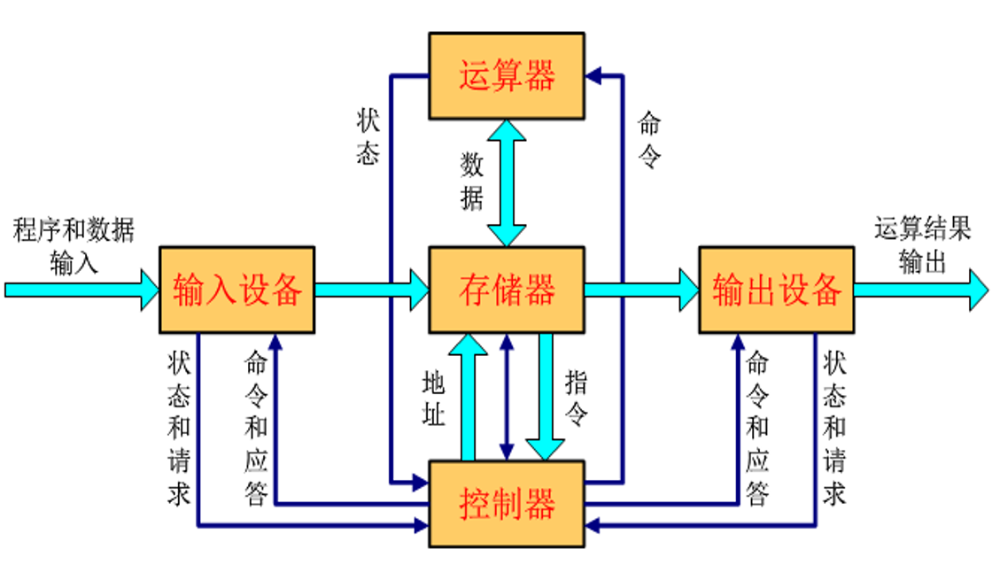
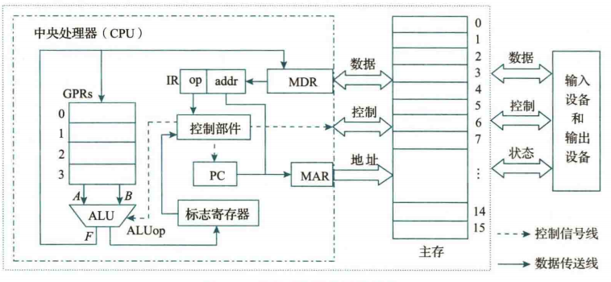
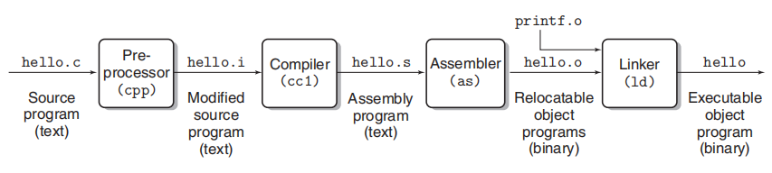
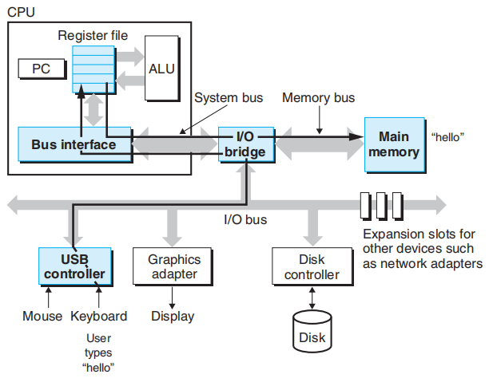
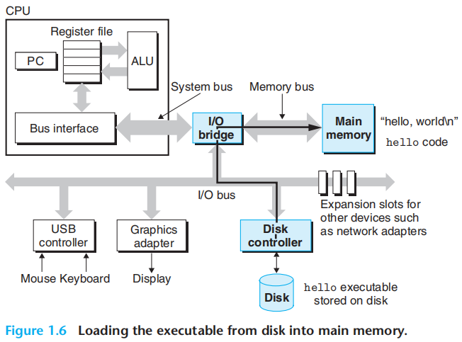
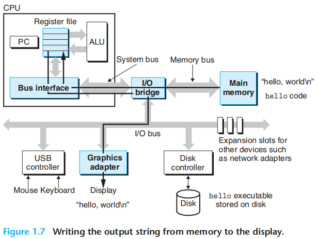
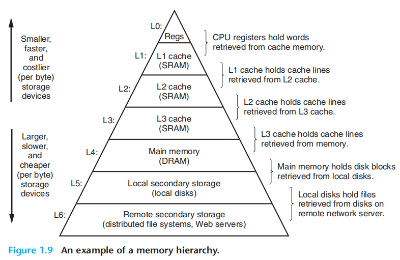
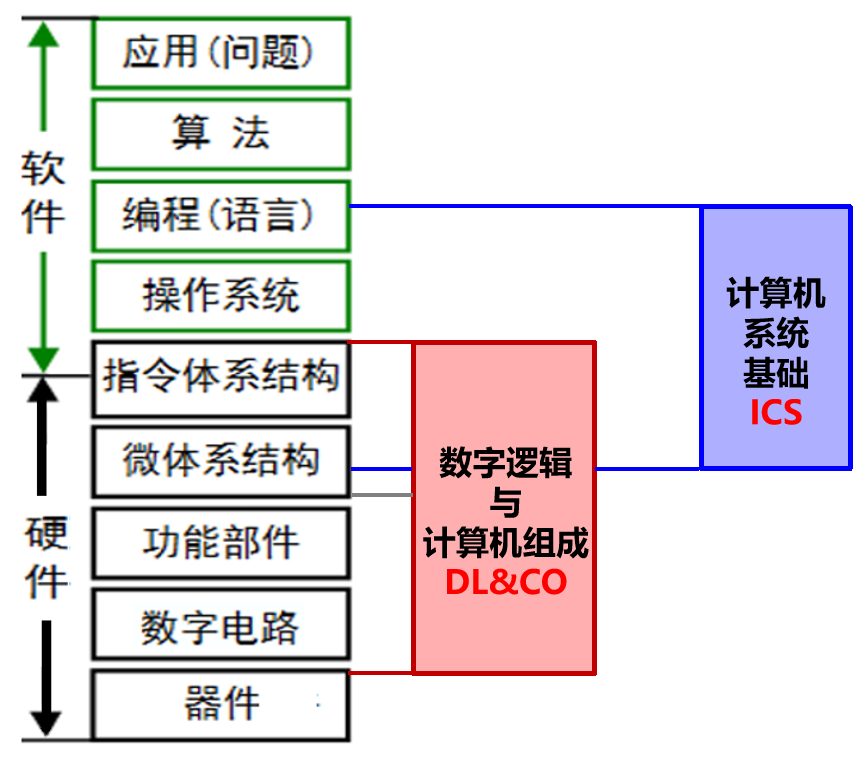
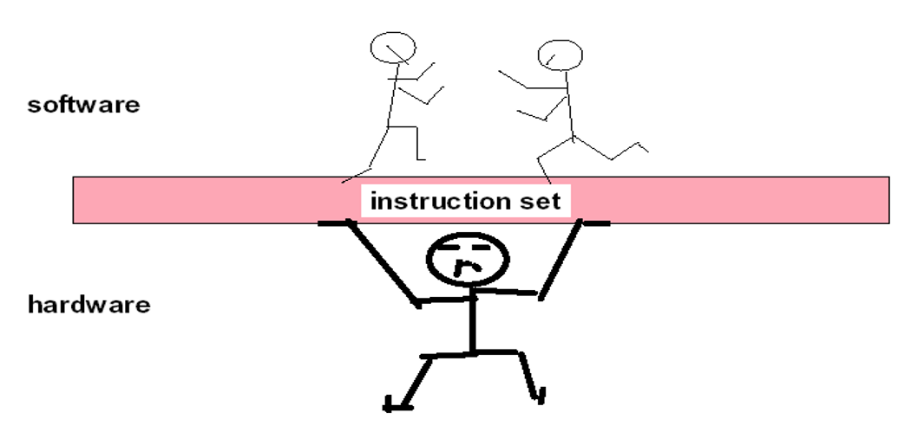
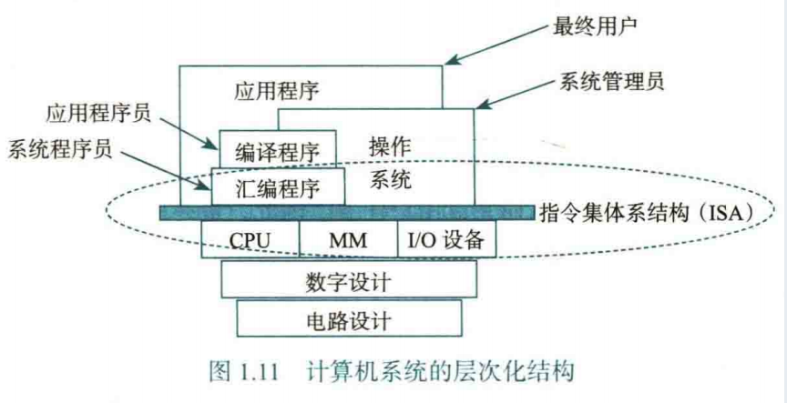

# Ch.1 计算机系统概述

这一章内容是对整个计算机结构的一个总览

## 计算机结构

首先是冯·诺依曼结构的基本思想：

- 采用“存储程序”的工作方式：将程序和原始数据送入主存后才能执行程序；程序执行后计算机可以无干预地自动完成取指令、执行的操作
- 由运算器、控制器、存储器、输入设备、输出设备组成
    - 存储器可以存放数据与指令，并且两者在形式上没有区别，由计算机识别区分
    - 控制器自动执行指令
    - 运算器进行算术运算和逻辑运算
    - 输入/输出设备用于操作人员对计算机的使用

??? quote "图示"

    

- 计算机内部采用二进制存储；指令 = 操作码 + 地址码 = 操作类型 + 操作数地址；一串指令组成程序

 

基于冯·诺依曼结构，一种模型机的实现如图：

首先，为了存储指令与数据，我们需要**主存/内存**。为了与主存进行信息的交换，我们使用**总线**进行信息传输。为了更好的指出数据在主存中的位置，我们为主存的每个单元编号，即主存地址

信息分为地址信息、数据信息、控制信息三部分，我们使用**主存地址寄存器 MAR** 存储地址信息，使用**主存数据寄存器 MDR** 存储数据信息，控制信息直接送往专门的控制部件

为了更加快速地访问一些从主存取来的数据或运算结果，我们使用**通用寄存器组 GPRs** 进行存储。对寄存器的读写速度远快于主存，但由于寄存器的成本很高，因此我们只通过 GPRs 的有限空间存储必要的数据。GPRs 和主存一样都进行编号

通过 MDR 的内容，我们将指令信息临时存入**指令寄存器 IR** 中，每条指令分为 op 和 addr（操作码 + 地址码） 两部分，op 部分由控制部件处理，addr 部分交给 MAR 进行地址信息运输

控制部件一方面控制**算术逻辑部件 ALU** 的运算操作（由 op 是否涉及运算操作决定），另一方面控制**程序计数器 PC** 的值，对于 x86 架构的机器，其本质是寄存器 EIP，作用是始终存储“下一条指令”的值（不考虑现代化机制）。

- 通常 PC 在取完指令后就更新为下一条指令的地址了

ALU 从寄存器/指令流中获取最多两个操作数进行运算，为了为其他指令提供计算结果的相关信息（比如条件跳转指令），ALU 会根据 ALUop 和计算结果同步修改**标志寄存器 EFLAGS** 的内容，比如零标志 ZF、符号标志 SF，无符号进位标志 CF，有符号溢出标志 OF。

- 比如 `je` 指令需要判断两个数是否相等，只需要将两数相减并检查 ZF 的值即可

---

程序是由一系列指令组成的，指令执行的过程可以简单理解为：

> 取指令 → 指令译码 → PC 增量 → 取操作数 → 运算 → 送结果

具体到单条指令也有对应的微操作，单条指令在若干个时钟周期内完成，这些都是 DLCO 的学习内容了

 

## 程序语言

最初的程序就是纯粹的 0/1 串，我们将这种计算机能直接理解的指令格式称为机器语言，对应的指令为机器指令，对应的程序为机器语言程序/机器代码

之后我们使用助记符对 0/1 串进行符号化的表示，这种符号表示语言为汇编语言，对应的指令为符号指令

> 机器语言和汇编语言都属于机器级语言，因为这两种指令都与特定的机器结构相关，都是低级语言。

我们发现：机器级指令的功能过于简单，以至于完成一项任务需要描述很多细节；同时机器级指令依赖具体的机器架构。因此逐渐诞生了高级编程语言，它同时满足“架构无关”“可读性好”“描述能力强”等优点

> 描述能力强具体体现在：一个 `for` 循环语句可以对应于多条汇编语句的同等实现

但是计算机只能直接理解机器语言，因此需要对高级语言进行底层化的翻译，至少要翻译到汇编级别，并最终以机器代码的方式执行，总共三种方式：

- 汇编器：汇编语言源程序 → 机器语言目标程序

- 解释器：源程序的语句按照执行顺序逐条翻译成机器指令，然后立即执行（比如 Python）

- 编译器：高级语言源程序 → 机器级语言目标程序（比如 C）

 

## 实现并执行程序的流程

以 C 语言为例，首先编辑出 `hello.c` 文件，然后由预处理程序对 `#` 开头的宏指令进行处理（引用库嵌入，宏替换，条件编译），得到 `hello.i` 文件

通过编译程序进行编译，根据当前机器架构等参数生成汇编语言源文件，得到 `hello.s` 文件

然后用汇编程序进行汇编，生成可重定位目标文件 `hello.o`

最后用链接程序将可重定位目标文件进行合并，完善定位表等信息，最终得到可执行目标文件，存放在硬盘，可加载到内存执行

我们通过 shell 命令行解释器（操作系统的外壳程序，shell）执行可执行文件 `hello`，shell 程序会将用户的输入读入 CPU 寄存器中，进而传输到主存中（缓冲区）

---

按下 Enter 键刷新缓冲区，缓冲区内容通过操作系统内核处理后调用相应的服务例程，将硬盘中的可执行目标文件加载到主存

> 加载的内容包括代码和数据，比如 `#!c printf("hello, world\n")` 中的常量字符串通过 ASCII 码存储就是数据，`printf` 对应的机器指令属于指令

---

程序执行时，将常量字符串加载到寄存器中，通过外设（显示器，通过 shell 终端屏幕）打印

 

## 存储结构

（抄 csapp 的）

对于执行 `hello`，操作系统花费了大量时间将信息从一处移动到另一处。`hello` 程序中的机器指令最初存储在磁盘上，当程序加载时，它们被复制到主内存中。随着处理器运行程序，指令又从主内存复制到处理器内。同样，数据字符串 "`hello, world\n`" 最初位于磁盘上，先被复制到主内存，然后再从主内存复制到显示设备。从程序员的角度来看，这些复制操作大多属于开销，会拖慢程序的“实际工作”。因此，系统设计者的一个主要目标就是让这些复制操作尽可能快地运行。

由于物理定律的限制，容量较大的存储设备通常比容量较小的设备更慢。而速度更快的设备在制造成本上也高于速度较慢的设备。

为了应对处理器与内存之间的速度差距，系统设计者引入了更小、更快的存储设备，称为**缓存存储器**（简称**缓存**），作为处理器在近期可能所需信息的临时暂存区。处理器芯片上的 **L1 缓存**可容纳数万字节，访问速度几乎与寄存器文件一样快。容量更大的 **L2 缓存**（几十万到几百万字节）通过一条特殊总线与处理器相连。处理器访问 L2 缓存所需的时间可能是访问 L1 缓存的 5 倍，但这仍然比访问主内存快 5 到 10 倍。L1 和 L2 缓存是通过一种称为**静态随机存取存储器（SRAM）** 的硬件技术实现的。更新、更强大的系统甚至拥有三级缓存：L1、L2 和 L3。

缓存背后的思想是，系统可以通过利用**局部性原理**（即程序倾向于访问局部区域内的数据和代码的特性），同时实现超大容量和超高速度的内存效果。通过设置缓存来存放可能被频繁访问的数据，我们可以使用快速的缓存来完成大多数内存操作。

在此基础上设计**存储器层次结构**。当我们从层次结构的顶部向底部移动时，设备变得更慢、容量更大，且每字节的成本更低。寄存器文件位于层次结构的顶层，称为第 0 级或 L0。图中展示了三级缓存 L1 到 L3，分别占据存储器层次结构的第 1 级到第 3 级。主内存位于第 4 级，依此类推。

存储器层次结构的核心思想是，某一级的存储设备充当下一级（更低一级）存储设备的缓存。因此，寄存器文件是 L1 缓存的缓存。L1 和 L2 缓存又分别是 L2 和 L3 缓存的缓存。L3 缓存是主内存的缓存，而主内存又是磁盘的缓存。在一些具有分布式文件系统的网络系统中，本地磁盘充当存储在其他系统磁盘上的数据的缓存。

> 寄存器访问是最快的，其次是各级缓存，然后是主存，最后是硬盘和云端存储
>
> 当然价格也是这样由昂贵到便宜的

## 计算机系统的层次结构

如图所示

指令体系结构即 ISA，又称为指令系统/架构，ICS 教学采用的是 Inter x86 结构，隔壁 DLCO 采用的是 RISC-V 架构

如果要自顶向下描述的话：

一个具体的问题要采用某些算法来实现解决，让计算机执行算法内容需要用具体的编程语言进行程序源代码的实现，可执行程序需要操作系统提供的用户界面和底层系统调用服务历程（比如 `sys_write`），

ISA 定义一台计算机可以执行的所有指令的集合，每条指令规定了计算机执行的硬件级操作，以及操作数存放的地址空间与操作数类型。其作为软件层和硬件层的中间层，是软件可见部分

??? quote "神秘插图 from DLCO 课件"

    

之后的硬件部分对程序员透明：实现 ISA 的具体逻辑结构为微体系结构，简称为微架构，其最终由逻辑电路实现，而逻辑电路最终通过期间技术实现

> 计算机系统实际以逐层向上抽象的方式构成，通过向上层用户提供抽象的简洁接口将较低层次的实现细节隐藏起来；上面的自顶向下的描述仅供参考

 

## 计算机系统的层次化结构

> ISA 提供了机器级目标代码层接口 ABI（应用程序二进制接口），编译器后端的设计应遵循 ISA 规范和 ABI 规范
>
> 相对地，API 定义了较高层次的源程序代码和库之间的接口，通常和硬件层无关
>
> 开发者引入 `<stdio.h>` 正确使用 `printf()` 函数属于 API 层面；设计编译器的 `printf()` 实现（包含栈分配等）属于 ABI 层面

