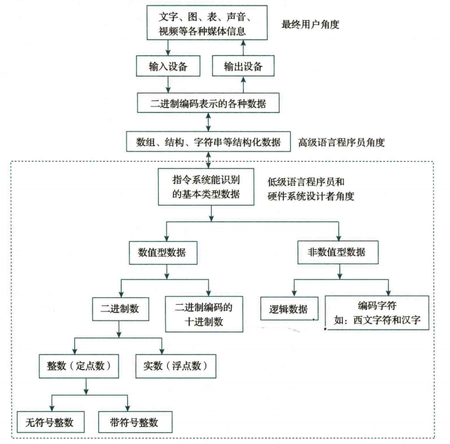
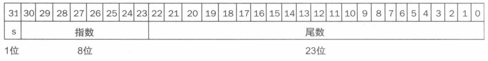
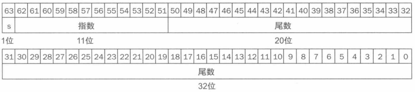
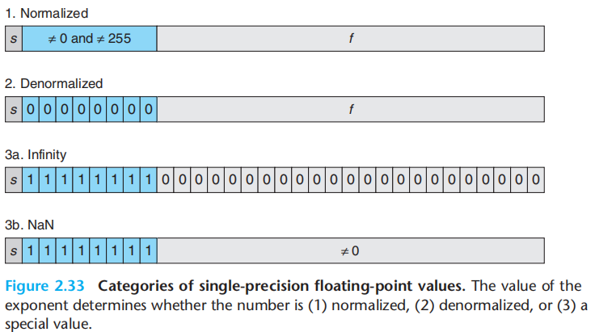
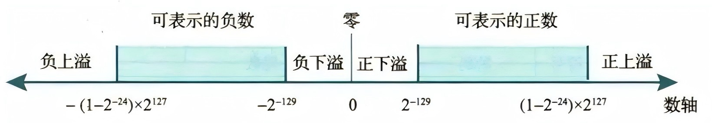
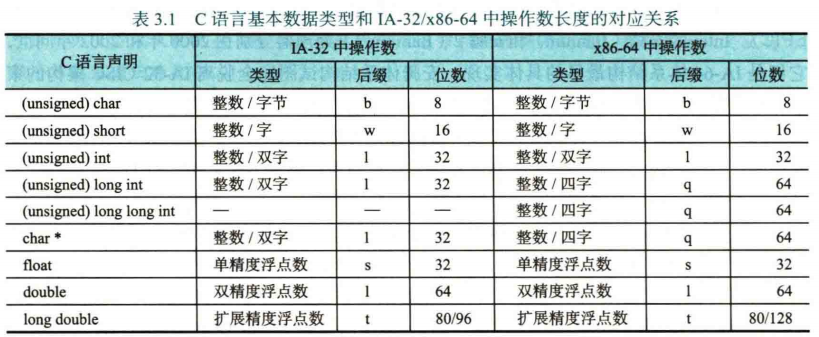
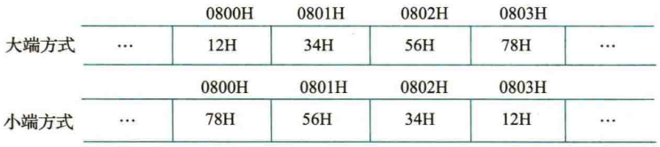
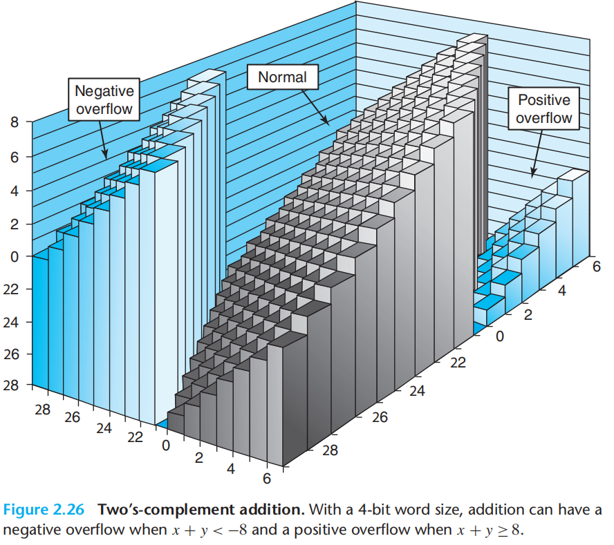

# Ch.2 数据的机器级表示与处理

> 其实 DLCO 已经完全学过这里面的内容了
>
> 大多数笔记都是从 DLCO 笔记上扣下来的
>
> 随手边抄边记了一点

计算机内部采用二进制编码，因为大多数物理元件都是二元状态，并且运算规则简单，符合逻辑直觉

??? quote "计算机外部信息与内部数据的转换"

    

## 整数的进制转换

### R 进制转十进制

按权展开即可，比如：

$$
(123.45)_{R} = (1 \times R^{2} + 2 \times R^{1} + 3 \times R^{0} + 4 \times R^{-1} + 5 \times R^{-2})
$$

### 十进制转 R 进制

对于整数部分，不断将整数除以 R，取得的余数从低位到高位排列，保留商继续计算，直到商为 0

对于小数部分，不断将整数乘以 R，取得的整数从高位到低位排列，保留小数部分继续计算，直到小数部分为 0

比如：$({123.45})_{10}$ 拆分为整数部分 $123$ 和小数部分 $0.45$

$$
123 \div 2 = 61 \cdots {{\color{orange}1}} \\\\
61 \div 2 = 30 \cdots {{\color{orange}1}} \\\\
30 \div 2 = 15 \cdots {\color{orange}0} \\\\
15 \div 2 = 7 \cdots {\color{orange}1} \\\\
7 \div 2 = 3 \cdots {\color{orange}1} \\\\
3 \div 2 = 1 \cdots {\color{orange}1} \\\\
1 \div 2 = 0 \cdots {\color{orange}1} \\\\
$$

因此 $123 = (1111011)_{2}$，同理计算小数部分：

$$
0.45 \times 2 = {\color{orange}0} + 0.90 \\\\
0.90 \times 2 = {\color{orange}1} + 0.80 \\\\
0.80 \times 2 = {\color{orange}1} + 0.60 \\\\
0.60 \times 2 = {\color{orange}1} + 0.20 \\\\
0.20 \times 2 = {\color{orange}0} + 0.40 \\\\
0.40 \times 2 = {\color{orange}0} + 0.80 \\\\
0.80 \times 2 = {\color{orange}1} + 0.60 \\\\
\cdots\;\cdots
$$

因此 $0.45 = 01\overline{1100}$，其中 $\overline{1100}$ 是无限循环小数的循环节

最终得到 $123.45 = (1111011.01\overline{1100})_2$ 

### 二进制 $\leftrightarrow$ 十六进制

按照 “四位二进制数 = 一位十六进制数” 的方式进行转换即可，注意二进制转换为十六进制时，对于不满四位的部分，整数部分向高位补零，小数部分向低位补零

$$
(11001.11)\_{2} = (0001\;1001.1100)\_{2} = (19.C)\_{16}
$$
<br>

## 浮点数表示

小数点位置约定为可浮动的数称为浮点数

同一个数根据小数点的位置有多种表示方式，存在唯一的规格化形式，尾数的小数点前只有一位非零的数。

> 比如 $1.23  × 10^{21}$ 就是某个十进制数唯一的规格化形式，写成 $0.123\times 10^{22}$ 和 $12.3\times 10^{20}$ 都不是规格化的

设计浮点表示时，我们需要考虑尾数和指数位数的设计：一方面，增加尾数位数的大小可以提高小数精度，另一方面，增加指数位数的大小可以提高可表示的范围，两者间存在制约

对于IEEE 754 浮点数标准，单精度浮点数采取下面的表达方式：

$$
Value = (-1)^s \times (1 + F) \times 2^{E - bias},\quad bias = 127
$$



$s$ 是符号位；$E$ 是指数位，采用移码表示，偏置常数 $bias = 127$；$F$ 是尾数，为了存储更大的内容，尾数隐含了前导 1（因此写成 $(1+F)$）

??? quote "双精度"

    

??? abstract "举例 1：将单精度数 `BEE00000H` 转换为十进制真值"

    先转化为二进制表示：
    
    $1|011 \;1110 \;1|110 \;0000 \;0000 \;0000 \;0000 \;0000$
    
    $s = 1$ 表示负数； $E = (0111 1101)_{2} = 125$ ，$e = E - bias = -2$
    
    $F = 1 + 1×2^{-1}+ 1×2^{-2} + 0×2^{-3} + 0×2^{-4} + 0×2^{-5} + \cdots =1+2^{-1} +2^{-2} = 1.75$
    
    ∴ 十进制真值为 $-1.75 × 2^{-2} = -0.4375$

??? abstract "举例 2：将十进制真值 $-12.75$ 转换为 IEEE 754 浮点数表示"

    （取绝对值）分别转换整数和小数部分得到：
    
    $12.75 = (1100.11)_{2} = 1.10011 × 2^{3} $ （规格化）
    
    计算 $E = 127 + 3 = (1000 0010)_{2} ，s = 1$；
    
    ∴ 二进制表示为 $1|100 \;0001 \;0|100 \;1100 \;0000 \;0000 \;0000 \;0000$ ，转化为16进制为 `C14C0000H`

关于 IEEE 754 对浮点数的具体编码方式参考下表，其中非规格化数 Denormalized 的意思是：当指数位为 0 时，说明我们想要表示一个非常小的数字，此时我们会将尾数部分的前导 1 变更为前导 0，以支持更小的浮点数表示



以下大致描述了 IEEE 754 浮点数能表示的数字区间，上溢表示正指数太大而无法用指数位存储，下溢表示负指数太大而无法用指数位存储



以单精度浮点数为例：

规格化正数最大为 `0 11111110 11111111111111111111111`

规格化正数最小为 `0 00000001 00000000000000000000000`

非规格化正数最小为 `0 00000000 00000000000000000000001`

（注意正负无穷和非规格化数的特殊表示）

<br>

## 定点数表示

我们记一个数在现实世界中的具体表示形式为机器数的真值

将数的符号也通过 0/1 表示的处理方式称为符号数字化，考虑下面几种表示方式：

**1- 原码**

单独采用一个符号位，除了最高位符号位以外其余的都是数值位

原码表示的优点是和真值对应非常直观方便，缺点是 0 的表示不唯一（有 +0 和 -0），并且原码运算需要单独处理符号位。

原码通常用于浮点数的尾数部分

**2- 补码**

由符号位后跟真值的模 $2^n$ 补码构成（因此同一个真值在不同位数的补码表示中对应的机器数可能不同）。C 语言的整型数据的存储方式就是补码

从数值计算上简单来说：正数的补码与原码相同，负数的补码是取绝对值的原码取反后加 1，并且对补码还原为原码，同样是进行一次“**取反加一**”操作

!!! example "比如：$-5$ 转二进制 $(10000101)_{2}$，对数值位取反 $(11111010)_{2}$ 加一 $(11111011)_{2}$ 得到补码"

补码的取值范围是 $[-2^{n-1} \sim 2^{n-1} - 1]$ ，其中 $n$ 是位数，补码计算的溢出参考模运算环

补码统一了 0 的表达方式（也使得 `100...0` 可以用于表示 $-2^{n-1}$ 而不是 $-0$），统一了加减法操作

??? tip "已知补码求真值：按照二进制转十进制方法计算，但最高位（符号位）是减号"

    比如：$(1101 0110)_{2} = -2^7 + 2^6 + 2^4 + 2^2 + 2^1 = -42$

还有一种叫变形补码的变种，符号位为两位，当两位符号位不同时说明出现了溢出：

- `01` → 正溢出（结果 > 最大正数）
- `10` → 负溢出（结果 < 最小负数）

作用是加速溢出检测

**3- 移码**

选取一个偏置常数 bias，那么一个数 $x$ 的移码表示为 $x + bias$

移码通常用于浮点数的指数部分，目的是将阶的数据范围对齐到 0 为中点

**4- 反码**

类似补码，但是取反后不加一

没什么用（

<br>

## C 语言的数据类型

C 语言允许无符号数和带符号数进行类型转换，实际上转换前后机器数不变，只是根据数据类型改变了对机器数的解释方式

C 语言标准规定：位宽相同的无符号整数和带符号整数同时参与运算，按照无符号整数进行运算

C 语言的 `float` 和 `double` 分别对应了 IEEE 754 单精度浮点数和双精度浮点数，现在考虑 `double` `float` `int` 之间的类型转换问题：

`double` 的精度最高，尾数部分 52 + 1 = 53 位超过了 `int` 的位数，因此 `int` `float` 类型转换到 `double` 不会损失任何精度

`float` 的精度其次，其位数部分由 23 + 1 = 24 位，因此对于绝对值不超过 $2^{24}$ 的 `int` 值，可以无损失地转换为 `float`，对于更大的 `int` 值会开始产生舍入误差

`int` 的精度最低，考虑到其完全不能存储小数，但是可以保证 31 位的数据位是精确存储的。`float` 和 `double` 一旦有小数部分，转换为 `int` 就会损失精度


## 数据的宽度

二进制信息的最小单位是比特 bit，1 bit 也就是一位 0/1

二进制信息的计量单位是字节 1 byte = 8 bit。现代存储器通常按照字节来编址，此时字节是最小可寻址单位

“字” 也是一个处理信息的常用单位，对于不同的计算机，1 word = 2/4/8/16 byte 都有可能。字是计算机一次能够处理的数据单元的自然大小（系统所支持的数据类型的宽度基准）

“字长” 和 “字” 的定义不同，字长指的是 CPU 内部用于整数运算的数据通路的宽度，我们说的 16/32/64 位机器，也就是在说对应的字长是 16/32/64。字长等于 CPU 内部整数运算器（ALU）和通用寄存器的位数

**字是系统架构层面的概念，而字长是硬件实现层面的概念**。早期系统通常简单定义字的长度就是字长，但是这并不绝对。比如 Intel x86 80386 的字长至少为 32 位，但是为了兼容 8086，将字的宽度定义为 16 位，将 32 位称为双字

对于存储信息，我们通常使用更大的容量单位：

| 单位词头 | 符号 | 字节数        |
| :------- | :--- | :------------ |
| K (Kilo) | KB   | $2^{10}$ Byte |
| M (Mega) | MB   | $2^{20}$ Byte |
| G (Giga) | GB   | $2^{30}$ Byte |
| T (Tera) | TB   | $2^{40}$ Byte |
| P (Peta) | PB   | $2^{50}$ Byte |

在描述距离，频率等数值时，我们更常用 10 的幂而不是 2 的幂，因此在由时钟频率计算得到的总线带宽或外设数据传输率中，度量单位也用 10 的幂表示

为了和 2 的幂的表示方式作区分，我们规定大写 K = 1024，小写 k = 1000，并且 b 采用小写：

| 带宽单位 | 另一种写法 | 单位换算      |
| :------- | :--------- | :------------ |
| b/s      | bps        | $1$ bps       |
| kb/s     | kbps       | $10^3$ bps    |
| Mb/s     | Mbps       | $10^6$ bps    |
| Gb/s     | Gbps       | $10^7$ bps    |
| Tb/s     | Tbps       | $10^{12}$ bps |

对于表示硬盘容量和文件大小，IEC 规定，在原前缀字母后跟 i 表示 2 的幂，否则为 10 的幂，比如：1MiB = $2^{20}$ B，1MB = $10^6$ B

事实上对于绝大多数题目都采用 2 的幂

---

对于 C 语言，其在 32 位/ 64 位机器下不同数据类型的宽度定义：

下表内容基于 System V ABI 规范，ABI 是基于 ISA 的



<br>

## 数据的存储

对于超过一个字节的数据，我们的存储方式分为大端方式和小端方式：

比如对于 `12345678H` 这个数据，其最低有效字节 LSB = `78H`，最高有效字节 MSB = `12H`，大端方式将 MSB 存放在低地址，将 LSB 存放在高地址 ，而小端方式则相反：



Intel x86 采用小端方式


## 数据的运算

移位运算包含逻辑移位和算术移位。对于逻辑右移，高位始终补零，而对于算术移位，高位始终补符号位；左移在机器数层面没有区别

类型转换时可能涉及扩展操作，零扩展高位补零，符号扩展高位补符号位。C 语言默认对无符号数进行零扩展，对带符号数进行符号扩展，这会导致机器数两个相同的数扩展后的值不同

除了扩展还有截断操作，截断后的值即使丢失位信息也属于“实现定义行为”

对于 ALU 运算，我们根据运算结果得到相应的符号位信息：

ZF = 1 表示计算结果为 0

OF = 1 表示两个带符号数的计算出现正/负溢出，比如两个符号相同的数相加，如果计算结果的符号相反，说明发生溢出

SF = 1 表示计算结果为负数

CF = 1 表示两个无符号数的计算出现进/借位，加法时 CF = 进位输出 C，减法时 CF = ~C，因此 CF = Sub ⊕ C

---

ALU 进行乘法计算的开销比较大，因此编译器在处理相应的运算程序时，会对整数乘法进行优化：用移位操作和加减法操作代替乘法操作

> 比如：`x*63 == x << 6 - x`

除法运算因为会产生小数部分，因此不方便优化。但是对于除数为 2 的幂，会采用右移进行优化

---

定点数运算有时会出现溢出情况，下面的图形象的表现了模-2 补码表示下，加法运算溢出的情况：



---

### 浮点数运算

考虑浮点数加减运算，需要进行四个步骤：对阶、尾数加减、尾数规格化、尾数舍入：

1- 对阶：对接的目的是为了让两个浮点数的尾数可以直接相加减，举个例子：$1.23 \times 10 ^ 3$ 和 $4.56 \times 10 ^5$ 不可以直接对尾数相加，需要通过对阶操作得到：

$$
0.0123\times 10^5 + 4.56\times 10^5 = 4.5723 \times 10 ^ 5
$$

2- 尾数加减：即定点原码小数加减运算，注意前导数 0/1 也需要参与计算

3- 尾数规格化：尾数加减后可能会破坏规格化，需要重新进行左归/右规

4- 尾数舍入：在对阶和尾数右规操作中，可能会对尾数进行右移而损失精度。通常会保留溢出的一部分低位参与中间运算，最后再进行摄入操作

针对尾数舍入操作，为了维护一定的精度，我们在浮点数尾数右侧紧跟着设置保护位、舍入位和粘位，其中保护位和舍入位保存最后被溢出的两位中间结果，粘位是所有被移出的位的逻辑或，也就是说只要存在 1 从舍入位被进一步右移，那么粘位就是 1

舍入方式也有很多方式：向偶数舍入、向上舍入、向下舍入、朝 0 舍入（即截断）

向偶数舍入也就是 0 舍 1 入的过程，结合粘位使用可以达到较好的近似效果

右规和舍入操作可能会使阶码全为 1，发生阶码上溢；左规操作可能会是阶码全为 0，此时考虑从规格化表示转为非规格化表示，尾数不变，阶码全为 0

<br>

浮点数乘除运算不需要经历对阶操作，因为尾数和指数分别进行乘法计算，之后的规格化和舍入是一样的

<br>

浮点运算因为精度限制可能会出现各种非预期结果，最主要的体现就是 “大数舍去小数”，比如：

```c++
float x = -1.5e30f, y = 1.5e30f, z;
z = 1.0f;
(x + y) + z == 1.0f;		// true
x + (y + z) == 0.0f;		// true

z = 1.5e-30f;
(x * y) * z == -INF;		// true
x * (y * z) == -1.5e30f;	// true
```

