# Ch.3 程序转换与指令系统 

## 寄存器传送语言 RTL

- R[r] 表示寄存器 r 的内容
- M[addr] 表示存储单元 addr 的内容
- M[PC] 表示程序计数器指向的存储单元的内容
    - M[R[r]] 表示将寄存器 r 的内容作为地址 addr，获取存储单元 addr 的内容
- 数据传送采用箭头 ← 表示，传送源在右，传送目的在左
    - R[ax] ← M[R[ebp]+4] 等价为 `#!asm movw 4(%ebp), %ax`

<br>

## 汇编指示符

汇编代码文件除了汇编指令以外，还包含汇编指示符，以 `.` 开头，比如：

- 段/节定义指示符：将代码和数据组织成不同的逻辑块，链接器会将它们合并和放置到最终可执行文件的适当位置
    - `.text` 声明后续内容为代码节
    - `.data` 声明后续内容为已初始化数据节，包含有初始值的全局/静态变量
    - `.bss` 或者 `.section .bss` 声明后续内容为未初始化数据节，默认初始化为 0
    - `.rodata` 或者 `.section .rodata` 声明后续内容为只读数据节
- 数据定义与分配指示符：在 `.data` (`.rodata`) 中定义和初始化变量，或在 `.bss` 段中预留空间
    - `.string` 定义以空字符结尾的 C 语言风格字符串，比如 `.string "abc\n"`
    - `.ascii` 定义不以空字符结尾的 ASCII 字符串
    - `.byte` `.short` `.word` `.long` `.quad` 分别表示分配 1/2/2/4/8 字节的内存并初始化
    - `.space` 用于为 `.bss` 节的数据分配空间并初始化填充
    - `.float` `.double` 定义单精度/双精度浮点数
- 符号相关指示符：控制符号（如标签、函数名、变量名）的链接可见性和类型
    - `.global symbol` 声明一个全局可见的符号，可以将 `global` 简写为 `globl`
    - `.local` `.weak` 分别声明一个局部符号和弱符号
    - `.type symbol, @function/@object` 分别指定该符号为函数/数据对象
- 对齐指示符：确保数据或代码在内存中满足特定的地址对齐要求
    - `.align m` `.balign n` 表示从此处开始内存按照 $2^m$ / $n$ 字节对齐

汇编指示符指示汇编器如何生成机器代码，不属于指令本身

??? tip "一个比较神秘的段分配机制"

    对于下面的两则变量声明：
    
    ```c++
    volatile int a[1] = {1};
    volatile double b[1] = {1.0};
    ```
    
    其中 `a` 和 `b` 本质都是指针，存入 `.data` 段；初始值 `1` 存入 `.data` 段，但是初始值 `1.0` 字面量会被存入 `.rodata` 段，原因是整数常量在汇编中可以立即数嵌入指令，而 double 常量通常不能直接嵌入，需要单独存储。

<br>

## 汇编格式

汇编格式分为 Intel 格式和 AT&T 格式，两者在代码表示上有较大的区别：

| 方面                 | Intel 格式                                              | AT&T 格式                                                    |
| -------------------- | ------------------------------------------------------- | ------------------------------------------------------------ |
| 操作数顺序           | 目的操作数在前，源操作数在后（dest, src）               | 源操作数在前，目的操作数在后（src, dest）                    |
| 大小指定（内存操作） | 由寄存器或 ptr 指定<br />比如 byte/word/dword/qword ptr | 通过指令后缀指定<br />有后缀：b (byte)、w (word)、l (long)、q (quad) |
| 立即数前缀           | 无（十六进制以 `0x` 开头或 `h` 结尾）                   | `$` 前缀（十六进制以 `$0x` 开头）                            |
| 寄存器前缀           | 无                                                      | % 前缀                                                       |
| 内存操作符           | 用 [ ] 包围                                             | 用 ( ) 包围                                                  |
| 内存寻址格式示例     | [ebx + ecx*4 + 20h]                                     | 0x20(%ebx, %ecx, 4)                                          |

一个例子：R[eax] ← R[eax] + M[R[ebx] + R[ecx]×4 + 0x20]

- Intel 格式（`ptr` 就是指针，和 C 语言的指针意思相同）

  ```nasm
  add eax, dword ptr [ebx + ecx*4 + 20h]
  ```

- AT&T 格式

  ```gas
  addl 0x20(%ebx, %ecx, 4), %eax
  ```

<br>

## 指令系统

IA-32 指的是 Intel 32 位 x86 架构的名称，即 Intel Architecture, 32-bit，其第一代产品为处理器 Intel 80386

x86-64 指的是 AMD 推出的兼容 IA-32 的 64 位版本指令集 x86-64，又叫做 AMD 64 / x64

IA-64 是一次较为失败的扩展，基于超长指令字技术；之后推出的 Intel 64 是兼容 x86-64 的扩展指令集

<br>

## 寄存器组织

我们将 IA-32/x86-64 指令中用到的寄存器组分为定点寄存器组、浮点寄存器栈、多媒体扩展寄存器组：

### 定点寄存器组

**IA-32 阶段有 8 个通用寄存器、2 个专用寄存器、6 个段寄存器**，我们先讨论通用寄存器：

（注意：IA-32 的 ESI EDI EBP ESP 寄存器的 8 位信息是无法直接使用的）

| 寄存器（32位） | 低16位 | 低8位 | 高8位 | 常规用途（注意英文首字母）                                   |
| -------------- | ------ | ----- | ----- | ------------------------------------------------------------ |
| EAX            | AX     | AL    | AH    | 累加器（Accumulator）                                        |
| EBX            | BX     | BL    | BH    | 基址（Base）                                                 |
| ECX            | CX     | CL    | CH    | 计数器（Count）                                              |
| EDX            | DX     | DL    | DH    | 数据（Data）                                                 |
| ESI            | SI     | -     | -     | 源索引（Source Index）                                       |
| EDI            | DI     | -     | -     | 目的索引（Destination Index）                                |
| EBP            | BP     | -     | -     | 基指针（**B**ase Pointer，栈帧）<br />简单来说 **EBP 指向栈底数据** |
| ESP            | SP     | -     | -     | 栈指针（**S**tack Pointer）<br />简单来说 **ESP 指向栈顶数据** |

每个通用寄存器都有一种约定俗成的作用，通常 EBP 和 ESP 的作用不会被改变

到了 x86-64 阶段，出现了很多变化：

- 原有的通用寄存器扩展到了 64 位：

| RAX  | RBX  | RCX  | RDX  | RSI  | RDI  | RBP  | RSP  |
| ---- | ---- | ---- | ---- | ---- | ---- | ---- | ---- |

- ESI EDI EBP ESP 寄存器的低 8 位可以使用，分别命名为 SIL DIL BPL SPL；高 8 位没有访问实现，只有 AH/BH/CH/DH 这四个寄存器有高 8 位的访问方式

- 新增了 8 个没有约定用途的寄存器，目的是减少对栈的使用。这 8 个寄存器也没有高 8 位的访问实现，并且低位的后缀不一样，使用的是 **D**word **W**ord **B**yte 后缀

| 寄存器（64位） | 低32位 | 低16位 | 低8位 |
| -------------- | ------ | ------ | ----- |
| R8             | R8D    | R8W    | R8B   |
| R9             | R9D    | R9W    | R9B   |
| R10            | R10D   | R10W   | R10B  |
| R11            | R11D   | R11W   | R11B  |
| R12            | R12D   | R12W   | R12B  |
| R13            | R13D   | R13W   | R13B  |
| R14            | R14D   | R14W   | R14B  |
| R15            | R15D   | R15W   | R15B  |

??? quote "图示"

    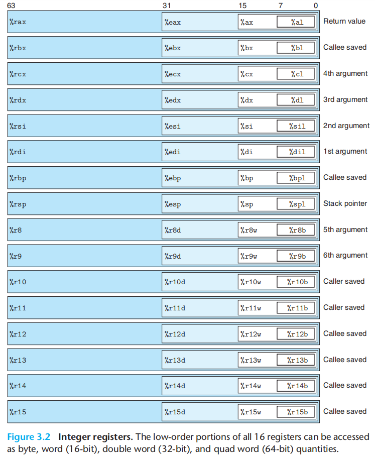

<br>

IA-32 的 2 个专用寄存器分别为指令指针寄存器 EIP 和标志寄存器 EFLAGS，前者即 PC 的硬件实现，后者记录机器的状态和控制信息

EIP 和 EFLAGS 分别由 16 位的 IP 和 FLAGS 寄存器扩展，其中 16 位的版本用于实地址模式，32 位的版本用于保护模式（对于实模式，高 16 位的信息没有作用）

对于 EFLAGS，我们可以简单地将其看作 32 个 bool 值，因为大多数标志信息都是由一个比特位决定：

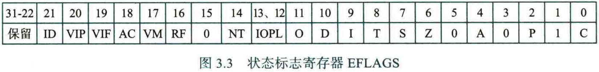

图中为 0/1 的位为保留位，总是为 0/1，比如第 1, 3, 5, 15 位；第 22~31 位未使用

给出前 15 位的具体内容：

| 位位置    | 标志名称                       | 说明                                                         | 类别     |
| :-------- | :----------------------------- | :----------------------------------------------------------- | :------- |
| **0**     | **CF** (Carry Flag)            | **进位标志**：**无符号**算术操作产生进位/借位时置1<br />通常对于有符号运算无效 | 状态标志 |
| **1**     | **保留**                       | 总是为1                                                      | 保留位   |
| **2**     | **PF** (Parity Flag)           | **奇偶标志**：结果低字节中1的个数为偶数时置1                 | 状态标志 |
| **3**     | **保留**                       | 总是为0                                                      | 保留位   |
| **4**     | **AF** (Auxiliary Carry Flag)  | **辅助进位标志**：BCD运算时的进位/借位                       | 状态标志 |
| **5**     | **保留**                       | 总是为0                                                      | 保留位   |
| **6**     | **ZF** (Zero Flag)             | **零标志**：运算结果为0时置1                                 | 状态标志 |
| **7**     | **SF** (Sign Flag)             | **符号标志**：运算结果为负时置1                              | 状态标志 |
| **8**     | **TF** (Trap Flag)             | **陷阱标志**：单步调试时置1                                  | 系统标志 |
| **9**     | **IF** (Interrupt Enable Flag) | **中断使能标志**：允许响应可屏蔽中断时置1<br />对非屏蔽中断和内部异常无效 | 系统标志 |
| **10**    | **DF** (Direction Flag)        | **方向标志**：指定字符串操作方向（0=递增，1=递减）<br />具体来说是确定串操作指令进行时变址寄存器 ESI 和 EDI 的内容是自增还是自减 | 控制标志 |
| **11**    | **OF** (Overflow Flag)         | **溢出标志**：**有符号**算术操作溢出时置1<br />通常对于无符号运算无效 | 状态标志 |
| **12-13** | **IOPL** (I/O Privilege Level) | **I/O特权级**：当前任务的I/O权限级别                         | 系统标志 |
| **14**    | **NT** (Nested Task)           | **嵌套任务标志**：当前任务嵌套于其他任务时置1                | 系统标志 |
| **15**    | **保留**                       | 总是为0                                                      | 保留位   |

（对于 x86-64，扩展为 64 位的 RFLAGS 的高 32 位保留为 0）

<br>

IA-32 的 6 个段寄存器都是 16 位，CPU 借助段寄存器的内容与寻址方式获取有效地址，最终生成操作数的存储地址。不同的段寄存器有不同的内部作用，并且实模式和保护模式下，段寄存器的作用不一样，之后也会说明

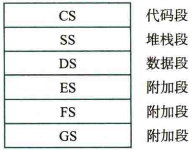

在 x86-64 中，CS/SS/DS/ES 被废弃使用，因为取消了内存的分段模型；FS/GS 只在部分情况下作为基址寄存器使用，比如[线程本地存储 (TLS)](https://learn.microsoft.com/zh-cn/cpp/parallel/thread-local-storage-tls?view=msvc-170)，用于为多线程进程中的每个线程分配特定于线程的数据存储位置

<br>

### 浮点寄存器栈 & 多媒体扩展寄存器组

IA-32 的浮点处理架构有两种：

1- 与 x86 配套的 x87 架构，是一种栈结构 FPU，**x87 进行运算的浮点数来源于浮点寄存器栈的栈顶**

FPU 是专用于浮点运算的处理器，在 80486 之后集成进了 CPU。x87 FPU 中有 8 个 80 位的数据寄存器，以及控制寄存器、状态寄存器、标记寄存器各一个（都是 16 位）

这 8 个数据寄存器被当作栈使用，记为 ST(0) ~ ST(7)，栈顶元素为 ST(0)

控制寄存器指定浮点处理单元的舍入方式和精度（最大有效数据位数，Intel FPU 默认为 64 位）

状态寄存器类似于 EFLAGS，记录比较结果、溢出、错误等，并且记录了浮点寄存器栈顶位置

标记寄存器标记 8 个数据寄存器的状态：是否为空、是否可用、是否为零、是否为 NaN / ±∞ 等

---

2- 由 MMX 发展而来的 SSE 架构，采用单指令多数据 (SIMD) 技术，操作数来源是 8 个 128 位寄存器 XMM0 ~ XMM7

MMX 是多媒体扩展的缩写，MMX 技术指的是在 CPU 中加入专门为视频/音频信号和图像处理而设计的新指令。MMX 指令使用 8 个 64 位寄存器 MM0 ~ MM7，实质是借用了 ST(0) ~ ST(7) 的 64 位尾数位。

每条 MMX 指令可以同时处理 8 个 Byte / 4 个 Word / 2 个 Dword / 一个 64 位数据

因为 MMX 借用了 x87 FPU 的浮点寄存器，因此 x87 的浮点运算速度降低

后来在 MMX 的基础上发展了兼容 MMX 指令的 SSE 指令集，其采用了 SIMD 技术（单条指令同时并行处理多个数据元素）。为了不借用 x87 FPU 的浮点寄存器，SSE 指令集增加了 8 个 128 位的 SSE 指令专用的多媒体扩展通用寄存器 XMM0 ~ XMM7，因此能处理的数据宽度加倍

---

在 x86-64 中，XMM 寄存器从 8 个增加到 16 个，并且浮点操作也采用 SIMD 指令集，浮点数存放在 XMM 寄存器，而不再是基于 x87 FPU 的浮点寄存器栈。之后又产生了高级向量扩展指令集 AVX，使用 16 个 256 位的 YMM 寄存器

---

最终给出一张表格，指出了每个寄存器的编号，用于之后的寻址操作

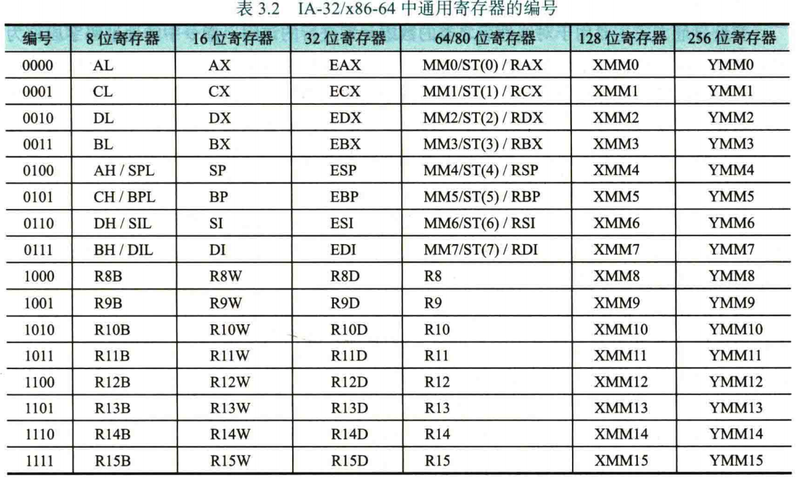


## 指令寻址

根据指令给定信息得到操作数或操作数地址的方式称为寻址方式。通常把指令中给出的操作数所在存储单元的地址称为有效地址。

### 寻址方式

先给出最基础的寻址方式：

- 立即寻址：直接给出立即数，即 Imm
- 直接寻址：通过一次取地址操作获得操作数，即 M[addr]
- 间接寻址：通过两次取地址操作获得操作数，即 M[M[addr]]
- 寄存器直接寻址：通过寄存器获得操作数，即 R[r]
- 寄存器间接寻址：通过一次取地址操作和一次取寄存器操作获得操作数，即 M[R[r]]
- 变址寻址：操作数地址 = 指令中的形式地址 + 变址寄存器内容 ，即 M[D+R[index]]，**常用于数组遍历**，可以形式化理解为：`D` 是数组的起始地址，`R[index]` 得到的是下标
- 相对寻址：操作数地址 = 程序计数器内容 + 指令中的形式地址，即 M[PC+D]，常用于**程序内的跳转**和局部数据访问。这里 `D` 是偏移量
- 基址寻址：操作数地址 = 基址寄存器内容 + 指令中的形式地址，即 M[R[base]+D]，常用于**程序的重定位**。这里 `D` 是偏移量

我们发现后三者的类型都差不多，但是具体分析也能得到差别：

变址寻址的 “基址” 是 D，偏移量（下标）由寄存器提供，通常是 R[ESI] 或 R[EDI]；

相对寻址的 “基址” 是 PC，即 R[EIP]，偏移量是 D；

基址寻址的 “基址” 由寄存器提供，通常是 R[EBX]，偏移量是 D；

**变址寻址和基址寻址是完全对称的，如何使用取决于基址和偏移量哪一个是在动态修改的，比如数组遍历就是变址寻址的典型应用，更加常用**

相对寻址可以看作基址寻址的特例，因为 PC 总是在改变，让指令有了位置无关的特性，经常用于 PIC，适合生成可重定位代码

事实上，寻址方式可以复合使用，比如一种常见的寻址为**带比例因子的基址变址寻址**，举例：

```gas
movl 20(%ebx, %esi, 4), %eax
// 位移量(基址寄存器, 变址寄存器, 比例因子)
// 比例因子只能是 1 2 4 8
```

其中源操作数的有效地址 = 基址寄存器 + 变址寄存器 × 比例因子 + 位移量

这种寻址方式适合遍历数组，其中比例因子通常是单个元素的 size

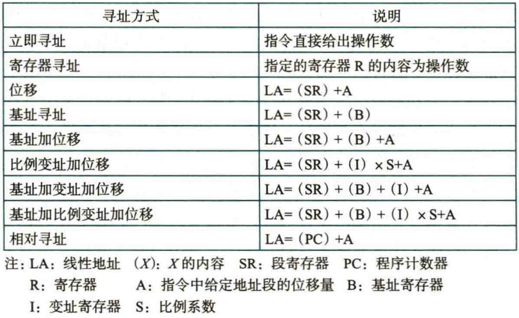

---

<br>

IA-32/x86-64 处理器存在两种工作模式：实地址模式和保护模式；现代 x86/x86-64 处理器在刚上电（或复位）时都会进入实地址模式，在进行初始化后通过设置控制寄存器 CR0 的 PE 位为 1 进入保护模式；进入保护模式后通常不能再反向切换（除非重启等）

### 实地址

之前提到过：实地址只使用寄存器的低 16 位

实地址最大寻址空间 1MB = $2^{20}$ Byte，因此 32 条地址线的 $A_{31} \sim A_{20}$ 不使用，只使用低 20 位，对应的物理地址范围为 0x00000 ~ 0xFFFFF

我们考虑实模式下的段式虚拟存储机制：

每个段的大小（最大地址空间）固定为 64 KB，物理地址 = 段地址 × 16 + 偏移地址，其中段地址存储在对应的段寄存器（比如 CS 是代码段寄存器，SS 是堆栈段寄存器），偏移地址由其他寄存器提供

!!! quote "对段地址 × 16 ，也就是 << 4，使得获得的地址可以扩展为 20 位，其他寄存器提供低 4 位"

> 举例：取指令操作，指令的物理地址为 CS * 16 + IP
> 
> 数据读写操作，操作数的物理地址为 DS * 16 + 指令本身给出的地址（也就是上文基础寻址方式得到的地址），即有效地址
> 
> 栈上 push/pop 操作，栈的物理地址 SS * 16  + SP

需要注意的是：上面的段寄存器

### 保护模式

为了实现在多任务模式下，将不同任务使用的虚拟存储空间进行完全隔离，80286 之后的系统会在实模式完成初始化后切换到保护模式。保护模式下处理器采用虚拟存储管理方式，这个之后再说

<br>

## 机器指令格式

IA-32 架构参考 [i386 指令结构 for PA2-1 - CSNote](https://csnotes.nopthon.icu/course-notes/ICS/ICSPA-x86/i386/)

x86-64 架构指令格式兼容 IA-32，仅仅在指令前缀和 opcode 之间加入了可选择的 8 位 REX 前缀：

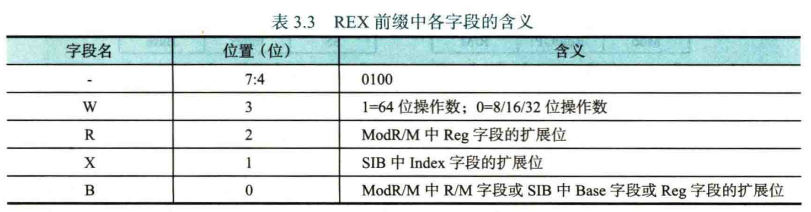

（前缀 0100 是为了避免与已有的指令前缀产生冲突）

W 字段指定了操作数是否是 64-bit 的，R/X/B 分别为一些拓展位，其中 B 具有多种可能性，下图可以体现什么是 “拓展位”：

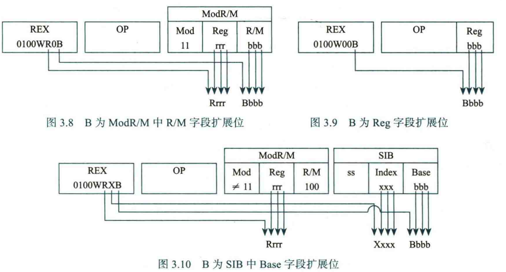

<br>

## 常用指令

对于涉及操作数大小的指令，通常用 `b` `w` `l` `q` 后缀分别表示 1/2/4/8 Byte 的操作数

### 传送指令

`mov` 指令用于一般传送，后跟后缀表示操作数大小

`movs` 和 `movz` 分别用于符号扩展和零扩展传送，需要两个后缀分别指定 src 和 dst 的操作数大小

`movl` 指令的目的地址为寄存器时，会清零高 32 位，等价为 `movzlq`

`movq` 指令最多只能指定 32 位的立即数，否则使用 `movabsq` 专门处理 64 位立即数加载到寄存器的操作（必须是 64 位立即数 → 寄存器）

出入栈指令 `push` `pop` 本质上是一次栈指针寄存器的减法/加法运算和一次 `mov` 操作

??? quote "图示"

    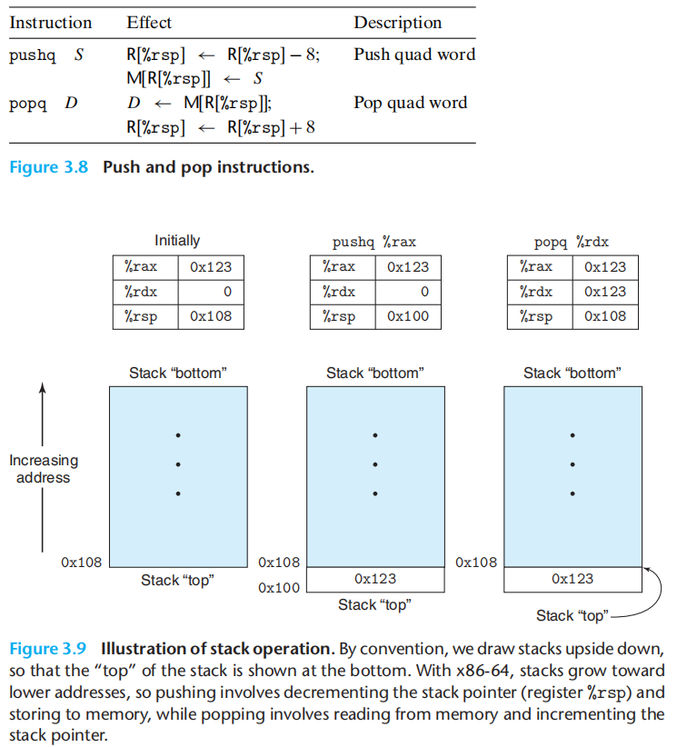

`lea` 指令相当于 `mov` 指令的操作数地址减少了取地址操作

### 运算指令

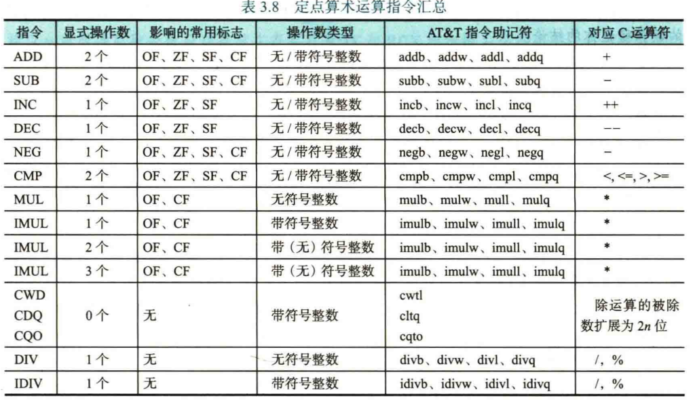

#### 乘法/除法

这里需要额外指出的是：

`(i)mul` 指令会隐式指定操作数，并将运算结果存入指定寄存器：

| 操作数大小          | 隐式寄存器（被乘数） | 结果寄存器 | 结果高位寄存器 |
| ------------------- | -------------------- | ---------- | -------------- |
| 8 位 (`mul r/m8`)   | AL                   | AX         | —              |
| 16 位 (`mul r/m16`) | AX                   | AX         | DX             |
| 32 位 (`mul r/m32`) | EAX                  | EAX        | EDX            |
| 64 位 (`mul r/m64`) | RAX                  | RAX        | RDX            |

两个 $n$ 位数相乘最多能得到 $2n$ 位数字，因此我们指定：运算结果的低位存入 `_AX`，高位存入 `_DX`

---

同理，除法运算 `(i)div` 也只有一个显式操作数（除数），并将运算结果存入指定寄存器：

| 操作数大小          | 被除数所在寄存器 | 商   | 余数 |
| ------------------- | ---------------- | ---- | ---- |
| 8 位 (`div r/m8`)   | AX（= AH:AL ）   | AL   | AH   |
| 16 位 (`div r/m16`) | DX:AX            | AX   | DX   |
| 32 位 (`div r/m32`) | EDX:EAX          | EAX  | EDX  |
| 64 位 (`div r/m64`) | RDX:RAX          | RAX  | RDX  |

### 按位运算指令

常见的不写了

`test` 指令对两个操作数进行**按位与**运算但是不保存运算结果，只修改对应的 EFLAGS，比如：通过 `#!gas testb %al, %al` 的自按位与运算判断 AL 的正负情况：

??? abstract "判断"

    ZF = 1 → AL = 0
    
    ZF = 0 && SF = 0 → AL > 0
    
    ZF = 0 && SF = 1 → AL < 0

移位指令：

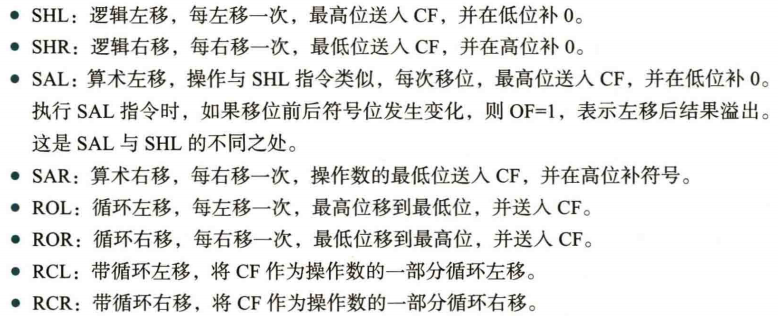

### 跳转指令

jmp 是无条件跳转

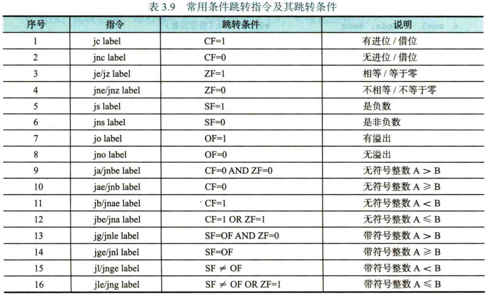

通常结合 `cmp b, a` 指令使用，注意 `cmp` 运算的是目的操作数 - 源操作数，所以我交换了 `a` 和 `b` 的位置，这样就符合上表的内容了

对于无符号整数，我们通过助记符第二个字母为 a / b 表示 a / b 是二者更大的

对于有符号整数，我们通过助记符第二个字母为 g / l 表示 a 比 b 更大（greater）或更小（less）

助记符第三个字母 e 表示是否加等号

### 条件指令

除了条件跳转指令，还有其他常用的条件指令

条件设置指令 `set__` 指定将一个通用寄存器的值设置为 1 / 0，其助记符后两个字母的设置与 `j` 系列指令一样

条件传送指令 `cmov__` 相当于为传输指令添加了条件操作，要求目的操作数必须是 16/32/64 位寄存器（因为 `cmov` 指令没有了大小后缀，因此只能由寄存器大小来辅助判断操作数大小）

### 其他指令

`call` 指令也是无条件跳转，其先将当前的 EIP / RIP 的内容（下一条指令的地址）入栈，然后将被调用的子函数的地址写入 EIP / RIP，相当于 C 语言调用子函数

`ret` 指令和 `call` 指令配套使用，会取出 `call` 指令入栈的原返回地址，使得子函数调用完成后能够回到主逻辑

`ret` 可以携带一个字节数 $n$，在弹出返回地址再进行一次 R[esp] ← R[esp] + n（或 RSP）操作，修改栈指针 ESP / RSP，目的是进行栈清理

（对于 x86-64 System V ABI，因为参数大多通过寄存器传递，因此 `ret` 即可）

陷阱指令 `int n` 用于触发中断事件，执行操作系统的内核级服务，比如 `int $0x80` 是系统调用的标准入口，配套的 `iret` 可以从内核态切换回用户态

x87 浮点指令比较复杂，这里仅额外指出一件事：**将浮点数从 80 位的浮点数寄存器中的内容传送到 64 位的存储区时会产生一定的精度损失**

SIMD 指令略，真没见过拿来出题目，学个蛋
