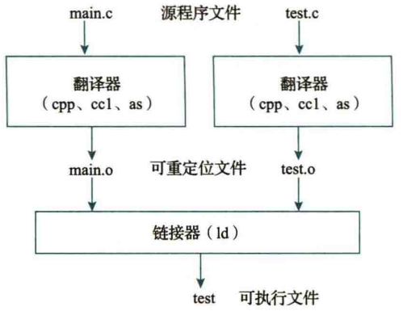
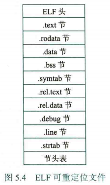
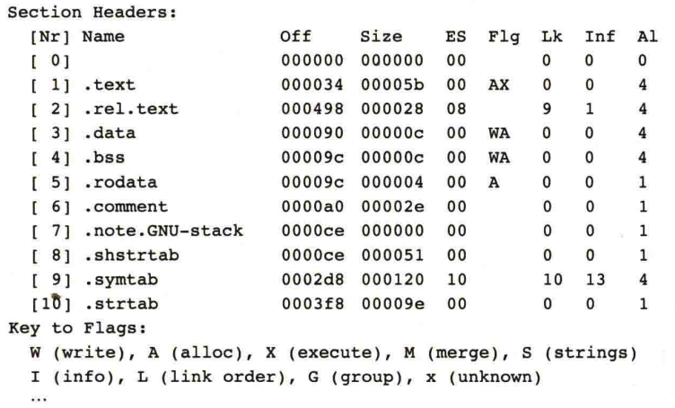
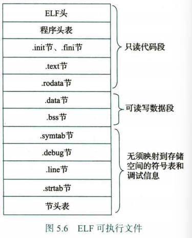
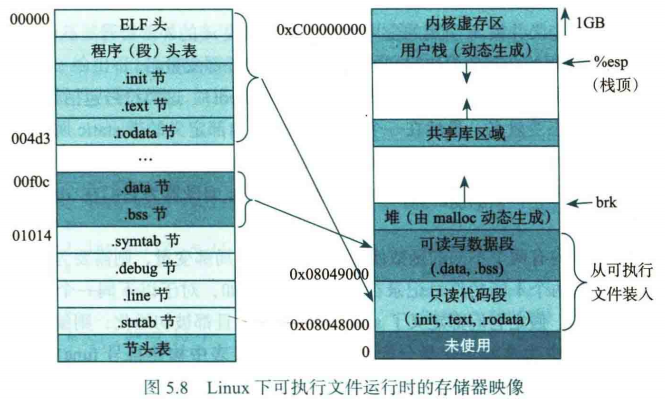
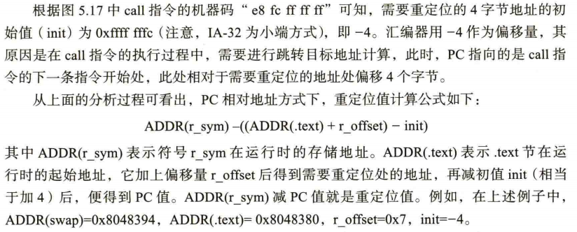
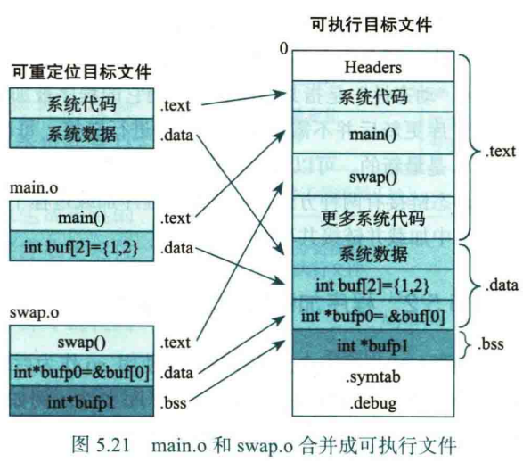

# Ch.5 程序的链接与加载执行

可执行文件生成的最后一步是由链接器对若干个可重定位文件进行链接：



链接器需要完成两件事：

1- 符号解析：编译时编译器将全局变量名、静态变量名、函数名存放到符号表中（非静态局部变量不是符号），而符号解析操作将每个符号的引用与一个确定的符号定义建立关联

比如 `main.c` 引用了 `test.c` 的函数 `add`，就需要将 `main.o` 和 `test.o` 中的 `add` 符号建立关联

2- 重定位：可重定位文件的代码区和数据区从地址 0 开始，在合并若干重定位文件后，得到的可执行文件满足 ABI 规范下的虚拟地址空间划分（比如只读代码段从 `0x8048000` 开始，可读写代码段从只读代码段后的第一个 4 KB 对齐的地址处开始），因此需要重新确定代码和数据的地址，更新指令中被引用符号地址，这就是重定位

<br>

## 前置知识

### ELF 文件结构

可重定位文件和可执行文件都属于 ELF 文件

#### 可重定位文件



其中 ELF 头记录一些文件本身相关的信息

中间的节 section 是主体信息

| 节名        | 含义                                                         |
| :---------- | :----------------------------------------------------------- |
| `.text`     | 代码段（程序指令）                                           |
| `.rodata`   | 只读数据（常量字符串、const 变量等）                         |
| `.data`     | 已初始化的全局/静态变量                                      |
| `.bss`      | 未初始化的全局/静态变量（不占文件空间）                      |
| `.symtab`   | 符号表（记录函数、变量等符号信息）                           |
| `.rel.text` | `.text` 段的重定位表                                         |
| `.rel.data` | `.data` 段的重定位表                                         |
| `.debug`    | 调试信息（如果使用 `-g` 编译）                               |
| `.line`     | 用于存储源代码行号与机器指令地址之间的对应关系（如果使用 `-g` 编译） |
| `.strtab`   | 字符串表（符号名、段名等字符串）                             |

最后的节头表由若干表项组成，每个表项描述上面的某一个节的名称，偏移、对齐等信息



节头表是 0-index 的，但是因为节头表的第一项往往是全零的保留值，因此真正有意义的节头表内容从 index 1 开始

<br>

#### 可执行文件



多了程序头表，其描述 ELF 文件中各“可加载段”的结构，告诉内核如何把文件加载进内存、如何设置权限、如何执行

节信息和可重定位文件差不多，但是多了 `.init` 节和 `.fini` 节，分别包含了可执行文件进入主函数前需要执行的初始化代码、和进程终止时需要执行的指令代码（程序退出时执行）；不需要 `.rel` 节了

图中的只读代码段和可读写数据段都需要装入内存并分配存储空间，因此称之为可装入段

<br>

### 存储器映像

磁盘文件的各个可装入段信息向虚拟地址的映射如图所示

对于 IA-32 程序，程序映像从 `0x8048000` 开始装填，内核地址从 `0xC0000000` 开始；对于 x86-64 程序，程序映像从 `0x400000` 开始装填，对于 PIE（位置无关可执行文件），代码起始地址会在 `0` 附近



（这张图会在第七章具体描述）

**程序在加载过程中，仅仅创建了可装入段对应的页表项，只有在第一次遇到缺页异常时，才会真正加载代码和数据到主存**，这点之后会说

<br>

### 符号表

之前提到目标文件都有一个符号表，符号表在编译阶段生成，在链接阶段解析

符号表中的符号有三种类型：

- 全局符号：在当前模块中被定义，被其他模块引用
- 外部符号：由其他模块定义，当前模块进行了引用
- 本地符号：在当前模块中被定义，并且只能在当前模块引用（符号定义时会使用 `static` 属性；本地符号分配在静态数据区，即 `.data` 或 `.bss`）

- （栈上的非静态局部变量（`auto` 变量）不在符号表中）

---

符号表中的 `st_info` 字段指出符号的类型和绑定属性

符号类型可以是未指定（NOTYPE）、变量（OBJECT）、函数（FUNC）、节（SECTION）

绑定属性可以是本地（LOCAL）、全局（GLOBAL）、弱（WEAK）

符号表中的 `st_shndx` 字段指出符号所在节在节头表中的索引，我们定义三种伪节（在节头表中没有特定的索引值，因此是一种特殊表示）：绝对值节（ABS）、未定义节（UNDEF）、COMMON 节

ABS 通常表示“该符号不会被重定位，符号值是绝对的”；UNDEF 表示“未定义符号”（外部符号）；COMMON 表示未初始化的全局变量，此时 `st_value` `st_size` 字段分别表示对齐要求和最小长度，链接阶段 COMMON → `.bss`

通常引用外部函数的声明 `extern int foo();` 对应的是 NOTYPE GLOBAL UNDEF

<br>

##  符号解析

编译器在对源程序进行编译时，会把每个全局符号的定义输出到汇编代码文件中，汇编器通过对汇编代码文件的处理，在可重定位文件的符号表中记录全局符号的特性，以供链接时全局符号的符号解析所用。

我们记函数定义和已初始化全局变量为强符号，未初始化全局变量为 COMMON 符号，绑定属性为 `WEAK` 的符号为弱符号（需要专门的 `__attribute__((weak))` 定义）

（函数声明不会产生符号，如果在未定义的情况下引用函数，会得到 UNDEF）

规定：

- 强符号是唯一定义的，其他符号可以多次定义
- 优先级：强符号定义 > COMMON 符号定义 > 弱符号定义
- 多次的同名 COMMON 符号定义取空间最大的定义，为了满足 `st_size` 对所有同名 COMMON 符号的空间要求
- 编译选项 `-fno-common` 会将 COMMON 看作强符号，确保对同一符号名的定义只出现一次
    - 注意：COMMON 符号是 “过时” 的，近年来的编译器都默认 `-fno-common`，因此 **ICS 教材里面的和链接相关的示例代码（作业代码）大多数都链接不成功，需要手动开启 `-fcommon`！**


---

一个模块中的符号可以分为定义符号和引用符号：

```c++
int x;				// 定义符号（OBJECT GLOBAL COMMON）
int y = 1;			// 定义符号（强符号）
extern int z;		// 引用符号（NOTYPE GLOBAL UNDEF）

void foo(){}		// 定义符号
void bar();			// 如果没有被定义过也没有被调用过，那么就不产生符号
					// 如果没有被定义过但是被调用过，那么产生 NOTYPE GLOBAL UNDEF，相当于 extern
					// 如果被定义过，那么也不产生符号，定义阶段产生过了
extern void fun();	// 引用符号（NOTYPE GLOBAL UNDEF）
```

针对符号解析的具体过程，我们考虑三个集合：

集合 **E**xecutable 包含确定要链接的文件

集合 **U**ndefined 是未解析符号集合（引用了但是还没有找到定义）

集合 **D**efined 是 E 中已定义符号集合

然后用下面的伪代码展示符号解析的逻辑

```hl_lines="2  12"
遍历命令行中的每个输入文件 f:
    if f 是可重定位文件 (.o):
        1. 将 f 加入 E
        2. 处理 f 中的符号：
           - 对于 f 中定义的每个符号 s:
               if s 已经在 D 中: 报错（重复定义）
               else: 将 s 加入 D
           - 对于 f 中引用的每个符号 s（未定义符号）:
               if s 在 D 中: 已解析，什么也不做
               else: 将 s 加入 U
    
    else if f 是静态库文件 (.a):
        1. 遍历库中的每个目标模块 m:
           - 检查 m 中定义的符号是否能解决 U 中的未解析符号
           - 如果 m 定义了某个 U 中的符号 s:
               * 将 m 加入 E
               * 将 s 从 U 移到 D
               * 同时处理 m 的其他符号（像处理 .o 文件一样）
        2. 重复直到 U 和 D 不再变化（因为可能会出现递归依赖，所以需要反复扫描）
        3. 库中未被选中的模块被丢弃

结束处理:
    if U 不为空: 报错（未定义符号）
    else: 成功，使用 E 中的文件生成可执行文件
```

也因此，在进行链接操作时，我们需要合理安排不同 .o/.a 文件的顺序，通常 .a 文件应放在 .o 文件的后面

甚至在涉及循环依赖的情况下，同一个文件会被链接两次：

```bash
gcc -static -o myfunc func.o libx.a liby.a libx.a	# 两个静态库文件循环依赖
```

<br>

### 类型匹配

这里需要注意一件事情：链接器进行符号链接时，只关注符号名是否匹配，**并不检查定义和引用的符号类型是否匹配**。符号类型由强符号进行定义，因此有时会产生意想不到的结果，这边举个作业题为例：

```c
/* m1.c */
int p1(void);
int main(){
    int x = p1();
    return x;
}

/* m2.c */
int x = 10;
int main;			// main 不是保留字，但是除非拿来出题目真的不能这样写
int p1(){
    main = 1;
    return x;
}
```

我们发现 `m2.c` 中有一个神秘 COMMON 符号 `main`，并且它真的和 `m1.c` 中的 `main` 定义进行了绑定。根据强符号优先，`main` 确实是函数，但是 `p1` 函数中我们令 `main = 1`，这直接修改了 `main` 函数的一部分机器码（如果没有任何保护的话） 

<br>

## 重定位

在符号解析完成后，我们需要将所有相关的目标模块（即集合 E 中的目标文件）合并，并确定每个符号在虚拟地址空间中的最终位置，使所有引用该符号的指令或数据都能正确指向它。这就是重定位需要完成的事情，具体分为两个方面：

- 节和定义符号的重定位

```
输入：多个目标文件的节（.text, .data, .rodata, .bss 等）
      ↓
合并：相同类型的节合并成一个
      ↓
布局：确定每个合并后节的虚拟地址
      ↓
确定符号地址：根据符号在节内的偏移 + 节的基址 = 符号的绝对地址
```

- 引用符号的重定位

```
输入：代码/数据中所有对其他符号的引用
      ↓
查找：每个引用指向哪个符号
      ↓
计算：引用处应该填写的正确地址
      ↓
修正：修改指令/数据中的占位符为实际地址
```

（AI 太好用了）

为了实现后者的操作，链接器需要知道目标文件中哪些引用符号需要进行重定位，需要引用哪个定义符号，这些信息为重定位信息，存放在重定位节 .`rel.text` `rel.data`（也可能有 `.rel.rodata`）

每个重定位条目都描述一个需要重定位的地方：

```c++
typedef struct {
    Elf32_Addr r_offset;	// 需要重定位的位置相对于所在节的偏移量
    Elf32_Word r_info;		// 符号表索引 + 重定位类型
    						// 索引是高 24 位，类型是低 8 位
} Elf32_Rel;
```

重定位类型由 ABI 定义，对于 IA-32 最基本的两种是：

- R_386_PC32：PC 相对寻址，跳转目标地址 = PC + 偏移地址（下一条指令的地址 + call 指令中的重定位值）
    - call 指令就采用这种重定位方式

- R_386_32：绝对地址，有效地址为重定位后的 32 位地址


### PC 相对寻址

对于 PC 相对寻址，举个例子：

```gas
Disassembly of section .text:
00000000 <main>:
   0:   55                      push   %ebp
   1:   89 e5                   mov    %esp,%ebp
   3:   83 e4 f0                and    $0xfffffff0,%esp
   6:   e8 fc ff ff ff          call   7 <main+0x7>
                 7:  R_386_PC32 swap
   b:   b8 00 00 00 00          mov    $0x0,%eax
  10:   c9                      leave
  11:   c3                      ret
```

上面的文件为可重定位文件 `main.o`：

0x6 处是一条 call 指令，`e8` 是 call 指令的 opcode，后面的 `fc ff ff ff` 对应小端序 `0xfffffffc`，也就是 `-4`。右侧的汇编内容 `7 <main+0x7>` 说明这个地方需要重定位（相对地址）

???+ question "为什么这里的相对偏移要用 -4 占位？"

    在 call 指令的执行过程中，需要进行跳转目标地址计算，此时 PC 已经指向后一条指令，相对于需要重定位的地址处（`e8` 后一个字节）一定是 4 Bytes 的偏移（地址长度）
    
    以及在完成 Linklab 的时候应该已经注意到这一点了吧

0x7 处是通过 `objdump -r` 得到的重定位信息，表示这个地方有一个 PC 相对寻址的重定位项，需要修正为符号 `swap` 的地址。因为是 R_386_PC32，所以这里应该填写偏移地址 = 目标地址 - PC 

---

在链接生成可执行文件之后，我们假设 `main` 函数后紧跟着 `swap` 函数，`main` 的运行时地址为 `0x8048380`，`swap` 的运行时地址为 `0x8048394`，容易得到

> 偏移量 = swap 函数的起始地址 - PC（call 的后一条地址） = `0x8048394` - `0x804838b` = `0x9`

因此 call 的机器码应该重写为：`e8 09 00 00 00` 

```gas hl_lines="6"
Disassembly of section .text:
08048380 <main>:
 8048380: 55                      push   %ebp
 8048381: 89 e5                   mov    %esp,%ebp
 8048383: 83 e4 f0                and    $0xfffffff0,%esp
 8048386: e8 09 00 00 00          call   8048394 <swap>
 804838b: b8 00 00 00 00          mov    $0x0,%eax
 8048390: c9                      leave
 8048391: c3                      ret

08048394 <swap>: 
```

??? quote "下面这张图里的内容或许能解释为什么相对偏移用 -4，但是这 byd 式子我看着头大"

    说实话记住**偏移地址 = 目标地址 - PC** 就够了
    
    

<br>

### 绝对寻址

还是举一个例子：

```gas
Disassembly of section .text:
00000000 <main>:
   0:   55                      push   %ebp
   1:   89 e5                   mov    %esp,%ebp
   3:   a1 00 00 00 00          mov    0x0,%eax
                 4: R_386_32    global_val
   8:   5d                      pop    %ebp
   9:   c3                      ret
```

上面的文件为可重定位文件 `main.o`：

0x3 处为一条 mov 指令，源操作数地址等待重定位修正（一个 32 位数的绝对地址）

与 call 不同的是，这里的地址占位符为 0，因为不需要修正 PC 的相对偏移了

0x4 处是通过 `objdump -r` 得到的重定位信息，表示这个地方有一个使用绝对地址的重定位项，需要修正为符号 `global_val` 的地址。因为是 R_386_32，所以这里应该填写偏移地址 = 目标地址 

---

在链接生成可执行文件之后，我们假设 `main` 的运行时地址为 `0x8048380`，`global_val` 的运行时地址为 `0x804a020`，那么 `mov` 指令直接重写为 `a1 20 a0 04 08` 即可

```gas hl_lines="5"
Disassembly of section .text:
08048380 <main>:
 8048380: 55                      push   %ebp
 8048381: 89 e5                   mov    %esp,%ebp
 8048383: a1 20 a0 04 08          mov    0x804a020,%eax
 8048388: 5d                      pop    %ebp
 8048389: c3                      ret
```

<br>

最后附一张重定位图片



<br>

## 动态链接

与静态链接相比，动态链接在运行时才会将程序和所需的共享库进行链接。

这样得到的可执行程序依赖外部的共享库 `.so`（Windows 中为 `.dll`），但是共享库可以由多个程序使用，因此节省了内存空间，并且可执行程序本体可以变得更小。同时动态库更新不影响原程序

<br>

## 位置无关代码 PIC

在生成共享库代码时，要保证将来不管共享库代码加载到哪个位置都能够正确执行，即共享库代码的加载位置可以是不确定的，而且共享库代码的长度发生变化也不影响调用它的程序。满足上述特征的代码称为位置无关代码(PIC)。在生成共享库文件时，须使用 GCC 选项 `-fPIC` 来生成位置无关代码。

后面看的头昏，打个断点插个桩，GOT 表什么的之后补

##### Breakpoint


<br>

## 可执行文件的加载

在 Linux 系统中，执行命令时，会调用 **`execve()`** 系统调用，用于加载并执行一个可执行文件（比如 `./test`）。

- **加载可执行文件**：命令行通过 `execve` 加载一个 ELF 格式的可执行文件，该文件包含了程序的代码（`.text`）、数据（`.data`）、未初始化数据（`.bss`）等。

- **入口点**：当程序加载到内存后，操作系统会通过 **`entry point`** 来找到程序的执行入口地址。通常，程序会有一个 **`_start`** 函数，程序的执行从这个位置开始。

期间会进行动态链接（如果需要）

加载程序时，内核首先会加载可执行文件的头部（headers），然后是 `.text`、`.data` 和 `.bss`。之后程序会通过 `_start` 函数来进行初始化，最后跳转到 `main()` 函数


（执行操作略）
