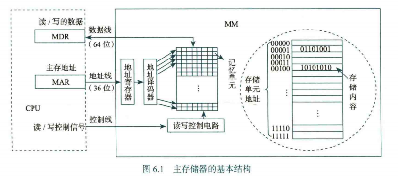
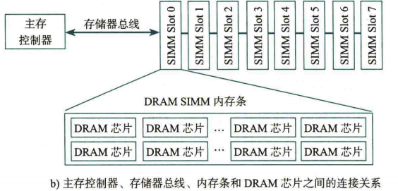
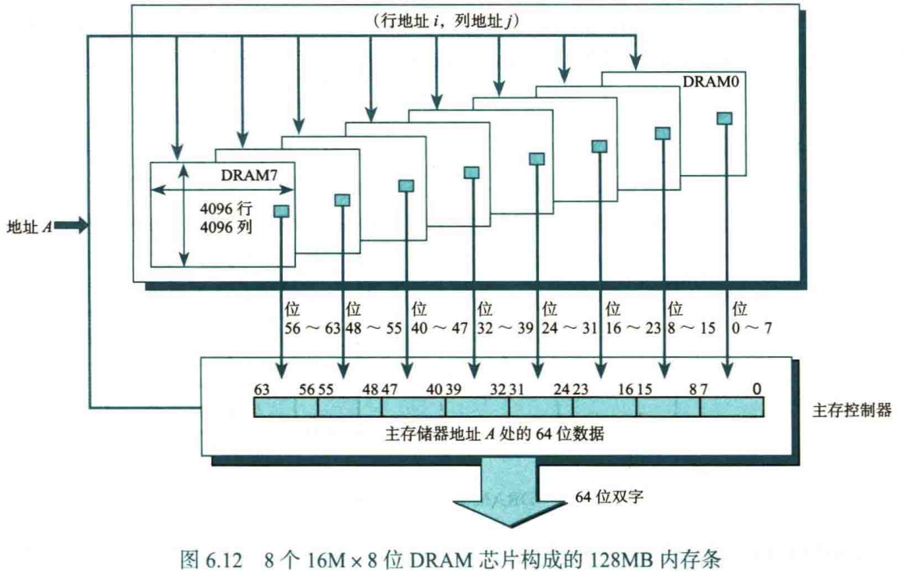
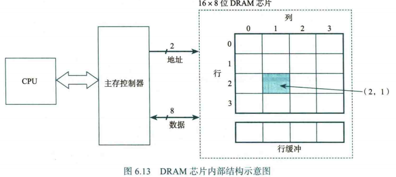
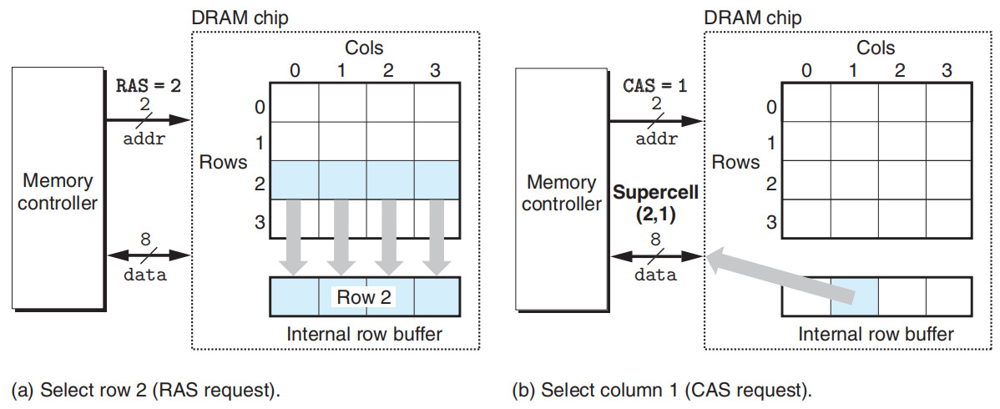
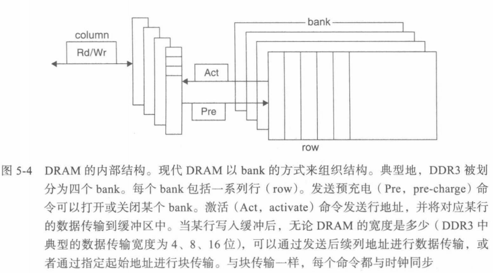
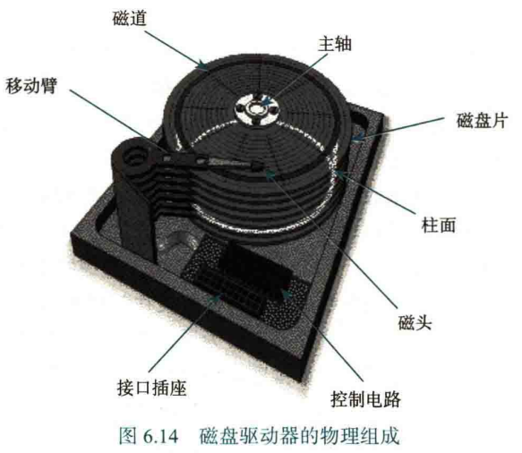

# Ch6. 存储器层次结构

## 存储器分类

根据信息的可更改性，我们将存储器分为读写存储器和只读存储器

根据断电后数据是否丢失，我们将存储器分为易失性和非易失性

我们常见的存储器有 RAM（随机存取存储器）和 ROM（只读存储器）

RAM 和 ROM 都**通过对地址译码来访问存储单元**，因为每个地址译码时间相同，所以在不考虑芯片内部缓冲的前提下，访问任意单元的时间均相同

RAM 和 ROM 的区别：

| RAM      | ROM      |
| -------- | -------- |
| 可读可写 | 只读不写 |
| 易失性   | 非易失性 |

RAM 分为两种：静态 RAM（SRAM）和动态 RAM（DRAM）：

| 静态 RAM（SRAM）                 | 动态 RAM（DRAM）                                   |
| -------------------------------- | -------------------------------------------------- |
| 只需要通电，就可以保持触发器状态 | 通电后需要定期刷新内容，否则电荷流失会导致数据丢失 |
| 速度块                           | 速度慢                                             |
| 功耗高                           | 功耗低                                             |
| 单位容量成本高                   | 单位容量成成本低                                   |

因此 SRAM 经常用于 CPU Cache，DRAM 经常用于主存（内存条）

 

## 主存结构

大致介绍主存储器 Main Memory 的构成

总线是连接各个部件的共享传输介质，系统总线由控制线、数据线、地址线构成

控制线用于传递 “读” “写” 等指令信息

数据线是 CPU 与主存之间传输数据的并行线路，

数据线有 64 位，说明字节编址下，每次**最多可以存取 8 个主存单元**，也就是 8 个连续地址的存储值

地址线是 CPU 向主存发送地址信息的并行线路，

地址线有 36 位，最大寻址范围为 $0 \sim 2^{36}-1$，最大寻址空间 $2^{36}$ Bytes = 64 GB

 

## CPU 访存的流程

1- 如果 CPU 发出的访存地址是虚拟地址，需要通过内存管理单元 MMU 中的 TLB 和页表进行查询，得到物理地址（主存中的硬件级地址）

2- 用物理地址查询 Cache，如果 Cache Hit，那么访问 Cache 即可，否则

3- 通过系统总线向 DRAM 控制器发送访问请求（其中控制线发送具体的操作请求）

4- DRAM 控制器收到访存请求事务后，将访存请求转换为与 DRAM 芯片通信的存储器总线请求（包含 DRAM 芯片命令和 DRAM 芯片内部地址，可能包括写入数据）

5- 地址译码器将 DRAM 芯片内部地址进行具体的译码，选中对应的行、列，进行读/写操作。

6- DRAM 控制器向 Cache 返回系统总线请求事务的回复，以及读操作的数据

7- Cache 进行可能的更新，对于读操作向 CPU 返回读出的数据

 

## 内存条

主存芯片通过存储器总线与主存控制器连接，对应实际操作中将内存条插入内存条插槽。内存条的本质是若干 DRAM 芯片的集合，而整个主存由多个内存条组成

为了满足存储器的位数和容量要求，我们需要对 DRAM 芯片进行 “串联” 和 “并联”：

- 位扩展（“并联”）：用字长短的 DRAM 芯片构成大字长存储器时，需要进行位扩展
    - 位扩展时，我们将所有芯片的地址线并联在一起。并联的芯片指向同一个地址位置，只是指向了地址的不同位。比如 1bit 扩展到 8 bits，每个芯片的 1 位数据线分别作为最终 8 位数据总线的其中一位

??? quote "位扩展图例"

    

- 字扩展（“串联”）：对芯片容量的扩充

    - 字扩展后，地址空间变大了，因此我们需要额外的地址线来指定需要选择哪一片芯片工作（不考虑同时进行位扩展），我们称这一信号为片选信号

    - 举个例子：用 16K × 8 位 芯片扩充为 64K × 8 位，需要 16 根地址线（$2^{16} = 64  K$）。其中低 14 位用于对单个芯片的内部进行访问，而高 2 位产生 4 种片选信号，指定选择哪一个芯片

- 位扩展和字扩展可以同时进行

根据上面的内存条结构能够看出

 

## DRAM 芯片结构

对于一个 $2^n \times b$ 位的 DRAM 芯片，其包含 $2^n$ 个存储单元，每个单元包含 $b$ 位的信息

将 $2^n$ 个单元 分成 $r$ 行 $c$ 列的矩阵，保证 $r \leq c$ 且 $r$ 与 $c$ 接近（减少地址线的使用，提高性价比）

容易得到行地址的位数为 $x = \lceil \log_2 r \rceil$，列地址的位数为 $y = \lceil \log_2 c \rceil$。DRAM 的芯片地址引脚采用复用的方式，这意味着行地址和列地址是分别从地址线传送的（因此地址线的宽度为 $\max\lbrace x,y\rbrace$）：

每一块 DRAM 芯片有一个行缓冲（大小为一行），用来缓存当前选中行的每一列数据。在利用行列地址获取数据时，首先需要根据片选信号确认选中这块芯片，然后在行选通信号 RAS 有效时，地址线传送行地址，这一行的数据都被送到行缓冲；接下来在列选通信号 CAS 有效时，将行缓冲中对应列的内容处理

??? tip "以上的 DRAM 是不包含 bank 结构的构造，ICS 也不考虑"

    现代 DRAM 会在行列基础上添加 bank，以提高并行性、隐藏延迟、提高吞吐率、降低单次操作功耗
    
    
    
    <del>还得是计组教材讲的东西新</del>

 

## 磁盘

??? quote "物理组成示意图"

    

一个磁盘由很多堆叠的盘片组成，盘片的两面都可以存储信息，记为盘面。为了定位内容，我们对每个盘面进行标号

盘面上的信息由磁头刻写，体现为紧密排列的同心圆。我们记这些同心圆为磁道，而不同盘面同一半径的磁道组成的圆柱面为柱面。为了定位内容，我们对每个柱面进行标号

规定磁道上划分的等长弧段为扇区，扇区是读写的最小单位。同理，我们对于磁道上的扇区也进行编号

定位磁盘上的数据，通过柱面号，盘面号，扇区号三维信息进行唯一确定，这三个信息即磁盘地址，我们记为 $(C, H, S)$

### 磁盘驱动器的操作

首先我们给出从 CPU 到磁盘驱动器的数据通路

> CPU <---> 磁盘控制器 <---> 磁盘驱动器

首先，CPU 不存储三维的磁盘地址（因为磁盘地址对于不同的磁盘有不同构造，导致程序移植性差），而是将三维地址映射到一系列连续的逻辑块（就像三维数组实际以一维数组存储一样），我们称这个一维的逻辑块地址为逻辑块号

CPU 发送逻辑块号，通过磁盘控制器的转换，得到 $(C, H, S)$ 的磁盘地址，传送给磁盘驱动器。

接下来的磁盘驱动器的操作分为三步：

- 寻道：根据 $(C, H)$ 的信息，将磁头移动到指定的磁道上，选择相应的读写磁头
- 旋转等待：扇区计数器初始化为 0，每经过一个扇区自增，直到计数器的值达到 $S$，此时磁头抵达了 $(C, H, S)$
- 读写：启动读写控制电路

### 磁盘性能

有一些性能指标用于描述一个磁盘存储器：

> 记录密度

密度分为两个方面：

- 道密度：盘面的单位半径内能够容纳的磁道数（同心圆密度）
- 位密度：磁道圆周单位长度能够记录的二进制位数（具体影响比较复杂）

然后定义面密度 = 道密度 × 位密度，用面密度来直观衡量磁盘存储器的记录密度

> 存储容量

磁盘实际数据容量  = 盘面数 × 柱面数 × 每个磁道的扇区数 × 每个扇区的字节数

早期扇区大小通常为 512B，现代扇区大小通常为 4096B

对于使用了逻辑块寻址的磁盘，容量 = 逻辑块个数 × 每个扇区的字节数

> 数据传输速率

磁盘驱动器在到达“读写”步骤时，单位时间读写存储介质的二进制信息量，又称为内部 / 持续传输速率

相对的，CPU 的外设控制接口读写外存储器缓存的速度是外部 / 接口传输速率