# Ch.7 虚拟存储器

!!! note "也有很多图"

课本的引入语：

> 由于技术和成本等因素，早期计算机的主存容量受限，而程序设计时人们不希望受特定计算机物理内存大小的制约，因此，如何解决这两者之间的矛盾是一个重要问题；此外，现代操作系统都支持多任务，如何让多个程序有效而安全地共享主存是另一个重要问题。
>
> 为了解决上述两个问题，计算机中采用了虚拟存储技术，其基本思想是，程序员在一个不受物理内存空间限制且比物理内存空间大得多的虚拟的逻辑地址空间中编写程序，就好像每个程序都独立拥有一个巨大的存储空间一样。程序执行过程中，把当前执行到的一部分程序和相应的数据调入主存，其他未用到的部分暂时存放在硬盘上。

## 虚拟存储器总述

之前已经提到，在引入了虚拟存储机制之后，CPU 获得的指令地址是虚拟地址，通过存储管理单元 MMU 转换为主存 / cache 的物理地址。（对于 ICS 这门课，逻辑地址 == 虚拟地址）

此处我们引出虚拟存储器的概念：

虚拟存储器是一种由操作系统和 MMU 协同实现的存储管理机制，通过软件和硬件的结合形式，为每一个进程提供独立连续的私有地址空间（虚拟地址是连续的地址范围，但是映射到物理内存可能是非连续的）。

虚拟地址容量甚至可以超过物理地址容量，因为多个虚拟地址空间的映射可以共享为同一块物理内存。这解决了编程空间受限的问题

虚拟存储器在将虚拟地址转换为物理地址时，还会进行地址越界、访问越权等检查。这解决了多个程序共享主存带来的安全等问题

（简化的实现示意图如下所示）

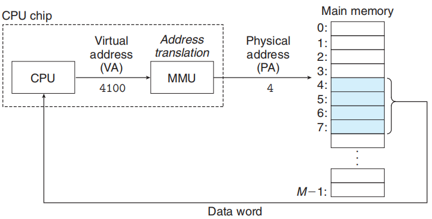

### 虚拟地址空间

虚拟地址空间是 “统一的”，对于不同的可执行文件，所映射的虚拟地址空间大小和区域划分结构相同

以 Linux 单个进程的虚拟地址空间为例，虚拟地址空间包含内核空间和用户空间两个部分：

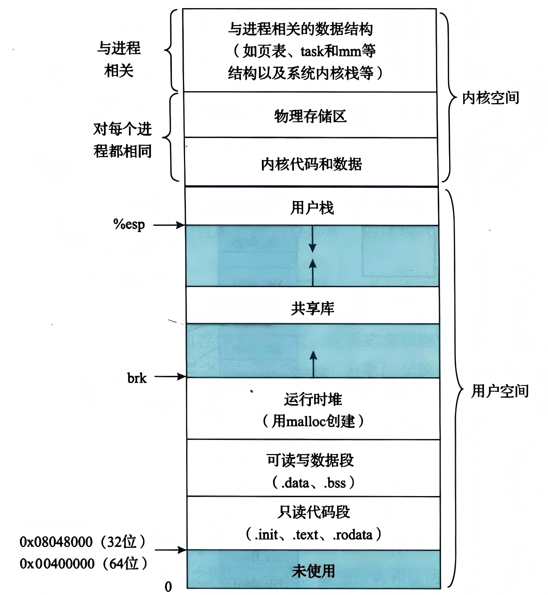

对于 IA-32，只读代码段从 `0x08048000` 开始，可读写代码段按照 4 KB 对齐跟在只读代码段后。内核空间从 `0xc0000000` 开始。

IA-32 的用户空间大小只有 3 GB，内核空间大小只有 1 GB

对于 x86-64，只读代码段从 `0x00400000` 开始，内核空间从 `0x8000 0000 0000` 开始；共享库从 `0x7fff f000 0000` 开始

x86-64 的用户空间大小和内核空间大小都是 128 TB，这明显大于当前的绝大部分主存。一方面，这是为未来的硬件升级提供足够大的预留空间；另一方面，`malloc` 这种指令可以放心大胆进行内存分配（而不需要进行碎片管理）。

!!! quote "至于这个远大于主存大小的虚拟地址空间是如何运作的，参考之后的页存储机制"

---

对于单个进程，我们需要在加载程序时知道上图中进程虚拟空间是如何具体划分的，因此我们需要为每个进程维护进程描述符：

进程描述符非常庞大，我们只关注划分部分，注意图中的 `vm_area_struct` 也是存在省略的：

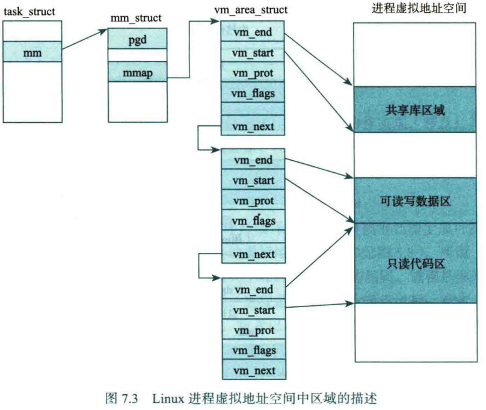

<br>

## 虚拟存储器 & 地址转换机制

类比 cache 是主存的缓存，我们也可以认为主存是外存的缓存

实现虚拟存储器也需要考虑交换块、映射、替换、写策略等问题。这里我们从历史发展的顺序进行三种实现的描述

<u>**具体到地址转换机制的时候，我们会以 IA-32 保护模式为实际举例**</u>

### 段式虚拟存储器

80286 是纯段式虚拟存储器架构的代表，即使 80286 已经首创了保护模式，其依旧使用纯段式虚拟存储器

根据程序的逻辑结构，我们把程序划分为若干个相对独立的段（segment），每个段对应一个逻辑模块（比如代码段、数据段、堆栈段）。

之前提到过实模式和保护模式，这两种模式下的段机制并不一样：

<1> 对于实模式，我们用段寄存器存储每个段的起始地址（的高 16 位），计算**物理地址 = 段基址 × 16 + 偏移量**。乘以 16（左移 4 位）是为了把 16 位段寄存器的值扩展成 20 位地址空间的一部分，从而用 16 位寄存器实现对 1MB 内存的寻址。

（以防忘记，实模式的寄存器只使用低 16 位）

<2> 对于保护模式，我们首先引入一个新的概念：段描述符表。它是操作系统维护的一张表，用于存放各个“段描述符”

??? question "如何找到段表？"

    各个段表的首地址存储在特殊寄存器中：`GDTR` `LDTR` （之后会提到`IDTR`），储存了下列的信息：
    
    ```c title="32-bit"
    typedef struct {
     uint16_t limit;  // _DT limit（最大字节数，2^16 B = 64 KB）
     uint32_t base;   // _DT base address, which is linear addr
    } _DTR;
    ```
    
    指令集中，`lgdt` 指令负责从内存加载 GDTR 的内容
    
    另外描述符也有 cache，毕竟段表在主存中，加载到 cache 后访问速度更快

段描述符记录了某个内存段的基址，段的大小，以及其他属性

??? quote "单个段描述符的具体内容（以 IA-32 为例）"

    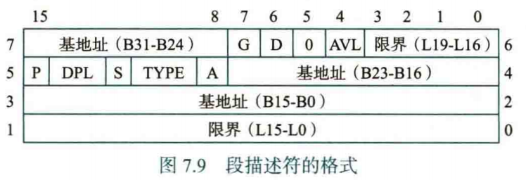
    
    虽然看上去很神秘，但是 Base（段基址）真的是被拆成三段存储的。主要目的还是为了历史兼容，比如 80286 的段选择子没有 BASE 31..24 这一部分，IA-32 才有，因此为了向下兼容性就拆分着放了


段表分三种：由操作系统内核定义的全局描述符表 GDT；由某个进程专用的局部描述符表 LDT；以及中断描述符表 IDT（这个目前不讨论）

与此同时，我们不再用段寄存器直接存储段基址，而是存储一个叫做段选择子的数据：

??? quote "段选择子的具体内容"

    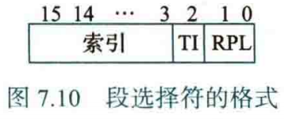

高 13 位 Index 用于指定段描述符的索引（因此段描述符最大可以设置约 8192 个），TI 位用于区分选择 0→GDT 还是 1→LDT，RPL 位指出了访存请求的特权级别

<br>

#### 虚拟地址 → 线性地址

有了段式虚拟存储器的知识点，我们可以开始 IA-32 保护模式下，地址转换的第一步了：

!!! tip "在开始下面的内容前，我们先不要想 `0x08048000` 这样的虚拟地址表示，不然看上去会和下面的内容相违背"

首先，程序给出 **48 位的虚拟地址**（即逻辑地址）：高 16 位为段选择子，低 32 位为段内偏移量

我们先看段选择子，从 TI 位判断选择哪个段表，然后将段选择子右移 3 位取 Index 值，在段表中找到对应索引的段描述符，读取并处理段描述符的内容，拼接出段基址 Base Address

然后我们根据指令的基础寻址方式得到低 32 位的有效地址，即为段内偏移量，和段基址相加，我们就得到了线性地址

在计算线性地址的过程中，MMU 可以根据段限界和存取权限判断是否发生了地址越界 / 访问越权

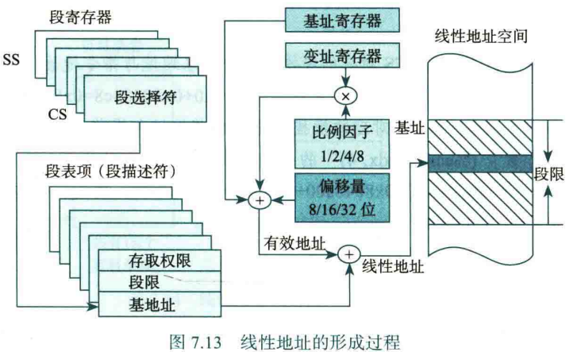

??? question "为什么我见到的虚拟地址页依旧是 `0x08048000` 这样的 32 位虚拟地址？"

    在“扁平化”之后，段机制几乎被弃用，段基址直接默认为零，导致虚拟地址 == 线性地址。常见的 32 位虚拟地址其实是线性地址的表示
    
    （按道理说你现在基本上看不到 48 位的虚拟地址了，至少 Linux IA-32 是直接把段机制几乎废弃了）

<br>

### 段页式虚拟存储器

CPU 发展到 80386 时期，我们在段机制的基础上加入了页机制，发展出了两级管理的段页式虚拟存储机制。IA-32 的段页式机制也大致如此

我们指定一个固定的大小，把程序的虚拟地址空间划分为大小相等的页，让外存与主存之间以页为单位交换信息。**对于虚拟存储空间的页我们称为虚拟页（VP）；对于主存空间的页我们称为页框（物理页， PF/PP）**

虚拟存储管理采用请求分页思想，仅将当前程序需要的页从外存调入主存，而其他不活跃的页保留在外存。当访问信息所在页不在主存中时，CPU 抛出缺页异常，此时操作系统从外存将缺失页装入主存。这一思想也解释了一个问题：为什么虚拟地址空间可以比主存空间大得多

首先，我们在控制寄存器中添加页机制的“开关”：`CR0.PG`。当 `CR0` 的 `PG` 位置为 1 时，我们启动页机制

接下来我们引入类似二级目录的机制：页目录 PD 和页表 PT，两者都存储在物理内存中。

- 页目录是一个表（依旧看成结构体数组就好），每个条目被称为页目录项 PDE，每个页目录有 1024 个 PDE。每个 PDE 对应一个页表，记录了对应页表的物理基地址和属性

!!! note "类比段机制需要用段寄存器 / 段选择子存储线性基地址，我们通过 CR3 寄存器存储页目录的物理基地址"

    ```c
    typedef union {
        struct {
            uint32_t reserved : 12;		// 一些杂七杂八的位，简化为保留位
            uint32_t pdbr : 20;			// 记录页目录的物理基地址的高 20 位
                                        // 实际物理地址为 pdbr << 12
        };
        uint32_t val;
    } CR3;
    ```

- 页表也是一个表，每个条目被称为页表项 PTE，每个页表有 1024 个 PTE。每个 PDE 对应主存空间上一个页框的物理基地址和属性

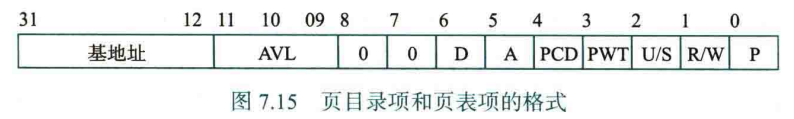

<del>（卧槽还有 AVL tree）</del>

<br>

#### 线性地址 → 物理地址

有了段页式虚拟存储器的知识点，我们可以继续 IA-32 保护模式下，地址转换的第二步了：

在通过段机制获取了线性地址后，我们将线性地址划分三个部分：高 20 位的索引 + 低 12 位的页内偏移量，其中索引部分平均分为页目录索引和页表索引（各 10 位），因此最大索引范围 1024

```c
         31        22 21       12 11           0
LINEAR  +------------+-----------+--------------+
ADDRESS |    DIR     |    PAGE   |   OFFSET     |
        +------------+-----------+--------------+
```

首先通过 CR3 的 `pdbr` 位获取页目录的物理基地址，加上页目录索引得到对应的页目录项地址；页目录项存储了对应页表的物理基地址，加上页表索引得到对应的页表项地址；页表项存储了对应页框的物理基地址，加上页内偏移量得到对应的主存地址

（页表项提供的页框基地址又叫物理页号，页内偏移量又叫页内地址）

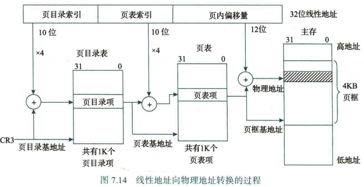

根据之前提到的按需分配原则，在进程刚刚创建时，所有的页目录项和页表项的装入位都是 0，表示未初始化映射（内核空间可能会预先设置）

当某个 4MB 区域被首次访问时，触发 `PDE.P = 0` 的缺页异常，MMU 会为这个页目录项分配一个页表，该页表的内容初始化为空（也就是说 `PTE.P = 0`），之后将 `PDE.P` 设置为 1

在此基础上，当某个 4KB 区域被首次访问时，触发 `PTE.P = 0` 的缺页异常，MMU 会为这个页表项分配一个页框，此时映射完全成立，之后将 `PTE.P` 设置为 1

<br>

### 页式虚拟存储器

不难发现，段机制 + 页机制使得访存过程变得更加复杂，因此最终在 x86-64 时期，段机制几乎废弃，只有 FS GS 段寄存器依旧在特定场合使用。从硬件层面来看，x86-64 已经是纯页式虚拟存储机制

事实上，对于 IA-32，虽然从硬件角度上来说依旧是段页式虚拟存储机制，但是从操作系统层面（比如 Linux），通常将段机制 “平坦化”：

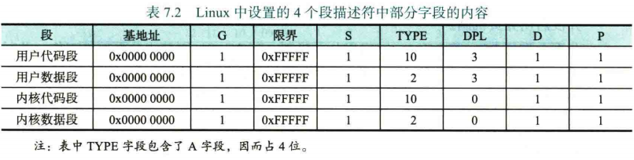

不难发现这和废弃段机制没有什么区别了，此时我们认为虚拟地址 == 线性地址

当然，IA-32 的实模式只支持段机制，并且也没有进行 “平坦化”，这个时候段机制还是虚拟存储的核心机制（物理地址 = 段基址 × 16 + 偏移量）

<br>

## TLB

!!! bug "注意：TLB 存储的是物理地址的高 xx 位，也就是物理页号，页内地址依旧是由线性地址的低位提供"

    起初我真的以为 TLB 存储的是整个 32 位物理地址，所以下面的笔记可能有写错的地方

访存时 MMU 先到主存查页表，然后才能得到物理地址，如果缺页还需要进行更多操作，这反而增加了 CPU 执行单条指令的访存次数。

所以我们把页表中最活跃的几个页表项装入一个特殊的高速缓存中，得到一个缓存页表，称为转换旁查缓冲器，即快表 (TLB)。相对应的，主存中的页表为慢表

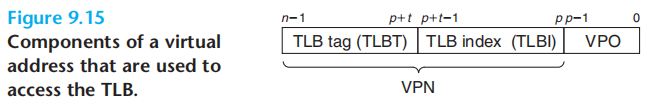

TLB 的设计与 cache 非常相似，cache 加速的是从物理地址到实际内存（DRAM）的访问，而 TLB 加速的是从线性地址到物理地址的转换

现在我们得到了一个线性地址，我们优先在 TLB 中查找：我们将 20 位的虚拟页号（线性地址高 20 位）分成标记和组索引两个部分。由组索引指定查找 TLB 的某一个组，然后用组索引遍历组内表项，寻找有没有组索引相同，并且 Present = 1 的 TLB 项。如果 TLB hit，那么直接取出对应的物理地址的物理页号，否则我们通过二级页表获取物理地址，然后将其更新到 TLB 中。

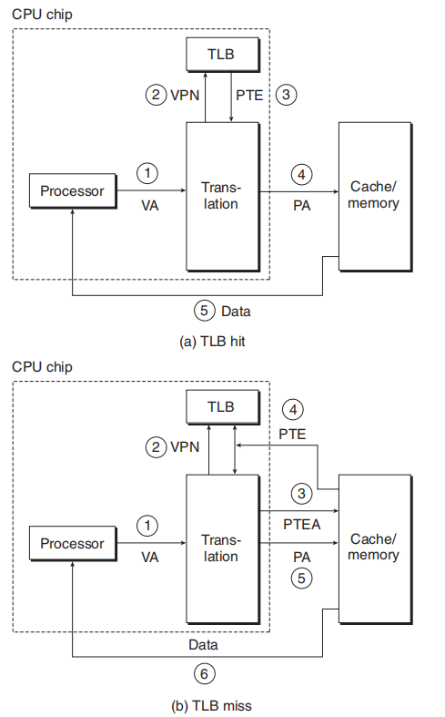

TLB 和 cache 的构造和策略非常相近：以组相联策略为例，查找 TLB 时，先通过虚页号的 TLB 组索引字段选出 TLB 组，然后对标记字段进行逐个比较；在 TLB miss 更新 TLB 时也有相近的策略。唯一不同的是，TLB 相比 cache 没有写数据操作，因此不需要考虑写策略

TLB miss 时，硬件或软件都可以用来进行缺失处理，其中 IA-32 采用硬件处理方式：采用某种替换算法进行 TLB 替换，然后由 MMU 的页表遍历器将页表项装入 TLB 表项，或者抛出缺页异常。还有一些架构设计使用软件进行处理（比如 MIPS），好处是可以使用更复杂高效的替换算法，坏处是对于流水线式处理器，打断处理器流水线带来的缺失损失更大

??? tip "我们可以给出 cache + TLB 下层次化存储系统的结构，以及对应的 CPU 访存过程"

    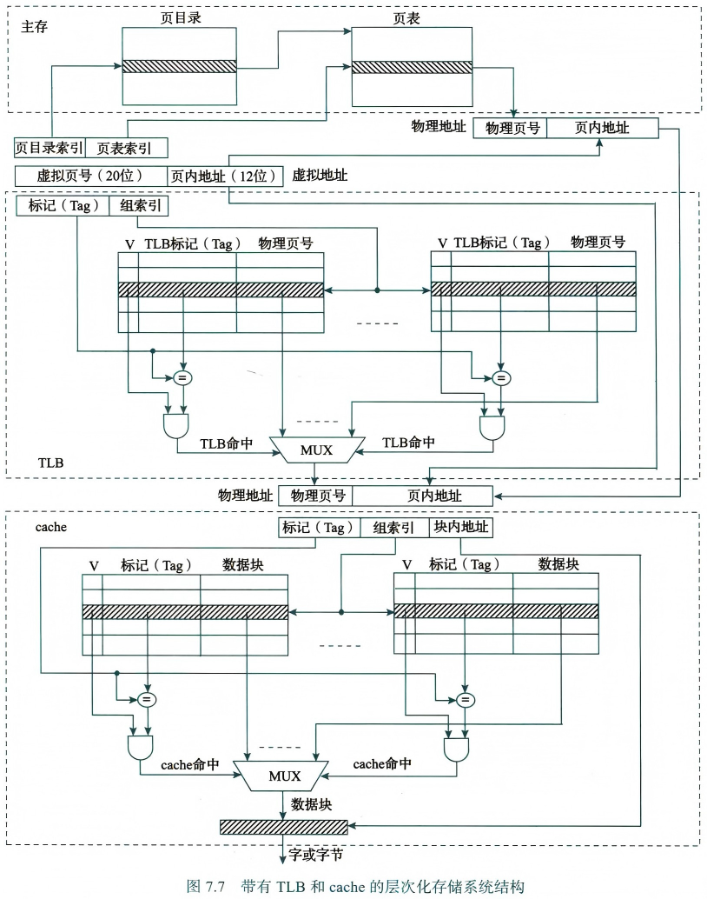
    
    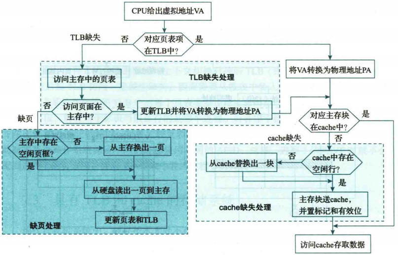    

<br>

## Linux 虚拟存储管理

随便记一点：

- Linux 内核使用链式方式来管理虚拟内存区域，其中通过 `vm_area_struct` 来表示不同的内存区域。系统通过这种链表式管理来分配内存，并通过页表来管理每个区域的物理内存映射。在进程的虚拟空间中，部分区域并不需要实际映射到物理内存，这被称为 “空洞区域”。因为链表的非连续内存特性，使得空洞区域不会占用主存、外存、内核本身任何的额外资源
- Linux 通过将同一个共享库映射到不同进程的虚存实现共享库的共享属性。先使用共享库的进程通过内核为共享库分配了页框，后使用共享库的进程也是用相同的页框存取信息。
- 进一步的，同一个可执行文件也可能被多次加载执行形成不同的进程，而不同进程的区域可能会映射到同一个对象。我们知道不同进程间修改操作应是彼此独立的，一种朴素的方法是对不同进程中对应区域的虚拟页在主存中分配各自的页框，但更好的方法是 “写时拷贝”：
    - 多个进程最初共享相同的物理页，并且这些共享页的权限是<u>只读</u>。当任意进程尝试写操作时，触发页异常，操作系统为这一进程分配新的物理页，该页只对触发写操作进程拥有写权限，这样就实现了每个进程互不影响，同时还能共享同一对象

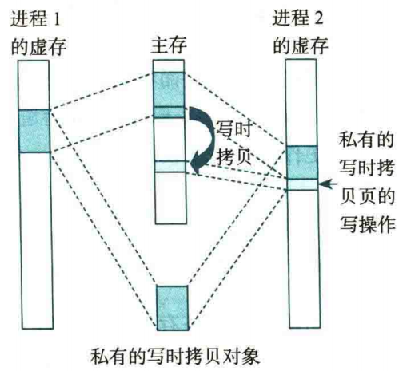
