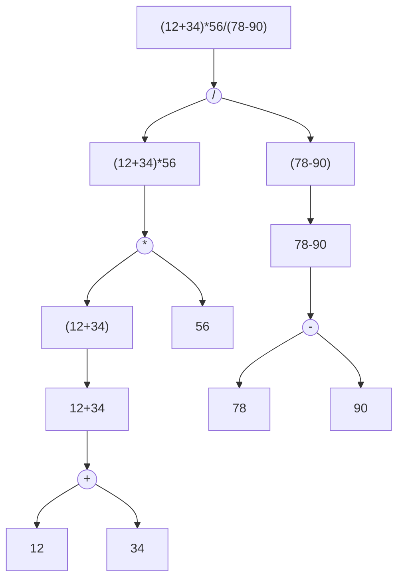

# PA2-3 note

Bonus PA，实现了有奖励，不实现没有惩罚，而且可以部分实现获得小的 bonus

内容参考 ICSPA (RISC-V ver) 1-2 ：[表达式求值 · GitBook](https://nju-projectn.github.io/ics-pa-gitbook/ics2025/1.5.html#递归求值)

---

## 表达式求值

让程序完成表达式的求值分两步：

1- 词法与语法分析：让程序理解表达式的内容

2- 递归求值：根据分析掌握的内容进行实际求值

### 词法分析

简单来说就是区分一个表达式的不同组成：

```
(x >= 0) && (y + 3 <= (z & 0xff))
```

比如上面的随手写的表达式，如果你把它丢进 VSCode 中，设置语言为 C 语言，是这样的


在 VSCode 的渲染下，运算符为紫色，常数为黄色（十六进制前缀为红色），逻辑符为蓝色，变量为白色，括号按照层级顺序逐层渲染为不同的颜色。这就是词法分析（还包含一些语法分析）的结果

每一个单元（一个运算符，一个常数，等等）被称为 `token`，而词法分析的作用就是识别每一个 `token` 对应了什么内容

我们先实现最简单的四则运算 `token`

```c
enum
{
	NOTYPE = 256,					// whitespace
	EQ,								// '=='
	NUM,							// num(base-10)

	ADD,							// '+'
	SUB,							// '-' (not REG)
	MUL,							// '*' (not DEREF)
	DIV,							// '/'

	// NEG,							// '-' (not SUB)
	// DEREF,						// '*' (not MUL)

	LPAREN,							// '('
	RPAREN,							// ')'
    
    TOKEN_COUNT						// 技巧，这个枚举量为 TOKEN 的总数量
};
```

!!! tip "部分符号在不同上下文中的解释不同，比如 `*` 既是乘号，又是解引用"

    每一种不同的定义都应该进行枚举（上面注释的内容）；区分同一个符号的不同定义在之后的语法分析中完成，之后再说

接下来是定义这些 `token` 分别由哪些单元对应，以四则运算为例：

```c
static struct rule
{
	char *regex;
	int token_type;
} rules[] = {
	{" +", NOTYPE},				// white space
    {"[0-9]+", NUM},			// 十进制整数
    {"\\(", 'LPAREN'},			// 左括号
    {"\\)", 'RPAREN'},			// 右括号
    {"\\*", 'MUL'},          	// 乘法
    {"\\/", 'DIV'},          	// 除法
    {"\\+", 'ADD'},          	// 加法
    {"\\-", 'SUB'},          	// 减法
};
```

??? question "为什么这里填写的内容不是 `#!c {" ", NOTYPE}` 和 `#!c {"+", ADD}`？"

    首先，为了识别 token 的便捷性（以及不必要的搓板子环节），我们使用了 POSIX regex 正则表达式来简化匹配的逻辑
    
    比如 `#!c {" +", NOTYPE}`，其中 `+` 是一个元字符，表示“匹配它前面的字符至少一次（允许多次）”，因此 `" +"` 匹配的是任意长度的空格串
    
    为了使 `+` 表示为字面上的加号，需要 `\` 进行反斜杠转义；在 C 语言的环境中我们还需要额外为单独的 `\` 进行转义，于是我们有了 `\\+` 匹配加号的写法

???+ warning " Pay attention to the precedence level of different rules. 如何理解这句提醒"

    举一个例子：{"==", EQ}（比较符等号）应该优先于 {"=", ASSIGN}（赋值）出现，因为能匹配 `==` 就一定能匹配 `=`，<u>**更长的模式必须要优先于更短的模式进行匹配**</u>
    
    其他的例子包括：十六进制优先于十进制数；特定的关键字（`if` 等）优先于标识符

接下来我们需要识别定义的这些 `token` ，`make_token()` 函数将一个输入的字符串切割为 `tokens` 进行存储，其中需要完成的核心任务就是下面的代码：

```c
typedef struct token
{
	int type;
	char str[32];
} Token;

Token tokens[32];
int nr_token;

// 从 rules 数组中取出一个 token 对应的枚举值存储
tokens[nr_token].type = rules[i].token_type;
// 限制单个 token 长度
int rlen = (substr_len < 31) ? substr_len : 31;
// 拷贝 token 字面值
strncpy(tokens[nr_token].str, substr_start, rlen);
// 字符串结尾 '\0'
tokens[nr_token].str[rlen] = '\0';
// 索引 ++
nr_token++;
```

正确存入 tokens，词法分析的任务就完成了

### 语法分析与求值

语法分析分两步

首先需要判断多义 token 在上下文中的实际用法，比如 `*` `-`：

```c
static void retokenlizer(bool *success){
	for(int i = 0; i < nr_token; i++){
        // 解释一个多义 token 的实际用法只需要看前一个 token
		if(tokens[i].type == MUL && (i == 0 || ( is_deref[tokens[i-1].type] )) ) {
			tokens[i].type = DEREF;
			continue;
		}
		if(tokens[i].type == SUB && (i == 0 || ( is_neg[tokens[i-1].type] )) ) {
			tokens[i].type = NEG;
			continue;
		}
	}
}
```

这里为了避免 `if` 语句填过长的 `||` 链，不妨定义一个 `static` 数组，将所有满足条件的枚举项都设置为 `1`：

```c
static const int is_deref[TOKEN_COUNT+1] = {	// TOKEN_COUNT 是 emun 的最后一项
	// [NOT_MENTIONED] = 0;						// 没有列举出的枚举项都初始化为 0
	[ADD] = 1,
	[SUB] = 1,
	[MUL] = 1,
	[DIV] = 1,
	// ...
	[DEREF] = 1,
	[NEG] = 1,
	[LPAREN] = 1,
	[ASSIGN] = 1,
};
```

此时所有的 token 都完成了分析，我们接下来采用递归求值的方式解析 token 串：

根据 BNF （巴科斯范式），一个表达式的递归定义是这样的：

- 一个数是表达式
- 一个表达式两侧加上一对括号也是表达式
- 两个表达式之间插入一个运算符也是表达式

根据上面的三条规则，我们尝试拆解下面的式子：`(12+34)*56/(78-90)`



将 token 串自顶向下转化为语法树后，接下来只需要自底向上进行实际计算，就能正确得到表达式的值，而以上操作都可以通过递归自然实现。我们令 `eval(p,q)` 表示计算 token 串的 `[p,q]` 部分：

```c
static uint32_t eval(int p, int q, bool* success){
    // p > q 不应该发生
	if(p > q) {
		*success = false;
		return 0;
	}
    
    // 一个数是表达式
	else if(p == q) { 
		uint32_t res;
		char* endptr;
		res = (uint32_t)strtol(tokens[p].str, &endptr, 0);
	    if(endptr == tokens[p].str || *endptr != '\0') {
			printf("\033[31m[TOKEN ERROR] Bad number convention: %s\033[0m\n", tokens[p].str);
			*success = false;
			return 0;
		}
		return res;
	}
    
    // 一个表达式两侧加上一对括号也是表达式
    // check_parentheses 函数判断 p,q 是否为一对匹配的括号
	else if(check_parentheses(p, q) == true) {
		return eval(p + 1, q - 1, success); 
	}
    
    // 两个表达式之间插入一个运算符也是表达式
	else {
        // choose_op 函数找到用于二分的索引
		int op_place = choose_op(p, q, success);

        // 递归计算符号两边的表达式
		uint32_t val1 = eval(p, op_place - 1, success);
		if (!*success) return 0;
		uint32_t val2 = eval(op_place + 1, q, success);
		if (!*success) return 0;
	
        // 符号两侧的结果进行计算
		switch(tokens[op_place].type) {
			case ADD: return val1 + val2;
			case SUB: return val1 - val2;
			case MUL: return val1 * val2;
			case DIV: 
				if(val2 == 0){	// 除零操作
					printf("\033[31m[EVAL ERROR] Divided by zero when %u / %u\033[0m\n", val1, val2);
					*success = false;
					return 0;
				}
				return val1 / val2;
            // ...
		}
	}
}
```

这里 `check_parentheses` 的实现略，我们主要关注 `choose_op` 函数是如何选择 `dominant op` ，即表达式二分的界线：一句话来说， `choose_op` 函数的作用就是找到当前表达式中优先级最小的运算符，具体而言：

- 这个运算符不能在括号中，因为括号提升了其内部符号的整体优先级（换个角度看，你不能分开左右括号）
- 在上文的基础上，这个运算符的算符优先级应该最小，这个不需要解释
- 在上文的基础上，应该选择最右边的运算符，因为同级运算符从左往右进行计算

为什么要选择优先级最低的符号？因为越早被选中的符号在递归时越晚被用来计算，可以参考后序遍历和上面的示例图

总结一下能得到下面的函数

```c
static int choose_op(int p, int q, bool* success){
	int ans = -1;
	int ans_pre = 100;
	int paren_count = 0;
	
	// 从右往左搜索
	for(int i = q; i >= p; i--){
		// 这里记录括号的嵌套情况
		if(tokens[i].type == RPAREN) {
			paren_count++;
		} else if(tokens[i].type == LPAREN) {
			paren_count--;
		}
		
        // 只有没有括号嵌套的情况下才尝试寻找 dominant op
		if(paren_count == 0) {
			if(tokens[i].type >= 0 && tokens[i].type <= TOKEN_COUNT) {
				int this_pre = opr_pre[tokens[i].type];
				if(this_pre != 0 && this_pre < ans_pre){
					ans = i;
					ans_pre = this_pre;
				}
			}
		}
	}
	
	if(ans == -1) {
		printf("\033[31m[EVAL ERROR] Cannot find 'dominant op' from token[%d] to token[%d]\033[0m\n", p, q);
		*success = false;
	}
	return ans;
}
```

Congrats! 表达式求值就这样完成了

当然，目前只完成了最基础的四则运算，你接下来还需要考虑：

在十进制数字的基础上，引入其它进制的数字与寄存器

扩展更多的运算符，不仅是二元运算符，还包括“取反”等一元运算符

如果一个表达式是有问题的，你的程序只会返回一个 invalid expression，还是会提示出错的位置和原因？不妨建立一个完善的error机制

... ...

## 添加变量与函数名支持

添加 Symbol 的支持由于给出了非常完整的前置函数，因此难度很小

NEMU 在启动时已经调用了 `load_elf_tables()` 加载符号表

`extern uint32_t look_up_symtab(char *sym, bool *success);` 这个已实现的函数可以实现根据符号表返回地址

定义一个 SYMB 枚举项，当作 NUM 一样处理，仅多一个取地址操作，用 vaddr 即可

---

## Appendix : My implementation

将我的实现过程根据完成度分为以下几个阶段

- 实现十进制数四则运算
- 扩充到其它进制的数与寄存器、实现更多的二元（逻辑）运算
- 实现右结合的一元运算，实现 `*` `-` 等多义符号的语法判断
- 添加符号表读写支持（实现 `=` 操作）
- 添加本地变量支持（我采用 `new var = nums` 的结构定义本地变量，可以和符号表的已知符号混合使用）
- Beautify（添加详细的 error 报错信息）
