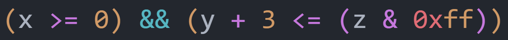

# PA 2-3 note

Bonus PA，实现了有奖励，不实现没有惩罚，而且可以部分实现获得小的 bonus

内容参考 ICSPA (RISC-V ver) 1-2 ：[表达式求值 · GitBook](https://nju-projectn.github.io/ics-pa-gitbook/ics2025/1.5.html#递归求值)

---

## 表达式求值

让程序完成表达式的求值分两步：

1- 词法分析：让程序理解表达式的内容

2- 求值：根据词法分析掌握的内容进行实际求值

### 词法分析

简单来说就是区分一个表达式的不同组成：

```
(x >= 0) && (y + 3 <= (z & 0xff))
```

比如上面的随手写的表达式，如果你把它丢进 VSCode 中，设置语言为 C 语言，是这样的



在 VSCode 的渲染下，运算符为紫色，常数为黄色（十六进制前缀为红色），逻辑符为蓝色，变量为白色，括号按照层级顺序逐层渲染为不同的颜色。这就是词法分析的结果

每一个单元（一个运算符，一个常数，等等）被称为 `token`，而词法分析的作用就是识别每一个 `token` 对应了什么内容

有哪些类型的 `token` ？`/nemu/src/monitor/expr.c` 中有枚举：

```c
enum
{
	NOTYPE = 256,					// 空格
	EQ,								// 比较符 ==
	NUM,							// 数字字面量（十进制）
	REG,							// 寄存器
	SYMB							// 符号（之后再说）

	/* TODO: Add more token types */

};
```

我们先实现最简单的四则运算 `token`

```c
enum
{
	NOTYPE = 256,					// whitespace
	EQ,								// '=='
	NUM,							// num(base-10)
	REG,							// reg
	SYMB,							// symbol

	ADD,							// '+'
	SUB,							// '-' (not REG)
	MUL,							// '*' (not DEREF)
	DIV,							// '/'

	// NEG,							// '-' (not SUB)
	// DEREF,						// '*' (not MUL)

	LPAREN,							// '('
	RPAREN,							// ')'
};
```

!!! tip "注意到减号和乘号有重复定义，应该如何处理？"

    每一种不同的定义都应该分开枚举以避免解释时冲突；区分同一个符号的不同定义在之后完成，这个之后再说

接下来是定义这些 `token` 分别由哪些单元对应：

```c
static struct rule
{
	char *regex;
	int token_type;
} rules[] = {

	/* TODO: Add more rules.
	 * Pay attention to the precedence level of different rules.
	 */

	{" +", NOTYPE}, // white space
	{"\\+", ADD},	// add expr, i change it form {"\\+", '+'} for my own enum

};
```

??? question "为什么这里填写的内容不是 `#!c {" ", NOTYPE}` 和 `#!c {"+", ADD}`？"

    首先，为了识别 token 的便捷性（以及不必要的搓板子环节），我们使用了 POSIX regex 正则表达式来简化匹配的逻辑
    
    比如 `#!c {" +", NOTYPE}`，其中 `+` 是一个元字符，表示“匹配它前面的字符至少一次（允许多次）”，因此 `" +"` 匹配的是任意长度的空格串
    
    为了使 `+` 表示为字面上的加号，需要 `\` 进行反斜杠转义，但是 C 语言的环境中我们还需要额外为单独的 `\` 进行转义，于是我们有了 `\\+` 匹配加号的写法

???+ warning " Pay attention to the precedence level of different rules. 如何理解这句提醒"

    举一个例子：{"==", EQ}（比较符等号）应该优先于 {"=", ASSIGN}（赋值）出现，因为能匹配 `==` 就一定能匹配 `=`，<u>**更长的模式必须要优先于更短的模式进行匹配**</u>
    
    其他的例子包括：十六进制优先于十进制数；特定的关键字（`if` 等）优先于标识符

对于四则运算的 `token` 可以这样匹配：

```c
static struct rule
{
	char *regex;
	int token_type;
} rules[] = {
	{" +", NOTYPE}, // white space
    {"[0-9]+", NUM},     // 十进制整数
    {"\\(", 'LPAREN'},           // 左括号
    {"\\)", 'RPAREN'},           // 右括号
    {"\\*", 'MUL'},           // 乘法
    {"\\/", 'DIV'},           // 除法
    {"\\+", 'ADD'},           // 加法
    {"\\-", 'SUB'},           // 减法
};
```

接下来我们需要识别定义的这些 `token` ，`make_token()` 函数将一个输入的字符串切割为 `tokens` 进行存储


