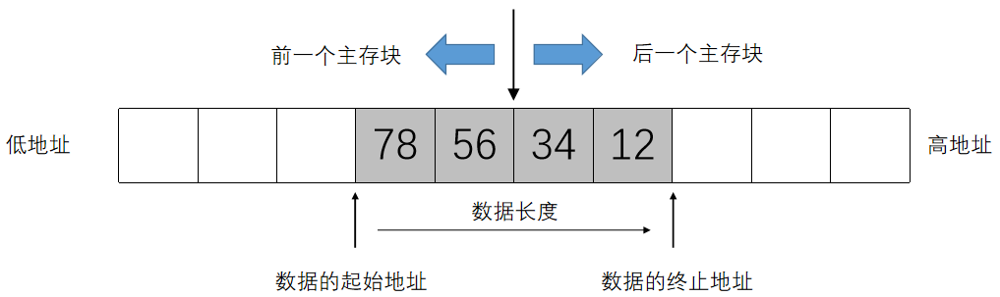

# PA3-1 note

## Intro

在 NEMU 中实现一个 cache，程序在访问主存之前，先尝试访问 cache 块中的内容看有没有匹配的内容。可以形象化的理解为：

Before PA3-1: 每次需要某个文具时，从一个大铅笔盒中取出一个文具

After PA3-1: 先将常用的文具拿出来放在写字台上，每次需要某个文具时，先看看桌上有没有所需的文具，如果找不到再搜铅笔盒

显然从桌上取文具的速度比从铅笔盒中取文具的速度更快，但是桌上不能放很多的文具，正如 cache 不能存储很多数据一样。这时候根据程序访问地址的**局部性原理（locality）**，我们有：

- 时间局部性：一个内存区间在第一次被访问后，短时间内可能会被再次访问
- 空间局部性：一个内存区间在第一次被访问后，其周围的内存区间接下来可能会被访问

我们根据上述原理选择存入 cache 中的内容

> 下面这个例子中，`i` 和 `n` 满足时间局部性，`arr` 满足空间局部性：
>
> ```c
> for(int i = 0; i < n; i++){
>    	cin >> arr[i];
> }
> ```
>
> 如果我们将上面的变量提前保存到 cache 中，不难发现数组读入的速率会加快很多

---

## 策略选择

Cache和主存之间交换数据的基本单元在主存中称为块（block），而在Cache中则称为行（line）或槽（slot），在 NEMU 中其实都是 64B 的空间

交换数据时，我们有下面的四个问题，以及 PA 选择的方案：

> 1- 主存中的块与Cache中的槽如何对应？在这里就要考虑到查找的效率和Cache存储空间使用效率的权衡。于是就产生了直接映射、全相联映射和组相联映射这三种方式；

在这里我们选择**组相联映射**（采用 8-way 组相联）

▲ 直接映射指的是将 cache 槽直接与主存块进行一定的对应，每个块用的槽是特定的

类比简易哈希表，优点是查找快；缺点是易冲突，缓存命中率可能不高

▲ 全相联映射指的是 cache 槽可以被任意主存块映射，“是坑就占”，采用标记字段判断槽中的数据是否存在

优点是冲突小，缓存命中率较高；缺点是硬件实现复杂，查找速度慢（每个标记字段都要确认）

▲ 组相联映射是上述的结合：cache 被分成若干组，每组有若干个槽。主存中的块与 cache 组有特定的对应关系，但是 cache 组内可以随意映射

优点和缺点参考前两条

> 2- 当新访问的主存块映射到Cache中已经被占用的槽时怎么办？于是便产生了不同的替换策略如先进先出、最近最少用、最不经常用和随机替换算法等；

为了简化实现，采用**随机替换**

很好理解，其中随机替换最容易实现，其不需要额外维护任何信息

> 3- 当Cache槽中的数据和主存对应块的数据产生不一致时怎么办？这种不一致只会由对Cache的写操作引起，于是针对写操作的不同处理方法就形成了全写法和回写法两类方法。

选择**全写法**，更新 cache 槽的同时也一并写入主存

相比之下，回写法在更新 cache 槽后进行脏位标记，暂时不写入主存；当 cache 槽需要被替换时，在替换前（如果有脏位标记）将数据写入主存

> 4- 写操作时Cache缺失时怎么处理？根据是否将内存块调入Cache就形成了包括写分配法和非写分配法两种基本的策略。

选择**非写分配法**，也就是说写缺失时不把内存块写入 cache 中，只写入主存，一句话解释就是：cache 只为读操作优化。这一思路考虑 “写操作后很少会接着进行读操作”

相比之下，写分配法在写缺失时把内存块写入 cache 中，在 cache 块中更新数据，然后根据之前选择的写操作处理方法对主存进行处理

---

## cache 内存设计

在 NEMU 中 cache 采用 *8-way set associative*：cache 的槽数为 64KB / 64B = 1024，每个组分配 8 个槽，总共有 1024 / 8 = 128 个组

```c
#define CACHE_SIZE (64 * 1024)							// cache 总大小
#define BLOCK_SIZE (64)									// 单个主存块大小
#define WAY_CNT (8)										// 8 路组相联映射
#define SET_CNT (CACHE_SIZE / (BLOCK_SIZE * WAY_CNT))	// 组数
```

对于每个 cache 槽划分其结构：

```c
typedef struct {
	uint8_t data[BLOCK_SIZE];	// 数据位：实际存储数据的数据块
	uint32_t tag;				// 标记位：标识主存块（对应了哪一块主存）
	bool valid;				  // 有效位：数据是否有效
} cacheSlot;
```

然后定义一个全局 cache 数组：`#!c cacheSlot cache[SET_CNT][WAY_CNT];`

这就是 cache 的实现，现在我们需要将主存中的块与 cache 中的槽进行对应

在 cache 的实现中，我们进行操作的是物理地址（硬件角度）而不是虚拟地址（程序角度），在 cache 设计时，物理地址被分为三个部分：

```c
[31:13] [12:6] [5:0]
TAG     SET    OFFSET
```

- `set` 部分，其确定了应该在 cache 的哪个组中进行查找，位长度由 cache 的组数决定。这里 cache 被分为 $2^7$ 个组，因此需要 $7$ 位

- `tag` 部分，这部分内容会和实际 data 一并存入 cache 中，用于在 `set` 确认组后准确定位

- `offset` 部分，用于在找到对应的槽后，利用偏移值找到具体需要使用的数据，位长度由 cache 块大小决定。这里每个块大小为 $2^6 \text{ Byte}$，因此需要 $6$ 位

  （`tag` 是地址减去 `set` 和 `offset` 的部分剩下的部分，其长度没有硬性规定）

**如何从物理地址定位到 cache 的内容？先根据 `set` 定位 `cache[set]`，再结合 `tag` 定位到 `cache[set][way]`，最后利用 `offset` 定位到 `cache[set][way].data[offset]`**

---

## cache 函数实现

首先对 cache 初始化：

```c
void init_cache() {
	// 随机替换的初始化
	srand(time(NULL));
	for (int set = 0; set < SET_CNT; set++) {
		for (int way = 0; way < WAY_CNT; way++) {
			cache[set][way].valid = false;
			cache[set][way].tag = 0;
			memset(cache[set][way].data, 0, BLOCK_SIZE);
		}
	}
}
```

实现 cache 读操作，根据之前的策略选择不难得到这样的框架：

```c
uint32_t cache_read(paddr_t paddr, size_t len) {
	// 长度合法性判断，在 paddr_read 等函数中也有
	assert(len == 1 || len == 2 || len == 4);
	
	// 分离地址中的信息
	uint32_t set = get_set(paddr);
	uint32_t tag = get_tag(paddr);
	uint32_t offset = get_offset(paddr);
	
	// 根据信息在 cache 中查找
	int way = find_way(set, tag);
	
	// cache miss 时，先从主存调入块到 cache，然后从 cache 访问
	if (way == -1) {
		way = rand() % WAY_CNT;
		transfer(paddr, set, way);
	}
	
	// cache hit 时，直接从 cache 访问
	uint32_t data = 0;
	memcpy(&data, cache[set][way].data + offset, len);
	return data;
}
```

以及对应的 cache 写操作

```c
void cache_write(paddr_t paddr, size_t len, uint32_t data) {
	assert(len == 1 || len == 2 || len == 4);
	
	uint32_t set = get_set(paddr);
	uint32_t tag = get_tag(paddr);
	uint32_t offset = get_offset(paddr);
	
	// 查找Cache
	int way = find_way(set, tag);
	
    // cache hit
    // 全写法，更新 cache 也更新主存
	if (way != -1) {
		memcpy(cache[set][way].data + offset, &data, len);
	}
	
    // cache miss
    // 非写分配法，只写入主存
    // 这个函数似乎没有在 memory.h 中声明（
	hw_mem_write(paddr, len, data);
}
```

一些子函数这里就不给出具体实现了，在理解物理内存之后不难写出

---

## cache 数据跨块的处理

如果你直接按照上面的模板实现，你会收获一个 Segmentation Fault，因为目前的实现并没有处理下图中的情况（摘自课程课件）：


这里对于读操作给出一个方案：把数据拆分为两部分进行读操作（这里用一层递归简化了代码），最后通过位运算进行合并

```c
// read data from cache
uint32_t cache_read(paddr_t paddr, size_t len) {
    // 为什么没有 assert 检查了？
	uint32_t offset = get_offset(paddr);

	// if cross the line, divided to two parts
	if (offset + len > BLOCK_SIZE) {
		uint32_t low_part = BLOCK_SIZE - offset;
		uint32_t low_data = cache_read(paddr, low_part);
		uint32_t high_part = len - low_part;
		uint32_t high_data = cache_read(paddr + low_part, high_part);

		return low_data | (high_data << (low_part << 3));	// 1byte = 8bit
	}
	
	// ... ...
	return data;
}
```

写操作同理，代码略
