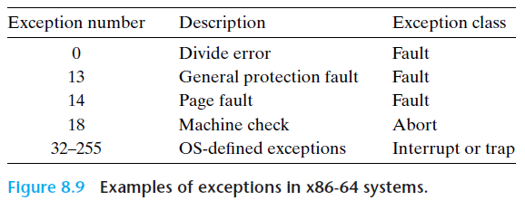

# PA4-1 note

!!! tip "课本导航：《计算机系统：基于 x86 + Linux 平台》From P337"

    或者去看《深入了解计算机系统》原书第3版的 P503，或者《CSAPP》英文原书 P760
    
    [一个 IDT 的参考链接](https://wiki.osdev.org/Interrupt_Descriptor_Table)

## Intro

目前的 NEMU 只会根据正常流程执行指令序列，对异常（内部）与中断（外部）事件并没有相应的处理程序

现在我们要实现对异常控制流的处理

> *从80286开始，Intel统一把由CPU内部产生的意外事件，即，“内中断”称为异常；而把来自CPU外部的中断请求，即，“外中断”称为中断。而内部异常又分为三类：*
>
> 1. *故障：与指令执行相关的意外事件，如“除数为0”、“页故障”等；*
>
> 2. *陷阱：往往用于系统调用；*
>
> 3. *终止：指令执行过程中出现的严重错误。*
>
> *在本实验中，我们对于内部异常，只关注“陷阱”这一类。对于“故障”和“终止”这两类异常不做模拟，若遇到相应的情况，在NEMU中直接通过assert(0)强行停止模拟器运行。*
>
> *异常和中断的响应和处理过程可分为两个阶段：第一阶段，CPU对异常或中断进行响应，打断现有程序运行并调出处理程序；第二阶段，由操作系统提供的异常或中断处理程序处理完异常事件后返回用户程序继续执行。*

异常/中断处理分成硬件执行和软件执行两个部分

*简单来说：*

1- 硬件执行。实现控制流的强制切换（正常 --> 异常），目的是从用户程序/内核强制跳转到操作系统内置的处理程序。硬件不考虑其他事情，只考虑切换控制流并“交付”给专门的程序

2- 软件执行。由操作系统内核实现，作用是处理异常/终端事件，尝试处理恢复异常上下文

*具体来说：*

1- 硬件执行。为了能让软件层处理恢复异常的上下文，硬件层首先需要保护断点和程序状态（依次将 `EFLAGS`、`CS`、`EIP` 寄存器压栈）；

接下来是 “关中断”（interrupt disable，这是一个术语），指禁止处理器响应中断请求的状态，通常用于保护关键任务的执行，确保系统的稳定性和数据完整性。在 NEMU 的具体操作是：如果异常事件是外部中断，则清除 EFLAGS 的 IF 位

然后是最关键的步骤：根据指令或硬件给出的异常和中断类型号，查询得到处理程序的入口地址并跳转执行。

为什么要这么做？在调出异常/终端处理程序之前，它必须知道发生了什么异常 / 哪一个 I/O 设备发出了中断请求。异常和中断源的识别有软件识别和硬件识别两种方式，对于 IA-32/x86-64 采用硬件识别方式

硬件识别称为向量中断模式，**在实地址模式下**，不同的异常 / 中断处理程序的首地址 / 跳转指令称为 *中断向量*，所有的中断向量存放在 *中断向量表（IVT）* 中。每个异常 / 中断都被设定为一个 *中断类型号*，其与中断向量存放的位置产生对应关系，使得可以根据中断类型号快速跳转到对应的异常 / 中断处理程序执行 



<del>然而不幸的是</del>在 NEMU 的实现中，我们需要实现**保护模式**下的硬件识别。

IA-32/x86-64 的保护模式并不像实地址模式那样直接给出异常 / 中断处理程序的入口地址，而是借助 *中断描述符表（IDT）* 获得。其构造类似于段表，为数组形式，每个元素为 *门描述符*。门描述符分为三大类：中断门描述符、陷阱门描述符和任务门描述符

> 与`GDT`类似，门描述符表（`IDT`）的首地址储存在一个特殊的寄存器`IDTR`中。当一个异常或中断到来时，CPU根据异常或中断号，该异常或中断号可能由硬件给出（如，14号页故障），也可能由程序给出（如，`int 0x80`）。得到异常或中断号后，CPU根据该号码查询`IDT`，从对应的门描述符中提取出处理程序的入口地址（虚拟地址，`selector + offset`），并跳转处理程序继续执行

---

2- 软件执行。在硬件部分完成了基础工作之后，跳转到异常 / 中断处理程序的入口地址，操作系统提供的处理程序完成第二阶段的处理：

1. 根据操作处理过程的需要，通过`pusha`等指令保存程序执行的现场；

2. 处理相应的异常或中断；

3. 处理完成后，Kernel使用`popa`等指令恢复现场；

4. 通过`iret`指令恢复最初被保护的程序断点和状态信息，返回原程序被中断的指令（或下一条，根据保护断点时具体保存的`EIP`决定）继续执行。

## Part1. 实现

Kernel 初始化过程自行参考手册与课本，这里依旧聚焦于 NEMU 代码层：

首先我们要进行器件实现，定义 `IDTR` 结构体和 `INTR` 引脚：

```c
typedef struct {
	uint32_t limit;
	uint32_t base;
}IDTR;

IDTR idtr;
uint8_t intr;		// 外部设备通过 INTR 引脚向 CPU 发送中断请求
```

GateDesc 在 `./kernel/src/irq/idt.c` 提供了实现

```c
typedef struct GateDescriptor
{
	uint32_t offset_15_0 : 16;
	uint32_t segment : 16;
	uint32_t pad0 : 8;
	uint32_t type : 4;
	uint32_t system : 1;
	uint32_t privilege_level : 2;
	uint32_t present : 1;
	uint32_t offset_31_16 : 16;
} GateDesc;
```

然后是 `raise_intr()` 函数的实现，这个函数实现了硬件执行的所有步骤

```c
#define pushreg2stack(Val, Size)    \
{                             \
    cpu.esp -= ((Size) / 8);             \
    r.data_size = Size;          \
    r.addr = cpu.esp;         \
    r.val = (Val);            \
    operand_write(&r);        \
}

void raise_intr(uint8_t intr_no)
{
#ifdef IA32_INTR
    
    // step 1: 将三个寄存器值入栈
	OPERAND r;
    r.sreg = SREG_DS;
    r.type = OPR_MEM;
    
    pushreg2stack(cpu.eflags.val, 32);
    pushreg2stack(cpu.segReg[1].val, 16);
    pushreg2stack(cpu.eip, 32);
    
    // step 2: 关中断
    GateDesc gate;
    vaddr_t idt_addr = cpu.idtr.base + (intr_no << 3);
    // 注意到 GateDsec 是 8 byte 的，因此不能一次取出
    uint32_t raw_data[2] = {
        laddr_read(idt_addr, 4),
        laddr_read(idt_addr + 4, 4)
    };
    memcpy(&gate, raw_data, sizeof(GateDesc));
    
    if(gate.type == 0xe){
        cpu.eflags.IF = 0;
    }
    
    // step 3: 得到异常或中断号，查询`IDT`，提取出处理程序的入口地址并跳转
    
    uint32_t addr = (gate.offset_31_16 << 16) | gate.offset_15_0;
    cpu.segReg[1].val = gate.selector;

    cpu.eip = addr;

#endif
}
```

*完成这一步以后就可以先 `ref` 一些指令，`make test` 确认截止目前的操作是否正确了*

```
> ./nemu/nemu --autorun --testcase hello-inline --kernel
NEMU load and execute img: ./kernel/kernel.img  elf: ./testcase/bin/hello-inline
nemu trap output: [src/main.c,82,init_cond] {kernel} Hello, NEMU world!
nemu trap output: [src/elf/elf.c,30,loader] {kernel} ELF loading from ram disk.
nemu trap output: Hello, world!
nemu: HIT GOOD TRAP at eip = 0x08049023
You have used reference implementation, DO NOT submit this version.
```

---

接下来是各种指令的实现：

- `lidt`：加载 IDTR 寄存器

```c
make_instr_func(lidt) {
    OPERAND idtr;
    idtr.data_size = 16;
    idtr.type = OPR_MEM;
    idtr.sreg = SREG_DS;
    int len = 1 + modrm_rm(eip + 1, &idtr);
    
    cpu.idtr.limit = vaddr_read(idtr.addr, idtr.sreg, 2);
    cpu.idtr.base = vaddr_read(idtr.addr + 2, idtr.sreg, 4);
    
    return len;
}
```

- `cli` 和 `sti`：分别清除与设置中断标志 IF

```c
make_instr_func(cli) {
    cpu.eflags.IF = 0;
    return 1;
}

make_instr_func(sti) {
    cpu.eflags.IF = 1;
    return 1;
}
```

- `int`：主动触发中断

> 手册里有这一句话：到系统执行到`int $0x80`自陷指令后，即获取`intr_no = 0x80`并执行`raise_sw_intr()`

```c
// 这里的 int_ 避免与 int 数据类型混淆，手册要求
make_instr_func(int_) {
    OPERAND imm;
    imm.type = OPR_IMM;
    imm.sreg = SREG_CS;
    imm.data_size = 8;
    imm.addr = eip + 1;
    operand_read(&imm);
    raise_sw_intr(imm.val);
    return 0;	// 中断指令不考虑返回值
}


// 也可以简单写：
make_instr_func(int_) {
    uint8_t intr_no = instr_fetch(eip + 1, 1);
    raise_sw_intr(intr_no);
    return 0;
}
```

- `pusha` 和 `popa`：入栈/出栈所有的通用寄存器

> 分别在 pop.c 和 push.c 中实现

```c
#define pop_reg(reg_name)        \
{                                \
    mem.addr = cpu.esp;          \
    operand_read(&mem);          \
    cpu.reg_name = mem.val;      \
    cpu.esp += data_size / 8;    \
}

#define push_reg(reg_name)       \
{                                \
    cpu.esp -= data_size / 8;    \
    mem.addr = cpu.esp;          \
    mem.val = cpu.reg_name;      \
    operand_write(&mem);         \
}

make_instr_func(popa)
{
    OPERAND mem;
    mem.type = OPR_MEM;
    mem.sreg = SREG_SS;
    mem.data_size = data_size;

    pop_reg(edi);
    pop_reg(esi);
    pop_reg(ebp);

    cpu.esp += data_size / 8;

    pop_reg(ebx);
    pop_reg(edx);
    pop_reg(ecx);
    pop_reg(eax);

    return 1;
}

make_instr_func(pusha)
{
    OPERAND mem;
    mem.type = OPR_MEM;
    mem.sreg = SREG_SS;
    mem.data_size = data_size;

    uint32_t old_esp = cpu.esp;

    push_reg(eax);
    push_reg(ecx);
    push_reg(edx);
    push_reg(ebx);

    cpu.esp -= data_size / 8;
    mem.addr = cpu.esp;
    mem.val = old_esp;
    operand_write(&mem);

    push_reg(ebp);
    push_reg(esi);
    push_reg(edi);

    return 1;
}
```

- `iret`：恢复中断前的执行状态

```c
#define popregfromstack(Val, Size)   \
{                                    \
    r.data_size = (Size);            \
    r.addr = cpu.esp;                \
    operand_read(&r);                \
    (Val) = r.val;                   \
    cpu.esp += ((Size) / 8);         \
}

make_instr_func(iret)
{
    OPERAND r;
    r.type = OPR_MEM;
    r.sreg = SREG_SS;

    // 依次从栈中恢复 EIP、CS、EFLAGS
    popregfromstack(cpu.eip, 32);
    popregfromstack(cpu.segReg[1].val, 16);
    popregfromstack(cpu.eflags.val, 32);

    return 0;
}
```

## Part2. 响应时钟中断

现在我们引入时钟机制 `DEVICE_TIMER`，再次进行样例测试，发现出现了 panic 

```
./nemu/nemu --autorun --testcase mov-c --kernel
NEMU load and execute img: ./kernel/kernel.img  elf: ./testcase/bin/mov-c
nemu trap output: [src/irq/irq_handle.c,54,irq_handle] {kernel} system panic: You have hit a timer interrupt, remove this panic after you've figured out how the control flow gets here.
nemu: HIT BAD TRAP at eip = 0xc00312e1
NEMU2 terminated
```

我们先定位到 `[src/irq/irq_handle.c,54,irq_handle]`

```c
#include "common.h"
#include "x86.h"

#define NR_IRQ_HANDLE 32

/* There are no more than 16(actually, 3) kinds of hardward interrupts. */
#define NR_HARD_INTR 16

struct IRQ_t
{
	void (*routine)(void);
	struct IRQ_t *next;
};

static struct IRQ_t handle_pool[NR_IRQ_HANDLE];
static struct IRQ_t *handles[NR_HARD_INTR];
static int handle_count = 0;

void do_syscall(TrapFrame *);

void add_irq_handle(int irq, void (*func)(void))
{
	assert(irq < NR_HARD_INTR);
	assert(handle_count <= NR_IRQ_HANDLE);

	struct IRQ_t *ptr;
	ptr = &handle_pool[handle_count++]; /* get a free handler */
	ptr->routine = func;
	ptr->next = handles[irq]; /* insert into the linked list */
	handles[irq] = ptr;
}

void irq_handle(TrapFrame *tf)
{
	int irq = tf->irq;

	if (irq < 0)
	{
		panic("Unhandled exception!");
	}
	else if (irq == 0x80)
	{
		do_syscall(tf);
	}
	else if (irq < 1000)
	{
		panic("Unexpected exception #%d at eip = %x", irq, tf->eip);
	}
	else if (irq >= 1000)
	{
		int irq_id = irq - 1000;
		assert(irq_id < NR_HARD_INTR);
		if (irq_id == 0)
			panic("You have hit a timer interrupt, remove this panic after you've figured out how the control flow gets here.");

		struct IRQ_t *f = handles[irq_id];

		while (f != NULL)
		{ /* call handlers one by one */
			f->routine();
			f = f->next;
		}
	}
}
```

如果你想 PASS 的话，把 `if-panic` 语句注释掉就能完成任务
