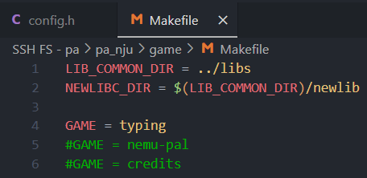
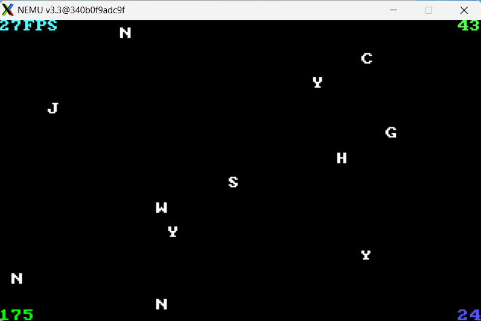
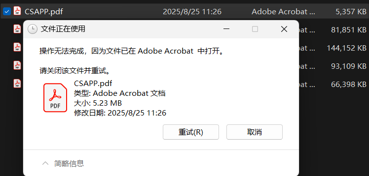
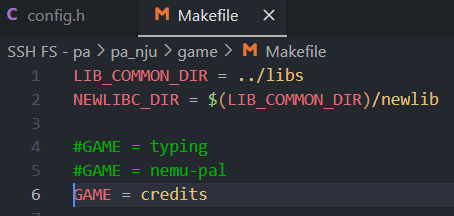
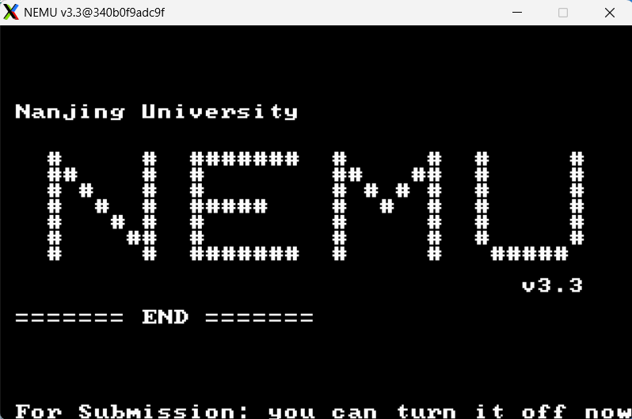

# PA4-3 note

Bonus PA，实现了有奖励，不实现没有惩罚

两个主要任务：

1- 完善 NEMU 的简易文件系统

2- 实现 NEMU_PAL 的 NEMU 架构移植

---

首先检验一下我们一直以来的实现是否正确



如果一直以来的实现正确的话，现在我们可以打开并游玩第一个游戏文件：打字游戏

```c
> make test_pa-4-3
```




## 简易文件系统

这里只考虑磁盘文件系统，为访问磁盘数据构造一个更简易的上层抽象

> *不要被"文件系统"四个字吓到了, 我们需要实现的文件系统并不是那么复杂, 这得益于NEMU-PAL的一些特性: 对于大部分数据文件来说, NEMU-PAL只会读取它们, 而不会对它们进行修改; 唯一有可能进行文件写操作的, 就只有保存游戏进度, 但游戏存档的大小是固定的. 因此我们得出了一个重要的结论: 我们需要实现的文件系统中, 所有文件的大小都是固定的. 既然文件大小是固定的, 我们自然也可以把每一个文件分别固定在磁盘中的某一个位置. 这些很好的特性大大降低了文件系统的实现难度, 当然, 真实的文件系统远远比这个简易文件系统复杂.*

首先我们需要构建“单个文件”的抽象，一个最简化的实现是：我们只记录其名称，大小，和在磁盘上的地址偏移值（起始位置）

```c
typedef struct
{
	char *name;
	uint32_t size;
	uint32_t disk_offset;
} file_info;
```

定义文件之后，接下来定义文件数组，即“文件夹”：

```c
static const file_info file_table[] = {
	{"1.rpg", 188864, 1048576}, {"2.rpg", 188864, 1237440}, ... , {"credits_bgm.wav", 6631340, 1048576},
};
```

在运行一个多文件程序的时候，我们要对不同的文件进行一些运行时状态的动态信息记录，比如记录一个文件的打开状态，以及读写位置的指针（软件会对文件进行读写操作），这一记录是很有必要的，比如：



NEMU 中也给出了动态信息的结构体：

```c
typedef struct
{
	bool used;			// 文件的使用态
	uint32_t index;		// 是文件索引（什么情况下我需要文件索引呢？）
	uint32_t offset;	// 读写指针
} Fstate;
```

和文件夹不同的是，`Fstate files[NR_FILES + 3];` 其多出三个结构体，分别记录 ` stdin ` ` stdout ` ` stderr `三个“特殊的文件”的状态，因而磁盘中的第 `k` 个文件固定使用第 `k + 3` 个 `Fstate` 结构

现在所有的前置内容都已经构建完毕，我们实现文件操作函数：

??? tip "`man 2 <func>` 一下你会知道，文件操作函数在操作失败时返回 `-1`，理论上来说直接 `assert` 也可以"

    如果不清楚某个函数的返回值情况那就 `man` 一下吧

先从 `fs_open` 开始，这里针对 `index` 的使用给出两种方案

```c
// 第一种方案：files 和 file_table 不形成一一映射关系，被打开文件的信息尽可能靠前存入 files 数组（跳过前三个元素），此时 files[j].index = i; 是有必要的
int fs_open(const char *pathname, int flags)
{
	for(int i = 0; i < NR_FILES; i++) {
		if(strcmp(pathname, file_table[i].name) == 0) {
			for(int j = 3; j < NR_FILES + 3; j++) {
				if(!files[j].used) {
					files[j].used = true;
					files[j].index = i;
					files[j].offset = 0;
					return j;
				}
			}
		}
	}
}

// 第二种方案：因为 NR_FILES 设计为与 file_table 等长，我可以直接考虑一一映射，第 i 个文件在被打开时修改 files 的第 i+3 个元素
int fs_open(const char *pathname, int flags)
{
	for(int i = 0; i < NR_FILES; i++) {
		if(strcmp(pathname, file_table[i].name) == 0) {
            i += 3;
			files[i].used = true;
			files[i].index = i;		// nosense
			files[i].offset = 0;
			return i;
		}
	}
}
```

??? question "你发现第二种方案的问题了吗？"

    第二种方案不支持文件的**重复**打开，并且有些内存浪费

（上面的实现记得在文件 not found 的时候调用 `assertion`，这是手册的要求）

同理你可以实现 `fs_close` 函数

```c
int fs_close(int fd)
{
    assert((fd < 3 || fd >= NR_FILES + 3) && "fs_close denied");

	files[fd].used = false;
    // 其他的数据可以不清除（
}
```

`fs_read` 函数

用 `ide_read` 函数读取内容，记得更新 `offset`

```c
size_t fs_read(int fd, void *buf, size_t len)
{
	assert(fd > 2 && fd < NR_FILES + 3 && files[fd].used && "fs_read denied");
	
    // from files[] to file_table
    const file_info *file = &file_table[files[fd].index];
    
    // restrict the read length
    // min is undefined
    size_t limitl = file->size - files[fd].offset;
    if (len > limitl) {
        len = limitl;
    }

    ide_read(buf, file->disk_offset + files[fd].offset, len);

	files[fd].offset += len;
    return len;
}
```

`fs_lseek` 函数：移动文件的读写指针位置，用于随机访问文件

whence 表示三种定位方式：

- `SEEK_SET`：从文件开头计算偏移
- `SEEK_CUR`：从当前位置计算偏移
- `SEEK_END`：从文件末尾计算偏移

```c
enum
{
	SEEK_SET,
	SEEK_CUR,
	SEEK_END
};

off_t fs_lseek(int fd, off_t offset, int whence)
{
    assert(fd > 2 && fd < NR_FILES + 3 && files[fd].used && "fs_lseek denied");
    
    const file_info *file = &file_table[files[fd].index];
    
    off_t new_offset;

    switch (whence) {
        case SEEK_SET:
            new_offset = offset;
            break;
        case SEEK_CUR:
            new_offset = files[fd].offset + offset;
            break;
        case SEEK_END:
            new_offset = file->size + offset;
            break;
        default:
            return -1;
    }
    
    // check
    assert(new_offset >= 0 && new_offset <= file->size);

    files[fd].offset = new_offset;
    return new_offset;
}
```


如果你正确实现了文件系统，你就可以看到 NEMU 结算画面了！



```c
> make test_pa-4-3
```



完结撒花程序中播放的音乐为 [Good Night - Siobhan Dakay/My Vanilla World](https://music.163.com/#/song?id=1442752090)，NEMU 中存放的音频文件为没有文件头的纯 PCM 音频，想打开音频文件的话你可以自己加 WAV 头，或者找一个 PCM opener（16000Hz，在 `audio.h` 定义）

这首歌冷门到评论区全是 NJUer 完结撒花的评论，怎么找到这首歌的（？）

## 移植 NEMU-PAL

<del>我移植游戏，真的假的？</del>

把一大段手册的内容喂给 AI 总结，让 AI 概括

??? quote "AI 的回答"

    根据你的描述，将仙剑奇侠传移植到NEMU中的主要工作可以分为以下几个具体任务：
    
    1- 配置和准备工作
    
    修改game/Makefile中的GAME变量，从打字小游戏切换到NEMU-PAL
    
    将仙剑奇侠传的数据文件放置在game/src/nemu-pal/data目录下
    
    确保理解打字小游戏的工作方式作为基础
    
    2- 时钟相关API移植
    
    文件： game/src/nemu-pal/hal/timer.c (可能还有其他相关文件)
    
    需要实现的函数：
    
    SDL_GetTicks() - 返回毫秒表示的当前时间
    
    SDL_Delay() - 延迟若干毫秒
    
    利用jiffy变量（时钟中断次数）来实现上述功能
    
    3- 键盘相关API移植
    
    文件： game/src/nemu-pal/hal/keyboard.c
    
    需要完成的工作：
    
    在keyboard_event()中断处理函数中：
    
    根据键盘控制器得到的扫描码记录按键状态
    
    屏蔽"重复按键"特性，提供"非重复按键"特性
    
    实现process_keys()函数：
    
    被NEMU-PAL轮询调用
    
    寻找刚刚按下或释放的按键
    
    调用相应的回调函数
    
    改变按键状态
    
    找到按键返回true，否则返回false
    
    返回前打开中断
    
    可以使用提供的数组方式或其他方式记录按键状态
    
    4- 显示相关API移植
    
    文件： game/src/nemu-pal/hal/video.c
    
    需要了解和实现的结构体和函数：
    
    结构体：
    
    SDL_Surface - 显示表面
    
    SDL_Rect - 矩形区域
    
    函数：
    
    SDL_BlitSurface() - 表面复制
    
    SDL_FillRect() - 矩形填充
    
    SDL_UpdateRect() - 更新显示区域
    
    准备工作：
    
    使用man命令查阅上述结构体和函数的功能
    
    阅读game/src/nemu-pal/include/hal.h中的结构体定义
    
    了解相关成员的功能
    
    忽略"锁"等不必要特性

在 `/game/src/nemu-pal/hal` 中我们可以看到需要移植的三个 C 程序，我们依次进行：

### timer.c

```c hl_lines="39 45"
// From /game/src/nemu-pal/include/hal.h
// HZ 表示“每秒钟系统会产生多少次 tick”
#define HZ 100
//

#include "hal.h"
// jiffy 记录了时钟中断到来的次数，也就是自程序启动以来的 tick 总数
// 每次 tick 都对应一次事件触发 timer_event
// 如果你不理解什么是 tick，可以看 https://minecraft.wiki/w/Tick （我认真的）
static volatile uint32_t jiffy = 0;
// fps 帧率，即每秒绘制次数
static int fps = 0;
// nr_draw 记录当前时间段内的绘制次数，用于计算 fps
static int nr_draw = 0;

// 自增 nr_draw
void incr_nr_draw(void){
	nr_draw++;
}

// get fps
int get_fps(){
	return fps;
}

// 一次时钟事件
void timer_event(void){
	jiffy++;
	if (jiffy % (HZ / 2) == 0)
	{
		fps = nr_draw * 2 + 1;
		nr_draw = 0;
	}
}

/* TODO: Finish the following two funcs */

// 用于返回用毫秒表示的当前时间(从运行游戏时开始计算)
uint32_t SDL_GetTicks(){
    // 1 tick = 1000 (ms) ÷ HZ (tick/ms)
	return jiffy * (1000 / HZ);
}

// 用于延迟若干毫秒
void SDL_Delay(uint32_t ms){
    // 先获取当前的时间刻
	uint32_t now = SDL_GetTicks();
    // 然后等待延迟
    while(SDL_GetTicks() < now + ms);	// 注意 ';'
}
```

### keyboard.c

```c hl_lines="82"
#include "hal.h"

#define NR_KEYS 18

// 四个按键状态
enum
{
	KEY_STATE_EMPTY,			// 未按下
	KEY_STATE_WAIT_RELEASE,		// 按下了但是还没有释放
	KEY_STATE_RELEASE,			// 释放瞬间
	KEY_STATE_PRESS				// 按下瞬间
};

// 键盘映射
// 对应的哈希值在 hal.h 里有
static const int keycode_hash[] = {
	K_UP, K_DOWN, K_LEFT, K_RIGHT, K_ESCAPE,
	K_RETURN, K_SPACE, K_PAGEUP, K_PAGEDOWN, K_r,
	K_a, K_d, K_e, K_w, K_q,
	K_s, K_f, K_p};

// 为用到的按键建立一个状态数组
static int key_state[NR_KEYS];

// 按键事件
void keyboard_event(void)
{
	uint32_t code = in_byte(0x60);
	uint32_t keycode = code & 0x7f;
	int i;
	for (i = 0; i < NR_KEYS; i++)
	{
		if (keycode_hash[i] == keycode)
		{
			if (code & 0x80)
			{
				key_state[i] = KEY_STATE_RELEASE;
			}
			else if (key_state[i] == KEY_STATE_EMPTY)
			{
				key_state[i] = KEY_STATE_PRESS;
			}
		}
	}
}

// 获得指定案件的键映射码
int get_keycode(int index)
{
	assert(index >= 0 && index < NR_KEYS);
	return keycode_hash[index];
}

// 查询指定按键的状态
int query_key(int index)
{
	assert(index >= 0 && index < NR_KEYS);
	return key_state[index];
}

// 将指定按键的状态设置为“按下待释放”
void release_key(int index)
{
	assert(index >= 0 && index < NR_KEYS);
	key_state[index] = KEY_STATE_WAIT_RELEASE;
}

// 清空指定按键的状态（设置为“未按下”）
void clear_key(int index)
{
	assert(index >= 0 && index < NR_KEYS);
	key_state[index] = KEY_STATE_EMPTY;
}

/* TODO: Traverse the key states. Find a key just pressed or released.
	 * If a pressed key is found, call `key_press_callback' with the keycode.
	 * If a released key is found, call `key_release_callback' with the keycode.
	 * If any such key is found, the function return true.
	 * If no such key is found, the function return false.
	 * Remember to enable interrupts before returning from the function.
	 */
bool process_keys(void (*key_press_callback)(int), void (*key_release_callback)(int))
{
    bool res = false;
    
	cli();	// 关中断
	
    for(int i = 0; i < NR_KEYS; i++){
		int keycode = get_keycode(i);
        int state = query_key(i);
        
        if(state == KEY_STATE_PRESS){
            key_press_callback(keycode);
            release_key(i);
            res = true;
        }
        else if(state == KEY_STATE_RELEASE){
            key_release_callback(keycode);
			clear_key(i);
            res = true;
        }
    }

	sti();	// 开中断
	return res;
}

```

### video.c(with video.h)

??? quote "实现前的原文件"

    ```c
    /* video h. */
    #ifndef __DEVICE_VIDEO_H__
    #define __DEVICE_VIDEO_H__
    
    #include "common.h"
    
    #define SCR_WIDTH 320
    #define SCR_HEIGHT 200
    #define SCR_SIZE ((SCR_WIDTH) * (SCR_HEIGHT))
    #define VMEM_ADDR ((uint8_t *)0xA0000)
    
    extern uint8_t *vmem;
    
    static inline void
    draw_pixel(int x, int y, int color)
    {
    	assert(x >= 0 && y >= 0 && x < SCR_HEIGHT && y < SCR_WIDTH);
    	vmem[(x << 8) + (x << 6) + y] = color;
    }
    
    void prepare_buffer(void);
    void display_buffer(void);
    
    void draw_string(const char *, int, int, int);
    #endif
    
    /* video.c */
    
    #include "hal.h"
    #include "device/video.h"
    #include "device/palette.h"
    
    #include <string.h>
    #include <stdlib.h>
    
    int get_fps();
    
    void SDL_BlitSurface(SDL_Surface *src, SDL_Rect *srcrect,
                         SDL_Surface *dst, SDL_Rect *dstrect)
    {
        assert(dst && src);
    
        //int sx = (srcrect == NULL ? 0 : srcrect->x);
        //int sy = (srcrect == NULL ? 0 : srcrect->y);
        //int dx = (dstrect == NULL ? 0 : dstrect->x);
        //int dy = (dstrect == NULL ? 0 : dstrect->y);
        //int w = (srcrect == NULL ? src->w : srcrect->w);
        //int h = (srcrect == NULL ? src->h : srcrect->h);
        //if(dst->w - dx < w) { w = dst->w - dx; }
        //if(dst->h - dy < h) { h = dst->h - dy; }
        //if(dstrect != NULL) {
        //	dstrect->w = w;
        //	dstrect->h = h;
        //}
    
        /* TODO: copy pixels from position (`sx', `sy') with size
         * `w' X `h' of `src' surface to position (`dx', `dy') of
         * `dst' surface.
         */
    
        assert(0);
    }
    
    void SDL_FillRect(SDL_Surface *dst, SDL_Rect *dstrect, uint32_t color)
    {
        assert(dst);
        assert(color <= 0xff);
    
        /* TODO: Fill the rectangle area described by `dstrect'
         * in surface `dst' with color `color'. If dstrect is
         * NULL, fill the whole surface.
         */
    
        assert(0);
    }
    
    void SDL_SetPalette(SDL_Surface *s, int flags, SDL_Color *colors,
                        int firstcolor, int ncolors)
    {
        assert(s);
        assert(s->format);
        assert(s->format->palette);
        assert(firstcolor == 0);
    
        if (s->format->palette->colors == NULL || s->format->palette->ncolors != ncolors)
        {
            if (s->format->palette->ncolors != ncolors && s->format->palette->colors != NULL)
            {
                /* If the size of the new palette is different 
                 * from the old one, free the old one.
                 */
                free(s->format->palette->colors);
            }
    
            /* Get new memory space to store the new palette. */
            s->format->palette->colors = malloc(sizeof(SDL_Color) * ncolors);
            assert(s->format->palette->colors);
        }
    
        /* Set the new palette. */
        s->format->palette->ncolors = ncolors;
        memcpy(s->format->palette->colors, colors, sizeof(SDL_Color) * ncolors);
    
        if (s->flags & SDL_HWSURFACE)
        {
            /* TODO: Set the VGA palette by calling write_palette(). */
            assert(0);
        }
    }
    
    /* ======== The following functions are already implemented. ======== */
    
    void SDL_UpdateRect(SDL_Surface *screen, int x, int y, int w, int h)
    {
        assert(screen);
        assert(screen->pitch == 320);
    
        // this should always be true in NEMU-PAL
        assert(screen->flags & SDL_HWSURFACE);
    
        if (x == 0 && y == 0)
        {
            /* Draw FPS */
            vmem = VMEM_ADDR;
            char buf[80];
            sprintf(buf, "%dFPS", get_fps());
            draw_string(buf, 0, 0, 10);
        }
    }
    
    void SDL_SoftStretch(SDL_Surface *src, SDL_Rect *srcrect,
                         SDL_Surface *dst, SDL_Rect *dstrect)
    {
        assert(src && dst);
        int x = (srcrect == NULL ? 0 : srcrect->x);
        int y = (srcrect == NULL ? 0 : srcrect->y);
        int w = (srcrect == NULL ? src->w : srcrect->w);
        int h = (srcrect == NULL ? src->h : srcrect->h);
    
        assert(dstrect);
        if (w == dstrect->w && h == dstrect->h)
        {
            /* The source rectangle and the destination rectangle
             * are of the same size. If that is the case, there
             * is no need to stretch, just copy. */
            SDL_Rect rect;
            rect.x = x;
            rect.y = y;
            rect.w = w;
            rect.h = h;
            SDL_BlitSurface(src, &rect, dst, dstrect);
        }
        else
        {
            /* No other case occurs in NEMU-PAL. */
            assert(0);
        }
    }
    
    SDL_Surface *SDL_CreateRGBSurface(uint32_t flags, int width, int height, int depth,
                                      uint32_t Rmask, uint32_t Gmask, uint32_t Bmask, uint32_t Amask)
    {
        SDL_Surface *s = malloc(sizeof(SDL_Surface));
        assert(s);
        s->format = malloc(sizeof(SDL_PixelFormat));
        assert(s);
        s->format->palette = malloc(sizeof(SDL_Palette));
        assert(s->format->palette);
        s->format->palette->colors = NULL;
    
        s->format->BitsPerPixel = depth;
    
        s->flags = flags;
        s->w = width;
        s->h = height;
        s->pitch = (width * depth) >> 3;
        s->pixels = (flags & SDL_HWSURFACE ? (void *)VMEM_ADDR : malloc(s->pitch * height));
        assert(s->pixels);
    
        return s;
    }
    
    SDL_Surface *SDL_SetVideoMode(int width, int height, int bpp, uint32_t flags)
    {
        return SDL_CreateRGBSurface(flags, width, height, bpp,
                                    0x000000ff, 0x0000ff00, 0x00ff0000, 0xff000000);
    }
    
    void SDL_FreeSurface(SDL_Surface *s)
    {
        if (s != NULL)
        {
            if (s->format != NULL)
            {
                if (s->format->palette != NULL)
                {
                    if (s->format->palette->colors != NULL)
                    {
                        free(s->format->palette->colors);
                    }
                    free(s->format->palette);
                }
    
                free(s->format);
            }
    
            if (s->pixels != NULL && s->pixels != VMEM_ADDR)
            {
                free(s->pixels);
            }
    
            free(s);
        }
    }
    ```

内容很多，先看 `video.h`，定义了屏幕显示的相关参数，以及一个最基本的像素绘制函数，将内存的访问进行了上层封装：

```c
static inline void
draw_pixel(int x, int y, int color)
{
	assert(x >= 0 && y >= 0 && x < SCR_HEIGHT && y < SCR_WIDTH);
	vmem[(x << 8) + (x << 6) + y] = color;	// vmem[320*x + y] = color
    										// u know SCR_WIDTH = 320
}
```

**遇到一些陌生的结构体请参考 `hal.h`**

接下来是 `video.c`：这里需要实现一些图形函数：

#### SDL_BlitSurface()

Ref：[SDL3/SDL_BlitSurface - SDL Wiki](https://wiki.libsdl.org/SDL3/SDL_BlitSurface)

表面块传输，将源表面的一个矩形区域复制到目标表面的指定位置

```c
void SDL_BlitSurface(SDL_Surface *src, SDL_Rect *srcrect,
                     SDL_Surface *dst, SDL_Rect *dstrect)
{
    assert(dst && src);

    //int sx = (srcrect == NULL ? 0 : srcrect->x);
    //int sy = (srcrect == NULL ? 0 : srcrect->y);
    //int dx = (dstrect == NULL ? 0 : dstrect->x);
    //int dy = (dstrect == NULL ? 0 : dstrect->y);
    //int w = (srcrect == NULL ? src->w : srcrect->w);
    //int h = (srcrect == NULL ? src->h : srcrect->h);
    //if(dst->w - dx < w) { w = dst->w - dx; }
    //if(dst->h - dy < h) { h = dst->h - dy; }
    //if(dstrect != NULL) {
    //	dstrect->w = w;
    //	dstrect->h = h;
    //}

    /* TODO: copy pixels from position (`sx', `sy') with size
     * `w' X `h' of `src' surface to position (`dx', `dy') of
     * `dst' surface.
     */

    assert(0);
}
```

这里有很多注释，这些注释其实提供了一部分内容

```c
// src_x: 源表面矩形的 x 坐标
int sx = (srcrect == NULL ? 0 : srcrect->x);
// src_y
int sy = (srcrect == NULL ? 0 : srcrect->y);
// dst_x: 目标表面矩形的 x 坐标
int dx = (dstrect == NULL ? 0 : dstrect->x);
// dst_y
int dy = (dstrect == NULL ? 0 : dstrect->y);
// width: 需要复制的宽度
int w = (srcrect == NULL ? src->w : srcrect->w);
// height
int h = (srcrect == NULL ? src->h : srcrect->h);
// barrier check
if(dst->w - dx < w) { w = dst->w - dx; }
if(dst->h - dy < h) { h = dst->h - dy; }

// update the size
if(dstrect != NULL) {
    	dstrect->w = w;
    	dstrect->h = h;
}
```

不难发现这些注释实现了函数的前半部分，而我现在需要做的就是补齐后半部分，进行逐个 pixel 的拷贝操作

```c
void SDL_BlitSurface(SDL_Surface *src, SDL_Rect *srcrect,
                     SDL_Surface *dst, SDL_Rect *dstrect)
{
    assert(dst && src);

    // 把注释部分解除注释
    // 这里有个优化：直接 memcpy 复制整行，会快很多
    for(int i = 0; i < h; i++){
        for(int j = 0; j < w; j++){
            // 计算源像素 && 目标像素的位置
        	int src_ofst = (sy + i) * src-> w + dx + j;
        	int dst_ofst = (dy + i) * dst-> w + sx + j;
            // copy
            dst->pixels[dst_ofst] = src->pixels[src_ofst];
        }
    }
}
```

####SDL_FillRect()

Ref：[SDL2/SDL_FillRect - SDL2 Wiki](https://wiki.libsdl.org/SDL2/SDL_FillRect)

矩形区域填充，用指定的颜色填充指定表面的一个矩形区域

eg. `SDL_FillRect(screen, NULL, 0x000000);` 用黑色填充整个屏幕

```c
// typedef struct
// {
// 	int16_t x, y;
// 	uint16_t w, h;
// } SDL_Rect;

void SDL_FillRect(SDL_Surface *dst, SDL_Rect *dstrect, uint32_t color)
{
	assert(dst);
	assert(color <= 0xff);

	/* TODO: Fill the rectangle area described by `dstrect'
	 * in surface `dst' with color `color'. If dstrect is
	 * NULL, fill the whole surface.
	 */

	assert(0);
}
```

仿照上一个函数，直接给出实现

```c
void SDL_FillRect(SDL_Surface *dst, SDL_Rect *dstrect, uint32_t color)
{
	assert(dst);
	assert(color <= 0xff);
	
	int dx = (dstrect == NULL ? 0 : dstrect->x);
	int dy = (dstrect == NULL ? 0 : dstrect->y);
	int w = (dstrect == NULL ? dst->w : dstrect->w);
	int h = (dstrect == NULL ? dst->h : dstrect->h);
	if(dst->w - dx < w) { w = dst->w - dx; }
	if(dst->h - dy < h) { h = dst->h - dy; }
	if(dstrect != NULL) {
		dstrect->w = w;
		dstrect->h = h;
	}

    // 也可以优化
	for(int i = 0; i < h; i++){
		for(int j = 0; j < w; j++){
			dst->pixels[(dy + i) * dst-> w + dx + j] = color;
        }
    }
}
```

####SDL_SetPalette()

Ref：[SDL_SetPalette](https://www.libsdl.org/release/SDL-1.2.15/docs/html/sdlsetpalette.html)

为 8 位表面的调色板设置颜色

*在 SDL 中，8 位表面并不是直接存储颜色值，而是存储 **颜色索引**，这些索引指向调色板中定义的具体颜色。通过改变调色板内容，可以在不修改像素数据的情况下，**动态改变屏幕显示的颜色效果**（例如：闪烁、渐变、淡入淡出）*

已经给出了大部分实现，待实现的函数只有一行，所以一并给出：

```c
// 五个参数的作用依次是：指定表面；指定修改的调色板的类型；指向 SDL_Color 的指针（新颜色值）；其实调色板索引；修改的颜色数量
void SDL_SetPalette(SDL_Surface *s, int flags, SDL_Color *colors,
					int firstcolor, int ncolors)
{
    // 入口参数相关的断言
	assert(s);
	assert(s->format);
	assert(s->format->palette);
	assert(firstcolor == 0);

    // 检查调色板的数量和颜色是否 valid
	if (s->format->palette->colors == NULL || s->format->palette->ncolors != ncolors)
	{
		if (s->format->palette->ncolors != ncolors && s->format->palette->colors != NULL)
		{
			/* If the size of the new palette is different 
			 * from the old one, free the old one.
			 */
			free(s->format->palette->colors);
		}

		/* Get new memory space to store the new palette. */
		s->format->palette->colors = malloc(sizeof(SDL_Color) * ncolors);
		assert(s->format->palette->colors);
	}

	/* Set the new palette. */
	s->format->palette->ncolors = ncolors;
	memcpy(s->format->palette->colors, colors, sizeof(SDL_Color) * ncolors);

    // 如果是“硬件表面”，就进行硬件操作
	if (s->flags & SDL_HWSURFACE)
	{
		/* TODO: Set the VGA palette by calling write_palette(). */
        write_palette(colors, ncolors);
	}
}
```

