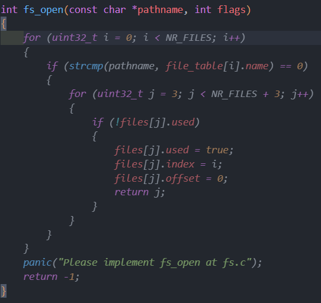

# Things you should understand first 🫵

> From [常见问题(FAQ) · GitBook](https://nju-projectn.github.io/ics-pa-gitbook/ics2025/FAQ.html)
> 
> *现在是开源的时代, 开源在《十四五规划和2035年远景目标纲要》中首次被列入国家发展规划, 那我为什么不能参考别人的代码/心得/攻略来学习*
> 
> 你来上课来做实验, 就应该接受我们设置的训练, 而独立完成实验是训练最基本的要求之一, 参考别人代码就是违反[学术诚信](http://integrity.mit.edu/)的行为, 针对这一点你没有任何理由讨价还价.
> 
> 就算退一万步来讲, 你说参考别人是为了学习, 那你能写出比别人更好的代码作为学习的成果吗? 你要是真有这样的学习能力, 相信你也能够在遵守[学术诚信](http://integrity.mit.edu/)的前提下自己独立完成实验.
> 
> 同理, 阅读网上流传的心得和攻略, 也是属于违反[学术诚信](http://integrity.mit.edu/)的行为, 因为你没有通过自己的努力和预期的训练来获得正确的答案.
> 
> *为什么不能把代码/心得/攻略上传到公开的地方让大家学习*
> 
> 因为这违反了[学术诚信](http://integrity.mit.edu/). PA和其它项目不一样, 它本质上是一个课程作业, 你无法保证来看你代码的同学都是抱着纯洁的学习心态(我就看看我不抄). 如果有同学抱着抄袭的心态, 你的代码不仅会让他失去锻炼的机会, 而且还会破坏课程的公平性: 你一个bug调3天, 你同学1分钟就抄完了, 你甘心吗?
> 
> 此外, 我们相信你的代码里面并没有太多值得大家学习的地方, 比如你的代码风格好看吗? 你设计的API合理吗? 和框架代码相比有什么新特色吗? 在你推荐自己的代码之前, 可以先看看一些优秀的开源项目. 如果你确实对自己的代码有信心, 不妨给yzh提建议, 如果你的建议很不错, 我们会把你加入到感谢名单中, 同时你的改进也可以一直在学弟学妹的作业中流传.
> 
> 如果你上传代码只是为了托管, 那可以选择github的私人仓库.
> 
> 同理, 将自己的心得和攻略上传到公开的地方, 也是属于违反[学术诚信](http://integrity.mit.edu/)的行为.
> 
> 所以, 你公开的代码/心得/攻略很大概率并不能从真正的意义上帮助大家学习, 相反而是在很多层面上伤害大家.

!!! failure "考虑一些因素，目前闭源笔记"

由此可见，你能找到这里，如果你接下来想继续往下看的话，那你违反了[学术诚信](http://integrity.mit.edu/)

而我把我的笔记放在这里也违反了[学术诚信](http://integrity.mit.edu/)

我为什么在这里贴上我的笔记？我也不知道，但是我个人认为：

1- 这份笔记和 PA 的代码实现是同步完成的（甚至是先写完笔记后补上代码实现），我希望记录下我实现 PA 的痕迹，而这里（指这个 Blog）就是我存放我的笔记的最好的地方。除非你翻过我的 Github，或者和我比较熟，你应该不会找到这里

2- 如果你是为了完成 PA 任务而来的话，你应该找一份“圣遗物”，或是直接 copy，或是让 LLM 详细的向你解释一遍，然后你“恍然大悟”，最终还是*凭借自己的努力*完成了 PA，这比看我的这个随手写的笔记高效得多。

   *后记：做 PA 4-3 前忘记关 copilot 了，我忽然发现 copilot 的训练集里有“圣遗物”，忽然蹦出来的代码震撼我一整年，截了一张图片放在最后*

   **所以你更没必要为了完成 PA 来到我这里了**

3- 如果你是搜索引擎搜关键词搜到了这里（真的会吗？）：

--- 1) 如果你想将 ICS-PA 作为课外任务（比如你没有这门课但是你想自己做），你可以看看这个菜鸡的笔记，大概了解一下你在 ICS-PA 中要完成什么任务

--- 2) 如果 ICS-PA 是你的作业，我建议你只看 PA0，而不要再去看后面的部分，原因上面说的也很明白了

4- 一开始我尽可能的克制在笔记中直接放代码实现，但是后来我意识到这对自己和对一些人都无益。你可以理解为一种 “心照不宣”，总之我在之后的笔记中都不会刻意不写出代码实现，这对我的笔记完整性也是很必要的

5- 你可以保证自己会抱着纯粹的学习的名义打开你不应该打开的东西吗？我自己不能保证。

---

附录：

copilot 真的很强大，同时也很呆

我个人的建议是关掉 copilot，它会取代你的思考

