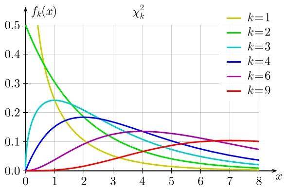
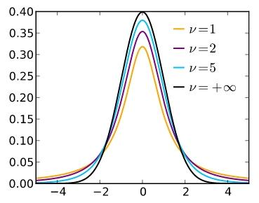
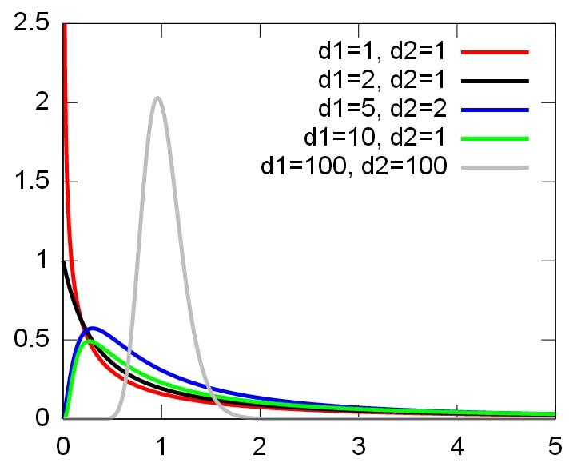
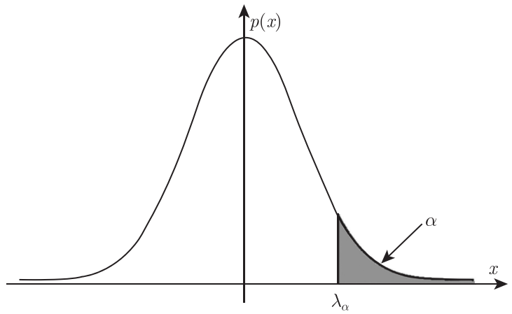

# 第六章 统计量与抽样分布

## 基础概念

在数理统计中，我们将所研究的对象的全体称为总体，而将总体中每个成员称为个体。

如果一个总体所包含的个体数量是有限的，则称之为有限总体，如果总体所包含的个体数量是无限的，则称之为无限总体（通常会将很大的有限总体近似看作无限总体，将总体分布取成连续型分布）

为了对总体 $X$ 进行研究，通常要从总体中随机地抽取一些个体，这些个体就称为样本。抽得样本的过程称为抽样。样本中个体的数量称为样本容量。设对总体进行了 $n$ 次观测，得到一组数据 $(x_1, x_2, \cdots, x_n)$。我们称这组数据为样本观察值或样本值

样本具有二重性：样本观察值是确定的，因此样本有具体数的属性；样本受随机因素的影响，因此样本有随机变量的属性。在具体计算中，我们通常将样本看成一组数，通常用小写字母表示，记为 $(x_1, x_2, \cdots, x_n)$。而在考虑一般问题时，我们谈到样本，往往将其看做一组随机变量，通常用大写字母表示，记为 $(X_1, X_2, \cdots, X_n)$ 

对于 $(X_1, X_2, \cdots, X_n)$，我们对随机分布有以下要求：

(1) 代表性：样本能够代表总体.也就是说，样本的每个分量 $X_i$; 与总体 $X$ 具有相同的分布。

(2) 独立性：$X_1, X_2, \cdots, X_n$ 为相互独立的随机变量。

满足上述两点性质的样本称为简单随机样本，也简称为样本。之后的“样本”都默认指简单随机样本。（和之前的“独立同分布随机变量序列”定义在数学描述上相同）

 

## 样本统计与分布

### 统计量

对于总体 $X$ 的一个样本 $(X_1, X_2, \cdots, X_n)$，$T(x_1, x_2, \cdots, x_n)$ 为不含任何位置参数的函数，则称 $T(X_1, X_2, \cdots, X_n)$ 为一个统计量。一句话来说就是，统计量是样本的函数，不含任何未知量。统计量只需要样本即可计算出

常见的统计量包含：

- 样本均值 $\overline{X} = \dfrac{1}{n} \displaystyle \sum _{i=1}^n X_i$

- 样本方差 $S^2 = \dfrac{1}{n-1} \displaystyle \sum_{i=1}^n (X_i - \overline{X})^2$，样本标准差 $S = \sqrt{\dfrac{1}{n-1} \displaystyle \sum_{i=1}^n (X_i - \overline{X})^2}$

（这样定义的样本方差具有无偏性，和样本二阶中心矩 $S^{*2}\text{ or } B_2$ 不同，这点之后会说）

- 样本 $k$ 阶原点矩 $A_k = \dfrac{1}{n} \displaystyle \sum _{i=1}^n X_i^k$，样本均值就是样本一阶原点矩
- 样本 $k$ 阶中心矩 $B_k = \dfrac{1}{n} \displaystyle \sum _{i=1}^n (X_i-\overline{X})^k$
- 样本相关系数 $r=\dfrac{S_{XY}}{S_{X}^{\ast}\cdot S_{Y}^{\ast}}$

 

### 抽样分布

统计量的分布称为抽样分布，由中心极限定理可知：不管总体分布如何，样本均值 $\overline{X}$ 近似地服从均值为 $\mu$，方差为 $\dfrac{\sigma^2}{n}$ 的正态分布

$\dfrac{\sum_{k=1}^{n} X_k - n \mu}{\sqrt{n}\sigma} = Y_n \sim N(0,1) \longrightarrow\sum_{k=1}^n X_k \sim N(n\mu, n\sigma ^2) \longrightarrow \overline{X} \sim N\left( \mu, \dfrac{\sigma^2}{n}\right)$

 

## 正态总体

根据中心极限定理得到的结论，总体分布的样本均值可近似服从正态分布。现在我们给出正态总体的定义，其总体分布**精确**服从正态分布：$X \sim N(\mu, \sigma^2)$

先给出三种著名分布：

### $\chi^2$ 分布

设 $X_1, X_2, \cdots, X_n$ 为独立同分布的随机变量，且均服从标准正态分布 $N(0,1)$，则

$$
\chi_n^2 = \sum_{i=1}^n X_i^2
$$
为服从自由度为 $n$ 的 $\chi^2$ 分布，记为 $\chi^2_n \sim \chi ^2(n)$，其密度函数为：

$$
p(x) = \dfrac{1}{2^{\frac{n}{2}}\Gamma(\frac{n}{2})} e^{-\frac{x}{2}}x^{\frac{n}{2}-1} , \quad x > 0
$$
其中 Gamma 函数：$$\Gamma(k) = \int_0^\infty t^{k-1}e^{-t}dt$$

??? quote "给出不同自由度下的分布图像"

    

$\chi^2$ 分布具有一些相关性质：

1- 可加性：$X \sim \chi^2(m),\;Y \sim \chi^2(n)$，若 $X,Y$ 相互独立，则 $X+Y \sim \chi^2(m+n)$

2- 对于 $X \sim \chi^2(n)$，$E(X) = n,\;D(X) = 2n$

3- 科赫伦分解定理：

设 $X_1, X_2, \cdots, X_n$ 为独立同分布的随机变量，且均服从标准正态分布，另设 $Q_1, Q_2, \cdots, Q_k$ 分别是秩为 $n_1, n_2, \cdots, n_k$ 的 $X_1, X_2, \cdots,X_n$ 的非负二次型，满足 $\displaystyle \sum_{i=1}^{k} Q_i = \sum_{i=1}^{n} X_i^2$

则下面两个条件等价：

- $Q_i$ 相互独立，从而分别服从自由度为 $n_i$ 的 $\chi^2$ 分布（这符合卡方分布的可加性）

- $Q_i$ 的秩的和  $\displaystyle \sum_{i=1}^{k} n_i = n$ 

???+ abstract "换种语言描述"

    标准正态变量 $X_i$ 的总平方和 $\sum_{i=1}^{n} X_i^2$ 满足卡方分布，我们现在将总平方和拆分为 $k$ 个二次型（二次型满足 $Q = X^TAX$，其中 $A$ 是对称矩阵），如果这 $k$ 个二次型的秩的和能与 $X_i$ 的维度 $n$ 相同，则这 $k$ 个二次型相互独立，并且分别服从 $n_i$ 的 $\chi^2$ 分布
    
    一句话说就是：总平方和可以分解成若干个独立分量的平方和，且分量与总平方和保持相似的性质

???+ question "从纯线性代数的语言描述"

    设 $A_1, A_2, \cdots, A_k$ 为 $n \times n$ 的实对称矩阵，如果 $\displaystyle \sum_{i=1}^{k} A_i = I_n$（单位矩阵），则以下条件等价：
    
    - $\displaystyle \sum_{i=1}^{k} \text{rank}(A_i) = n$
    - 每个 $A_i$ 都是幂等矩阵：$A_i^2 = A_i$
    - $\forall i \ne j,\; A_iA_j = 0$（也就是说 $A_i$ 空间正交）
    - $\text{rank}(A_i) = \text{trace}(A_i)$
    - $\R ^n = ⨁_{i=1}^k \text{Col} (A_i)$

 

### $\text{t}$ 分布 / Student 分布

设 $X \sim N(0,1),\;Y \sim \chi^2(n)$，且 $X$ 与 $Y$ 相互独立，则称随机变量

$$
T = \frac{X}{\sqrt{Y/n}}
$$

为服从自由度为 $n$ 的 $\text{t}$ 分布，记为 $T \sim t(n)$，其密度函数为：

$$
p(x) = \frac{\Gamma\left(\frac{n+1}{2}\right)}{\sqrt{n\pi}\,\Gamma\left(\frac{n}{2}\right)} 
\left(1 + \frac{x^2}{n}\right)^{-\frac{n+1}{2}}
$$

其中 Gamma 函数：$$\Gamma(k) = \int_0^\infty t^{k-1}e^{-t}dt$$

??? quote "给出不同自由度下的分布图像"

    

 

### $\text{F}$ 分布

设 $U \sim \chi^2(n_1),\;V \sim \chi^2(n_2)$，且 $U$ 与 $V$ 相互独立，则称随机变量

$$
F = \frac{U/n_1}{V/n_2}
$$

为服从自由度为 $(n_1,n_2)$ 的 $\text{F}$ 分布，记为 $F \sim F(n_1,n_2)$，其密度函数为：

$$
p(x) = \frac{\Gamma\left(\frac{n_1+n_2}{2}\right)}
{\Gamma\left(\frac{n_1}{2}\right)\Gamma\left(\frac{n_2}{2}\right)}
\left(\frac{n_1}{n_2}\right)^{\frac{n_1}{2}}
x^{\frac{n_1}{2} - 1}
\left(1 + \frac{n_1}{n_2}x\right)^{-\frac{n_1+n_2}{2}}, \; x > 0
$$

其中 Gamma 函数：$$\Gamma(k) = \int_0^\infty t^{k-1}e^{-t}dt$$

??? quote "给出不同自由度下的分布图像"

    

 

## 上 $\alpha$ 分位点

设 $X$ 是一个随机变量，对于 $\alpha \in (0,1)$，我们令满足 $P(X > \lambda_{\alpha}) = \alpha$ 的实数 $\lambda_{\alpha}$ 为 $X$ 的上 $\alpha$ 分位点

??? quote "给出几何意义下的图像"

    图中 $p(x)$ 为 $X$ 的密度函数，阴影部分面积为 $\alpha$
    
    

当 $X \sim N(0,1)$ 时，我们记 $\lambda_{\alpha}$ 为 $u_{\alpha}$，有 $u_{1-\alpha} = -u_{\alpha}$ 

当 $X \sim \chi^2(n)$ 时，我们记 $\lambda_{\alpha}$ 为 $\chi^2_{\alpha}(n)$

当 $X \sim t(n)$ 时，我们记 $\lambda_{\alpha}$ 为 $t_{\alpha}(n)$，有 $t_{1-\alpha}(n) = -t_{\alpha}(n)$  

当 $X \sim F(n_1,n_2)$ 时，我们记 $\lambda_{\alpha}$ 为 $F_{\alpha}(n_1,n_2)$，有 $F_{1-\alpha}(n_1,n_2) \cdot F_{\alpha}(n_2,n_1) = 1$ 

 

## 正态总体的相关分布

!!! abstract ""

    下面的内容在之后求正态总体的某个参数的置信区间时，经常作为构造枢轴变量的依据

设 $X_1, X_2, \cdots, X_n$ 是来自正态总体 $N(\mu, \sigma^2)$ 的一个样本，则

(1) $\overline{X} \sim N(\mu, \dfrac{\sigma^2}{n})$

(2) $\dfrac{(n-1)S^2}{\sigma^2}\sim \chi^2 (n-1)$

(3) $\overline{X}$ 与 $S^2$ 相互独立

一些推论：

(4) $\overline{X} \sim N(\mu, \dfrac{\sigma^2}{n}) \to \dfrac{\sqrt{n}(\overline{X}-\mu)}{\sigma} \sim N(0,1) \to {\color{orange}T =\dfrac{\sqrt{n}(\overline{X}-\mu)}{S} \sim t(n-1)}$ 

(5) 设 $X_1, X_2, \cdots, X_{n_1}$ 是来自正态总体 $N(\mu_1, \sigma_1^2)$ 的一个样本，$Y_1, Y_2, \cdots, Y_{n_2}$ 是来自正态总体 $N(\mu_2, \sigma_2^2)$ 的一个样本，两样本相互独立，样本方差分别为 $S_1, S_2$，则

$$
F = (\dfrac{S_1}{\sigma_1})^2 / (\dfrac{S_2}{\sigma_2})^2 = \dfrac{S_1^2 \sigma_2^2}{S_2^2 \sigma_1^2} \sim F(n_1 -1, n_2 - 1)
$$

(6)  设 $X_1, X_2, \cdots, X_{n_1}$ 是来自正态总体 $N(\mu_1, \sigma_1^2)$ 的一个样本，$Y_1, Y_2, \cdots, Y_{n_2}$ 是来自正态总体 $N(\mu_2, \sigma_2^2)$ 的一个样本，两样本相互独立，则

$$
T = \frac{(\bar{X} - \bar{Y}) - (\mu_1 - \mu_2)}{\sqrt{\frac{(n_1-1)S_1^2 + (n_2-1)S_2^2}{n_1 + n_2 - 2} \cdot \left( \frac{1}{n_1} + \frac{1}{n_2} \right)}} \sim t(n_1 + n_2 - 2)
$$

通常会记 $S_w = \sqrt{\dfrac{(n_1-1)S_1^2 + (n_2-1)S_2^2}{(n_1 - 1) + (n_2 - 1)}}$ 为合并标准差

