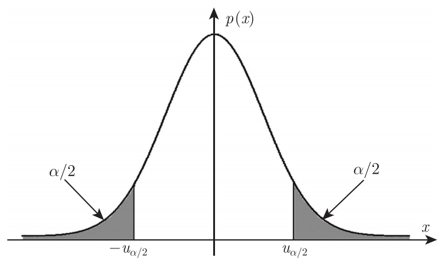

# 第八章 假设检验

## 基础概念

假设检验就是对总体的某些未知特征提出假设，并利用样本信息来推断该假设的正确性。

比如说一批产品的预期次品率 $a_0$ 应该不超过 $\alpha$，那我从产品中抽取出一部分样品，根据这部分样品的实际次品率 $\alpha_1$ 去假设这批产品是否满足次品率要求。不难发现，我们不能通过 $\alpha_1$ 的值来确定 $\alpha$ 和 $\alpha_0$ 的大小关系，但是我们可以肯定的是，$\alpha_1$ 越大，$\alpha > \alpha_0$ 的假设越可能成立，即 $\alpha \leq \alpha_0$ 的假设越不可能成立，此时我们更倾向于相信“次品率不达标”。当然，只要产品数足够大，哪怕 $\alpha_1$ 达到了 $100\%$，我们也不能断定 $\alpha > \alpha_0$

现在我们将 $\alpha \leq \alpha_0$ 称为原假设/零假设，记为 $H_0$；将 $\alpha > \alpha_0$ 称为备择假设/对立假设，记为 $H_1$。通过样本信息去判断上述假设的成立情况，这就是假设检验

如果对立假设和原假设各居一边（像上面的例子一样），则这类假设检验问题为单边检验；如果对立假设分居原假设的两边（比如 $H_0:\alpha = \alpha_0,\;H_1:\alpha \ne \alpha_0$），则这类检验问题为双边假设问题

如果假设的成立条件只包含一个点（比如 $H_0:\alpha = \alpha_0$），则称之为简单假设；如果假设的成立条件包含多个点（比如 $H_0:\alpha \leq \alpha_0$），则称之为复合假设

对于上面的例子，我们基于样本的观测数据对未知的总体参数进行检验，这属于参数假设检验；否则我们称为非参数假设检验，比如对于某产品的直径 $X$，对零假设 $ H_0:X\sim N(\mu, \sigma^2)$ 和对应的 $H_1$ 进行检验，这种属于非参数假设检验

 

## 假设检验的步骤

以对均值 $\mu$ 的估计为例：

> - 根据问题提出原假设 $H_0$ 和对立假设 $H_1$

我们的原假设是 $H_0: \mu = \mu_0$，对立假设是 $H_1: \mu \ne \mu_0$ 

> - 构造一个合适的统计量（往往由参数估计而来），并在 $H_0$ 成立的条件下推导出该统计量的分布

已知样本均值 $\overline{X}$ 是 $\mu$ 的矩估计和极大似然估计，所以适合用 $\overline{X}$ 去估计 $\mu$。

我们知道统计量的分布 $\overline{X} \sim N(\mu_0, \dfrac{\sigma ^2}{n})$

> - 给出小概率 $\alpha$，确定临界值 $k$ 和拒绝域 $W$ 

我们给出一个临界值 $k$，当 $|\overline{X} - \mu_0| \geq k$ 时，判定原假设不成立，对立假设成立。

界定这个临界值 $k$ 取决于“我们对假设有多大的把握度”，也即“我们有 $\alpha$ 的把握可以判断假设不成立”：

$$
P(|\overline{X} - \mu_0| \geq k) = \alpha
$$

对于上面的例子，我们利用标准化变量进行解答：

$$
P\left( \left|\frac{\overline{X} - \mu_0}{\sigma / \sqrt{n}}\right| \geq \frac{k}{\sigma / \sqrt{n}} \right) = \alpha
$$
$\dfrac{k}{\sigma / \sqrt{n}} = u_{\alpha / 2}$，得到 $k = \dfrac{\sigma}{\sqrt{n}} u_{\alpha / 2}$ 

> - 由样本算出统计量的观察值，若落在拒绝域，则拒绝 $H_0$；若落在接受域，则接受 $H_0$

我们计算出样本均值，然后检验 $|\overline{X} - \mu_0| \geq \dfrac{\sigma}{\sqrt{n}} u_{\alpha / 2}$ 是否**不**成立，如果该不等式确实不成立，那么我们说零假设有 $\alpha$ 的把握不成立

 

对于上面的例子，我们记 $U = \dfrac{\overline{X} - \mu_0}{\sigma / \sqrt{n}}$ 为检验统计量，$u_{\alpha / 2} = \dfrac{k}{\sigma / \sqrt{n}}$ 称为临界值，$W = \lbrace |U| \geq u_{\alpha / 2 }\rbrace$ 称为拒绝域，$ \lbrace |U| < u_{\alpha / 2 }\rbrace$ 称为接收域

（这里 $W = \lbrace |U| \geq u_{\alpha / 2 }\rbrace = \lbrace |\overline{X} - \mu_0| \geq k \rbrace$）

 

### 一些常见的假设检验

--> **正态总体 $N(\mu, \sigma^2)$ 中均值 $\mu$ 的假设检验**

设给定显著性水平 $\alpha$，$X_1,X_2,\cdots,X_n$ 为来自总体 $X\sim N(\mu, σ^2)$ 的一组样本。检验问题为：
$$
H_0:\mu= \mu_0,\quad H_1 : \mu \ne \mu_0
$$
(1) $\sigma^2$ 已知 

使用已知的方差 $\sigma$

在原假设 $H_0$ 成立的情况下，取检验统计量 $U = \dfrac{\overline{X} - \mu}{\sigma / \sqrt{n}} = \dfrac{\overline{X} - \mu_0}{\sigma / \sqrt{n}}$，

有 $U \sim N(0,1)$，拒绝域
$$
W = \lbrace |U| = \left| \dfrac{\overline{X} - \mu_0}{\sigma / \sqrt{n}} \right| \geq u_{\alpha / 2} \rbrace
$$

称这种检验方式为 $u$ 检验法

??? abstract "对于单边假设"

    只需要相应的修改不等式的方向即可：
    
    $$
    H_0:\mu \geq \mu_0,\quad H_1 : \mu < \mu_0 \\
    \to W = \lbrace |U| = \left| \dfrac{\overline{X} - \mu_0}{\sigma / \sqrt{n}} \right| \leq -u_{\alpha} \rbrace \\
    H_0:\mu \leq \mu_0,\quad H_1 : \mu > \mu_0 \\
    \to W = \lbrace |U| = \left| \dfrac{\overline{X} - \mu_0}{\sigma / \sqrt{n}} \right| \geq u_{\alpha} \rbrace \\
    $$
    
    

(2) $\sigma^2$ 未知 

使用使用无偏估计的样本标准差 $\displaystyle S =\sqrt{ \dfrac{1}{n-1} \sum_{i=1}^{n}(X_i-\overline{X})^2}$

在原假设 $H_0$ 成立的情况下，取检验统计量 $T = \dfrac{\overline{X} - \mu}{S / \sqrt{n}} = \dfrac{\overline{X} - \mu_0}{S / \sqrt{n}}$，

有 $T \sim t(n-1)$，拒绝域
$$
W = \lbrace |T| = \left| \dfrac{\overline{X} - \mu_0}{S / \sqrt{n}} \right| \geq t_{\alpha / 2}(n-1) \rbrace
$$

称这种检验方式为 $t$ 检验法

 

--> **基于成对数据（二维总体）均值差 $\mu$ 的假设检验**

设给定显著性水平 $\alpha$，$(X_1, Y_1),(X_2, Y_2),\cdots,(X_n, Y_n)$ 为来自二维总体 $(X,Y)$ 的一组样本（$(X_i, Y_i)$ 是在同一情境下产生的成对数据，它们之间存在关系），我们记 $Z_i = X_i - Y_i$，将二维总体变为一维总体，并且假定 $Z \sim (\mu, \sigma^2)$，检验问题为：

$$
H_0:\mu= \mu_0,\quad H_1 : \mu \ne \mu_0
$$

只考虑方差未知的情况，也采用 $t$ 检验法：

使用无偏估计的样本标准差 $\displaystyle S_Z =\sqrt{ \dfrac{1}{n-1} \sum_{i=1}^{n}(Z_i-\overline{Z})^2}$

在原假设 $H_0$ 成立的情况下，取检验统计量 $T = \dfrac{\overline{Z} - \mu}{S_Z / \sqrt{n}} = \dfrac{\overline{Z} - \mu_0}{S_Z / \sqrt{n}}$，

有 $T \sim t(n-1)$，拒绝域
$$
W = \lbrace |T| = \left| \dfrac{\overline{Z} - \mu_0}{S / \sqrt{n}} \right| \geq t_{\alpha / 2}(n-1) \rbrace
$$

我们发现，相对于来自一个总体的样本，我们将来自相关两组的成对观测值进行差值计算，得到差值样本构成差值总体，得到一个新的总体及对应样本，然后进行单样本的 $t$ 检验。

我们称之为成对 $t$ 检验

 

--> **两个正态总体 $N(\mu_1, \sigma^2_1),\;N(\mu_2, \sigma^2_2)$ 中均值差 $\mu_1 - \mu_2$ 的假设检验**

设给定显著性水平 $\alpha$，$X_1,X_2,\cdots,X_n$ 为来自总体 $X\sim N(\mu_1, σ^2_1)$ 的一组样本，$Y_1,Y_2,\cdots,Y_n$ 为来自总体 $Y\sim N(\mu_2, σ_2^2)$ 的一组样本。检验问题为：

$$
H_0:\mu_1= \mu_2,\quad H_1 : \mu_1 \ne \mu_2
$$

(1) $\sigma^2_1,\;\sigma^2_2$ 均已知

使用各自已知的方差 $\sigma^2_1,\;\sigma^2_2$ 

在原假设 $H_0$ 成立的情况下，取检验统计量 $U = \dfrac{(\overline{X} - \mu_1)  - (\overline{Y} - \mu_2)}{\sqrt{\dfrac{\sigma^2_1}{n_1}+\dfrac{\sigma^2_2}{n_2}}} = \dfrac{\overline{X}  - \overline{Y}}{\sqrt{\dfrac{\sigma^2_1}{n_1}+\dfrac{\sigma^2_2}{n_2}}}$，

有$U \sim N(0,1)$，拒绝域
$$
W = \lbrace |U| \geq u_{\alpha / 2} \rbrace
$$

(2) $\sigma^2_1=\sigma^2_2=\sigma^2$，但 $\sigma^2$ 未知

使用合并标准差 $S_w = \sqrt{\dfrac{(n_1-1)S_1^2 + (n_2-1)S_2^2}{(n_1 - 1) + (n_2 - 1)}}$ 

在原假设 $H_0$ 成立的情况下，取检验统计量 $T = \dfrac{(\overline{X} - \mu_1)  - (\overline{Y} - \mu_2)}{S_w \sqrt{\left( \dfrac{1}{n_1} + \dfrac{1}{n_2} \right)}} = \dfrac{\overline{X}  - \overline{Y}}{S_w \sqrt{\left( \dfrac{1}{n_1} + \dfrac{1}{n_2} \right)}}$，

有 $T \sim t(n_1 + n_2 - 2)$，拒绝域
$$
W = \lbrace |T| \geq t_{\alpha / 2}(n_1+n_2 - 2) \rbrace
$$

 

--> **正态总体 $N(\mu, \sigma^2)$ 中方差 $\sigma^2$ 的置信区间**

设给定显著性水平 $\alpha$，$X_1,X_2,\cdots,X_n$ 为来自总体 $X\sim N(\mu, σ^2)$ 的一组样本。检验问题为：

$$
\sigma^2 = \sigma^2_0,\quad \sigma^2 \ne \sigma^2_0
$$

(1) $\mu$ 已知

使用**已知均值的**样本二阶中心距 $\displaystyle S^{\ast 2} = \dfrac{1}{n} \sum_{i=1}^{n}(X_i-\mu)^2$ 

在原假设 $H_0$ 成立的情况下，取检验统计量 $\chi ^ 2 = \dfrac{nS^{\ast 2}}{\sigma ^2} = \dfrac{nS^{\ast 2}}{\sigma_0 ^2}$，

有 $\chi ^2 \sim \chi^2(n)$，拒绝域
$$
W = \lbrace \chi^2 \leq \chi^2_{1-\alpha / 2}(n) \rbrace \cap \lbrace \chi^2 \geq \chi^2_{\alpha / 2}(n) \rbrace
$$

(2) $\mu$ 未知

使用无偏估计的样本方差 $\displaystyle S^{2} = \dfrac{1}{n-1} \sum_{i=1}^{n}(X_i-\overline{X})^2$ 

在原假设 $H_0$ 成立的情况下，取检验统计量 $\chi ^ 2 = \dfrac{(n-1)S^2}{\sigma^2} = \dfrac{(n-1)S^2}{\sigma_0^2}$，

有 $\chi ^2 \sim \chi^2(n-1)$，拒绝域
$$
W = \lbrace \chi^2 \leq \chi^2_{1-\alpha / 2}(n-1) \rbrace \cap \lbrace \chi^2 \geq \chi^2_{\alpha / 2}(n-1) \rbrace
$$

 

--> **两个正态总体 $N(\mu_1, \sigma^2_1),\;N(\mu_2, \sigma^2_2)$ 中方差比 $\sigma_1^2 / \sigma_2^2$ 的假设检验**

设给定显著性水平 $\alpha$，$X_1,X_2,\cdots,X_n$ 为来自总体 $X\sim N(\mu_1, σ^2_1)$ 的一组样本，$Y_1,Y_2,\cdots,Y_n$ 为来自总体 $Y\sim N(\mu_2, σ_2^2)$ 的一组样本。检验问题为：

$$
H_0:\dfrac{\sigma_1^2}{\sigma_2^2} = 1,\quad H_1 : \dfrac{\sigma_1^2}{\sigma_2^2} \ne 1
$$

只考虑 $\mu_1, \mu_2$ 未知，使用各自的样本标准差 $S_1,S_2$

在原假设 $H_0$ 成立的情况下，取检验统计量 $F = \left(\dfrac{S_1}{\sigma_1}\right)^2 / \left(\dfrac{S_2}{\sigma_2}\right)^2 = \dfrac{S_1^2}{S_2^2}$，

有 $F \sim F(n_1-1,n_2-1)$，拒绝域

$$
W = \lbrace F \leq F_{1-\alpha / 2}(n_1-1, n_2-1) \rbrace \cap \lbrace F \geq F_{\alpha / 2}(n_1-1, n_2-1) \rbrace
$$

称这种检验方式为 $F$ 检验法

 

## 假设检验的两类错误

从上面的讨论可以看出，假设检验中可能犯以下两类错误：

- **第一类错误**：原假设 $H_0$ 正确，但统计量的值落在拒绝域，而拒绝了原假设 $H_0$，这类错误也称为弃真错误；

（也正是我们之前说的“零假设有 $\alpha$ 的把握不成立”）

- **第二类错误**：原假设 $H_0$ 不正确，但统计量的值落在接受域，而接受了原假设 $H_0$，这类错误也称为存伪错误。

我们发现：第一类错误指的就是上面提到的小概率 $\alpha$：

$$
P(\text{拒绝 }H_0|H_0\text{ 为真})=P(U\in W|H_0\text{ 为真})=\alpha
$$

相对的有第二类错误 $\beta$：

$$
P(\text{接受 }H_0|H_1\text{ 为真})=P(U\not\in W|H_1\text{ 为真})=\beta
$$

我们经常将 $\alpha$ 用于计算，因为其完全由 $H_0$ 下的分布确定（不依赖于 $H_1$，和置信水平完全对应，可以由我们人为控制）；相比之下 $H_1$ 更难描述，如果要利用 $\alpha$ 求出 $\beta$，其过程也很复杂

在进行假设检验时，当然希望犯两类错误的概率越小越好，但在给定样本容量的情况下，犯两类错误的概率不可能同时减小，减少其中一个，另外一个会增大。

Neyman-Pearson 原则指出：在控制第一类错误 $\alpha$ 的前提下，使犯第二类错误的概率 $\beta$ 尽量小。因此我们重点关注 $\alpha$。值得说明的是，根据 Neyman-Pearson 的基本思想，拒绝原假设 $H_0$ 是有充分证据的，但接受原假设 $H_0$ 则未必有充分的理由。只能说：目前还找不到拒绝 $H_0$ 的理由，于是我们先接受 $H_0$。此时不能认为原假设 $H_0$ 一定正确

 

## $p$ 值检验法

$p$ 值是基于样本观察值而计算出的拒绝原假设的概率（当原假设为复合假设时，取最大概率）。由于 $p$ 值依赖于样本观察值，困此也是一个统计量。

具体的说，对于假设检验 $H_0:\theta \in \Theta_0,\;H_1:\theta \in \Theta_1$，取检验统计量 $T$，拒绝域 $W = \lbrace |T| \geq \lambda \rbrace$，计算得到检验统计量的观察值为 $t$，那么：

$$
p = \sup_{\theta \in \Theta_0} P_{\theta} (|T| \geq |t|)
$$

（对 $\Theta_0$ 中所有可能的 $\theta$，取概率 $P_{\theta}(|T| \ge |t|)$ 的**上确界**）

一句话解释就是：当 $H_0$ 成立时，得到与当前样本**同样极端或更极端**的检验统计量的概率，对于复合假设取最大的极端概率

$p$ 值越小，越应该拒绝原假设，当 $p$ 值小于显著性水平 $\alpha$ 时，我们拒绝原假设，否则我们不拒绝原假设。$p$ 值将假设检验的结果数量化，体现了接受或拒绝原假设的程度

 

## 拟合优度检验

前述的假设检验都是在假定总体分布为正态分布的前提下对参数进行的检验，这称为参数假设检验。而分布拟合优度检验是对总体的分布类型进行判断，其对应的零假设为：

$$
H_0: F(x) = F_0(x;\theta)
$$

其中 $F_0$ 是某个已知的分布函数，$\theta = (\theta_1, \theta_2, \cdots, \theta_r)'$ 为未知参数 

### 皮尔逊 $\chi^2$ 拟合优度检验

利用事件的频率与概率之间的偏差构造检验统计量：

给出最常见的一种零假设：$H_0: P(X = x_i) = p_i,\quad i = 1,2,\cdots k$，其中 $p_i$ 已知且 $\sum p_i = 1$，$k$ 是对样本空间划分的互不相交的事件数，采用下面的公式计算 $\chi^2$ 统计量：

$$
\chi^2 = \sum_{i=1}^{k} \dfrac{(O_i - E_i)^2}{E_i}
$$

其中 $k$ 表示类别数；$O_i$ 为每个类别的实际观测值；$E_i$ 为每个类别的期望频数，其计算公式为：

$$
E_i = N \times p_i
$$

$N$ 表示观测数据的总数，$p_i$ 表示对于原假设中的理论分布情况，数据落在第 $i$ 类的概率

给定显著性水平 $\alpha$，在原假设 $H_0$ 成立的情况下，渐进分布有 $\chi ^2 \sim \chi^2(k-1)$，拒绝域

$$
W = \lbrace \chi^2 \geq \chi^2_{\alpha}(k-1) \rbrace
$$

对于更加广义的零假设 $H_0: F(x) = F_0(x;\theta)$，检验方法为：

1- 获取较多的样本（通常 $n \geq 50$），划分样本空间为 $k$ 个互不相交的事件（通常 $k \in [4,20]$），对于离散数据，每个可能的取值可以是一个类别；对于连续数据，人为分为若干区间

2- 计算 $O_i = \left|\lbrace X_j \in A_i | j = 1,2,\cdots, n  \rbrace \right|$ 

3- 计算 $E_i = N \times P(X \in A_i | \theta = \hat{\theta})$，其中 $\hat\theta$ 是对 $\theta$ 的极大似然估计，通常 $E_i \geq 5$，否则我们认为之前的事件划分过细，应该合并相邻事件

4- 计算 $\displaystyle \chi^2 = \sum_{i=1}^{k} \dfrac{(O_i - E_i)^2}{E_i}$，根据 Pearson-Fisher 定理，$\chi^2$ 的极限分布（$n$ 足够大）为自由度 $k-r-1$ 的卡方分布，据此给出 $\alpha$ 下的拒绝域 $W = \lbrace \chi^2 \geq \chi^2_{\alpha}(k-r-1) \rbrace$

其中自由度的计算为：类别数 $k$ - 估计的参数个数 $r$ - ($\sum O_i = \sum E_i = n$ 的线性约束)

（这里对 $r$ 举几个例子：均匀分布的 $r = 0$，泊松分布的 $r = 1$，正态分布的 $r = 2$）

 

## 独立性检验

设 $(X_1, Y_1),(X_2, Y_2),\cdots,(X_n, Y_n)$ 为来自二维总体 $(X,Y)$ 的一个样本，要检验

$$
H_0: X \text{ 与 } Y \text{ 独立}
$$
我们采用皮尔逊 $\chi ^2$ 独立性检验：

首先针对数据给出 $r\times c$ 列联表：

|            |  $B_1$   |  $B_₂$   |  …   |  $B_c$   | 行合计 |
| :--------: | :------: | :------: | :--: | :------: | :----: |
|   $A_1$    | $O_{11}$ | $O_{12}$ |  …   | $O_{1c}$ | $R_1$  |
|   $A_2$    | $O_{21}$ | $O_{22}$ |  …   | $O_{2c}$ | $R_2$  |
|     …      |    …     |    …     |  …   |    …     |   …    |
|   $A_r$    | $O_{r1}$ | $O_{r2}$ |  …   | $O_{rc}$ | $R_r$  |
| **列合计** |  $C_1$   |  $C_2$   |  …   |  $C_c$   |   N    |

然后计算期望频数：在 $H_0$ 成立的情况下，我们有 $P(A_i \cap B_i) = P(A_i) \times P(B_j)$

利用极大似然估计可以证明用边际比例估计概率的正确性，证明过程略：

$$
\hat{P}(A_i) = \dfrac{R_i}{N},\quad \hat{P}(B_j) = \dfrac{C_j}{N}
$$

因此期望频数的计算为 $E_{ij} = N \times \hat{P}(A_i) \times \hat{P}(B_j) = \dfrac{R_i \times C_j}{N}$

计算 $\chi^2$ 统计量：

$$
\chi^2 = \sum_{i=1}^{r} \sum_{j=1}^{c} \dfrac{(O_{ij} - E_{ij})^2}{E_{ij}}
$$

计算自由度 $rc - (r-1) - (c-1) - 1 = (r-1)(c-1)$，给定 $\alpha$，得到拒绝域

$$
W = \lbrace \chi^2 \geq \chi^2_{\alpha} ((r-1)(c-1)) \rbrace
$$
