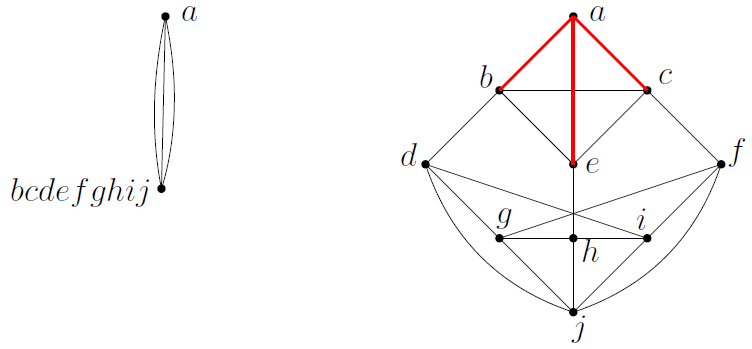
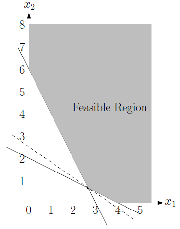
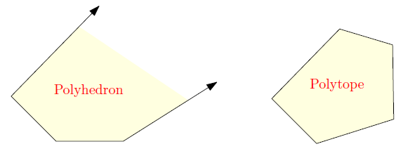
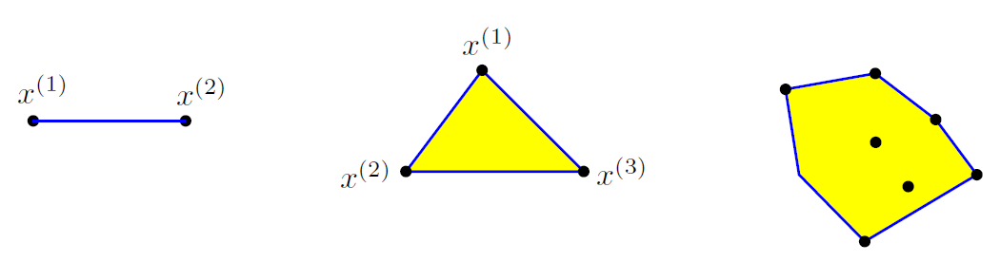
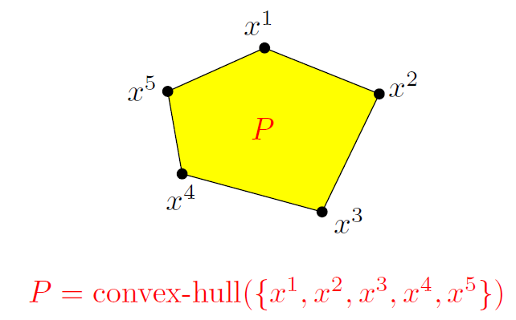
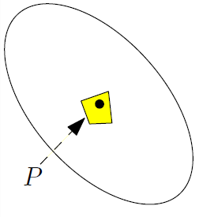
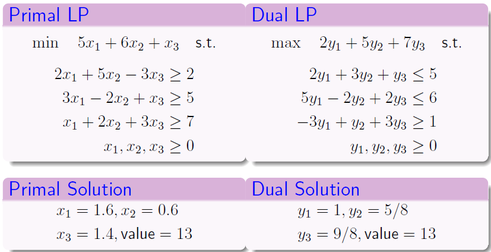

# Ch10. Advanced Topics

一些比较进阶的算法

## Randomized Algorithms

### Types

随机算法主要分为两类：

- 蒙特卡洛算法（Monta Carlo Algorithm）

这类算法满足存在确定的时间复杂度上界，但是输出可能错误

> 比如验证矩阵 $A \stackrel{?}{=} B$，可以只随机检查 $n$ 个元素而不是 $n^2$ 个全部元素，对某些场合（比如随机计算下的结果验证）有较高的正确率

- 拉斯维加斯算法（Las-Vegas Algorithm）

这类算法满足输出一定正确，但是没有确定的时间复杂度上界（我们会称期望的运行时间为 $T(n)$，而实际时间会有不确定性波动）

> 比如猴子排序算法是一种拉斯维加斯算法

---

假设一个问题存在拉斯维加斯算法 $A$，期望的运行时间为 $T(n)$。那么我们可以设计对应的蒙特卡洛算法：我们只允许让 $A$ 运行 $100T(n)$ 的时间，如果超时为输出则直接判定输出错误，否则输出结果（正确）

可以证明算法最终出错的概率不超过 $1\%$，可以借助马尔可夫不等式证明：

$$
\Pr[\text{Time}(A) > 100T(n)] \le \frac{E[X]}{100T(n)} = \frac{T(n)}{100T(n)} = \frac{1}{100}
$$

### Matrix Multiplication Verification

给定三个 $n$ 阶方阵 $A, B, C$，判断 $C = AB$ 是否成立

常规解法是直接进行矩阵计算，时间复杂度 $O(n^3)$，矩阵乘法优化后为 $O(n^{2.37})$

Freivald 算法避免计算矩阵与矩阵乘法，于是选择一个随机的 $n$ 长度向量 $r \in \{0,1\}^n$，计算

$$
A(Br) \stackrel{?}{=} Cr
$$

可以确认，如果 $AB = C$，则上式等号一定成立，输出 `True`；否则可以证明，它输出 `True` 的概率不超过 $1/2$

> 也就是说这个算法会概率出现单边错误（当且仅当正确输出为某一种时，预测输出会犯错），它属于 Monta Carlo algorithm

设定 $k$ 为重复次数，如果输出都为 `True`，则有 $1/2^k$ 的概率判断失误，当 $k$ 指定为一个较大的值时，这个算法的正确率是非常大的，并且时间复杂度依旧是 $O(n^2)$ 的

如果希望只有 $\delta$ 的概率出错，则需要 $O(\log \dfrac{1}{\delta})$ 的次数

### Global Min-Cut

在无向连通图中找到最小边割（删除后使图不连通的最小边数）

之前提到过，最典型的确定性做法是固定 $s$ 点，枚举所有 $t$ 点计算 s-t 最小割，返回最小值，时间复杂度 $O(n) \times O(最大流算法)$，比如 $O(n^3m)$

Stoer-Wagner 优化算法的时间复杂度为 $O(nm+n^2\log n)$

现在考虑随机化算法：

- **Karger 收缩算法**：在图中随机选一条边，将它的两个端点合并（缩点，保留平行边，删除自环），直到剩下两个节点，它们之间的边的个数就是一个割。时间复杂度可以为 $O(m)$

> 还有一种等价的算法：给所有的边赋值随机的 $[0,1]$ 之间的随机权重，跑一遍 MST，移除 MST 上权重最大的边，此时原图的顶点集被分隔为两个部分
>
> 连接跨两个部分的边则为算法找到的割集，单次时间复杂度 $O(m + n\log n)$

有一些性质：

- 如果最小割实际大小为 $c$，那么每个顶点的度数至少为 $c$，因此根据握手定理

$$
\sum_v d(v) = 2|E| \geq c \cdot |V|
$$

- 缩点期间，对于中间图 $G' = (V',E')$，单次随机选择边进行缩点，选到最小割 $|C|$ 的边的概率为

$$
P = \dfrac{|C|}{|E'|} \leq \dfrac{c}{c|V'|/2} = \dfrac{2}{|V'|}
$$

也就是说每一步迭代，收缩到最小割的边导致算法失败的概率不超过 $\dfrac{2}{|V'|}$

因此算法进行 $n-2$ 轮迭代，能保证算法成功的概率至少为

$$
\left( 1- \dfrac{2}{n} \right)\left( 1- \dfrac{2}{n-1} \right) \cdots \left( 1- \dfrac{2}{3} \right) = \dfrac{2}{n(n-1)}
$$

（从另一个角度来看，任何图最多有 $\dfrac{n(n-1)}{2}$ 个不同的最小割）

令 $A = \dfrac{n(n-1)}{2}$，如果运行 $Ak$ 次取最小结果，能得到最小割的概率至少为

$$
1-\left(1 - \dfrac{1}{A} \right)^{Ak} \geq 1 - e^{-k}
$$

如果我们希望概率达到 $1 - \delta$，则算法至少需要运行 $O(n^2 \log \dfrac{1}{\delta})$ 次，此时我们可以理解为总的时间复杂度为 $O(n^2 m\log \dfrac{1}{\delta})$

#### Karger-Stein

这个算法在 Karger 收缩算法的基础上加入了递归分治的操作，对于递归函数体：

- 如果定点数 $|V| \leq 6$，直接暴力求解最小割，输出结果
- 否则，运行一遍 Karger 收缩算法，但是收缩到 $\lceil n/\sqrt{2} \rceil + 1$ 个顶点就停下来。我们得到这个收缩后的图 $G'$
- 接下来，对于 $G'$，我们递归调用 Karger-Stein 算法**两次**，取较小者作为最小割结果

递归式 $T(n) = 2T\left(\dfrac{n}{\sqrt{2}}\right) + O(n^2)$，主定理求解得到 $T(n) = O(n^2\log n)$

相比原始 Karger $O(n^4)$ 级别的复杂度，Karger-Stein 的复杂度为 $O(n^2\log n)$

单次 Karger 算法从 $n$ 个顶点收缩到 $n/\sqrt{2}$ 个顶点的迭代过程中，能保证算法成功的概率（没有选到最小割边）至少为

$$
\left( 1- \dfrac{2}{n} \right)\left( 1- \dfrac{2}{n-1} \right) \cdots \left( 1- \dfrac{2}{n/\sqrt{2} + 2} \right) \approx \left(\dfrac{n/\sqrt{2}}{n} \right)^2 = \dfrac{1}{2}
$$

因此单次收缩过程的成功率不少于 $1/2$

在递归层次上，成功概率取决于两次子递归中至少有一次成功的概率，即：

$$
P(n) \geq 1 - \left(1-\dfrac{1}{2}P(\dfrac{n}{\sqrt2})\right)^2
$$

可以根据递归树进一步得到，$P(n) = \Omega(1/\log n)$，因此这个算法重复 $O(\log n)$ 的次数就能将正确概率上升到常量级别

> 对于点个数逐渐增大的图，Karger-Stein 算法的成功率下降的更慢（相比之下，原始 Karger 算法的成功率为 $\Omega(1/n^2)$ 的下降速率）

## Linear Programming

考虑一个线性规划问题（或者说优化问题），我们针对 $n$ 个非负变量进行线性约束，它可以被表示为若干个线性方程组，并以矩阵形式表示：

$$
Ax \geq b
$$

> 为了书写方便，省略了粗体表示

其中 $x = (x_1,\cdots,x_n)$ 是一组变量，我们最终需要最值化 $x$ 的某个线性组合 $c^{T}x$。我们可以写出这样的优化问题：

$$
\min \text{ or } \max c^T x
\\
s.t. \quad Ax \geq b, x_i \geq 0
$$

> 通常我们考虑 $\min$ 最优化问题，之后也会默认

注意到约束条件都取 $\geq$，此时变量的可行域（所有满足约束条件的 $x$ 的集合）会在这些约束面的“上方”，以二维变量为例：

### Convex

我们给出一些凸优化相关的前置定义：

- 可行域是一个多面体（Polyhedron），特别的，如果可行域的每个坐标都有上下界，则可行域是一个多胞形（Polytope）

容易发现，可行域（多面体）是一个凸集（集合内任意两点的连线，仍然完全在集合内）

- 考虑一组点 $x_i$，为每个点分配权重（满足权重和非负，总和为 $1$），然后求出所有点加权平均的坐标，称之为一个凸组合。不难发现，所有凸组合的结果一定落在这些点围成的最小凸区域内，我们称这个区域为凸包。凸包的特征只需要关注它的边界

- 在多面体 $P$ 中，如果一个点不能由其他任意两个点加权平均得到，那么这个点就是顶点（它不在任何两个点的连线的内部）

一个多面体的顶点数量是有限的，并且整个多面体就等于其所有顶点组成的凸包。这意味着，只要知道顶点，就能还原整个形状

> 总的来说，确定边界顶点和确定凸包是等价的

- 我们如何将顶点与线性规划进行关联：在 $n$ 维空间中，一个顶点至少需要 $n$ 个约束条件的边界同时相交才能确定，并且如果线性规划的最优解存在，那么一定可以在某个顶点上找到它

> 比较显然的，如果我们将点从顶点向内部移动，要么会直接使解更劣，要么会离更近的顶点最优解移动

（特殊的，以最小化问题为例，如果可行域为 $\emptyset$，则问题无解；如果可行域朝着目标函数减小的方向无限延伸，则最优值为 $-\infty$）

### Methods

结合凸集的性质，我们给出一些 LP 问题的求解算法

#### Simplex Method

单纯形法直接使用了“线性规划的最优解一定在某个顶点上”的结论，采用贪心爬山策略，从一个可行域的顶点出发，沿着多面体的边缘移动到相邻的顶点，并且要求每次移动必须使得目标函数 $c^T x$ 更优

重复上述过程，直到到达一个顶点，其所有相邻顶点都无法进一步改善目标函数值。该顶点即为最优解

理想情况下迭代次数为约束个数的两到三倍，最坏情况是指数级的 $O(2^n)$

> 此外平滑分析（Smoothed Analysis）指出，只要输入数据受到微小随机扰动，单纯形法的平均运行时间就是多项式级的

#### Interior Point Method

内点法不在边界上贪心爬山，而是在多面体内部寻找路径。与此同时，我们避免路径碰到边界导致算法失效，设计一种惩罚函数，在靠近边界时给出巨大的惩罚，迫使解始终保持在可行域内部

随着迭代的进行，解会逐渐逼近最优解的边界，最终达到任意接近最优解的程度（极高的精度）

这个算法理论上就是多项式时间复杂度，并且实际应用非常好

#### Ellipsoid Method

算法维护一个椭球体，确保它完全包含整个可行域

构造一个预言机 Oracle：检查当前椭球的**中心点**是否在可行域内

- 如果在，说明可行域非空（找到了一个有效解）
- 否则，通过一个“分离超平面”将椭球体沿中心切成两半，其中一半肯定不包含可行域。然后构造一个更小的新椭球体来包住含有可行域的那一半

不断缩小椭球体积，直到它小到足以确认可行性或判定不可行，当椭球体积足够小时，我们就能给出结论

---

这些算法的精确运行时间难以分析，特别是具体到计算机的浮点数计算，需要引入数值方法的相关分析。目前可以肯定的是，内点法和椭球法都是弱多项式时间（即算法的运行时间与输入的编码长度正相关），这意味着如果输入非常大，算法的运行时间也会受影响

判断是否存在强多项式复杂度的算法是 Open Problem

### Duality

我们直接举一个例子来理解对偶问题：

一个原始 LP 问题为：

$$
\begin{aligned}
& \min && 7x_1 + 4x_2 \\
& \text{s.t.} && x_1 + x_2 \geq 5 \\
& && x_1 + 2x_2 \geq 6 \\
& && 4x_1 + x_2 \geq 8 \\
& && x_1, x_2 \geq 0
\end{aligned}
$$

如果我们将每条约束的变量侧整体看作一个新的变量，即：

$$
\begin{cases}
y_1 = x_1 + x_2 \\
y_2 = x_1 + 2x_2 \\
y_3 = 4x_1 + x_2 \\
\end{cases}
$$

那么原始约束给出了 $y_1, y_2, y_3$ 三个新变量的直接下界。我们希望用这三个下界已知的变量表示原始优化目标 $7x_1 + 4x_2$

我们寻找系数使得

$$
\alpha_1 y_1 + \alpha_2 y_2 + \alpha_3 y_3 = 7x_1 + 4x_2
$$

将 $y_i$ 展开为 $x_i$ 的表达式得

$$
(α_1 + α_2 + 4α_3)x_1 + (α_1 + 2α_2 + α_3)x_2 = 7x_1 + 4x_2
$$

因此

$$
\begin{cases}
α_1 + α_2 + 4α_3 = 7 \\
α_1 + 2α_2 + α_3 = 4 \\
\end{cases}
$$

另一方面注意到 $y_i$ 存在下界约束，我们有

$$
\alpha_1 y_1 + \alpha_2 y_2 + \alpha_3 y_3 = 7x_1 + 4x_2\geq 5\alpha_1+6\alpha_2+8\alpha_3
$$

以上，我们得到了 $\alpha_i$ 和 $x_i$ 的一个不等式，以及 $\alpha_i$ 内部的边界情况（那两个等式）

我们将 $\alpha_i$ 重新写为 $y_i$，得到这样的问题：

$$
\begin{aligned}
& \max && 5y_1 + 6y_2 + 8y_3 \\
& \text{s.t.} && y_1 + y_2 + 4y_3 \leq 7 \\
& && y_1 + 2y_2 + y_3 \leq 4 \\
& && y_1, y_2, y_3 \geq 0
\end{aligned}
$$

我们得到了一个相对于原始问题的新问题，称之为对偶问题

---

事实上，我们可以总结上面的内容

对于原始问题（先不考虑等式约束）

$$
\begin{aligned}
& \min && c^T x \\
& \text{s.t.} && Ax \geq b \\
& && x_i \geq 0
\end{aligned}
$$

其对偶问题为

$$
\begin{aligned}
& \min && b^T y \\
& \text{s.t.} && A^{T}y \leq c \\
& && y_i \geq 0
\end{aligned}
$$

如果我们从拉格朗日函数的角度来看，我们记 $y_i \geq 0$ 为拉格朗日乘子，$L(x,y)$ 为拉格朗日函数，其中 $p_i(x)$ 对应约束条件中 $p_i(x) \leq 0$

$$
L(x,y) = f(x) + \sum_i y_i p_i(x)
$$

注意到每个包含拉格朗日乘子的项，为拉格朗日乘子本身乘以一个约束，当约束被违反时，对应的项大于零

显然，我想最小化这个拉格朗日函数，需要合理的构造 $y$ 的取值，使得这些约束是有意义的。换句话说，我们希望 $L$ 的值在 $x$ 的范围内满足上确界为原始目标，否则施加巨大惩罚，使上确界可以达到无限大（这样我们保证约束被满足）

$$
\sup_{y \ge 0} L(x, y) =
\begin{cases}
f(x) & \text{if } x \text{ is feasible} \\
+\infty & \text{otherwise}
\end{cases}
$$

在约束满足的情况下，我们需要最小化上确界。于是，**原始的约束问题等价于一个无约束的极小极大问题**：

$$
\inf_x \sup_{y \ge 0} L(x, y)
$$

这就是原始问题的拉格朗日形式

> 原始的约束问题为：选择 $x$ 的最小化目标，同时必须满足约束
>
> 换句话说，有一个虚拟对手会将约束体现为惩罚项，通过最大化惩罚来使其达到正无穷，导致目标无法最小化；而在 $x$ 选取足够正确的情况下，惩罚最大值只会为 0，目标就可以被正确的最小化
>
> 这就转化将约束极小问题转化为了无约束极小极大问题

我们不妨交换极大、极小约束为

$$
\sup_{y \ge 0} \inf_x L(x, y)
$$

定义对偶函数 $g(y) = \inf_x L(x, y)$，得到这样的问题

$$
\sup_{y \ge 0} g(y)
$$

> 我们通过对 $L(x,y)$ 求关于 $x$ 的偏导得到对偶函数，然后求上界

这就是原问题的对偶问题，它满足弱对偶性一定成立：

$$
d^{\ast} = \sup_{y \ge 0} \inf_x L(x, y) \leq \inf_x \sup_{y \ge 0} L(x, y) = p^{\ast}
$$

>基于开头提出的优化问题的写法，对弱对偶性给出一个利用基于原始问题的 $Ax \geq b$ 和对偶问题的 $A^{T}y \leq c$ 的证明
>
>$$
>\begin{align*}
>d^{\ast} = b^T y^* &\leq (Ax^*)^T y^* \\
>&= (x^*)^T A^T y^* \\
>&\leq (x^*)^T c \\
>&= c^T x^* = p^{\ast}
>\end{align*}
>$$
>
>

也就是说，无论是否为凸问题，**对偶问题的最优值 $d^\ast$ 永远是原始问题最优值 $p^{\ast}$ 的下界**。进一步的，如果原始问题是凸问题，且满足一些条件（比如 Slater 条件），则 $L(x,y)$ 在最优解处会存在一个鞍点 $(x^{\ast},y^\ast)$，满足：

$$
L(x^{\ast}, y) \leq L(x^{\ast}, y^{\ast}) \leq L(x, y^\ast)
$$

此时我们有 $d^\ast = p^\ast$，即对偶问题与原始问题的最优解相等

> 强对偶性的严格证明略（看不下去了）
>
> 给出一对强对偶性的例子
>
> 

### Max-flow

回顾最大流问题，我们可以将问题描述为线性规划的形式

$$
\begin{aligned}
& \max \sum_{e \in \delta_{\text{in}}(t)} x_e \\
& \text{s.t.} \quad x_e \leq c_e & & \forall e \in E \\
& \quad \sum_{e \in \delta_{\text{out}}(v)} x_e - \sum_{e \in \delta_{\text{in}}(v)} x_e = 0 & & \forall v \in V \setminus \{s, t\} \\
& \quad x_e \geq 0 & & \forall e \in E
\end{aligned}
$$

并且根据整数性定理，虽然这是一个线性规划问题（允许实数解），但只要所有边的容量 $c_e$ 是整数，那么这个线性规划的最优解一定是整数

我们直接给出它的对偶版本问题

$$
\begin{aligned}
\min \quad & \sum_{e \in E} c_e y_e \\
\text{s.t.} \quad & y_{(u,v)} + \alpha_u - \alpha_v \geq 0, \quad \forall (u,v) \in E \\
& \alpha_s = 0 \\
& \alpha_t = 1 \\
& y_e \geq 0, \quad \forall e \in E
\end{aligned}
$$

这就是最小割问题，因此说最大流-最小割定理成立

## (Weighted) Vertex Cover

顶点覆盖问题（Vertex Cover）希望找出最少的顶点，使得所有的边都至少有一个端点在覆盖集中；加权版本的问题则为每个顶点附加一个权重，找到权重和最小的顶点覆盖

这个问题与加权版本都是 NP-Complete 的，我们给出对这个问题的一些分析：

我们只考虑决策问题：是否存在大小不超过 $k$ 的顶点覆盖

### FPT

朴素方法的时间复杂度是 $O(k^n)$ 级别的，但是存在 $O(2^k \times kn)$ 的算法。为了不直接搜索所有顶点，我们利用边覆盖的约束，进行递归二分搜索：

考虑一个递归函数 `vc(G, k)`：

- 如果图的边已经全部被覆盖，则返回 `True`；如果 $k = 0$，返回 `False`
- 否则随机选择一条边 $(u,v)$，分别只覆盖 $u,v$ 递归为两个子函数
    - 返回 `vc(G-u, k-1) || vc(G-v, k-1)` 的结果

这样，我们将对于 $n$ 的指数级复杂度转化为了对于 $k$ 的指数级复杂度，它满足 $f(k)\cdot \text{poly}(n)$ 的时间复杂度格式，因此是一个 FPT 算法

### 2-Approximation Algorithm

我们定义一个近似算法为 $a$-Approximation Algorithm，如果这个算法能在多项式的时间复杂度内得到一个解 $x$，它相对于最优解 $x^\ast$ 的差异不会超过 $a$ 的比例（取决于最小化还是最大化）

思考一个贪心的算法，既然顶点覆盖要求顶点数尽可能小，那么贪心选择度数最大的顶点进行覆盖，不会得到一个太差的解。事实上它的近似比是 $\ln n + 1$ 的，这个界是紧的（存在例子使得贪心算法表现极差）

> 也就是说这个算法可以被特殊构造最坏化实际表现

事实上，有一个更朴素的算法，每次随机选一条边，把两个顶点都加入顶点集，然后删除与 $u,v$ 的所有连边

我们记选择的边集合 $E'$，那么覆盖集 $C$ 的大小 $|C| = 2|E'|$。而最优解需要覆盖这 $|E'|$ 条互不相邻的边，至少需要 $|E'|$ 个顶点

因此 $|C| = 2|E'| \leq 2|C^\ast|$，这个算法是 2-近似的

---

现在我们考虑带权顶点覆盖的最优化问题，约定变量 $x_v \in \{0,1\}$ 表示是否选择顶点 $v$，则题目可表述为

$$
\begin{aligned}
\min \quad & \sum_{v \in V} w_v x_v \\
\text{s.t.} \quad
& x_u + x_v \geq 1, \quad \forall (u,v) \in E \\
& x_v \in \{ 0,1 \}
\end{aligned}
$$

（$x_u + x_v \geq 1$ 即每条边至少有一个顶点被选中）

这个问题要求 $x_v$ 为整数，它不是线性规划问题。不妨对这个约束松弛化，改写为线性约束的版本：

$$
\begin{aligned}
\min \quad & \sum_{v \in V} w_v x_v \\
\text{s.t.} \quad
& x_u + x_v \geq 1, \quad \forall (u,v) \in E \\
& x_v \in {\color{orange}[ 0,1 ]}
\end{aligned}
$$

我们记 IP 为原问题的最优解，LP 为线性规划问题的最优解，则

$$
LP \leq IP
$$

> 比较显然的，LP 相比 IP 弱化了约束条件，因此得到的解会比原始解更小

为了具体构造出合法的顶点覆盖集，我们采用四舍五入，将所有 $x_u \geq 0.5$ 的顶点 $u$ 纳入顶点覆盖集 $S$，那么 $S$ 一定是一个合法覆盖

> 也比较显然的，既然最优解也满足 $x^\ast_u + x^\ast_v \geq 1$，说明最优解中 $u,v$ 总有至少一个不小于 $0.5$，而不小于 $0.5$ 的点都被纳入到了 LP 顶点覆盖集
>
> 进一步的，$\text{cost}(S) \leq 2 \cdot LP \leq 2\cdot IP$，因此**这是一个 2-近似算法**

---

不妨从对偶问题的方向继续考虑，不妨考虑原线性约束问题为

$$
\begin{aligned}
\min \quad & \sum_{v \in V} w_v x_v \\
\text{s.t.} \quad
& x_u + x_v \geq 1, \quad && \forall (u,v) \in E \\
& x_v \geq 0,\quad && \forall v \in V
\end{aligned}
$$

构造拉格朗日函数，将边的形式重写为点的形式

$$
\begin{align*}
L(x, y) &= \sum_{v \in V} w_v x_v - \sum_{(u,v) \in E} y_{uv} \cdot (x_u + x_v - 1)
\\
&= \sum_{v \in V} \left( w_v - \sum_{e \in \delta(v)} y_e \right) x_v + \sum_{e \in E} y_e
\end{align*}
$$

因此，$\sum_{e \in E} y_e$ 是目标项，而以下是约束项

$$
\sum_{e \in \delta(v)} y_e \le w_v, \quad \forall v \in V
$$

因此有完整的对偶问题

$$
\begin{align*}
\text{(Dual)} \quad \text{max} \quad & \sum_{e \in E} y_e \\
\text{s.t.} \quad & \sum_{e \in \delta(v)} y_e \le w_v, \quad \forall v \in V \\
& y_e \ge 0, \quad \forall e \in E
\end{align*}
$$

对应的解答也是一个 2-近似算法
