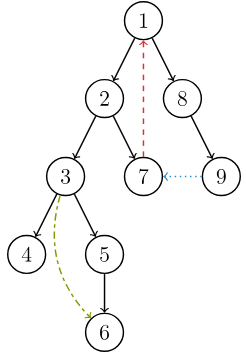
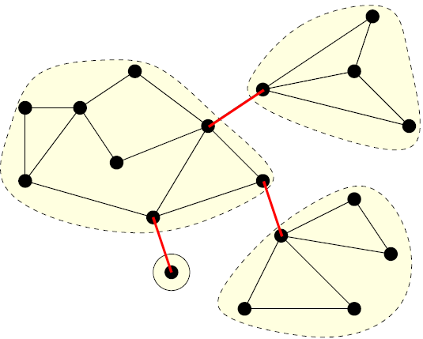
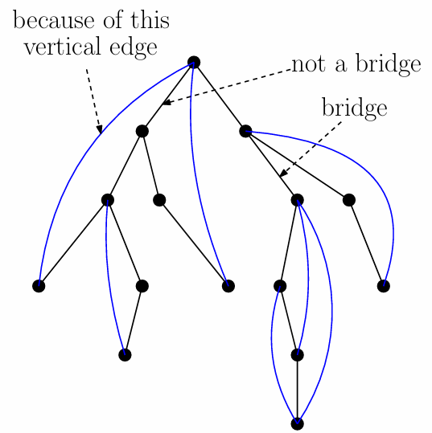
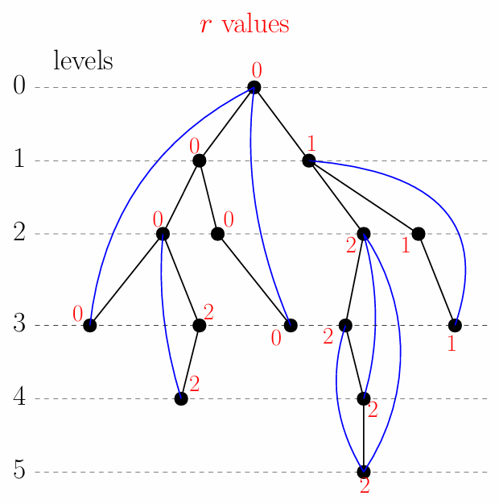
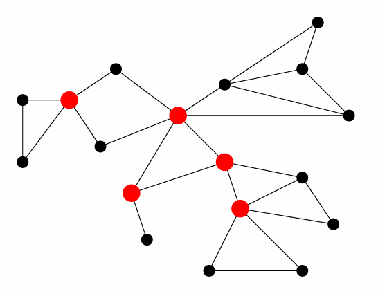
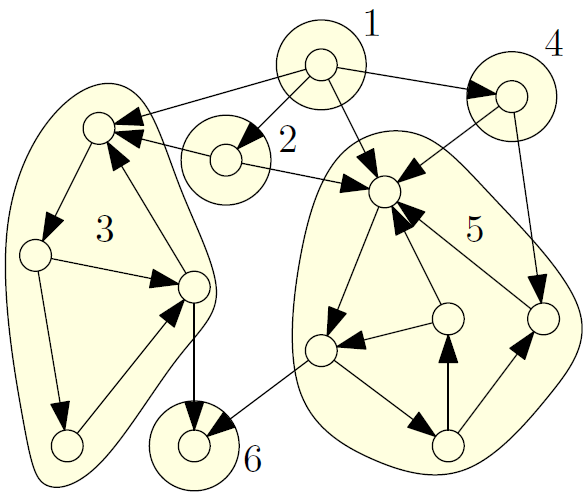

# Ch2. Basic Graph Algorithms

## Graph

我们用 $G = (V, E)$ 来简单描述一个图

- $V$：顶点的集合
- $E$：$V$ 中顶点之间的成对关系

相应地：

- $n$：顶点数
- $m$：边数
    - 对于连通简单图（无重边），$n - 1 \leq m \leq n(n-1)/2$
- $d_{v}$：$v$ 的邻居数

我们可以使用邻接矩阵或链表来存储一个图

- 邻接矩阵：一个 $n\times n$ 的矩阵，若 $(u, v) \not\in E$ 则 $A[u, v] = 0$，否则 $A[u, v] = \text{weigh}(u, v)$
- 链表：对于每个 $v$，都有一个包含 $v$ 所有邻居的链表

|                          | 矩阵       | 链表       |
| ------------------------ | ---------- | ---------- |
| 空间复杂度               | $O(n^{2})$ | $O(m)$     |
| 检查 $ (u,v) ∈ E$ 的时间 | $O(1)$     | $O(d_{u})$ |
| 列出 $v$ 的邻居的时间    | $O(n)$     | $O(d_{v})$ |

## Connectivity && Traversal

我们可以使用 BFS 或 DFS 来遍历一个图，并检查其连通性

```pseudocode
Connectivity Problem
Input: graph G = (V,E), (using linked lists) two vertices s,t ∈ V
Output: whether there is a path connecting s to t in G
```

```pascal title="BFS"
BFS(s):
    head <- 1,tail <- 1,queue[1] <- s
    mark s as "visited" and all other vertices as "unvisited"
    while head ≤ tail do
        v <- queue[head], head <- head+1
        for all neighbours u of v do
            if u is "unvisited" then
                tail <- tail + 1, queue[tail] = u
                mark u as "visited"
```

```pascal title="DFS"
DFS(v):
    mark v as "visited"
    for each neighbour u of v do
        if u is "unvisited" then DFS(u)


Connectivity(G): 
    mark all vertices as "unvisited"
    DFS(s)
```

BFS 和 DFS 都花费 $O(n + m)$ 时间和 $O(n)$ 空间

### Bipartiteness

一个图 $ G = (V, E) $ 是一个**二分图**，如果存在一个将 $ V $ 划分为两个集合 $ L $ 和 $ R $ 的分割，使得对于每条边 $ (u, v) \in E $，我们有 $u \in L, v \in R $ 或者 $ v \in L, u \in R $

也就是说可以仅用两种颜色为所有顶点着色，使得没有两个相邻的顶点共享相同的颜色

因此我们可以遍历该图来确认图的二分性。对于 $u$ 的邻居 $v$，如果它未着色，则用与 $u$ 相反的颜色为其着色。如果它已着色，且与 $u$ 颜色相同，则停止遍历，确认该图不是二分图。如果遍历完成且没有冲突，则该图是二分图

BFS 是比 DFS 更好的选择，因为 BFS 逐层遍历图，其中同一层的顶点共享相同的颜色，而相邻层的顶点具有不同的颜色

## Topological Ordering

对于一个 DAG（有向无环图），我们总能找到一个排序，使得如果 $(u, v) \in E$，那么在该排序中 $u$ 一定出现在 $v$ 之前。我们称这个排序为“拓扑序”

我们使用 <u>Kahn Algorithm</u> 来构建一个拓扑序，顺便也可以检查一个图是否为 DAG

```pascal title="toposort"
topological-sort(G): 
    let d[v] <- 0 for every v ∈ V
    for every v ∈ V do
        for every u such that (v,u) ∈ E do
            d[u] <- d[u] + 1
    S <- {v : d[v] = 0}, i <- 0
    while S ̸≠ ∅ do
        v <- arbitrary vertex in S, S <- S \ {v}
        i <- i + 1, π(v) <- i
        for every u such that (v,u) ∈ E do
            du <- du − 1
            if du = 0 then add u to S                # core code
    if i < n then output "not a DAG"                 # find a circle
```

S 可以用一个队列或一个栈来表示

运行时间 = $O(n+m)$，因为每个顶点和每条边都需要处理一次

## DFS tree

考虑一个连通图的 DFS 树。以有向 DFS 树为例



我们可以将图的边分为四种类型：

- **树边**，构成 DFS 树的边（否则该边不在 DFS 树中）
- <font color="#de3e3b">**回边**</font>，从子节点指向祖先节点的边
- <font color="#9faf36">**前向边**</font>，也是从祖先节点指向子节点的边，但不在 DFS 树中
    - 回边和前向边亦称“纵向边”
- <font color="#3392d5">**交叉边**</font>，不属于上述三种类型
    - 亦称“横向边”

> - 对于所有交叉边 $(u, v)$，我们可以证明 $v$ 比 $u$ 更早被访问
>
> （证明如果 $v$ 比 $u$ 更晚被访问，它只能是树边或前向边）
>
> （也就说所有的交叉边都叫做 leftwards horizontal edges，不存在 rightward）
> 
> - 对于<u>无向</u> DFS 树，我们可以证明交叉边（横向边）不存在
>
> （对于无向图 $(u, v) = (v, u)$，如果 $(u, v)$ 是交叉边，那么 $(v, u)$ 必定是树边，矛盾）

## Bridge

给定 $G = (V,E)$，如果从 $G$ 中移除 $e ∈E$ 会增加其连通分量的数量，则称 $e$ 为桥



一个图 $G = (V,E)$ 是 2-边-连通的，如果对于每对 $u, v ∈ V$，存在两条边不相交的路径连接 $u$ 和 $v$

> 设 $B$ 为图 $G = (V,E)$ 中桥的集合。那么，$(V,E \backslash B)$ 中的每个连通分量都是 2-边-连通的。每个这样的分量称为 $G$ 的一个 2-边-连通分量

### Find bridges

显然，如果一条边 $(u, v)$ 参与构成一个环，它必定不是桥

否则我们可以判定就是桥（至少使得 $u,v$ 分割为两个连通分量）

也就是说，一条候选桥可能因为某条纵向边而变成非桥



为了找到所有的 Bridge，我们需要定义一些项：

- $v.l$：DFS 树中顶点 $v$ 的层级
- $T_v$：以 $v$ 为根的子树
- $v.r$：从 $T_v$ 通过一条纵向边能到达的最小层级
- $(parent(u),u)$ 是桥当且仅当 $u.r  >= u.l$
    - 因为某条纵向边使 $(v, u)$ 成为环的一部分



然后给出伪代码：

```pascal title="DFS"
DFS(v):
    mark v as "visited"
    v.r <- ∞
    for all neighbours u of v do
        if u is unvisited then                  // u is a child of v
            u.l <- v.l + 1                      // add the level of child
            DFS(u)
            
            if u.r  >= u.l then                 // found a circle
                claim (v,u) is a bridge
            if u.r < v.r then
                v.r <- u.r                      // update v.r = min(u.r, v.r)
        
        else if u.l < v.l − 1 then              // u is ancestor but not parent
            if u.l < v.r then
                v.r <- u.l                      // update v.r = min(u.l, v.r)


finding-bridges(G):
    mark all vertices as “unvisited”
    for every v ∈ V do
        if v is unvisited then
        v.l <- 0
        DFS(v)
```

## Cut vertex

“桥”的顶点版本

一个顶点是 $G=(V,E)$ 的割点，如果移除它会增加 $G$ 的连通分量的数量



一个图 $G = (V,E)$ 是 2-（顶点）连通的（或双连通），如果对于每对 $u,v ∈ V$，在 $u$ 和 $v$ 之间存在两条内部不相交的路径

> 一个 $|V|  >= 3$ 的图 $G=(V,E)$ 不包含割点，当且仅当它是双连通的

### Find cut vertices

和找 Bridge 的代码几乎相同，让 LLMs 写一个：

```pascal title="DFS"
DFS(v):
    mark v as "visited"
    v.r <- v.l                                 // initialize v.r to its own level
                                               // v.r <- ∞ is OK
    for all neighbours u of v do
        if u is unvisited then                 // u is a child of v
            u.l <- v.l + 1                     // set the level of child
            DFS(u)
            
            if u.r  >= v.l then                // no back edge from subtree to ancestor of v
                claim v is a cut vertex        // v separates u's subtree (except for root)
            if u.r < v.r then
                v.r <- u.r                     // update v.r = min(u.r, v.r)
        
        else if u.l < v.l − 1 then             // u is ancestor but not parent (back edge)
            if u.l < v.r then
                v.r <- u.l                     // update v.r = min(u.l, v.r)


finding-cut-vertices(G):
    mark all vertices as "unvisited"
    for every v ∈ V do
        if v is unvisited then
            v.l <- 0
            DFS(v)
            if v has  >= 2 children              // special check
                claim v is a cut vertex
```

## Strong Connectivity

现在考虑<u>有向图</u>，此时如果存在 $u\to v$ 的路径，不一定存在 $v \to u$ 的路径

我们定义一个图是强连通的，如果任取两个顶点 $u, v$，都可以互相抵达

定义图的强连通分量（SCC），指的是指图中最大的强连通子图



图中的每个黄色区域都对应着该图的一个 SCC

**我们注意到，SCC 中的每个元素都互相可达，如果将图中的每个 SCC 看作一个顶点（缩点操作），那么缩点后的新图一定是一个 DAG**

> 否则不是 DAG 的话，环的部分一定可以构成新的 SCC

### Find SCCs

我们先分析如何确认一个有向图 $G$ 是强连通的：对于给定的一个点 $s$，存在 $s$ 到其他任何点的路径，也存在其他所有点到 $s$ 的路径

> 此时 $s$ 就是一个中转站，所有的点可以通过 $s$ 抵达其他任意点
>
> 事实上如果这一条件成立，任何点都可以是中转站，因此 $s$ 的选择也是任意的

因此我们可以用任意的遍历算法（BFS or DFS），从 $s$ 出发，分别对 $G$ 和 $G$ 的反图做一次遍历，分别判断是否可以抵达其他任何的顶点

如果都可以，说明整个图是强连通的

---

接下来，如何找到一个有向图 $G$ 的所有强连通分量？我们使用 Tarjan 算法

我们先给出一些引理：

???+ success "Lemma: 如果 $u, v$ 在同一个 SCC 中，则 $u, v$ 在 DFS 树上的最近公共祖先 LCA 也属于同一个 SCC"

    因此**一个 SCC 在 DFS 树上的形态必然是一棵子树，不会出现分支逃出子树后再绕回到子树内的情况**

因此寻找 SCC 的关键在于找到树的根（LCA），我们给出一个中间算法：

```pascal title="Intermediate Algorithm"
build the DFS tree T
while T is not empty do
    find the first vertex v in the posterior-order-traversal of T
satisfying the following property: there are no edges from Tv to
outside Tv
    claim vertices in Tv as a SCC, remove them from T and all
edges incident to them from T and G
```

我们构建 DFS 树 T，循环下面的操作直到树被清空：

- 找到后序遍历中的第一个 $v$，其满足 $T_{v}$ 没有指向树外部的边
- 将 $T_v$ 标记为一个 SCC，将整个 $T_{v}$ 在 DFS 树上（标记为）删除

???+ success "Lemma: 这样的 $T_{v}$ 一定是一个 SCC"

    我们需要依次证明：
    
    - 从 $v$ 可以到达 $T_v$ 中的任意节点
    
    显然从树的根节点可以抵达所有后代节点
    
    - 从 $T_v$ 中的任意节点 $u$ 可以抵达根节点 $v$
    
    也就是说对于任意的 $u \in T_{v}$，都存在一条回到 $v$ 的有向路径
    
    我们定义集合 $U$ 为所有在 $T_v$ 中的，无法到达 $v$ 的点。反设存在某个 $u$ 无法抵达 $v$，则 $U \ne \empty$
    
    我们记 $w$ 为 $U$ 中 DFS 序中最小的节点，DFS 树上一定存在 $v \to w$ 的路径。现在考察所有从 $w$ 出发的有向边 $(w,t)$，$t \in T_{v}$
    
    - 如果 $t \not\in U$，则 $w$ 可以通过 $t$ 到达 $v$，矛盾
    
    因此 $t \in U$。从 $w$ 出发的所有边都一定会在 $U$ 的范围内
    
    $w$ 为 $U$ 中 DFS 序中最小的节点，因此 $w$ 没有任何边指向 DFS 比它更小的顶点（比如不会有回边 / 交叉边这样的边出现）
    
    当我们在执行 Intermediate Algorithm 算法时，在回溯离开某个顶点时，如果它没有边指向更早的顶点，那么它早已作为一个 SCC 的根被弹出
    
    也就是说，在扫描出 $T_{v}$ 这样的一个封闭子树之前，$w$ 应该是一个已经在 DFS 树上被删除的 SCC。这与 $w$ 依旧是 $T_{v}$ 上的一个顶点矛盾
    
    （可以一句话概括为：$U$ 中最先被访问的点一定已经被判定为单独的 SCC 而被删除，不可能直到判定 $T_v$ 时还存在）
    
    综上从 $T_v$ 中的任意节点 $u$ 可以抵达根节点 $v$
    
    此外，因为 $T_{v}$ 没有指向树外部的边，所以可以保证这个 SCC 满足极大性

---

我们证明了 **Intermediate Algorithm** 伪代码的正确性，具体如何实现这一算法？

Tarjan 算法的核心就是高效地判定“找到 $v$ 使得 $T_{v}$ 没有指向树外部的边”何时成立

我们首先将所有顶点划分为下面的状态：

- `unvisited`：表示尚未被 DFS 访问
- `visited`：表示被 DFS 访问
    - `alive`：表示尚未确认属于某个 SCC 中
    - `departed`：表示已经确认属于某个 SCC 中，被标记为删除

接下来，我们用一个栈 `stack` 按照 DFS 访问顺序存储 `alive` 的顶点，顺便用布尔数组 `onstack[v]` 记录 `v` 是否在 `stack` 上（即 `alive`）

对于每一个顶点，我们记录：

- `v.i`：顶点的 DFS 发现序号（`dfn`）
- `v.r`：从 `v` 出发，只经过 `alive` 的顶点，能够到达的最小 `i` 值

我们给出伪代码，它和 find bridge 的节点参数更新逻辑比较相似：

（`v.i <- ⊥` 表示 unvisited）

``` pascal title="Tarjan's SSC Algorithm"
DFS(v)
    i <- i + 1, v.i <- i, v.r <- i
    stack.push(v), onstack[v] <- true
    for every outgoing edge (v, u) of v do
        if u.i = ⊥ then
            DFS(u)
        if onstack[u] and u.r < v.r then
            v.r <- u.r
    if v.r = v.i then
    	# 将 v 及之后的所有子节点作为一棵子树，退栈，标记为一个 SCC
        pop all vertices in stack after v, including v itself
        set onstack of these vertices to be false
        declare that these vertices form an SCC

find_SCC():
    stack <- empty stack, i <- 0
    for every v ∈ V do: v.i <- ⊥, onstack[i] <- false
    for every v ∈ V do
        if v.i = ⊥ then DFS(v)
```

算法遍历每一条边和每一个顶点一次，时间复杂度 $O(n+m)$

